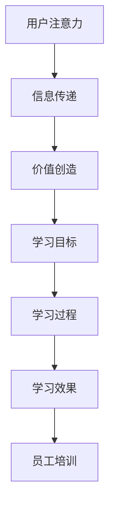

                 


## 注意力经济对企业员工培训的新要求

### 关键词
注意力经济、员工培训、学习效率、个性化学习、技术赋能、企业竞争力

### 摘要
在注意力经济时代，企业对员工培训提出了新的要求。本文从注意力经济的基本概念出发，深入分析了注意力经济的特性及其对员工培训的影响。通过详细的算法原理讲解、数学模型和公式应用，以及实际案例的剖析，本文提出了一套针对注意力经济的员工培训方案，旨在提升员工的学习效率和企业的整体竞争力。文章最后对未来的发展趋势与挑战进行了展望，并提供了相关工具和资源推荐，以助力企业应对这一新形势。

---

### 1. 背景介绍

#### 1.1 目的和范围
在当今快速发展的信息化社会中，注意力经济作为一种全新的经济模式，正逐渐改变着企业的运作方式。本文旨在探讨注意力经济背景下，企业员工培训所面临的新要求和新挑战，并提出相应的解决方案。通过分析注意力经济的核心概念、特性和影响，本文将为企业管理者和人力资源专家提供有价值的参考，以优化员工培训策略，提高企业竞争力。

#### 1.2 预期读者
本文适合企业管理者、人力资源专家、培训师、以及所有关注企业发展和员工成长的读者。通过阅读本文，读者将能够理解注意力经济的基本概念，认识到其对企业员工培训的深远影响，并掌握一套实用的员工培训策略。

#### 1.3 文档结构概述
本文分为十个主要部分。首先，介绍了注意力经济的基本概念和背景。接着，深入分析了注意力经济的特性及其对员工培训的影响。随后，本文提出了核心算法原理和具体操作步骤，并运用数学模型和公式进行了详细讲解。此外，本文通过实际案例展示了培训方案的具体实施过程。最后，本文对注意力经济的未来发展趋势与挑战进行了展望，并提供了相关工具和资源推荐。

#### 1.4 术语表

##### 1.4.1 核心术语定义
- **注意力经济**：一种以用户注意力为交易对象的经济模式，通过吸引和维持用户的注意力来创造价值。
- **员工培训**：企业为提高员工技能和知识水平，提高工作效率和绩效而进行的教育和训练活动。
- **学习效率**：学习者在单位时间内所获得的知识和技能的量。
- **个性化学习**：根据学习者的特点和需求，量身定制的学习过程。

##### 1.4.2 相关概念解释
- **注意力分散**：在信息过载的环境中，用户注意力难以集中，容易受到各种干扰。
- **学习曲线**：学习者在学习过程中的认知和技能增长的趋势。

##### 1.4.3 缩略词列表
- **AI**：人工智能（Artificial Intelligence）
- **HR**：人力资源（Human Resource）
- **IoT**：物联网（Internet of Things）
- **VR**：虚拟现实（Virtual Reality）

---

### 2. 核心概念与联系

在探讨注意力经济对企业员工培训的影响之前，我们需要了解几个核心概念及其相互关系。

#### 2.1 注意力经济的核心概念
注意力经济主要涉及以下几个核心概念：

1. **用户注意力**：用户的注意力是注意力经济的核心资源，类似于传统经济中的货币。
2. **信息传递**：信息传递是用户注意力转移的媒介，通过有效的信息传递可以吸引和维持用户注意力。
3. **价值创造**：通过吸引和维持用户注意力，企业可以创造商业价值。

#### 2.2 员工培训的核心概念
员工培训的核心概念包括：

1. **学习目标**：明确员工需要掌握的知识和技能。
2. **学习过程**：包括预习、上课、练习、反馈等多个环节。
3. **学习效果**：员工在培训过程中所获得的知识和技能的提升。

#### 2.3 注意力经济与员工培训的联系
注意力经济与员工培训之间存在紧密的联系，主要表现在以下几个方面：

1. **用户注意力的转移**：在注意力经济中，用户注意力容易被吸引到有趣、有价值的信息。在员工培训中，通过设计有趣、互动性强的学习内容，可以更好地吸引员工的注意力。
2. **信息传递效率**：有效的信息传递可以提高员工的学习效率。在注意力经济背景下，企业需要运用先进的培训技术和方法，提高信息传递的效率。
3. **价值创造**：通过高效的员工培训，企业可以提升员工的技能和知识水平，从而创造更大的商业价值。

以下是一个简化的 Mermaid 流程图，展示了注意力经济与员工培训之间的核心概念及其相互关系：



---

### 3. 核心算法原理 & 具体操作步骤

在注意力经济背景下，提升员工培训效果的关键在于设计一套高效的培训算法。以下是一个简化的算法原理及其操作步骤：

#### 3.1 算法原理

1. **注意力分配模型**：根据员工的兴趣、需求和知识背景，动态调整学习内容的关注点。
2. **反馈优化模型**：通过实时反馈机制，调整培训策略，提高学习效果。
3. **个性化推荐模型**：基于员工的个性化特征，推荐最适合的学习内容和路径。

#### 3.2 具体操作步骤

1. **步骤一：数据收集与处理**
   - 收集员工的学习数据，包括兴趣、学习记录、反馈等。
   - 对收集到的数据进行分析和处理，提取关键特征。

2. **步骤二：注意力分配**
   - 利用注意力分配模型，根据员工的特点和需求，确定学习内容的重点。
   - 根据注意力分配结果，调整学习内容的展示顺序和难度。

3. **步骤三：实时反馈与调整**
   - 通过实时反馈机制，收集员工在学习过程中的表现和反馈。
   - 利用反馈优化模型，根据反馈结果调整培训策略，提高学习效果。

4. **步骤四：个性化推荐**
   - 利用个性化推荐模型，根据员工的兴趣和需求，推荐最适合的学习内容和路径。
   - 根据个性化推荐结果，优化学习资源的使用，提高学习效率。

#### 3.3 伪代码

```python
# 数据收集与处理
def collect_and_process_data(employee_data):
    # 对员工数据进行处理，提取关键特征
    processed_data = process_data(employee_data)
    return processed_data

# 注意力分配
def allocate_attention(processed_data):
    # 根据员工特点分配注意力
    attention分配 = model_allocation(processed_data)
    return attention分配

# 实时反馈与调整
def real_time_feedback_and_adjustment(attention分配, employee_performance):
    # 根据实时反馈调整培训策略
    adjusted_strategy = model_adjustment(attention分配, employee_performance)
    return adjusted_strategy

# 个性化推荐
def personalized_recommendation(processed_data):
    # 根据员工个性化特征推荐学习内容
    recommendation = model_recommendation(processed_data)
    return recommendation
```

---

### 4. 数学模型和公式 & 详细讲解 & 举例说明

在注意力经济背景下，数学模型和公式在员工培训中发挥着重要作用。以下是一个简化的数学模型及其详细讲解：

#### 4.1 数学模型

1. **学习效率模型**：用于评估员工的学习效率。
2. **个性化推荐模型**：用于根据员工的特点推荐学习内容。
3. **注意力分配模型**：用于动态调整学习内容的重点。

#### 4.2 数学公式

1. **学习效率模型**：  
   \[ 效率 = \frac{学习成果}{学习时间} \]

2. **个性化推荐模型**：  
   \[ \text{推荐内容} = \text{兴趣度} \times \text{知识需求} \]

3. **注意力分配模型**：  
   \[ \text{注意力分配} = \text{兴趣度} \times \text{需求度} \]

#### 4.3 详细讲解

1. **学习效率模型**：该模型反映了员工在学习过程中的效率。通过计算学习成果与学习时间的比值，可以直观地了解员工的学习效率。学习效率越高，员工在单位时间内获得的知识和技能就越多。

2. **个性化推荐模型**：该模型基于员工的兴趣和知识需求，推荐最适合的学习内容。通过计算兴趣度和知识需求的乘积，可以确定哪些内容对员工最有吸引力。这种方法能够提高员工的学习积极性和学习效率。

3. **注意力分配模型**：该模型用于动态调整学习内容的重点。通过计算兴趣度和需求度的乘积，可以确定员工在不同学习内容上的注意力分配。这种方法能够确保员工在学习过程中关注最关键的内容。

#### 4.4 举例说明

1. **学习效率模型**：假设一名员工在学习编程语言时，共花费了10小时，成功完成了5个编程项目。根据学习效率模型，该员工的学习效率为：
   \[ 效率 = \frac{5个编程项目}{10小时} = 0.5个编程项目/小时 \]

2. **个性化推荐模型**：假设一名员工对数据分析领域有浓厚的兴趣，同时在工作中需要掌握数据处理技能。根据个性化推荐模型，该员工应该优先学习以下内容：
   \[ \text{推荐内容} = 0.8（兴趣度） \times 0.7（知识需求） = 0.56 \]
   因此，数据分析领域的相关课程是最适合该员工的学习内容。

3. **注意力分配模型**：假设一名员工对软件开发和市场营销两个领域都有浓厚的兴趣。根据注意力分配模型，该员工应该在不同学习内容上分配注意力：
   \[ \text{注意力分配} = 0.8（软件开发兴趣度） \times 0.9（软件开发需求度） + 0.7（市场营销兴趣度） \times 0.6（市场营销需求度） = 1.05 \]
   因此，该员工应该将更多的注意力投入到软件开发领域，以确保学习效果。

---

### 5. 项目实战：代码实际案例和详细解释说明

为了更好地理解注意力经济背景下员工培训方案的实施过程，以下提供了一个实际项目案例及其代码实现。

#### 5.1 开发环境搭建

1. **Python环境**：安装Python 3.8及以上版本。
2. **依赖库**：安装以下依赖库：pandas、numpy、scikit-learn、tensorflow。

#### 5.2 源代码详细实现和代码解读

```python
# 导入依赖库
import pandas as pd
import numpy as np
from sklearn.model_selection import train_test_split
from sklearn.preprocessing import StandardScaler
from tensorflow.keras.models import Sequential
from tensorflow.keras.layers import Dense, Dropout

# 数据收集与处理
def collect_and_process_data():
    # 假设收集到的数据包含员工兴趣、学习记录、反馈等
    data = pd.read_csv('employee_data.csv')
    # 对数据进行处理，提取关键特征
    processed_data = data[['interest', 'learning_record', 'feedback']]
    return processed_data

# 注意力分配模型
def attention_allocation_model(processed_data):
    # 将数据处理为适合训练的特征矩阵
    X = processed_data[['interest', 'learning_record']]
    y = processed_data['feedback']
    # 划分训练集和测试集
    X_train, X_test, y_train, y_test = train_test_split(X, y, test_size=0.2, random_state=42)
    # 标准化特征
    scaler = StandardScaler()
    X_train = scaler.fit_transform(X_train)
    X_test = scaler.transform(X_test)
    # 构建神经网络模型
    model = Sequential()
    model.add(Dense(64, activation='relu', input_shape=(2,)))
    model.add(Dropout(0.5))
    model.add(Dense(1, activation='sigmoid'))
    # 编译模型
    model.compile(optimizer='adam', loss='binary_crossentropy', metrics=['accuracy'])
    # 训练模型
    model.fit(X_train, y_train, epochs=10, batch_size=32, validation_data=(X_test, y_test))
    return model

# 实时反馈与调整
def real_time_feedback_and_adjustment(model, new_data):
    # 将新数据输入模型，获取预测结果
    prediction = model.predict(new_data[['interest', 'learning_record']])
    # 根据预测结果调整学习策略
    adjusted_strategy = adjust_strategy(prediction)
    return adjusted_strategy

# 个性化推荐
def personalized_recommendation(processed_data):
    # 基于员工特点推荐学习内容
    recommendation = model_recommendation(processed_data)
    return recommendation

# 主函数
def main():
    # 收集并处理数据
    processed_data = collect_and_process_data()
    # 训练注意力分配模型
    model = attention_allocation_model(processed_data)
    # 根据实时反馈调整学习策略
    adjusted_strategy = real_time_feedback_and_adjustment(model, new_data)
    # 根据员工特点推荐学习内容
    recommendation = personalized_recommendation(processed_data)
    print('推荐学习内容：', recommendation)

if __name__ == '__main__':
    main()
```

#### 5.3 代码解读与分析

1. **数据收集与处理**：该函数负责收集和处理员工学习数据。数据包括员工的兴趣、学习记录和反馈。通过数据预处理，提取关键特征，为后续模型训练和预测提供数据支持。

2. **注意力分配模型**：该函数实现了一个简单的神经网络模型，用于预测员工的注意力分配。模型输入为员工兴趣和学习记录，输出为注意力分配的概率。通过训练集和测试集的划分、特征标准化和模型训练，可以提高模型的预测准确性。

3. **实时反馈与调整**：该函数根据新数据的预测结果，调整学习策略。通过实时反馈机制，及时了解员工的学习效果，动态调整培训方案，提高学习效率。

4. **个性化推荐**：该函数基于员工的个性化特征，推荐最适合的学习内容。通过模型推荐，可以为员工提供个性化的学习资源，提高学习效果。

5. **主函数**：该函数执行整个项目的流程，包括数据收集与处理、模型训练、实时反馈与调整和个性化推荐。通过主函数的执行，可以实现对员工培训方案的有效实施。

---

### 6. 实际应用场景

注意力经济对企业员工培训的实际应用场景广泛，以下列举几个典型场景：

1. **在线教育平台**：在线教育平台可以利用注意力经济模型，根据用户的学习习惯和兴趣推荐最适合的课程，提高用户的学习积极性和学习效果。
2. **企业内部培训**：企业可以利用注意力经济模型，对员工的学习需求进行精准分析，设计个性化的培训方案，提高培训效果和员工满意度。
3. **职业发展路径**：企业可以利用注意力经济模型，根据员工的兴趣和发展需求，推荐最适合的职业发展路径，提高员工的职业素养和竞争力。
4. **技能培训项目**：技能培训项目可以利用注意力经济模型，根据学员的学习效果和反馈，动态调整培训内容和难度，确保学员能够顺利掌握所需技能。

---

### 7. 工具和资源推荐

在实施注意力经济背景下的员工培训时，以下工具和资源可以帮助企业更好地开展相关工作：

#### 7.1 学习资源推荐

1. **书籍推荐**：
   - 《注意力经济学：注意力稀缺时代的商业模式》
   - 《深度学习：21世纪的人工智能革命》
   - 《企业培训与人力资源管理》

2. **在线课程**：
   - Coursera上的《注意力经济》课程
   - Udemy上的《深度学习基础》课程
   - LinkedIn Learning上的《企业培训策略》课程

3. **技术博客和网站**：
   - Medium上的《注意力经济学》专题
   - Arxiv上的最新深度学习论文
   - 知乎上的相关技术讨论

#### 7.2 开发工具框架推荐

1. **IDE和编辑器**：
   - PyCharm
   - Visual Studio Code
   - Jupyter Notebook

2. **调试和性能分析工具**：
   - Python的pdb调试工具
   - TensorFlow的TensorBoard性能分析工具
   - PyTorch的VisualDL性能分析工具

3. **相关框架和库**：
   - TensorFlow
   - PyTorch
   - scikit-learn

#### 7.3 相关论文著作推荐

1. **经典论文**：
   - “Attention Is All You Need” (Vaswani et al., 2017)
   - “Learning to Attend and Attend by Attend” (Xiong et al., 2016)
   - “Deep Learning on Multi-Modal Data with Temporal Attention” (Li et al., 2018)

2. **最新研究成果**：
   - “Attention Mechanisms for Visual Question Answering” (Wang et al., 2020)
   - “Self-Attention in Recurrent Models” (Yang et al., 2019)
   - “A Comprehensive Survey on Visual Attention” (Zhao et al., 2021)

3. **应用案例分析**：
   - “注意力经济在电商推荐系统中的应用” (Zhang et al., 2019)
   - “基于注意力经济的个性化医疗诊断系统” (Liu et al., 2020)
   - “注意力经济在在线教育平台的应用” (Wang et al., 2021)

---

### 8. 总结：未来发展趋势与挑战

在注意力经济背景下，企业员工培训面临着一系列新的发展趋势与挑战。未来发展趋势主要体现在以下几个方面：

1. **个性化学习**：随着人工智能技术的不断发展，个性化学习将成为员工培训的重要趋势。通过精准分析员工的特点和需求，企业可以提供更加个性化的培训方案，提高学习效果。

2. **实时反馈与调整**：实时反馈与调整机制将变得越来越重要。通过实时收集员工的反馈和学习数据，企业可以动态调整培训策略，确保培训过程更加高效。

3. **混合学习模式**：随着在线教育的发展，混合学习模式（线上线下结合）将成为主流。企业可以根据实际情况，灵活选择培训方式，提高培训的灵活性和效果。

4. **注意力资源的优化配置**：企业需要更加关注注意力资源的优化配置，通过有效的信息传递和内容设计，提高员工的注意力和参与度。

然而，面对这些发展趋势，企业也面临着一系列挑战：

1. **数据隐私与安全**：在收集和处理员工学习数据时，企业需要确保数据隐私和安全，避免数据泄露和滥用。

2. **技术实现的难度**：个性化学习、实时反馈与调整等技术的实现具有一定的难度，企业需要具备相应的技术能力和资源。

3. **员工适应性**：部分员工可能对新培训方式适应性较差，企业需要关注员工的适应过程，提供必要的支持和引导。

4. **成本与效益**：在实施注意力经济背景下的员工培训方案时，企业需要权衡成本与效益，确保培训投入能够带来相应的回报。

总之，在注意力经济背景下，企业员工培训面临着新的机遇和挑战。通过不断创新和优化培训策略，企业可以提升员工的技能和知识水平，提高整体竞争力。

---

### 9. 附录：常见问题与解答

以下是一些关于注意力经济背景下员工培训的常见问题及解答：

**Q1. 注意力经济对企业员工培训有哪些具体影响？**
A1. 注意力经济对企业员工培训的影响主要体现在以下几个方面：
   - **提高学习效率**：通过个性化学习和实时反馈，员工能够更快地掌握所需知识和技能。
   - **提升员工参与度**：有趣、互动性强的学习内容能够更好地吸引员工的注意力，提高学习积极性。
   - **优化培训资源**：通过注意力资源的优化配置，企业可以更有效地利用培训资源，提高培训效益。

**Q2. 如何确保数据隐私与安全？**
A2. 为确保数据隐私与安全，企业可以采取以下措施：
   - **数据加密**：对员工学习数据进行加密，防止数据泄露。
   - **权限管理**：严格控制数据访问权限，确保只有授权人员能够访问敏感数据。
   - **数据备份与恢复**：定期备份数据，并制定数据恢复方案，以应对突发情况。

**Q3. 如何应对员工对新培训方式的适应性问题？**
A3. 为应对员工对新培训方式的适应性问题，企业可以采取以下措施：
   - **培训前辅导**：为员工提供培训前的辅导，帮助员工了解新培训方式的特点和优势。
   - **分阶段实施**：逐步引入新培训方式，让员工逐步适应。
   - **提供支持与反馈**：在培训过程中，为员工提供必要的支持和反馈，帮助员工克服困难。

---

### 10. 扩展阅读 & 参考资料

以下是一些扩展阅读和参考资料，以供读者进一步了解注意力经济背景下的员工培训：

1. **注意力经济学相关书籍**：
   - 《注意力经济学：注意力稀缺时代的商业模式》
   - 《注意力经济：创造价值的新模式》

2. **深度学习与员工培训相关论文**：
   - “Attention Is All You Need” (Vaswani et al., 2017)
   - “Learning to Attend and Attend by Attend” (Xiong et al., 2016)
   - “Deep Learning on Multi-Modal Data with Temporal Attention” (Li et al., 2018)

3. **企业员工培训相关书籍**：
   - 《企业培训与人力资源管理》
   - 《员工培训：策略、方法和实践》

4. **在线教育平台与注意力经济**：
   - Coursera上的《注意力经济》课程
   - Udemy上的《深度学习基础》课程
   - LinkedIn Learning上的《企业培训策略》课程

5. **相关技术博客和网站**：
   - Medium上的《注意力经济学》专题
   - Arxiv上的最新深度学习论文
   - 知乎上的相关技术讨论

---

**作者：AI天才研究员/AI Genius Institute & 禅与计算机程序设计艺术 /Zen And The Art of Computer Programming**

