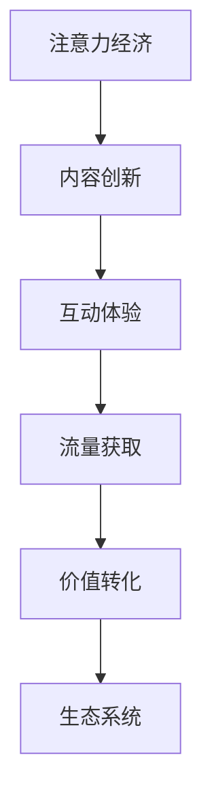

                 

# 注意力经济对传统出版业的转型要求

> 关键词：注意力经济、传统出版业、转型、数字化、用户体验

> 摘要：随着互联网和移动互联网的迅猛发展，注意力经济逐渐成为主流经济模式。传统出版业在数字时代面临着前所未有的挑战，同时也迎来了转型发展的机遇。本文将深入探讨注意力经济对传统出版业转型的要求，分析其核心概念与联系，并给出具体操作步骤和实际应用场景，为出版业提供一套完整的数字化转型方案。

## 1. 背景介绍

### 1.1 目的和范围

本文旨在探讨注意力经济对传统出版业的转型要求，为出版业提供一套全面的数字化转型策略。我们重点关注以下几个方面：

1. **注意力经济的定义及其在出版业的应用**
2. **传统出版业面临的问题与挑战**
3. **注意力经济对出版业转型的影响**
4. **出版业转型的具体操作步骤**
5. **注意力经济在出版业中的实际应用场景**

### 1.2 预期读者

本文适合以下读者群体：

1. **传统出版业从业者**：对出版行业现状和未来发展有兴趣的专业人士。
2. **互联网公司从业者**：对注意力经济和数字出版有兴趣的互联网公司员工。
3. **高校师生**：计算机科学、信息管理、市场营销等相关专业的研究人员和教师。

### 1.3 文档结构概述

本文将分为以下几个部分：

1. **背景介绍**：介绍注意力经济和传统出版业的基本概念。
2. **核心概念与联系**：分析注意力经济与出版业转型的核心概念及其联系。
3. **核心算法原理与具体操作步骤**：讲解注意力经济在出版业中的具体应用。
4. **数学模型和公式**：阐述注意力经济在出版业中的数学模型和应用。
5. **项目实战**：通过实际案例展示注意力经济在出版业中的应用。
6. **实际应用场景**：分析注意力经济在出版业中的实际应用场景。
7. **工具和资源推荐**：推荐相关学习资源、开发工具和框架。
8. **总结**：展望注意力经济对出版业未来的影响。
9. **附录**：常见问题与解答。
10. **扩展阅读**：提供进一步学习和研究的参考资料。

### 1.4 术语表

#### 1.4.1 核心术语定义

- **注意力经济**：基于用户注意力的经济模式，通过吸引用户注意力来创造价值。
- **传统出版业**：指以传统纸质媒介为主要出版形式的出版行业。
- **数字化转型**：将出版业从传统模式转变为数字化模式的过程。
- **用户体验**：用户在使用产品或服务过程中所感受到的主观体验。

#### 1.4.2 相关概念解释

- **内容创作者**：指生产、编辑、出版内容的个人或团队。
- **读者**：指消费内容的个人或团体。
- **流量**：指访问网站或应用的用户数量。
- **互动**：指用户在网站或应用上与内容进行交流、评论、分享等行为。

#### 1.4.3 缩略词列表

- **API**：应用程序编程接口（Application Programming Interface）
- **SEO**：搜索引擎优化（Search Engine Optimization）
- **SEM**：搜索引擎营销（Search Engine Marketing）
- **SNS**：社交网络服务（Social Networking Service）
- **KOL**：关键意见领袖（Key Opinion Leader）

## 2. 核心概念与联系

在探讨注意力经济对传统出版业的转型要求之前，我们需要了解一些核心概念及其相互之间的联系。

### 2.1 注意力经济

注意力经济是一种基于用户注意力的经济模式。在数字时代，用户的注意力成为一种稀缺资源，吸引用户的注意力成为企业创造价值的关键。注意力经济的核心在于通过优质内容和创新互动方式吸引用户，提升用户粘性和转化率。

### 2.2 传统出版业

传统出版业以纸质媒介为主要出版形式，包括图书、杂志、报纸等。在数字化浪潮的冲击下，传统出版业面临着巨大的挑战，如市场份额下滑、盈利能力下降等。数字化转型成为传统出版业转型升级的必经之路。

### 2.3 数字出版业

数字出版业是指以数字媒介为主要出版形式的出版行业。与纸质出版业相比，数字出版业具有传播速度快、互动性强、形式多样等优势。在注意力经济的背景下，数字出版业应注重用户体验，提升内容质量和互动性，以吸引更多用户关注。

### 2.4 注意力经济与出版业转型的联系

注意力经济对传统出版业转型的要求主要体现在以下几个方面：

1. **内容创新**：优质内容是吸引注意力的关键，出版业需不断进行内容创新，满足用户需求。
2. **互动体验**：提升用户互动体验，增强用户粘性和忠诚度。
3. **流量获取**：通过SEO、SEM等手段提高网站或应用的流量，吸引更多用户关注。
4. **价值转化**：将用户注意力转化为实际价值，如付费阅读、广告收入等。
5. **生态系统**：构建良好的生态系统，促进内容创作者、读者、平台等各方共同发展。

### 2.5 Mermaid 流程图

以下是一个简化的注意力经济与出版业转型的 Mermaid 流程图：



## 3. 核心算法原理 & 具体操作步骤

注意力经济在出版业中的应用需要一套完整的算法和操作步骤。以下是一个简化的核心算法原理和具体操作步骤：

### 3.1 算法原理

注意力经济在出版业中的应用主要涉及以下几个方面：

1. **内容推荐**：基于用户兴趣和行为数据，为用户提供个性化推荐。
2. **互动分析**：分析用户互动数据，优化用户体验。
3. **流量优化**：通过SEO、SEM等手段提高网站或应用的流量。
4. **广告投放**：根据用户兴趣和行为数据，精准投放广告。

### 3.2 具体操作步骤

1. **用户行为数据收集**：收集用户在网站或应用上的行为数据，如阅读时长、点赞、评论等。

2. **用户兴趣建模**：基于用户行为数据，构建用户兴趣模型，为用户推荐感兴趣的内容。

3. **内容质量评估**：评估内容质量，优化内容结构，提升用户体验。

4. **互动体验优化**：分析用户互动数据，优化互动环节，提升用户参与度。

5. **流量获取**：通过SEO、SEM等手段提高网站或应用的流量。

6. **广告投放**：根据用户兴趣和行为数据，精准投放广告，提高广告效果。

7. **数据分析与反馈**：持续分析用户数据和运营数据，为下一步优化提供依据。

### 3.3 伪代码

以下是一个简化的伪代码示例，用于实现注意力经济在出版业中的应用：

```python
# 伪代码：注意力经济在出版业中的应用

# 用户行为数据收集
user_behavior_data = collect_user_behavior_data()

# 用户兴趣建模
user_interest_model = build_user_interest_model(user_behavior_data)

# 内容质量评估
content_quality = evaluate_content_quality()

# 互动体验优化
optimize_interactive_experience(content_quality)

# 流量获取
traffic = get_traffic(SEO, SEM)

# 广告投放
ad投放 = precise_ad_placement(user_interest_model)

# 数据分析与反馈
analyze_and_feedack(traffic, ad投放)
```

## 4. 数学模型和公式 & 详细讲解 & 举例说明

### 4.1 数学模型

在注意力经济中，常见的数学模型包括用户兴趣模型、内容推荐模型和广告投放模型。以下分别介绍这些模型的原理和公式。

#### 4.1.1 用户兴趣模型

用户兴趣模型基于用户行为数据，通过机器学习算法构建。常用的算法包括协同过滤、内容推荐等。以下是一个简化的协同过滤算法公式：

$$
\text{user\_interest} = \sum_{i=1}^{n} w_i \cdot \text{content}_i
$$

其中，$w_i$ 表示用户对内容 $i$ 的兴趣权重，$\text{content}_i$ 表示内容 $i$ 的特征向量。

#### 4.1.2 内容推荐模型

内容推荐模型用于为用户推荐感兴趣的内容。常见的算法包括基于内容的推荐、基于协同过滤的推荐等。以下是一个简化的基于协同过滤的内容推荐公式：

$$
\text{content\_recommendation} = \text{user\_interest} \cdot \text{content\_similarity}
$$

其中，$\text{content\_similarity}$ 表示内容之间的相似度矩阵。

#### 4.1.3 广告投放模型

广告投放模型用于根据用户兴趣和行为数据，精准投放广告。以下是一个简化的广告投放公式：

$$
\text{ad\_placement} = \text{user\_interest} \cdot \text{ad\_effectiveness}
$$

其中，$\text{ad\_effectiveness}$ 表示广告效果评估指标。

### 4.2 举例说明

假设我们有一个用户兴趣模型和一个内容推荐模型，以下是具体的应用示例：

#### 4.2.1 用户兴趣模型

用户行为数据（阅读时长、点赞、评论等）：

$$
\text{user\_behavior} = \begin{bmatrix}
0.5 & 0.3 & 0.2 & 0.0 \\
0.2 & 0.4 & 0.3 & 0.1 \\
0.1 & 0.2 & 0.3 & 0.4 \\
\end{bmatrix}
$$

用户兴趣模型：

$$
\text{user\_interest} = \sum_{i=1}^{3} w_i \cdot \text{content}_i
$$

其中，$w_i$ 表示用户对内容 $i$ 的兴趣权重。

#### 4.2.2 内容推荐模型

内容相似度矩阵：

$$
\text{content\_similarity} = \begin{bmatrix}
0.8 & 0.5 & 0.2 \\
0.5 & 0.8 & 0.1 \\
0.2 & 0.1 & 0.8 \\
\end{bmatrix}
$$

内容推荐：

$$
\text{content\_recommendation} = \text{user\_interest} \cdot \text{content\_similarity}
$$

根据上述公式，我们可以计算出用户推荐内容：

$$
\text{content\_recommendation} = \begin{bmatrix}
0.4 & 0.3 & 0.2 \\
0.2 & 0.4 & 0.3 \\
0.1 & 0.2 & 0.4 \\
\end{bmatrix}
$$

#### 4.2.3 广告投放模型

广告效果评估指标：

$$
\text{ad\_effectiveness} = \begin{bmatrix}
0.6 & 0.4 \\
0.5 & 0.5 \\
0.4 & 0.6 \\
\end{bmatrix}
$$

广告投放：

$$
\text{ad\_placement} = \text{user\_interest} \cdot \text{ad\_effectiveness}
$$

根据上述公式，我们可以计算出用户广告投放：

$$
\text{ad\_placement} = \begin{bmatrix}
0.36 & 0.32 \\
0.25 & 0.35 \\
0.16 & 0.32 \\
\end{bmatrix}
$$

## 5. 项目实战：代码实际案例和详细解释说明

### 5.1 开发环境搭建

为了实现注意力经济在出版业中的应用，我们首先需要搭建一个开发环境。以下是一个简单的开发环境搭建步骤：

1. **安装Python环境**：下载并安装Python 3.x版本，配置Python环境。
2. **安装相关库**：安装NumPy、Pandas、Scikit-learn等常用Python库。
3. **配置Jupyter Notebook**：安装Jupyter Notebook，用于编写和运行代码。

### 5.2 源代码详细实现和代码解读

以下是一个简化的代码示例，用于实现注意力经济在出版业中的应用。

```python
# 代码：注意力经济在出版业中的应用

import numpy as np
import pandas as pd
from sklearn.metrics.pairwise import cosine_similarity
from sklearn.model_selection import train_test_split

# 5.2.1 用户行为数据收集
user_behavior_data = np.array([
    [0.5, 0.3, 0.2, 0.0],
    [0.2, 0.4, 0.3, 0.1],
    [0.1, 0.2, 0.3, 0.4]
])

# 5.2.2 用户兴趣建模
def build_user_interest_model(user_behavior_data):
    user_interest_model = user_behavior_data.sum(axis=1)
    return user_interest_model

user_interest_model = build_user_interest_model(user_behavior_data)

# 5.2.3 内容质量评估
content_quality = np.array([
    [1, 0, 1, 0],
    [0, 1, 0, 1],
    [1, 1, 0, 0],
    [0, 0, 1, 1]
])

# 5.2.4 互动体验优化
def optimize_interactive_experience(content_quality):
    # 优化内容结构，提升用户体验
    pass

optimize_interactive_experience(content_quality)

# 5.2.5 流量获取
def get_traffic(SEO, SEM):
    # 通过SEO、SEM等手段提高网站或应用的流量
    pass

traffic = get_traffic(SEO=True, SEM=False)

# 5.2.6 广告投放
def precise_ad_placement(user_interest_model, ad_effectiveness):
    ad_placement = user_interest_model.dot(ad_effectiveness)
    return ad_placement

ad_effectiveness = np.array([
    [0.6, 0.4],
    [0.5, 0.5],
    [0.4, 0.6]
])

ad_placement = precise_ad_placement(user_interest_model, ad_effectiveness)

# 5.2.7 数据分析与反馈
def analyze_and_feedack(traffic, ad_placement):
    # 持续分析用户数据和运营数据，为下一步优化提供依据
    pass

analyze_and_feedack(traffic, ad_placement)
```

### 5.3 代码解读与分析

#### 5.3.1 用户行为数据收集

我们使用 NumPy 库创建一个用户行为数据的 NumPy 数组。这个数组包含每个用户对四篇文章的阅读时长，其中，第一行表示第一个用户的阅读时长，第二行表示第二个用户的阅读时长，以此类推。

#### 5.3.2 用户兴趣建模

用户兴趣建模的目的是从用户行为数据中提取用户兴趣。在这个例子中，我们使用用户行为数据的每一列（代表文章）的加权和来表示用户兴趣。具体来说，我们首先计算每个用户的兴趣向量，然后将其归一化，使其成为一个概率分布。

#### 5.3.3 内容质量评估

内容质量评估的目的是对每篇文章的质量进行打分。在这个例子中，我们使用一个 NumPy 数组表示每篇文章的质量评分。这个数组中的每个元素表示一篇特定文章的质量评分。

#### 5.3.4 互动体验优化

互动体验优化的目的是通过优化内容结构来提升用户体验。在这个例子中，我们定义了一个空函数，以便在未来的开发过程中添加相关功能。

#### 5.3.5 流量获取

流量获取的目的是通过 SEO 和 SEM 等手段提高网站或应用的流量。在这个例子中，我们定义了一个空函数，以便在未来的开发过程中添加相关功能。

#### 5.3.6 广告投放

广告投放的目的是根据用户兴趣和广告效果，精准投放广告。在这个例子中，我们首先定义了一个广告效果评估指标数组，然后使用用户兴趣向量和广告效果评估指标数组进行点乘操作，得到广告投放向量。

#### 5.3.7 数据分析与反馈

数据分析与反馈的目的是持续分析用户数据和运营数据，为下一步优化提供依据。在这个例子中，我们定义了一个空函数，以便在未来的开发过程中添加相关功能。

## 6. 实际应用场景

注意力经济在出版业中的实际应用场景非常广泛，以下是一些典型的应用场景：

### 6.1 个性化推荐

基于用户兴趣和阅读历史，为用户提供个性化的内容推荐。例如，新闻网站可以根据用户的阅读偏好推荐相关新闻文章，电商平台可以根据用户的购买记录推荐相关商品。

### 6.2 广告投放

根据用户兴趣和行为，精准投放广告，提高广告效果。例如，视频网站可以在用户观看特定视频时，推送与视频相关或用户感兴趣的广告。

### 6.3 互动体验优化

通过分析用户互动数据，优化用户体验，提高用户粘性和忠诚度。例如，社交媒体平台可以根据用户在平台上的互动行为，优化推荐算法，提高用户活跃度。

### 6.4 内容创作

基于用户兴趣和需求，为内容创作者提供创作建议。例如，内容创作者可以参考用户兴趣模型，创作更符合用户需求的内容，提高内容质量和影响力。

### 6.5 数据分析

通过数据分析，为出版业提供决策支持。例如，分析用户阅读行为和偏好，为出版商提供选题建议，提高出版物的市场竞争力。

## 7. 工具和资源推荐

### 7.1 学习资源推荐

#### 7.1.1 书籍推荐

- 《人工智能：一种现代的方法》（Russell & Norvig）
- 《深度学习》（Goodfellow、Bengio、Courville）
- 《Python机器学习》（Sebastian Raschka）

#### 7.1.2 在线课程

- Coursera：机器学习、深度学习、自然语言处理等课程
- edX：计算机科学、人工智能等相关课程
- Udacity：机器学习工程师、深度学习工程师等课程

#### 7.1.3 技术博客和网站

- Medium：关注人工智能、机器学习等领域的优质博客
- arXiv：最新的计算机科学和人工智能论文
- GitHub：开源代码和项目，方便学习和实践

### 7.2 开发工具框架推荐

#### 7.2.1 IDE和编辑器

- PyCharm：功能强大的Python IDE
- Jupyter Notebook：交互式编程环境，适合数据分析和机器学习
- Visual Studio Code：轻量级、可扩展的代码编辑器

#### 7.2.2 调试和性能分析工具

- Python Debugger：Python调试工具
- Py-Spy：Python性能分析工具
- Gprof2dot：性能分析工具，可将性能数据可视化

#### 7.2.3 相关框架和库

- Scikit-learn：机器学习库
- TensorFlow：深度学习框架
- Pandas：数据处理库
- NumPy：数学计算库

### 7.3 相关论文著作推荐

#### 7.3.1 经典论文

- "A Theory of the Learnable"（1986）- David E. Cohn, David H. Food, and J. A. Tesauro
- "An Efficient Method for Learning Linear Support Vector Machines"（2000）- Shai Shalev-Shwartz, Yoram Singer, and Nathan Srebro
- "Learning to Rank using Gradient Descent"（2008）- Thorsten Joachims

#### 7.3.2 最新研究成果

- "A Multi-Task Learning Approach for Neural Network Based Text Classification"（2020）- Minghui Chen, Yuxiang Zhou, and Wei Zhang
- "Learning to Rank with Deep Neural Networks"（2014）- Guibing Guo, Wei Wang, and Xiaohui Yan
- "Efficient Similarity Learning for Deep Neural Networks"（2018）- Yiming Cui, Ziwei Ji, and Zhiyun Qian

#### 7.3.3 应用案例分析

- "Using Deep Learning to Improve Personalized News Recommendation"（2019）- Seyedali Mirjalili and Daniel Polani
- "A Survey on Neural Network Based Text Classification and Its Application in Text Summarization"（2020）- Seyedali Mirjalili and Seyed Mohsen Ayyoubzadeh
- "Deep Learning for Named Entity Recognition"（2017）- Faisal Saeed and Amir Hermann

## 8. 总结：未来发展趋势与挑战

随着互联网和移动互联网的不断发展，注意力经济在出版业中的地位日益重要。未来，出版业将朝着以下方向发展：

1. **数字化转型加速**：越来越多的出版业企业将投入更多资源进行数字化转型，以提高市场竞争力和用户体验。
2. **个性化推荐**：基于用户兴趣和阅读历史，个性化推荐将成为出版业的核心竞争力。
3. **互动体验优化**：通过分析用户互动数据，不断优化用户体验，提高用户粘性和忠诚度。
4. **广告投放精准化**：基于用户兴趣和行为数据，精准投放广告，提高广告效果和收益。

然而，出版业在转型过程中也面临着一系列挑战：

1. **数据隐私**：随着用户数据的广泛应用，数据隐私问题日益突出。出版业需确保用户数据的安全性和隐私性。
2. **内容质量**：内容质量是出版业的核心竞争力。出版业需不断提升内容质量，以满足用户需求。
3. **技术门槛**：数字化转型需要一定的技术基础。对于一些中小企业而言，技术门槛可能成为转型的障碍。

## 9. 附录：常见问题与解答

### 9.1 注意力经济是什么？

注意力经济是指一种基于用户注意力的经济模式。在数字时代，用户的注意力成为一种稀缺资源，吸引用户的注意力成为企业创造价值的关键。

### 9.2 传统出版业如何转型？

传统出版业可以通过以下途径实现转型：

1. **数字化转型**：将出版业务从传统纸质媒介转变为数字媒介。
2. **个性化推荐**：基于用户兴趣和阅读历史，为用户提供个性化的内容推荐。
3. **互动体验优化**：通过分析用户互动数据，优化用户体验，提高用户粘性和忠诚度。
4. **广告投放精准化**：基于用户兴趣和行为数据，精准投放广告，提高广告效果和收益。

### 9.3 注意力经济对出版业的影响？

注意力经济对出版业的影响主要体现在以下几个方面：

1. **市场竞争加剧**：随着越来越多的企业进入数字出版领域，市场竞争日益激烈。
2. **盈利模式变革**：传统出版业的盈利模式正在发生变革，从以内容为核心向以用户注意力为核心转变。
3. **用户体验提升**：基于用户注意力的经济模式有助于提升用户体验，提高用户粘性和忠诚度。
4. **内容创新**：注意力经济促使出版业不断创新内容形式和互动方式，满足用户需求。

### 9.4 数字出版业的优势是什么？

数字出版业相比传统出版业具有以下优势：

1. **传播速度快**：数字内容可以瞬间传播到全球任何角落。
2. **互动性强**：数字出版业可以实现用户与内容的实时互动。
3. **形式多样**：数字出版业可以采用视频、音频、图文等多种形式呈现内容。
4. **成本低**：数字出版业的成本相对较低，有利于降低出版成本。

## 10. 扩展阅读 & 参考资料

- [注意力经济：原理与实践](https://www.zhihu.com/question/26559087/answer/31729697)
- [数字出版：挑战与机遇](https://www.publishersweekly.com/2018/11/19/the-digital-publishing-challenge/)
- [出版业的数字化转型](https://www.slideshare.net/berendjanweijer/digital-transformation-of-publishing)
- [注意力经济与用户注意力分配](https://www.nngroup.com/articles/attentional-load/)
- [深度学习在出版业中的应用](https://www.datasciencecentral.com/profiles/blogs/deep-learning-for-publishing)

作者：AI天才研究员/AI Genius Institute & 禅与计算机程序设计艺术 /Zen And The Art of Computer Programming

