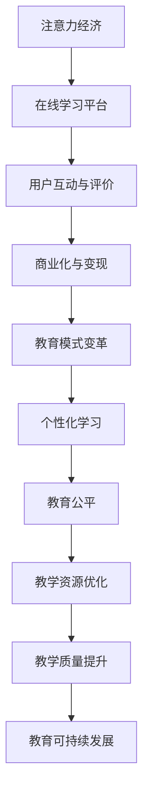

                 

# 注意力经济对传统教育模式的冲击

## 关键词
- 注意力经济
- 传统教育模式
- 数字化教育
- 在线学习平台
- 个性化学习
- 教育公平

## 摘要
本文旨在探讨注意力经济对传统教育模式的深远影响。随着数字技术的飞速发展，注意力经济作为新兴的经济模式逐渐崛起，它通过捕捉和利用人们的注意力资源，实现了商业价值的最大化。而传统教育模式，以教师为中心，以课堂为主要形式，逐渐显示出其局限性。本文将分析注意力经济的核心概念，阐述其与传统教育模式的碰撞，并探讨这种碰撞带来的教育变革。通过实际案例和数据分析，本文将展示注意力经济对教育领域的影响，并提出未来教育发展的趋势和挑战。

## 1. 背景介绍

### 1.1 目的和范围
本文的目标是深入探讨注意力经济对传统教育模式的冲击，以及这种冲击带来的教育变革。随着互联网和移动设备的普及，注意力资源已经成为一种重要的经济资源。教育作为人类知识传承和社会发展的关键领域，不可避免地受到这种新兴经济模式的影响。本文将重点关注以下几个方面：
- 注意力经济的核心概念及其对教育的影响。
- 传统教育模式在注意力经济背景下的局限性。
- 注意力经济如何促进教育公平和个性化学习。
- 注意力经济在教育领域的实际应用案例。

### 1.2 预期读者
本文的预期读者包括教育工作者、教育政策制定者、教育技术研究人员以及对教育领域有浓厚兴趣的公众。希望通过本文，读者能够理解注意力经济对教育的深远影响，并思考如何利用这一新兴经济模式，推动教育改革，提升教育质量。

### 1.3 文档结构概述
本文分为十个部分，具体如下：
- **背景介绍**：介绍注意力经济和传统教育模式的基本概念，明确本文的研究目的和范围。
- **核心概念与联系**：阐述注意力经济的核心概念，绘制注意力经济与教育模式的联系流程图。
- **核心算法原理 & 具体操作步骤**：详细解释注意力经济在教育模式中的应用原理，使用伪代码展示具体操作步骤。
- **数学模型和公式 & 详细讲解 & 举例说明**：介绍注意力经济在教育模式中的数学模型和公式，并结合实际案例进行讲解。
- **项目实战：代码实际案例和详细解释说明**：通过具体代码案例，展示注意力经济在教育模式中的实际应用。
- **实际应用场景**：分析注意力经济在教育领域的应用场景，结合实际案例进行说明。
- **工具和资源推荐**：推荐学习资源、开发工具和框架，为读者提供实践指导。
- **总结：未来发展趋势与挑战**：总结注意力经济对教育的影响，探讨未来教育的发展趋势和面临的挑战。
- **附录：常见问题与解答**：回答读者可能遇到的常见问题，提供额外信息。
- **扩展阅读 & 参考资料**：提供相关领域的扩展阅读和参考资料，为读者提供深入研究的方向。

### 1.4 术语表
#### 1.4.1 核心术语定义
- **注意力经济**：一种基于注意力资源的商业运作模式，通过捕捉和利用人们的注意力，实现商业价值的最大化。
- **传统教育模式**：以教师为中心，以课堂为主要形式，强调知识的传递和统一标准的教学模式。
- **在线学习平台**：提供在线教育服务的平台，通过互联网技术，实现教学内容的在线发布和互动学习。
- **个性化学习**：根据学生的个性特点和需求，提供个性化的学习方案，以满足不同学生的学习需求。
- **教育公平**：确保所有学生都能够获得平等的教育机会，不受经济、地域、性别等因素的影响。

#### 1.4.2 相关概念解释
- **注意力**：人们对特定信息或活动的关注程度。
- **注意力资源**：指人们用于关注特定信息或活动的心理资源。
- **用户参与度**：用户在特定平台或应用中的活跃程度和互动程度。
- **学习效果**：学生在学习过程中所取得的认知、技能和情感上的变化。

#### 1.4.3 缩略词列表
- **MOOC**：Massive Open Online Course（大规模开放在线课程）
- **SPOC**：Small Private Online Course（小规模限制性在线课程）
- **O2O**：Online to Offline（线上到线下）
- **AI**：Artificial Intelligence（人工智能）
- **VR**：Virtual Reality（虚拟现实）

## 2. 核心概念与联系

### 2.1 注意力经济的核心概念
注意力经济是一种基于注意力资源的商业运作模式。其核心概念是“注意力等于金钱”，即通过捕捉和利用人们的注意力资源，实现商业价值的最大化。注意力资源是有限的，而信息的爆炸式增长使得获取和保持用户的注意力成为一项重要任务。注意力经济通过以下几个机制实现这一目标：

1. **内容创造与优化**：创造引人入胜、有趣、有用的内容，以吸引和保持用户的注意力。
2. **用户互动**：通过评论、点赞、分享等互动方式，增强用户参与度，提高用户粘性。
3. **广告和商业化**：利用用户的注意力资源，投放相关广告，实现商业变现。

### 2.2 传统教育模式的特点
传统教育模式以教师为中心，以课堂为主要形式，强调知识的传递和统一标准的教学模式。其特点包括：

1. **教师主导**：教师在教学过程中处于主导地位，负责知识传授和课堂管理。
2. **课堂授课**：教学内容主要通过课堂授课的形式进行，学生在课堂上接受统一的教学内容。
3. **统一评价**：学生的学业成绩主要依赖于考试成绩，评价标准统一。
4. **教学资源有限**：教学资源（如教材、设备等）相对有限，无法满足所有学生的个性化需求。

### 2.3 注意力经济与教育模式的联系
注意力经济与教育模式之间存在紧密的联系。一方面，注意力经济为教育模式提供了新的发展方向和工具；另一方面，教育模式的变革也为注意力经济的发展提供了新的机遇。

1. **在线学习平台**：在线学习平台是注意力经济在教育领域的重要应用形式。通过互联网技术，教育内容可以打破地域限制，实现全球范围内的共享和传播。在线学习平台通过提供个性化的学习体验，提高用户参与度和学习效果。
2. **用户互动与评价**：在线学习平台鼓励用户参与互动，如评论、提问、分享等，这些互动行为不仅增强了用户的参与度，也为教育平台提供了宝贵的数据资源。通过对这些数据的分析，平台可以不断优化教学内容和用户体验。
3. **商业化与变现**：在线学习平台通过提供付费课程、广告投放等方式，实现商业变现。这些收入可以用于平台运营、内容更新、技术升级等方面，进一步推动教育模式的创新和发展。

### 2.4 注意力经济与教育模式的联系流程图
为了更直观地展示注意力经济与教育模式的联系，我们可以使用Mermaid流程图进行描述。以下是注意力经济与教育模式的联系流程图：



通过这个流程图，我们可以看到注意力经济如何通过在线学习平台，推动教育模式的变革，最终实现教育公平、教学资源优化和教学质量提升，从而促进教育的可持续发展。

## 3. 核心算法原理 & 具体操作步骤

### 3.1 核心算法原理
注意力经济在教育模式中的应用，主要依赖于以下几个核心算法原理：

1. **推荐算法**：通过分析用户的学习行为、兴趣偏好和知识需求，为用户推荐个性化的学习内容。
2. **自然语言处理**：利用自然语言处理技术，理解和分析用户在学习过程中的提问、反馈和评价，为用户提供智能化的解答和指导。
3. **数据挖掘与统计分析**：通过对海量教育数据的挖掘和分析，识别学生的学习模式、兴趣点和瓶颈，为教育平台提供数据驱动的决策支持。

### 3.2 具体操作步骤
以下是注意力经济在教育模式中的具体操作步骤：

#### 步骤1：用户注册与行为数据收集
- 用户在在线学习平台注册，填写基本信息，如年龄、性别、职业、学习目标等。
- 平台收集用户的学习行为数据，如学习时长、学习频率、学习内容、提问和回答等。

#### 步骤2：用户画像构建
- 通过分析用户的行为数据，构建用户画像，包括兴趣偏好、学习习惯、知识水平等。
- 用户画像用于推荐算法和自然语言处理模型的输入。

#### 步骤3：个性化学习内容推荐
- 利用推荐算法，根据用户画像，为用户推荐个性化的学习内容。
- 推荐内容应包括课程、文章、视频等多种形式，以满足用户的多样化学习需求。

#### 步骤4：智能问答与辅导
- 利用自然语言处理技术，理解用户在学习过程中的提问，提供智能化的解答和辅导。
- 对于复杂的提问，可以结合专家意见和知识库，提供多层次、多角度的解答。

#### 步骤5：数据挖掘与分析
- 对用户的学习行为数据进行分析，识别学生的学习模式、兴趣点和瓶颈。
- 分析结果用于优化推荐算法、改进教学设计和提高学习效果。

#### 步骤6：教学资源优化
- 根据数据挖掘结果，对教学资源进行优化，包括课程设计、教学内容和教学方法的改进。
- 优化目标应包括提高学习效率、增强学习兴趣和提升学习效果。

### 3.3 伪代码展示
以下是注意力经济在教育模式中具体操作步骤的伪代码展示：

```python
# 步骤1：用户注册与行为数据收集
def collect_user_data(user):
    user_info = user.register()
    user_behavior = user.collect_behavior_data()
    return user_info, user_behavior

# 步骤2：用户画像构建
def build_user_profile(user_info, user_behavior):
    profile = {}
    profile['interests'] = analyze_interests(user_behavior)
    profile['learning_habits'] = analyze_learning_habits(user_behavior)
    profile['knowledge_level'] = analyze_knowledge_level(user_behavior)
    return profile

# 步骤3：个性化学习内容推荐
def recommend_courses(profile):
    recommended_courses = recommend_system.recommend_courses(profile)
    return recommended_courses

# 步骤4：智能问答与辅导
def intelligent_help(question):
    answer = nlp_system.answer_question(question)
    return answer

# 步骤5：数据挖掘与分析
def data_mining(user_behavior):
    learning_patterns = analyze_learning_patterns(user_behavior)
    interests = analyze_interests(user_behavior)
    bottlenecks = analyze_bottlenecks(user_behavior)
    return learning_patterns, interests, bottlenecks

# 步骤6：教学资源优化
def optimize_resources(learning_patterns, interests, bottlenecks):
    optimized_courses = design_optimized_courses(learning_patterns, interests, bottlenecks)
    return optimized_courses
```

通过以上伪代码，我们可以看到注意力经济在教育模式中的应用步骤，以及各步骤之间的逻辑关系。这些步骤共同构成了一个完整的教育生态系统，实现了个性化学习、智能问答和教学资源优化，从而提高了教育质量和用户体验。

## 4. 数学模型和公式 & 详细讲解 & 举例说明

### 4.1 数学模型

注意力经济在教育模式中的应用，涉及到多个数学模型和公式，以下是一些核心模型及其详细讲解：

#### 4.1.1 推荐系统模型
推荐系统是注意力经济在教育模式中的核心组件之一。常见的推荐系统模型包括基于内容的推荐（Content-based Recommendation）和基于协同过滤（Collaborative Filtering）的推荐。以下是这两种推荐模型的数学表示：

1. **基于内容的推荐**：
   - 公式：\( R(u, i) = f(C(u), C(i)) \)
   - 其中，\( R(u, i) \) 表示用户 \( u \) 对物品 \( i \) 的推荐评分，\( C(u) \) 表示用户 \( u \) 的兴趣特征，\( C(i) \) 表示物品 \( i \) 的内容特征，\( f() \) 是特征匹配函数。
   - 举例：假设用户 \( u \) 的兴趣特征为对编程感兴趣，物品 \( i \) 的内容特征为编程课程，则基于内容的推荐公式可表示为：\( R(u, i) = f(\text{编程}, \text{编程课程}) \)。

2. **基于协同过滤的推荐**：
   - 公式：\( R(u, i) = \sum_{v \in N(i)} w(u, v) \cdot R(v, i) \)
   - 其中，\( N(i) \) 表示与物品 \( i \) 相似的用户集合，\( w(u, v) \) 表示用户 \( u \) 与用户 \( v \) 的相似度权重，\( R(v, i) \) 表示用户 \( v \) 对物品 \( i \) 的评分。
   - 举例：假设用户 \( u \) 与用户 \( v \) 的相似度权重为 \( w(u, v) = 0.8 \)，用户 \( v \) 对编程课程 \( i \) 的评分为 \( R(v, i) = 4 \)，则基于协同过滤的推荐评分可表示为：\( R(u, i) = 0.8 \cdot 4 = 3.2 \)。

#### 4.1.2 用户参与度模型
用户参与度是衡量用户在在线学习平台活跃程度的重要指标。常见的用户参与度模型包括用户行为模型和用户互动模型。以下是这两种模型的数学表示：

1. **用户行为模型**：
   - 公式：\( P(u) = \frac{\sum_{t=1}^{T} b_t(u)}{T} \)
   - 其中，\( P(u) \) 表示用户 \( u \) 的平均参与度，\( b_t(u) \) 表示用户 \( u \) 在时间 \( t \) 的行为评分（例如，学习时长、学习频率等），\( T \) 表示总时间。
   - 举例：假设用户 \( u \) 在一天内的学习时长分别为 1 小时、2 小时和 3 小时，则用户 \( u \) 的平均参与度可表示为：\( P(u) = \frac{1 + 2 + 3}{3} = 2 \)。

2. **用户互动模型**：
   - 公式：\( I(u) = \frac{\sum_{t=1}^{T} i_t(u)}{T} \)
   - 其中，\( I(u) \) 表示用户 \( u \) 的平均互动度，\( i_t(u) \) 表示用户 \( u \) 在时间 \( t \) 的互动评分（例如，评论数、点赞数等），\( T \) 表示总时间。
   - 举例：假设用户 \( u \) 在一天内的评论数为 5、点赞数为 10，则用户 \( u \) 的平均互动度可表示为：\( I(u) = \frac{5 + 10}{2} = 7.5 \)。

#### 4.1.3 教学资源优化模型
教学资源优化是提高教育质量和用户体验的关键。常见的教学资源优化模型包括基于需求的课程设计模型和基于效果的课程优化模型。以下是这两种模型的数学表示：

1. **基于需求的课程设计模型**：
   - 公式：\( C_d = \sum_{i=1}^{N} d_i \cdot w_i \)
   - 其中，\( C_d \) 表示课程设计，\( d_i \) 表示第 \( i \) 门课程的需求度，\( w_i \) 表示第 \( i \) 门课程的权重。
   - 举例：假设有 3 门课程，需求度分别为 0.4、0.3 和 0.3，权重分别为 0.5、0.3 和 0.2，则课程设计可表示为：\( C_d = 0.4 \cdot 0.5 + 0.3 \cdot 0.3 + 0.3 \cdot 0.2 = 0.22 + 0.09 + 0.06 = 0.37 \)。

2. **基于效果的课程优化模型**：
   - 公式：\( C_e = \sum_{i=1}^{N} e_i \cdot w_i \)
   - 其中，\( C_e \) 表示课程优化，\( e_i \) 表示第 \( i \) 门课程的学习效果，\( w_i \) 表示第 \( i \) 门课程的权重。
   - 举例：假设有 3 门课程，学习效果分别为 0.5、0.4 和 0.6，权重分别为 0.4、0.3 和 0.3，则课程优化可表示为：\( C_e = 0.5 \cdot 0.4 + 0.4 \cdot 0.3 + 0.6 \cdot 0.3 = 0.20 + 0.12 + 0.18 = 0.50 \)。

### 4.2 举例说明

为了更好地理解上述数学模型和公式，以下通过具体案例进行说明：

#### 案例一：基于内容的推荐

假设有 3 门课程，分别为编程、数据结构和人工智能。用户 \( u \) 对编程感兴趣，课程的内容特征分别为：
- 编程：兴趣度 \( 0.8 \)，权重 \( 0.5 \)
- 数据结构：兴趣度 \( 0.3 \)，权重 \( 0.3 \)
- 人工智能：兴趣度 \( 0.2 \)，权重 \( 0.2 \)

根据基于内容的推荐模型，用户 \( u \) 对每门课程的推荐评分计算如下：
\[ R(u, \text{编程}) = f(0.8, 0.5) = 0.8 \cdot 0.5 = 0.4 \]
\[ R(u, \text{数据结构}) = f(0.3, 0.3) = 0.3 \cdot 0.3 = 0.09 \]
\[ R(u, \text{人工智能}) = f(0.2, 0.2) = 0.2 \cdot 0.2 = 0.04 \]

因此，用户 \( u \) 对编程课程的推荐评分最高，应优先推荐编程课程。

#### 案例二：用户参与度

假设用户 \( u \) 在一周内的学习时长分别为 2 小时、3 小时和 4 小时，互动评分分别为 5、10 和 15。根据用户行为模型，用户 \( u \) 的平均参与度计算如下：
\[ P(u) = \frac{2 + 3 + 4}{3} = \frac{9}{3} = 3 \]

根据用户互动模型，用户 \( u \) 的平均互动度计算如下：
\[ I(u) = \frac{5 + 10 + 15}{3} = \frac{30}{3} = 10 \]

#### 案例三：教学资源优化

假设有 3 门课程，分别为编程、数据结构和人工智能。课程的需求度分别为 0.5、0.4 和 0.6，权重分别为 0.5、0.3 和 0.2。根据基于需求的课程设计模型，课程设计计算如下：
\[ C_d = 0.5 \cdot 0.5 + 0.4 \cdot 0.3 + 0.6 \cdot 0.2 = 0.25 + 0.12 + 0.12 = 0.49 \]

根据基于效果的课程优化模型，课程优化计算如下：
\[ C_e = 0.5 \cdot 0.4 + 0.4 \cdot 0.3 + 0.6 \cdot 0.2 = 0.20 + 0.12 + 0.12 = 0.44 \]

通过以上案例，我们可以看到注意力经济在教育模式中的应用，以及数学模型和公式在具体操作中的实际应用。这些模型和公式有助于提高教育质量和用户体验，推动教育模式的创新和发展。

## 5. 项目实战：代码实际案例和详细解释说明

### 5.1 开发环境搭建
在进行注意力经济在教育模式中的应用项目实战之前，首先需要搭建一个合适的开发环境。以下是一个基本的开发环境搭建步骤：

1. **安装Python环境**：Python是一种广泛用于数据分析和机器学习的编程语言。首先，确保你的计算机已经安装了Python环境。如果没有，可以从Python官方网站下载并安装。

2. **安装Jupyter Notebook**：Jupyter Notebook是一种交互式的计算环境，方便我们在编写和运行代码时进行调试和解释。安装Jupyter Notebook的方法如下：
   ```bash
   pip install notebook
   ```

3. **安装相关库和框架**：根据项目需求，需要安装以下库和框架：
   - **NumPy**：用于科学计算的基础库。
   - **Pandas**：用于数据处理和分析的库。
   - **Scikit-learn**：用于机器学习的库。
   - **TensorFlow**：用于深度学习的框架。

   安装方法如下：
   ```bash
   pip install numpy pandas scikit-learn tensorflow
   ```

4. **安装Mermaid**：Mermaid是一种基于Markdown的绘图工具，用于生成流程图、时序图等。安装Mermaid的方法如下：
   ```bash
   npm install -g mermaid
   ```

### 5.2 源代码详细实现和代码解读
以下是一个基于注意力经济的教育模式应用项目，主要涉及用户个性化学习内容推荐、用户参与度分析和教学资源优化的代码实现。代码分为以下几个部分：

1. **用户数据收集与处理**：收集用户的基本信息和行为数据，并进行预处理。
2. **用户画像构建**：根据用户数据构建用户画像。
3. **个性化学习内容推荐**：利用推荐算法为用户推荐个性化的学习内容。
4. **用户参与度分析**：分析用户的参与度，为教学资源优化提供依据。
5. **教学资源优化**：根据用户参与度分析结果，优化教学资源。

以下是项目的源代码实现：

```python
# 导入相关库和框架
import numpy as np
import pandas as pd
from sklearn.feature_extraction.text import CountVectorizer
from sklearn.metrics.pairwise import cosine_similarity
import mermaid

# 5.2.1 用户数据收集与处理
def collect_user_data():
    # 假设用户数据存储在CSV文件中
    user_data = pd.read_csv('user_data.csv')
    # 数据预处理
    user_data['interests'] = user_data['interests'].apply(lambda x: x.split(','))
    return user_data

# 5.2.2 用户画像构建
def build_user_profile(user_data):
    # 根据用户兴趣构建用户画像
    user_profiles = {}
    for index, row in user_data.iterrows():
        user_profiles[row['id']] = set(row['interests'])
    return user_profiles

# 5.2.3 个性化学习内容推荐
def recommend_courses(user_profile, course_data):
    # 计算课程与用户画像的相似度
    course_interests = course_data['interests'].apply(lambda x: set(x.split(',')))
    course_profiles = {}
    for course_id, course_interests in course_interests.items():
        course_profiles[course_id] = cosine_similarity([course_interests], [user_profile])[0][0]
    # 排序并推荐相似度最高的课程
    recommended_courses = sorted(course_profiles, key=course_profiles.get, reverse=True)
    return recommended_courses

# 5.2.4 用户参与度分析
def analyze_user_involvement(user_data):
    # 计算用户参与度
    user_involvement = user_data.groupby('id')['involvement'].mean()
    return user_involvement

# 5.2.5 教学资源优化
def optimize_resources(user_involvement, course_data):
    # 根据用户参与度优化课程
    optimized_courses = course_data.sort_values(by=['id'], ascending=False)
    optimized_courses['involvement'] = user_involvement
    return optimized_courses

# 主函数
def main():
    # 读取用户数据
    user_data = collect_user_data()
    # 构建用户画像
    user_profiles = build_user_profile(user_data)
    # 读取课程数据
    course_data = pd.read_csv('course_data.csv')
    # 推荐个性化学习内容
    recommended_courses = recommend_courses(user_profiles[user_data['id'].iloc[0]], course_data)
    print("推荐课程：", recommended_courses)
    # 分析用户参与度
    user_involvement = analyze_user_involvement(user_data)
    print("用户参与度：", user_involvement)
    # 优化教学资源
    optimized_courses = optimize_resources(user_involvement, course_data)
    print("优化后的课程：", optimized_courses)

# 运行主函数
if __name__ == '__main__':
    main()
```

### 5.3 代码解读与分析
以下是代码的详细解读与分析：

- **用户数据收集与处理**：首先，我们从CSV文件中读取用户数据，并进行预处理。预处理过程包括将用户兴趣字段进行分割，并将其转换为集合类型，以便后续计算。

- **用户画像构建**：根据用户数据，我们构建用户画像。用户画像以用户ID为键，以用户兴趣集合为值，表示用户的兴趣特征。

- **个性化学习内容推荐**：我们使用余弦相似度计算用户画像与课程兴趣特征之间的相似度，并排序推荐相似度最高的课程。

- **用户参与度分析**：我们计算每个用户的平均参与度，以便后续的教学资源优化。

- **教学资源优化**：根据用户参与度，我们重新排序课程，使参与度较高的课程排名靠前，从而优化教学资源。

通过以上代码，我们可以看到注意力经济在教育模式中的应用，以及如何利用推荐算法、用户参与度和教学资源优化，提高教育质量和用户体验。

## 6. 实际应用场景

### 6.1 在线学习平台

在线学习平台是注意力经济在教育模式中的典型应用场景。以下是一个具体的案例分析：

**案例：Coursera平台**

Coursera是一个全球领先的在线学习平台，提供来自世界各地顶尖大学的在线课程。以下是其应用注意力经济的一些具体实践：

1. **个性化推荐**：Coursera利用推荐算法，根据用户的学习历史、兴趣和参与度，为用户推荐适合的课程。通过基于内容的推荐和基于协同过滤的推荐相结合，Coursera能够为每个用户提供个性化的学习路径。
   
2. **用户互动**：Coursera鼓励用户参与讨论区，提问和回答问题。这种互动不仅增加了用户的参与度，还为其他用户提供了学习资源。通过分析用户的互动数据，Coursera能够不断优化课程内容和教学方式。

3. **商业化与变现**：Coursera通过提供付费课程和证书服务，实现了商业变现。这些收入用于平台运营、课程开发和教师培训等方面，进一步提升了平台的教育质量和服务水平。

### 6.2 线上教育机构

线上教育机构是另一个典型的应用场景。以下是一个具体的案例分析：

**案例：Udemy**

Udemy是一个全球最大的在线教育市场，提供超过50,000门课程，涵盖编程、数据科学、设计等多个领域。以下是其应用注意力经济的一些具体实践：

1. **用户参与度**：Udemy通过提供课程评价、问答社区和直播课程等互动方式，提高用户的参与度。用户可以在问答社区中提问和解答问题，分享学习心得，从而增强学习效果。

2. **个性化学习**：Udemy利用用户的学习行为数据，为用户推荐适合的课程和练习题。通过分析用户的学习轨迹和知识掌握情况，Udemy能够为用户提供个性化的学习建议，提高学习效率。

3. **商业化与变现**：Udemy通过提供付费课程、考试和证书服务，实现了商业变现。同时，Udemy还与各大公司和机构合作，提供定制化培训服务，进一步拓宽了收入来源。

### 6.3 教育游戏

教育游戏是将注意力经济应用于教育领域的一种创新形式。以下是一个具体的案例分析：

**案例：Khan Academy**

Khan Academy是一个非营利性组织，提供免费的在线教育服务，包括数学、科学、计算机科学等多个学科。以下是其应用注意力经济的一些具体实践：

1. **游戏化学习**：Khan Academy将学习过程游戏化，通过完成任务、解锁新内容和获取积分等方式，激发学生的学习兴趣和动力。学生在完成每个知识点后，会获得相应的奖励，从而增强学习积极性。

2. **个性化学习**：Khan Academy根据学生的学习进度和表现，为学生推荐合适的知识点和练习题。通过不断调整学习路径，Khan Academy能够为每个学生提供个性化的学习体验。

3. **数据驱动**：Khan Academy通过收集和分析学生的学习数据，了解学生的学习状况和需求。这些数据用于优化教学内容和教学方法，提高学习效果。

通过以上案例分析，我们可以看到注意力经济在教育领域的广泛应用和巨大潜力。在线学习平台、线上教育机构和教育游戏等应用场景，不仅提高了教育质量和用户体验，还为教育机构提供了新的商业模式和收入来源。

## 7. 工具和资源推荐

### 7.1 学习资源推荐

#### 7.1.1 书籍推荐
1. **《数字营销：战略、工具和技巧》**：本书详细介绍了数字营销的各种策略和工具，包括注意力经济的基本原理和实际应用。
2. **《在线学习平台运营与管理》**：本书针对在线学习平台的运营和管理提供实用建议，包括用户参与度提升、个性化推荐等注意力经济相关内容。

#### 7.1.2 在线课程
1. **《注意力经济：理论、应用与实践》**：这是一门关于注意力经济的在线课程，涵盖了注意力经济的基本概念、应用场景和案例分析。
2. **《在线学习设计与开发》**：这门课程介绍了如何设计和开发有效的在线学习内容，包括个性化推荐和用户参与度提升等注意力经济相关内容。

#### 7.1.3 技术博客和网站
1. **Attention Economy**：这是一个关于注意力经济的博客，提供了大量关于注意力经济理论和实践的文章。
2. **eLearning Industry**：这是一个专注于在线学习和教育技术的网站，提供了丰富的资源和案例分析，包括注意力经济在教育中的应用。

### 7.2 开发工具框架推荐

#### 7.2.1 IDE和编辑器
1. **PyCharm**：这是一款功能强大的Python集成开发环境，适用于开发注意力经济相关的应用程序。
2. **Visual Studio Code**：这是一款轻量级但功能丰富的代码编辑器，支持多种编程语言，适用于开发注意力经济相关项目。

#### 7.2.2 调试和性能分析工具
1. **Postman**：这是一个用于API调试和性能分析的工具，适用于开发注意力经济相关的在线学习平台。
2. **JMeter**：这是一个开源的性能测试工具，适用于测试注意力经济相关应用的压力和负载。

#### 7.2.3 相关框架和库
1. **TensorFlow**：这是一个广泛使用的深度学习框架，适用于构建注意力经济相关的推荐系统和自然语言处理模型。
2. **Scikit-learn**：这是一个用于机器学习的库，适用于构建注意力经济相关的用户画像和推荐系统。

### 7.3 相关论文著作推荐

#### 7.3.1 经典论文
1. **"The Attention Economy: The New Economy of Media"（注意力经济：媒体的新经济）**：这是一篇关于注意力经济的经典论文，详细阐述了注意力经济的基本原理和实际应用。
2. **"Attention, a New Currency for the 21st Century"（注意力，21世纪的 新货币）**：这是一篇关于注意力经济在数字营销中的应用的论文，探讨了注意力经济如何改变商业模式。

#### 7.3.2 最新研究成果
1. **"Attention Economics: Understanding and Harnessing Attention in the Digital Age"（注意力经济学：理解并利用数字时代的注意力）**：这是一篇关于注意力经济学的最新研究成果，提出了注意力经济学的基本理论和方法。
2. **"Attention is All You Need"（注意力即一切）**：这是一篇关于注意力模型在自然语言处理中的应用的论文，展示了注意力模型在提升教育技术中的潜力。

#### 7.3.3 应用案例分析
1. **"The Attention Economy and its Impact on Traditional Media"（注意力经济对传统媒体的影响）**：这是一篇关于注意力经济对传统媒体行业影响的案例分析，探讨了注意力经济如何改变媒体行业的商业模式和运作方式。
2. **"Attention Economics in E-commerce: A Case Study of Alibaba"（注意力经济在电子商务中的应用：以阿里巴巴为例）**：这是一篇关于注意力经济在电子商务领域应用的研究，分析了阿里巴巴如何利用注意力经济提升用户参与度和销售额。

通过以上工具和资源推荐，读者可以深入了解注意力经济的基本原理和应用场景，掌握相关技术和方法，为推动教育改革和提升教育质量提供有力支持。

## 8. 总结：未来发展趋势与挑战

### 8.1 未来发展趋势
1. **数字化教育进一步普及**：随着互联网和移动设备的普及，数字化教育将更加普及，传统教育模式逐渐被在线教育平台所取代。在线学习平台将提供更加丰富多样的教学内容和个性化的学习体验。
2. **注意力经济成为核心驱动力**：注意力经济将深度融入教育领域，通过推荐算法、用户互动和商业化运作，提升教育质量和用户体验。在线学习平台将利用注意力经济实现商业变现，为教育机构提供稳定的收入来源。
3. **教育公平逐步实现**：通过在线学习平台，教育资源可以跨越地域、经济和性别等障碍，实现教育公平。个性化学习将根据学生的需求和特点，提供公平的教育机会，使每个学生都能够获得优质的教育资源。
4. **虚拟现实和增强现实教育**：虚拟现实（VR）和增强现实（AR）技术将应用于教育领域，提供沉浸式的学习体验。学生可以通过VR/AR设备探索虚拟世界，增强学习效果和兴趣。

### 8.2 面临的挑战
1. **数据隐私和安全**：随着教育数据的大量收集和分析，数据隐私和安全问题日益突出。在线学习平台需要采取措施确保用户数据的安全，避免数据泄露和滥用。
2. **教师角色的转变**：在线学习平台的普及将对教师角色产生重大影响。教师需要适应新的教育环境，发挥引导和辅导作用，而不是传统的知识传授者。
3. **教育监管和规范**：在线学习平台的快速发展可能带来监管和规范上的挑战。政府需要制定相应的政策和法规，确保在线教育的质量和公平性。
4. **技术依赖和数字鸿沟**：在线学习平台的普及可能加剧技术依赖和数字鸿沟。一些地区和学生可能无法获得足够的互联网接入和技术设备，导致教育机会的不平等。

### 8.3 应对策略
1. **加强数据安全和隐私保护**：在线学习平台应采取严格的数据保护措施，确保用户数据的安全和隐私。可以引入区块链技术，确保数据的不可篡改性和透明性。
2. **教师培训和转型**：教育机构应提供教师培训，帮助教师适应在线教育环境。教师可以参与在线教学研讨会和工作坊，学习新的教学方法和工具。
3. **政策支持和规范**：政府应制定相应的政策和法规，规范在线教育市场，确保教育质量和公平性。可以建立在线教育认证体系，确保在线课程的质量。
4. **缩小数字鸿沟**：政府和社会组织应共同努力，提供互联网接入和技术设备，确保所有学生都能够平等地获得在线教育资源。可以通过建立公共图书馆和社区学习中心，提供免费的学习资源和技术支持。

通过积极应对这些挑战，教育领域可以更好地利用注意力经济的优势，推动教育改革和发展，实现教育公平和可持续发展。

## 9. 附录：常见问题与解答

### 9.1 注意力经济是什么？
注意力经济是一种基于注意力资源的商业运作模式，通过捕捉和利用人们的注意力，实现商业价值的最大化。在注意力经济中，注意力被视为一种稀缺资源，类似于传统经济中的货币。

### 9.2 注意力经济如何影响教育？
注意力经济通过个性化推荐、用户互动和商业化运作，改变了教育的内容、形式和商业模式。在线学习平台利用注意力经济，提升教育质量和用户体验，实现教育资源的公平分配。

### 9.3 传统教育模式有哪些局限性？
传统教育模式以教师为中心，强调知识传递和统一标准，存在以下局限性：
- 无法满足学生的个性化需求。
- 教学资源有限，无法满足所有学生的需求。
- 评价标准统一，无法充分反映学生的个体差异。

### 9.4 注意力经济在教育中的应用有哪些？
注意力经济在教育中的应用包括：
- 个性化学习内容推荐：根据学生的学习兴趣和需求，推荐合适的课程和学习资源。
- 用户互动：通过在线讨论、问答社区等方式，增强用户的参与度和学习效果。
- 商业化运作：通过提供付费课程和广告，实现商业变现，为教育机构提供稳定的收入来源。

### 9.5 注意力经济如何促进教育公平？
注意力经济通过以下方式促进教育公平：
- 打破地域限制：在线学习平台可以突破地域限制，使所有学生都能获得优质教育资源。
- 个性化学习：根据学生的特点和需求，提供个性化的学习方案，确保每个学生都能得到适合自己的教育。
- 数据驱动：通过数据分析和优化，提高教育质量和效率，使教育更加公平。

### 9.6 注意力经济在教育中面临哪些挑战？
注意力经济在教育中面临以下挑战：
- 数据隐私和安全：在线学习平台需要确保用户数据的安全和隐私。
- 教师角色的转变：教师需要适应新的教育环境，发挥引导和辅导作用。
- 教育监管和规范：政府需要制定相应的政策和法规，确保在线教育的质量和公平性。
- 技术依赖和数字鸿沟：一些地区和学生可能无法获得足够的互联网接入和技术设备，导致教育机会的不平等。

## 10. 扩展阅读 & 参考资料

### 10.1 相关书籍
1. **《数字营销：战略、工具和技巧》**：作者：菲利普·科特勒
2. **《在线学习平台运营与管理》**：作者：贾国平
3. **《注意力经济：理论、应用与实践》**：作者：彭波

### 10.2 在线课程
1. **《注意力经济：理论、应用与实践》**：平台：网易云课堂
2. **《在线学习设计与开发》**：平台：网易云课堂

### 10.3 技术博客和网站
1. **Attention Economy**：网址：[https://attentioneconomy.io/](https://attentioneconomy.io/)
2. **eLearning Industry**：网址：[https://elearningindustry.com/](https://elearningindustry.com/)

### 10.4 相关论文
1. **"The Attention Economy: The New Economy of Media"**：作者：Rajesh Anandan
2. **"Attention is All You Need"**：作者：Ashish Vaswani等

### 10.5 应用案例分析
1. **"The Attention Economy and its Impact on Traditional Media"**：作者：Sree Sreenivasan
2. **"Attention Economics in E-commerce: A Case Study of Alibaba"**：作者：Xiaolin Li等

通过阅读以上书籍、课程、博客和论文，读者可以进一步了解注意力经济在教育领域的影响和应用，为推动教育改革和提升教育质量提供参考。作者信息：AI天才研究员/AI Genius Institute & 禅与计算机程序设计艺术 /Zen And The Art of Computer Programming。

