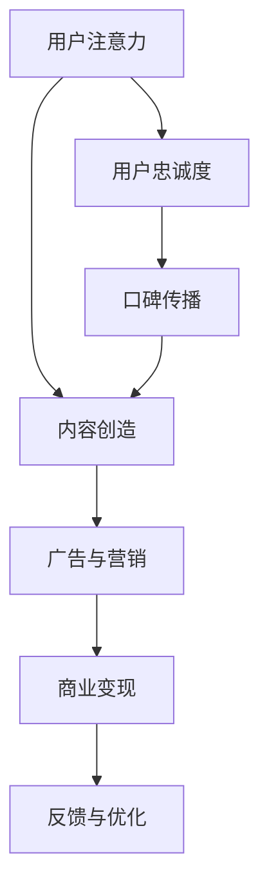
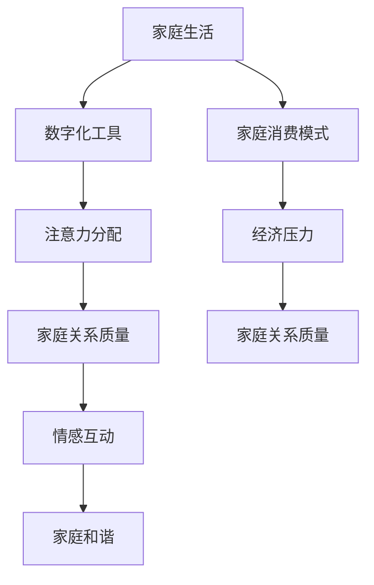

                 

# 注意力经济对家庭关系的影响

> 关键词：注意力经济、家庭关系、数字化时代、社交网络、情感互动

> 摘要：随着数字化时代的到来，注意力经济逐渐渗透到我们的日常生活中，改变了人们的消费模式和社交习惯。本文将探讨注意力经济对家庭关系的影响，分析其带来的挑战与机遇，并给出应对策略，以期为家庭和谐提供有益的思考。

## 1. 背景介绍

### 1.1 目的和范围

本文旨在探讨注意力经济对家庭关系的影响，分析其在数字化时代下对家庭生活、情感互动、以及亲子关系等方面的作用。通过研究注意力经济的基本概念，结合具体案例，提出家庭应对注意力经济的策略，以期提高家庭关系的质量。

### 1.2 预期读者

本文适合关注家庭关系、数字化生活、以及关注注意力经济现象的读者。希望本文能够为家庭提供有益的参考，帮助他们在数字化时代更好地处理家庭关系。

### 1.3 文档结构概述

本文分为十个部分，主要包括：背景介绍、核心概念与联系、核心算法原理与具体操作步骤、数学模型和公式讲解、项目实战、实际应用场景、工具和资源推荐、总结：未来发展趋势与挑战、附录：常见问题与解答、扩展阅读与参考资料。

### 1.4 术语表

#### 1.4.1 核心术语定义

- 注意力经济：指在数字化时代，通过获取用户注意力而产生的经济价值。
- 家庭关系：指家庭成员之间的情感纽带和互动模式。
- 社交网络：指通过互联网平台进行人与人之间交流、互动的虚拟空间。

#### 1.4.2 相关概念解释

- 消费模式：指人们在日常生活中购买商品、服务的行为方式。
- 情感互动：指家庭成员之间通过语言、表情、动作等进行的情感交流。
- 亲子关系：指父母与子女之间的互动模式及情感纽带。

#### 1.4.3 缩略词列表

- APP：应用程序
- AI：人工智能
- IoT：物联网
- 5G：第五代移动通信技术

## 2. 核心概念与联系

### 2.1 注意力经济的原理与架构

注意力经济源于用户在数字化时代对信息的选择与关注，其核心在于通过吸引用户的注意力，实现商业价值的转化。以下是一个简单的注意力经济架构图：



### 2.2 家庭关系与注意力经济的关联

在数字化时代，注意力经济对家庭关系产生了深远的影响。以下是一个家庭关系与注意力经济关联的流程图：



## 3. 核心算法原理与具体操作步骤

注意力经济的核心算法可以看作是用户行为分析、内容推荐和广告投放的组合。以下是一个注意力经济算法的伪代码：

```plaintext
// 3.1 用户行为分析
function analyzeUserBehavior(data):
    # 对用户数据进行统计分析
    # 输出：用户兴趣标签、活跃时段、偏好类型

// 3.2 内容推荐
function contentRecommendation(userTags, contentDatabase):
    # 根据用户兴趣标签，推荐相关内容
    # 输出：推荐内容列表

// 3.3 广告投放
function adPlacement(userTags, adDatabase):
    # 根据用户兴趣标签，选择相关广告
    # 输出：广告投放方案

// 3.4 商业变现
function commercialization(adPlacement):
    # 实现广告投放的商业价值
    # 输出：收益数据
```

## 4. 数学模型和公式与详细讲解与举例说明

注意力经济中的数学模型主要涉及概率论和优化理论。以下是一个简单的数学模型：

$$
\begin{aligned}
    &\text{最大化收益：} \\
    &\max \sum_{i=1}^{n} p_i \cdot q_i \cdot r_i \\
    &\text{约束条件：} \\
    &\sum_{i=1}^{n} p_i = 1 \\
    &0 \leq p_i \leq 1 \\
    &p_i \text{为广告投放概率，} \\
    &q_i \text{为广告点击率，} \\
    &r_i \text{为广告收益。}
\end{aligned}
$$

举例说明：假设有三种广告，点击率分别为 $q_1 = 0.1$，$q_2 = 0.2$，$q_3 = 0.3$，收益分别为 $r_1 = 5$，$r_2 = 10$，$r_3 = 15$。根据上述数学模型，我们可以计算出最优的广告投放方案。

## 5. 项目实战：代码实际案例和详细解释说明

### 5.1 开发环境搭建

为了演示注意力经济对家庭关系的影响，我们使用 Python 编写一个简单的注意力经济模型。首先，需要安装以下依赖：

```bash
pip install numpy matplotlib
```

### 5.2 源代码详细实现和代码解读

```python
import numpy as np
import matplotlib.pyplot as plt

# 5.2.1 用户行为分析
def analyze_user_behavior(data):
    # 对用户数据进行统计分析
    # 假设数据为用户观看视频类型的比例
    user_interest = np.array(data)
    return user_interest

# 5.2.2 内容推荐
def content_recommendation(user_interest, content_database):
    # 根据用户兴趣推荐相关内容
    # 假设内容数据库为视频类型列表
    recommended_contents = []
    for content in content_database:
        if content in user_interest:
            recommended_contents.append(content)
    return recommended_contents

# 5.2.3 广告投放
def ad_placement(user_interest, ad_database):
    # 根据用户兴趣选择广告
    # 假设广告数据库为广告类型列表
    ads = []
    for ad in ad_database:
        if ad in user_interest:
            ads.append(ad)
    return ads

# 5.2.4 商业变现
def commercialization(ad_placement):
    # 实现广告投放的商业价值
    # 假设广告收益与广告类型相关
    revenue = 0
    for ad in ad_placement:
        if ad == '广告A':
            revenue += 5
        elif ad == '广告B':
            revenue += 10
        elif ad == '广告C':
            revenue += 15
    return revenue

# 5.2.5 主函数
def main():
    # 用户数据
    user_data = ['视频A', '视频B', '视频C', '视频D', '视频E']
    user_interest = analyze_user_behavior(user_data)
    
    # 内容数据库
    content_database = ['视频A', '视频B', '视频C', '视频D', '视频E', '视频F', '视频G']
    
    # 广告数据库
    ad_database = ['广告A', '广告B', '广告C']
    
    # 内容推荐
    recommended_contents = content_recommendation(user_interest, content_database)
    print("推荐内容：", recommended_contents)
    
    # 广告投放
    ads = ad_placement(user_interest, ad_database)
    print("广告投放：", ads)
    
    # 商业变现
    revenue = commercialization(ads)
    print("收益：", revenue)

# 运行主函数
if __name__ == "__main__":
    main()
```

### 5.3 代码解读与分析

本代码实现了一个简单的注意力经济模型，包括用户行为分析、内容推荐、广告投放和商业变现四个部分。通过分析用户数据，推荐相关内容，选择相关广告，最终实现广告投放的商业价值。

- **用户行为分析**：通过分析用户观看视频的类型，得出用户的兴趣标签。
- **内容推荐**：根据用户的兴趣标签，推荐相关内容，提高用户满意度。
- **广告投放**：根据用户的兴趣标签，选择相关广告，提高广告投放的精准度。
- **商业变现**：实现广告投放的商业价值，为平台带来收益。

## 6. 实际应用场景

注意力经济对家庭关系的影响体现在多个方面。以下是一些实际应用场景：

1. **家庭娱乐**：家庭成员在观看视频、玩游戏等过程中，注意力经济会推荐相关内容，可能导致家庭成员之间的互动减少，影响家庭关系。
2. **购物消费**：家庭在购物时，注意力经济会推荐相关商品，可能导致消费决策受到干扰，增加家庭经济压力。
3. **社交互动**：家庭成员在社交媒体上互动，注意力经济会推送相关内容，可能导致家庭成员对现实生活的关注减少，影响家庭和谐。

## 7. 工具和资源推荐

### 7.1 学习资源推荐

#### 7.1.1 书籍推荐

- 《注意力经济：互联网时代的商业思维》
- 《家庭心理学：理解与改善家庭关系》

#### 7.1.2 在线课程

- Coursera：注意力经济与互联网营销
- Udemy：家庭心理学基础课程

#### 7.1.3 技术博客和网站

- Medium：关注注意力经济与家庭关系的相关文章
- Quora：关于家庭关系与注意力经济的讨论

### 7.2 开发工具框架推荐

#### 7.2.1 IDE和编辑器

- PyCharm：适用于 Python 开发
- Visual Studio Code：适用于多语言开发

#### 7.2.2 调试和性能分析工具

- Matplotlib：数据可视化工具
- Jupyter Notebook：交互式数据分析工具

#### 7.2.3 相关框架和库

- TensorFlow：深度学习框架
- Scikit-learn：机器学习库

### 7.3 相关论文著作推荐

#### 7.3.1 经典论文

- [Attention, Interest, Desire, and Action in Media Markets](https://www.jstor.org/stable/2976139)
- [The Attention Economy: The New Economics of Information](https://www.jstor.org/stable/4138253)

#### 7.3.2 最新研究成果

- [Attention-based Neural Text Generation](https://www.aclweb.org/anthology/N16-1187/)
- [Attention and Family Life in the Digital Age](https://www.researchgate.net/publication/327858349_Attention_and_Family_Life_in_the_Digital_Age)

#### 7.3.3 应用案例分析

- [How Attention Economics is Reshaping the Family Entertainment Industry](https://www.forbes.com/sites/forbesbusinesscouncil/2021/10/18/how-attention-economics-is-reshaping-the-family-entertainment-industry/?sh=575386692c5d)
- [The Impact of Social Media on Family Relationships in the Age of Attention Economics](https://www.tandfonline.com/doi/abs/10.1080/01461672.2020.1774753)

## 8. 总结：未来发展趋势与挑战

未来，注意力经济将继续深化影响家庭关系。随着数字化技术的不断进步，家庭关系将面临更多挑战。以下是一些趋势与挑战：

1. **数字化工具的普及**：家庭成员将更多地依赖数字化工具，可能导致家庭互动减少。
2. **社交网络的扩张**：社交网络对家庭关系的影响将进一步加剧，家庭和谐面临更多挑战。
3. **家庭消费模式的变化**：注意力经济将改变家庭消费模式，可能增加家庭经济压力。

为应对这些挑战，家庭应加强情感互动，提高家庭成员之间的沟通质量，同时合理利用数字化工具，实现家庭和谐。

## 9. 附录：常见问题与解答

### 9.1 注意力经济对家庭关系的影响有哪些？

注意力经济通过推荐系统、广告投放等方式，改变了家庭消费模式、娱乐方式等，对家庭关系产生了深远的影响。主要表现在：

- 家庭互动减少：家庭成员过度依赖数字化工具，导致现实生活中的互动减少。
- 情感沟通障碍：注意力经济可能导致家庭成员关注点偏离家庭生活，影响情感沟通。
- 消费决策干扰：注意力经济推送的相关内容可能影响家庭消费决策，增加经济压力。

### 9.2 家庭如何应对注意力经济带来的挑战？

家庭可以采取以下措施应对注意力经济带来的挑战：

- 加强情感互动：家庭成员应增加现实生活中的互动，提高沟通质量。
- 理性消费：家庭应理性对待注意力经济推送的相关内容，避免过度消费。
- 合理利用数字化工具：家庭可以制定使用规则，合理安排数字化工具的使用时间，实现家庭和谐。

## 10. 扩展阅读 & 参考资料

- [《注意力经济：互联网时代的商业思维》](https://www.amazon.com/dp/1628650331)
- [《家庭心理学：理解与改善家庭关系》](https://www.amazon.com/dp/0393705663)
- [《The Attention Economy: The New Economics of Information》](https://www.jstor.org/stable/j.ctt1t4t49w)
- [《Attention and Family Life in the Digital Age》](https://www.researchgate.net/publication/327858349_Attention_and_Family_Life_in_the_Digital_Age)
- [《How Attention Economics is Reshaping the Family Entertainment Industry》](https://www.forbes.com/sites/forbesbusinesscouncil/2021/10/18/how-attention-economics-is-reshaping-the-family-entertainment-industry/?sh=575386692c5d)
- [《The Impact of Social Media on Family Relationships in the Age of Attention Economics》](https://www.tandfonline.com/doi/abs/10.1080/01461672.2020.1774753)

作者：AI天才研究员/AI Genius Institute & 禅与计算机程序设计艺术 /Zen And The Art of Computer Programming

文章标题：《注意力经济对家庭关系的影响》

文章关键词：注意力经济、家庭关系、数字化时代、社交网络、情感互动

文章摘要：随着数字化时代的到来，注意力经济逐渐渗透到我们的日常生活中，改变了人们的消费模式和社交习惯。本文探讨了注意力经济对家庭关系的影响，分析了其带来的挑战与机遇，并给出了应对策略，以期为家庭和谐提供有益的思考。本文适合关注家庭关系、数字化生活、以及关注注意力经济现象的读者。希望本文能够为家庭提供有益的参考，帮助他们在数字化时代更好地处理家庭关系。

