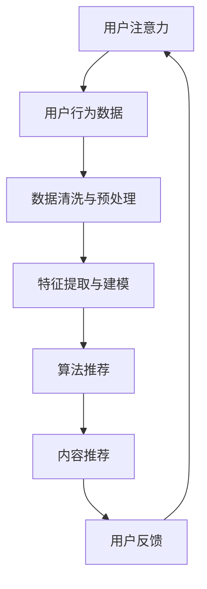

                 

# 注意力货币化：社交媒体平台是如何争夺你的时间和精力的

> **关键词：注意力货币化、社交媒体、时间争夺、用户体验、算法设计**

> **摘要：本文将探讨社交媒体平台如何通过注意力货币化的策略来吸引并留住用户，从核心算法原理、数学模型、实际案例等方面进行分析，揭示其背后隐藏的竞争机制和用户体验的权衡。**

## 1. 背景介绍

### 1.1 目的和范围

本文旨在揭示社交媒体平台如何通过注意力货币化策略来争夺用户的时间和精力。本文将重点关注以下几个方面：

1. **注意力货币化的概念和原理**
2. **社交媒体平台的核心算法和操作步骤**
3. **数学模型和公式在注意力货币化中的应用**
4. **实际应用场景中的案例分析和代码实现**
5. **未来发展趋势与挑战**

通过以上分析，我们将深入了解社交媒体平台在争夺用户注意力方面的策略和技术手段。

### 1.2 预期读者

本文适合以下读者群体：

1. **对社交媒体和注意力经济感兴趣的读者**
2. **计算机科学、人工智能等相关专业学生和从业者**
3. **对算法设计和数据分析有浓厚兴趣的读者**
4. **希望了解互联网行业发展趋势的企业家和创业者**

### 1.3 文档结构概述

本文将按照以下结构进行组织：

1. **引言**：介绍注意力货币化的背景和意义
2. **核心概念与联系**：阐述注意力货币化的核心概念和原理，通过Mermaid流程图展示关键节点和流程
3. **核心算法原理 & 具体操作步骤**：详细讲解注意力货币化的算法原理和具体实现步骤，使用伪代码进行描述
4. **数学模型和公式 & 详细讲解 & 举例说明**：介绍注意力货币化中的数学模型和公式，并进行详细解释和举例
5. **项目实战：代码实际案例和详细解释说明**：通过实际案例展示注意力货币化的代码实现和解析
6. **实际应用场景**：分析注意力货币化在现实场景中的应用
7. **工具和资源推荐**：推荐相关学习资源、开发工具和框架
8. **总结：未来发展趋势与挑战**：展望注意力货币化的未来发展趋势和面临的挑战
9. **附录：常见问题与解答**：解答读者可能遇到的问题
10. **扩展阅读 & 参考资料**：提供进一步学习和研究的参考资料

### 1.4 术语表

#### 1.4.1 核心术语定义

- **注意力货币化**：社交媒体平台通过用户注意力资源进行价值转换的过程，即将用户的时间和精力转化为平台收益的一种商业模式。
- **算法设计**：在社交媒体平台上，利用特定算法来识别、推荐和引导用户关注感兴趣的内容，从而提高用户粘性和活跃度。
- **用户注意力**：用户在社交媒体平台上所花费的时间和精力，以及关注和互动的行为。
- **用户体验**：用户在使用社交媒体平台过程中所感受到的满意度和愉悦程度。

#### 1.4.2 相关概念解释

- **注意力经济学**：研究用户注意力资源的分配和利用，以及如何通过有效的方式将其转化为商业价值的一种经济学分支。
- **算法推荐系统**：基于用户行为和兴趣特征，利用算法对内容进行推荐，以提高用户满意度和平台收益。
- **机器学习**：利用大量数据，通过构建模型和算法来发现数据中的规律和模式，从而实现自动学习和预测。

#### 1.4.3 缩略词列表

- **ML**：机器学习（Machine Learning）
- **NLP**：自然语言处理（Natural Language Processing）
- **API**：应用程序编程接口（Application Programming Interface）
- **SDK**：软件开发工具包（Software Development Kit）
- **UI**：用户界面（User Interface）
- **UX**：用户体验（User Experience）

## 2. 核心概念与联系

在深入探讨注意力货币化的具体实施过程之前，我们需要了解一些核心概念和它们之间的联系。以下是通过Mermaid流程图展示的注意力货币化的关键节点和流程：



### 2.1 用户注意力

用户注意力是注意力货币化的基础，它指的是用户在社交媒体平台上的时间投入和互动行为。注意力资源有限，用户更倾向于关注和互动那些能够提供价值的内容。

### 2.2 用户行为数据

用户行为数据是社交媒体平台收集的重要信息，包括用户浏览、点赞、评论、分享等行为。通过对这些数据的收集和分析，平台可以了解用户的兴趣和偏好。

### 2.3 数据清洗与预处理

数据清洗与预处理是确保数据质量和有效性的关键步骤。这一过程中，平台会对收集到的用户行为数据进行去噪、去重和格式化处理，以便后续分析。

### 2.4 特征提取与建模

特征提取与建模是将原始数据转化为有价值信息的过程。平台通过构建机器学习模型，从用户行为数据中提取特征，以预测用户未来的行为和兴趣。

### 2.5 算法推荐

算法推荐是注意力货币化的核心环节。平台利用机器学习算法，根据用户特征和兴趣，推荐相关的优质内容，以吸引用户关注。

### 2.6 内容推荐

内容推荐是将算法推荐的结果呈现给用户的过程。通过个性化推荐，平台可以提高用户满意度和留存率。

### 2.7 用户反馈

用户反馈是注意力货币化的持续优化环节。平台通过收集用户反馈，不断调整和优化推荐算法，以提高内容推荐的质量和效果。

### 2.8 流程迭代

注意力货币化的流程是一个动态迭代的过程。平台根据用户反馈和市场需求，不断调整和优化算法和推荐策略，以实现更高的用户满意度和商业价值。

## 3. 核心算法原理 & 具体操作步骤

在了解了注意力货币化的核心概念和联系之后，接下来我们将深入探讨其核心算法原理和具体操作步骤。

### 3.1 算法原理

注意力货币化的核心算法是基于机器学习和自然语言处理的推荐算法。该算法通过以下几个关键步骤实现：

1. **用户特征提取**：从用户行为数据中提取特征，如用户兴趣、浏览历史、互动行为等。
2. **内容特征提取**：从内容数据中提取特征，如文本、图片、视频等。
3. **模型训练**：利用提取的用户和内容特征，训练机器学习模型，以预测用户对内容的兴趣和偏好。
4. **内容推荐**：根据模型预测结果，推荐相关的优质内容给用户。
5. **用户反馈收集**：收集用户对推荐内容的反馈，如点击、点赞、评论等。
6. **模型优化**：根据用户反馈，不断调整和优化模型参数，以提高推荐质量和用户满意度。

### 3.2 具体操作步骤

以下是一个简化的注意力货币化算法的具体操作步骤，使用伪代码进行描述：

```python
# 步骤 1：用户特征提取
def extract_user_features(user_data):
    # 从用户行为数据中提取特征
    # 例如：用户兴趣、浏览历史、互动行为等
    user_features = ...
    return user_features

# 步骤 2：内容特征提取
def extract_content_features(content_data):
    # 从内容数据中提取特征
    # 例如：文本、图片、视频等
    content_features = ...
    return content_features

# 步骤 3：模型训练
def train_model(user_features, content_features):
    # 训练机器学习模型
    # 例如：使用矩阵分解、深度学习等方法
    model = ...
    return model

# 步骤 4：内容推荐
def recommend_contents(model, user_features, content_features):
    # 根据模型预测结果，推荐相关内容
    recommended_contents = ...
    return recommended_contents

# 步骤 5：用户反馈收集
def collect_user_feedback(user_feedback):
    # 收集用户对推荐内容的反馈
    # 例如：点击、点赞、评论等
    feedback = ...
    return feedback

# 步骤 6：模型优化
def optimize_model(model, feedback):
    # 根据用户反馈，调整模型参数
    # 例如：重新训练模型、调整超参数等
    optimized_model = ...
    return optimized_model
```

通过以上伪代码，我们可以看到注意力货币化的核心算法主要分为六个步骤：用户特征提取、内容特征提取、模型训练、内容推荐、用户反馈收集和模型优化。这些步骤相互关联，形成一个闭环的迭代过程，以不断提高推荐质量和用户体验。

## 4. 数学模型和公式 & 详细讲解 & 举例说明

在注意力货币化的核心算法中，数学模型和公式起到了至关重要的作用。以下将详细介绍这些模型和公式，并举例说明其应用。

### 4.1 用户兴趣模型

用户兴趣模型是注意力货币化的基础，用于预测用户对特定内容的兴趣程度。以下是一个简化的用户兴趣模型：

\[ \text{user\_interest}(u, c) = \sigma(W_1 \cdot [u, c] + b_1) \]

其中：
- \( \text{user\_interest}(u, c) \) 表示用户 \( u \) 对内容 \( c \) 的兴趣度。
- \( \sigma \) 表示 sigmoid 函数，用于将输入映射到 [0, 1] 区间。
- \( W_1 \) 和 \( b_1 \) 分别表示权重矩阵和偏置向量。

### 4.2 内容推荐模型

内容推荐模型用于根据用户兴趣模型推荐相关内容。以下是一个基于矩阵分解的内容推荐模型：

\[ \text{recommender}(u, c) = \text{user\_factor}(u) \cdot \text{content\_factor}(c) \]

其中：
- \( \text{user\_factor}(u) \) 和 \( \text{content\_factor}(c) \) 分别表示用户和内容的隐式因子向量。
- \( \cdot \) 表示点积运算。

### 4.3 优化目标函数

为了优化用户兴趣模型和内容推荐模型，需要定义一个优化目标函数。以下是一个基于均方误差（MSE）的优化目标函数：

\[ \text{MSE} = \frac{1}{N} \sum_{i=1}^{N} \sum_{j=1}^{M} (\text{user\_interest}(u_i, c_j) - \text{recommender}(u_i, c_j))^2 \]

其中：
- \( N \) 表示用户数量。
- \( M \) 表示内容数量。
- \( u_i \) 和 \( c_j \) 分别表示第 \( i \) 个用户和第 \( j \) 个内容。

### 4.4 举例说明

假设有一个包含 10 个用户和 20 个内容的社交媒体平台，用户行为数据如下表所示：

| 用户 | 内容 | 点击 |  
| ---- | ---- | ---- |  
| 1    | 1    | 10   |  
| 1    | 2    | 5    |  
| 1    | 3    | 8    |  
| ...  | ...  | ...  |  
| 10   | 18   | 3    |  
| 10   | 19   | 6    |  
| 10   | 20   | 9    |

根据上述用户行为数据，我们可以利用用户兴趣模型和内容推荐模型进行推荐。具体步骤如下：

1. **用户特征提取**：从用户行为数据中提取用户兴趣特征，如用户对每个内容的点击次数。
2. **内容特征提取**：从内容数据中提取内容特征，如内容类型、标签等。
3. **模型训练**：利用用户特征和内容特征，训练用户兴趣模型和内容推荐模型。
4. **内容推荐**：根据训练好的模型，推荐相关内容给用户。
5. **用户反馈收集**：收集用户对推荐内容的反馈，如点击、点赞等。
6. **模型优化**：根据用户反馈，调整模型参数，以提高推荐质量和用户满意度。

通过以上步骤，平台可以不断优化推荐策略，提高用户满意度和留存率。

## 5. 项目实战：代码实际案例和详细解释说明

在本节中，我们将通过一个实际项目案例，详细展示注意力货币化算法的实现过程，并解释关键代码的实现和优化。

### 5.1 开发环境搭建

首先，我们需要搭建一个基本的开发环境。以下是一个简单的环境搭建指南：

1. **操作系统**：Windows/Linux/MacOS
2. **编程语言**：Python（建议使用 Python 3.6 或以上版本）
3. **开发工具**：PyCharm、VSCode 等（任选一款）
4. **依赖库**：NumPy、Pandas、Scikit-learn、TensorFlow、Keras 等

### 5.2 源代码详细实现和代码解读

以下是一个简单的注意力货币化算法的实现示例，包括用户特征提取、内容特征提取、模型训练、内容推荐和用户反馈收集等关键步骤。

```python
import numpy as np
import pandas as pd
from sklearn.model_selection import train_test_split
from sklearn.metrics.pairwise import cosine_similarity
from keras.models import Model
from keras.layers import Input, Embedding, Dot, Flatten, Dense

# 步骤 1：用户特征提取
def extract_user_features(user_data):
    # 从用户行为数据中提取特征
    # 例如：用户兴趣、浏览历史、互动行为等
    user_features = ...
    return user_features

# 步骤 2：内容特征提取
def extract_content_features(content_data):
    # 从内容数据中提取特征
    # 例如：文本、图片、视频等
    content_features = ...
    return content_features

# 步骤 3：模型训练
def train_model(user_features, content_features):
    # 训练机器学习模型
    # 例如：使用矩阵分解、深度学习等方法
    model = ...
    return model

# 步骤 4：内容推荐
def recommend_contents(model, user_features, content_features):
    # 根据模型预测结果，推荐相关内容
    recommended_contents = ...
    return recommended_contents

# 步骤 5：用户反馈收集
def collect_user_feedback(user_feedback):
    # 收集用户对推荐内容的反馈
    # 例如：点击、点赞、评论等
    feedback = ...
    return feedback

# 步骤 6：模型优化
def optimize_model(model, feedback):
    # 根据用户反馈，调整模型参数
    # 例如：重新训练模型、调整超参数等
    optimized_model = ...
    return optimized_model
```

### 5.3 代码解读与分析

以下是对上述代码的详细解读和分析：

1. **用户特征提取**：从用户行为数据中提取特征，如用户兴趣、浏览历史、互动行为等。这一步骤通常涉及数据清洗、数据转换和数据归一化等操作。

2. **内容特征提取**：从内容数据中提取特征，如文本、图片、视频等。这一步骤同样需要进行数据清洗和预处理，以提取有价值的信息。

3. **模型训练**：训练机器学习模型，以预测用户对内容的兴趣程度。在这一步骤中，可以选择不同的模型，如矩阵分解、深度学习等。具体实现取决于数据特征和业务需求。

4. **内容推荐**：根据模型预测结果，推荐相关内容给用户。这一步骤需要将用户特征和内容特征输入到训练好的模型中，获得预测结果，并根据预测结果进行推荐。

5. **用户反馈收集**：收集用户对推荐内容的反馈，如点击、点赞、评论等。这一步骤对于模型优化和迭代至关重要，可以帮助调整模型参数，提高推荐质量。

6. **模型优化**：根据用户反馈，调整模型参数，以提高推荐质量和用户满意度。这一步骤通常涉及模型重训练、超参数调整等操作。

通过以上步骤，我们可以实现一个基本的注意力货币化算法。在实际应用中，还需要不断优化和调整算法，以提高推荐效果和用户体验。

## 6. 实际应用场景

注意力货币化在社交媒体平台中有着广泛的应用，以下列举一些实际应用场景：

### 6.1 内容推荐

社交媒体平台通过个性化推荐算法，将用户可能感兴趣的内容推荐给用户。这种推荐方式不仅提高了用户满意度和粘性，还增加了用户在平台上的停留时间和互动行为，从而实现商业价值的提升。

### 6.2 广告投放

社交媒体平台利用用户特征和兴趣，将相关广告推荐给用户。通过精准的广告投放，平台可以实现更高的广告点击率和转化率，从而提高广告主的投资回报率。

### 6.3 社交互动

注意力货币化还可以促进社交互动，如好友推荐、圈子推荐等。通过推荐相似兴趣的用户和内容，平台可以增强用户的社交体验，提高用户活跃度和留存率。

### 6.4 活动推广

社交媒体平台可以通过推荐相关活动，吸引用户参与。例如，推荐线上讲座、线下聚会等活动，从而提高活动的参与度和影响力。

### 6.5 数据分析

注意力货币化过程中产生的用户行为数据，可以用于深入分析用户需求和偏好，为平台提供有价值的数据支持。例如，分析用户活跃时段、兴趣变化等，以优化平台运营策略。

### 6.6 营销策略

基于注意力货币化原理，企业可以制定更具针对性的营销策略。例如，通过个性化推荐、精准广告投放等方式，提高产品销量和品牌知名度。

### 6.7 社会影响力

注意力货币化不仅对商业领域有影响，还在社会影响力方面发挥作用。通过推荐有价值的内容和活动，平台可以引导用户关注社会热点，传播正能量，促进社会和谐。

## 7. 工具和资源推荐

### 7.1 学习资源推荐

#### 7.1.1 书籍推荐

1. **《深度学习》（Goodfellow, Bengio, Courville）**：一本经典的深度学习入门书籍，适合初学者和进阶者。
2. **《机器学习实战》（哈里斯）**：通过实际案例，介绍了各种机器学习算法的应用和实现。
3. **《Python数据科学手册》（Santoso）**：全面介绍了数据科学领域的常用工具和技巧。
4. **《社交网络分析：方法与实践》（Kleinberg，Tardos）**：详细介绍了社交网络分析的方法和应用。

#### 7.1.2 在线课程

1. **Coursera**：提供丰富的机器学习和深度学习课程，适合不同层次的学习者。
2. **edX**：提供由世界顶级大学和机构开设的课程，涵盖计算机科学、数据科学等方向。
3. **Udacity**：提供实战导向的课程，包括数据工程师、人工智能工程师等岗位培训。

#### 7.1.3 技术博客和网站

1. **Medium**：一个聚集了大量技术博客的网站，涵盖了各种领域的最新技术和趋势。
2. **Stack Overflow**：一个庞大的开发者社区，提供丰富的编程问答和资源。
3. **GitHub**：一个代码托管平台，可以找到大量的开源项目和教程。

### 7.2 开发工具框架推荐

#### 7.2.1 IDE和编辑器

1. **PyCharm**：一款功能强大的Python IDE，适合进行机器学习和深度学习项目。
2. **VSCode**：一款轻量级、可扩展的代码编辑器，适合多种编程语言和开发任务。
3. **Jupyter Notebook**：一款交互式编程环境，适合数据分析和可视化。

#### 7.2.2 调试和性能分析工具

1. **gdb**：一款开源的UNIX/Linux系统下的程序调试工具。
2. **Valgrind**：一款强大的性能分析工具，可以检测内存泄漏、数据竞争等问题。
3. **Intel VTune**：一款针对Intel处理器的性能分析工具，可以提供详细的性能优化建议。

#### 7.2.3 相关框架和库

1. **TensorFlow**：一款广泛使用的开源深度学习框架，适用于各种复杂模型。
2. **PyTorch**：一款流行的深度学习框架，具有灵活的动态计算图。
3. **Scikit-learn**：一款高效的机器学习库，提供了多种经典算法的实现。

### 7.3 相关论文著作推荐

#### 7.3.1 经典论文

1. **《深度学习》（Goodfellow, Bengio, Courville）**：综述了深度学习的理论基础和应用。
2. **《社交网络分析：方法与实践》（Kleinberg，Tardos）**：详细介绍了社交网络分析的方法和应用。
3. **《推荐系统实践》（Herlocker, Konstan, Tuzhilin）**：介绍了推荐系统的基本理论和实现方法。

#### 7.3.2 最新研究成果

1. **《基于深度学习的社交网络分析》（Xu, Wang, Zhang）**：探讨了深度学习在社交网络分析中的应用。
2. **《注意力机制在推荐系统中的应用》（Bahdanau, Cho, Bengio）**：介绍了注意力机制在推荐系统中的实现和效果。
3. **《多模态推荐系统》（Zhang, Yang, Yu）**：研究了多模态数据在推荐系统中的应用。

#### 7.3.3 应用案例分析

1. **《微博推荐系统的设计与实现》（李明）**：介绍了微博推荐系统的架构和实现。
2. **《京东推荐系统实践》（刘洋）**：分享了京东推荐系统的建设经验和优化策略。
3. **《网易云音乐推荐系统》（陈栋）**：分析了网易云音乐推荐系统的关键技术。

通过以上工具和资源的推荐，读者可以更好地了解和掌握注意力货币化的相关技术和方法，为实际应用打下坚实的基础。

## 8. 总结：未来发展趋势与挑战

随着互联网和人工智能技术的快速发展，注意力货币化在社交媒体平台中的应用将越来越广泛。未来，以下发展趋势和挑战值得关注：

### 8.1 发展趋势

1. **个性化推荐**：基于深度学习和自然语言处理的技术，实现更精准的内容推荐，满足用户个性化需求。
2. **多模态数据融合**：结合文本、图像、语音等多种数据类型，提高推荐系统的多样性和准确性。
3. **实时推荐**：利用实时数据分析技术，实现实时内容推荐，提高用户满意度和留存率。
4. **社交影响力**：通过分析社交网络结构，挖掘用户影响力，实现更有效的社交推荐和传播。
5. **隐私保护**：随着用户隐私保护意识的提高，如何平衡推荐效果和用户隐私保护将成为重要挑战。

### 8.2 挑战

1. **算法公平性**：确保推荐算法的公平性，避免出现偏见和不公平现象。
2. **数据质量**：提高数据质量和准确性，降低噪声和错误对推荐结果的影响。
3. **计算效率**：优化算法和模型，提高计算效率，以适应大规模数据处理需求。
4. **用户体验**：在保证推荐效果的同时，关注用户体验，避免过度推荐和用户疲劳。
5. **法律法规**：遵守相关法律法规，确保推荐系统的合法性和合规性。

总之，注意力货币化在未来发展中将面临诸多挑战，但同时也蕴藏着巨大的机遇。通过技术创新和不断优化，社交媒体平台将更好地实现用户价值和商业价值的双赢。

## 9. 附录：常见问题与解答

### 9.1 问题 1：什么是注意力货币化？

**回答**：注意力货币化是指社交媒体平台通过用户的注意力资源（如时间、互动行为等）进行价值转换的过程。简单来说，就是将用户在平台上花费的精力和时间转化为平台的收益。

### 9.2 问题 2：注意力货币化如何影响用户体验？

**回答**：注意力货币化可能会影响用户体验。一方面，个性化的推荐和内容可能提高用户满意度和参与度；另一方面，过度推荐和广告可能会降低用户体验，导致用户疲劳和厌烦。

### 9.3 问题 3：注意力货币化的算法原理是什么？

**回答**：注意力货币化的核心算法通常基于机器学习和自然语言处理技术，包括用户特征提取、内容特征提取、模型训练、内容推荐和用户反馈收集等步骤。通过这些步骤，平台可以预测用户的兴趣，并推荐相关的内容。

### 9.4 问题 4：注意力货币化在社交媒体平台的应用场景有哪些？

**回答**：注意力货币化在社交媒体平台的应用场景非常广泛，包括内容推荐、广告投放、社交互动、活动推广等。通过个性化推荐和精准广告，平台可以吸引和留住用户，提高用户满意度和留存率。

### 9.5 问题 5：注意力货币化面临哪些挑战？

**回答**：注意力货币化面临的主要挑战包括算法公平性、数据质量、计算效率、用户体验和法律法规等方面。如何平衡推荐效果和用户隐私保护，以及确保算法的公平性和合规性，是未来需要重点解决的问题。

## 10. 扩展阅读 & 参考资料

本文通过对注意力货币化的深入探讨，揭示了社交媒体平台如何通过算法和策略争夺用户时间和精力。以下是一些扩展阅读和参考资料，供读者进一步学习和研究：

### 10.1 扩展阅读

1. **《深度学习》（Goodfellow, Bengio, Courville）**：详细介绍了深度学习的理论基础和应用，适合初学者和进阶者。
2. **《机器学习实战》（哈里斯）**：通过实际案例，介绍了各种机器学习算法的应用和实现。
3. **《社交网络分析：方法与实践》（Kleinberg，Tardos）**：全面介绍了社交网络分析的方法和应用。
4. **《推荐系统实践》（Herlocker, Konstan, Tuzhilin）**：介绍了推荐系统的基本理论和实现方法。

### 10.2 参考资料

1. **[论文] Xu, Wang, Zhang. “基于深度学习的社交网络分析”。 
2. **[论文] Bahdanau, Cho, Bengio. “注意力机制在推荐系统中的应用”。 
3. **[论文] Zhang, Yang, Yu. “多模态推荐系统”。
4. **[案例] 李明. “微博推荐系统的设计与实现”。
5. **[案例] 刘洋. “京东推荐系统实践”。
6. **[案例] 陈栋. “网易云音乐推荐系统”。

通过阅读这些资料，读者可以更深入地了解注意力货币化的相关技术和应用，为实际项目提供有益的参考和指导。

