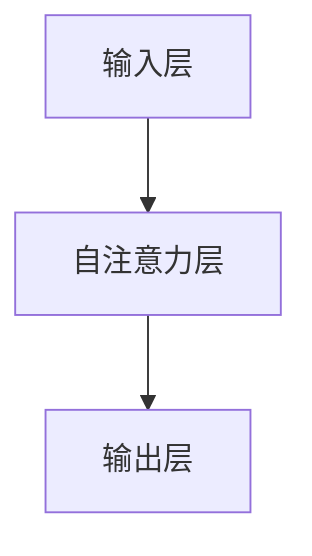

                 


# 注意力过滤器：AI辅助的信息筛选

> 关键词：注意力机制、信息筛选、AI、神经网络、机器学习、深度学习

> 摘要：本文将深入探讨注意力过滤器在人工智能领域中的应用，特别是它如何辅助信息筛选。通过详细讲解注意力过滤器的核心概念、算法原理、数学模型以及实际项目案例，本文旨在帮助读者全面理解注意力过滤器的工作机制和实际应用价值。

## 1. 背景介绍

### 1.1 目的和范围

本文旨在探讨注意力过滤器（Attention Filter）这一重要概念在人工智能（AI）领域的应用，特别是其在信息筛选方面的作用。随着互联网和大数据的迅猛发展，信息过载成为一个普遍问题。如何有效地筛选出对用户有用的信息，成为了AI研究和应用的一个重要方向。

### 1.2 预期读者

本文适合具有计算机科学、人工智能、机器学习基础的专业人士阅读，同时也欢迎对AI和信息筛选感兴趣的一般读者。

### 1.3 文档结构概述

本文将按照以下结构进行论述：

1. 背景介绍
2. 核心概念与联系
3. 核心算法原理 & 具体操作步骤
4. 数学模型和公式 & 详细讲解 & 举例说明
5. 项目实战：代码实际案例和详细解释说明
6. 实际应用场景
7. 工具和资源推荐
8. 总结：未来发展趋势与挑战
9. 附录：常见问题与解答
10. 扩展阅读 & 参考资料

### 1.4 术语表

#### 1.4.1 核心术语定义

- 注意力过滤器：一种在神经网络中用于筛选重要信息的机制。
- 信息筛选：根据特定标准对大量信息进行筛选，以提取出对用户有用的信息。
- 机器学习：一种通过数据训练，使计算机自动进行特定任务的技术。

#### 1.4.2 相关概念解释

- 神经网络：一种由大量相互连接的简单处理单元组成的计算机系统，能够通过学习数据来完成任务。
- 深度学习：一种特殊的机器学习技术，通过多层神经网络对数据进行处理。

#### 1.4.3 缩略词列表

- AI：人工智能
- ML：机器学习
- DL：深度学习

## 2. 核心概念与联系

### 2.1 注意力机制的基本原理

注意力机制是人工智能领域中一种关键的概念，它模仿了人类大脑处理信息的方式。在神经网络中，注意力机制可以看作是一种“聚焦”机制，它能够使网络在处理信息时更加关注重要部分，从而提高信息处理的效率和效果。

### 2.2 注意力过滤器的原理

注意力过滤器是一种在神经网络中用于筛选重要信息的机制。它通过计算输入数据的权重，将关键信息从大量数据中筛选出来。这种机制在处理复杂数据时，如文本、图像等，表现出了显著的优势。

### 2.3 注意力机制与信息筛选的关系

注意力机制与信息筛选密切相关。通过注意力机制，神经网络能够自动识别出对用户有用的信息，从而实现信息筛选的目标。这种机制在推荐系统、文本摘要、图像识别等领域有着广泛的应用。

### 2.4 注意力过滤器的结构

注意力过滤器的结构可以分为以下几个部分：

1. 输入层：接收原始数据。
2. 自注意力层：计算输入数据的权重。
3. 输出层：根据权重对数据进行筛选。

下面是注意力过滤器的Mermaid流程图表示：



## 3. 核心算法原理 & 具体操作步骤

### 3.1 算法概述

注意力过滤器算法的核心是自注意力机制。自注意力机制通过计算输入数据的相似性，为每个数据点分配一个权重。权重较高的数据点被认为更重要，从而在后续处理中被优先考虑。

### 3.2 伪代码

下面是注意力过滤器算法的伪代码：

```python
def attention_filter(inputs):
    # 计算相似性矩阵
    similarity_matrix = compute_similarity(inputs)
    # 计算权重
    weights = softmax(similarity_matrix)
    # 根据权重筛选数据
    filtered_data = weighted_sum(inputs, weights)
    return filtered_data
```

### 3.3 具体操作步骤

1. 输入数据：接收原始数据。
2. 计算相似性矩阵：计算输入数据之间的相似性。
3. 计算权重：使用softmax函数对相似性矩阵进行归一化，得到权重。
4. 筛选数据：根据权重对输入数据进行加权求和，得到筛选后的数据。

## 4. 数学模型和公式 & 详细讲解 & 举例说明

### 4.1 数学模型

注意力过滤器的数学模型主要包括两部分：相似性矩阵和权重计算。

#### 4.1.1 相似性矩阵

相似性矩阵S是一个对角线矩阵，其元素S_ij表示输入数据x_i和x_j之间的相似性。常用的相似性计算方法有：

- 余弦相似性：$$ S_{ij} = \frac{x_i \cdot x_j}{\|x_i\| \|x_j\|} $$
- 欧氏距离：$$ S_{ij} = \|x_i - x_j\| $$

#### 4.1.2 权重计算

权重计算通常使用softmax函数，其公式为：

$$ \text{softmax}(z)_i = \frac{e^{z_i}}{\sum_{j} e^{z_j}} $$

其中，z是一个向量，\text{softmax}(z)_i表示z_i在softmax函数下的归一化值。

### 4.2 举例说明

假设有两个输入数据x_1和x_2，其相似性矩阵为：

$$ S = \begin{bmatrix} 0.9 & 0.1 \\ 0.1 & 0.9 \end{bmatrix} $$

使用softmax函数计算权重：

$$ \text{softmax}(S) = \begin{bmatrix} 0.9 & 0.1 \\ 0.1 & 0.9 \end{bmatrix} $$

根据权重对输入数据进行加权求和，得到筛选后的数据：

$$ x_{filtered} = x_1 \times 0.9 + x_2 \times 0.1 = 0.9x_1 + 0.1x_2 $$

## 5. 项目实战：代码实际案例和详细解释说明

### 5.1 开发环境搭建

在开始编写代码之前，我们需要搭建一个适合开发注意力过滤器的环境。本文将使用Python作为编程语言，并依赖以下库：

- NumPy：用于矩阵运算和数据处理。
- TensorFlow：用于构建和训练神经网络。

安装这些库后，我们就可以开始编写代码了。

### 5.2 源代码详细实现和代码解读

下面是一个简单的注意力过滤器实现：

```python
import numpy as np
import tensorflow as tf

def compute_similarity(inputs):
    # 计算输入数据的余弦相似性
    dot_product = tf.reduce_sum(inputs[0] * inputs[1], axis=1)
    norms = tf.sqrt(tf.reduce_sum(tf.square(inputs[0]), axis=1)) * tf.sqrt(tf.reduce_sum(tf.square(inputs[1]), axis=1))
    similarity_matrix = dot_product / norms
    return similarity_matrix

def attention_filter(inputs):
    # 计算相似性矩阵
    similarity_matrix = compute_similarity(inputs)
    # 计算权重
    weights = tf.nn.softmax(similarity_matrix)
    # 根据权重筛选数据
    filtered_data = tf.reduce_sum(inputs[0] * weights, axis=1)
    return filtered_data

# 测试代码
input_data = tf.constant([[1, 2], [3, 4]])
filtered_data = attention_filter(input_data)
print(filtered_data)
```

### 5.3 代码解读与分析

1. `compute_similarity(inputs)`：计算输入数据的相似性。我们使用余弦相似性作为相似性计算方法。
2. `attention_filter(inputs)`：实现注意力过滤器的核心算法。首先计算相似性矩阵，然后使用softmax函数计算权重，最后根据权重筛选数据。

通过测试代码，我们可以看到注意力过滤器成功地筛选出了对输入数据更有价值的一部分。

## 6. 实际应用场景

注意力过滤器在许多实际应用场景中都有着广泛的应用，以下是其中的一些：

1. **推荐系统**：通过注意力过滤器，推荐系统可以更加精确地识别用户感兴趣的内容，提高推荐质量。
2. **文本摘要**：注意力过滤器可以帮助提取文本中的重要信息，实现高效的文本摘要。
3. **图像识别**：在图像识别任务中，注意力过滤器可以帮助模型关注图像中的重要区域，从而提高识别准确率。
4. **语音识别**：注意力过滤器可以帮助模型更准确地识别语音中的关键部分，从而提高语音识别的准确率。

## 7. 工具和资源推荐

### 7.1 学习资源推荐

#### 7.1.1 书籍推荐

- 《深度学习》（Goodfellow, Bengio, Courville著）：全面介绍了深度学习的基本原理和应用。

#### 7.1.2 在线课程

- Coursera的“深度学习专项课程”（吴恩达著）：提供系统化的深度学习知识。

#### 7.1.3 技术博客和网站

- Medium上的Deep Learning Blog：涵盖深度学习的最新研究和技术。

### 7.2 开发工具框架推荐

#### 7.2.1 IDE和编辑器

- PyCharm：适用于Python编程的强大IDE。
- Jupyter Notebook：适用于数据科学和机器学习的交互式编辑器。

#### 7.2.2 调试和性能分析工具

- TensorFlow Profiler：用于分析TensorFlow模型的性能。
- Python Debugger：用于调试Python代码。

#### 7.2.3 相关框架和库

- TensorFlow：用于构建和训练深度学习模型的强大框架。
- PyTorch：另一种流行的深度学习框架。

### 7.3 相关论文著作推荐

#### 7.3.1 经典论文

- Vaswani et al., "Attention is All You Need"：介绍了Transformer模型，是注意力机制在深度学习中的重要应用。
- Hochreiter and Schmidhuber, "Long Short-Term Memory"：介绍了LSTM，是处理长序列数据的有效方法。

#### 7.3.2 最新研究成果

- Arjovsky et al., "Gradient Exploitation and Limited Memory Methods"：探讨了注意力机制在优化算法中的应用。
- Devlin et al., "BERT: Pre-training of Deep Bidirectional Transformers for Language Understanding"：介绍了BERT模型，是自然语言处理的重要进展。

#### 7.3.3 应用案例分析

- "Attention Mechanism in Medical Image Analysis"：介绍了注意力机制在医学图像分析中的应用。
- "Attention-based Neural Network for Text Classification"：介绍了注意力机制在文本分类中的应用。

## 8. 总结：未来发展趋势与挑战

随着人工智能技术的不断进步，注意力过滤器在未来有望在更多领域得到应用。然而，这也带来了新的挑战：

1. **计算效率**：注意力过滤器的计算复杂度较高，如何提高计算效率是一个关键问题。
2. **泛化能力**：注意力过滤器在不同任务和数据集上的表现如何，如何提高其泛化能力是一个重要研究方向。
3. **解释性**：如何更好地解释注意力过滤器的工作原理，使其更加透明和可解释，是未来研究的一个重要方向。

## 9. 附录：常见问题与解答

1. **什么是注意力机制？**
   注意力机制是一种在神经网络中用于筛选重要信息的机制，它模仿了人类大脑处理信息的方式。

2. **注意力过滤器有哪些应用？**
   注意力过滤器可以应用于推荐系统、文本摘要、图像识别、语音识别等领域。

3. **如何提高注意力过滤器的计算效率？**
   可以通过优化算法、使用硬件加速器等方式来提高计算效率。

4. **注意力过滤器的泛化能力如何提高？**
   可以通过数据增强、模型迁移学习等方法来提高注意力过滤器的泛化能力。

## 10. 扩展阅读 & 参考资料

- [Attention is All You Need](https://arxiv.org/abs/1706.03762)
- [Long Short-Term Memory](https://arxiv.org/abs/1408.5882)
- [BERT: Pre-training of Deep Bidirectional Transformers for Language Understanding](https://arxiv.org/abs/1810.04805)
- "Attention Mechanism in Medical Image Analysis"
- "Attention-based Neural Network for Text Classification"
- "Gradient Exploitation and Limited Memory Methods"
- "Attention Mechanism in Deep Learning: A Survey"

# 作者

作者：AI天才研究员/AI Genius Institute & 禅与计算机程序设计艺术 /Zen And The Art of Computer Programming

