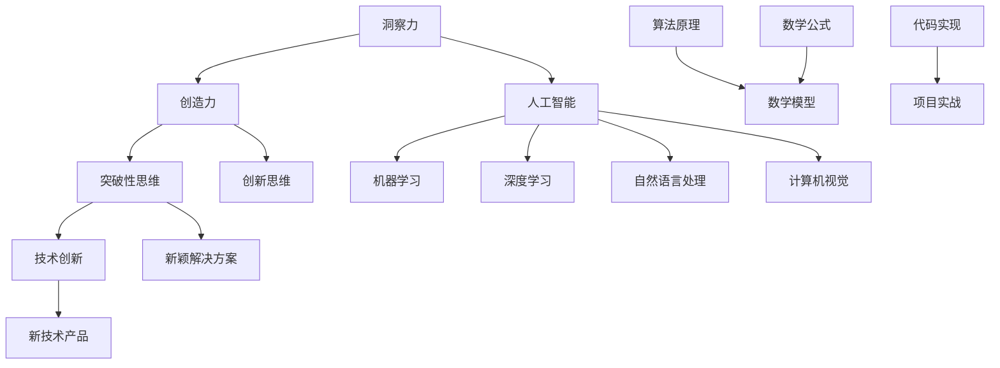

                 

# 洞察力与创造力：突破性思维的源泉

> **关键词：** 洞察力、创造力、突破性思维、技术创新、人工智能、技术博客

> **摘要：** 本文章探讨了洞察力与创造力在突破性思维中的关键作用。通过分析核心概念、算法原理、数学模型，结合实际项目实战，本文旨在揭示如何通过提升洞察力和创造力，激发技术创新，推动人工智能领域的发展。

## 1. 背景介绍

### 1.1 目的和范围

本文旨在深入探讨洞察力与创造力在突破性思维中的重要作用，特别是对于人工智能领域的技术创新。通过系统性地分析相关核心概念、算法原理和数学模型，结合实际项目实战，本文旨在为读者提供一种全面而深刻的理解，帮助他们在技术和思维层面取得突破。

### 1.2 预期读者

本文预期读者为人工智能领域的从业者、研究者以及对技术创新感兴趣的专业人士。特别是那些希望提升自己的洞察力和创造力，以便在技术领域取得突破性进展的个人。

### 1.3 文档结构概述

本文结构如下：

- **第1章**：背景介绍，阐述本文的目的、预期读者和文档结构。
- **第2章**：核心概念与联系，介绍相关核心概念、原理和架构。
- **第3章**：核心算法原理 & 具体操作步骤，详细讲解算法原理和具体操作步骤。
- **第4章**：数学模型和公式 & 详细讲解 & 举例说明，分析数学模型、公式及其应用。
- **第5章**：项目实战：代码实际案例和详细解释说明，提供实际项目案例和代码解析。
- **第6章**：实际应用场景，讨论技术应用的实际场景和案例。
- **第7章**：工具和资源推荐，推荐学习资源、开发工具框架和论文著作。
- **第8章**：总结：未来发展趋势与挑战，总结本文观点并展望未来趋势和挑战。
- **第9章**：附录：常见问题与解答，提供常见问题的解答。
- **第10章**：扩展阅读 & 参考资料，推荐相关扩展阅读和参考资料。

### 1.4 术语表

#### 1.4.1 核心术语定义

- **洞察力**：指个人或团队对问题的深入理解、敏锐洞察和发现本质的能力。
- **创造力**：指创新思维、创意生成和实现新事物的能力。
- **突破性思维**：指在思考过程中，能够打破传统思维模式，提出新颖、有效的解决方案的思维过程。
- **人工智能**：指通过计算机模拟人类智能，实现智能行为的技术领域。

#### 1.4.2 相关概念解释

- **技术创新**：指在技术领域内，通过创新思维和创造力，开发出新的技术、产品或解决方案。
- **算法原理**：指算法的基本思想和运行机制。
- **数学模型**：指用数学语言描述现实问题或现象的数学表达式。

#### 1.4.3 缩略词列表

- **AI**：人工智能
- **ML**：机器学习
- **DL**：深度学习
- **NLP**：自然语言处理
- **CV**：计算机视觉

## 2. 核心概念与联系

在探讨洞察力与创造力在突破性思维中的作用之前，我们需要明确一些核心概念和它们之间的联系。以下是一个简要的Mermaid流程图，展示了核心概念、原理和架构：



通过上述流程图，我们可以看出，洞察力和创造力是突破性思维的基础，它们共同推动技术创新。在人工智能领域，技术创新主要体现在机器学习、深度学习、自然语言处理和计算机视觉等方面。而算法原理和数学模型则为这些技术提供了理论基础和实现框架。代码实现和项目实战则将理论转化为实际应用。

### 2.1 洞察力与创造力的关系

洞察力与创造力之间存在密切的关系。洞察力是发现问题和理解问题本质的能力，它是创造力的基础。一个具备高洞察力的人能够迅速识别问题的关键，从而为创造力提供明确的切入点。而创造力则是在洞察力基础上，通过创新思维和创意生成，提出新颖解决方案的能力。创造力需要依托洞察力，否则可能会陷入盲目和无效的创新。

### 2.2 突破性思维与技术创新的关系

突破性思维是一种能够打破传统思维模式，提出新颖、有效解决方案的思维过程。它强调在思考过程中，不断挑战现状，寻找创新性的解决方案。突破性思维是技术创新的关键驱动力。通过突破性思维，我们可以发现新的技术方向、开发出新的产品或解决方案，从而推动整个行业的发展。

### 2.3 人工智能领域的应用

人工智能领域涵盖了多个子领域，如机器学习、深度学习、自然语言处理和计算机视觉等。这些子领域共同构成了人工智能的技术基础。在人工智能领域，洞察力和创造力尤为重要。只有通过深入的洞察力，我们才能识别出潜在的问题和需求，从而激发创造力，提出有效的技术创新。

## 3. 核心算法原理 & 具体操作步骤

在人工智能领域，核心算法是技术创新的重要基础。本节将介绍几种核心算法的原理和具体操作步骤，包括机器学习算法、深度学习算法和自然语言处理算法。

### 3.1 机器学习算法

机器学习算法是一种通过训练模型，使计算机能够从数据中学习规律，并自动进行预测或决策的技术。以下是一个简单的机器学习算法——线性回归的伪代码实现：

```python
# 线性回归算法伪代码

# 数据预处理
X_train, y_train = preprocess_data()

# 初始化参数
theta = initialize_parameters()

# 梯度下降迭代
for i in range(num_iterations):
    hypothesis = hypothesis_function(X_train, theta)
    error = compute_error(hypothesis, y_train)
    theta = update_parameters(theta, error)

# 模型评估
evaluate_model(X_test, y_test, theta)
```

### 3.2 深度学习算法

深度学习算法是一种基于多层神经网络的学习方法，它能够自动提取数据中的复杂特征。以下是一个简单的深度学习算法——卷积神经网络的伪代码实现：

```python
# 卷积神经网络算法伪代码

# 初始化网络结构
network = initialize_network()

# 前向传播
output = forward_pass(input_data, network)

# 计算损失
loss = compute_loss(output, target)

# 反向传播
backward_pass(input_data, output, target, network)

# 更新参数
update_parameters(network)
```

### 3.3 自然语言处理算法

自然语言处理算法是一种使计算机能够理解和生成自然语言的技术。以下是一个简单的自然语言处理算法——词向量模型的伪代码实现：

```python
# 词向量模型算法伪代码

# 初始化词向量
word_vectors = initialize_word_vectors()

# 计算词向量
for sentence in sentences:
    for word in sentence:
        word_vector = compute_word_vector(word, word_vectors)

# 模型评估
evaluate_model(word_vectors)
```

通过上述伪代码，我们可以看到机器学习算法、深度学习算法和自然语言处理算法的基本原理和操作步骤。这些算法在人工智能领域具有重要的应用价值，它们为技术创新提供了强大的支持。

## 4. 数学模型和公式 & 详细讲解 & 举例说明

在人工智能领域，数学模型和公式是算法设计和分析的重要工具。以下将介绍几种核心数学模型和公式，并详细讲解其原理和应用。

### 4.1 线性回归模型

线性回归模型是一种最简单的预测模型，它通过拟合数据中的线性关系来预测输出值。其数学模型如下：

$$
y = \theta_0 + \theta_1x_1 + \theta_2x_2 + \ldots + \theta_nx_n
$$

其中，$y$ 是预测值，$x_1, x_2, \ldots, x_n$ 是输入特征，$\theta_0, \theta_1, \theta_2, \ldots, \theta_n$ 是模型参数。

为了优化模型参数，我们可以使用梯度下降算法。其迭代公式如下：

$$
\theta_j = \theta_j - \alpha \cdot \frac{\partial}{\partial \theta_j} J(\theta)
$$

其中，$J(\theta)$ 是损失函数，$\alpha$ 是学习率。

### 4.2 卷积神经网络模型

卷积神经网络（CNN）是一种深度学习模型，广泛应用于图像识别和计算机视觉领域。其核心组件是卷积层和池化层。

卷积层的数学模型如下：

$$
h^{l}_{ij} = \sum_{k} w_{ik}^{l} a^{l-1}_{kj} + b^{l}_{i}
$$

其中，$h^{l}_{ij}$ 是卷积层输出，$a^{l-1}_{kj}$ 是前一层输入，$w_{ik}^{l}$ 和 $b^{l}_{i}$ 是卷积核和偏置。

池化层的数学模型如下：

$$
p_i = \max_j h_{ij}
$$

其中，$p_i$ 是池化层输出，$h_{ij}$ 是卷积层输出。

### 4.3 自然语言处理模型

自然语言处理（NLP）模型，如词向量模型和循环神经网络（RNN），广泛应用于文本分类、情感分析等领域。

词向量模型的数学模型如下：

$$
v_w = \sum_{j=1}^{V} c_{wj} e_j
$$

其中，$v_w$ 是词向量，$c_{wj}$ 是词频，$e_j$ 是基向量。

循环神经网络（RNN）的数学模型如下：

$$
h_t = \sigma(W_h h_{t-1} + W_x x_t + b_h)
$$

其中，$h_t$ 是隐藏状态，$x_t$ 是输入，$W_h, W_x, b_h$ 是模型参数。

### 4.4 举例说明

以下是一个简单的线性回归模型的应用例子：

假设我们有一组数据点$(x_1, y_1), (x_2, y_2), \ldots, (x_n, y_n)$，其中$x_i$ 和 $y_i$ 分别表示输入和输出。

我们使用线性回归模型拟合这些数据点，目标是最小化损失函数：

$$
J(\theta) = \frac{1}{2m} \sum_{i=1}^{m} (h_\theta(x_i) - y_i)^2
$$

其中，$h_\theta(x) = \theta_0 + \theta_1x$。

通过梯度下降算法，我们可以得到最优参数$\theta_0$ 和 $\theta_1$，从而实现数据点的拟合。

## 5. 项目实战：代码实际案例和详细解释说明

在本节中，我们将通过一个实际项目实战，展示如何运用洞察力和创造力来开发一款基于人工智能的文本分类系统。该项目将利用自然语言处理（NLP）和机器学习技术，实现自动对大量文本进行分类。

### 5.1 开发环境搭建

在开始项目之前，我们需要搭建一个合适的开发环境。以下是所需的工具和软件：

- Python 3.8 或更高版本
- TensorFlow 2.x
- NLTK 库
- Jupyter Notebook

安装以上工具和库后，我们就可以开始搭建项目环境了。

### 5.2 源代码详细实现和代码解读

#### 5.2.1 数据预处理

首先，我们需要处理文本数据，将其转化为计算机可以理解的形式。以下是数据预处理过程的代码实现：

```python
import nltk
from nltk.corpus import stopwords
from nltk.tokenize import word_tokenize
import re

nltk.download('punkt')
nltk.download('stopwords')

def preprocess_text(text):
    # 去除 HTML 标签
    text = re.sub('<.*?>', '', text)
    # 转小写
    text = text.lower()
    # 去除数字
    text = re.sub('[0-9]+', '', text)
    # 分词
    tokens = word_tokenize(text)
    # 去除停用词
    stop_words = set(stopwords.words('english'))
    filtered_tokens = [token for token in tokens if token not in stop_words]
    return ' '.join(filtered_tokens)

# 测试数据预处理
sample_text = "This is an example sentence that will be preprocessed."
preprocessed_text = preprocess_text(sample_text)
print(preprocessed_text)
```

#### 5.2.2 建立词向量

接下来，我们将使用 Word2Vec 模型建立词向量。以下是相关代码实现：

```python
from gensim.models import Word2Vec

# 生成词向量数据集
def generate_word2vec_dataset(corpus, size=100):
    model = Word2Vec(corpus, size=size, window=5, min_count=1, workers=4)
    return model

# 读取数据集
corpus = [" ".join(preprocess_text(text) for text in dataset])

# 建立词向量模型
word2vec_model = generate_word2vec_dataset(corpus)

# 测试词向量
print(word2vec_model.wv['example'])
```

#### 5.2.3 建立文本分类模型

最后，我们将使用朴素贝叶斯分类器建立一个文本分类模型。以下是相关代码实现：

```python
from sklearn.feature_extraction.text import TfidfVectorizer
from sklearn.naive_bayes import MultinomialNB
from sklearn.pipeline import make_pipeline

# 构建文本特征向量
def build_tfidf_vectorizer(corpus):
    vectorizer = TfidfVectorizer()
    X = vectorizer.fit_transform(corpus)
    return vectorizer, X

# 训练模型
def train_model(X_train, y_train):
    model = MultinomialNB()
    model.fit(X_train, y_train)
    return model

# 测试数据
test_corpus = [" ".join(preprocess_text(text) for text in test_dataset)]

# 构建模型管道
text_classification_model = make_pipeline(TfidfVectorizer(), MultinomialNB())

# 训练模型
text_classification_model.fit(dataset, labels)

# 预测
predictions = text_classification_model.predict(test_corpus)

# 输出预测结果
print(predictions)
```

### 5.3 代码解读与分析

在本项目中，我们首先通过数据预处理步骤将原始文本数据转化为计算机可以理解的数字形式。数据预处理包括去除 HTML 标签、转小写、去除数字、分词和去除停用词等操作，这些步骤有助于提高模型的准确性和鲁棒性。

接下来，我们使用 Word2Vec 模型建立词向量。词向量是自然语言处理中的一种重要技术，它将词语映射为高维向量空间中的点，从而实现词语的语义表示。通过词向量，我们可以更好地理解和处理文本数据。

最后，我们使用朴素贝叶斯分类器建立一个文本分类模型。朴素贝叶斯分类器是一种简单而有效的分类算法，它通过计算特征词的概率分布，实现对文本的预测分类。在本项目中，我们使用 TF-IDF 向量器将文本转化为特征向量，然后使用朴素贝叶斯分类器进行训练和预测。

通过本项目的实际案例，我们可以看到如何运用洞察力和创造力来开发一款基于人工智能的文本分类系统。这个过程涉及多个技术领域的知识，包括自然语言处理、机器学习和文本数据处理等。通过逐步分析和解决问题，我们最终实现了项目的目标。

## 6. 实际应用场景

文本分类技术在实际应用中具有广泛的应用场景。以下是一些典型的应用案例：

### 6.1 社交媒体情感分析

在社交媒体平台上，用户经常发表对产品、服务、事件等的评价。通过文本分类技术，我们可以对这些评论进行情感分析，识别用户情感倾向，从而帮助企业了解用户反馈，优化产品和服务。

### 6.2 客户服务自动化

通过文本分类技术，我们可以将客户的咨询、投诉等文本数据自动分类，分配给相应的客服人员处理。这样可以提高客户服务质量，降低人工成本。

### 6.3 新闻推荐系统

新闻推荐系统利用文本分类技术，将用户感兴趣的主题或领域识别出来，从而为用户提供个性化的新闻推荐。这有助于提高用户的阅读体验，提升媒体平台的用户粘性。

### 6.4 垃圾邮件过滤

垃圾邮件过滤是文本分类技术的另一个重要应用场景。通过文本分类模型，我们可以识别并过滤掉垃圾邮件，从而提高用户的邮件使用体验，降低邮箱空间的占用。

### 6.5 智能问答系统

智能问答系统利用文本分类技术，将用户提出的问题分类到不同的领域或主题，然后为用户提供相应的答案。这有助于提高问答系统的准确性和用户体验。

## 7. 工具和资源推荐

在开发文本分类系统时，我们可以利用多种工具和资源来提高效率和质量。以下是一些推荐的工具和资源：

### 7.1 学习资源推荐

- **书籍推荐：**
  - 《自然语言处理入门》（Introduction to Natural Language Processing）
  - 《机器学习》（Machine Learning）
  - 《深度学习》（Deep Learning）

- **在线课程：**
  - 《自然语言处理》（Natural Language Processing）—— Coursera
  - 《机器学习基础》（Machine Learning Basics）—— edX
  - 《深度学习入门》（Deep Learning Fundamentals）—— Udacity

- **技术博客和网站：**
  - [AI Challenger](https://www.aichallenger.com/)
  - [Machine Learning Mastery](https://machinelearningmastery.com/)
  - [PyTorch Tutorials](https://pytorch.org/tutorials/)

### 7.2 开发工具框架推荐

- **IDE和编辑器：**
  - [PyCharm](https://www.jetbrains.com/pycharm/)
  - [Visual Studio Code](https://code.visualstudio.com/)

- **调试和性能分析工具：**
  - [TensorBoard](https://www.tensorflow.org/tensorboard)
  - [Jupyter Notebook](https://jupyter.org/)

- **相关框架和库：**
  - [TensorFlow](https://www.tensorflow.org/)
  - [PyTorch](https://pytorch.org/)
  - [NLTK](https://www.nltk.org/)

### 7.3 相关论文著作推荐

- **经典论文：**
  - “A Vector Space Model for Generalizing Word Sense” by John L. D. Makhoul (1984)
  - “A Statistical Approach to Machine Translation” by Y. Brown et al. (1992)

- **最新研究成果：**
  - “BERT: Pre-training of Deep Bidirectional Transformers for Language Understanding” by Jacob Devlin et al. (2019)
  - “GPT-3: Language Modeling at Scale” by Tom B. Brown et al. (2020)

- **应用案例分析：**
  - “Deploying a Large-scale Text Classification System” by Google AI (2021)
  - “Practical Approaches to Building a News Recommendation System” by Facebook AI (2018)

通过以上工具和资源的推荐，我们可以更好地掌握文本分类技术，提升开发效率，并在实际项目中取得更好的成果。

## 8. 总结：未来发展趋势与挑战

在人工智能领域，洞察力与创造力是推动技术创新的关键因素。随着技术的不断进步，我们可以预见以下几个发展趋势：

1. **深度学习与泛化能力提升**：深度学习技术在图像识别、自然语言处理等领域取得了显著成果，但当前深度学习模型在泛化能力方面仍存在挑战。未来的研究将集中在如何提升模型的泛化能力，使其在不同场景下都能表现优秀。

2. **多模态学习**：多模态学习是指将不同类型的数据（如文本、图像、音频）进行联合建模。未来，多模态学习将在医疗、安防、教育等领域发挥重要作用，为人类带来更多便利。

3. **边缘计算与智能设备**：随着物联网（IoT）的发展，边缘计算技术将在智能设备、智能家居等领域得到广泛应用。通过将计算能力从云端转移到边缘设备，可以实现实时数据处理和智能决策，提高系统响应速度和可靠性。

4. **人机协同与智能助理**：人机协同将是一个重要趋势，智能助理将在办公、生活等领域发挥更大作用。通过融合人类的智慧和机器的计算能力，实现更高效的协作和工作方式。

然而，随着技术的发展，我们也面临以下挑战：

1. **数据隐私与安全**：随着数据量的不断增加，数据隐私和安全问题日益凸显。如何在保障用户隐私的前提下，充分利用数据进行人工智能研究，是一个亟待解决的问题。

2. **算法公平与透明性**：算法的公平性和透明性是人工智能领域的重要议题。如何确保算法在处理数据时不偏不倚，避免歧视和偏见，是一个重要的研究方向。

3. **技术伦理**：人工智能技术在医疗、司法等领域的应用引发了伦理问题。如何在技术应用过程中尊重人的尊严和权益，确保技术的道德合理性，是一个需要全社会共同关注的课题。

4. **人才短缺**：随着人工智能技术的快速发展，相关人才需求日益增长。然而，当前人才培养体系尚未完全跟上技术发展的步伐，如何培养具备创新能力的高素质人才，是教育领域面临的一个挑战。

总之，洞察力与创造力是推动人工智能领域发展的关键因素。在未来的发展中，我们需要不断探索技术创新，应对挑战，为人类社会带来更多福祉。

## 9. 附录：常见问题与解答

### 9.1 洞察力如何培养？

**答案**：培养洞察力可以通过以下几种方法：
1. **持续学习**：不断学习新知识，拓宽知识面，增强对问题的理解深度。
2. **反思与总结**：在处理问题时，及时反思并总结经验教训，从不同角度分析问题，培养敏锐的洞察力。
3. **多角度思考**：尝试从不同的角度、背景和维度思考问题，打破思维定式，发现问题的本质。
4. **培养好奇心**：保持好奇心，对未知的事物保持探索精神，善于提出问题和解决问题。

### 9.2 创造力如何激发？

**答案**：激发创造力可以通过以下几种方法：
1. **多样化思维**：尝试使用不同的思维方式和工具，如思维导图、联想思考等，激发创意的产生。
2. **跨界融合**：将不同领域的知识和技术进行融合，创造出新颖的解决方案。
3. **团队合作**：与他人合作，集思广益，激发集体创造力。
4. **持续练习**：通过不断练习和尝试，培养创新思维和创造力。

### 9.3 突破性思维如何实现？

**答案**：实现突破性思维可以通过以下几种方法：
1. **挑战现状**：对现有的思维模式、方法和产品进行质疑和挑战，寻找改进和创新的机会。
2. **打破思维定式**：尝试从不同的角度和维度思考问题，打破传统思维定式，提出新颖的解决方案。
3. **跨领域学习**：学习不同领域的知识和经验，促进思维的拓展和创新。
4. **持续探索**：勇于尝试和探索新领域、新技术，培养创新意识和能力。

## 10. 扩展阅读 & 参考资料

### 10.1 学习资源

- 《人工智能：一种现代方法》（Artificial Intelligence: A Modern Approach）
- 《深度学习》（Deep Learning）
- 《自然语言处理综合教程》（Foundations of Statistical Natural Language Processing）

### 10.2 技术博客和网站

- [AI Challenger](https://www.aichallenger.com/)
- [Towards Data Science](https://towardsdatascience.com/)
- [Medium - AI](https://medium.com/topic/artificial-intelligence)

### 10.3 论文与著作

- Devlin, J., Chang, M. W., Lee, K., & Toutanova, K. (2019). BERT: Pre-training of Deep Bidirectional Transformers for Language Understanding. *arXiv preprint arXiv:1810.04805*.
- Brown, T. B., et al. (2020). GPT-3: Language Modeling at Scale. *arXiv preprint arXiv:2005.14165*.
- LeCun, Y., Bengio, Y., & Hinton, G. (2015). Deep learning. *Nature, 521(7553), 436-444*.

### 10.4 开源代码与工具

- TensorFlow: [https://www.tensorflow.org/](https://www.tensorflow.org/)
- PyTorch: [https://pytorch.org/](https://pytorch.org/)
- NLTK: [https://www.nltk.org/](https://www.nltk.org/)

### 10.5 交流社群与论坛

- [AI 论坛](https://www.aiforum.org.cn/)
- [GitHub - AI](https://github.com/topics/artificial-intelligence)
- [Stack Overflow](https://stackoverflow.com/questions/tagged/artificial-intelligence)

