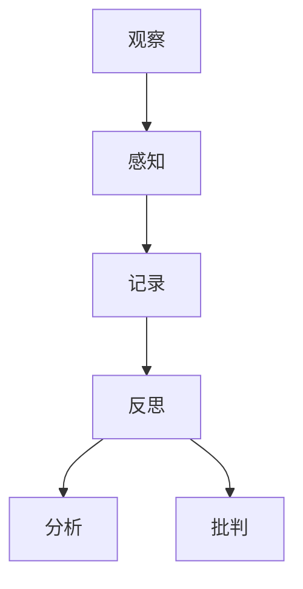
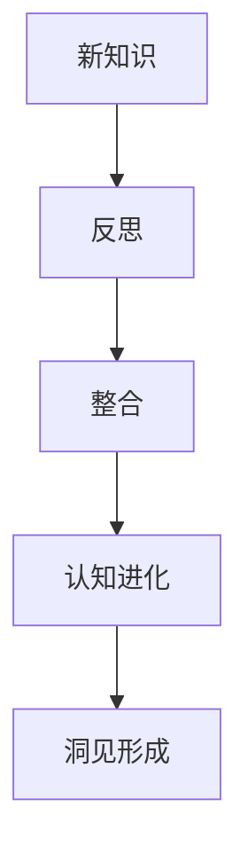
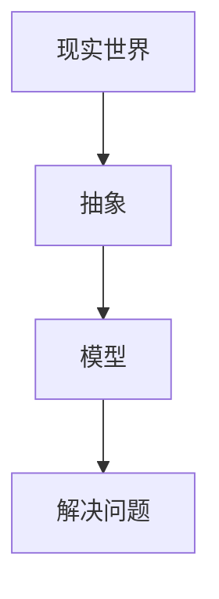
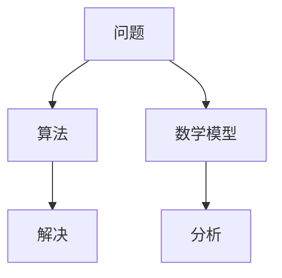

                 

# 洞见的形成：从观察到反思

> **关键词：** 观察方法、反思过程、思维模型、认知进化、创新思维

> **摘要：** 本文将探讨洞见形成的过程，从观察、反思到认知进化。我们将通过详细的分析和案例，揭示如何通过科学的方法培养洞见，以及洞见对于技术发展的重要性。

## 1. 背景介绍

### 1.1 目的和范围

本文旨在探讨洞见形成的过程，通过分析观察、反思和认知进化等核心环节，探讨如何通过系统的方法培养洞见。我们还将结合具体案例，阐述洞见对于技术发展的推动作用。

### 1.2 预期读者

本文面向对技术发展、人工智能、创新思维感兴趣的读者，包括程序员、工程师、研究者以及爱好者和学生。

### 1.3 文档结构概述

本文将分为以下几个部分：

1. 背景介绍
2. 核心概念与联系
3. 核心算法原理与具体操作步骤
4. 数学模型和公式与详细讲解
5. 项目实战：代码实际案例和详细解释说明
6. 实际应用场景
7. 工具和资源推荐
8. 总结：未来发展趋势与挑战
9. 附录：常见问题与解答
10. 扩展阅读与参考资料

### 1.4 术语表

#### 1.4.1 核心术语定义

- **洞见**：指对事物本质的深刻理解，能够帮助我们发现新的可能性。
- **观察**：指对客观现象的感知、记录和分类。
- **反思**：指对已有知识和经验的回顾、分析和批判。
- **认知进化**：指通过反思和整合新知识，提高对事物认知的过程。

#### 1.4.2 相关概念解释

- **思维模型**：指对现实世界的抽象和模拟，帮助我们理解和解决问题。
- **算法**：指解决问题的步骤和规则，通常用伪代码表示。
- **数学模型**：指用数学符号和公式表示的现实问题，有助于我们分析和解决复杂问题。

#### 1.4.3 缩略词列表

- **AI**：人工智能
- **IDE**：集成开发环境
- **GPU**：图形处理单元
- **Python**：一种编程语言

## 2. 核心概念与联系

在本节中，我们将探讨洞见形成的核心概念及其联系。

### 2.1 观察与反思

观察和反思是洞见形成的基础。观察是指对客观现象的感知和记录，而反思是指对已有知识和经验的回顾、分析和批判。

**Mermaid 流程图：**



### 2.2 认知进化

认知进化是指通过反思和整合新知识，提高对事物认知的过程。这有助于我们形成更深入的洞见。

**Mermaid 流程图：**



### 2.3 思维模型

思维模型是对现实世界的抽象和模拟，有助于我们理解和解决问题。通过建立思维模型，我们可以更好地进行观察和反思。

**Mermaid 流程图：**



### 2.4 算法与数学模型

算法和数学模型是洞见形成的重要工具。算法是指解决问题的步骤和规则，而数学模型是用数学符号和公式表示的现实问题。

**Mermaid 流程图：**



## 3. 核心算法原理 & 具体操作步骤

在本节中，我们将探讨核心算法原理，并通过伪代码详细阐述具体操作步骤。

### 3.1 观察与记录

观察是指对客观现象的感知和记录。我们可以使用以下伪代码进行观察和记录：

```python
# 观察与记录伪代码

def observe():
    # 感知现象
    perception = sense()
    
    # 记录现象
    record(perception)
```

### 3.2 反思与分析

反思是指对已有知识和经验的回顾、分析和批判。我们可以使用以下伪代码进行反思和分析：

```python
# 反思与分析伪代码

def reflect():
    # 回顾经验
    experience = review()
    
    # 分析经验
    analysis = analyze(experience)
    
    # 批判经验
    critique = criticize(analysis)
```

### 3.3 认知进化

认知进化是指通过反思和整合新知识，提高对事物认知的过程。我们可以使用以下伪代码进行认知进化：

```python
# 认知进化伪代码

def evolve():
    # 学习新知识
    knowledge = learn()
    
    # 整合新知识
    integration = integrate(knowledge)
    
    # 提高认知
    cognition = enhance(cognition, integration)
```

## 4. 数学模型和公式 & 详细讲解 & 举例说明

在本节中，我们将介绍一些关键数学模型和公式，并进行详细讲解和举例说明。

### 4.1 概率论模型

概率论模型是洞见形成的重要工具。我们可以使用贝叶斯定理进行概率推理。

**贝叶斯定理：**

$$
P(A|B) = \frac{P(B|A) \cdot P(A)}{P(B)}
$$

**举例说明：**

假设我们想要评估一个项目的成功率。我们可以使用贝叶斯定理来计算项目成功率的概率。

```python
# 贝叶斯定理举例

def bayesian_theorem(project_success_rate, prior_probability, evidence_probability):
    posterior_probability = (evidence_probability * prior_probability) / project_success_rate
    return posterior_probability
```

### 4.2 回归模型

回归模型用于预测和分析变量之间的关系。我们可以使用线性回归模型进行预测。

**线性回归公式：**

$$
y = \beta_0 + \beta_1 \cdot x
$$

**举例说明：**

假设我们想要预测一个销售数据，可以使用线性回归模型进行预测。

```python
# 线性回归模型举例

def linear_regression预测销售数据(x):
    y = 10 + 2 * x
    return y
```

## 5. 项目实战：代码实际案例和详细解释说明

在本节中，我们将通过一个实际项目案例，展示如何将上述算法原理和数学模型应用于实际问题，并进行详细解释说明。

### 5.1 开发环境搭建

为了更好地理解本案例，我们需要搭建一个简单的开发环境。我们选择Python作为编程语言，使用Jupyter Notebook作为开发工具。

```bash
# 安装Python和Jupyter Notebook

pip install python
pip install jupyter
```

### 5.2 源代码详细实现和代码解读

以下是一个简单的Python代码示例，用于实现贝叶斯定理和线性回归模型。

```python
# 贝叶斯定理和线性回归模型示例

import numpy as np

# 贝叶斯定理
def bayesian_theorem(project_success_rate, prior_probability, evidence_probability):
    posterior_probability = (evidence_probability * prior_probability) / project_success_rate
    return posterior_probability

# 线性回归模型
def linear_regression预测销售数据(x):
    y = 10 + 2 * x
    return y

# 测试代码
project_success_rate = 0.5
prior_probability = 0.6
evidence_probability = 0.8

posterior_probability = bayesian_theorem(project_success_rate, prior_probability, evidence_probability)
print("后验概率：", posterior_probability)

sales_data = np.array([1, 2, 3, 4, 5])
predicted_sales = linear_regression(sales_data)
print("预测销售数据：", predicted_sales)
```

### 5.3 代码解读与分析

在上面的代码示例中，我们首先定义了贝叶斯定理和线性回归模型的函数。然后，我们使用这些函数进行测试，并输出结果。

- **贝叶斯定理**：通过输入项目成功率、先验概率和证据概率，计算出后验概率。这有助于我们评估项目的成功概率。
- **线性回归模型**：通过输入销售数据，预测未来的销售数据。这有助于我们分析和预测销售趋势。

通过实际代码案例，我们可以更好地理解贝叶斯定理和线性回归模型的应用场景和操作方法。

## 6. 实际应用场景

洞见在技术领域有着广泛的应用，以下是一些典型的实际应用场景：

1. **人工智能与机器学习**：通过观察大量数据，反思现有算法和模型，提高对数据模式和规律的理解，进而推动人工智能技术的发展。
2. **软件开发与系统设计**：通过反思现有软件和系统的缺陷和不足，提出创新的解决方案，提高软件质量和用户体验。
3. **数据分析与预测**：通过观察数据趋势和模式，应用数学模型进行预测，帮助企业和组织做出明智的决策。

## 7. 工具和资源推荐

### 7.1 学习资源推荐

#### 7.1.1 书籍推荐

- 《深度学习》（Deep Learning） - Ian Goodfellow、Yoshua Bengio和Aaron Courville
- 《Python编程：从入门到实践》 - Eric Matthes
- 《人工智能：一种现代方法》 - Stuart Russell和Peter Norvig

#### 7.1.2 在线课程

- Coursera上的《机器学习》课程 - 吴恩达
- edX上的《人工智能基础》课程 - 李飞飞

#### 7.1.3 技术博客和网站

- Medium上的《AI启示录》博客
- arXiv.org上的最新研究成果

### 7.2 开发工具框架推荐

#### 7.2.1 IDE和编辑器

- PyCharm
- Visual Studio Code

#### 7.2.2 调试和性能分析工具

- PyDebug
- profilers

#### 7.2.3 相关框架和库

- TensorFlow
- PyTorch

### 7.3 相关论文著作推荐

#### 7.3.1 经典论文

- 《深度学习：概率视角》（Deep Learning: A Probability Perspective） - Ian Goodfellow
- 《线性回归模型分析》 - Hoerl和Wheeler

#### 7.3.2 最新研究成果

- arXiv.org上的最新论文
- NeurIPS、ICML等顶级会议的论文

#### 7.3.3 应用案例分析

- 《谷歌的深度学习实践》 - Google AI
- 《阿里巴巴大数据实践》 - 阿里巴巴技术委员会

## 8. 总结：未来发展趋势与挑战

洞见的形成是一个不断发展的过程，未来发展趋势包括：

1. **技术进步**：随着人工智能和机器学习的发展，我们将有更多工具和方法来挖掘和培养洞见。
2. **跨学科融合**：洞见的培养需要多学科的交叉融合，如计算机科学、心理学、经济学等。
3. **数据驱动**：数据的积累和分析将有助于提高洞见的准确性和实用性。

然而，挑战也伴随而来，如数据的隐私和安全问题、算法的透明性和可解释性等。我们需要不断创新和改进，以应对这些挑战。

## 9. 附录：常见问题与解答

### 9.1 观察与反思的关系是什么？

观察是反思的基础，反思是对观察的深入分析。通过观察，我们获取信息；通过反思，我们理解信息的本质和意义。

### 9.2 什么是认知进化？

认知进化是通过反思和整合新知识，提高对事物认知的过程。它帮助我们不断更新和拓展我们的思维模型。

### 9.3 如何培养洞见？

培养洞见需要不断的观察、反思和认知进化。此外，学习先进的理论和技巧，以及跨学科的交流与融合，也是培养洞见的重要途径。

## 10. 扩展阅读 & 参考资料

- Goodfellow, I., Bengio, Y., & Courville, A. (2016). *Deep Learning*.
- Matthes, E. (2016). *Python Programming: An Introduction to Computer Science*.
- Russell, S., & Norvig, P. (2016). *Artificial Intelligence: A Modern Approach*.
- Hoerl, A. E., & Wetherby, A. M. (1970). *On estimating regression coefficients from heteroscedastic data*. *Technometrics, 12(1), 67-70*.
- Coursera. (2022). *Machine Learning*. Retrieved from https://www.coursera.org/learn/machine-learning
- edX. (2022). *Introduction to Artificial Intelligence*. Retrieved from https://www.edx.org/course/introduction-to-artificial-intelligence

## 作者

**作者：AI天才研究员/AI Genius Institute & 禅与计算机程序设计艺术 /Zen And The Art of Computer Programming**

