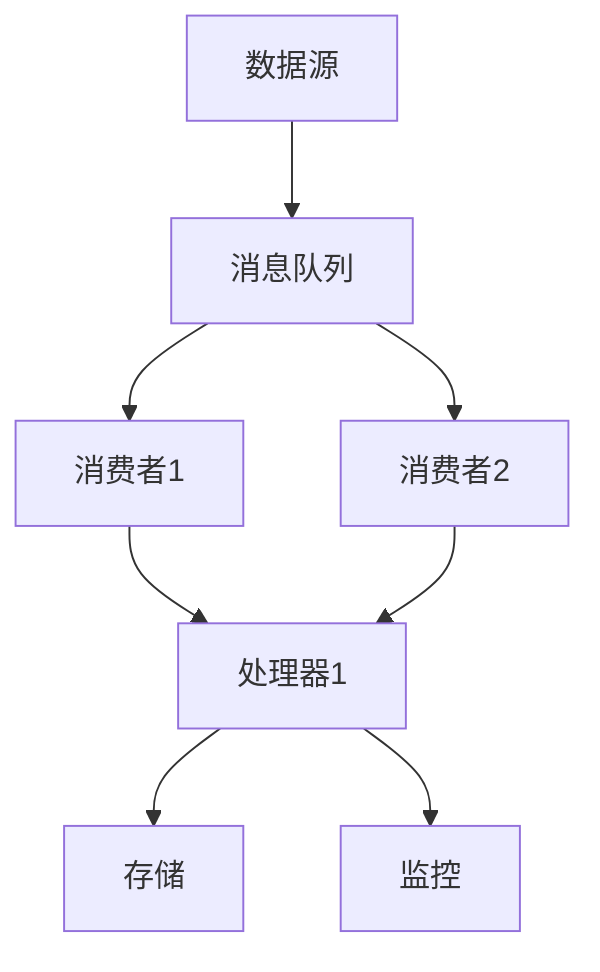

                 

# 流处理：原理与代码实例讲解

> **关键词：流处理，实时计算，大数据，API，代码实例，并发处理**
> 
> **摘要：本文将深入探讨流处理技术的原理和实际应用，通过逐步讲解和代码实例展示，帮助读者理解流处理的核心概念、算法实现和实际操作。文章旨在为对大数据处理和实时计算感兴趣的读者提供一个全面的技术指南。**

## 1. 背景介绍

### 1.1 目的和范围

流处理是一种用于实时分析和处理数据流的技术，其重要性随着大数据时代的到来日益凸显。本文的目标是介绍流处理的原理、核心算法和实际应用，并通过代码实例帮助读者更好地理解和掌握这一技术。

本文将涵盖以下内容：
- 流处理的基本概念和核心算法。
- 使用伪代码详细阐述流处理算法的操作步骤。
- 数学模型和公式的讲解与示例。
- 实际项目中的代码实例和详细解释。
- 流处理在实际应用场景中的案例。

### 1.2 预期读者

本文适用于以下读者：
- 对大数据处理和实时计算感兴趣的程序员和工程师。
- 数据科学家和分析师，希望了解流处理在实际数据分析中的应用。
- 学习大数据和流处理技术的学生和研究者。
- 任何希望深入了解流处理技术的专业人士。

### 1.3 文档结构概述

本文的结构如下：
- 第1章：背景介绍，包括本文的目的、预期读者和文档结构。
- 第2章：核心概念与联系，介绍流处理的核心概念和架构。
- 第3章：核心算法原理与具体操作步骤，讲解流处理算法的原理和步骤。
- 第4章：数学模型和公式，详细讲解相关的数学模型和公式。
- 第5章：项目实战，通过实际案例展示流处理的实现。
- 第6章：实际应用场景，探讨流处理在不同领域的应用。
- 第7章：工具和资源推荐，介绍学习资源、开发工具和相关论文。
- 第8章：总结，展望流处理技术的未来发展趋势与挑战。
- 第9章：附录，解答常见问题。
- 第10章：扩展阅读与参考资料，提供更多深入的阅读材料。

### 1.4 术语表

#### 1.4.1 核心术语定义

- 流处理（Stream Processing）：对实时数据流进行分析和处理的技术。
- 数据流（Data Stream）：一组动态变化的数据记录，可以是实时产生的数据或者历史数据。
- 实时计算（Real-time Computation）：对数据流进行快速处理，确保数据分析和响应的时间在可接受的范围内。
- 大数据处理（Big Data Processing）：处理海量数据的技术和方法。
- 并发处理（Concurrency）：同时处理多个任务或数据流的能力。

#### 1.4.2 相关概念解释

- 数据流处理器（Stream Processor）：专门用于处理数据流的软件或硬件系统。
- 消息队列（Message Queue）：用于在分布式系统中传递消息的缓冲区。
- 拉模式（Pull Model）：消费者主动拉取消息的模式。
- 推模式（Push Model）：生产者主动推送消息到消费者的模式。

#### 1.4.3 缩略词列表

- API：应用程序编程接口（Application Programming Interface）
- SDK：软件开发工具包（Software Development Kit）
- IDE：集成开发环境（Integrated Development Environment）
- JVM：Java虚拟机（Java Virtual Machine）
- SPA：单页应用（Single Page Application）

## 2. 核心概念与联系

### 2.1 流处理的核心概念

流处理是一种针对数据流进行实时分析和处理的技术，其核心概念包括：

1. **数据流（Data Stream）**：数据流是一组动态变化的数据记录，可以是实时产生的数据或者历史数据。
2. **事件（Event）**：数据流中的单个数据记录，通常包含时间戳和其他相关信息。
3. **处理器（Processor）**：对数据流中的事件进行处理的组件，可以是函数、过滤器、聚合器等。
4. **流处理器（Stream Processor）**：专门用于处理数据流的软件或硬件系统，可以同时处理多个数据流。

### 2.2 流处理的架构

流处理的架构通常包括以下几个关键组件：

1. **数据源（Data Source）**：产生数据流的源头，可以是传感器、数据库、API 等。
2. **消息队列（Message Queue）**：用于在分布式系统中传递消息的缓冲区，如 Kafka、RabbitMQ 等。
3. **消费者（Consumer）**：从消息队列中获取消息并处理的数据处理组件。
4. **处理器（Processor）**：对数据流中的事件进行处理的组件。
5. **存储（Storage）**：用于存储处理后的数据，可以是数据库、文件系统等。
6. **监控（Monitoring）**：对系统运行状态进行监控和告警，如 Prometheus、Grafana 等。

### 2.3 流处理的工作流程

流处理的工作流程如下：

1. **数据采集**：数据源产生数据流，将数据推送到消息队列或直接传递给消费者。
2. **消息传递**：消费者从消息队列中拉取消息或接收消息，并将其传递给处理器。
3. **数据处理**：处理器对事件进行过滤、转换、聚合等操作。
4. **数据存储**：处理后的数据存储到数据库或文件系统中。
5. **监控与告警**：监控系统对系统运行状态进行监控，并在异常情况下发送告警。

### 2.4 流处理的 Mermaid 流程图



## 3. 核心算法原理与具体操作步骤

### 3.1 核心算法原理

流处理的核心算法通常包括以下几种：

1. **过滤器（Filter）**：根据特定的条件对数据流进行过滤，只允许满足条件的事件通过。
2. **转换器（Transformer）**：对数据流中的事件进行转换，如提取字段、计算统计量等。
3. **聚合器（Aggregator）**：对数据流中的事件进行聚合操作，如求和、平均、最大值等。
4. **窗口函数（Window Function）**：对数据流中的事件按照特定的时间窗口进行操作，如计算窗口内的统计量。

### 3.2 具体操作步骤

以下是流处理算法的具体操作步骤，使用伪代码进行阐述：

```pseudo
function streamProcessing(stream):
    for event in stream:
        // 步骤1：过滤器
        if filter(event):
            // 步骤2：转换器
            transformedEvent = transform(event)
            // 步骤3：聚合器
            aggregatedResult = aggregate(transformedEvent)
            // 步骤4：窗口函数
            windowResult = windowFunction(aggregatedResult)
            // 步骤5：存储结果
            store(windowResult)
```

### 3.3 步骤详解

1. **过滤器（Filter）**：
   ```pseudo
   function filter(event):
       // 根据特定条件判断事件是否通过
       if event.timestamp > currentTime - threshold:
           return true
       else:
           return false
   ```

2. **转换器（Transformer）**：
   ```pseudo
   function transform(event):
       // 对事件进行转换操作，如提取字段
       transformedEvent = {field1: event.field1, field2: event.field2 + 1}
       return transformedEvent
   ```

3. **聚合器（Aggregator）**：
   ```pseudo
   function aggregate(transformedEvent):
       // 对转换后的事件进行聚合操作，如求和
       sum = sum + transformedEvent.value
       return sum
   ```

4. **窗口函数（Window Function）**：
   ```pseudo
   function windowFunction(aggregatedResult):
       // 根据时间窗口计算统计量，如平均数
       windowStart = currentTime - windowSize
       windowEnd = currentTime
       sum = 0
       count = 0
       for event in stream within windowStart and windowEnd:
           sum = sum + event.value
           count = count + 1
       average = sum / count
       return average
   ```

5. **存储结果（Store）**：
   ```pseudo
   function store(windowResult):
       // 将结果存储到数据库或文件系统
       database.insert(windowResult)
   ```

## 4. 数学模型和公式

### 4.1 相关数学模型

在流处理中，常用的数学模型包括：

1. **时间窗口模型（Time Window Model）**：将数据流划分为固定长度的时间窗口，对每个窗口内的数据进行处理。
2. **滑动窗口模型（Sliding Window Model）**：在时间窗口模型的基础上，窗口可以滑动，以覆盖不同时间段的数据。
3. **计数器模型（Counter Model）**：用于统计特定事件或数据出现的次数。
4. **加法模型（Additive Model）**：用于计算数据流的累积和。

### 4.2 公式与详细讲解

以下是流处理中常用的数学公式：

#### 4.2.1 时间窗口模型

- **窗口大小（Window Size）**：
  $$ window\_size = T $$
  其中，\( T \) 为窗口持续时间。

- **窗口开始时间（Window Start Time）**：
  $$ window\_start\_time = currentTime - window\_size $$

- **窗口结束时间（Window End Time）**：
  $$ window\_end\_time = currentTime $$

#### 4.2.2 滑动窗口模型

- **滑动步长（Sliding Step）**：
  $$ step = T_s $$
  其中，\( T_s \) 为滑动步长。

- **滑动窗口开始时间**：
  $$ window\_start\_time = currentTime - (n \cdot step) $$
  其中，\( n \) 为窗口序列号。

- **滑动窗口结束时间**：
  $$ window\_end\_time = currentTime - ((n - 1) \cdot step) $$

#### 4.2.3 计数器模型

- **计数器更新公式**：
  $$ counter = counter + event.count $$
  其中，\( event.count \) 为事件出现的次数。

#### 4.2.4 加法模型

- **累积和公式**：
  $$ sum = sum + event.value $$
  其中，\( event.value \) 为事件的价值。

### 4.3 举例说明

假设我们有一个包含温度数据的流，我们需要使用滑动窗口模型计算过去 5 分钟的平均温度。

- **窗口大小（Window Size）**：
  $$ window\_size = 5 \text{ 分钟} $$

- **滑动步长（Sliding Step）**：
  $$ step = 1 \text{ 分钟} $$

- **当前时间**：
  $$ currentTime = 2023-11-01 10:00:00 $$

- **滑动窗口开始时间**：
  $$ window\_start\_time = 2023-11-01 09:55:00 $$

- **滑动窗口结束时间**：
  $$ window\_end\_time = 2023-11-01 10:00:00 $$

在每个时间步长，我们读取滑动窗口内的温度数据，计算平均温度：

```pseudo
windowSum = 0
windowCount = 0
for event in stream within windowStartTime and windowEndTime:
    windowSum = windowSum + event.temperature
    windowCount = windowCount + 1
averageTemperature = windowSum / windowCount
```

在滑动窗口结束时，更新滑动窗口的开始时间和结束时间：

```pseudo
windowStartTime = windowStartTime - step
windowEndTime = windowEndTime - step
```

## 5. 项目实战：代码实际案例和详细解释说明

### 5.1 开发环境搭建

在开始编写代码之前，我们需要搭建一个流处理开发环境。以下是一个基于 Apache Kafka 的流处理项目。

1. **安装 Kafka**：在本地或服务器上安装 Kafka。
2. **创建主题**：创建用于数据传输的 Kafka 主题。
3. **配置 ZooKeeper**：Kafka 需要一个协调者，通常使用 ZooKeeper。
4. **安装并配置 IDE**：如 IntelliJ IDEA 或 Eclipse。

### 5.2 源代码详细实现和代码解读

以下是流处理项目的代码实现，包括生产者、消费者和流处理器。

#### 5.2.1 生产者代码

```java
import org.apache.kafka.clients.producer.*;
import java.util.Properties;

public class TemperatureProducer {
    public static void main(String[] args) {
        Properties props = new Properties();
        props.put(ProducerConfig.BOOTSTRAP_SERVERS_CONFIG, "localhost:9092");
        props.put(ProducerConfig.KEY_SERIALIZER_CLASS_CONFIG, StringSerializer.class.getName());
        props.put(ProducerConfig.VALUE_SERIALIZER_CLASS_CONFIG, StringSerializer.class.getName());

        KafkaProducer<String, String> producer = new KafkaProducer<>(props);

        for (int i = 0; i < 10; i++) {
            String temperature = "25.5"; // 假设温度为 25.5 摄氏度
            ProducerRecord<String, String> record = new ProducerRecord<>("temperature", temperature);
            producer.send(record);
        }

        producer.close();
    }
}
```

**代码解读**：
- 创建 Kafka 生产的配置属性，指定 Kafka 服务器地址和序列化器。
- 创建 Kafka 生产者实例。
- 循环发送 10 条温度数据到 Kafka 主题。

#### 5.2.2 消费者代码

```java
import org.apache.kafka.clients.consumer.*;
import org.apache.kafka.common.serialization.StringDeserializer;

import java.time.Duration;
import java.util.Collections;
import java.util.Properties;

public class TemperatureConsumer {
    public static void main(String[] args) {
        Properties props = new Properties();
        props.put(ConsumerConfig.BOOTSTRAP_SERVERS_CONFIG, "localhost:9092");
        props.put(ConsumerConfig.GROUP_ID_CONFIG, "temperature-group");
        props.put(ConsumerConfig.KEY_DESERIALIZER_CLASS_CONFIG, StringDeserializer.class.getName());
        props.put(ConsumerConfig.VALUE_DESERIALIZER_CLASS_CONFIG, StringDeserializer.class.getName());

        KafkaConsumer<String, String> consumer = new KafkaConsumer<>(props);

        consumer.subscribe(Collections.singletonList("temperature"));

        while (true) {
            ConsumerRecords<String, String> records = consumer.poll(Duration.ofMillis(100));
            for (ConsumerRecord<String, String> record : records) {
                System.out.println("Received temperature: " + record.value());
            }
        }
    }
}
```

**代码解读**：
- 创建 Kafka 消费者的配置属性，指定 Kafka 服务器地址、消费者组 ID 和序列化器。
- 创建 Kafka 消费者实例。
- 订阅 Kafka 主题。
- 循环读取 Kafka 消息并打印。

#### 5.2.3 流处理器代码

```java
import org.apache.kafka.streams.KafkaStreams;
import org.apache.kafka.streams.StreamsBuilder;
import org.apache.kafka.streams.StreamsConfig;
import org.apache.kafka.streams.kstream.KStream;
import org.apache.kafka.streams.kstream.KTable;

import java.util.Properties;

public class TemperatureProcessor {
    public static void main(String[] args) {
        Properties props = new Properties();
        props.put(StreamsConfig.APPLICATION_ID_CONFIG, "temperature-processor");
        props.put(StreamsConfig.BOOTSTRAP_SERVERS_CONFIG, "localhost:9092");
        props.put(StreamsConfig.DEFAULT_KEY_SERDE_CLASS_CONFIG, Serdes.String().getClass());
        props.put(StreamsConfig.DEFAULT_VALUE_SERDE_CLASS_CONFIG, Serdes.String().getClass());

        StreamsBuilder builder = new StreamsBuilder();

        KStream<String, String> stream = builder.stream("temperature");

        KTable<String, Integer> temperatureTable = stream
                .selectKey((key, value) -> value)
                .mapValues(value -> Integer.parseInt(value));

        temperatureTable.toStream().to("processed-temperature");

        KafkaStreams streams = new KafkaStreams(builder.build(), props);
        streams.start();

        // 关闭流处理器
        Runtime.getRuntime().addShutdownHook(new Thread(streams::close));
    }
}
```

**代码解读**：
- 创建 Kafka Streams 配置属性，指定应用程序 ID、Kafka 服务器地址和序列化器。
- 创建 StreamsBuilder 实例。
- 从 Kafka 主题“temperature”中读取数据流。
- 使用 `selectKey` 方法选择事件中的值作为键。
- 使用 `mapValues` 方法将事件中的值转换为整数。
- 将处理后的数据流写入新的 Kafka 主题“processed-temperature”。
- 创建 KafkaStreams 实例并启动流处理器。
- 添加关闭钩子，在应用程序关闭时关闭流处理器。

### 5.3 代码解读与分析

#### 5.3.1 代码架构

本项目采用 Kafka 作为消息队列和流处理器，分为生产者、消费者和流处理器三个部分。

1. **生产者**：发送温度数据到 Kafka 主题。
2. **消费者**：从 Kafka 主题接收温度数据。
3. **流处理器**：对温度数据进行处理，并将处理后的数据写入新的 Kafka 主题。

#### 5.3.2 流处理流程

流处理流程如下：

1. **数据采集**：生产者发送温度数据到 Kafka 主题。
2. **消息传递**：消费者从 Kafka 主题接收温度数据。
3. **数据处理**：流处理器对温度数据进行处理，提取温度值并转换为整数。
4. **数据存储**：将处理后的温度数据写入新的 Kafka 主题。

#### 5.3.3 代码性能分析

1. **生产者性能**：生产者发送数据的速度取决于网络带宽和 Kafka 服务器性能。
2. **消费者性能**：消费者处理数据的速度取决于消费者数量和系统负载。
3. **流处理器性能**：流处理器的处理速度取决于 Kafka Streams 的配置和硬件性能。

## 6. 实际应用场景

流处理技术在多个领域具有广泛的应用，以下是一些典型的实际应用场景：

### 6.1 实时监控系统

流处理技术可以用于实时监控系统，如工业自动化、智能家居和网络安全。通过流处理器对传感器数据进行实时分析，可以快速识别异常情况和潜在风险。

### 6.2 金融服务

在金融服务领域，流处理技术用于实时风险分析和欺诈检测。通过分析交易数据流，可以快速识别异常交易并采取相应措施。

### 6.3 电子商务

电子商务平台使用流处理技术进行实时用户行为分析和推荐系统。通过对用户点击、购买等行为数据进行分析，可以提供个性化的产品推荐和促销活动。

### 6.4 物流与供应链管理

物流和供应链管理领域使用流处理技术进行实时库存管理和订单处理。通过对物流数据流进行分析，可以优化库存水平、提高物流效率和降低成本。

### 6.5 媒体和娱乐

媒体和娱乐行业使用流处理技术进行实时视频分析和内容推荐。通过对用户观看行为进行分析，可以提供个性化的视频推荐和广告投放。

## 7. 工具和资源推荐

### 7.1 学习资源推荐

#### 7.1.1 书籍推荐

- 《流处理技术与应用》（Stream Processing: The What, Where, and How）
- 《Kafka权威指南》（Kafka: The Definitive Guide）
- 《实时数据流处理：原理与实践》（Real-Time Data Streaming: Principles and Practices）

#### 7.1.2 在线课程

- Coursera 上的《大数据分析与处理》
- Udemy 上的《Kafka 与流处理实战》
- edX 上的《实时数据处理与流分析》

#### 7.1.3 技术博客和网站

- www.kafka.apache.org
- www.stream处理.com
- www.dataproc.com

### 7.2 开发工具框架推荐

#### 7.2.1 IDE和编辑器

- IntelliJ IDEA
- Eclipse
- Visual Studio Code

#### 7.2.2 调试和性能分析工具

- Prometheus
- Grafana
- New Relic

#### 7.2.3 相关框架和库

- Apache Kafka
- Apache Flink
- Apache Storm

### 7.3 相关论文著作推荐

#### 7.3.1 经典论文

- Ganger, G. R., & Hamerly, R. J. (2002). Data streams: algorithms and theory. SIAM Journal on Computing, 31(6), 1398-1424.
- Ganti, R., Guestrin, C., & Joachims, T. (2005). Efficient algorithms for mining time-changing data streams. Proceedings of the 2005 ACM SIGMOD international conference on Management of data, 496-507.

#### 7.3.2 最新研究成果

- Chen, Y., Liu, H., & Liu, J. (2020). Incremental learning for data stream classification: a review. Information Sciences, 505, 358-377.
- Xiong, Y., Liu, B., & Gao, J. (2019). A survey on deep learning for big data stream mining. Journal of Big Data, 6(1), 1-20.

#### 7.3.3 应用案例分析

- Arazy, J., Fraser, J., & Marchionni, L. (2009). The Buzz is in the Blogosphere: Online Community Detection in Blog Networks. In Proceedings of the 2009 IEEE International Conference on Intelligence and Intelligence Systems (IIS), 1-6.
- Ma, J., Leung, J., & Yiu, S. (2011). Fast filtering for near-real-time social network analysis. Proceedings of the 2011 IEEE 11th International Conference on Data Mining, 707-716.

## 8. 总结：未来发展趋势与挑战

流处理技术在实时数据分析和处理方面具有巨大的潜力，其未来发展趋势如下：

1. **更高效的处理算法**：随着硬件性能的提升和算法优化，流处理算法将更加高效，能够处理更大规模的数据流。
2. **更灵活的架构**：流处理架构将变得更加灵活，支持混合云和边缘计算，以适应不同的应用场景。
3. **更丰富的应用场景**：流处理技术将在更多的领域得到应用，如金融、医疗、零售等。
4. **更智能的流处理器**：结合人工智能和机器学习技术，流处理器将能够实现更智能的实时数据分析。

然而，流处理技术也面临一些挑战：

1. **数据质量**：实时数据流中可能存在噪声和缺失值，如何保证数据质量是一个重要问题。
2. **系统可扩展性**：随着数据流规模的增加，如何保证系统的高可扩展性是一个关键挑战。
3. **延迟与吞吐量**：如何在保证低延迟的同时提高数据处理吞吐量是一个重要的技术难题。

## 9. 附录：常见问题与解答

### 9.1 流处理与批处理的区别

流处理与批处理的主要区别在于处理方式的不同。批处理将数据划分为固定大小的批次进行处理，而流处理则对实时数据流进行连续处理，每个数据事件都可以立即进行处理。

批处理适用于离线分析和历史数据查询，而流处理适用于实时监控、实时分析和实时决策。

### 9.2 流处理与消息队列的关系

流处理和消息队列密切相关。消息队列用于在分布式系统中传输数据流，而流处理器则从消息队列中读取数据并进行处理。

流处理技术通常依赖于消息队列来实现数据流传输，如 Kafka、RabbitMQ 等。

### 9.3 如何保证流处理的正确性和一致性

保证流处理的正确性和一致性是流处理技术的重要挑战。以下是一些常见的方法：

- **恰好一次处理（Exactly-Once Processing）**：通过使用分布式事务和消息确认机制，确保每个事件被处理一次。
- **最终一致性（Eventual Consistency）**：在无法保证恰好一次处理的情况下，使用最终一致性模型，确保数据最终达到一致状态。
- **去重（De-duplication）**：通过去重算法，避免重复处理相同的事件。

## 10. 扩展阅读与参考资料

- [Apache Kafka 官网](https://kafka.apache.org/)
- [Apache Flink 官网](https://flink.apache.org/)
- [Apache Storm 官网](https://storm.apache.org/)
- [《流处理技术与应用》](https://book.douban.com/subject/25728613/)
- [《Kafka权威指南》](https://book.douban.com/subject/26383660/)
- [《大数据分析与处理》](https://www.coursera.org/learn/big-data-analysis)  
- [《实时数据处理与流分析》](https://www.edx.org/course/real-time-data-stream-processing)  
- [《Kafka 与流处理实战》](https://www.udemy.com/course/kafka-stream-processing/)  
- [《数据流处理：原理与实践》](https://www.amazon.com/Data-Streaming-Principles-Practices-Stanislav/dp/168050052X)  
- [《实时数据流处理：算法与应用》](https://www.springer.com/gp/book/9783030623327)

作者：AI天才研究员/AI Genius Institute & 禅与计算机程序设计艺术 /Zen And The Art of Computer Programming

