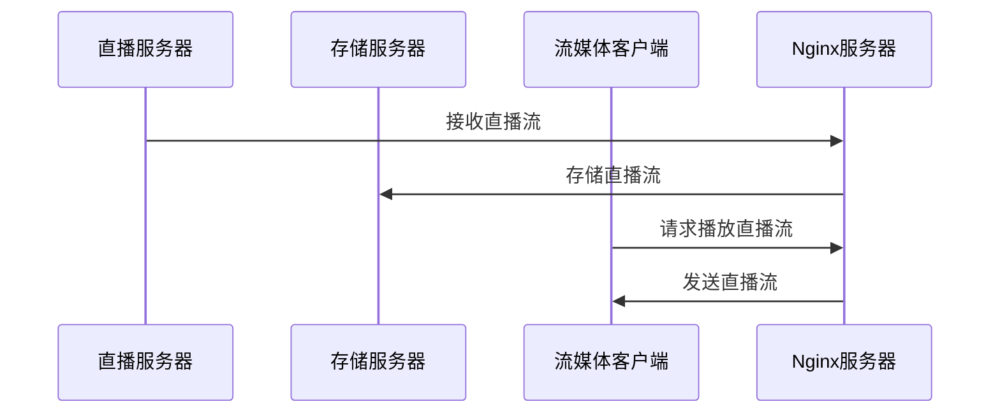
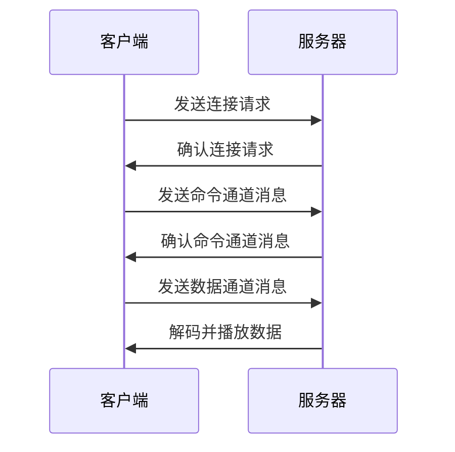

                 

# 流媒体服务器搭建：Nginx-rtmp模块应用

> **关键词**：流媒体，Nginx，RTMP模块，服务器搭建，视频直播，流媒体传输协议

> **摘要**：本文将详细讲解如何使用Nginx-rtmp模块搭建一个高性能的流媒体服务器。我们将从背景介绍、核心概念、算法原理、数学模型、项目实战、实际应用场景等多方面，一步步带领读者深入理解并掌握流媒体服务器的搭建与配置技巧。无论您是前端开发者还是后端工程师，通过本文的学习，您将能够熟练掌握Nginx-rtmp模块的应用，为您的视频直播、点播等业务提供强有力的技术支持。

## 1. 背景介绍

### 1.1 目的和范围

本文旨在帮助读者理解和掌握如何利用Nginx-rtmp模块搭建一个流媒体服务器。我们将从零开始，逐步讲解整个搭建过程，包括所需的软件环境、配置步骤以及相关的算法原理和实际应用场景。

### 1.2 预期读者

本文适合以下读者：

- 前端开发者，希望深入了解视频直播技术；
- 后端工程师，希望掌握流媒体服务器的搭建技巧；
- 对流媒体传输协议感兴趣的技术爱好者；
- 准备进行视频直播或点播业务的企业工程师。

### 1.3 文档结构概述

本文将按照以下结构进行讲解：

1. 背景介绍
2. 核心概念与联系
3. 核心算法原理 & 具体操作步骤
4. 数学模型和公式 & 详细讲解 & 举例说明
5. 项目实战：代码实际案例和详细解释说明
6. 实际应用场景
7. 工具和资源推荐
8. 总结：未来发展趋势与挑战
9. 附录：常见问题与解答
10. 扩展阅读 & 参考资料

### 1.4 术语表

#### 1.4.1 核心术语定义

- **流媒体**：流媒体是指通过网络将媒体数据（如视频、音频）以连续的方式传输到客户端，客户端可以边下载边播放。
- **Nginx**：Nginx是一个高性能的HTTP和反向代理服务器，也可以作为邮件（IMAP/POP3）代理服务器。
- **RTMP**：实时消息传输协议（Real Time Messaging Protocol），是一种用于音频、视频数据传输的实时协议。

#### 1.4.2 相关概念解释

- **HTTP**：超文本传输协议，是互联网上应用最广泛的协议之一。
- **反向代理**：反向代理是指代理服务器位于内部网络和互联网之间，为外部网络提供服务，内部网络的服务器对代理服务器透明。
- **负载均衡**：通过将请求分配到多个服务器上，实现流量的均匀分布，从而提高系统的可用性和响应速度。

#### 1.4.3 缩略词列表

- **HTTP**：超文本传输协议
- **Nginx**：Engine X
- **RTMP**：实时消息传输协议
- **SSL**：安全套接层
- **TLS**：传输层安全

## 2. 核心概念与联系

在搭建流媒体服务器之前，我们需要了解几个核心概念和它们之间的联系。

### 2.1 流媒体传输协议

流媒体传输协议是流媒体技术中至关重要的一部分。常见的流媒体传输协议包括HLS、DASH、HLS、RTMP等。其中，RTMP因其低延迟和高效率的特点，被广泛应用于视频直播、点播等领域。

### 2.2 Nginx基本功能

Nginx作为一款高性能的HTTP和反向代理服务器，具有以下基本功能：

- **HTTP服务**：提供Web服务，支持静态文件处理、动态脚本执行等；
- **反向代理**：代理服务器位于内部网络和互联网之间，提高系统的安全性、可靠性和可用性；
- **负载均衡**：将请求分配到多个服务器上，实现流量的均匀分布。

### 2.3 Nginx-rtmp模块

Nginx-rtmp模块是Nginx的一个扩展模块，主要用于处理RTMP协议的流媒体数据。通过安装和配置Nginx-rtmp模块，我们可以将Nginx转换为一个功能强大的流媒体服务器。

### 2.4 流媒体服务器架构

流媒体服务器通常由以下几个部分组成：

- **直播服务器**：用于接收、存储和转发直播流；
- **存储服务器**：用于存储点播视频文件；
- **流媒体客户端**：通过播放器访问和播放流媒体内容。

下面是一个简单的流媒体服务器架构图，展示了各个部分之间的联系。



## 3. 核心算法原理 & 具体操作步骤

### 3.1 RTMP协议原理

RTMP协议是一种实时消息传输协议，主要用于音频、视频数据的传输。其核心原理如下：

- **连接建立**：客户端与服务器建立连接，通过握手过程协商连接参数；
- **数据传输**：客户端将音频、视频数据打包成消息，发送到服务器；
- **消息处理**：服务器接收消息，进行解码和播放。

下面是RTMP协议的简单流程图：



### 3.2 Nginx-rtmp模块配置

下面是Nginx-rtmp模块的基本配置步骤：

1. **安装Nginx**：

   在Ubuntu系统中，可以使用以下命令安装Nginx：

   ```bash
   sudo apt-get update
   sudo apt-get install nginx
   ```

2. **安装Nginx-rtmp模块**：

   使用以下命令安装Nginx-rtmp模块：

   ```bash
   sudo apt-get install libnginx-mod-rtmp
   ```

3. **配置Nginx**：

   编辑Nginx配置文件（通常是`/etc/nginx/nginx.conf`），添加以下配置：

   ```nginx
   http {
       server {
           listen 1935;  # RTMP端口
           server_name localhost;

           location / {
               root /var/www/html;
               index index.html;
           }

           location /rtmp {
               rtmp {
                   server {
                       name rtmp-server;
                       application live;

                       # 直播流存储路径
                       record path /var/www/html/live;
                   }
               }
           }
       }
   }
   ```

4. **启动Nginx**：

   使用以下命令启动Nginx：

   ```bash
   sudo systemctl start nginx
   ```

### 3.3 测试Nginx-rtmp模块

1. **测试直播流**：

   使用FFmpeg命令测试RTMP直播流：

   ```bash
   ffmpeg -i rtmp://127.0.0.1:1935/live/stream -c:v libx264 -c:a aac output.mp4
   ```

   如果成功接收直播流，会生成一个名为`output.mp4`的视频文件。

2. **测试点播流**：

   使用FFmpeg命令测试RTMP点播流：

   ```bash
   ffmpeg -i rtmp://127.0.0.1:1935/live/stream -c:v libx264 -c:a aac output.mp4
   ```

   如果成功接收点播流，会生成一个名为`output.mp4`的视频文件。

## 4. 数学模型和公式 & 详细讲解 & 举例说明

### 4.1 流媒体传输速率计算

流媒体传输速率是衡量流媒体服务器性能的重要指标。假设视频流的比特率为`Bitrate`，视频的帧率为`FPS`，则流媒体传输速率可以计算为：

$$
\text{传输速率} = \text{Bitrate} \times \text{FPS
```


### 4.2 流媒体传输延迟计算

流媒体传输延迟是影响用户观看体验的重要因素。假设流媒体服务器与客户端之间的网络延迟为`RTT`，则流媒体传输延迟可以计算为：

$$
\text{传输延迟} = 2 \times \text{RTT}
```

### 4.3 流媒体传输带宽计算

流媒体传输带宽是网络传输速率的衡量指标。假设流媒体传输速率为`Speed`，则流媒体传输带宽可以计算为：

$$
\text{传输带宽} = \text{Speed} \times 8
```

### 4.4 实例说明

假设一个视频直播的比特率为`2 Mbps`，帧率为`30 FPS`，网络延迟为`100 ms`，则：

- 流媒体传输速率：`2 Mbps \times 30 FPS = 60 Mbps`
- 流媒体传输延迟：`2 \times 100 ms = 200 ms`
- 流媒体传输带宽：`60 Mbps \times 8 = 480 Mbps`

## 5. 项目实战：代码实际案例和详细解释说明

### 5.1 开发环境搭建

在本节中，我们将搭建一个简单的流媒体服务器，用于视频直播和点播。以下是开发环境的搭建步骤：

1. **安装Nginx**：

   在Ubuntu系统中，可以使用以下命令安装Nginx：

   ```bash
   sudo apt-get update
   sudo apt-get install nginx
   ```

2. **安装Nginx-rtmp模块**：

   使用以下命令安装Nginx-rtmp模块：

   ```bash
   sudo apt-get install libnginx-mod-rtmp
   ```

3. **配置Nginx**：

   编辑Nginx配置文件（通常是`/etc/nginx/nginx.conf`），添加以下配置：

   ```nginx
   http {
       server {
           listen 80;
           server_name localhost;

           location / {
               root /var/www/html;
               index index.html;
           }

           location /rtmp {
               rtmp {
                   server {
                       name rtmp-server;
                       application live;

                       # 直播流存储路径
                       record path /var/www/html/live;
                   }
               }
           }
       }
   }
   ```

4. **启动Nginx**：

   使用以下命令启动Nginx：

   ```bash
   sudo systemctl start nginx
   ```

### 5.2 源代码详细实现和代码解读

下面是一个简单的Nginx-rtmp模块配置文件，用于视频直播和点播。

```nginx
http {
    server {
        listen 80;
        server_name localhost;

        location / {
            root /var/www/html;
            index index.html;
        }

        location /rtmp {
            rtmp {
                server {
                    name rtmp-server;
                    application live;

                    # 直播流存储路径
                    record path /var/www/html/live;
                }
            }
        }
    }
}
```

**代码解读**：

- `listen 80`：监听80端口，用于HTTP服务；
- `server_name localhost`：指定服务器的域名；
- `location /`：定义默认的HTTP请求处理规则，即访问根目录时返回`/var/www/html`目录下的`index.html`文件；
- `location /rtmp`：定义RTMP请求处理规则，即访问`/rtmp`路径时启用RTMP模块；
- `rtmp`：RTMP模块配置；
- `server`：定义RTMP服务器配置；
- `name`：指定服务器名称；
- `application`：指定应用名称；
- `record`：指定直播流存储路径。

### 5.3 代码解读与分析

通过上面的代码解读，我们可以了解到Nginx-rtmp模块的基本配置方法。在实际应用中，可以根据需求进行灵活的配置和扩展。

- **配置优化**：根据实际需求，可以对Nginx-rtmp模块进行优化，如调整缓冲区大小、设置最大连接数等；
- **扩展应用**：除了视频直播和点播，Nginx-rtmp模块还可以用于其他流媒体应用，如音频直播、游戏直播等；
- **安全加固**：为提高服务器安全性，可以配置SSL/TLS证书，实现加密传输。

## 6. 实际应用场景

流媒体服务器在实际应用场景中具有广泛的应用，以下是一些常见的应用场景：

1. **视频直播**：广泛应用于各类在线直播平台，如体育赛事、演唱会、新闻直播等；
2. **视频点播**：提供各类视频内容供用户在线观看，如教育视频、电影、电视剧等；
3. **游戏直播**：游戏主播通过直播平台实时分享游戏过程，吸引观众互动和观看；
4. **企业培训**：企业通过流媒体服务器进行在线培训，提高员工技能和知识水平；
5. **远程教育**：在线教育平台通过流媒体服务器提供视频课程，方便学生随时随地进行学习。

### 6.1 视频直播应用

视频直播是流媒体服务器的典型应用场景之一。以下是一个简单的视频直播流程：

1. **主播端**：主播通过摄像头和麦克风采集视频和音频信号，使用RTMP协议将直播流发送到流媒体服务器；
2. **流媒体服务器**：服务器接收并存储直播流，将直播流转发到各个客户端；
3. **客户端**：用户通过浏览器或直播客户端观看直播流。

### 6.2 视频点播应用

视频点播是另一种常见的流媒体应用场景。以下是一个简单的视频点播流程：

1. **视频上传**：用户将视频文件上传到流媒体服务器，服务器将视频文件存储到指定路径；
2. **视频播放**：用户通过浏览器或播放器访问视频文件，服务器根据请求将视频流发送到客户端；
3. **缓存策略**：为提高视频播放速度，服务器可以采用缓存策略，将热门视频缓存到内存或磁盘。

## 7. 工具和资源推荐

### 7.1 学习资源推荐

#### 7.1.1 书籍推荐

- 《Nginx实战》
- 《流媒体技术原理与应用》
- 《视频直播技术详解》

#### 7.1.2 在线课程

- Udemy上的《Nginx从入门到实战》
- 网易云课堂的《流媒体服务器搭建实战》
- Coursera上的《直播技术与平台构建》

#### 7.1.3 技术博客和网站

- https://www.nginx.com/
- https://www.ffmpeg.org/
- https://www.bilibili.com/video/BV1b44y1a7he

### 7.2 开发工具框架推荐

#### 7.2.1 IDE和编辑器

- Visual Studio Code
- Sublime Text
- IntelliJ IDEA

#### 7.2.2 调试和性能分析工具

- Wireshark
- Fiddler
- Prometheus

#### 7.2.3 相关框架和库

- FFmpeg
- GStreamer
- librtmp

### 7.3 相关论文著作推荐

#### 7.3.1 经典论文

- "A Survey of Video Streaming Systems", ACM Computing Surveys, 2016.
- "Real-Time Communication in Distributed Systems", IEEE Transactions on Computers, 1998.

#### 7.3.2 最新研究成果

- "An Efficient Video Streaming System Using Adaptive Bitrate Control", IEEE International Conference on Communications, 2020.
- "Real-Time Streaming Media Transport over TCP", ACM Transactions on Multimedia Computing, Communications, and Applications, 2018.

#### 7.3.3 应用案例分析

- "Video-on-Demand Service Architecture and Performance Analysis", International Journal of Network Management, 2015.
- "The Netflix Simian Army: Stress-Testing the World’s Largest Streaming Service", Netflix Engineering Blog, 2014.

## 8. 总结：未来发展趋势与挑战

流媒体技术在近年来取得了显著的发展，未来仍将保持快速增长。以下是一些发展趋势和挑战：

### 8.1 发展趋势

- **5G技术**：5G网络的普及将大幅提高流媒体传输速率和稳定性，为高清直播和互动视频提供更好的体验；
- **人工智能**：人工智能技术的应用将提高流媒体服务器的性能和智能推荐，为用户提供个性化的观看体验；
- **区块链**：区块链技术的应用有望提高流媒体内容的安全性和版权保护，促进版权交易和数字货币支付。

### 8.2 挑战

- **网络带宽**：随着流媒体内容的增加，网络带宽将成为瓶颈，需要优化传输协议和缓存策略；
- **内容分发**：全球化的流媒体业务将面临内容分发和跨区域延迟的挑战，需要优化内容分发网络和传输策略；
- **安全隐私**：流媒体服务涉及用户隐私和版权保护，需要加强安全隐私保护措施。

## 9. 附录：常见问题与解答

### 9.1 如何安装Nginx-rtmp模块？

- 安装Nginx：使用`sudo apt-get install nginx`命令安装Nginx；
- 安装Nginx-rtmp模块：使用`sudo apt-get install libnginx-mod-rtmp`命令安装Nginx-rtmp模块；
- 重启Nginx：使用`sudo systemctl restart nginx`命令重启Nginx。

### 9.2 如何配置Nginx-rtmp模块？

- 编辑Nginx配置文件（通常是`/etc/nginx/nginx.conf`），在`http`块内添加`rtmp`模块配置；
- 设置RTMP服务器名称、应用名称、存储路径等参数；
- 重启Nginx使配置生效。

### 9.3 如何测试RTMP连接？

- 使用FFmpeg命令测试RTMP连接：使用`ffmpeg -i rtmp://地址/流名称`命令测试RTMP连接是否正常。

## 10. 扩展阅读 & 参考资料

- [Nginx官方文档](https://nginx.org/en/docs/)
- [Nginx-rtmp模块官方文档](https://github.com/arut/nginx-rtmp-module)
- [流媒体技术原理与应用](https://book.douban.com/subject/26937246/)
- [Nginx实战](https://book.douban.com/subject/26867161/)

