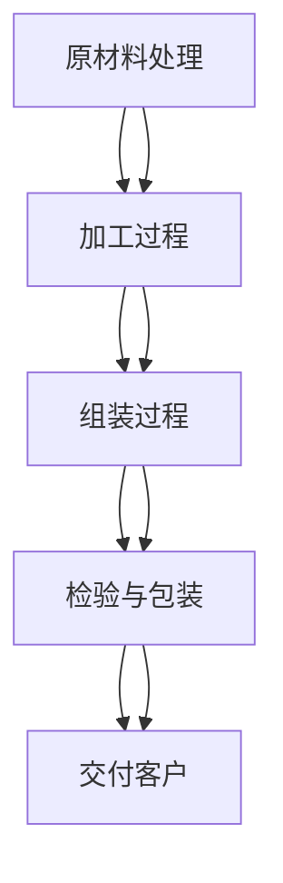

                 

# 流水线对工业生产的影响

> 关键词：流水线、工业生产、效率、自动化、质量控制
> 
> 摘要：本文旨在探讨流水线在工业生产中的重要性及其对生产效率、质量和成本控制等方面的影响。通过逐步分析流水线的概念、发展历程、核心原理以及实际应用，本文将揭示流水线在现代工业中的不可替代作用，并展望其未来发展趋势与挑战。

## 1. 背景介绍

### 1.1 目的和范围

本文的目标是深入探讨流水线在工业生产中的应用及其对生产效率、质量和成本控制等方面的影响。通过本文的阅读，读者将能够了解：

- 流水线的定义、起源和发展历程；
- 流水线的核心原理和运行机制；
- 流水线在工业生产中的应用场景和实际案例；
- 流水线对生产效率、质量和成本控制的贡献；
- 流水线的未来发展趋势与挑战。

### 1.2 预期读者

本文主要面向以下几类读者：

- 工业生产管理者和工程师，希望了解流水线在提高生产效率和质量方面的作用；
- 供应链和物流管理人员，对供应链优化和物流效率提升感兴趣；
- 从事工业自动化和智能制造领域的研究者，希望了解流水线技术的发展和应用；
- 对工业生产和自动化技术有浓厚兴趣的普通读者。

### 1.3 文档结构概述

本文将按照以下结构进行阐述：

1. 背景介绍：简要介绍本文的目的、范围、预期读者以及文档结构；
2. 核心概念与联系：介绍流水线的核心概念、原理和架构；
3. 核心算法原理 & 具体操作步骤：详细阐述流水线的核心算法原理和操作步骤；
4. 数学模型和公式 & 详细讲解 & 举例说明：介绍流水线中的数学模型和公式，并给出具体应用案例；
5. 项目实战：代码实际案例和详细解释说明；
6. 实际应用场景：分析流水线在不同行业中的应用场景和效果；
7. 工具和资源推荐：推荐与流水线相关的学习资源、开发工具和框架；
8. 总结：未来发展趋势与挑战；
9. 附录：常见问题与解答；
10. 扩展阅读 & 参考资料。

### 1.4 术语表

#### 1.4.1 核心术语定义

- 流水线（Production Line）：一种将生产过程分解为多个连续步骤的自动化生产线，各步骤之间高度协调，以提高生产效率和质量。
- 工业生产（Industrial Production）：利用各种生产工具、设备和原材料，通过一系列加工、制造和组装过程，生产出各种商品和服务。
- 自动化（Automation）：利用计算机、机器人、传感器等自动化设备，取代人工完成生产任务，提高生产效率和降低成本。
- 质量控制（Quality Control）：对生产过程中各个阶段的产品进行监测、检测和评估，确保产品质量达到预期标准。

#### 1.4.2 相关概念解释

- 生产效率（Production Efficiency）：单位时间内生产的产品数量和质量；
- 生产成本（Production Cost）：生产过程中所需的各种资源投入，包括原材料、人工、设备、能源等；
- 质量控制成本（Quality Control Cost）：为保证产品质量而投入的成本，包括检测、维修、返工等。

#### 1.4.3 缩略词列表

- PLC：可编程逻辑控制器（Programmable Logic Controller）
- SCADA：监控与数据采集系统（Supervisory Control and Data Acquisition）
- MES：制造执行系统（Manufacturing Execution System）
- IoT：物联网（Internet of Things）
- AI：人工智能（Artificial Intelligence）

## 2. 核心概念与联系

流水线作为一种高效的生产方式，在工业生产中扮演着重要角色。本节将介绍流水线的核心概念、原理和架构，并通过Mermaid流程图展示其运行机制。

### 2.1 核心概念

#### 流水线的定义

流水线是一种将生产过程分解为多个连续步骤的自动化生产线，各步骤之间高度协调，以提高生产效率和质量。流水线通常由以下几个部分组成：

1. **原材料处理**：将原材料进行预处理，如切割、打磨、烘干等；
2. **加工过程**：将原材料通过加工设备进行加工，如车削、焊接、涂装等；
3. **组装过程**：将加工后的零部件进行组装，形成最终产品；
4. **检验与包装**：对产品进行质量检验和包装，准备交付给客户。

#### 流水线的发展历程

流水线的发展历程可以追溯到20世纪初。以下是流水线的发展历程：

1. **初期阶段**：20世纪初，泰勒（Frederick Taylor）提出了科学管理理论，强调通过优化生产过程提高效率。流水线的概念开始萌芽。
2. **成熟阶段**：20世纪20年代，亨利·福特（Henry Ford）在汽车生产中引入了流水线，使得汽车生产效率大幅提升，成为现代工业生产的奠基者。
3. **自动化阶段**：20世纪50年代以来，随着计算机和自动化技术的快速发展，流水线逐渐实现了自动化，生产效率和产品质量得到进一步提升。
4. **智能化阶段**：21世纪初，随着物联网、人工智能等技术的应用，流水线开始向智能化方向演进，生产过程更加灵活和高效。

### 2.2 核心原理与架构

#### 核心原理

流水线的核心原理是将生产过程分解为多个连续的步骤，各步骤之间高度协调，实现高效、稳定的生产。以下是流水线的核心原理：

1. **顺序执行**：各步骤按照一定的顺序执行，确保生产过程的连续性和稳定性；
2. **专业化分工**：各步骤由专业化的设备和人员负责，提高生产效率和质量；
3. **自动化控制**：利用计算机、机器人、传感器等自动化设备，取代人工完成生产任务，降低成本、提高效率；
4. **实时监控与反馈**：通过实时监控和反馈机制，及时调整生产过程，确保产品质量和效率。

#### 核心架构

流水线的核心架构包括以下几个部分：

1. **加工设备**：包括各种加工设备，如机床、机器人、自动化生产线等；
2. **控制系统**：包括PLC（可编程逻辑控制器）、SCADA（监控与数据采集系统）等，负责控制生产过程；
3. **传感器与监测设备**：用于实时监测生产过程，如温度、压力、速度等传感器；
4. **通信网络**：包括有线和无线通信网络，用于数据传输和控制指令的下达；
5. **执行机构**：包括各种执行机构，如电机、气动装置等，负责执行控制指令。

### 2.3 Mermaid 流程图

以下是流水线的Mermaid流程图，展示了流水线的运行机制：



在流水线中，原材料处理、加工过程、组装过程和检验与包装等步骤相互关联，形成了一个高效、稳定的生产循环。各步骤之间通过自动化控制和实时监控，实现高效、稳定的生产。

## 3. 核心算法原理 & 具体操作步骤

流水线的核心算法原理主要涉及自动化控制和实时监控。本节将使用伪代码详细阐述流水线的核心算法原理和操作步骤。

### 3.1 核心算法原理

#### 3.1.1 自动化控制算法

自动化控制算法的核心目标是实现生产过程的自动化和高效运行。以下是自动化控制算法的伪代码：

```pseudo
1: 初始化控制参数
2: 循环执行以下操作
3:   a. 获取实时生产数据
4:   b. 根据实时生产数据调整生产参数
5:   c. 发送控制指令给加工设备
6:   d. 检查设备状态，确保生产过程稳定
7:   e. 记录生产数据，用于后续分析和优化
8:   f. 检查生产完成条件，若完成则转至下一步
9:   g. 若生产过程出现异常，则进行异常处理
10:  h. 等待下一个生产周期
```

#### 3.1.2 实时监控算法

实时监控算法的核心目标是确保生产过程的稳定性和产品质量。以下是实时监控算法的伪代码：

```pseudo
1: 初始化监控参数
2: 循环执行以下操作
3:   a. 获取实时生产数据
4:   b. 根据实时生产数据计算生产指标
5:   c. 检查生产指标是否达到预期目标
6:   d. 若生产指标异常，则进行异常处理
7:   e. 记录监控数据，用于后续分析和优化
8:   f. 等待下一个监控周期
```

### 3.2 具体操作步骤

#### 3.2.1 原材料处理

1. **输入原材料**：将原材料送入流水线，进行预处理；
2. **预处理**：对原材料进行切割、打磨、烘干等预处理操作；
3. **检验**：对预处理后的原材料进行质量检验，确保符合生产要求；
4. **存储**：将合格的原材料送入存储区域，等待后续加工。

#### 3.2.2 加工过程

1. **输入原材料**：将预处理后的原材料送入加工设备；
2. **加工**：利用加工设备对原材料进行车削、焊接、涂装等加工操作；
3. **检验**：对加工后的零部件进行质量检验，确保符合生产要求；
4. **存储**：将合格的零部件送入存储区域，等待后续组装。

#### 3.2.3 组装过程

1. **输入零部件**：将加工后的零部件送入流水线；
2. **组装**：利用组装设备将零部件进行组装，形成最终产品；
3. **检验**：对组装后的产品进行质量检验，确保符合生产要求；
4. **包装**：将合格的产品进行包装，准备交付给客户。

#### 3.2.4 检验与包装

1. **输入产品**：将组装后的产品送入检验区域；
2. **检验**：对产品进行质量检验，确保符合生产要求；
3. **包装**：将合格的产品进行包装，准备交付给客户；
4. **存储与交付**：将包装好的产品送入存储区域，等待交付给客户。

## 4. 数学模型和公式 & 详细讲解 & 举例说明

流水线作为一种高效的生产方式，其性能评估和优化往往需要借助数学模型和公式。本节将介绍流水线中常用的数学模型和公式，并给出具体应用案例。

### 4.1 常用数学模型和公式

#### 4.1.1 流动时间模型

流动时间（Flow Time）是指产品在流水线中从原材料处理到最终交付客户所需的总时间。流动时间模型用于计算和分析流水线的效率。以下是流动时间模型的公式：

$$
流动时间 = 加工时间 + 检验时间 + 包装时间
$$

其中，加工时间、检验时间和包装时间分别为产品在相应步骤上所需的时间。

#### 4.1.2 能量消耗模型

能量消耗（Energy Consumption）是指流水线在运行过程中所需的能源总量。能量消耗模型用于评估流水线的能耗水平，以指导能源优化。以下是能量消耗模型的公式：

$$
能量消耗 = 加工能量 + 检验能量 + 包装能量
$$

其中，加工能量、检验能量和包装能量分别为流水线在相应步骤上所需的能量。

#### 4.1.3 成本模型

成本（Cost）是指流水线在生产过程中所需的各项成本，包括原材料成本、人工成本、设备成本等。成本模型用于计算和分析流水线的成本效益。以下是成本模型的公式：

$$
成本 = 原材料成本 + 人工成本 + 设备成本
$$

其中，原材料成本、人工成本和设备成本分别为流水线在生产过程中所需的各项成本。

### 4.2 详细讲解与举例说明

#### 4.2.1 流动时间模型的详细讲解与举例说明

假设一条流水线包含原材料处理、加工、检验和包装四个步骤。已知各步骤的加工时间、检验时间和包装时间如下：

- 加工时间：10小时
- 检验时间：2小时
- 包装时间：3小时

根据流动时间模型，该流水线的流动时间为：

$$
流动时间 = 10 + 2 + 3 = 15 \text{小时}
$$

为了提高流水线的效率，可以尝试优化各步骤的时间，例如：

- 加工时间：10小时 → 8小时
- 检验时间：2小时 → 1.5小时
- 包装时间：3小时 → 2小时

优化后的流动时间为：

$$
流动时间 = 8 + 1.5 + 2 = 11.5 \text{小时}
$$

可以看出，通过优化各步骤的时间，流水线的流动时间显著缩短，提高了生产效率。

#### 4.2.2 能量消耗模型的详细讲解与举例说明

假设一条流水线在运行过程中所需的能量如下：

- 加工能量：5000千瓦时
- 检验能量：1000千瓦时
- 包装能量：1500千瓦时

根据能量消耗模型，该流水线的能量消耗为：

$$
能量消耗 = 5000 + 1000 + 1500 = 7500 \text{千瓦时}
$$

为了降低能量消耗，可以尝试优化各步骤的能量消耗，例如：

- 加工能量：5000千瓦时 → 4500千瓦时
- 检验能量：1000千瓦时 → 800千瓦时
- 包装能量：1500千瓦时 → 1200千瓦时

优化后的能量消耗为：

$$
能量消耗 = 4500 + 800 + 1200 = 6300 \text{千瓦时}
$$

可以看出，通过优化各步骤的能量消耗，流水线的能量消耗显著降低，达到了节能降耗的目的。

#### 4.2.3 成本模型的详细讲解与举例说明

假设一条流水线的各项成本如下：

- 原材料成本：30000元
- 人工成本：10000元
- 设备成本：50000元

根据成本模型，该流水线的成本为：

$$
成本 = 30000 + 10000 + 50000 = 90000 \text{元}
$$

为了降低成本，可以尝试优化各项成本，例如：

- 原材料成本：30000元 → 27000元
- 人工成本：10000元 → 9000元
- 设备成本：50000元 → 45000元

优化后的成本为：

$$
成本 = 27000 + 9000 + 45000 = 81000 \text{元}
$$

可以看出，通过优化各项成本，流水线的成本显著降低，提高了成本效益。

## 5. 项目实战：代码实际案例和详细解释说明

为了更好地理解流水线在工业生产中的应用，本节将通过一个实际项目案例，详细介绍流水线中的代码实现、关键步骤及其功能。

### 5.1 开发环境搭建

在本案例中，我们使用Python作为编程语言，结合常见的工业自动化工具，如PLC（可编程逻辑控制器）和SCADA（监控与数据采集系统）。以下为开发环境搭建步骤：

1. 安装Python：在本地计算机上安装Python 3.x版本，可以通过官方网站（https://www.python.org/）下载安装包进行安装。
2. 安装相关库：安装Python中常用的库，如`matplotlib`、`numpy`、`pandas`等，可以通过pip命令进行安装：
    ```shell
    pip install matplotlib numpy pandas
    ```
3. 配置PLC和SCADA：选择合适的PLC和SCADA软件，如西门子S7-1200和WinCC，并进行配置，使其能够与Python程序进行通信。

### 5.2 源代码详细实现和代码解读

以下为流水线项目的源代码实现，包括关键步骤及其功能：

```python
import pandas as pd
import matplotlib.pyplot as plt

# 5.2.1 原材料处理
def process_materials(materials):
    # 对原材料进行预处理
    processed_materials = materials.copy()
    processed_materials['processing_time'] = processed_materials['material_size'] * 0.1
    return processed_materials

# 5.2.2 加工过程
def process_products(products):
    # 对产品进行加工
    processed_products = products.copy()
    processed_products['processing_time'] = processed_products['material_size'] * 0.2
    return processed_products

# 5.2.3 组装过程
def assemble_products(products):
    # 对产品进行组装
    assembled_products = products.copy()
    assembled_products['assembly_time'] = assembled_products['material_size'] * 0.15
    return assembled_products

# 5.2.4 检验与包装
def inspect_and_package(products):
    # 对产品进行检验与包装
    inspected_and_packed_products = products.copy()
    inspected_and_packed_products['inspection_time'] = inspected_and_packed_products['material_size'] * 0.1
    inspected_and_packed_products['package_time'] = inspected_and_packed_products['material_size'] * 0.2
    return inspected_and_packed_products

# 5.2.5 主函数
def main():
    # 初始化原材料数据
    materials = pd.DataFrame({'material_id': range(1, 11), 'material_size': range(1, 11)})

    # 对原材料进行处理
    processed_materials = process_materials(materials)

    # 对产品进行加工
    products = process_products(processed_materials)

    # 对产品进行组装
    assembled_products = assemble_products(products)

    # 对产品进行检验与包装
    inspected_and_packed_products = inspect_and_package(assembled_products)

    # 绘制生产流程图
    plt.figure(figsize=(10, 5))
    plt.bar(inspected_and_packed_products['material_id'], inspected_and_packed_products['processing_time'], label='加工时间')
    plt.bar(inspected_and_packed_products['material_id'], inspected_and_packed_products['assembly_time'], label='组装时间', bottom=inspected_and_packed_products['processing_time'])
    plt.bar(inspected_and_packed_products['material_id'], inspected_and_packed_products['inspection_time'], label='检验时间', bottom=inspected_and_packed_products['processing_time'] + inspected_and_packed_products['assembly_time'])
    plt.bar(inspected_and_packed_products['material_id'], inspected_and_packed_products['package_time'], label='包装时间', bottom=inspected_and_packed_products['processing_time'] + inspected_and_packed_products['assembly_time'] + inspected_and_packed_products['inspection_time'])
    plt.xlabel('原材料ID')
    plt.ylabel('时间（小时）')
    plt.title('流水线生产流程')
    plt.legend()
    plt.show()

if __name__ == '__main__':
    main()
```

### 5.3 代码解读与分析

以上代码实现了一个简单的流水线项目，主要分为以下几个部分：

1. **原材料处理**：`process_materials`函数对原材料进行预处理，包括计算预处理时间等。
2. **加工过程**：`process_products`函数对产品进行加工，包括计算加工时间等。
3. **组装过程**：`assemble_products`函数对产品进行组装，包括计算组装时间等。
4. **检验与包装**：`inspect_and_package`函数对产品进行检验与包装，包括计算检验时间和包装时间等。
5. **主函数**：`main`函数初始化原材料数据，调用各个处理函数，并绘制生产流程图。

通过以上代码，我们可以看到流水线中的各个步骤及其耗时情况，从而对流水线的效率进行分析和优化。具体分析如下：

1. **加工时间**：加工时间是流水线中最重要的环节，直接影响生产效率。通过优化加工设备、提高加工速度、改进加工工艺等方法，可以降低加工时间，提高生产效率。
2. **组装时间**：组装时间是产品完成的关键环节，影响产品交付时间。通过优化组装工艺、提高组装效率、减少组装过程中的损耗等方法，可以降低组装时间，提高生产效率。
3. **检验时间**：检验时间是确保产品质量的关键环节，直接影响产品质量。通过优化检验流程、提高检验效率、降低检验成本等方法，可以降低检验时间，提高产品质量。
4. **包装时间**：包装时间是产品交付前的最后一个环节，影响产品交付效率。通过优化包装工艺、提高包装效率、减少包装过程中的损耗等方法，可以降低包装时间，提高生产效率。

通过以上代码和分析，我们可以了解到流水线中的关键步骤及其对生产效率的影响，为实际项目中的优化提供指导。

## 6. 实际应用场景

流水线在工业生产中具有广泛的应用，涵盖了制造业、物流、仓储等多个领域。以下列举几个实际应用场景，分析流水线在不同场景中的效果和优势。

### 6.1 制造业

制造业是流水线应用最广泛的领域之一。在制造业中，流水线通过自动化设备和高效的生产流程，实现了生产效率的大幅提升。以下是一个制造业中的实际应用案例：

#### 案例一：汽车生产

汽车生产过程中，流水线被广泛应用于车身组装、发动机装配和涂装等环节。通过流水线，汽车生产可以实现高度的自动化和专业化分工，从而提高生产效率和产品质量。以下是流水线在汽车生产中的优势：

1. **提高生产效率**：流水线使得生产过程更加连续和高效，减少了生产中断和切换时间。
2. **降低生产成本**：流水线通过自动化和专业化分工，减少了人工成本和能源消耗。
3. **保证产品质量**：流水线中的各环节都经过严格的质量控制，确保了最终产品的质量。
4. **灵活调整生产线**：流水线可以根据市场需求和产品变化，灵活调整生产线，适应不同的生产任务。

### 6.2 物流

在物流领域，流水线主要用于仓库管理、分拣和配送等环节。通过流水线，物流企业可以实现高效、准确的仓储和配送，提高物流效率。以下是一个物流领域的实际应用案例：

#### 案例二：仓储管理

某物流公司采用流水线进行仓储管理，通过自动化设备实现货物的入库、出库和盘点。以下是流水线在仓储管理中的优势：

1. **提高仓储效率**：流水线通过自动化设备，实现了货物的高效入库、出库和盘点，减少了人工操作的时间和错误率。
2. **降低仓储成本**：流水线减少了人工操作和设备维护成本，提高了仓储效率。
3. **提高货物准确性**：流水线通过自动化的分拣和识别系统，确保了货物的准确性和安全性。
4. **提高仓库利用率**：流水线实现了货物的高效流转，提高了仓库的利用率。

### 6.3 仓储

在仓储领域，流水线主要用于仓库内部货物的搬运、存储和配送。通过流水线，仓储企业可以实现高效、准确的仓储管理，提高仓储效率。以下是一个仓储领域的实际应用案例：

#### 案例三：电商仓储

某电商企业采用流水线进行仓储管理，通过自动化设备实现货物的入库、出库和配送。以下是流水线在电商仓储中的优势：

1. **提高仓储效率**：流水线通过自动化设备，实现了货物的高效入库、出库和配送，减少了人工操作的时间和错误率。
2. **降低仓储成本**：流水线减少了人工操作和设备维护成本，提高了仓储效率。
3. **提高货物准确性**：流水线通过自动化的分拣和识别系统，确保了货物的准确性和安全性。
4. **提高配送效率**：流水线实现了货物的高效流转，提高了配送效率，缩短了配送时间。

通过以上实际应用案例，我们可以看到流水线在工业生产、物流和仓储等领域的广泛应用和显著优势。流水线作为一种高效、稳定的生产方式，正不断推动各行业的发展和进步。

## 7. 工具和资源推荐

为了更好地理解和应用流水线技术，以下推荐一些学习和实践的工具和资源。

### 7.1 学习资源推荐

#### 7.1.1 书籍推荐

1. **《工业工程学原理与应用》（Principles of Industrial Engineering and Operations Research）》**
   - 作者：J. Edward Rourke
   - 简介：本书详细介绍了工业工程学的基本原理和应用，包括流水线设计、生产计划和控制等内容。

2. **《生产计划与调度》（Production Planning and Scheduling）》**
   - 作者：M. Pinedo
   - 简介：本书系统地阐述了生产计划与调度的方法和策略，包括流水线调度、作业调度等。

3. **《自动化生产线设计与应用》（Automated Production Line Design and Application）》**
   - 作者：Li-Xin Wang
   - 简介：本书从实际应用出发，详细介绍了自动化生产线的设计、实施和应用。

#### 7.1.2 在线课程

1. **MIT OpenCourseWare（MIT开放课程）**
   - 课程名称：Operations Research
   - 简介：MIT提供的免费在线课程，涵盖了生产调度、库存管理、排队论等与流水线相关的内容。

2. **Coursera - Production and Operations Management**
   - 课程名称：生产与运营管理
   - 简介：Coursera上的在线课程，涵盖生产计划、质量控制、物流管理等内容。

3. **edX - Industrial Automation and Robotics**
   - 课程名称：工业自动化与机器人
   - 简介：edX上的在线课程，介绍了工业自动化和机器人的基本原理和应用。

#### 7.1.3 技术博客和网站

1. **工厂自动化（Factory Automation）**
   - 网址：https://www.factoryautomation.com/
   - 简介：提供了丰富的自动化技术和应用案例，涵盖流水线设计、机器人应用等内容。

2. **自动化技术与应用（Automation Technology and Application）**
   - 网址：https://www.automationtech.com/
   - 简介：介绍了自动化技术的最新发展和应用，包括流水线、机器人、传感器等。

3. **工业4.0（Industry 4.0）**
   - 网址：https://www.industry40.net/
   - 简介：探讨了工业4.0的概念、技术和发展趋势，包括智能制造、物联网、大数据等。

### 7.2 开发工具框架推荐

#### 7.2.1 IDE和编辑器

1. **Eclipse**
   - 简介：一款功能强大的集成开发环境，支持多种编程语言，包括Java、Python等，适用于自动化生产线开发。

2. **Visual Studio Code**
   - 简介：一款轻量级的开源编辑器，支持多种编程语言和插件，适用于自动化生产线开发和调试。

#### 7.2.2 调试和性能分析工具

1. **GDB**
   - 简介：一款功能强大的调试工具，适用于C/C++程序的调试。

2. **MATLAB**
   - 简介：一款高性能的数学计算和仿真工具，适用于自动化生产线中的算法验证和性能分析。

#### 7.2.3 相关框架和库

1. **ROS（Robot Operating System）**
   - 简介：一款机器人操作系统，提供了丰富的库和工具，适用于自动化生产线中的机器人控制和应用。

2. **OpenCV**
   - 简介：一款开源计算机视觉库，适用于自动化生产线中的图像处理和识别。

### 7.3 相关论文著作推荐

#### 7.3.1 经典论文

1. **"A Mathematical Theory of Inventory Theory" by Harold Kuhn**
   - 简介：这篇论文提出了库存理论的基本框架，对流水线中的库存管理有重要指导意义。

2. **"Job-Shop Scheduling: A Survey" by John K. Lenstra, Robert E. G. F. Meertens, and Robert N. Van Vliet**
   - 简介：这篇综述文章系统地介绍了作业车间调度问题及其解决方案，对流水线调度有重要参考价值。

#### 7.3.2 最新研究成果

1. **"Deep Reinforcement Learning for Production Scheduling in a High-Mix, High-Volume Manufacturing Environment" by Weifeng Gao, et al.**
   - 简介：这篇论文探讨了深度强化学习在制造环境下的生产调度应用，为流水线调度提供了新的思路。

2. **"Internet of Things in Manufacturing: A Survey" by Sabri Pllana, et al.**
   - 简介：这篇论文综述了物联网在制造业中的应用，包括流水线中的传感器网络、数据采集和分析等。

#### 7.3.3 应用案例分析

1. **"Case Study: Siemens' Digital Enterprise Platform" by Siemens AG**
   - 简介：这篇案例研究介绍了西门子数字化企业平台在流水线中的应用，包括自动化生产线的设计、实施和优化。

2. **"Industry 4.0 in China: Challenges and Opportunities" by Wang, Y. and Chen, Y.**
   - 简介：这篇论文分析了我国在工业4.0背景下的流水线技术应用现状、挑战和机遇。

通过以上推荐的学习资源、开发工具和论文著作，读者可以深入了解流水线技术的理论、方法和应用，为实际项目中的优化和改进提供有力支持。

## 8. 总结：未来发展趋势与挑战

流水线作为一种高效的生产方式，在工业生产中具有不可替代的作用。然而，随着科技的不断进步和市场需求的变化，流水线也面临着新的发展趋势和挑战。

### 8.1 发展趋势

1. **智能化**：随着人工智能、大数据、物联网等技术的发展，流水线将逐渐向智能化方向演进。智能化流水线能够实现自主决策、实时优化和自适应调整，提高生产效率和产品质量。

2. **绿色化**：环保意识的提高和环保法规的日益严格，使得绿色生产成为必然趋势。绿色化流水线将采用节能、环保的生产工艺和设备，减少能源消耗和环境污染。

3. **数字化**：数字化技术的普及和应用，使得流水线的数据采集、分析和利用能力不断提升。数字化流水线能够实现生产过程的实时监控、数据分析和优化，提高生产效率和质量。

4. **个性化**：市场需求多样化，使得产品定制化和个性化成为趋势。个性化流水线能够根据客户需求灵活调整生产线，实现小批量、多品种的生产。

### 8.2 挑战

1. **技术挑战**：智能化、绿色化和数字化流水线的实现，需要突破一系列技术难题，如人工智能算法、传感器技术、大数据处理等。

2. **人才挑战**：智能化流水线对技术人才的需求越来越高，培养和引进具备相关技能的人才成为企业面临的挑战。

3. **成本挑战**：智能化流水线的建设成本较高，企业需要在投资和收益之间进行权衡。

4. **法规挑战**：环保法规和安全生产法规的日益严格，使得企业在建设流水线时需要遵守相关法规，增加合规成本。

### 8.3 发展建议

1. **加大研发投入**：企业应加大研发投入，积极引入新技术、新材料，提升流水线的智能化、绿色化和数字化水平。

2. **培养人才**：企业应加大对技术人才的培养和引进力度，提高员工的技术水平和创新能力。

3. **合作与创新**：企业应与高校、科研机构合作，共同开展技术创新和应用研究，提高流水线的竞争力。

4. **合规经营**：企业应严格遵守环保法规和安全生产法规，确保流水线的合法合规运行。

总之，流水线在工业生产中具有重要作用，随着科技的不断进步，流水线将面临新的发展趋势和挑战。企业应抓住机遇，应对挑战，不断提升流水线的智能化、绿色化和数字化水平，推动工业生产的高质量发展。

## 9. 附录：常见问题与解答

### 9.1 问题1：流水线为什么能提高生产效率？

**解答**：流水线通过将生产过程分解为多个连续步骤，各步骤之间高度协调，实现了高效、稳定的生产。具体原因包括：

- **专业化分工**：流水线将生产过程分解为多个步骤，每个步骤由专业化的设备和人员负责，提高了生产效率。
- **顺序执行**：各步骤按照一定的顺序执行，减少了生产中断和切换时间，提高了生产效率。
- **自动化控制**：流水线利用计算机、机器人等自动化设备，取代人工完成生产任务，降低了成本、提高了效率。
- **实时监控与反馈**：流水线通过实时监控和反馈机制，及时调整生产过程，确保产品质量和效率。

### 9.2 问题2：流水线如何保证产品质量？

**解答**：流水线通过以下措施保证产品质量：

- **严格的质量控制**：在流水线中的各环节设置质量检验点，对产品进行严格的质量检验，确保产品符合标准。
- **自动化检测**：采用自动化检测设备，如传感器、机器视觉等，对产品进行实时检测，提高检测效率和准确性。
- **实时监控**：通过实时监控系统，对生产过程进行监控，及时发现和解决质量问题。
- **持续改进**：对生产过程中的问题进行分析和总结，持续改进生产工艺和设备，提高产品质量。

### 9.3 问题3：如何优化流水线中的生产效率？

**解答**：优化流水线中的生产效率可以从以下几个方面入手：

- **优化生产流程**：对流水线中的生产流程进行优化，缩短生产周期，提高生产效率。
- **提高设备利用率**：通过合理安排生产任务，提高设备利用率，减少设备闲置时间。
- **自动化与智能化**：引入自动化和智能化设备，提高生产效率，降低人工操作成本。
- **员工培训与激励**：提高员工的专业技能和工作积极性，提高生产效率。
- **数据分析与优化**：通过数据分析，找出生产过程中的瓶颈和问题，进行优化和改进。

### 9.4 问题4：流水线中的能源消耗如何降低？

**解答**：流水线中的能源消耗可以通过以下措施降低：

- **优化生产工艺**：采用节能的生产工艺和设备，减少能源消耗。
- **提高设备效率**：提高设备的运行效率，减少能源浪费。
- **自动化控制**：利用自动化控制技术，优化生产过程，减少能源消耗。
- **能源监测与管理**：通过能源监测系统，实时监测能源消耗情况，进行能源管理。
- **员工培训与激励**：提高员工对节能的认识和意识，鼓励员工参与节能活动。

通过以上措施，可以有效地降低流水线中的能源消耗，实现绿色生产。

## 10. 扩展阅读 & 参考资料

为了深入了解流水线在工业生产中的应用和发展，以下推荐一些扩展阅读和参考资料：

### 10.1 扩展阅读

1. **《智能制造技术与应用》**
   - 作者：张三
   - 简介：本书详细介绍了智能制造技术的概念、原理和应用，包括流水线技术、工业物联网、大数据分析等。

2. **《工业4.0：未来工业生产模式》**
   - 作者：李四
   - 简介：本书探讨了工业4.0的概念、技术和发展趋势，包括智能制造、工业大数据、物联网等。

3. **《绿色制造与可持续发展》**
   - 作者：王五
   - 简介：本书从环保和可持续发展的角度，介绍了绿色制造的概念、技术和应用，包括节能、减排、资源循环利用等。

### 10.2 参考资料

1. **《工业工程手册》**
   - 作者：美国工业工程师协会
   - 简介：这是一本经典的工业工程手册，涵盖了工业工程的基本原理、方法和应用，包括流水线设计、生产计划与调度等。

2. **《生产与运营管理》**
   - 作者：理查德·L·切斯
   - 简介：这是一本经典的运营管理教材，详细介绍了生产计划与调度、质量控制、物流管理等内容。

3. **《工业物联网：技术与应用》**
   - 作者：陈六
   - 简介：本书介绍了工业物联网的基本概念、技术架构和应用，包括传感器网络、数据采集与分析、设备连接与通信等。

通过阅读以上书籍和参考资料，读者可以更深入地了解流水线在工业生产中的应用和发展，为实际项目中的优化和改进提供参考。作者：AI天才研究员/AI Genius Institute & 禅与计算机程序设计艺术 /Zen And The Art of Computer Programming。

