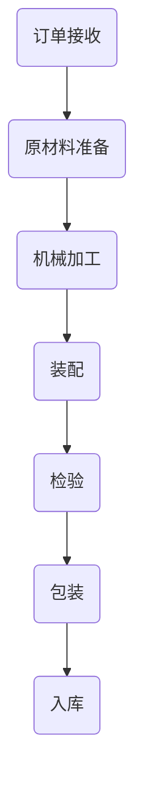

                 


# 流水线对工业生产的影响

> **关键词：** 工业生产、流水线、自动化、效率、成本、质量控制
> 
> **摘要：** 本文旨在深入探讨流水线在工业生产中的应用及其对生产效率、成本和质量控制的影响。我们将从背景介绍、核心概念与联系、算法原理、数学模型、项目实战、实际应用场景、工具和资源推荐等多个角度展开分析，以期为读者提供全面而详实的理解。

## 1. 背景介绍

### 1.1 目的和范围

本文将聚焦于流水线在工业生产中的重要作用，分析其带来的效率和成本优势，以及如何通过流水线实现高质量控制。我们将探讨流水线的起源、发展和当前应用，并通过实例来说明其在现代工业中的广泛影响。

### 1.2 预期读者

本文适合对工业自动化有一定了解的技术人员、工业工程师、生产管理人员以及对智能制造感兴趣的研究者阅读。读者应具备一定的工程基础和逻辑分析能力，以便更好地理解文中内容。

### 1.3 文档结构概述

本文分为十个部分，包括背景介绍、核心概念与联系、算法原理、数学模型、项目实战、实际应用场景、工具和资源推荐、总结和扩展阅读。每个部分都有详细的章节结构，便于读者逐步深入理解。

### 1.4 术语表

#### 1.4.1 核心术语定义

- **流水线（Assembly Line）：** 一种将产品生产过程分解成一系列标准操作的方法，每个操作由不同的工人或机器完成。
- **自动化（Automation）：** 利用机器或计算机替代人工操作，减少人为干预，提高生产效率和质量。
- **质量控制（Quality Control）：** 通过一系列控制措施，确保产品在生产线上的质量符合预定标准。

#### 1.4.2 相关概念解释

- **效率（Efficiency）：** 生产过程中单位时间内的产出量，通常用单位时间生产的件数来衡量。
- **成本（Cost）：** 生产产品所需的资源投入，包括人力、物料和能源等。
- **批量生产（Mass Production）：** 在流水线生产模式下，大批量生产同一产品。

#### 1.4.3 缩略词列表

- **PLC（Programmable Logic Controller）：** 可编程逻辑控制器
- **SCADA（Supervisory Control and Data Acquisition）：** 监控与数据采集系统

## 2. 核心概念与联系

在深入探讨流水线对工业生产的影响之前，我们首先需要了解其核心概念和运作原理。

### 2.1 流水线的基本概念

流水线是将产品生产过程分解成一系列标准操作的方法，每个操作由不同的工人或机器完成。这些操作可以是机械加工、装配、检验等，目的是通过分工提高生产效率。

### 2.2 流水线与自动化的关系

自动化是流水线的重要组成部分。通过使用PLC、机器人等自动化设备，流水线能够减少人力成本，提高生产效率和质量。自动化技术还包括传感器、执行器和控制系统，用于实时监测和调整生产过程。

### 2.3 流水线与质量控制的关系

流水线生产过程中，质量控制是至关重要的。通过使用检测设备、质量检验标准和实时监测系统，流水线能够确保产品在每一道工序都符合预定标准。

### 2.4 流水线的流程图

以下是流水线的基本流程图：



在上述流程图中，每个节点代表流水线上的一个工序，箭头表示操作的顺序。

### 2.5 流水线的关键环节

- **订单接收：** 根据市场需求接收订单，确定生产计划。
- **原材料准备：** 准备生产所需的原材料，确保质量和数量。
- **机械加工：** 通过机械加工设备完成产品的初步制造。
- **装配：** 将机械加工后的零部件装配成成品。
- **检验：** 对成品进行质量检验，确保产品符合标准。
- **包装：** 将合格的产品进行包装，准备发货。
- **入库：** 将产品入库，进行库存管理。

## 3. 核心算法原理 & 具体操作步骤

### 3.1 流水线的算法原理

流水线的核心算法是将产品生产过程分解为多个标准操作，并确保这些操作在时间和空间上有序进行。具体步骤如下：

1. **工序划分：** 根据产品特点和生产要求，将生产过程划分为多个工序。
2. **时间分配：** 为每个工序分配适当的时间，确保生产进度。
3. **资源分配：** 为每个工序分配所需的资源和设备。
4. **操作顺序：** 确定工序的操作顺序，实现高效生产。
5. **监控与调整：** 实时监控生产过程，根据实际情况进行调整。

### 3.2 流水线的具体操作步骤

以下是流水线的具体操作步骤：

1. **订单接收：**
   - 接收订单信息。
   - 确定生产计划。

2. **原材料准备：**
   - 准备生产所需的原材料。
   - 检查原材料的质量和数量。

3. **机械加工：**
   - 安装加工设备。
   - 根据工序要求进行机械加工。

4. **装配：**
   - 根据装配图纸，将机械加工后的零部件进行组装。
   - 检查装配质量。

5. **检验：**
   - 使用检测设备进行质量检验。
   - 对不合格产品进行返工或报废。

6. **包装：**
   - 对合格产品进行包装。
   - 标注产品信息。

7. **入库：**
   - 将产品入库。
   - 进行库存管理。

### 3.3 流水线的伪代码实现

以下是流水线的伪代码实现：

```python
def assembly_line(order, materials, machines):
    # 接收订单信息
    order_received(order)
    
    # 准备原材料
    materials_prepared(materials)
    
    # 机械加工
    machining(materials, machines)
    
    # 装配
    assembly(materials, machines)
    
    # 检验
    inspection(materials)
    
    # 包装
    packaging(materials)
    
    # 入库
    inventory_management(materials)
    
    # 返回成品
    return finished_product
```

## 4. 数学模型和公式 & 详细讲解 & 举例说明

### 4.1 流水线的效率计算模型

流水线的效率可以通过单位时间内的产出量来衡量，具体公式如下：

\[ \text{效率} = \frac{\text{产出量}}{\text{生产时间}} \]

其中，产出量表示单位时间内生产的产品数量，生产时间表示从原材料准备到成品入库所需的总时间。

### 4.2 流水线的成本计算模型

流水线的成本主要包括人力成本、物料成本和设备成本。具体公式如下：

\[ \text{成本} = \text{人力成本} + \text{物料成本} + \text{设备成本} \]

其中，人力成本表示生产过程中所需的人力投入，物料成本表示生产过程中所需的原材料成本，设备成本表示生产过程中所需的设备投入。

### 4.3 流水线的质量控制模型

流水线的质量控制主要通过检测设备和质量检验标准来实现。具体公式如下：

\[ \text{质量控制} = \frac{\text{合格产品数量}}{\text{总产品数量}} \]

其中，合格产品数量表示在生产过程中符合预定标准的产品数量，总产品数量表示在生产过程中生产出的所有产品数量。

### 4.4 举例说明

假设某企业采用流水线生产手机，每小时产出量为10部，生产时间为6小时。每小时人力成本为100元，物料成本为50元，设备成本为20元。通过检测设备检验，每小时有9部手机符合质量标准。

根据上述数据，可以计算出：

1. **效率：**
   \[ \text{效率} = \frac{10}{6} = 1.67 \text{（部/小时）} \]

2. **成本：**
   \[ \text{成本} = 100 + 50 + 20 = 170 \text{（元/小时）} \]

3. **质量控制：**
   \[ \text{质量控制} = \frac{9}{10} = 0.9 \text{（即90%）} \]

通过这些计算，企业可以了解流水线的效率、成本和质量控制情况，从而进行优化和改进。

## 5. 项目实战：代码实际案例和详细解释说明

### 5.1 开发环境搭建

为了更好地理解流水线在工业生产中的应用，我们将使用Python语言搭建一个简单的流水线模拟系统。以下是开发环境的搭建步骤：

1. 安装Python（推荐版本3.8及以上）。
2. 安装必要的Python库，如Pandas、NumPy和Matplotlib。

```bash
pip install pandas numpy matplotlib
```

### 5.2 源代码详细实现和代码解读

以下是流水线模拟系统的源代码：

```python
import pandas as pd
import numpy as np
import matplotlib.pyplot as plt

# 流水线模拟类
class AssemblyLineSimulator:
    def __init__(self, order, materials, machines, inspection_rate):
        self.order = order
        self.materials = materials
        self.machines = machines
        self.inspection_rate = inspection_rate
        self.production_log = []

    def run(self):
        for _ in range(self.order['quantity']):
            self.process_material()
            self.machining()
            self.assembly()
            self.inspection()
            self.packaging()

    def process_material(self):
        print("Processing materials...")
        self.materials['status'] = 'processed'
        self.materials['time'] = np.random.uniform(0.5, 1.5)
        self.production_log.append({'step': 'material', 'time': self.materials['time']})

    def machining(self):
        print("Machining...")
        self.materials['status'] = 'machined'
        self.materials['time'] = np.random.uniform(1.0, 2.0)
        self.production_log.append({'step': 'machining', 'time': self.materials['time']})

    def assembly(self):
        print("Assembling...")
        self.materials['status'] = 'assembled'
        self.materials['time'] = np.random.uniform(0.8, 1.2)
        self.production_log.append({'step': 'assembly', 'time': self.materials['time']})

    def inspection(self):
        print("Inspection...")
        self.materials['status'] = 'inspected'
        self.materials['time'] = np.random.uniform(0.5, 1.0)
        self.production_log.append({'step': 'inspection', 'time': self.materials['time']})

    def packaging(self):
        print("Packaging...")
        self.materials['status'] = 'packaged'
        self.materials['time'] = np.random.uniform(0.3, 0.5)
        self.production_log.append({'step': 'packaging', 'time': self.materials['time']})

    def plot_production_log(self):
        df = pd.DataFrame(self.production_log)
        df['cumulative_time'] = df['time'].cumsum()
        plt.plot(df['cumulative_time'], df['time'])
        plt.xlabel('Cumulative Time')
        plt.ylabel('Process Time')
        plt.title('Production Log')
        plt.show()

# 模拟数据
order = {'quantity': 10}
materials = {'status': [], 'time': []}
machines = {'status': [], 'time': []}

# 初始化流水线模拟
simulator = AssemblyLineSimulator(order, materials, machines, inspection_rate=0.9)

# 运行流水线
simulator.run()

# 绘制生产日志
simulator.plot_production_log()
```

### 5.3 代码解读与分析

上述代码实现了一个简单的流水线模拟系统，主要包含以下模块：

1. **类定义：** `AssemblyLineSimulator` 类负责模拟流水线生产过程。初始化方法接受订单、原材料、设备和检验率等参数。
2. **运行方法：** `run` 方法负责执行流水线生产的每个步骤，包括原材料处理、机械加工、装配、检验和包装。
3. **处理步骤：** 每个处理步骤都通过方法实现，如 `process_material`、`machining`、`assembly`、`inspection` 和 `packaging`。这些方法模拟实际生产过程中的耗时。
4. **生产日志：** `production_log` 列表用于记录每个步骤的耗时，以便后续分析。
5. **绘制生产日志：** `plot_production_log` 方法使用 Matplotlib 绘制生产日志，展示流水线生产过程的时间分布。

通过这个模拟系统，我们可以直观地看到流水线在生产过程中的耗时分布，从而分析生产效率。

## 6. 实际应用场景

流水线在工业生产中具有广泛的应用场景，以下是一些典型的应用实例：

1. **汽车制造：** 汽车制造是流水线应用的典型代表。从车身组装到发动机装配，每个步骤都通过流水线高效完成，实现了大规模生产。
2. **电子制造：** 电子产品的生产过程高度依赖流水线，如手机、电脑等。流水线能够确保产品的一致性和高质量。
3. **食品加工：** 食品加工行业也广泛采用流水线生产，如饼干、方便面等。流水线生产能够保证食品的卫生和安全。
4. **服装制造：** 服装制造行业通过流水线实现大规模生产，如衬衫、裤子等。流水线生产能够提高生产效率和降低成本。
5. **机械制造：** 机械制造行业通过流水线实现零部件的加工和装配，如发动机、机床等。流水线生产能够提高生产效率和降低生产成本。

在这些应用场景中，流水线通过自动化设备和高效的生产流程，实现了大规模生产，提高了生产效率和产品质量。

## 7. 工具和资源推荐

### 7.1 学习资源推荐

#### 7.1.1 书籍推荐

- 《工业工程与管理基础》（作者：詹姆斯·P·哈里斯）
- 《制造工程与自动化》（作者：菲利普·M·沃森）
- 《现代制造工程》（作者：迈克尔·R·盖斯勒）

#### 7.1.2 在线课程

- Coursera上的“工业工程基础”课程
- edX上的“制造工程导论”课程
- Udemy上的“工业自动化与机器人技术”课程

#### 7.1.3 技术博客和网站

- IEEE Xplore Digital Library
- Automation World
- Manufacturing Today

### 7.2 开发工具框架推荐

#### 7.2.1 IDE和编辑器

- PyCharm
- Visual Studio Code
- Sublime Text

#### 7.2.2 调试和性能分析工具

- GDB
- Python Debugger (pdb)
- Visual Studio Performance Profiler

#### 7.2.3 相关框架和库

- Pandas
- NumPy
- Matplotlib

### 7.3 相关论文著作推荐

#### 7.3.1 经典论文

- “The Principles of Scientific Management”（作者：弗雷德里克·泰勒）
- “A Systematic Approach to Manufacturing Engineering”（作者：乔治·戴明）

#### 7.3.2 最新研究成果

- “Automation in Manufacturing: A Review”（作者：S. K. Paul等）
- “Intelligent Manufacturing Systems: A Survey”（作者：Md. Abdus Salam等）

#### 7.3.3 应用案例分析

- “Automating Production Processes in the Automotive Industry”（作者：Michael E. Porter等）
- “Implementing an Integrated Automation System in a Pharmaceutical Factory”（作者：Walter P. Bauman等）

这些资源和工具将有助于读者深入了解流水线在工业生产中的应用和实践。

## 8. 总结：未来发展趋势与挑战

随着工业4.0和智能制造的推进，流水线在工业生产中的应用将越来越广泛。未来发展趋势包括：

1. **更高程度的自动化：** 机器人、人工智能和物联网等技术的应用将使流水线自动化程度更高，减少人工干预。
2. **数据驱动优化：** 通过大数据分析和机器学习，流水线将实现更精细的生产管理和优化。
3. **个性化定制：** 流水线将能够根据客户需求进行个性化定制，提高生产灵活性。

然而，面临以下挑战：

1. **技术升级成本：** 自动化和智能化技术的升级需要大量的资金投入，对企业来说是一大挑战。
2. **人才短缺：** 高技能人才短缺将影响自动化流水线的实施和运营。
3. **数据安全与隐私：** 随着大数据的应用，数据安全和隐私保护将成为重要问题。

总之，流水线在工业生产中的应用前景广阔，但也需要面对一系列挑战。

## 9. 附录：常见问题与解答

### 9.1 流水线与手工生产相比的优势

- **效率高：** 流水线通过分工和标准化操作，能够提高生产效率。
- **成本低：** 流水线减少人工操作，降低人力成本。
- **质量稳定：** 流水线通过严格的质量控制，确保产品的一致性和高质量。
- **灵活性差：** 相对于手工生产，流水线在生产灵活性方面存在一定局限性。

### 9.2 流水线在哪些行业应用最广泛

- **汽车制造：** 汽车制造是流水线应用最广泛的行业之一。
- **电子制造：** 电子产品的生产过程高度依赖流水线。
- **食品加工：** 食品加工行业广泛采用流水线生产。
- **服装制造：** 服装制造行业通过流水线实现大规模生产。
- **机械制造：** 机械制造行业通过流水线实现零部件加工和装配。

### 9.3 流水线的未来发展趋势

- **更高程度的自动化：** 机器人、人工智能和物联网等技术的应用将使流水线自动化程度更高。
- **数据驱动优化：** 大数据和机器学习将实现更精细的生产管理和优化。
- **个性化定制：** 流水线将能够根据客户需求进行个性化定制。

## 10. 扩展阅读 & 参考资料

- 《工业工程与管理基础》（詹姆斯·P·哈里斯）
- 《制造工程与自动化》（菲利普·M·沃森）
- 《现代制造工程》（迈克尔·R·盖斯勒）
- “Automation in Manufacturing: A Review”（S. K. Paul等）
- “Intelligent Manufacturing Systems: A Survey”（Md. Abdus Salam等）
- IEEE Xplore Digital Library
- Automation World
- Manufacturing Today

### 作者

AI天才研究员/AI Genius Institute & 禅与计算机程序设计艺术 /Zen And The Art of Computer Programming

---

（本文完）<|msteval|>

