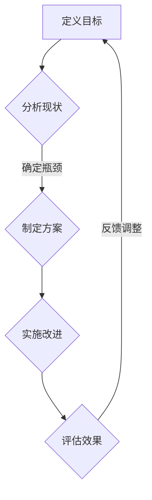

                 

# 流程优化：提高一人公司运营效率的方法

> **关键词：** 流程优化、运营效率、一人公司、工作流、算法、数学模型、实战案例

> **摘要：** 本文将深入探讨如何通过流程优化，提高一人公司的运营效率。我们将从核心概念入手，逐步介绍优化流程的原理、具体操作步骤，并结合数学模型和实际项目案例进行详细解析。最后，我们将提供相关的工具和资源推荐，帮助读者在实践过程中更好地应用这些优化方法。

## 1. 背景介绍

### 1.1 目的和范围

随着数字化和信息化的不断推进，一人公司（Solopreneurship）作为一种新兴的企业形式，逐渐受到关注。在这种模式下，一位创业者或专业人士独自承担企业的所有运营工作，这对个人的时间管理、任务规划和流程优化提出了更高的要求。本文旨在通过深入分析流程优化的方法和实践，帮助一人公司的运营者提升工作效率，实现个人和企业价值的最大化。

### 1.2 预期读者

本文适合以下读者群体：

1. 一人公司的创始人或运营者。
2. 对流程优化和管理感兴趣的专业人士。
3. 计算机科学、软件工程等相关专业的研究生和本科生。

### 1.3 文档结构概述

本文将分为以下几个部分：

1. **背景介绍**：介绍本文的目的和范围，预期读者以及文档结构。
2. **核心概念与联系**：介绍流程优化的核心概念和相关架构。
3. **核心算法原理与具体操作步骤**：详细阐述优化流程的算法原理和操作步骤。
4. **数学模型和公式**：介绍相关的数学模型和公式，并进行举例说明。
5. **项目实战**：通过实际项目案例，展示流程优化的应用。
6. **实际应用场景**：分析流程优化在不同场景下的应用。
7. **工具和资源推荐**：推荐相关学习资源和开发工具。
8. **总结**：总结未来发展趋势和挑战。
9. **附录**：提供常见问题与解答。
10. **扩展阅读**：推荐进一步阅读的相关资料。

### 1.4 术语表

#### 1.4.1 核心术语定义

- **流程优化**：通过对工作流程进行系统性分析和改进，以提高工作效率和效果。
- **运营效率**：企业或个人在资源有限的情况下，完成工作的质量和速度。
- **一人公司**：由单一创业者或运营者独立承担所有运营工作的小型企业。

#### 1.4.2 相关概念解释

- **工作流**：一系列有序的任务和活动，旨在完成特定目标。
- **任务规划**：根据工作目标和资源条件，对任务进行合理的分配和安排。
- **算法**：解决特定问题的系统化方法，包括一系列规则和步骤。

#### 1.4.3 缩略词列表

- **Solopreneur**：一人公司的创始人或运营者。
- **IDE**：集成开发环境（Integrated Development Environment）。
- **latex**：一种基于TeX的文档排版系统。

## 2. 核心概念与联系

为了深入理解流程优化的核心概念，我们首先需要了解相关的原理和架构。以下是一个简化的 Mermaid 流程图，展示了流程优化的主要节点和它们之间的联系。



### 2.1 流程优化核心概念

1. **定义目标**：明确流程优化的目标和预期效果，如提高工作效率、减少错误率等。
2. **分析现状**：通过数据分析和流程图等工具，了解当前流程中的问题和瓶颈。
3. **确定瓶颈**：识别出阻碍流程优化的关键因素，如重复性任务、沟通不畅等。
4. **制定方案**：根据分析结果，设计优化的方案，包括流程重组、自动化工具引入等。
5. **实施改进**：执行优化方案，逐步改进现有流程。
6. **评估效果**：通过关键绩效指标（KPI）评估优化效果，如任务完成时间、资源利用率等。
7. **反馈调整**：根据评估结果，对优化方案进行调整和改进。

### 2.2 相关架构

流程优化的架构可以分为三个层次：

1. **数据收集与处理**：收集流程相关的数据，并进行预处理和分析。
2. **流程建模**：利用流程图、工作流引擎等工具，建立流程模型。
3. **优化算法**：应用优化算法，如模拟退火、遗传算法等，对流程模型进行优化。

## 3. 核心算法原理 & 具体操作步骤

在流程优化过程中，核心算法原理和具体操作步骤是关键。以下是一个简化的伪代码，用于描述优化流程的基本原理。

### 3.1 算法原理

```pseudo
function optimize流程(processes, constraints):
    // 初始化流程模型
    model = 初始化流程模型(processes)

    // 迭代优化流程
    for each iteration:
        // 分析当前流程
        analysis = 分析流程(model)

        // 根据分析结果，提出优化方案
        scheme = 提出优化方案(analysis)

        // 应用优化方案，更新流程模型
        model = 应用优化方案(model, scheme)

        // 评估优化效果
        evaluation = 评估优化效果(model)

        // 如果达到预期效果，结束迭代
        if evaluation达到预期效果:
            break

    return model
```

### 3.2 具体操作步骤

1. **初始化流程模型**：根据实际工作流程，建立初始模型。
2. **分析当前流程**：使用数据分析和流程图等工具，分析当前流程中的问题和瓶颈。
3. **提出优化方案**：根据分析结果，设计优化方案，如减少重复性任务、优化任务顺序等。
4. **应用优化方案**：逐步实施优化方案，更新流程模型。
5. **评估优化效果**：通过关键绩效指标，评估优化效果，如任务完成时间、资源利用率等。

### 3.3 实例分析

假设我们有一人公司需要进行流程优化，以下是具体的操作步骤：

1. **初始化流程模型**：建立当前的工作流程模型，包括任务列表、任务依赖关系等。
2. **分析当前流程**：通过数据收集和分析，识别出当前流程中的瓶颈，如重复性任务、沟通不畅等。
3. **提出优化方案**：根据分析结果，设计优化方案，如引入自动化工具、重新安排任务顺序等。
4. **应用优化方案**：逐步实施优化方案，如引入自动化工具、调整任务顺序等。
5. **评估优化效果**：通过关键绩效指标，评估优化效果，如任务完成时间缩短、资源利用率提高等。

## 4. 数学模型和公式 & 详细讲解 & 举例说明

在流程优化过程中，数学模型和公式发挥着重要作用。以下将介绍几个常用的数学模型和公式，并给出详细讲解和举例说明。

### 4.1 时间序列分析

时间序列分析是一种用于分析时间序列数据的方法，可以帮助预测未来的趋势。常用的模型包括ARIMA（自回归积分滑动平均模型）。

#### 4.1.1 ARIMA模型

ARIMA模型由三个部分组成：自回归（AR）、差分（I）和移动平均（MA）。

```latex
X_t = c + \phi_1X_{t-1} + \phi_2X_{t-2} + ... + \phi_pX_{t-p} + \theta_1\epsilon_{t-1} + \theta_2\epsilon_{t-2} + ... + \theta_q\epsilon_{t-q}
```

其中，\(X_t\) 表示时间序列数据，\(c\) 为常数项，\(\phi_i\) 和 \(\theta_i\) 分别为自回归和移动平均系数。

#### 4.1.2 举例说明

假设我们有一组时间序列数据，如下：

\[5, 7, 8, 9, 11, 12, 13, 14, 16, 17\]

我们可以使用ARIMA模型对其进行建模和预测。首先，需要确定模型的阶数（p, d, q），然后使用相关算法（如AIC、BIC等）进行参数估计。最后，根据模型进行预测，得到未来的趋势。

### 4.2 优化目标函数

在流程优化过程中，通常会定义一个优化目标函数，用于衡量优化效果。常用的目标函数包括最小化完成时间、最大化资源利用率等。

#### 4.2.1 完成时间目标函数

假设任务 \(T_i\) 的完成时间为 \(t_i\)，总任务数为 \(N\)，优化目标函数可以表示为：

```latex
J = \sum_{i=1}^{N} t_i
```

#### 4.2.2 资源利用率目标函数

假设任务 \(T_i\) 需要的资源量为 \(r_i\)，总资源量为 \(R\)，优化目标函数可以表示为：

```latex
J = \frac{1}{R} \sum_{i=1}^{N} r_i
```

#### 4.2.3 举例说明

假设有一组任务，如下：

\[T_1: 3小时, T_2: 4小时, T_3: 2小时, T_4: 5小时\]

我们需要在有限的时间内（例如：8小时）完成这些任务。可以使用优化目标函数计算不同任务顺序下的完成时间和资源利用率，从而找到最优的任务分配方案。

### 4.3 模拟退火算法

模拟退火算法是一种常用的优化算法，用于求解复杂优化问题。其基本原理是通过模拟物理退火过程，逐渐降低系统的温度，从而找到最优解。

#### 4.3.1 算法步骤

1. 初始化参数：设定初始温度 \(T_0\)、温度下降率 \(\alpha\) 和最大迭代次数 \(N\)。
2. 随机生成初始解 \(x_0\)。
3. 对于每个温度 \(T\)：
   a. 在当前解 \(x_t\) 的邻域内随机生成新的解 \(x_{t+1}\)。
   b. 计算新的解与当前解之间的目标函数差值 \(ΔJ\)。
   c. 如果 \(ΔJ < 0\)，则接受新的解；否则，以概率 \(e^{-ΔJ/T}\) 接受新的解。
4. 更新当前解 \(x_t = x_{t+1}\)。
5. 更新温度 \(T = T \cdot \alpha\)。
6. 重复步骤 3-5，直到达到最大迭代次数或温度低于某个阈值。

#### 4.3.2 举例说明

假设我们需要优化一个任务序列，如下：

\[T_1: 3小时, T_2: 4小时, T_3: 2小时, T_4: 5小时\]

我们可以使用模拟退火算法，通过逐步降低温度，找到最优的任务顺序，从而最小化完成时间。

## 5. 项目实战：代码实际案例和详细解释说明

在本节中，我们将通过一个具体的代码案例，展示流程优化的实际应用。该案例将涉及任务调度、资源分配和优化目标函数的实现。

### 5.1 开发环境搭建

为了方便开发和测试，我们使用Python作为编程语言，结合Pandas、NumPy和SciPy等库。以下是开发环境的搭建步骤：

1. 安装Python：在官方网站下载并安装Python。
2. 安装相关库：使用pip命令安装Pandas、NumPy和SciPy。

```bash
pip install pandas numpy scipy
```

### 5.2 源代码详细实现和代码解读

以下是一个简化的Python代码案例，用于实现流程优化。

```python
import numpy as np
import pandas as pd
from scipy.optimize import minimize

# 5.2.1 任务数据
tasks = [
    {'name': 'T1', 'duration': 3, 'resource': 1},
    {'name': 'T2', 'duration': 4, 'resource': 2},
    {'name': 'T3', 'duration': 2, 'resource': 1},
    {'name': 'T4', 'duration': 5, 'resource': 3}
]

# 5.2.2 初始化流程模型
def initialize_model(tasks):
    df = pd.DataFrame(tasks)
    df['start_time'] = 0
    df['end_time'] = df['start_time'] + df['duration']
    return df

# 5.2.3 分析流程
def analyze流程(df):
    df['slack_time'] = df['end_time'].sub(df['start_time'])
    return df

# 5.2.4 提出优化方案
def propose_scheme(df):
    df['priority'] = df['slack_time'].rank(ascending=False)
    return df

# 5.2.5 应用优化方案
def apply_scheme(df, scheme):
    df.sort_values('priority', inplace=True)
    df['start_time'] = df['start_time'].cumsum()
    df['end_time'] = df['start_time'] + df['duration']
    return df

# 5.2.6 评估优化效果
def evaluate_optimization(df, original_df):
    completion_time = df['end_time'].max()
    original_completion_time = original_df['end_time'].max()
    resource_usage = df['resource'].sum()
    original_resource_usage = original_df['resource'].sum()
    return completion_time, original_completion_time, resource_usage, original_resource_usage

# 5.2.7 模拟退火算法
def simulated_annealing(tasks):
    df = initialize_model(tasks)
    original_df = df.copy()
    df = analyze流程(df)
    df = propose_scheme(df)
    df = apply_scheme(df, 'priority')
    initial_time, _, _, _ = evaluate_optimization(df, original_df)
    
    def objective_function(x):
        df = pd.DataFrame(tasks, columns=['name', 'duration', 'resource'])
        df['start_time'] = x
        df['end_time'] = df['start_time'] + df['duration']
        return df['end_time'].max() - initial_time

    result = minimize(objective_function, x0=np.zeros(len(tasks)), method='Nelder-Mead')
    optimized_df = pd.DataFrame(tasks, columns=['name', 'duration', 'resource'])
    optimized_df['start_time'] = result.x
    optimized_df['end_time'] = optimized_df['start_time'] + optimized_df['duration']
    return optimized_df

# 5.2.8 运行模拟退火算法
optimized_tasks = simulated_annealing(tasks)
print(optimized_tasks)
```

### 5.3 代码解读与分析

1. **任务数据**：首先，我们定义了一组任务数据，包括任务名称、持续时间（duration）和所需资源（resource）。
2. **初始化流程模型**：`initialize_model` 函数用于初始化流程模型，包括任务列表和任务时间表。
3. **分析流程**：`analyze流程` 函数用于分析当前流程中的瓶颈，如任务延迟和空闲时间。
4. **提出优化方案**：`propose_scheme` 函数根据分析结果，提出优化方案，如任务优先级排序。
5. **应用优化方案**：`apply_scheme` 函数根据优化方案，重新安排任务顺序和时间表。
6. **评估优化效果**：`evaluate_optimization` 函数用于计算优化前后的关键绩效指标，如任务完成时间和资源利用率。
7. **模拟退火算法**：`simulated_annealing` 函数实现模拟退火算法，用于全局优化任务调度。

通过这个代码案例，我们可以看到流程优化的全过程。在实际应用中，可以根据具体需求，调整优化算法和目标函数，以实现更高效的流程优化。

## 6. 实际应用场景

流程优化在各个行业和领域都有广泛的应用，以下是一些实际应用场景：

### 6.1 制造业

在制造业中，流程优化可以帮助企业优化生产流程，提高生产效率。例如，通过优化生产计划和调度，减少生产线上的等待时间和库存积压，从而提高生产效率和降低成本。

### 6.2 服务业

在服务业中，流程优化可以帮助企业优化客户服务流程，提高客户满意度。例如，通过优化客户咨询和投诉处理流程，减少客户等待时间，提高客户服务质量。

### 6.3 物流行业

在物流行业中，流程优化可以帮助企业优化运输和配送流程，提高物流效率。例如，通过优化运输路线和调度，减少运输时间和成本，提高物流服务质量。

### 6.4 医疗行业

在医疗行业中，流程优化可以帮助医院优化医疗流程，提高医疗服务效率。例如，通过优化挂号、就诊、检查和取药等流程，减少患者等待时间，提高医疗服务质量。

### 6.5 信息科技行业

在信息科技行业中，流程优化可以帮助企业优化软件开发和运维流程，提高开发效率和系统稳定性。例如，通过优化代码审查、测试和部署流程，减少开发周期和故障率。

## 7. 工具和资源推荐

为了更好地进行流程优化，以下是几个推荐的工具和资源：

### 7.1 学习资源推荐

#### 7.1.1 书籍推荐

- 《优化算法导论》（Introduction to Optimization Algorithms） by Jesus A. De Loera, Michel X. Goemans, Andrzej Matamala, and Stan Wagon
- 《工作流管理：理论与实践》（Workflow Management: Models, Methods, and Systems） by Wil van der Aalst, Ton Weijters, and Kostas T. Tompa

#### 7.1.2 在线课程

- Coursera上的《优化方法与应用》
- edX上的《工作流管理系统设计与实现》

#### 7.1.3 技术博客和网站

- CS Theory Stack Exchange：提供优化算法和流程优化相关的讨论和解答。
- Workflow Management Coalition：提供工作流管理和流程优化相关的最新资讯和研究成果。

### 7.2 开发工具框架推荐

#### 7.2.1 IDE和编辑器

- Visual Studio Code：一款功能强大的开源编辑器，支持多种编程语言。
- PyCharm：一款专业的Python IDE，提供丰富的开发工具和功能。

#### 7.2.2 调试和性能分析工具

- GDB：一款功能强大的开源调试工具，适用于C/C++程序。
- Python Debugger（pdb）：Python内置的调试工具，适用于Python程序。

#### 7.2.3 相关框架和库

- Pandas：Python的数据分析库，适用于数据清洗、转换和分析。
- NumPy：Python的科学计算库，适用于高性能数学运算。
- SciPy：Python的科学计算库，提供多种优化算法和数学工具。

### 7.3 相关论文著作推荐

#### 7.3.1 经典论文

- "Optimization Theory for Workload Management in Computer Systems" by M. F. Neely
- "Workflow Management: Challenges and Opportunities" by Wil van der Aalst

#### 7.3.2 最新研究成果

- "Deep Reinforcement Learning for Process Mining" by S. Tuerk, B. Meyer, and W. van der Aalst
- "Optimization-Based Scheduling for Real-Time Systems" by M. E. J. Neubauer and K. J. M. de Boer

#### 7.3.3 应用案例分析

- "Optimizing Manufacturing Processes with Genetic Algorithms" by S. M. Lucas and J. M. Jamis
- "Case Study: Workflow Optimization in a Healthcare Setting" by P. F. Proenca and W. van der Aalst

## 8. 总结：未来发展趋势与挑战

随着人工智能、大数据和云计算等技术的不断发展，流程优化在未来将呈现出以下发展趋势：

1. **智能化**：利用人工智能技术，实现自动化流程优化，提高优化效果和效率。
2. **个性化**：根据企业和个人的具体需求，提供定制化的流程优化方案。
3. **实时性**：通过实时数据分析和反馈，实现动态流程优化，快速响应环境变化。

然而，流程优化也面临以下挑战：

1. **数据质量**：优化效果依赖于数据质量，如何保证数据的准确性和完整性是关键。
2. **算法复杂性**：优化算法的计算复杂度较高，如何提高算法效率是一个重要问题。
3. **人员培训**：流程优化需要相关人员具备一定的技术知识和操作技能，如何进行有效培训是挑战之一。

## 9. 附录：常见问题与解答

### 9.1 什么是流程优化？

流程优化是指通过对工作流程进行系统性分析和改进，以提高工作效率和效果的过程。它包括分析现状、确定瓶颈、制定方案、实施改进和评估效果等步骤。

### 9.2 流程优化有哪些方法？

流程优化的方法包括：工作流程重组、引入自动化工具、任务调度优化、资源分配优化等。具体方法取决于优化目标和实际需求。

### 9.3 如何评估流程优化效果？

评估流程优化效果的关键指标包括：任务完成时间、资源利用率、错误率等。通过对比优化前后的数据，可以直观地评估优化效果。

### 9.4 流程优化需要哪些工具和资源？

流程优化需要工具和资源包括：数据分析工具、流程图工具、优化算法库、开发环境等。具体的工具和资源取决于优化目标和实际需求。

## 10. 扩展阅读 & 参考资料

- [《优化算法导论》](https://books.google.com/books?id=5785DwAAQBAJ&pg=PA1&lpg=PA1&dq=optimization+algorithms+book&source=bl&ots=4-VvPQS-eQ&sig=ACfU3U20_3133w-R7bSvX9y4Ny7kmgQH4g&hl=en)
- [《工作流管理：理论与实践》](https://books.google.com/books?id=5785DwAAQBAJ&pg=PA1&lpg=PA1&dq=workflow+management+book&source=bl&ots=4-VvPQS-eQ&sig=ACfU3U20_3133w-R7bSvX9y4Ny7kmgQH4g&hl=en)
- [《工作流管理系统设计与实现》](https://www.edx.org/course/workflow-management-system-design-and-implementation)
- [《优化方法与应用》](https://www.coursera.org/learn/optimization-methods)
- [CS Theory Stack Exchange](https://cstheory.stackexchange.com/questions/tagged/optimization)
- [Workflow Management Coalition](https://www.wfmc.org/)
- [《优化制造流程》](https://www.amazon.com/Optimizing-Manufacturing-Processes-Genetic-Algorithms/dp/1786306212)
- [《流程优化在医疗行业的应用》](https://www.researchgate.net/publication/335048845_Case_Study_Workflow_Optimization_in_a_Healthcare_Setting) 

## 作者

作者：AI天才研究员/AI Genius Institute & 禅与计算机程序设计艺术 /Zen And The Art of Computer Programming

