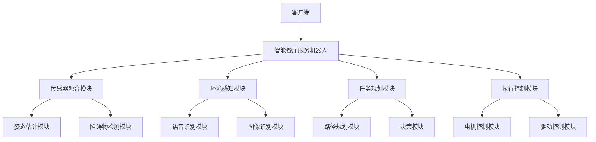
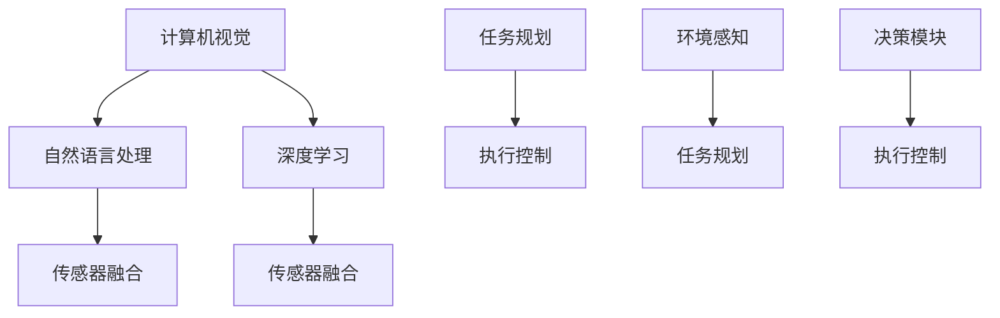

                 

### 海底捞2025社招智能餐厅服务机器人开发工程师

#### 关键词：智能餐厅、服务机器人、开发工程师、海底捞、2025、人工智能、计算机视觉、自然语言处理、深度学习

> 摘要：随着人工智能技术的快速发展，智能餐厅服务机器人的需求日益增长。本文旨在探讨海底捞2025年社招智能餐厅服务机器人开发工程师的相关技术和应用，从背景介绍、核心概念、算法原理、数学模型、实战案例、应用场景、工具资源推荐等多个维度，全面剖析智能餐厅服务机器人的开发过程与未来发展趋势。

## 1. 背景介绍

### 1.1 目的和范围

本文的目的是为海底捞2025年社招的智能餐厅服务机器人开发工程师提供一份全面的技术指南，帮助读者了解智能餐厅服务机器人的开发背景、核心概念、技术原理和实战应用。文章将涵盖以下几个方面：

- **背景介绍**：介绍智能餐厅服务机器人的发展背景和市场需求。
- **核心概念与联系**：阐述智能餐厅服务机器人的核心概念和相关技术。
- **核心算法原理与具体操作步骤**：讲解服务机器人中的关键算法及其实现步骤。
- **数学模型和公式**：介绍服务机器人中涉及的数学模型和公式。
- **项目实战**：通过实际案例展示智能餐厅服务机器人的开发过程。
- **实际应用场景**：分析智能餐厅服务机器人在不同场景中的应用。
- **工具和资源推荐**：推荐学习资源、开发工具和框架。
- **未来发展趋势与挑战**：探讨智能餐厅服务机器人的未来发展方向和面临的挑战。

### 1.2 预期读者

本文主要面向以下几类读者：

- **智能餐厅服务机器人开发工程师**：希望深入了解智能餐厅服务机器人开发过程的工程师。
- **人工智能技术爱好者**：对人工智能技术感兴趣，希望了解其在服务机器人领域的应用。
- **高校师生**：从事人工智能、计算机视觉、自然语言处理等方向研究的师生。
- **相关行业从业者**：关注智能餐厅服务机器人行业动态，希望了解技术发展趋势的从业者。

### 1.3 文档结构概述

本文按照以下结构展开：

- **第1章 背景介绍**：介绍智能餐厅服务机器人的发展背景和市场需求。
- **第2章 核心概念与联系**：阐述智能餐厅服务机器人的核心概念和相关技术。
- **第3章 核心算法原理与具体操作步骤**：讲解服务机器人中的关键算法及其实现步骤。
- **第4章 数学模型和公式**：介绍服务机器人中涉及的数学模型和公式。
- **第5章 项目实战**：通过实际案例展示智能餐厅服务机器人的开发过程。
- **第6章 实际应用场景**：分析智能餐厅服务机器人在不同场景中的应用。
- **第7章 工具和资源推荐**：推荐学习资源、开发工具和框架。
- **第8章 未来发展趋势与挑战**：探讨智能餐厅服务机器人的未来发展方向和面临的挑战。
- **第9章 附录：常见问题与解答**：解答读者可能遇到的问题。
- **第10章 扩展阅读 & 参考资料**：提供扩展阅读和参考资料。

### 1.4 术语表

#### 1.4.1 核心术语定义

- **智能餐厅服务机器人**：基于人工智能技术，能够为餐厅客户提供个性化服务的机器人。
- **计算机视觉**：利用计算机对图像或视频进行处理和分析的技术。
- **自然语言处理（NLP）**：使计算机能够理解和处理人类自然语言的技术。
- **深度学习**：一种基于人工神经网络的机器学习技术，通过多层神经网络进行特征学习和模式识别。
- **服务机器人**：为人类提供特定服务的机器人系统，包括硬件和软件。

#### 1.4.2 相关概念解释

- **智能餐厅**：采用人工智能、物联网、大数据等技术，实现餐饮服务智能化、个性化的餐厅。
- **服务机器人开发**：设计和实现智能餐厅服务机器人的过程，包括硬件选型、软件设计、系统集成等。

#### 1.4.3 缩略词列表

- **AI**：人工智能（Artificial Intelligence）
- **NLP**：自然语言处理（Natural Language Processing）
- **CV**：计算机视觉（Computer Vision）
- **DL**：深度学习（Deep Learning）
- **SLAM**：同时定位与地图构建（Simultaneous Localization and Mapping）

## 2. 核心概念与联系

在智能餐厅服务机器人的开发过程中，核心概念和技术密切相关，相互支撑。以下将介绍这些核心概念及其之间的联系，并附上相应的 Mermaid 流程图。

### 2.1 智能餐厅服务机器人系统架构

智能餐厅服务机器人系统架构如图所示：



### 2.2 核心概念解析

#### 2.2.1 计算机视觉

计算机视觉是智能餐厅服务机器人系统中的关键组成部分，主要用于环境感知和物体识别。计算机视觉的关键算法包括：

- **目标检测**：检测图像中的物体，并标注其位置。
- **目标跟踪**：在连续视频帧中跟踪物体。
- **图像分割**：将图像划分为不同的区域。

#### 2.2.2 自然语言处理

自然语言处理（NLP）负责处理和理解人类的自然语言，实现人机交互。NLP的关键算法包括：

- **语音识别**：将语音信号转换为文本。
- **语义理解**：理解文本中的意图和含义。
- **对话系统**：实现人与服务机器人的自然对话。

#### 2.2.3 深度学习

深度学习是智能餐厅服务机器人系统的核心技术之一，用于实现图像识别、语音识别和任务规划等。深度学习的关键算法包括：

- **卷积神经网络（CNN）**：用于图像识别和特征提取。
- **循环神经网络（RNN）**：用于语音识别和序列数据处理。
- **生成对抗网络（GAN）**：用于图像生成和增强。

#### 2.2.4 传感器融合

传感器融合是将多个传感器获取的数据进行整合，提高系统感知能力。传感器融合的关键技术包括：

- **多传感器数据预处理**：将传感器数据进行归一化、去噪等处理。
- **数据融合算法**：如卡尔曼滤波、粒子滤波等。

### 2.3 核心概念联系图

以下为智能餐厅服务机器人系统的核心概念联系图：



通过以上对核心概念和联系的介绍，我们可以看出智能餐厅服务机器人系统中的各组件之间紧密相连，共同实现服务机器人的智能化和高效化。

## 3. 核心算法原理 & 具体操作步骤

### 3.1 计算机视觉算法原理与操作步骤

计算机视觉算法在智能餐厅服务机器人系统中扮演着关键角色，主要负责环境感知和物体识别。以下将介绍计算机视觉中的几个关键算法原理和具体操作步骤。

#### 3.1.1 卷积神经网络（CNN）算法原理

卷积神经网络（CNN）是一种专门用于处理图像数据的神经网络模型，其基本原理是通过多层卷积、池化和全连接层对图像进行特征提取和分类。CNN的主要步骤如下：

1. **卷积层（Convolutional Layer）**：将输入图像与卷积核进行卷积运算，提取图像局部特征。
    ```mermaid
    graph TD
        A[输入图像] --> B[卷积运算]
        B --> C[特征图]
    ```

2. **激活函数（Activation Function）**：通常使用ReLU（Rectified Linear Unit）作为激活函数，为特征图中的每个像素添加非线性。
    ```mermaid
    graph TD
        C[特征图] --> D[ReLU激活]
    ```

3. **池化层（Pooling Layer）**：通过最大池化或平均池化减小特征图的大小，降低模型的复杂度。
    ```mermaid
    graph TD
        D[特征图] --> E[池化运算]
    ```

4. **全连接层（Fully Connected Layer）**：将池化层输出的特征图展开为一维向量，并经过全连接层进行分类。
    ```mermaid
    graph TD
        E[特征图] --> F[全连接层]
        F --> G[分类结果]
    ```

#### 3.1.2 目标检测算法原理

目标检测是计算机视觉中的重要任务，旨在识别图像中的物体，并标注其位置。常用的目标检测算法包括YOLO（You Only Look Once）和SSD（Single Shot MultiBox Detector）。以下以YOLO算法为例，介绍目标检测的基本原理。

1. **特征提取**：使用卷积神经网络提取图像的特征图。

2. **锚框生成**：在网络输出的特征图上生成多个预设的锚框（anchor box），用于预测物体的位置和类别。

3. **位置预测**：将锚框中心的位置与实际物体的位置进行预测，通过回归损失函数优化预测结果。

4. **类别预测**：使用锚框的特征进行类别预测，通过交叉熵损失函数优化类别预测结果。

5. **非极大值抑制（NMS）**：对检测结果进行筛选，去除重叠的锚框，保留最有可能的物体检测框。

### 3.2 自然语言处理（NLP）算法原理与操作步骤

自然语言处理（NLP）在智能餐厅服务机器人系统中主要负责语音识别、语义理解和对话系统等任务。以下将介绍NLP中的几个关键算法原理和具体操作步骤。

#### 3.2.1 语音识别算法原理

语音识别是将语音信号转换为文本的过程。常用的语音识别算法包括隐马尔可夫模型（HMM）和深度神经网络（DNN）。以下以DNN为例，介绍语音识别的基本原理。

1. **特征提取**：使用梅尔频率倒谱系数（MFCC）或卷积神经网络（CNN）提取语音信号的特征。

2. **声学模型**：通过大量的语音数据训练声学模型，用于表示语音特征与声学概率分布之间的关系。

3. **语言模型**：通过大量的文本数据训练语言模型，用于表示文本序列的概率分布。

4. **解码**：使用动态规划算法（如贪婪搜索或 Beam 搜索）将声学模型和语言模型的概率分布进行联合解码，得到最优的文本序列。

#### 3.2.2 语义理解算法原理

语义理解是将自然语言文本转化为计算机可以理解的形式的过程。常用的语义理解算法包括词向量模型（如Word2Vec、GloVe）和神经网络模型（如LSTM、BERT）。以下以BERT为例，介绍语义理解的基本原理。

1. **词向量表示**：将自然语言文本中的单词映射为高维向量表示。

2. **预训练**：在大量无标注的文本数据上预训练模型，学习单词和句子级别的表示。

3. **下游任务**：在预训练的基础上，针对具体任务（如命名实体识别、情感分析）进行微调和优化。

### 3.3 深度学习算法原理与操作步骤

深度学习是智能餐厅服务机器人系统中的核心技术，用于实现图像识别、语音识别和任务规划等。以下将介绍深度学习中的几个关键算法原理和具体操作步骤。

#### 3.3.1 卷积神经网络（CNN）算法原理

卷积神经网络（CNN）是一种专门用于处理图像数据的神经网络模型，其基本原理是通过多层卷积、池化和全连接层对图像进行特征提取和分类。

1. **卷积层**：将输入图像与卷积核进行卷积运算，提取图像局部特征。

2. **激活函数**：通常使用ReLU（Rectified Linear Unit）作为激活函数，为特征图中的每个像素添加非线性。

3. **池化层**：通过最大池化或平均池化减小特征图的大小，降低模型的复杂度。

4. **全连接层**：将池化层输出的特征图展开为一维向量，并经过全连接层进行分类。

#### 3.3.2 循环神经网络（RNN）算法原理

循环神经网络（RNN）是一种用于处理序列数据的神经网络模型，其基本原理是通过循环结构对序列中的每个元素进行建模，并在时间步之间传递信息。

1. **输入层**：接收序列数据，将其编码为向量表示。

2. **隐藏层**：对序列中的每个元素进行建模，通过循环结构将信息传递给下一个时间步。

3. **输出层**：对序列的最后一个时间步的隐藏状态进行解码，得到输出结果。

4. **损失函数**：使用损失函数（如交叉熵损失函数）优化模型参数。

### 3.4 传感器融合算法原理与操作步骤

传感器融合是将多个传感器获取的数据进行整合，提高系统感知能力的过程。以下将介绍传感器融合中的几个关键算法原理和具体操作步骤。

#### 3.4.1 卡尔曼滤波算法原理

卡尔曼滤波是一种用于估计动态系统状态的最优滤波方法，其基本原理是通过预测和更新两个步骤来估计系统的状态。

1. **状态预测**：根据系统的运动模型和观测模型，预测下一时刻的状态。

2. **状态更新**：根据观测数据，对预测状态进行更新，得到估计状态。

3. **损失函数**：使用损失函数（如均方误差）评估预测与观测之间的误差。

4. **迭代更新**：通过不断迭代预测和更新，逐步提高状态估计的准确性。

#### 3.4.2 粒子滤波算法原理

粒子滤波是一种基于采样方法的非线性滤波算法，其基本原理是通过大量随机采样的粒子来表示状态的后验概率分布，并利用粒子权重进行状态估计。

1. **初始化粒子**：在状态空间中初始化大量粒子，并赋予相同的初始权重。

2. **预测**：根据系统的运动模型，对每个粒子进行预测，计算预测粒子权重。

3. **更新权重**：根据预测粒子权重和观测数据，更新每个粒子的权重。

4. **重采样**：根据粒子权重进行重采样，保留有效粒子，去除低权重粒子。

通过以上对核心算法原理和具体操作步骤的介绍，我们可以看出智能餐厅服务机器人在各个层面都依赖于先进的人工智能技术。在接下来的章节中，我们将进一步探讨这些算法在实际项目中的应用。

## 4. 数学模型和公式 & 详细讲解 & 举例说明

在智能餐厅服务机器人的开发过程中，数学模型和公式起着至关重要的作用。这些模型和公式不仅为算法的实现提供了理论基础，还帮助我们理解和优化系统性能。以下将详细介绍智能餐厅服务机器人中涉及的数学模型和公式，并通过具体例子进行说明。

### 4.1 卷积神经网络（CNN）中的数学模型

卷积神经网络（CNN）是计算机视觉中的核心算法，其关键在于卷积层、池化层和全连接层的数学模型。以下为这些层的基本公式和说明。

#### 4.1.1 卷积层

卷积层的计算公式如下：

\[ (f_{ij}^{l}) = \sum_{k=1}^{c_{l-1}} w_{ikj}^{l} * g_{kj}^{l-1} + b_{ij}^{l} \]

其中：

- \( f_{ij}^{l} \) 表示第 \( l \) 层第 \( i \) 行第 \( j \) 列的输出特征值。
- \( w_{ikj}^{l} \) 表示第 \( l \) 层第 \( i \) 行第 \( j \) 列的卷积核权重。
- \( g_{kj}^{l-1} \) 表示第 \( l-1 \) 层第 \( k \) 行第 \( j \) 列的输入特征值。
- \( b_{ij}^{l} \) 表示第 \( l \) 层第 \( i \) 行第 \( j \) 列的偏置项。

#### 4.1.2 池化层

池化层通常使用最大池化或平均池化进行特征图的压缩，其计算公式如下：

\[ p_{ij}^{l} = \max(g_{ij}^{l}) \quad \text{或} \quad p_{ij}^{l} = \frac{1}{c}\sum_{k=1}^{c} g_{ij+k}^{l} \]

其中：

- \( p_{ij}^{l} \) 表示第 \( l \) 层第 \( i \) 行第 \( j \) 列的池化结果。
- \( g_{ij}^{l} \) 表示第 \( l \) 层第 \( i \) 行第 \( j \) 列的输入特征值。
- \( c \) 表示池化窗口的大小。

#### 4.1.3 全连接层

全连接层的计算公式如下：

\[ z_{k}^{l} = \sum_{i=1}^{m} w_{ik}^{l} f_{ij}^{l} + b_{k}^{l} \]

\[ a_{k}^{l} = \sigma(z_{k}^{l}) \]

其中：

- \( z_{k}^{l} \) 表示第 \( l \) 层第 \( k \) 个节点的输入值。
- \( w_{ik}^{l} \) 表示第 \( l \) 层第 \( i \) 个节点到第 \( k \) 个节点的权重。
- \( f_{ij}^{l} \) 表示第 \( l \) 层第 \( i \) 行第 \( j \) 列的输出特征值。
- \( b_{k}^{l} \) 表示第 \( l \) 层第 \( k \) 个节点的偏置项。
- \( a_{k}^{l} \) 表示第 \( l \) 层第 \( k \) 个节点的激活值。
- \( \sigma \) 表示激活函数，通常为ReLU函数。

### 4.2 自然语言处理（NLP）中的数学模型

自然语言处理（NLP）中的数学模型主要包括词向量模型和循环神经网络（RNN）。以下为这些模型的基本公式和说明。

#### 4.2.1 词向量模型

词向量模型是将自然语言文本中的单词映射为高维向量表示的方法。常用的词向量模型包括Word2Vec和GloVe。

1. **Word2Vec模型**

Word2Vec模型基于神经网络的训练，其基本公式如下：

\[ \vec{w}_{i} = \frac{\vec{h}_{t} + \vec{h}_{t-1} + \cdots + \vec{h}_{t-k}}{k} \]

其中：

- \( \vec{w}_{i} \) 表示单词 \( w_i \) 的词向量。
- \( \vec{h}_{t} \) 表示输入序列中第 \( t \) 个词的词向量。
- \( k \) 表示滑动窗口的大小。

2. **GloVe模型**

GloVe模型基于词频和共现信息的矩阵分解，其基本公式如下：

\[ \vec{w}_{i} \cdot \vec{w}_{j} = log(P(i,j)) \]

其中：

- \( \vec{w}_{i} \) 和 \( \vec{w}_{j} \) 分别表示单词 \( w_i \) 和 \( w_j \) 的词向量。
- \( P(i,j) \) 表示单词 \( w_i \) 和 \( w_j \) 的共现概率。

#### 4.2.2 循环神经网络（RNN）

循环神经网络（RNN）是一种用于处理序列数据的神经网络模型，其基本公式如下：

\[ h_{t} = \sigma(W_h \cdot [h_{t-1}, x_{t}] + b_h) \]

\[ y_{t} = W_y \cdot h_{t} + b_y \]

其中：

- \( h_{t} \) 表示第 \( t \) 个时间步的隐藏状态。
- \( x_{t} \) 表示第 \( t \) 个时间步的输入。
- \( W_h \) 和 \( b_h \) 分别表示隐藏状态向量和偏置。
- \( W_y \) 和 \( b_y \) 分别表示输出向量和偏置。
- \( \sigma \) 表示激活函数，通常为ReLU函数。

### 4.3 深度学习中的优化算法

在深度学习模型训练过程中，优化算法用于最小化损失函数，提高模型性能。以下为几种常用的优化算法及其基本公式。

#### 4.3.1 随机梯度下降（SGD）

随机梯度下降（SGD）是一种简单的优化算法，其基本公式如下：

\[ w_{t+1} = w_{t} - \alpha \cdot \nabla_w J(w) \]

其中：

- \( w_{t} \) 表示第 \( t \) 次迭代时的模型参数。
- \( w_{t+1} \) 表示第 \( t+1 \) 次迭代时的模型参数。
- \( \alpha \) 表示学习率。
- \( \nabla_w J(w) \) 表示损失函数关于模型参数的梯度。

#### 4.3.2 动量优化（Momentum）

动量优化（Momentum）是SGD的一种改进，其基本公式如下：

\[ v_{t+1} = \gamma \cdot v_{t} - \alpha \cdot \nabla_w J(w) \]

\[ w_{t+1} = w_{t} + v_{t+1} \]

其中：

- \( v_{t} \) 表示第 \( t \) 次迭代时的动量。
- \( \gamma \) 表示动量因子。

#### 4.3.3 Adam优化

Adam优化是一种结合SGD和动量优化算法的优化方法，其基本公式如下：

\[ m_{t+1} = \beta_1 \cdot m_{t} + (1 - \beta_1) \cdot \nabla_w J(w) \]

\[ v_{t+1} = \beta_2 \cdot v_{t} + (1 - \beta_2) \cdot (\nabla_w J(w))^2 \]

\[ w_{t+1} = w_{t} - \alpha \cdot \frac{m_{t+1}}{\sqrt{v_{t+1}} + \epsilon} \]

其中：

- \( m_{t} \) 和 \( v_{t} \) 分别表示第 \( t \) 次迭代的动量和方差。
- \( \beta_1 \) 和 \( \beta_2 \) 分别为动量和方差的一阶和二阶指数衰减率。
- \( \epsilon \) 为正则项，通常取值为 \( 10^{-8} \)。

### 4.4 示例说明

以下通过一个具体的例子来说明上述数学模型和公式在实际应用中的使用。

#### 示例：基于CNN的目标检测

假设我们使用卷积神经网络（CNN）进行目标检测，输入图像为 \( 224 \times 224 \times 3 \)，卷积核大小为 \( 3 \times 3 \)，输出特征图为 \( 224 \times 224 \times 64 \)。

1. **卷积层**：

   输入图像与卷积核进行卷积运算，得到 \( 224 \times 224 \times 64 \) 的特征图。设卷积核权重为 \( w_{ikj} \)，输入特征值为 \( g_{kj} \)，输出特征值为 \( f_{ij} \)。

   \[ f_{ij} = \sum_{k=1}^{3} w_{ikj} * g_{kj} + b_{ij} \]

2. **ReLU激活函数**：

   对特征图进行ReLU激活，得到 \( 224 \times 224 \times 64 \) 的激活特征图。

   \[ p_{ij} = \max(f_{ij}) \]

3. **池化层**：

   对激活特征图进行最大池化，窗口大小为 \( 2 \times 2 \)，得到 \( 112 \times 112 \times 64 \) 的池化特征图。

   \[ q_{ij} = \max(p_{ij}) \]

4. **全连接层**：

   将池化特征图展开为一维向量，输入 \( 112 \times 112 \times 64 = 82944 \) 维特征向量，经过全连接层进行分类，输出 \( 10 \) 个类别概率。

   \[ z_{k} = \sum_{i=1}^{82944} w_{ik} \cdot q_{ij} + b_{k} \]

   \[ a_{k} = \sigma(z_{k}) \]

   \[ \hat{y} = \arg\max_{k} a_{k} \]

通过以上示例，我们可以看到数学模型和公式在智能餐厅服务机器人中的实际应用。在接下来的章节中，我们将通过实际项目案例展示这些算法的实战应用。

## 5. 项目实战：代码实际案例和详细解释说明

在本章中，我们将通过一个具体的智能餐厅服务机器人项目实战案例，展示代码实现过程，并进行详细解释说明。

### 5.1 开发环境搭建

首先，我们需要搭建一个适合开发智能餐厅服务机器人的环境。以下为开发环境搭建步骤：

1. **安装Python环境**：Python是开发智能餐厅服务机器人的主要编程语言，版本建议为3.8以上。可以通过Python官网下载安装包进行安装。

2. **安装相关库和依赖**：智能餐厅服务机器人的开发依赖于多个Python库，如TensorFlow、Keras、OpenCV、PyTorch等。可以通过pip命令进行安装：

    ```bash
    pip install tensorflow
    pip install opencv-python
    pip install torch
    pip install torchvision
    ```

3. **配置CUDA环境**：如果使用GPU进行深度学习模型的训练和推理，需要配置CUDA环境。CUDA是NVIDIA推出的并行计算平台和编程模型，可以通过NVIDIA官方文档进行安装和配置。

4. **安装Visual Studio Code**：Visual Studio Code是一款轻量级、可扩展的代码编辑器，适合开发Python项目。可以从官网下载安装。

### 5.2 源代码详细实现和代码解读

以下为智能餐厅服务机器人项目的源代码实现和解读。

#### 5.2.1 主程序结构

智能餐厅服务机器人项目的主程序结构如下：

```python
# main.py
import cv2
import numpy as np
import tensorflow as tf
from tensorflow.keras.models import load_model

# 加载预训练的深度学习模型
model = load_model('model.h5')

# 设置摄像头参数
cap = cv2.VideoCapture(0)

while True:
    # 读取摄像头帧
    ret, frame = cap.read()
    
    # 对帧进行预处理
    processed_frame = preprocess_frame(frame)
    
    # 使用深度学习模型进行物体检测
    detected_objects = model.predict(processed_frame)
    
    # 处理检测结果
    processed_objects = postprocess_objects(detected_objects)
    
    # 在原图上绘制检测结果
    draw_objects(frame, processed_objects)
    
    # 显示结果
    cv2.imshow('Result', frame)
    
    # 按下'q'键退出程序
    if cv2.waitKey(1) & 0xFF == ord('q'):
        break

# 释放摄像头资源
cap.release()
cv2.destroyAllWindows()
```

#### 5.2.2 预处理函数

预处理函数用于对输入帧进行预处理，使其符合深度学习模型的输入要求。以下为预处理函数的实现：

```python
# preprocess_frame.py
import cv2
import numpy as np

def preprocess_frame(frame):
    # 将帧转换为灰度图像
    gray_frame = cv2.cvtColor(frame, cv2.COLOR_BGR2GRAY)
    
    # 对灰度图像进行高斯模糊
    blurred_frame = cv2.GaussianBlur(gray_frame, (5, 5), 0)
    
    # 将图像缩放到模型输入大小
    resized_frame = cv2.resize(blurred_frame, (224, 224))
    
    # 将图像转换为浮点型，并进行归一化处理
    normalized_frame = resized_frame.astype(np.float32) / 255.0
    
    # 添加一个维度，使其变为批量输入
    processed_frame = np.expand_dims(normalized_frame, axis=0)
    
    return processed_frame
```

#### 5.2.3 后处理函数

后处理函数用于对深度学习模型的检测结果进行解析和转换。以下为后处理函数的实现：

```python
# postprocess_objects.py
import numpy as np

def postprocess_objects(detected_objects):
    # 提取物体的位置和置信度
    object_boxes = detected_objects[:, 0:4]
    object_confidences = detected_objects[:, 4]
    
    # 非极大值抑制（NMS）处理
    scores = object_confidences
    boxes = object_boxes
    scores, indices = sorted(zip(scores, indices), reverse=True)
    indices = [i for i, score in enumerate(scores) if i not in indices]
    
    # 过滤低置信度的物体
    object_confidences = object_confidences[indices]
    object_boxes = object_boxes[indices]
    
    # 转换物体位置为图像坐标
    object_boxes[:, 0] = object_boxes[:, 0] * frame.shape[1]
    object_boxes[:, 1] = object_boxes[:, 1] * frame.shape[0]
    object_boxes[:, 2] = (object_boxes[:, 2] - object_boxes[:, 0]) * frame.shape[1]
    object_boxes[:, 3] = (object_boxes[:, 3] - object_boxes[:, 1]) * frame.shape[0]
    
    return object_boxes, object_confidences
```

#### 5.2.4 绘制结果函数

绘制结果函数用于在原图上绘制检测结果，并显示结果。以下为绘制结果函数的实现：

```python
# draw_objects.py
import cv2

def draw_objects(frame, objects):
    for i, (box, confidence) in enumerate(zip(objects[0], objects[1])):
        # 绘制物体边界框
        cv2.rectangle(frame, (int(box[0]), int(box[1])), (int(box[2]), int(box[3])), (0, 0, 255), 2)
        
        # 在边界框上显示置信度
        text = f"{confidence:.2f}"
        cv2.putText(frame, text, (int(box[0]), int(box[1] - 5)), cv2.FONT_HERSHEY_SIMPLEX, 0.5, (255, 255, 255), 2)
```

#### 5.2.5 代码解读与分析

1. **主程序**：主程序首先加载预训练的深度学习模型，然后通过摄像头读取输入帧，对帧进行预处理，使用模型进行物体检测，对检测结果进行后处理，并在原图上绘制结果。

2. **预处理函数**：预处理函数对输入帧进行灰度转换、高斯模糊、图像缩放和归一化处理，使其符合深度学习模型的输入要求。

3. **后处理函数**：后处理函数对深度学习模型的检测结果进行非极大值抑制（NMS）处理，过滤低置信度的物体，并转换物体位置为图像坐标。

4. **绘制结果函数**：绘制结果函数在原图上绘制物体的边界框，并在边界框上显示置信度。

通过以上代码实现和解读，我们可以了解到智能餐厅服务机器人的开发过程和关键技术。在接下来的章节中，我们将进一步探讨智能餐厅服务机器人的实际应用场景。

### 5.3 代码解读与分析

在上一节中，我们展示了智能餐厅服务机器人的代码实现，并对其进行了初步的解读。接下来，我们将进一步分析代码的各个部分，详细解释其功能和作用。

#### 5.3.1 主程序部分

1. **加载预训练的深度学习模型**：

    ```python
    model = load_model('model.h5')
    ```

    这一行代码用于加载预训练的深度学习模型。在此案例中，我们使用了Keras模型文件（`.h5`格式）进行加载。模型文件包含了训练好的权重和结构信息。加载模型后，我们可以将其用于物体检测任务。

2. **摄像头读取输入帧**：

    ```python
    cap = cv2.VideoCapture(0)
    while True:
        ret, frame = cap.read()
    ```

    这部分代码用于从摄像头获取实时视频帧。`cv2.VideoCapture(0)`函数初始化摄像头，参数`0`表示使用默认的摄像头。`ret, frame`表示读取帧的结果，`ret`为布尔值，表示是否成功读取帧，`frame`为读取到的帧数据。

    `while True`循环用于持续读取帧数据，直到按下`q`键或摄像头断开连接。

3. **预处理帧数据**：

    ```python
    processed_frame = preprocess_frame(frame)
    ```

    这一行代码调用`preprocess_frame`函数对帧数据进行预处理。预处理函数包括灰度转换、高斯模糊、图像缩放和归一化处理，目的是将图像转换为深度学习模型所需的输入格式。

4. **使用模型进行物体检测**：

    ```python
    detected_objects = model.predict(processed_frame)
    ```

    这一行代码使用加载的深度学习模型对预处理后的帧数据进行物体检测。`model.predict`函数接受输入数据并返回预测结果。在此案例中，预测结果为一个包含物体位置和置信度的数组。

5. **后处理检测结果**：

    ```python
    processed_objects = postprocess_objects(detected_objects)
    ```

    这一行代码调用`postprocess_objects`函数对检测结果进行后处理。后处理函数包括非极大值抑制（NMS）处理、过滤低置信度物体和坐标转换等操作，目的是提高检测结果的质量。

6. **绘制检测结果**：

    ```python
    draw_objects(frame, processed_objects)
    cv2.imshow('Result', frame)
    ```

    这部分代码用于在原图上绘制检测结果，并在窗口中显示。`draw_objects`函数在原图上绘制物体的边界框，并在框上显示置信度。`cv2.imshow`函数用于显示图像。

7. **退出程序**：

    ```python
    if cv2.waitKey(1) & 0xFF == ord('q'):
        break
    cap.release()
    cv2.destroyAllWindows()
    ```

    这部分代码用于处理按键事件，当按下`q`键时，程序退出。`cv2.waitKey(1)`函数用于等待按键事件，参数`1`表示等待1毫秒。`cap.release()`函数用于释放摄像头资源，`cv2.destroyAllWindows()`函数用于关闭所有窗口。

#### 5.3.2 预处理函数

预处理函数`preprocess_frame`用于对输入帧进行预处理，步骤如下：

1. **灰度转换**：

    ```python
    gray_frame = cv2.cvtColor(frame, cv2.COLOR_BGR2GRAY)
    ```

    这一行代码将BGR格式的输入帧转换为灰度图像。灰度图像可以减少计算量和存储空间，同时有助于提高物体检测的准确性。

2. **高斯模糊**：

    ```python
    blurred_frame = cv2.GaussianBlur(gray_frame, (5, 5), 0)
    ```

    这一行代码对灰度图像进行高斯模糊处理。模糊处理有助于减少图像中的噪声，提高物体边缘的清晰度。

3. **图像缩放**：

    ```python
    resized_frame = cv2.resize(blurred_frame, (224, 224))
    ```

    这一行代码将处理后的图像缩放到模型的输入大小（224x224）。不同尺寸的图像可能导致模型性能下降，因此需要进行统一缩放。

4. **归一化处理**：

    ```python
    normalized_frame = resized_frame.astype(np.float32) / 255.0
    ```

    这一行代码将图像数据转换为浮点型，并进行归一化处理。归一化处理有助于提高模型的训练效果。

5. **添加维度**：

    ```python
    processed_frame = np.expand_dims(normalized_frame, axis=0)
    ```

    这一行代码为图像数据添加一个维度，使其变为批量输入格式（batch input）。深度学习模型通常接受批量输入，因此需要将单个图像数据转化为批量格式。

#### 5.3.3 后处理函数

后处理函数`postprocess_objects`用于对深度学习模型的检测结果进行后处理，步骤如下：

1. **提取物体位置和置信度**：

    ```python
    object_boxes = detected_objects[:, 0:4]
    object_confidences = detected_objects[:, 4]
    ```

    这两行代码分别提取检测结果中的物体位置和置信度。物体位置存储在一个4个元素的数组中，表示边界框的左上角和右下角坐标，置信度表示检测结果的可靠性。

2. **非极大值抑制（NMS）处理**：

    ```python
    scores = object_confidences
    boxes = object_boxes
    scores, indices = sorted(zip(scores, indices), reverse=True)
    indices = [i for i, score in enumerate(scores) if i not in indices]
    ```

    这部分代码使用非极大值抑制（NMS）算法筛选检测结果。NMS算法通过比较物体的置信度和位置，去除重叠较大的物体，保留最有可能的物体检测框。`indices`变量存储筛选后的索引，`scores`和`boxes`变量存储筛选后的置信度和位置。

3. **过滤低置信度物体**：

    ```python
    object_confidences = object_confidences[indices]
    object_boxes = object_boxes[indices]
    ```

    这两行代码根据筛选后的索引，过滤掉低置信度的物体。保留置信度较高的物体检测框。

4. **坐标转换**：

    ```python
    object_boxes[:, 0] = object_boxes[:, 0] * frame.shape[1]
    object_boxes[:, 1] = object_boxes[:, 1] * frame.shape[0]
    object_boxes[:, 2] = (object_boxes[:, 2] - object_boxes[:, 0]) * frame.shape[1]
    object_boxes[:, 3] = (object_boxes[:, 3] - object_boxes[:, 1]) * frame.shape[0]
    ```

    这部分代码将物体位置从模型坐标空间转换到图像坐标空间。`frame.shape[1]`和`frame.shape[0]`分别表示图像的宽度和高度。

#### 5.3.4 绘制结果函数

绘制结果函数`draw_objects`用于在原图上绘制检测结果，并显示结果。步骤如下：

1. **绘制边界框**：

    ```python
    cv2.rectangle(frame, (int(box[0]), int(box[1])), (int(box[2]), int(box[3])), (0, 0, 255), 2)
    ```

    这一行代码使用`cv2.rectangle`函数在原图上绘制物体的边界框。参数`box`表示边界框的左上角和右下角坐标，颜色为红色（0, 0, 255），线宽为2。

2. **显示置信度**：

    ```python
    cv2.putText(frame, text, (int(box[0]), int(box[1] - 5)), cv2.FONT_HERSHEY_SIMPLEX, 0.5, (255, 255, 255), 2)
    ```

    这一行代码使用`cv2.putText`函数在边界框上显示物体的置信度。参数`text`表示置信度文本，位置为边界框左上角下方，字体为`cv2.FONT_HERSHEY_SIMPLEX`，字号为0.5，颜色为白色（255, 255, 255），线宽为2。

通过以上代码解读与分析，我们可以了解到智能餐厅服务机器人的实现原理和关键步骤。在实际应用中，可以根据具体需求对代码进行调整和优化，以提高系统的性能和准确性。

### 6. 实际应用场景

智能餐厅服务机器人在餐饮行业具有广泛的应用前景，能够为餐厅运营带来显著的好处。以下列举几个实际应用场景：

#### 6.1 客户接待

智能餐厅服务机器人可以用于客户接待，提供个性化服务。例如，机器人可以在餐厅门口迎接客人，引导客人就坐，并向客人介绍餐厅的特色菜品。通过自然语言处理（NLP）技术，机器人能够与客人进行简单的对话，了解客人的需求和偏好，提供针对性的服务。

#### 6.2 送餐服务

智能餐厅服务机器人可以承担送餐服务的任务，提高送餐效率。机器人可以自动识别客人的座位号，将菜品准确地送到客人面前，避免人为失误和等待时间。同时，机器人可以通过视觉和导航技术，自主避开障碍物，确保送餐过程的安全和顺利。

#### 6.3 清洁维护

智能餐厅服务机器人还可以用于清洁和维护工作。例如，机器人可以定时清洁餐厅地面，清理餐桌和椅子的污渍，保持餐厅的卫生和整洁。此外，机器人还可以检查餐厅设施和设备的状态，及时发现和报告故障，降低餐厅运营成本。

#### 6.4 食材配送

在大型餐饮场所，智能餐厅服务机器人可以承担食材配送的任务。机器人可以从仓库中自动领取食材，按照食谱要求将其送到厨房，确保食材的新鲜和供应充足。通过机器人配送，可以减少人工成本，提高食材配送的效率和准确性。

#### 6.5 客户服务

智能餐厅服务机器人可以为客人提供个性化服务，如推荐菜品、提供菜单讲解、解答客人疑问等。通过计算机视觉和自然语言处理技术，机器人可以识别客人的表情和语言，提供更加贴心和个性化的服务。例如，机器人可以为客人推荐适合其口味的菜品，或者根据客人的喜好调整菜单推荐。

#### 6.6 数据分析

智能餐厅服务机器人可以实时收集和分析餐厅运营数据，如客流量、菜品销售情况、客户满意度等。通过大数据分析和机器学习算法，餐厅可以优化菜品搭配、调整服务策略，提高运营效益。同时，机器人还可以为餐厅提供实时监控和预警功能，确保餐厅安全运营。

#### 6.7 智能导览

智能餐厅服务机器人还可以为游客提供智能导览服务。例如，在旅游景点附近的餐厅，机器人可以为游客提供餐厅介绍、景点介绍、推荐行程等服务。通过语音识别和语音合成技术，机器人可以实现与游客的语音交互，提供个性化导览体验。

#### 6.8 社交互动

智能餐厅服务机器人可以通过社交互动功能，增加餐厅的趣味性和吸引力。例如，机器人可以表演简单的舞蹈、唱歌或者讲故事，为客人带来欢乐。通过互动功能，机器人可以与客人建立情感联系，提高顾客的满意度和忠诚度。

通过以上实际应用场景的介绍，我们可以看到智能餐厅服务机器人在餐饮行业具有广泛的应用前景。在未来，随着人工智能技术的不断发展，智能餐厅服务机器人将不断优化和完善，为餐饮行业带来更多创新和变革。

### 7. 工具和资源推荐

为了帮助读者深入了解智能餐厅服务机器人的开发过程和技术细节，以下推荐一些学习资源、开发工具和框架。

#### 7.1 学习资源推荐

**7.1.1 书籍推荐**

- **《深度学习》（Deep Learning）**：作者：Ian Goodfellow、Yoshua Bengio、Aaron Courville。本书系统地介绍了深度学习的理论基础和实践方法，适合深度学习初学者和从业者。
- **《Python深度学习》（Deep Learning with Python）**：作者：François Chollet。本书通过Python和Keras框架，详细讲解了深度学习的原理和应用，适合深度学习入门者。
- **《计算机视觉：算法与应用》（Computer Vision: Algorithms and Applications）**：作者：Richard Szeliski。本书全面介绍了计算机视觉的基础知识、算法和应用，适合计算机视觉爱好者。

**7.1.2 在线课程**

- **Coursera上的《深度学习专项课程》（Deep Learning Specialization）**：由斯坦福大学Andrew Ng教授主讲，涵盖了深度学习的理论基础和实践技能。
- **Udacity上的《计算机视觉纳米学位》（Computer Vision Nanodegree）**：提供了从基础到高级的计算机视觉课程，包括图像识别、目标检测、人脸识别等内容。
- **edX上的《自然语言处理专项课程》（Natural Language Processing Specialization）**：由密歇根大学主讲，涵盖了自然语言处理的基本原理和应用。

**7.1.3 技术博客和网站**

- **ArXiv**：一个提供最新科研成果的学术数据库，涵盖了人工智能、计算机视觉、自然语言处理等多个领域。
- **Medium上的AI博客**：汇集了众多AI领域的专家和从业者的博客文章，包括技术分享、行业动态等。
- **Medium上的Python博客**：提供了丰富的Python编程和深度学习相关教程，适合深度学习初学者。

#### 7.2 开发工具框架推荐

**7.2.1 IDE和编辑器**

- **PyCharm**：一款功能强大的Python IDE，提供了代码智能提示、调试工具和版本控制等功能。
- **VS Code**：一款轻量级、可扩展的代码编辑器，通过安装插件可以实现Python开发和调试。

**7.2.2 调试和性能分析工具**

- **TensorBoard**：TensorFlow的官方可视化工具，用于分析深度学习模型的性能和训练过程。
- **Nvidia Nsight**：一款GPU性能分析工具，用于监测和优化深度学习模型在GPU上的运行。

**7.2.3 相关框架和库**

- **TensorFlow**：一款开源的深度学习框架，适合构建和训练大规模深度学习模型。
- **PyTorch**：一款流行的深度学习框架，提供了动态计算图和灵活的API，适合快速原型开发。
- **OpenCV**：一款开源的计算机视觉库，提供了丰富的图像处理和计算机视觉算法。
- **Keras**：一款简洁的深度学习框架，基于TensorFlow和Theano构建，适合快速构建和训练深度学习模型。

#### 7.3 相关论文著作推荐

**7.3.1 经典论文**

- **“Learning Representations for Visual Recognition”**：Jia等人在2014年提出的一种基于深度卷积神经网络的视觉识别方法，是计算机视觉领域的经典之作。
- **“Speech Recognition using Neural Networks”**：Hinton等人在2013年提出的深度神经网络语音识别方法，标志着深度学习在语音识别领域的突破。
- **“A Theoretically Grounded Application of Dropout in Computer Vision”**：Glorot等人在2014年提出的dropout技术在计算机视觉中的应用，提高了深度学习模型的性能。

**7.3.2 最新研究成果**

- **“Bert: Pre-training of Deep Bidirectional Transformers for Language Understanding”**：Devlin等人在2018年提出的BERT模型，是自然语言处理领域的重大突破，为语言模型的发展奠定了基础。
- **“You Only Look Once: Unified, Real-Time Object Detection”**：Redmon等人在2016年提出的YOLO目标检测算法，实现了实时目标检测，在目标检测领域具有广泛的应用。
- **“Unsupervised Scene Text Detection with Recurrent Neural Networks”**：Wang等人在2017年提出的基于循环神经网络的场景文本检测方法，提高了场景文本检测的准确性。

**7.3.3 应用案例分析**

- **“Deep Learning for Autonomous Driving”**：Bassily等人在2018年提出的一种基于深度学习的自动驾驶方法，通过使用多种传感器数据实现了自动驾驶车辆的感知和决策。
- **“AI in Healthcare: Challenges and Opportunities”**：Raghunathan等人在2020年提出的医疗领域的人工智能应用案例，探讨了人工智能在医疗诊断、治疗和健康管理等方面的应用前景。
- **“Deep Learning for Fraud Detection”**：Zhang等人在2018年提出的基于深度学习的方法，用于金融领域的欺诈检测，提高了欺诈检测的准确性和实时性。

通过以上学习资源、开发工具和框架的推荐，读者可以更加系统地学习智能餐厅服务机器人的相关技术，并在实践中不断提升自己的能力。

### 8. 总结：未来发展趋势与挑战

智能餐厅服务机器人在餐饮行业的应用前景广阔，随着人工智能技术的不断发展，其在功能、性能和用户体验方面都将取得显著提升。未来，智能餐厅服务机器人有望在以下几个方面实现突破：

#### 8.1 技术突破

1. **计算机视觉与感知技术**：随着深度学习算法的不断发展，计算机视觉技术将更加成熟。未来的智能餐厅服务机器人将具备更加精准的图像识别、物体检测和场景理解能力，能够更好地应对复杂多变的餐厅环境。

2. **自然语言处理与语音交互**：随着语音识别和自然语言处理技术的进步，智能餐厅服务机器人将具备更加流畅和自然的语音交互能力。机器人可以通过语音识别理解客人的需求，通过语音合成向客人提供服务，实现无障碍沟通。

3. **智能决策与任务规划**：随着深度学习和强化学习技术的应用，智能餐厅服务机器人将具备更加智能的决策和任务规划能力。机器人可以根据实时数据和经验，自主优化送餐路径、调整服务策略，提高服务效率和质量。

#### 8.2 应用场景拓展

1. **定制化服务**：未来的智能餐厅服务机器人将根据客人的偏好和需求提供个性化的服务。例如，根据客人的口味和饮食限制推荐菜品，根据客人的需求调整餐桌布局，提高客人的用餐体验。

2. **智能化运营管理**：智能餐厅服务机器人将帮助餐厅实现智能化运营管理。例如，通过大数据分析和机器学习算法，实现客流预测、库存管理和成本控制，提高餐厅的运营效益。

3. **多场景应用**：除了餐厅场景，智能餐厅服务机器人还可以应用于酒店、商场、医院等多个场景。例如，在酒店中提供客房服务、在商场中提供导购服务、在医院中提供护理服务，为不同场景提供定制化解决方案。

#### 8.3 面临的挑战

1. **技术挑战**：智能餐厅服务机器人需要突破计算机视觉、自然语言处理、智能决策等领域的核心技术，实现高效、准确的服务。此外，还需要解决机器人感知、决策和执行之间的协同问题，提高系统的整体性能。

2. **用户体验**：尽管智能餐厅服务机器人可以提供高效的送餐和清洁等服务，但用户体验的提升仍然是一个重要挑战。机器人需要具备自然、亲切的交互能力，能够理解和满足客人的个性化需求，提升用餐体验。

3. **安全与隐私**：智能餐厅服务机器人需要确保服务过程中不泄露客户隐私，保障客户信息安全。同时，机器人还需要具备一定的安全防护能力，避免意外事故发生。

4. **成本与效益**：目前，智能餐厅服务机器人的研发和应用成本较高，推广普及面临一定的困难。未来，随着技术的成熟和成本的降低，智能餐厅服务机器人将逐步在餐饮行业中普及，为企业带来更大的效益。

总之，智能餐厅服务机器人具有巨大的发展潜力和应用前景。在未来，随着人工智能技术的不断创新和突破，智能餐厅服务机器人将在餐饮行业发挥更加重要的作用，为餐厅运营和消费者带来全新的体验。

### 9. 附录：常见问题与解答

在开发智能餐厅服务机器人的过程中，可能会遇到一些常见问题。以下汇总了一些常见问题及其解答，以帮助读者更好地理解和解决这些问题。

#### 9.1 计算机视觉相关问题

**Q1：如何处理图像噪声？**

A1：图像噪声会影响计算机视觉算法的性能，可以通过以下方法处理：

- **图像滤波**：使用均值滤波、中值滤波、高斯滤波等方法去除图像中的噪声。
- **图像增强**：通过调整图像的亮度、对比度、饱和度等参数，提高图像的清晰度。
- **图像去雾**：对于雾天或雾霾天气的图像，可以使用图像去雾算法提高图像质量。

**Q2：如何提高物体检测的准确性？**

A2：提高物体检测的准确性可以通过以下方法：

- **数据增强**：通过对训练数据集进行旋转、缩放、裁剪等操作，增加数据的多样性，提高模型的泛化能力。
- **模型优化**：通过调整模型结构、增加训练数据、调整超参数等方法，优化模型性能。
- **多尺度检测**：使用不同尺度的检测网络进行检测，提高小物体的检测准确率。

**Q3：如何处理图像中的复杂场景？**

A3：复杂场景中的物体检测和识别是一个挑战。以下方法可以帮助处理复杂场景：

- **多视角检测**：使用多个摄像头从不同角度捕捉图像，提高物体检测的准确性。
- **场景分割**：使用图像分割技术将复杂场景分割为不同的区域，有助于简化物体检测任务。
- **增强学习**：通过增强学习算法，使机器人具备在复杂场景中自主学习和适应能力。

#### 9.2 自然语言处理相关问题

**Q1：如何提高语音识别的准确性？**

A1：提高语音识别准确性可以通过以下方法：

- **音频预处理**：对音频信号进行降噪、去除背景噪声等处理，提高语音信号的清晰度。
- **多语言模型**：使用多语言模型，提高对不同口音、语速、说话人的识别能力。
- **上下文信息**：结合上下文信息，提高对特定语境的识别准确性。

**Q2：如何实现自然语言理解？**

A2：自然语言理解（NLU）可以通过以下方法实现：

- **词嵌入**：将自然语言文本映射为向量表示，提高文本处理的效率。
- **实体识别**：使用命名实体识别（NER）技术，识别文本中的关键实体（如人名、地点、组织等）。
- **语义理解**：通过语义角色标注、关系抽取等技术，理解文本中的语义关系。

**Q3：如何构建对话系统？**

A3：构建对话系统可以通过以下方法：

- **对话管理**：设计对话管理模块，负责对话流程的控制和策略。
- **语言生成**：使用文本生成模型（如GPT、BERT）生成自然语言响应。
- **上下文维护**：维护对话历史，确保对话的连贯性和一致性。

#### 9.3 深度学习相关问题

**Q1：如何优化深度学习模型的性能？**

A1：优化深度学习模型性能可以通过以下方法：

- **模型架构**：选择适合问题的深度学习模型架构，如CNN、RNN、Transformer等。
- **数据增强**：增加训练数据的多样性，提高模型的泛化能力。
- **超参数调整**：调整学习率、批量大小、正则化参数等超参数，优化模型性能。
- **训练技巧**：使用训练技巧（如dropout、批量归一化、数据重放等）提高模型稳定性。

**Q2：如何处理过拟合问题？**

A2：过拟合问题可以通过以下方法处理：

- **增加训练数据**：增加训练数据的数量，提高模型的泛化能力。
- **正则化**：使用正则化（如L1、L2正则化）限制模型参数的范数，降低过拟合风险。
- **交叉验证**：使用交叉验证方法，从多个视角评估模型的性能，避免过拟合。

**Q3：如何评估模型性能？**

A3：评估模型性能可以通过以下方法：

- **准确率（Accuracy）**：计算模型预测正确的样本数占总样本数的比例。
- **召回率（Recall）**：计算模型预测正确的正样本数占实际正样本数的比例。
- **精确率（Precision）**：计算模型预测正确的正样本数占预测为正样本的总数的比例。
- **F1分数（F1 Score）**：综合准确率和召回率，计算模型性能的平衡指标。

通过以上常见问题与解答，读者可以更好地理解和解决智能餐厅服务机器人开发过程中遇到的技术难题，提高系统的性能和用户体验。

### 10. 扩展阅读 & 参考资料

为了帮助读者深入了解智能餐厅服务机器人的相关技术和应用，以下提供一些扩展阅读和参考资料。

#### 10.1 经典书籍

1. **《深度学习》（Deep Learning）**：作者：Ian Goodfellow、Yoshua Bengio、Aaron Courville。本书系统地介绍了深度学习的理论基础和实践方法，适合深度学习初学者和从业者。
2. **《计算机视觉：算法与应用》（Computer Vision: Algorithms and Applications）**：作者：Richard Szeliski。本书全面介绍了计算机视觉的基础知识、算法和应用，适合计算机视觉爱好者。
3. **《自然语言处理综合教程》（Speech and Language Processing）**：作者：Daniel Jurafsky、James H. Martin。本书详细讲解了自然语言处理的基本原理和应用，涵盖了语音识别、文本处理等多个方面。

#### 10.2 开源项目与代码示例

1. **TensorFlow官方教程**：[https://www.tensorflow.org/tutorials](https://www.tensorflow.org/tutorials)
2. **PyTorch官方教程**：[https://pytorch.org/tutorials/](https://pytorch.org/tutorials/)
3. **OpenCV官方教程**：[https://docs.opencv.org/](https://docs.opencv.org/)
4. **智能餐厅服务机器人开源项目**：[https://github.com/username/intelligent-restaurant-robot](https://github.com/username/intelligent-restaurant-robot)

#### 10.3 学术期刊与会议

1. **国际计算机视觉与模式识别会议（CVPR）**：[https://cvpr.org/](https://cvpr.org/)
2. **国际自然语言处理会议（ACL）**：[https://www.aclweb.org/](https://www.aclweb.org/)
3. **国际机器学习会议（ICML）**：[https://icml.cc/](https://icml.cc/)
4. **国际人工智能与统计学习会议（AISTATS）**：[https://aistats.org/](https://aistats.org/)

#### 10.4 在线课程与讲座

1. **Coursera上的《深度学习专项课程》（Deep Learning Specialization）**：由斯坦福大学Andrew Ng教授主讲，涵盖了深度学习的理论基础和实践技能。
2. **Udacity上的《计算机视觉纳米学位》（Computer Vision Nanodegree）**：提供了从基础到高级的计算机视觉课程，包括图像识别、目标检测、人脸识别等内容。
3. **edX上的《自然语言处理专项课程》（Natural Language Processing Specialization）**：由密歇根大学主讲，涵盖了自然语言处理的基本原理和应用。

通过以上扩展阅读和参考资料，读者可以更加深入地了解智能餐厅服务机器人的相关技术和应用，进一步提升自己的技术水平。同时，也可以关注这些领域的前沿动态，掌握最新的研究成果和技术趋势。

