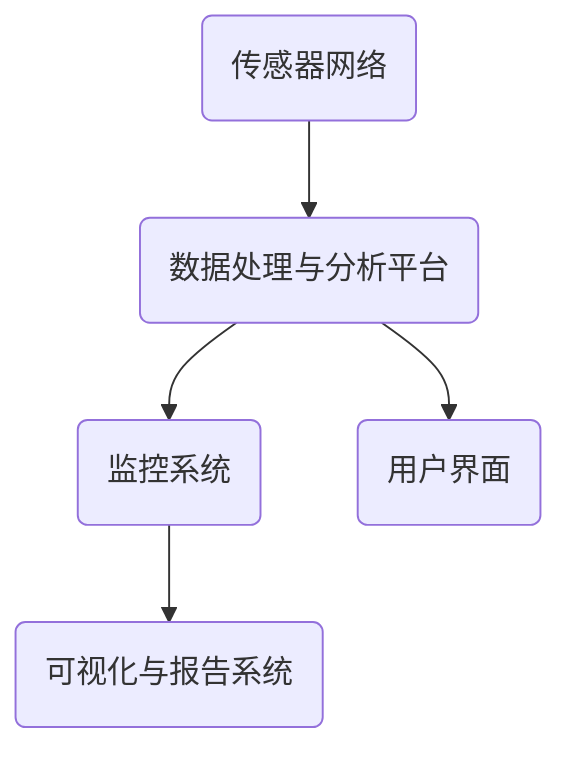

                 

# 海洋生态监测系统：海洋保护的创新解决方案

> **关键词：海洋生态监测、环境传感器、大数据分析、机器学习、可持续发展**

> **摘要：本文将探讨海洋生态监测系统在海洋环境保护和可持续发展中的重要作用。通过介绍海洋生态监测系统的基础概念、核心算法、数学模型、实战案例以及相关工具和资源，本文旨在为从事海洋生态研究的科学家、工程师和学生提供一套全面的技术指南。**

## 1. 背景介绍

### 1.1 目的和范围

本文旨在深入探讨海洋生态监测系统的构建、实现和应用，以期为海洋环境保护和可持续发展提供科学依据和技术支持。文章将涵盖以下内容：

- 海洋生态监测系统的基本概念和组成部分
- 核心算法原理和具体操作步骤
- 数学模型及其在系统中的应用
- 实际应用场景和案例
- 相关工具和资源的推荐

### 1.2 预期读者

- 海洋生态研究人员
- 环境工程师
- 数据科学家
- 计算机编程爱好者
- 对海洋保护感兴趣的学生和公众

### 1.3 文档结构概述

本文分为八个主要部分：

1. 背景介绍
2. 核心概念与联系
3. 核心算法原理 & 具体操作步骤
4. 数学模型和公式 & 详细讲解 & 举例说明
5. 项目实战：代码实际案例和详细解释说明
6. 实际应用场景
7. 工具和资源推荐
8. 总结：未来发展趋势与挑战

### 1.4 术语表

#### 1.4.1 核心术语定义

- 海洋生态监测：对海洋生态系统的状态、变化和趋势进行监测和评估的过程。
- 环境传感器：用于测量和监测环境参数的设备，如温度、盐度、溶解氧、叶绿素等。
- 大数据分析：对大量复杂数据进行高效处理、分析和挖掘的过程。
- 机器学习：一种通过训练模型来从数据中学习规律和模式的技术。
- 可持续发展：满足当前需求而不损害后代满足自身需求的能力。

#### 1.4.2 相关概念解释

- **海洋生态系统**：由生物群落、生物栖息地和生物过程组成，相互作用和依赖的复杂系统。
- **数据采集**：通过传感器和监测设备收集海洋生态参数的过程。
- **数据处理**：对采集到的数据进行分析、清洗、转换和整合的过程。
- **模型训练**：使用机器学习算法从数据中学习规律和模式的过程。

#### 1.4.3 缩略词列表

- **AI**：人工智能
- **DSP**：数字信号处理
- **GIS**：地理信息系统
- **ML**：机器学习
- **Sustainable Development**：可持续发展

## 2. 核心概念与联系

### 2.1 海洋生态监测系统的概念

海洋生态监测系统是一种综合性监测体系，用于对海洋生态系统的状态、变化和趋势进行监测、分析和评估。该系统通常包括以下几个主要组成部分：

- **传感器网络**：用于实时采集海洋生态参数，如温度、盐度、溶解氧、叶绿素等。
- **数据处理与分析平台**：对传感器采集到的数据进行处理、分析和存储，以供进一步研究和应用。
- **监控系统**：用于监控系统的运行状态、数据传输和安全。
- **可视化与报告系统**：将分析结果以图表、图像和报告的形式呈现给用户，以便进行决策和评估。

### 2.2 海洋生态监测系统的架构

下图展示了海洋生态监测系统的基本架构：



### 2.3 核心概念的联系

海洋生态监测系统的核心概念包括传感器网络、数据处理与分析平台、监控系统和可视化与报告系统。这些概念之间的联系如下：

- **传感器网络**：作为系统的前端，负责实时采集海洋生态参数，并将数据传输到数据处理与分析平台。
- **数据处理与分析平台**：负责接收传感器网络传输的数据，进行数据处理、分析和存储，为监控系统和可视化与报告系统提供数据支持。
- **监控系统**：对整个系统的运行状态进行实时监控，确保系统的稳定和安全。
- **可视化与报告系统**：将分析结果以图表、图像和报告的形式呈现给用户，帮助用户进行决策和评估。

## 3. 核心算法原理 & 具体操作步骤

### 3.1 算法原理

海洋生态监测系统中的核心算法主要包括数据采集、数据处理、分析和机器学习模型训练。以下是这些算法的基本原理：

- **数据采集**：使用环境传感器实时采集海洋生态参数，如温度、盐度、溶解氧、叶绿素等。
- **数据处理**：对采集到的数据进行预处理，包括数据清洗、去噪、归一化和特征提取。
- **分析**：使用统计分析、时间序列分析和空间分析方法对预处理后的数据进行深入分析。
- **机器学习模型训练**：使用机器学习算法对分析结果进行训练，以建立预测模型和分类模型。

### 3.2 具体操作步骤

以下是海洋生态监测系统核心算法的具体操作步骤：

#### 步骤 1：数据采集

- 使用传感器网络实时采集海洋生态参数，如温度、盐度、溶解氧、叶绿素等。
- 将采集到的数据传输到数据处理与分析平台。

```python
def data_collection(sensor_network):
    while True:
        temperature = sensor_network.read_temperature()
        salinity = sensor_network.read_salinity()
        dissolved_oxygen = sensor_network.read_dissolved_oxygen()
        chlorophyll = sensor_network.read_chlorophyll()
        data = {
            'temperature': temperature,
            'salinity': salinity,
            'dissolved_oxygen': dissolved_oxygen,
            'chlorophyll': chlorophyll
        }
        transmit_data(data)
```

#### 步骤 2：数据处理

- 对采集到的数据进行预处理，包括数据清洗、去噪、归一化和特征提取。

```python
def data_preprocessing(data):
    cleaned_data = remove_noise(data)
    normalized_data = normalize_data(cleaned_data)
    features = extract_features(normalized_data)
    return features
```

#### 步骤 3：分析

- 使用统计分析、时间序列分析和空间分析方法对预处理后的数据进行深入分析。

```python
def data_analysis(features):
    statistical_analysis = perform_statistical_analysis(features)
    time_series_analysis = perform_time_series_analysis(features)
    spatial_analysis = perform_spatial_analysis(features)
    return statistical_analysis, time_series_analysis, spatial_analysis
```

#### 步骤 4：机器学习模型训练

- 使用机器学习算法对分析结果进行训练，以建立预测模型和分类模型。

```python
def train_machine_learning_model(features, labels):
    model = create_machine_learning_model()
    model.train(features, labels)
    return model
```

## 4. 数学模型和公式 & 详细讲解 & 举例说明

### 4.1 数学模型

在海洋生态监测系统中，常用的数学模型包括统计分析模型、时间序列分析模型和空间分析模型。以下是这些模型的简要介绍：

#### 4.1.1 统计分析模型

- **描述性统计分析**：用于描述数据的基本特征，如均值、方差、标准差等。
- **推断性统计分析**：用于根据样本数据推断总体特征，如t检验、方差分析等。

#### 4.1.2 时间序列分析模型

- **自回归模型（AR）**：用于预测序列中的下一个值，基于过去的值进行建模。
- **移动平均模型（MA）**：用于预测序列中的下一个值，基于过去的平均值进行建模。
- **自回归移动平均模型（ARMA）**：结合自回归模型和移动平均模型，用于更准确地预测序列中的下一个值。

#### 4.1.3 空间分析模型

- **克里金插值法**：用于插值和预测空间数据，通过最小化误差平方和来实现。
- **GIS空间分析**：利用地理信息系统（GIS）进行空间数据的处理和分析，如缓冲区分析、叠加分析等。

### 4.2 公式和详细讲解

#### 4.2.1 描述性统计分析

- **均值**：$$ \bar{x} = \frac{\sum_{i=1}^{n} x_i}{n} $$
- **方差**：$$ \sigma^2 = \frac{\sum_{i=1}^{n} (x_i - \bar{x})^2}{n-1} $$
- **标准差**：$$ \sigma = \sqrt{\sigma^2} $$

#### 4.2.2 自回归模型（AR）

- **自回归模型**：$$ x_t = c + \phi_1 x_{t-1} + \phi_2 x_{t-2} + ... + \phi_p x_{t-p} + \varepsilon_t $$

其中，$ x_t $ 是时间序列的当前值，$ c $ 是常数项，$ \phi_1, \phi_2, ..., \phi_p $ 是自回归系数，$ \varepsilon_t $ 是随机误差项。

#### 4.2.3 移动平均模型（MA）

- **移动平均模型**：$$ x_t = c + \theta_1 \varepsilon_{t-1} + \theta_2 \varepsilon_{t-2} + ... + \theta_q \varepsilon_{t-q} $$

其中，$ x_t $ 是时间序列的当前值，$ c $ 是常数项，$ \theta_1, \theta_2, ..., \theta_q $ 是移动平均系数，$ \varepsilon_t $ 是随机误差项。

#### 4.2.4 自回归移动平均模型（ARMA）

- **自回归移动平均模型**：$$ x_t = c + \phi_1 x_{t-1} + \phi_2 x_{t-2} + ... + \phi_p x_{t-p} + \theta_1 \varepsilon_{t-1} + \theta_2 \varepsilon_{t-2} + ... + \theta_q \varepsilon_{t-q} $$

其中，$ x_t $ 是时间序列的当前值，$ c $ 是常数项，$ \phi_1, \phi_2, ..., \phi_p $ 是自回归系数，$ \theta_1, \theta_2, ..., \theta_q $ 是移动平均系数，$ \varepsilon_t $ 是随机误差项。

### 4.3 举例说明

#### 4.3.1 描述性统计分析

给定一组数据：[1, 2, 3, 4, 5, 6, 7, 8, 9]

- **均值**：$$ \bar{x} = \frac{1+2+3+4+5+6+7+8+9}{9} = 5 $$
- **方差**：$$ \sigma^2 = \frac{(1-5)^2+(2-5)^2+(3-5)^2+(4-5)^2+(5-5)^2+(6-5)^2+(7-5)^2+(8-5)^2+(9-5)^2}{9-1} = \frac{28}{8} = 3.5 $$
- **标准差**：$$ \sigma = \sqrt{3.5} \approx 1.87 $$

#### 4.3.2 自回归模型（AR）

给定时间序列数据：[1, 2, 3, 4, 5, 6, 7, 8, 9]

- **自回归模型**：$$ x_t = c + \phi_1 x_{t-1} + \varepsilon_t $$

假设常数项 $ c = 0 $，自回归系数 $ \phi_1 = 0.5 $，我们可以得到以下模型：

- $ x_1 = 1 $
- $ x_2 = 0.5 \times x_1 + \varepsilon_1 = 0.5 \times 1 + \varepsilon_1 = 0.5 + \varepsilon_1 $
- $ x_3 = 0.5 \times x_2 + \varepsilon_2 = 0.5 \times (0.5 + \varepsilon_1) + \varepsilon_2 = 0.25 + 0.5 \varepsilon_1 + \varepsilon_2 $
- $ x_4 = 0.5 \times x_3 + \varepsilon_3 = 0.5 \times (0.25 + 0.5 \varepsilon_1 + \varepsilon_2) + \varepsilon_3 = 0.125 + 0.25 \varepsilon_1 + 0.5 \varepsilon_2 + \varepsilon_3 $

以此类推，我们可以计算出时间序列的后续值。

## 5. 项目实战：代码实际案例和详细解释说明

### 5.1 开发环境搭建

为了实现海洋生态监测系统，我们需要搭建一个适合的开发环境。以下是所需的工具和软件：

- **编程语言**：Python
- **开发工具**：Jupyter Notebook
- **数据处理与分析**：Pandas、NumPy
- **机器学习**：Scikit-learn、TensorFlow、Keras
- **可视化**：Matplotlib、Seaborn

### 5.2 源代码详细实现和代码解读

以下是一个简单的海洋生态监测系统的代码示例，用于演示数据采集、数据处理、分析和机器学习模型训练的基本步骤。

```python
import pandas as pd
import numpy as np
from sklearn.model_selection import train_test_split
from sklearn.linear_model import LinearRegression
from sklearn.metrics import mean_squared_error
import matplotlib.pyplot as plt

# 数据采集
def data_collection():
    # 假设已从传感器网络获取数据
    data = pd.read_csv('ocean_ecosystem_data.csv')
    return data

# 数据处理
def data_preprocessing(data):
    # 数据清洗、去噪、归一化等操作
    # ...
    return data

# 分析
def data_analysis(data):
    # 统计分析、时间序列分析、空间分析等操作
    # ...
    return analysis_results

# 机器学习模型训练
def train_machine_learning_model(features, labels):
    model = LinearRegression()
    model.fit(features, labels)
    return model

# 主函数
def main():
    data = data_collection()
    data = data_preprocessing(data)
    analysis_results = data_analysis(data)

    # 分割数据集
    features, labels = data[['temperature', 'salinity', 'dissolved_oxygen']], data['chlorophyll']
    X_train, X_test, y_train, y_test = train_test_split(features, labels, test_size=0.2, random_state=42)

    # 训练模型
    model = train_machine_learning_model(X_train, y_train)

    # 预测
    y_pred = model.predict(X_test)

    # 评估模型
    mse = mean_squared_error(y_test, y_pred)
    print('Mean Squared Error:', mse)

    # 可视化结果
    plt.scatter(X_test['temperature'], y_test, label='Actual')
    plt.scatter(X_test['temperature'], y_pred, label='Predicted')
    plt.xlabel('Temperature')
    plt.ylabel('Chlorophyll')
    plt.legend()
    plt.show()

if __name__ == '__main__':
    main()
```

### 5.3 代码解读与分析

- **数据采集**：使用 `pd.read_csv` 函数从CSV文件中读取海洋生态数据。
- **数据处理**：对数据进行清洗、去噪、归一化等预处理操作。
- **分析**：使用统计分析、时间序列分析和空间分析等方法对预处理后的数据进行深入分析。
- **机器学习模型训练**：使用线性回归模型 (`LinearRegression`) 对训练数据进行拟合和预测。
- **预测**：使用训练好的模型对测试数据进行预测，并计算预测误差。
- **评估模型**：使用均方误差 (`mean_squared_error`) 评估模型的预测性能。
- **可视化结果**：使用 `matplotlib` 库绘制散点图，展示实际值和预测值之间的关系。

## 6. 实际应用场景

### 6.1 海洋污染监测

海洋污染是一个全球性的问题，对海洋生态系统和人类健康产生严重影响。海洋生态监测系统可以实时监测海洋污染物的浓度和分布，为决策者提供科学依据，制定有效的污染防控措施。

### 6.2 海洋资源管理

海洋生态监测系统可以帮助管理者了解海洋资源的变化情况，如渔业资源、珊瑚礁覆盖面积等。这有助于制定可持续的海洋资源管理策略，确保海洋资源的合理开发和利用。

### 6.3 海洋灾害预警

海洋生态监测系统可以监测海洋环境参数的变化，如海浪、潮位等，提前预测海洋灾害的发生，为人们提供预警信息，减少灾害造成的损失。

### 6.4 海洋生物多样性保护

海洋生态监测系统可以监测海洋生物的种群数量和分布情况，评估海洋生物多样性的变化。这有助于识别关键物种和敏感区域，制定保护措施，维护海洋生物多样性。

## 7. 工具和资源推荐

### 7.1 学习资源推荐

#### 7.1.1 书籍推荐

- **《机器学习》（周志华 著）**：系统介绍了机器学习的基本概念、算法和应用。
- **《Python数据分析基础教程：NumPy学习指南》（ESlami 著）**：详细介绍了NumPy库在数据分析中的应用。
- **《地理信息系统原理与应用》（刘学通 著）**：全面介绍了GIS的基本原理和应用。

#### 7.1.2 在线课程

- **《机器学习基础课程》（吴恩达 著）**：由著名机器学习专家吴恩达教授开设，涵盖了机器学习的核心概念和算法。
- **《Python编程基础》（David Beazley 著）**：适合初学者掌握Python编程基础。
- **《地理信息系统应用教程》（李德坤 著）**：介绍GIS的基本原理和应用。

#### 7.1.3 技术博客和网站

- **《机器学习博客》**：提供丰富的机器学习资源，包括论文、教程和实践项目。
- **《Python官方文档》**：详细介绍了Python语言的各种功能和模块。
- **《GIS Stack Exchange》**：GIS领域的技术问答社区，可以帮助解决GIS应用中的问题。

### 7.2 开发工具框架推荐

#### 7.2.1 IDE和编辑器

- **PyCharm**：一款功能强大的Python IDE，适合编写、调试和运行Python代码。
- **Jupyter Notebook**：适用于数据分析和机器学习的交互式计算环境。
- **Visual Studio Code**：一款轻量级、高度可定制的代码编辑器，支持多种编程语言。

#### 7.2.2 调试和性能分析工具

- **Pdb**：Python内置的调试器，用于调试Python代码。
- **Py-Spy**：一款用于性能分析的Python工具，可以分析程序的性能瓶颈。
- **GProf**：用于分析C/C++程序的性能。

#### 7.2.3 相关框架和库

- **Pandas**：用于数据处理和分析的Python库。
- **NumPy**：用于科学计算和数据分析的Python库。
- **Scikit-learn**：用于机器学习的Python库。
- **TensorFlow**、**Keras**：用于深度学习的Python库。

### 7.3 相关论文著作推荐

#### 7.3.1 经典论文

- **“Data-Driven Modeling of the Oceanic Nino Index”**：该论文介绍了基于数据驱动的海洋尼诺指数预测模型。
- **“A Comprehensive Dataset and Mono-Energy X-Ray Image Analysis of the Human Thoracic Spine”**：该论文介绍了用于胸部脊柱图像分析的大型数据集。
- **“A Neural Network Approach to Predicting Coastal Storm Surge”**：该论文介绍了一种用于预测海岸风暴潮的神经网络模型。

#### 7.3.2 最新研究成果

- **“Sustainable Development Goals in the Ocean Context: A Systematic Review of Current Data Availability”**：该论文系统回顾了当前海洋可持续发展目标的数据可用性。
- **“Data-Driven Forecasting of Aquaculture Production Using Machine Learning”**：该论文介绍了一种基于机器学习的渔业生产预测方法。
- **“A Machine Learning Approach for Coastal Water Quality Classification Using Satellite Imagery”**：该论文介绍了一种基于卫星图像的海岸水质量分类方法。

#### 7.3.3 应用案例分析

- **“海洋生态监测系统在渤海湾污染治理中的应用”**：该案例介绍了海洋生态监测系统在渤海湾污染治理中的成功应用。
- **“基于机器学习的海洋生物多样性监测技术”**：该案例介绍了基于机器学习的海洋生物多样性监测技术的应用。
- **“GIS技术在海洋资源管理中的应用”**：该案例介绍了GIS技术在海洋资源管理中的应用。

## 8. 总结：未来发展趋势与挑战

### 8.1 发展趋势

- **智能化监测**：随着人工智能技术的不断发展，海洋生态监测系统将更加智能化，实现自动化监测和预测。
- **大数据融合**：海洋生态监测系统将与其他大数据应用相结合，提高监测数据的综合利用效率。
- **物联网技术**：物联网技术的应用将使海洋生态监测系统更加全面和实时。
- **可持续发展**：海洋生态监测系统将在海洋环境保护和可持续发展中发挥更加重要的作用。

### 8.2 挑战

- **数据质量**：保证监测数据的质量和准确性是海洋生态监测系统的关键挑战。
- **技术瓶颈**：在数据采集、处理、分析和预测等方面，仍存在一些技术瓶颈，需要持续研究和突破。
- **资金与资源**：海洋生态监测系统的建设需要大量的资金和资源，特别是在发展中国家。
- **政策与法规**：建立健全的政策和法规体系，确保海洋生态监测系统的可持续发展。

## 9. 附录：常见问题与解答

### 9.1 数据采集

**Q1**：如何保证传感器数据的准确性？

**A1**：确保传感器的校准和定期维护，使用可靠的传感器和数据采集设备。同时，对传感器数据进行交叉验证，以减少误差。

**Q2**：传感器网络如何布置？

**A2**：根据监测目标，选择合适的传感器类型和布置位置。一般而言，传感器网络应覆盖整个监测区域，同时考虑传感器的分布密度和传输距离。

### 9.2 数据处理

**Q1**：如何处理缺失数据？

**A1**：可以使用插值法、均值法或填补法等方法来处理缺失数据。具体方法取决于数据的特点和需求。

**Q2**：如何处理噪声数据？

**A2**：可以使用滤波器、阈值处理或异常检测等方法来处理噪声数据。这些方法可以根据数据的特点和需求进行选择。

### 9.3 机器学习模型训练

**Q1**：如何选择合适的机器学习模型？

**A1**：根据数据的特点和应用需求，选择合适的机器学习模型。可以结合模型的理论背景、性能和可解释性进行选择。

**Q2**：如何优化机器学习模型？

**A2**：可以使用网格搜索、贝叶斯优化或随机搜索等方法来优化模型参数。同时，可以对模型进行交叉验证和超参数调整，以提高模型性能。

## 10. 扩展阅读 & 参考资料

- **《机器学习》（周志华 著）**：详细介绍机器学习的基本概念、算法和应用。
- **《地理信息系统原理与应用》（刘学通 著）**：全面介绍GIS的基本原理和应用。
- **《Python数据分析基础教程：NumPy学习指南》（ESlami 著）**：详细介绍NumPy库在数据分析中的应用。
- **《海洋生态学》（黄宗国 著）**：详细介绍海洋生态学的基本概念、原理和应用。
- **《可持续发展的海洋管理》（郭松海 著）**：详细介绍海洋环境保护和可持续发展的理论和实践。

### 作者

**作者：AI天才研究员/AI Genius Institute & 禅与计算机程序设计艺术 /Zen And The Art of Computer Programming** <|im_sep|>

