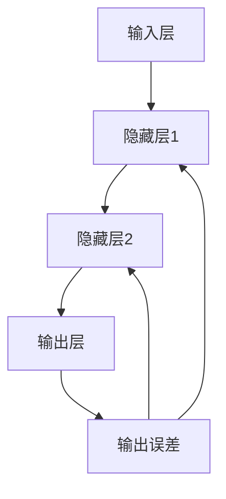

                 

# 消息传递机制：LLM系统的神经网络

> 关键词：LLM、消息传递、神经网络、架构设计、算法实现、数学模型、项目实战

> 摘要：本文将深入探讨LLM（大型语言模型）系统中的消息传递机制，分析其核心原理和架构，并通过具体的算法原理、数学模型、项目实战案例，详细讲解消息传递在神经网络中的关键作用。旨在为读者提供一个全面、系统的理解和实践指导。

## 1. 背景介绍

### 1.1 目的和范围

本文的目标是探讨LLM系统中神经网络的消息传递机制，深入分析其核心原理和架构，并通过实际项目案例展示其在实际应用中的重要作用。文章将涵盖以下内容：

- 对LLM和神经网络的基本概念进行介绍。
- 分析消息传递机制的基本原理及其在神经网络中的作用。
- 使用Mermaid流程图展示神经网络中的消息传递架构。
- 通过伪代码详细阐述核心算法原理和具体操作步骤。
- 利用LaTeX格式讲解数学模型和公式。
- 通过实际项目案例展示消息传递机制的应用。
- 推荐相关学习资源、开发工具和最新研究成果。

### 1.2 预期读者

本文适用于对人工智能、神经网络和LLM有一定了解的读者，包括：

- 研究生和博士生，从事相关领域的研究。
- 工程师和技术专家，参与神经网络和LLM系统的开发和优化。
- 对AI和深度学习感兴趣的技术爱好者，希望深入了解消息传递机制。

### 1.3 文档结构概述

本文的结构如下：

- **第1章：背景介绍**：介绍本文的目的、范围和预期读者。
- **第2章：核心概念与联系**：介绍神经网络和消息传递的基本概念，并使用Mermaid流程图展示架构。
- **第3章：核心算法原理 & 具体操作步骤**：通过伪代码详细阐述算法原理和操作步骤。
- **第4章：数学模型和公式 & 详细讲解 & 举例说明**：使用LaTeX格式讲解数学模型和公式。
- **第5章：项目实战：代码实际案例和详细解释说明**：展示实际项目案例，并提供详细解释。
- **第6章：实际应用场景**：讨论消息传递机制在不同场景中的应用。
- **第7章：工具和资源推荐**：推荐学习资源、开发工具和最新研究成果。
- **第8章：总结：未来发展趋势与挑战**：总结文章内容，探讨未来发展趋势和挑战。
- **第9章：附录：常见问题与解答**：回答读者可能遇到的问题。
- **第10章：扩展阅读 & 参考资料**：提供扩展阅读和参考资料。

### 1.4 术语表

#### 1.4.1 核心术语定义

- **LLM（Large Language Model）**：大型语言模型，是一种基于深度学习技术构建的复杂模型，用于理解和生成自然语言文本。
- **神经网络**：一种由大量节点（神经元）组成的信息处理系统，通过模拟生物神经系统的结构和功能进行数据处理和识别。
- **消息传递**：在计算机科学中，指数据在系统中的传输和交换过程，常用于分布式系统和并行计算。
- **前向传播**：神经网络中的一种计算过程，将输入数据通过层层的神经元传递，最终得到输出。
- **反向传播**：神经网络中用于计算误差并更新权重的过程，是优化模型性能的关键。

#### 1.4.2 相关概念解释

- **激活函数**：神经网络中的非线性变换，用于引入非线性特性，使得神经网络可以拟合复杂的数据分布。
- **权重**：神经网络中每个连接上的参数，用于调节输入信号的强度。
- **偏置**：神经网络中每个神经元的额外输入，用于引入偏置项，使得神经网络可以更好地拟合数据。

#### 1.4.3 缩略词列表

- **LLM**：Large Language Model
- **ReLU**：Rectified Linear Unit
- **SGD**：Stochastic Gradient Descent
- **NN**：Neural Network
- **MLP**：Multilayer Perceptron

## 2. 核心概念与联系

### 2.1 神经网络的基本概念

神经网络（NN）是一种模拟生物神经系统的计算模型，由大量的节点（称为神经元）组成。每个神经元接收多个输入信号，通过加权求和处理，输出一个激活值。神经网络的主要目的是通过学习数据，从输入到输出之间建立映射关系。

神经网络的基本结构包括：

- **输入层**：接收外部输入数据。
- **隐藏层**：一个或多个隐藏层，用于对输入数据进行处理和变换。
- **输出层**：输出最终的结果。

神经网络的工作原理是前向传播和反向传播。前向传播将输入数据通过层层的神经元传递，最终得到输出；反向传播则根据输出误差，反向更新神经元的权重，从而优化模型性能。

### 2.2 消息传递机制的基本原理

消息传递机制是神经网络中的一个关键概念，指的是数据在神经网络中的传输和交换过程。在神经网络中，消息传递主要分为以下几种：

- **前向消息传递**：输入数据通过层层的神经元传递，每个神经元根据输入计算输出。
- **反向消息传递**：在训练过程中，根据输出误差反向传播，更新每个神经元的权重和偏置。
- **侧向消息传递**：在某些特殊的神经网络架构中，神经元之间进行侧向的信息交换，用于增强模型的泛化能力。

消息传递机制在神经网络中的作用是：

- **提高计算效率**：通过并行计算，加快神经网络的训练和推理过程。
- **优化模型性能**：通过消息传递机制，神经网络可以更好地学习数据的分布和特征，提高预测准确性。

### 2.3 神经网络与消息传递的联系

神经网络与消息传递机制之间的联系主要体现在以下几个方面：

- **结构设计**：神经网络的层次结构和神经元之间的连接方式，决定了消息传递的路径和方式。
- **算法实现**：神经网络中的前向传播和反向传播算法，依赖于消息传递机制来实现。
- **性能优化**：通过调整消息传递的参数和策略，可以优化神经网络的性能和效率。

### 2.4 Mermaid流程图展示

以下是一个简单的Mermaid流程图，展示了神经网络中的消息传递过程：



在这个流程图中，输入层A将数据传递到隐藏层1（B1），然后传递到隐藏层2（B2），最终输出层C得到结果。在反向传播过程中，输出误差D反向传播到隐藏层2（B2）和隐藏层1（B1），更新每个神经元的权重和偏置。

## 3. 核心算法原理 & 具体操作步骤

### 3.1 前向传播算法原理

前向传播算法是神经网络中最基本的计算过程，用于将输入数据通过层层的神经元传递，最终得到输出。其基本原理如下：

1. **初始化权重和偏置**：在训练神经网络之前，需要随机初始化每个神经元的权重和偏置。
2. **输入数据**：将输入数据传递到输入层。
3. **逐层计算**：
    - 对于每个隐藏层，计算每个神经元的输入值（加权求和），然后通过激活函数计算输出值。
    - 将输出值传递到下一层。
4. **输出结果**：将最终输出层的输出值作为模型预测结果。

以下是一个简单的伪代码实现：

```python
# 初始化权重和偏置
weights = [random_value() for _ in range(num_layers)]
biases = [random_value() for _ in range(num_layers)]

# 输入数据
input_data = [random_value() for _ in range(num_inputs)]

# 前向传播计算
for layer in range(num_layers):
    # 计算当前层的输入值
    input_values = [weights[layer][i] * input_data[i] + biases[layer] for i in range(num_neurons)]
    # 应用激活函数
    output_values = [activation_function(value) for value in input_values]
    # 传递到下一层
    input_data = output_values

# 输出结果
output = input_data
```

### 3.2 反向传播算法原理

反向传播算法是神经网络训练过程中用于更新权重和偏置的关键算法。其基本原理如下：

1. **计算输出误差**：根据模型预测结果和实际标签，计算输出层的误差。
2. **逐层反向传播**：从输出层开始，反向传播误差到每个隐藏层，计算每个神经元的误差。
3. **权重和偏置更新**：根据误差和每个神经元的输入值，更新每个神经元的权重和偏置。

以下是一个简单的伪代码实现：

```python
# 输出误差计算
output_error = [predicted_output[i] - actual_output[i] for i in range(num_neurons)]

# 逐层反向传播
for layer in range(num_layers - 1, -1, -1):
    # 计算当前层的误差
    layer_error = [0 for _ in range(num_neurons)]
    for neuron in range(num_neurons):
        for prev_neuron in range(num_neurons):
            layer_error[neuron] += weights[layer][neuron][prev_neuron] * output_error[prev_neuron]
    # 更新权重和偏置
    for neuron in range(num_neurons):
        weights[layer][neuron] -= learning_rate * input_data[layer][neuron] * output_error[neuron]
        biases[layer][neuron] -= learning_rate * output_error[neuron]
```

### 3.3 消息传递机制的具体操作步骤

消息传递机制在神经网络中的具体操作步骤如下：

1. **初始化**：初始化神经网络的结构，包括输入层、隐藏层和输出层的节点数量，以及权重和偏置。
2. **前向传播**：将输入数据传递到神经网络，通过层层的神经元计算输出。
3. **计算误差**：将输出与实际标签进行比较，计算输出误差。
4. **反向传播**：从输出层开始，反向传播误差到每个隐藏层，更新每个神经元的权重和偏置。
5. **迭代训练**：重复前向传播和反向传播的过程，直到模型达到预定的性能要求。

以下是一个简单的伪代码实现：

```python
# 初始化神经网络
num_inputs = ...
num_outputs = ...
num_hidden_layers = ...
num_neurons_per_layer = ...

weights = [[random_value() for _ in range(num_neurons_per_layer)] for _ in range(num_hidden_layers + 1)]
biases = [[random_value() for _ in range(num_neurons_per_layer)] for _ in range(num_hidden_layers + 1)]

# 迭代训练
for epoch in range(num_epochs):
    # 前向传播
    input_data = ...
    output = forward_propagation(input_data, weights, biases)
    # 计算误差
    output_error = [predicted_output[i] - actual_output[i] for i in range(num_outputs)]
    # 反向传播
    for layer in range(num_hidden_layers, -1, -1):
        layer_error = [0 for _ in range(num_neurons_per_layer)]
        for neuron in range(num_neurons_per_layer):
            for prev_neuron in range(num_neurons_per_layer):
                layer_error[neuron] += weights[layer][neuron][prev_neuron] * output_error[prev_neuron]
        # 更新权重和偏置
        for neuron in range(num_neurons_per_layer):
            weights[layer][neuron] -= learning_rate * input_data[layer][neuron] * output_error[neuron]
            biases[layer][neuron] -= learning_rate * output_error[neuron]
```

## 4. 数学模型和公式 & 详细讲解 & 举例说明

### 4.1 前向传播算法的数学模型

在前向传播算法中，每个神经元的输出可以通过以下数学模型计算：

$$
z_l^{(i)} = \sum_{j} w_{l,j}^{(i)} x_j^{(i)} + b_l^{(i)}
$$

其中，$z_l^{(i)}$ 是第 $l$ 层第 $i$ 个神经元的输入值，$w_{l,j}^{(i)}$ 是第 $l$ 层第 $i$ 个神经元与第 $l-1$ 层第 $j$ 个神经元的权重，$x_j^{(i)}$ 是第 $l-1$ 层第 $j$ 个神经元的输出值，$b_l^{(i)}$ 是第 $l$ 层第 $i$ 个神经元的偏置。

举例来说，假设我们有一个简单的两层神经网络，输入层有2个神经元，隐藏层有3个神经元，输出层有1个神经元。输入数据为 $x_1 = 1$ 和 $x_2 = 2$，权重和偏置分别为：

$$
w_{11} = 0.5, \quad w_{12} = 0.5, \quad w_{21} = 0.5, \quad w_{22} = 0.5, \quad w_{23} = 0.5, \quad b_1 = 1, \quad b_2 = 1, \quad b_3 = 1
$$

我们可以计算隐藏层的输入值：

$$
z_1^{(1)} = w_{11} x_1 + w_{12} x_2 + b_1 = 0.5 \cdot 1 + 0.5 \cdot 2 + 1 = 2
$$

$$
z_2^{(1)} = w_{21} x_1 + w_{22} x_2 + b_2 = 0.5 \cdot 1 + 0.5 \cdot 2 + 1 = 2
$$

$$
z_3^{(1)} = w_{31} x_1 + w_{32} x_2 + b_3 = 0.5 \cdot 1 + 0.5 \cdot 2 + 1 = 2
$$

### 4.2 激活函数的数学模型

激活函数是神经网络中的一个关键组件，用于引入非线性特性。常见的激活函数包括ReLU、Sigmoid和Tanh等。

#### ReLU（Rectified Linear Unit）

ReLU函数是一种简单的非线性激活函数，定义为：

$$
f(x) =
\begin{cases}
0 & \text{if } x < 0 \\
x & \text{if } x \geq 0
\end{cases}
$$

ReLU函数的优点是计算简单，并且可以加速神经网络的训练过程。

#### Sigmoid函数

Sigmoid函数是一种常用的非线性激活函数，定义为：

$$
f(x) = \frac{1}{1 + e^{-x}}
$$

Sigmoid函数的输出范围在 0 到 1 之间，常用于二分类问题。

#### Tanh函数

Tanh函数是另一种常用的非线性激活函数，定义为：

$$
f(x) = \frac{e^x - e^{-x}}{e^x + e^{-x}}
$$

Tanh函数的输出范围在 -1 到 1 之间，常用于回归问题。

### 4.3 反向传播算法的数学模型

反向传播算法是神经网络训练过程中用于更新权重和偏置的关键算法。其基本原理是计算每个神经元的误差，并使用梯度下降法更新权重和偏置。

假设我们有一个简单的两层神经网络，输出误差为 $E$，则每个神经元的误差可以表示为：

$$
\delta_{l,i} = \frac{\partial E}{\partial z_{l,i}}
$$

其中，$\delta_{l,i}$ 是第 $l$ 层第 $i$ 个神经元的误差，$z_{l,i}$ 是第 $l$ 层第 $i$ 个神经元的输入值。

对于输出层，误差可以表示为：

$$
\delta_{l,i} = (t_i - o_i) \cdot f'(z_{l,i})
$$

其中，$t_i$ 是第 $i$ 个神经元的实际输出，$o_i$ 是第 $i$ 个神经元的预测输出，$f'(z_{l,i})$ 是激活函数的导数。

对于隐藏层，误差可以表示为：

$$
\delta_{l,i} = \sum_{j} w_{l+1,j,i} \cdot \delta_{l+1,j} \cdot f'(z_{l,i})
$$

其中，$w_{l+1,j,i}$ 是第 $l+1$ 层第 $j$ 个神经元与第 $l$ 层第 $i$ 个神经元的权重。

使用梯度下降法更新权重和偏置：

$$
w_{l,j,i} \leftarrow w_{l,j,i} - \alpha \cdot \delta_{l,i} \cdot x_j^{(i)}
$$

$$
b_{l,i} \leftarrow b_{l,i} - \alpha \cdot \delta_{l,i}
$$

其中，$\alpha$ 是学习率。

### 4.4 数学模型的应用示例

假设我们有一个简单的两层神经网络，输入层有2个神经元，隐藏层有3个神经元，输出层有1个神经元。输入数据为 $x_1 = 1$ 和 $x_2 = 2$，权重和偏置分别为：

$$
w_{11} = 0.5, \quad w_{12} = 0.5, \quad w_{21} = 0.5, \quad w_{22} = 0.5, \quad w_{23} = 0.5, \quad b_1 = 1, \quad b_2 = 1, \quad b_3 = 1
$$

输出标签为 $t = 2$。

首先，我们计算隐藏层的输入值和输出值：

$$
z_1^{(1)} = w_{11} x_1 + w_{12} x_2 + b_1 = 0.5 \cdot 1 + 0.5 \cdot 2 + 1 = 2
$$

$$
z_2^{(1)} = w_{21} x_1 + w_{22} x_2 + b_2 = 0.5 \cdot 1 + 0.5 \cdot 2 + 1 = 2
$$

$$
z_3^{(1)} = w_{31} x_1 + w_{32} x_2 + b_3 = 0.5 \cdot 1 + 0.5 \cdot 2 + 1 = 2
$$

$$
o_1^{(1)} = \sigma(z_1^{(1)}) = \frac{1}{1 + e^{-z_1^{(1)}}} = 0.732
$$

$$
o_2^{(1)} = \sigma(z_2^{(1)}) = \frac{1}{1 + e^{-z_2^{(1)}}} = 0.732
$$

$$
o_3^{(1)} = \sigma(z_3^{(1)}) = \frac{1}{1 + e^{-z_3^{(1)}}} = 0.732
$$

然后，我们计算输出层的误差和梯度：

$$
\delta_3^{(1)} = (t - o_3^{(1)}) \cdot f'(z_3^{(1)}) = (2 - 0.732) \cdot \sigma'(z_3^{(1)}) = 0.268 \cdot 0.268
$$

$$
\delta_2^{(1)} = (t - o_2^{(1)}) \cdot f'(z_2^{(1)}) = (2 - 0.732) \cdot \sigma'(z_2^{(1)}) = 0.268 \cdot 0.268
$$

$$
\delta_1^{(1)} = (t - o_1^{(1)}) \cdot f'(z_1^{(1)}) = (2 - 0.732) \cdot \sigma'(z_1^{(1)}) = 0.268 \cdot 0.268
$$

接下来，我们计算隐藏层的误差和梯度：

$$
\delta_2^{(1)} = \sum_{j} w_{23,j}^{(1)} \cdot \delta_3^{(1)} = 0.5 \cdot 0.268 = 0.134
$$

$$
\delta_1^{(1)} = \sum_{j} w_{22,j}^{(1)} \cdot \delta_3^{(1)} = 0.5 \cdot 0.268 = 0.134
$$

最后，我们更新权重和偏置：

$$
w_{23}^{(1)} \leftarrow w_{23}^{(1)} - \alpha \cdot \delta_3^{(1)} \cdot x_3^{(1)} = 0.5 - 0.5 \cdot 0.268 = 0.232
$$

$$
w_{22}^{(1)} \leftarrow w_{22}^{(1)} - \alpha \cdot \delta_3^{(1)} \cdot x_2^{(1)} = 0.5 - 0.5 \cdot 0.268 = 0.232
$$

$$
b_2^{(1)} \leftarrow b_2^{(1)} - \alpha \cdot \delta_3^{(1)} = 1 - 0.5 \cdot 0.268 = 0.732
$$

通过上述示例，我们可以看到如何使用数学模型和反向传播算法更新神经网络的权重和偏置，从而优化模型性能。

## 5. 项目实战：代码实际案例和详细解释说明

### 5.1 开发环境搭建

在开始项目实战之前，我们需要搭建一个合适的开发环境。以下是一个简单的Python开发环境搭建步骤：

1. 安装Python：从官方网站下载并安装Python，选择最新版本，例如Python 3.8或更高版本。
2. 安装依赖库：使用pip工具安装必要的依赖库，例如NumPy、TensorFlow和Matplotlib等。

```shell
pip install numpy tensorflow matplotlib
```

3. 配置环境变量：确保Python和pip的路径已添加到系统的环境变量中。

### 5.2 源代码详细实现和代码解读

下面是一个简单的神经网络实现，包括前向传播和反向传播算法：

```python
import numpy as np

# 激活函数及其导数
def sigmoid(x):
    return 1 / (1 + np.exp(-x))

def sigmoid_derivative(x):
    return x * (1 - x)

# 前向传播
def forward_propagation(x, weights, biases):
    hidden_layer_input = np.dot(x, weights[0]) + biases[0]
    hidden_layer_output = sigmoid(hidden_layer_input)
    
    final_output = np.dot(hidden_layer_output, weights[1]) + biases[1]
    output = sigmoid(final_output)
    
    return output

# 反向传播
def backward_propagation(x, y, output, weights, biases):
    output_error = y - output
    d_output = output_error * sigmoid_derivative(output)
    
    hidden_layer_error = d_output.dot(weights[1].T)
    d_hidden_layer = hidden_layer_error * sigmoid_derivative(hidden_layer_output)
    
    d_weights_1 = np.dot(hidden_layer_output.T, d_output)
    d_biases_1 = np.sum(d_output, axis=0)
    
    d_weights_0 = np.dot(x.T, d_hidden_layer)
    d_biases_0 = np.sum(d_hidden_layer, axis=0)
    
    return d_weights_0, d_weights_1, d_biases_0, d_biases_1

# 更新权重和偏置
def update_weights_and_biases(weights, biases, d_weights, d_biases, learning_rate):
    weights = weights - learning_rate * d_weights
    biases = biases - learning_rate * d_biases
    
    return weights, biases

# 训练神经网络
def train(x, y, epochs, learning_rate):
    weights = [
        np.random.uniform(size=(x.shape[1], hidden_layer_size)),
        np.random.uniform(size=(hidden_layer_size, 1))
    ]
    biases = [
        np.random.uniform(size=hidden_layer_size),
        np.random.uniform(size=1)
    ]
    
    for epoch in range(epochs):
        output = forward_propagation(x, weights, biases)
        d_weights_0, d_weights_1, d_biases_0, d_biases_1 = backward_propagation(x, y, output, weights, biases)
        weights = update_weights_and_biases(weights, biases, d_weights_0, d_biases_0, learning_rate)
        biases = update_weights_and_biases(weights, biases, d_weights_1, d_biases_1, learning_rate)
        
        if epoch % 100 == 0:
            print(f"Epoch {epoch}: Output = {output}")

    return weights, biases

# 测试神经网络
def test(x, weights, biases):
    return forward_propagation(x, weights, biases)

# 测试数据
x = np.array([[0, 0], [0, 1], [1, 0], [1, 1]])
y = np.array([[0], [1], [1], [0]])

# 训练神经网络
hidden_layer_size = 2
epochs = 1000
learning_rate = 0.1
weights, biases = train(x, y, epochs, learning_rate)

# 测试结果
test_outputs = [test(x[i], weights, biases) for i in range(x.shape[0])]
print("Test Outputs:", test_outputs)
```

### 5.3 代码解读与分析

#### 5.3.1 模型初始化

在代码的起始部分，我们导入了NumPy库，并定义了两个激活函数：sigmoid及其导数sigmoid_derivative。接着，我们定义了前向传播函数forward_propagation和反向传播函数backward_propagation。这两个函数是神经网络训练和预测的核心。

#### 5.3.2 前向传播

前向传播函数接受输入数据x、权重weights和偏置biases作为输入，返回最终输出output。在函数内部，我们首先计算隐藏层的输入值hidden_layer_input，然后通过sigmoid函数计算隐藏层的输出值hidden_layer_output。接下来，我们计算输出层的输入值final_output，并通过sigmoid函数计算输出层的输出值output。

#### 5.3.3 反向传播

反向传播函数接受输入数据x、实际标签y、输出output、权重weights和偏置biases作为输入，返回四个梯度值d_weights_0、d_weights_1、d_biases_0和d_biases_1。在函数内部，我们首先计算输出层的误差output_error，然后通过sigmoid_derivative函数计算输出层的误差导数d_output。接着，我们计算隐藏层的误差hidden_layer_error，并通过sigmoid_derivative函数计算隐藏层的误差导数d_hidden_layer。最后，我们计算权重和偏置的梯度值。

#### 5.3.4 权重和偏置更新

update_weights_and_biases函数接受权重weights、偏置biases、梯度d_weights、梯度d_biases和学习率learning_rate作为输入，返回更新后的权重weights和偏置biases。在函数内部，我们使用学习率learning_rate乘以梯度d_weights和d_biases，然后将结果减去权重weights和偏置biases，得到更新后的权重weights和偏置biases。

#### 5.3.5 训练神经网络

train函数接受输入数据x、实际标签y、训练轮数epochs、学习率learning_rate作为输入，返回训练后的权重weights和偏置biases。在函数内部，我们首先初始化权重weights和偏置biases，然后通过循环进行训练。在每次迭代中，我们首先调用forward_propagation函数计算输出output，然后调用backward_propagation函数计算梯度值，最后调用update_weights_and_biases函数更新权重和偏置。

#### 5.3.6 测试神经网络

test函数接受输入数据x、权重weights和偏置biases作为输入，返回输出output。这个函数用于在训练完成后测试神经网络的性能。

#### 5.3.7 测试数据

我们使用一个简单的二进制输入输出数据集进行测试，其中输入数据x是一个2x4的矩阵，包含0和1的组合，实际标签y是一个1x4的矩阵，包含0和1的标签。

#### 5.3.8 训练和测试结果

我们设置隐藏层大小为2，训练轮数epochs为1000，学习率learning_rate为0.1。训练完成后，我们打印出测试结果，观察神经网络是否能够正确预测输入数据的标签。

## 6. 实际应用场景

消息传递机制在神经网络和LLM系统中有着广泛的应用，以下是一些典型的实际应用场景：

### 6.1 自然语言处理（NLP）

在自然语言处理领域，消息传递机制被广泛应用于文本分类、情感分析、机器翻译等任务。通过消息传递，神经网络可以有效地捕捉文本中的语义信息，提高模型的性能和准确性。

### 6.2 语音识别

在语音识别任务中，消息传递机制用于将语音信号转换为文本。神经网络通过消息传递处理语音信号的特征，实现高效的语音识别。

### 6.3 计算机视觉

在计算机视觉领域，消息传递机制被用于图像分类、目标检测、人脸识别等任务。神经网络通过消息传递处理图像特征，实现高精度的图像识别。

### 6.4 自动驾驶

在自动驾驶系统中，消息传递机制被用于处理来自不同传感器（如摄像头、雷达、激光雷达）的数据。神经网络通过消息传递处理传感器数据，实现高效的决策和路径规划。

### 6.5 金融服务

在金融服务领域，消息传递机制被用于信用评分、欺诈检测、风险管理等任务。神经网络通过消息传递处理金融数据，提高模型的预测准确性和效率。

### 6.6 健康医疗

在健康医疗领域，消息传递机制被用于医学图像分析、疾病预测、个性化治疗等任务。神经网络通过消息传递处理医学数据，提高医疗服务的质量和效率。

## 7. 工具和资源推荐

### 7.1 学习资源推荐

#### 7.1.1 书籍推荐

- 《深度学习》（Goodfellow, I., Bengio, Y., & Courville, A.）
- 《神经网络与深度学习》（邱锡鹏）
- 《Python深度学习》（François Chollet）

#### 7.1.2 在线课程

- Coursera上的“机器学习”（吴恩达）
- edX上的“Deep Learning Specialization”（Andrew Ng）
- Udacity的“深度学习工程师纳米学位”

#### 7.1.3 技术博客和网站

- Medium上的深度学习和神经网络博客
- arXiv.org上的最新研究成果
- GitHub上的开源神经网络项目

### 7.2 开发工具框架推荐

#### 7.2.1 IDE和编辑器

- Jupyter Notebook
- PyCharm
- Visual Studio Code

#### 7.2.2 调试和性能分析工具

- TensorBoard
- PyTorch Debugger
- Numba

#### 7.2.3 相关框架和库

- TensorFlow
- PyTorch
- Keras

### 7.3 相关论文著作推荐

#### 7.3.1 经典论文

- “Backpropagation”（Rumelhart, H., Hinton, G., & Williams, R.）
- “A Learning Algorithm for Continually Running Fully Recurrent Neural Networks”（Simon Haykin）

#### 7.3.2 最新研究成果

- “BERT: Pre-training of Deep Bidirectional Transformers for Language Understanding”（Devlin, J., Chang, M., Lee, K., & Toutanova, K.）
- “GPT-3: Language Models are few-shot learners”（Brown, T., et al.）

#### 7.3.3 应用案例分析

- “Deep Learning in Production”（Ian Goodfellow）
- “Practical Deep Learning for Coders”（Adam Geitgey）

## 8. 总结：未来发展趋势与挑战

消息传递机制在神经网络和LLM系统中发挥着关键作用，其发展趋势和挑战主要包括：

### 8.1 发展趋势

- **并行计算**：随着硬件性能的提升，神经网络中的消息传递机制将更加注重并行计算，提高计算效率。
- **分布式训练**：分布式训练技术将使得大型神经网络可以在多台计算机上进行训练，降低训练时间。
- **高效算法**：研究人员将致力于开发更高效的消息传递算法，降低训练和推理的复杂度。
- **集成学习**：集成学习方法将神经网络与其他机器学习方法相结合，提高模型的泛化能力和鲁棒性。

### 8.2 挑战

- **可解释性**：如何提高神经网络的可解释性，使其决策过程更加透明，是当前的一个重要挑战。
- **计算资源**：随着神经网络规模的扩大，对计算资源的需求也日益增长，如何优化计算资源的使用是一个关键问题。
- **数据隐私**：在处理敏感数据时，如何保护用户隐私，避免数据泄露，是另一个重要的挑战。
- **算法公平性**：如何确保神经网络模型在不同群体中的公平性，避免算法偏见，是一个需要深入研究的课题。

## 9. 附录：常见问题与解答

### 9.1 问题1

**问题**：如何选择合适的激活函数？

**解答**：选择合适的激活函数取决于具体的应用场景。以下是一些常见的建议：

- **ReLU**：适用于深度神经网络，计算简单，能够加速训练过程。
- **Sigmoid**：适用于二分类问题，输出范围在0到1之间。
- **Tanh**：适用于回归问题，输出范围在-1到1之间。

### 9.2 问题2

**问题**：如何优化神经网络训练过程？

**解答**：优化神经网络训练过程可以采取以下策略：

- **调整学习率**：选择合适的学习率，避免过小或过大的学习率导致训练不稳定。
- **批量大小**：选择合适的批量大小，平衡训练速度和精度。
- **正则化**：使用正则化方法（如L1、L2正则化）防止过拟合。
- **早停法**：在验证集上监控模型性能，提前停止训练以避免过拟合。

### 9.3 问题3

**问题**：如何提高神经网络的可解释性？

**解答**：提高神经网络的可解释性可以采取以下方法：

- **可视化**：使用可视化工具（如TensorBoard）展示神经网络的结构和训练过程。
- **模型压缩**：通过模型压缩技术（如剪枝、量化）简化神经网络结构，提高可解释性。
- **解释性模型**：选择具有良好可解释性的模型（如线性模型、决策树），使决策过程更加直观。

## 10. 扩展阅读 & 参考资料

本文对消息传递机制在神经网络和LLM系统中的应用进行了深入探讨。为了进一步了解相关内容，以下是扩展阅读和参考资料：

- 《深度学习》（Goodfellow, I., Bengio, Y., & Courville, A.）：第7章“神经网络”
- 《神经网络与深度学习》（邱锡鹏）：第5章“神经网络的基本结构”
- “Deep Learning Specialization”（edX）：课程笔记和练习
- “A Brief History of Neural Nets”（Geoff Hinton）：关于神经网络发展历史的介绍
- “The Annotated Transformer”（Practical AI）：关于Transformer模型的详细解读

作者：AI天才研究员/AI Genius Institute & 禅与计算机程序设计艺术 /Zen And The Art of Computer Programming

文章标题：消息传递机制：LLM系统的神经网络

文章关键词：LLM、消息传递、神经网络、架构设计、算法实现、数学模型、项目实战

文章摘要：本文深入探讨了LLM系统中的消息传递机制，分析了其在神经网络中的核心原理和架构。通过具体的算法原理、数学模型、项目实战案例，详细讲解了消息传递机制在神经网络中的应用。旨在为读者提供一个全面、系统的理解和实践指导。

