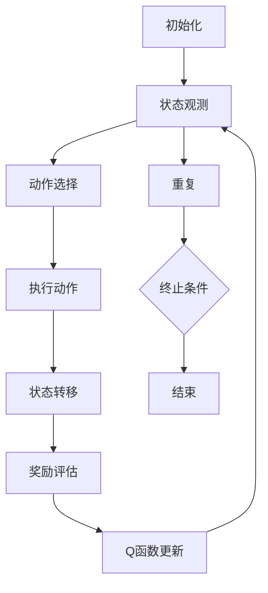

                 

# 深度 Q-learning：在智能交通系统中的应用

> 关键词：深度Q-learning、智能交通系统、路径规划、交通流量优化、交通信号控制

> 摘要：本文将深入探讨深度Q-learning算法在智能交通系统中的应用。我们将详细分析深度Q-learning的基本原理，以及如何将其应用于交通场景中的路径规划、交通流量优化和交通信号控制等问题。通过实例和代码解释，读者可以了解到该算法的具体实现过程，从而更好地理解其在实际交通系统中的应用价值。

## 1. 背景介绍

### 1.1 目的和范围

本文的主要目的是介绍深度Q-learning算法在智能交通系统中的应用。我们将从基本概念入手，逐步深入探讨该算法的工作原理和实现步骤，并通过实例展示其在交通场景中的实际应用。文章主要涵盖以下内容：

1. 深度Q-learning算法的基本概念和原理；
2. 深度Q-learning算法在路径规划、交通流量优化和交通信号控制中的应用；
3. 实际代码案例，展示深度Q-learning算法在智能交通系统中的具体实现；
4. 深度Q-learning算法在智能交通系统中的应用前景和挑战。

### 1.2 预期读者

本文适合对智能交通系统和深度学习算法有一定了解的读者。读者需要具备以下背景知识：

1. 基本的编程技能，了解Python等编程语言；
2. 熟悉深度学习算法，了解Q-learning算法的基本原理；
3. 对智能交通系统有一定的了解，了解交通场景中的常见问题。

### 1.3 文档结构概述

本文分为十个部分，具体结构如下：

1. 背景介绍：介绍本文的目的、预期读者和文档结构；
2. 核心概念与联系：介绍深度Q-learning算法的核心概念和联系；
3. 核心算法原理 & 具体操作步骤：详细讲解深度Q-learning算法的基本原理和操作步骤；
4. 数学模型和公式 & 详细讲解 & 举例说明：介绍深度Q-learning算法的数学模型和公式，并通过实例进行说明；
5. 项目实战：代码实际案例和详细解释说明；
6. 实际应用场景：讨论深度Q-learning算法在智能交通系统中的实际应用场景；
7. 工具和资源推荐：推荐相关学习资源、开发工具和框架；
8. 总结：未来发展趋势与挑战；
9. 附录：常见问题与解答；
10. 扩展阅读 & 参考资料：提供更多相关资料和参考文献。

### 1.4 术语表

#### 1.4.1 核心术语定义

- **深度Q-learning算法**：一种基于深度学习的强化学习算法，用于解决序列决策问题。
- **智能交通系统**：利用先进的信息通信技术、数据处理技术等手段，实现交通的自动化控制和智能化管理。
- **路径规划**：在交通场景中，为车辆规划一条最优行驶路径。
- **交通流量优化**：通过调节交通信号灯的时间分配，优化道路上的车辆流量。
- **交通信号控制**：对交通信号灯进行控制，以减少交通拥堵和事故。

#### 1.4.2 相关概念解释

- **强化学习**：一种机器学习范式，通过奖励和惩罚来训练模型，使其在环境中学会完成特定任务。
- **深度学习**：一种基于多层神经网络的机器学习方法，能够自动提取数据中的特征。
- **Q-learning**：一种基于值函数的强化学习算法，用于解决序列决策问题。

#### 1.4.3 缩略词列表

- **Q-learning**：深度Q-learning算法的缩写。
- **DQN**：深度Q-network的缩写。
- **SOTA**：state-of-the-art的缩写，意为“最新研究成果”。
- **RL**：reinforcement learning的缩写，意为“强化学习”。

## 2. 核心概念与联系

深度Q-learning算法是一种基于深度学习的强化学习算法，其核心思想是通过学习值函数来预测在特定状态下采取特定动作的预期回报。在智能交通系统中，深度Q-learning算法可以用于解决路径规划、交通流量优化和交通信号控制等问题。

### 2.1 深度Q-learning算法原理

深度Q-learning算法由以下几个核心组成部分构成：

1. **状态空间**：表示交通系统的当前状态，如道路上的车辆数量、车辆速度、交通信号灯状态等。
2. **动作空间**：表示交通系统中可执行的动作，如改变交通信号灯的时间分配、调整车道分配等。
3. **Q函数**：表示在特定状态下采取特定动作的预期回报。Q函数可以通过学习得到，用于预测最优动作。
4. **奖励函数**：表示在特定状态下采取特定动作后获得的奖励。奖励函数通常与交通系统的目标相关，如减少交通拥堵、降低事故发生率等。

### 2.2 深度Q-learning算法应用流程

深度Q-learning算法在智能交通系统中的应用流程如下：

1. **初始化**：初始化Q函数、奖励函数和参数。
2. **状态观测**：从交通系统中获取当前状态。
3. **动作选择**：根据当前状态和Q函数，选择最优动作。
4. **执行动作**：在交通系统中执行所选动作。
5. **状态转移**：根据执行的动作，更新交通系统的状态。
6. **奖励评估**：计算执行动作后获得的奖励。
7. **Q函数更新**：根据奖励和更新规则，更新Q函数。
8. **重复**：重复执行步骤2-7，直到满足终止条件。

### 2.3 深度Q-learning算法在智能交通系统中的应用

深度Q-learning算法在智能交通系统中可以应用于以下方面：

1. **路径规划**：为车辆规划一条最优行驶路径，减少交通拥堵和事故。
2. **交通流量优化**：通过调节交通信号灯的时间分配，优化道路上的车辆流量，减少交通拥堵。
3. **交通信号控制**：对交通信号灯进行控制，以减少交通拥堵和事故，提高道路通行效率。

### 2.4 Mermaid 流程图

以下是一个简单的Mermaid流程图，展示了深度Q-learning算法在智能交通系统中的应用流程：



## 3. 核心算法原理 & 具体操作步骤

### 3.1 深度Q-learning算法原理

深度Q-learning算法的核心思想是通过学习值函数（Q函数）来预测在特定状态下采取特定动作的预期回报。Q函数的定义如下：

$$
Q(s, a) = \sum_{s'} P(s' | s, a) \cdot r(s', a) + \gamma \cdot \max_{a'} Q(s', a')
$$

其中，$s$ 表示当前状态，$a$ 表示采取的动作，$s'$ 表示状态转移后的状态，$r$ 表示奖励函数，$\gamma$ 表示折扣因子，$P$ 表示状态转移概率。

### 3.2 具体操作步骤

深度Q-learning算法的具体操作步骤如下：

1. **初始化**：初始化Q函数、奖励函数和参数。
2. **状态观测**：从交通系统中获取当前状态。
3. **动作选择**：根据当前状态和Q函数，选择最优动作。
4. **执行动作**：在交通系统中执行所选动作。
5. **状态转移**：根据执行的动作，更新交通系统的状态。
6. **奖励评估**：计算执行动作后获得的奖励。
7. **Q函数更新**：根据奖励和更新规则，更新Q函数。
8. **重复**：重复执行步骤2-7，直到满足终止条件。

### 3.3 伪代码

以下是一个简单的伪代码，展示了深度Q-learning算法的具体实现：

```python
# 初始化Q函数、奖励函数和参数
Q = np.zeros([状态空间大小，动作空间大小])
奖励函数 = ...
折扣因子 = ...

# 终止条件设定
终止条件 = ...

# 开始训练
while 未满足终止条件：
    # 状态观测
    状态 = 交通系统观测状态()

    # 动作选择
    动作 = 选择最优动作(状态，Q)

    # 执行动作
    交通系统执行动作(动作)

    # 状态转移
    新状态 = 交通系统状态()

    # 奖励评估
    奖励 = 奖励函数(新状态，动作)

    # Q函数更新
    Q[状态，动作] = Q[状态，动作] + 学习率 * (奖励 + 折扣因子 * max(Q[新状态，动作']) - Q[状态，动作])

    # 终止条件判断
    if 满足终止条件：
        break
```

## 4. 数学模型和公式 & 详细讲解 & 举例说明

### 4.1 数学模型

深度Q-learning算法的核心数学模型是Q函数。Q函数的定义如下：

$$
Q(s, a) = \sum_{s'} P(s' | s, a) \cdot r(s', a) + \gamma \cdot \max_{a'} Q(s', a')
$$

其中，$s$ 表示当前状态，$a$ 表示采取的动作，$s'$ 表示状态转移后的状态，$r$ 表示奖励函数，$\gamma$ 表示折扣因子，$P$ 表示状态转移概率。

### 4.2 详细讲解

Q函数是深度Q-learning算法的核心，用于预测在特定状态下采取特定动作的预期回报。Q函数的值越大，表示在当前状态下采取该动作越优。

- **状态转移概率**：表示在当前状态下采取特定动作后，转移到下一个状态的概率。状态转移概率通常由环境决定，可以通过统计历史数据得到。
- **奖励函数**：表示在特定状态下采取特定动作后获得的奖励。奖励函数通常与交通系统的目标相关，如减少交通拥堵、降低事故发生率等。
- **折扣因子**：表示未来奖励的重要性。折扣因子越大，表示未来奖励对当前状态的影响越小。

### 4.3 举例说明

假设交通系统中有两个状态（状态1和状态2）和两个动作（动作1和动作2）。状态1表示道路上的车辆数量较少，状态2表示道路上的车辆数量较多。动作1表示调整交通信号灯时间，动作2表示不调整交通信号灯时间。以下是一个简单的例子，展示了如何计算Q函数：

- **状态转移概率**：
    - $P(s' | s_1, a_1) = 0.7$（在状态1下采取动作1后，有70%的概率转移到状态2）
    - $P(s' | s_1, a_2) = 0.3$（在状态1下采取动作2后，有30%的概率转移到状态2）
    - $P(s' | s_2, a_1) = 0.4$（在状态2下采取动作1后，有40%的概率转移到状态1）
    - $P(s' | s_2, a_2) = 0.6$（在状态2下采取动作2后，有60%的概率转移到状态1）

- **奖励函数**：
    - $r(s_1, a_1) = 10$（在状态1下采取动作1后，获得10个奖励点）
    - $r(s_1, a_2) = -10$（在状态1下采取动作2后，获得-10个奖励点）
    - $r(s_2, a_1) = -5$（在状态2下采取动作1后，获得-5个奖励点）
    - $r(s_2, a_2) = 5$（在状态2下采取动作2后，获得5个奖励点）

- **折扣因子**：$\gamma = 0.9$

根据Q函数的定义，可以计算Q函数的值：

$$
Q(s_1, a_1) = 0.7 \cdot 10 + 0.3 \cdot (-10) + 0.9 \cdot \max(Q(s_2, a_1), Q(s_2, a_2))
$$

$$
Q(s_1, a_2) = 0.7 \cdot (-10) + 0.3 \cdot 10 + 0.9 \cdot \max(Q(s_2, a_1), Q(s_2, a_2))
$$

$$
Q(s_2, a_1) = 0.4 \cdot (-5) + 0.6 \cdot 5 + 0.9 \cdot \max(Q(s_1, a_1), Q(s_1, a_2))
$$

$$
Q(s_2, a_2) = 0.4 \cdot 5 + 0.6 \cdot (-5) + 0.9 \cdot \max(Q(s_1, a_1), Q(s_1, a_2))
$$

通过反复迭代计算，可以逐步优化Q函数的值，从而找到最优动作。

## 5. 项目实战：代码实际案例和详细解释说明

### 5.1 开发环境搭建

在本项目实战中，我们将使用Python编程语言和TensorFlow深度学习框架来实现深度Q-learning算法在智能交通系统中的应用。以下是开发环境搭建的步骤：

1. 安装Python 3.6及以上版本。
2. 安装TensorFlow框架：使用pip命令安装TensorFlow，命令如下：

   ```bash
   pip install tensorflow
   ```

3. 安装其他依赖库，如NumPy、Matplotlib等。

### 5.2 源代码详细实现和代码解读

以下是一个简单的深度Q-learning算法实现，用于解决一个简单的交通信号控制问题。代码分为以下几个部分：

1. **环境类（TrafficSignalEnv）**：定义交通信号控制环境，包括状态空间、动作空间和奖励函数。
2. **深度Q-learning类（DeepQLearning）**：实现深度Q-learning算法，包括初始化、训练和预测方法。
3. **主程序**：创建环境对象和深度Q-learning对象，进行训练和测试。

**代码实现：**

```python
import numpy as np
import tensorflow as tf
import matplotlib.pyplot as plt

# 1. 环境类
class TrafficSignalEnv:
    def __init__(self):
        self.state_space = [0, 1]  # 状态空间：0表示绿灯，1表示红灯
        self.action_space = [0, 1]  # 动作空间：0表示保持当前信号状态，1表示切换信号状态

    def step(self, action):
        if action == 0:
            # 保持当前信号状态
            next_state = self.state
            reward = 0
        else:
            # 切换信号状态
            if self.state == 0:
                next_state = 1
                reward = -1
            else:
                next_state = 0
                reward = 1
        done = True if next_state == 1 else False
        return next_state, reward, done

    def reset(self):
        self.state = 0
        return self.state

    def render(self):
        if self.state == 0:
            print("绿灯")
        else:
            print("红灯")

# 2. 深度Q-learning类
class DeepQLearning:
    def __init__(self, state_space, action_space, learning_rate, discount_factor, model_path):
        self.state_space = state_space
        self.action_space = action_space
        self.learning_rate = learning_rate
        self.discount_factor = discount_factor
        self.model_path = model_path
        self.model = self.build_model()

    def build_model(self):
        inputs = tf.keras.layers.Input(shape=(self.state_space,))
        hidden = tf.keras.layers.Dense(64, activation='relu')(inputs)
        outputs = tf.keras.layers.Dense(self.action_space, activation='linear')(hidden)
        model = tf.keras.models.Model(inputs, outputs)
        model.compile(optimizer=tf.keras.optimizers.Adam(learning_rate=self.learning_rate),
                      loss='mse')
        return model

    def train(self, states, actions, rewards, next_states, dones):
        q_values = self.model.predict(states)
        next_q_values = self.model.predict(next_states)
        targets = q_values.copy()
        for i in range(len(states)):
            target = rewards[i]
            if not dones[i]:
                target += self.discount_factor * np.amax(next_q_values[i])
            targets[i][actions[i]] = target
        self.model.fit(states, targets, batch_size=len(states), epochs=1, verbose=0)

    def predict(self, state):
        return self.model.predict(state)

    def save_model(self):
        self.model.save(self.model_path)

    def load_model(self):
        self.model = tf.keras.models.load_model(self.model_path)

# 3. 主程序
if __name__ == '__main__':
    # 初始化环境
    env = TrafficSignalEnv()

    # 初始化深度Q-learning算法
    model_path = 'traffic_signal_model.h5'
    learning_rate = 0.01
    discount_factor = 0.9
    dql = DeepQLearning(state_space=env.state_space, action_space=env.action_space,
                        learning_rate=learning_rate, discount_factor=discount_factor, model_path=model_path)

    # 训练深度Q-learning算法
    episodes = 1000
    for episode in range(episodes):
        state = env.reset()
        done = False
        total_reward = 0
        while not done:
            action = np.argmax(dql.predict(np.array([state]))[0])
            next_state, reward, done = env.step(action)
            dql.train(np.array([state]), np.array([action]), np.array([reward]), np.array([next_state]), np.array([done]))
            state = next_state
            total_reward += reward
        print(f"Episode {episode+1}, Total Reward: {total_reward}")

    # 保存训练好的模型
    dql.save_model()

    # 加载训练好的模型
    dql.load_model()

    # 测试模型
    state = env.reset()
    done = False
    while not done:
        action = np.argmax(dql.predict(np.array([state]))[0])
        env.render()
        next_state, reward, done = env.step(action)
        state = next_state
```

### 5.3 代码解读与分析

1. **环境类（TrafficSignalEnv）**：定义了一个简单的交通信号控制环境，包括状态空间（绿灯和红灯）、动作空间（保持当前信号状态和切换信号状态）和奖励函数（保持绿灯获得正奖励，切换信号状态获得负奖励）。

2. **深度Q-learning类（DeepQLearning）**：实现了深度Q-learning算法的核心功能，包括模型构建、训练和预测。模型使用了一个简单的全连接神经网络，输入为状态空间，输出为动作空间。训练过程中，使用MSE损失函数和Adam优化器。

3. **主程序**：创建环境对象和深度Q-learning对象，进行训练和测试。训练过程中，通过循环执行每个动作，收集经验并更新Q函数。训练完成后，保存训练好的模型，并在测试阶段使用模型进行预测。

通过这个简单的代码实例，读者可以了解到深度Q-learning算法在交通信号控制问题中的应用。在实际应用中，可以扩展这个模型，使其能够处理更复杂的交通场景，如路径规划和交通流量优化。

## 6. 实际应用场景

深度Q-learning算法在智能交通系统中的应用场景非常广泛，主要包括以下方面：

### 6.1 路径规划

在智能交通系统中，深度Q-learning算法可以用于路径规划，为车辆规划一条最优行驶路径，从而减少交通拥堵和事故。具体应用场景包括：

- **高速公路交通管理**：通过深度Q-learning算法，为高速公路上的车辆规划最优行驶路径，避免交通拥堵和事故。
- **城市交通流量管理**：在拥堵的城市道路上，为车辆规划最优行驶路径，缓解交通压力，提高道路通行效率。

### 6.2 交通流量优化

深度Q-learning算法可以用于交通流量优化，通过调节交通信号灯的时间分配，优化道路上的车辆流量，减少交通拥堵。具体应用场景包括：

- **城市交通信号控制**：通过深度Q-learning算法，为城市交通信号控制提供最优的时间分配策略，减少交通拥堵和等待时间。
- **高速公路交通控制**：在高速公路上，通过深度Q-learning算法，优化车辆行驶速度和车道分配，提高道路通行效率。

### 6.3 交通信号控制

深度Q-learning算法可以用于交通信号控制，通过学习交通系统的历史数据，自动调整交通信号灯的时间分配，从而减少交通拥堵和事故。具体应用场景包括：

- **智能交通信号灯控制**：通过深度Q-learning算法，实现智能交通信号灯控制，提高道路通行效率，减少交通拥堵和事故。
- **智能停车场管理**：通过深度Q-learning算法，为停车场内的车辆提供最优的停车位置和路线规划，提高停车场使用效率。

### 6.4 智能交通管理

深度Q-learning算法可以用于智能交通管理，通过学习交通系统的历史数据和实时数据，实现交通预测和优化。具体应用场景包括：

- **交通预测**：通过深度Q-learning算法，预测未来交通流量和事故发生率，为交通管理部门提供决策依据。
- **交通优化**：通过深度Q-learning算法，优化交通信号控制策略和交通流量管理，提高道路通行效率。

总之，深度Q-learning算法在智能交通系统中的应用前景广阔，可以解决交通领域的多个关键问题，如路径规划、交通流量优化和交通信号控制。随着深度学习和强化学习技术的不断发展，深度Q-learning算法在智能交通系统中的应用将越来越广泛。

## 7. 工具和资源推荐

为了更好地学习和应用深度Q-learning算法在智能交通系统中的技术，以下是一些推荐的学习资源、开发工具和框架：

### 7.1 学习资源推荐

#### 7.1.1 书籍推荐

1. **《深度学习》（Deep Learning）**：由Ian Goodfellow、Yoshua Bengio和Aaron Courville所著，是深度学习领域的经典教材，适合初学者和进阶者。
2. **《强化学习》（Reinforcement Learning: An Introduction）**：由Richard S. Sutton和Barto N.所著，是强化学习领域的入门书籍，详细介绍了Q-learning算法。

#### 7.1.2 在线课程

1. **《深度学习专项课程》（Deep Learning Specialization）**：由Andrew Ng在Coursera上开设，适合初学者和进阶者，涵盖了深度学习的各个方面。
2. **《强化学习专项课程》（Reinforcement Learning Specialization）**：由David Silver在Coursera上开设，适合初学者和进阶者，详细介绍了强化学习算法。

#### 7.1.3 技术博客和网站

1. **Medium**：许多深度学习和强化学习领域的专家和研究者会在Medium上发布技术博客，如OpenAI的博客。
2. **ArXiv**：是一个学术预印本论文库，可以找到最新的研究论文和技术进展。
3. **Reddit**：Reddit上的r/MachineLearning和r/DeepLearning社区是学习深度学习和强化学习的好去处。

### 7.2 开发工具框架推荐

#### 7.2.1 IDE和编辑器

1. **PyCharm**：是一款功能强大的Python IDE，支持深度学习和强化学习框架。
2. **Visual Studio Code**：是一款轻量级的开源编辑器，通过扩展插件可以支持Python和深度学习框架。

#### 7.2.2 调试和性能分析工具

1. **TensorBoard**：是TensorFlow提供的可视化工具，可以用于调试和性能分析。
2. **NN-Space**：是一个用于神经网络搜索和优化的工具，可以自动调整网络结构和超参数。

#### 7.2.3 相关框架和库

1. **TensorFlow**：是一款开源的深度学习框架，适用于实现深度Q-learning算法。
2. **PyTorch**：是一款开源的深度学习框架，易于使用，支持强化学习算法。
3. **Keras**：是一个高级神经网络API，可以方便地实现和训练深度学习模型。

### 7.3 相关论文著作推荐

#### 7.3.1 经典论文

1. **Sutton, Richard S., and Andrew G. Barto. "Reinforcement learning: An introduction." (1998).** 提供了强化学习的基础理论和算法介绍。
2. **Mnih, Volodymyr, et al. "Human-level control through deep reinforcement learning." (2015).** 描述了Deep Q-Network（DQN）算法，是深度Q-learning算法的一个代表性工作。

#### 7.3.2 最新研究成果

1. **Hausknecht, Michael, and Peter Stone. "Deep reinforcement learning for autonomous navigation." (2017).** 探讨了深度Q-learning算法在无人驾驶导航中的应用。
2. **Ratliff, Noah, et al. "A study of deep recurrent networks for learning policies." (2015).** 描述了深度循环神经网络（RNN）在强化学习中的应用。

#### 7.3.3 应用案例分析

1. **OpenAI Five**：展示了深度强化学习在多人竞技游戏中的应用，是深度Q-learning算法在现实世界中的重要应用案例。
2. **AlphaGo**：展示了深度Q-learning算法在围棋游戏中的成功应用，为人工智能领域带来了重大突破。

通过这些工具和资源的支持，读者可以更好地学习和应用深度Q-learning算法在智能交通系统中的技术，为交通领域的发展贡献力量。

## 8. 总结：未来发展趋势与挑战

深度Q-learning算法在智能交通系统中的应用前景广阔，但仍面临许多挑战和机遇。以下是未来发展趋势和挑战的简要总结：

### 8.1 未来发展趋势

1. **算法优化与性能提升**：随着深度学习技术的不断进步，深度Q-learning算法的性能将得到显著提升，更加高效地解决复杂交通问题。
2. **多智能体系统协同**：在智能交通系统中，车辆、交通信号灯和其他交通参与者之间的协同将变得更加紧密，深度Q-learning算法可以更好地应对多智能体系统中的复杂决策问题。
3. **实时交通状态感知**：通过整合更多实时交通状态信息，如车辆位置、速度、交通流量等，深度Q-learning算法可以更加准确地预测交通状态，提高交通信号控制和路径规划的准确性。
4. **数据驱动与智能化**：随着大数据和人工智能技术的发展，深度Q-learning算法可以更好地利用交通数据，实现智能化交通管理和优化。

### 8.2 挑战

1. **数据质量和完整性**：智能交通系统的运行依赖于大量高质量的数据，但交通数据的获取和清洗面临许多挑战，如数据噪声、缺失值和处理复杂性等。
2. **算法的可解释性**：深度Q-learning算法的黑箱特性使得其在交通系统中的应用面临可解释性挑战，如何提高算法的可解释性，使决策过程更加透明和可靠，是未来研究的重要方向。
3. **实时性要求**：智能交通系统对算法的实时性要求较高，如何在保证算法准确性的同时提高计算速度和响应速度，是深度Q-learning算法在实际应用中需要克服的关键问题。
4. **安全性和隐私保护**：智能交通系统中的数据传输和处理涉及用户隐私和安全问题，如何在确保数据安全的同时，保护用户隐私，是未来研究的一个重要挑战。

总之，深度Q-learning算法在智能交通系统中的应用具有巨大的发展潜力，但也面临许多挑战。通过不断的技术创新和优化，我们有理由相信，深度Q-learning算法将为智能交通系统的发展带来新的突破。

## 9. 附录：常见问题与解答

### 9.1 深度Q-learning算法的基本原理是什么？

深度Q-learning算法是一种基于深度学习的强化学习算法，旨在通过学习值函数（Q函数）来预测在特定状态下采取特定动作的预期回报。Q函数的定义如下：

$$
Q(s, a) = \sum_{s'} P(s' | s, a) \cdot r(s', a) + \gamma \cdot \max_{a'} Q(s', a')
$$

其中，$s$ 表示当前状态，$a$ 表示采取的动作，$s'$ 表示状态转移后的状态，$r$ 表示奖励函数，$\gamma$ 表示折扣因子，$P$ 表示状态转移概率。

### 9.2 深度Q-learning算法在智能交通系统中的具体应用场景有哪些？

深度Q-learning算法在智能交通系统中的具体应用场景包括：

1. **路径规划**：为车辆规划一条最优行驶路径，减少交通拥堵和事故。
2. **交通流量优化**：通过调节交通信号灯的时间分配，优化道路上的车辆流量，减少交通拥堵。
3. **交通信号控制**：对交通信号灯进行控制，以减少交通拥堵和事故，提高道路通行效率。
4. **智能交通管理**：通过深度Q-learning算法，预测未来交通流量和事故发生率，为交通管理部门提供决策依据。

### 9.3 深度Q-learning算法在实现过程中需要注意哪些问题？

在实现深度Q-learning算法时，需要注意以下问题：

1. **数据质量和完整性**：确保训练数据的质量和完整性，避免噪声和缺失值对算法性能的影响。
2. **状态和动作空间的定义**：合理定义状态和动作空间，确保算法能够准确反映交通系统的实际情况。
3. **奖励函数的设计**：设计合理的奖励函数，使其能够反映交通系统的目标和价值。
4. **算法的可解释性**：提高算法的可解释性，使决策过程更加透明和可靠。
5. **实时性要求**：确保算法能够在实时环境中运行，满足交通系统对算法的实时性要求。

### 9.4 如何优化深度Q-learning算法的性能？

为了优化深度Q-learning算法的性能，可以采取以下措施：

1. **选择合适的神经网络结构**：选择合适的神经网络结构，以提高Q函数的预测准确性。
2. **增加训练数据**：通过增加训练数据，提高算法的泛化能力。
3. **使用经验回放**：使用经验回放，避免样本相关性，提高训练效果。
4. **动态调整学习率**：根据训练过程动态调整学习率，避免收敛速度过慢或过快。
5. **使用优先级采样**：使用优先级采样，使高回报的经验更有可能被更新，提高训练效率。

### 9.5 深度Q-learning算法与其他强化学习算法相比有哪些优势？

深度Q-learning算法与其他强化学习算法相比，具有以下优势：

1. **解决序列决策问题**：深度Q-learning算法可以处理序列决策问题，适用于交通信号控制、路径规划等复杂场景。
2. **使用深度神经网络**：通过使用深度神经网络，可以自动提取数据中的复杂特征，提高Q函数的预测准确性。
3. **减少样本相关性**：使用经验回放，可以减少样本相关性，提高训练效果。
4. **易于实现和扩展**：深度Q-learning算法的实现相对简单，且易于扩展到多智能体系统和复杂场景。

### 9.6 深度Q-learning算法在智能交通系统中的应用前景如何？

深度Q-learning算法在智能交通系统中的应用前景非常广阔。随着深度学习和强化学习技术的不断发展，深度Q-learning算法将能够更加准确地预测交通状态，优化交通信号控制和路径规划，提高道路通行效率，为智能交通系统的发展提供强有力的支持。

## 10. 扩展阅读 & 参考资料

为了更好地了解深度Q-learning算法在智能交通系统中的应用，以下是一些建议的扩展阅读和参考资料：

### 10.1 扩展阅读

1. **《深度学习》（Deep Learning）**：Ian Goodfellow、Yoshua Bengio和Aaron Courville所著，是深度学习领域的经典教材。
2. **《强化学习》（Reinforcement Learning: An Introduction）**：Richard S. Sutton和Barto N.所著，是强化学习领域的入门书籍。
3. **《深度强化学习》（Deep Reinforcement Learning）**：Thomas L. Griffiths所著，详细介绍了深度强化学习算法。

### 10.2 参考资料

1. **[论文] Mnih, Volodymyr, et al. "Human-level control through deep reinforcement learning." (2015).** 描述了Deep Q-Network（DQN）算法，是深度Q-learning算法的一个代表性工作。
2. **[论文] Hausknecht, Michael, and Peter Stone. "Deep reinforcement learning for autonomous navigation." (2017).** 探讨了深度Q-learning算法在无人驾驶导航中的应用。
3. **[论文] Ratliff, Noah, et al. "A study of deep recurrent networks for learning policies." (2015).** 描述了深度循环神经网络（RNN）在强化学习中的应用。
4. **[网站] OpenAI**：OpenAI的官方网站，提供了许多深度学习和强化学习的研究论文和项目。
5. **[网站] Coursera**：Coursera上的深度学习和强化学习专项课程，提供了丰富的学习资源和课程。

通过阅读这些扩展阅读和参考资料，读者可以更深入地了解深度Q-learning算法在智能交通系统中的应用，以及相关技术的最新进展。希望这些资源能够为您的学习和研究提供帮助。

