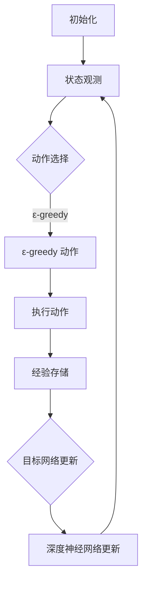

                 

# 深度 Q-learning：在智能城市构建中的应用

> **关键词：** 智能城市、深度 Q-learning、强化学习、决策支持系统、交通优化、资源分配

> **摘要：** 本文深入探讨了深度 Q-learning 算法在智能城市构建中的应用。通过对其原理、实现步骤和实际案例的分析，本文揭示了深度 Q-learning 如何通过高效决策支持系统，实现交通优化和资源分配，从而推动智能城市的建设与发展。

## 1. 背景介绍

### 1.1 目的和范围

本文旨在介绍深度 Q-learning 算法在智能城市构建中的应用，重点分析其在交通优化和资源分配方面的实际应用价值。文章将结合具体案例，详细阐述深度 Q-learning 算法的原理、实现步骤以及在实际场景中的应用效果。

### 1.2 预期读者

本文适合对智能城市和深度 Q-learning 算法有一定了解的读者，包括计算机科学、人工智能、交通工程等相关领域的专业人员和研究人员。

### 1.3 文档结构概述

本文结构如下：

1. 背景介绍：介绍智能城市和深度 Q-learning 算法的概念及应用背景。
2. 核心概念与联系：介绍深度 Q-learning 算法的基本原理和架构。
3. 核心算法原理 & 具体操作步骤：详细讲解深度 Q-learning 算法的实现步骤和伪代码。
4. 数学模型和公式 & 详细讲解 & 举例说明：分析深度 Q-learning 算法中的数学模型和公式，并结合实例进行说明。
5. 项目实战：通过实际案例，展示深度 Q-learning 算法在智能城市中的应用。
6. 实际应用场景：讨论深度 Q-learning 算法在智能城市中的实际应用场景。
7. 工具和资源推荐：推荐相关学习资源和开发工具。
8. 总结：对未来发展趋势与挑战进行展望。
9. 附录：常见问题与解答。
10. 扩展阅读 & 参考资料：提供进一步阅读的建议和参考资料。

### 1.4 术语表

#### 1.4.1 核心术语定义

- **智能城市**：利用物联网、大数据、人工智能等技术手段，实现城市资源高效利用、环境友好、公共服务便捷的城市形态。
- **深度 Q-learning**：一种基于深度神经网络的强化学习算法，用于求解复杂的决策问题。
- **强化学习**：一种机器学习范式，通过不断尝试和反馈来学习如何做出最优决策。
- **交通优化**：通过优化交通流，提高道路通行效率，减少拥堵和交通事故。
- **资源分配**：合理分配城市资源，如能源、水资源等，以满足城市居民的需求。

#### 1.4.2 相关概念解释

- **深度神经网络（DNN）**：一种多层神经网络，用于对复杂函数进行建模和预测。
- **强化信号（Reward）**：在强化学习中，表示系统对当前决策的奖励或惩罚。
- **探索与利用（Exploration and Exploitation）**：在强化学习中，探索新策略以获取更多信息，同时利用已有知识以获得最大收益。

#### 1.4.3 缩略词列表

- **DNN**：深度神经网络
- **RL**：强化学习
- **Q-learning**：一种基于值函数的强化学习算法
- **SARSA**：一种基于策略的强化学习算法
- **DDPG**：深度确定性策略梯度算法

## 2. 核心概念与联系

在智能城市构建中，深度 Q-learning 算法作为一种高效的决策支持工具，发挥着重要作用。为了更好地理解其原理和应用，我们首先需要了解深度 Q-learning 算法的基本概念和架构。

### 2.1 深度 Q-learning 算法原理

深度 Q-learning（DQN）算法是基于 Q-learning 算法的一种改进，它利用深度神经网络（DNN）来近似值函数，从而在复杂环境中进行决策。具体来说，DQN 算法包括以下几个关键组成部分：

1. **状态（State）**：描述智能体当前所处的环境。
2. **动作（Action）**：智能体可以采取的行为。
3. **值函数（Value Function）**：表示在给定状态下，采取某个动作所能获得的期望奖励。
4. **策略（Policy）**：智能体根据值函数选择动作的策略。

在 DQN 算法中，深度神经网络用于学习值函数，其输入为当前状态，输出为对应动作的值。通过不断更新神经网络权重，使得智能体能够在复杂环境中做出最优决策。

### 2.2 深度 Q-learning 算法架构

深度 Q-learning 算法的架构包括以下几个关键模块：

1. **经验回放缓冲区（Experience Replay Buffer）**：用于存储智能体在环境中交互的经验，以避免样本偏差。
2. **目标网络（Target Network）**：用于稳定值函数学习过程，与主网络共享权重，但独立更新。
3. **学习率（Learning Rate）**：用于控制神经网络权重的更新速度。
4. **折扣因子（Discount Factor）**：用于权衡当前和未来的奖励，避免过度关注短期奖励。

### 2.3 深度 Q-learning 算法流程

深度 Q-learning 算法的流程如下：

1. **初始化**：初始化深度神经网络、经验回放缓冲区、目标网络等参数。
2. **状态观测**：智能体观察当前状态。
3. **动作选择**：根据当前状态和策略选择动作。
4. **执行动作**：智能体在环境中执行所选动作，获得新的状态和奖励。
5. **经验存储**：将当前状态、动作、奖励和新状态存储到经验回放缓冲区。
6. **目标网络更新**：定期更新目标网络权重，以稳定值函数学习过程。
7. **深度神经网络更新**：根据经验回放缓冲区中的样本，更新深度神经网络权重。
8. **重复步骤 2-7**：继续在环境中进行交互，直至达到预定目标。

### 2.4 深度 Q-learning 算法 Mermaid 流程图

以下是一个简单的 Mermaid 流程图，展示深度 Q-learning 算法的流程：

通过以上分析，我们可以看到深度 Q-learning 算法在智能城市构建中的应用前景。接下来，我们将进一步探讨深度 Q-learning 算法的核心算法原理和具体实现步骤。|<sop|>

