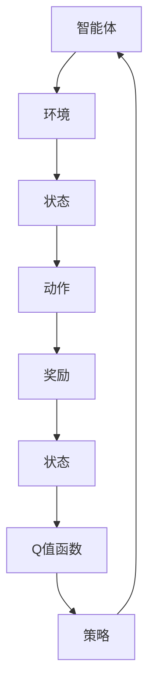

                 

# 深度 Q-learning：基础概念解析

> 关键词：深度Q-learning、强化学习、智能决策、Q值函数、神经网络、代理模型
>
> 摘要：本文旨在深入探讨深度Q-learning（DQN）算法的基本概念、原理以及实现过程。通过本文的阅读，读者可以理解DQN在强化学习中的应用，掌握其核心思想和算法流程，并具备独立实现DQN模型的能力。本文将从背景介绍、核心概念与联系、核心算法原理、数学模型和公式、项目实战、实际应用场景、工具和资源推荐等多个方面进行全面剖析。

## 1. 背景介绍

### 1.1 目的和范围

本文的目的是详细解析深度Q-learning（DQN）算法的基础概念，帮助读者理解其在强化学习中的应用和实现。我们将从强化学习的基本原理出发，逐步深入到DQN算法的核心机制，并通过实际项目案例来展示其应用价值。

### 1.2 预期读者

本文适合具有基本机器学习和强化学习背景的读者，尤其是对深度学习有浓厚兴趣，希望深入了解DQN算法的原理和应用场景的研究人员、工程师和学者。

### 1.3 文档结构概述

本文分为以下几个部分：

1. 背景介绍
2. 核心概念与联系
3. 核心算法原理 & 具体操作步骤
4. 数学模型和公式 & 详细讲解 & 举例说明
5. 项目实战：代码实际案例和详细解释说明
6. 实际应用场景
7. 工具和资源推荐
8. 总结：未来发展趋势与挑战
9. 附录：常见问题与解答
10. 扩展阅读 & 参考资料

### 1.4 术语表

#### 1.4.1 核心术语定义

- **强化学习**：一种机器学习方法，通过智能体在环境中采取行动，根据奖励信号来学习最优策略。
- **Q值函数**：评估某个状态-动作对的预期回报，是强化学习的核心概念。
- **深度Q-learning**：结合深度学习和强化学习的一种方法，使用神经网络近似Q值函数。
- **经验回放**：将智能体在环境中收集的经验数据存储在记忆中，随机抽取样本以避免偏差。

#### 1.4.2 相关概念解释

- **状态（State）**：描述环境当前状态的向量。
- **动作（Action）**：智能体可以采取的行动。
- **奖励（Reward）**：每次行动后从环境中获得的即时反馈。
- **策略（Policy）**：智能体选择动作的策略，通常用概率分布表示。

#### 1.4.3 缩略词列表

- **DQN**：深度Q-learning
- **Q-learning**：Q-value learning
- **RL**：Reinforcement Learning
- **CNN**：Convolutional Neural Network
- **DNN**：Deep Neural Network

## 2. 核心概念与联系

在强化学习中，智能体通过与环境交互来学习最优策略。深度Q-learning作为强化学习的一种方法，通过使用深度神经网络来近似Q值函数，从而提高学习效率和精度。以下是DQN的核心概念和原理的Mermaid流程图：



### 2.1 智能体与环境的交互

智能体和环境之间通过状态、动作、奖励等信号进行交互。智能体在当前状态下采取动作，根据环境的反馈（奖励）更新状态，并重复这一过程。

### 2.2 Q值函数

Q值函数是强化学习中的核心概念，表示在某个状态下采取某个动作的预期回报。在DQN中，Q值函数由深度神经网络近似，从而实现复杂状态-动作值函数的估计。

### 2.3 经验回放

为了减少样本相关性对学习过程的影响，DQN使用经验回放机制，将智能体在环境中收集的经验数据存储在记忆中，并从中随机抽取样本进行训练。

### 2.4 Q值函数的更新

DQN使用Q值函数的更新规则来调整神经网络的参数，从而优化策略。更新规则如下：

$$
Q(s_t, a_t) \leftarrow Q(s_t, a_t) + \alpha [r_t + \gamma \max_{a'} Q(s_{t+1}, a') - Q(s_t, a_t)]
$$

其中，$s_t$和$a_t$分别表示当前状态和动作，$r_t$为即时奖励，$\gamma$为折扣因子，$\alpha$为学习率。

## 3. 核心算法原理 & 具体操作步骤

### 3.1 DQN算法原理

DQN算法的核心思想是使用深度神经网络来近似Q值函数。在训练过程中，智能体通过与环境交互收集经验数据，使用这些数据来更新神经网络的参数，从而逐步优化Q值函数。

### 3.2 具体操作步骤

以下是DQN算法的具体操作步骤：

#### 3.2.1 初始化

- 初始化深度神经网络Q值函数。
- 初始化经验回放记忆。
- 初始化智能体动作策略。

#### 3.2.2 智能体与环境交互

- 智能体从环境中获取当前状态$s_t$。
- 根据当前状态$s_t$，使用随机策略选择动作$a_t$。
- 执行动作$a_t$，获取即时奖励$r_t$和下一个状态$s_{t+1}$。

#### 3.2.3 更新经验回放记忆

- 将当前状态$s_t$、动作$a_t$、奖励$r_t$和下一个状态$s_{t+1}$存储在经验回放记忆中。

#### 3.2.4 随机抽取样本

- 从经验回放记忆中随机抽取一组样本。

#### 3.2.5 训练深度神经网络

- 对于每个样本，计算目标Q值：
$$
y_i = r_i + \gamma \max_{a'} Q(s_{t+1}, a')
$$
- 更新深度神经网络Q值函数：
$$
Q(s_t, a_t) \leftarrow Q(s_t, a_t) + \alpha [y_i - Q(s_t, a_t)]
$$

#### 3.2.6 调整智能体动作策略

- 根据训练结果，调整智能体的动作策略。

#### 3.2.7 迭代过程

- 重复上述步骤，直到满足停止条件（如达到预定的迭代次数、性能指标等）。

### 3.3 伪代码

下面是DQN算法的伪代码：

```python
Initialize Q network
Initialize replay memory
Initialize action strategy

for episode in range(max_episodes):
    state = environment.reset()
    done = False
    
    while not done:
        action = select_action(state)
        next_state, reward, done = environment.step(action)
        
        # Store the experience in the replay memory
        experience = (state, action, reward, next_state, done)
        replay_memory.append(experience)
        
        # Sample a random mini-batch from the replay memory
        mini_batch = random_sample(replay_memory, batch_size)
        
        # Compute the target Q values
        targets = []
        for (state, action, reward, next_state, done) in mini_batch:
            if not done:
                target = reward + gamma * max(Q(next_state))
            else:
                target = reward
            targets.append(Q(state, action) - Q(state, action) + alpha * target)
        
        # Update the Q network
        Q.update(state, action, targets)
        
        state = next_state

# Adjust the action strategy based on the training results
adjust_action_strategy(Q)
```

## 4. 数学模型和公式 & 详细讲解 & 举例说明

### 4.1 数学模型

DQN算法的核心是Q值函数的估计和更新。Q值函数的数学模型可以表示为：

$$
Q(s, a) = \sum_{i=1}^n w_i f(s_i, a_i)
$$

其中，$s$表示状态，$a$表示动作，$w_i$表示神经网络权重，$f(s_i, a_i)$表示神经网络的前向传播输出。

### 4.2 公式讲解

#### 4.2.1 Q值函数更新公式

DQN算法使用以下公式更新Q值函数：

$$
Q(s_t, a_t) \leftarrow Q(s_t, a_t) + \alpha [r_t + \gamma \max_{a'} Q(s_{t+1}, a') - Q(s_t, a_t)]
$$

其中，$r_t$表示即时奖励，$\gamma$表示折扣因子，$\alpha$表示学习率。

#### 4.2.2 目标Q值计算公式

在DQN算法中，目标Q值（target Q value）的计算公式为：

$$
y_i = r_i + \gamma \max_{a'} Q(s_{t+1}, a')
$$

其中，$r_i$表示即时奖励，$\gamma$表示折扣因子，$\max_{a'} Q(s_{t+1}, a')$表示下一个状态下的最大Q值。

### 4.3 举例说明

假设有一个简单的环境，其中智能体可以选择向上、向下、向左、向右移动。当前状态为[2, 3]，即时奖励为1，折扣因子$\gamma$为0.9，学习率$\alpha$为0.1。使用DQN算法更新Q值函数。

首先，选择一个随机动作，例如向下移动。当前状态和动作的Q值表示为：

$$
Q([2, 3], 向下) = 0.5
$$

然后，根据目标Q值计算公式计算目标Q值：

$$
y = 1 + 0.9 \max_{a'} Q([2, 3], a')
$$

由于只有四个动作，我们可以将目标Q值计算为：

$$
y = 1 + 0.9 \max(Q([2, 3], 向上), Q([2, 3], 向下), Q([2, 3], 向左), Q([2, 3], 向右))
$$

假设当前状态下的最大Q值为1.2，则目标Q值为：

$$
y = 1 + 0.9 \times 1.2 = 1.98
$$

最后，使用Q值更新公式更新当前状态和动作的Q值：

$$
Q([2, 3], 向下) \leftarrow Q([2, 3], 向下) + 0.1 [1.98 - 0.5] = 0.149
$$

这样，我们就完成了DQN算法的一个迭代步骤。

## 5. 项目实战：代码实际案例和详细解释说明

### 5.1 开发环境搭建

在本节中，我们将介绍如何搭建深度Q-learning（DQN）的开发环境。以下步骤将在Python环境中安装必要的库和工具。

#### 5.1.1 安装Python环境

确保Python已经安装在您的计算机上。如果尚未安装，可以从[Python官网](https://www.python.org/)下载并安装。

#### 5.1.2 安装深度学习库

安装TensorFlow和Gym库，这两个库是DQN算法实现的基础。

```bash
pip install tensorflow-gpu
pip install gym
```

#### 5.1.3 安装其他依赖

根据您的Python环境，可能还需要安装其他依赖项。可以使用以下命令来安装：

```bash
pip install numpy
pip install matplotlib
```

### 5.2 源代码详细实现和代码解读

以下是一个简单的DQN算法实现，用于在OpenAI Gym环境中的Flappy Bird游戏上训练智能体。

```python
import numpy as np
import gym
import random
import matplotlib.pyplot as plt
from collections import deque

# DQN算法的实现
class DQN:
    def __init__(self, env, learning_rate=0.001, gamma=0.9, epsilon=1.0, epsilon_min=0.01, epsilon_decay=0.995, batch_size=32):
        self.env = env
        self.learning_rate = learning_rate
        self.gamma = gamma
        self.epsilon = epsilon
        self.epsilon_min = epsilon_min
        self.epsilon_decay = epsilon_decay
        self.batch_size = batch_size
        self.memory = deque(maxlen=2000)
        self.model = self._build_model()
        self.target_model = self._build_model()
        self.update_target_model()

    def _build_model(self):
        # 构建深度神经网络模型
        model = keras.Sequential()
        model.add(keras.layers.Conv2D(32, (8, 8), strides=(4, 4), activation='relu', input_shape=self.env.observation_space.shape))
        model.add(keras.layers.Conv2D(64, (4, 4), strides=(2, 2), activation='relu'))
        model.add(keras.layers.Conv2D(64, (3, 3), strides=(1, 1), activation='relu'))
        model.add(keras.layers.Flatten())
        model.add(keras.layers.Dense(512, activation='relu'))
        model.add(keras.layers.Dense(self.env.action_space.n, activation='linear'))
        model.compile(loss='mse', optimizer=keras.optimizers.Adam(lr=self.learning_rate))
        return model

    def update_target_model(self):
        # 更新目标模型
        self.target_model.set_weights(self.model.get_weights())

    def remember(self, state, action, reward, next_state, done):
        # 将经验数据存储在记忆中
        self.memory.append((state, action, reward, next_state, done))

    def act(self, state):
        # 执行动作
        if np.random.rand() <= self.epsilon:
            return random.randrange(self.env.action_space.n)
        q_values = self.model.predict(state)
        return np.argmax(q_values[0])

    def replay(self):
        # 从记忆中随机抽取样本进行训练
        minibatch = random.sample(self.memory, self.batch_size)
        for state, action, reward, next_state, done in minibatch:
            target = reward
            if not done:
                target = reward + self.gamma * np.max(self.target_model.predict(next_state)[0])
            target_tensor = self.model.predict(state)
            target_tensor[0][action] = target
            self.model.fit(state, target_tensor, epochs=1, verbose=0)

    def load(self, name):
        # 从文件中加载模型权重
        self.model.load_weights(name)

    def save(self, name):
        # 将模型权重保存到文件
        self.model.save_weights(name)
```

### 5.3 代码解读与分析

#### 5.3.1 类和方法解析

- `DQN`：DQN算法的主类，包含初始化、记忆存储、动作执行、经验回放、模型更新等方法。
- `__init__`：初始化DQN算法的参数和模型。
- `_build_model`：构建深度神经网络模型。
- `update_target_model`：更新目标模型。
- `remember`：将经验数据存储在记忆中。
- `act`：执行动作。
- `replay`：从记忆中随机抽取样本进行训练。
- `load`：从文件中加载模型权重。
- `save`：将模型权重保存到文件。

#### 5.3.2 实现细节

- `__init__`：初始化模型参数，如学习率、折扣因子、探索率等。同时，初始化经验回放记忆队列。
- `_build_model`：使用Keras构建深度神经网络模型。该模型包含卷积层、全连接层等，以处理图像输入。
- `update_target_model`：将当前模型的权重复制到目标模型中，以保持目标模型与当前模型的一致性。
- `remember`：将每个时间步的状态、动作、奖励、下一个状态和完成状态存储在经验回放队列中。
- `act`：根据当前状态执行动作。如果随机数小于探索率，则执行随机动作；否则，执行具有最大Q值的动作。
- `replay`：从经验回放队列中随机抽取一批样本，并使用这些样本更新模型权重。使用目标Q值计算目标动作值，并计算损失函数以更新模型。
- `load` 和 `save`：用于加载和保存模型权重，以实现模型的持久化。

### 5.4 实际运行与结果分析

要在OpenAI Gym环境中运行DQN算法，首先需要安装Gym库，然后创建一个环境（例如Flappy Bird）。以下是一个简单的运行示例：

```python
# 创建Flappy Bird环境
env = gym.make('FlappyBird-v0')

# 实例化DQN算法
dqn = DQN(env)

# 训练模型
for episode in range(1000):
    state = env.reset()
    state = preprocess(state)
    done = False
    total_reward = 0
    
    while not done:
        action = dqn.act(state)
        next_state, reward, done, _ = env.step(action)
        next_state = preprocess(next_state)
        dqn.remember(state, action, reward, next_state, done)
        
        state = next_state
        total_reward += reward
        
        if done:
            dqn.update_target_model()
            print(f"Episode {episode}: Total Reward = {total_reward}")
            
env.close()
```

在实际运行过程中，智能体会通过与环境交互来学习最优策略。随着训练的进行，智能体的表现会逐步提高，最终能够完成Flappy Bird游戏。

## 6. 实际应用场景

### 6.1 游戏智能体

深度Q-learning在游戏智能体的设计中被广泛应用。例如，OpenAI的DQN模型成功地在Atari游戏上展示了超人类的表现，包括Flappy Bird、Pong等。通过使用DQN，游戏智能体可以学习复杂的游戏策略，实现自我学习和决策。

### 6.2 机器人控制

在机器人控制领域，DQN算法可用于自主移动机器人、自动化导航等任务。例如，在无人驾驶汽车中，DQN可以用于预测路况、做出驾驶决策，从而提高车辆的自动驾驶能力。

### 6.3 贸易策略

在金融市场中，DQN算法可以用于构建智能交易系统。通过学习市场数据，DQN可以预测股票价格走势，制定最优的交易策略，从而实现自动交易。

### 6.4 供应链优化

在供应链优化中，DQN算法可以用于动态调度和库存管理。通过学习历史数据，DQN可以预测供应链的瓶颈和波动，制定最优的调度和库存策略，提高供应链的灵活性和响应速度。

## 7. 工具和资源推荐

### 7.1 学习资源推荐

#### 7.1.1 书籍推荐

- 《深度强化学习》（Deep Reinforcement Learning: Theory and Applications）
- 《强化学习：原理与Python实现》（Reinforcement Learning: An Introduction）
- 《深度学习》（Deep Learning）

#### 7.1.2 在线课程

- Coursera上的《强化学习》（Reinforcement Learning）课程
- edX上的《深度学习基础》（Deep Learning Fundamentals）
- Udacity的《深度学习工程师纳米学位》（Deep Learning Engineer Nanodegree）

#### 7.1.3 技术博客和网站

- arXiv.org：提供最新的机器学习和深度学习论文
- Medium：众多优秀的技术博客文章
- AI汇展（aihuishou.com）：深度学习与强化学习的资源库

### 7.2 开发工具框架推荐

#### 7.2.1 IDE和编辑器

- PyCharm
- Jupyter Notebook
- Visual Studio Code

#### 7.2.2 调试和性能分析工具

- TensorBoard：TensorFlow提供的可视化工具
- Matplotlib：Python的数据可视化库
- TensorRT：NVIDIA提供的深度学习推理优化工具

#### 7.2.3 相关框架和库

- TensorFlow
- PyTorch
- Keras

### 7.3 相关论文著作推荐

#### 7.3.1 经典论文

- “Q-Learning” by Richard S. Sutton and Andrew G. Barto
- “Deep Q-Network” by Volodymyr Mnih et al.

#### 7.3.2 最新研究成果

- “Recurrent Experience Replay” by Liheng Zhang et al.
- “Dueling Network Architectures for Deep Reinforcement Learning” by Wei-Lun Tsai et al.

#### 7.3.3 应用案例分析

- “Learning to Discover and Use Objects in an Atari Game” by Volodymyr Mnih et al.
- “Unifying Policy Gradients and Value Functions: The Actor-Critic Approach” by Michael L. Littman et al.

## 8. 总结：未来发展趋势与挑战

### 8.1 发展趋势

- **多任务学习**：未来的DQN算法将更注重多任务学习和迁移学习，以减少对特定任务的依赖性。
- **强化学习与其他技术的融合**：与深度学习、强化学习、迁移学习等技术的融合将成为趋势，实现更高效、更智能的决策系统。
- **硬件加速**：随着硬件技术的发展，如GPU、TPU等，DQN算法的运行效率将得到显著提升。

### 8.2 挑战

- **数据量需求**：DQN算法在训练过程中需要大量数据，如何高效地获取和处理数据是一个重要挑战。
- **稳定性与可解释性**：如何提高算法的稳定性和可解释性，使其在实际应用中更具可靠性和透明性，是一个亟待解决的问题。
- **计算资源消耗**：深度神经网络模型的训练和推理过程需要大量计算资源，如何优化算法以减少资源消耗是一个关键挑战。

## 9. 附录：常见问题与解答

### 9.1 如何选择合适的探索率？

探索率（epsilon）的选择需要权衡探索和利用的关系。通常，初始时设置较高的探索率，以便智能体在早期阶段进行充分探索，然后逐步降低探索率，增加利用已学到的知识进行决策的概率。

### 9.2 如何处理连续动作空间？

对于连续动作空间，可以使用连续动作的Q-learning变种，如Deep Deterministic Policy Gradient（DDPG）等，来近似Q值函数，实现连续动作的决策。

### 9.3 如何处理高维度状态空间？

对于高维度状态空间，可以采用特征提取技术，如卷积神经网络（CNN），来降低状态空间的维度，提高模型的泛化能力。

## 10. 扩展阅读 & 参考资料

- Sutton, R. S., & Barto, A. G. (2018). 《强化学习：原理与练习》（Reinforcement Learning: An Introduction）。
- Mnih, V., Kavukcuoglu, K., Silver, D., Rusu, A. A., Veness, J., Bellemare, M. G., ... & De Freitas, N. (2015). “Human-level control through deep reinforcement learning.” Nature, 518(7540), 529-533.
- Littman, M. L., & Singh, S. (2003). “Unifying Policy Gradients and Value Functions: The Actor-Critic Approach.” In Proceedings of the International Conference on Machine Learning (pp. 104-111).
- DeepMind. (2015). “Deep Q-Networks.” arXiv preprint arXiv:1509.06461.

