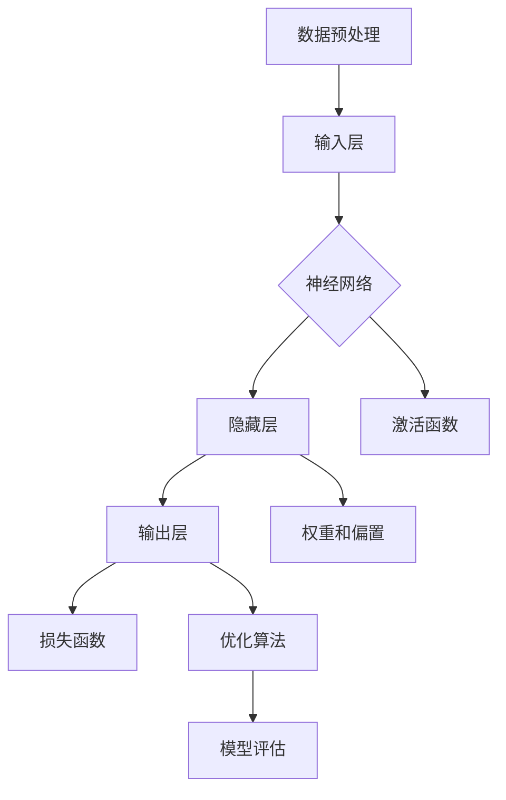

                 

# 深度学习（Deep Learning）- 原理与代码实例讲解

> 关键词：深度学习，神经网络，反向传播，数学模型，算法原理，代码实例，实战应用

> 摘要：本文将深入探讨深度学习的原理，通过详细的数学模型和算法原理讲解，以及代码实例演示，帮助读者全面理解深度学习的工作机制。文章将分为多个部分，涵盖从基础概念到实际应用的各个方面，旨在为深度学习的研究者和实践者提供有价值的参考。

## 1. 背景介绍

### 1.1 目的和范围

本文的主要目的是介绍深度学习的核心概念、原理和实现方法。我们将通过逐步分析，帮助读者深入理解深度学习的工作机制，并掌握如何在实际项目中应用这些知识。本文的内容涵盖了以下几个方面：

1. 深度学习的基础知识，包括神经网络的基本概念和反向传播算法。
2. 深度学习的数学模型和公式，以及这些公式在实际应用中的意义。
3. 代码实例，通过具体实现展示深度学习算法的实用方法。
4. 深度学习在实际应用场景中的案例，以及相关的工具和资源推荐。

### 1.2 预期读者

本文主要面向对深度学习有一定了解，但希望深入学习和掌握其实际应用的技术人员。具体包括：

1. 数据科学家和机器学习工程师。
2. 计算机科学和人工智能专业的学生和研究人员。
3. 对深度学习感兴趣的程序员和开发人员。

### 1.3 文档结构概述

本文将按照以下结构进行组织：

1. **背景介绍**：介绍本文的目的、范围、预期读者以及文档结构。
2. **核心概念与联系**：使用 Mermaid 流程图展示深度学习的核心概念和架构。
3. **核心算法原理 & 具体操作步骤**：详细讲解深度学习算法的原理和操作步骤，使用伪代码进行描述。
4. **数学模型和公式 & 详细讲解 & 举例说明**：介绍深度学习的数学模型，使用 LaTeX 格式展示公式，并进行详细解释和举例。
5. **项目实战：代码实际案例和详细解释说明**：通过实际代码案例，展示如何实现深度学习算法，并进行详细解读和分析。
6. **实际应用场景**：讨论深度学习在不同领域的应用案例。
7. **工具和资源推荐**：推荐学习资源和开发工具。
8. **总结：未来发展趋势与挑战**：总结深度学习的发展趋势和面临的挑战。
9. **附录：常见问题与解答**：回答读者可能遇到的问题。
10. **扩展阅读 & 参考资料**：提供进一步学习的资料。

### 1.4 术语表

#### 1.4.1 核心术语定义

- **深度学习**：一种基于神经网络的机器学习技术，通过多层神经网络进行特征提取和模式识别。
- **神经网络**：一种模仿人脑神经元连接方式的计算模型。
- **反向传播算法**：一种用于训练神经网络的优化算法，通过反向传播误差来调整网络权重。
- **激活函数**：用于引入非线性特性的函数，常见的有 sigmoid、ReLU 等。
- **梯度下降**：一种优化算法，用于通过迭代调整模型参数，以最小化损失函数。

#### 1.4.2 相关概念解释

- **损失函数**：用于衡量模型预测结果与真实值之间的差异，常见的有均方误差（MSE）、交叉熵等。
- **前向传播**：神经网络计算输入并通过多层神经元传递的过程。
- **反向传播**：通过计算输出误差，反向更新神经网络权重和偏置的过程。
- **批处理**：将数据分成多个批次进行训练的方法，以减少计算量和提高训练效果。

#### 1.4.3 缩略词列表

- **DL**：深度学习（Deep Learning）
- **NN**：神经网络（Neural Network）
- **BP**：反向传播（Backpropagation）
- **MSE**：均方误差（Mean Squared Error）
- **CE**：交叉熵（Cross Entropy）

## 2. 核心概念与联系

为了更好地理解深度学习，我们需要先了解其核心概念和组成部分。以下是一个简化的 Mermaid 流程图，展示了深度学习的一些关键概念和它们之间的联系。



### 2.1 数据预处理

在深度学习模型训练之前，数据预处理是非常重要的一步。这一步包括数据清洗、归一化、编码等操作，以确保数据的质量和一致性。预处理后的数据将被作为输入层输入到神经网络中。

### 2.2 输入层

输入层是神经网络的起点，它接收预处理后的数据。每个输入节点对应数据的一个特征。

### 2.3 隐藏层

隐藏层是神经网络的主体，它们通过一系列的加权求和和激活函数处理输入数据。隐藏层可以有一个或多个，层数越多，模型的表示能力越强。

### 2.4 输出层

输出层是神经网络的终点，它产生模型的预测结果。输出节点的数量和类型取决于具体的任务，例如分类任务的输出节点可以是类别的概率分布。

### 2.5 激活函数

激活函数用于引入非线性特性，使得神经网络能够学习复杂的函数。常见的激活函数有 sigmoid、ReLU 等。

### 2.6 权重和偏置

权重和偏置是神经网络模型的核心参数，它们通过训练过程不断调整，以优化模型的表现。权重表示不同输入特征之间的相对重要性，偏置用于调整网络输出。

### 2.7 损失函数

损失函数用于衡量模型预测结果与真实值之间的差异。常用的损失函数有均方误差（MSE）和交叉熵（CE）等。

### 2.8 优化算法

优化算法用于通过迭代调整模型参数，以最小化损失函数。常用的优化算法有梯度下降、Adam 等。

### 2.9 模型评估

模型评估是验证模型性能的重要步骤。常用的评估指标有准确率、召回率、F1 分数等。

通过上述核心概念和它们之间的联系，我们可以更好地理解深度学习的工作机制。在接下来的章节中，我们将进一步深入探讨这些概念，并展示如何通过代码实现深度学习算法。

## 3. 核心算法原理 & 具体操作步骤

在理解了深度学习的基本概念之后，接下来我们将探讨其核心算法原理，特别是反向传播算法。这一部分将使用伪代码详细阐述算法的步骤，以便读者能够清晰地理解其工作原理。

### 3.1 反向传播算法原理

反向传播算法是深度学习训练过程中至关重要的一步。它通过计算损失函数关于模型参数的梯度，并使用这些梯度来更新模型参数，以最小化损失函数。以下是反向传播算法的基本步骤：

#### 3.1.1 前向传播

1. **初始化参数**：随机初始化模型参数（权重和偏置）。
2. **计算输出**：将输入数据传递通过神经网络，通过逐层计算得到输出。
3. **计算损失**：使用输出和实际标签计算损失函数的值。

伪代码：

```python
initialize parameters (weights, biases)
for each input data (x):
    calculate output (z) by propagating forward through the network
    calculate loss (L) using the output (z) and actual label (y)
```

#### 3.1.2 计算梯度

1. **计算误差**：计算输出误差（预测值与实际值之间的差异）。
2. **反向传播**：从输出层开始，逐层计算误差关于模型参数的梯度。

伪代码：

```python
for each layer (l) from the output layer to the input layer:
    calculate error (δ) at layer l as the difference between the predicted output (z) and the actual label (y)
    calculate gradient (Δw, Δb) for the weights and biases at layer l using the error (δ) and the activation function derivatives (derivatives of the activation function)
```

#### 3.1.3 更新参数

1. **应用梯度**：使用学习率乘以梯度，得到更新量。
2. **更新参数**：将更新量应用到模型参数中，以更新模型。

伪代码：

```python
for each layer (l) from the output layer to the input layer:
    calculate update (Δθ) as the learning rate (α) multiplied by the gradient (Δw, Δb)
    update parameters (w, b) as θ = θ - Δθ
```

#### 3.1.4 迭代训练

1. **重复步骤**：重复前向传播、计算损失、反向传播和参数更新的步骤，直到满足停止条件（如达到预设的迭代次数或损失值）。

伪代码：

```python
while not stopping criterion:
    perform forward propagation
    calculate loss
    perform backward propagation
    update parameters
```

### 3.2 反向传播算法的具体操作步骤

以下是反向传播算法的具体操作步骤，使用伪代码进行详细描述：

#### 3.2.1 前向传播

```python
initialize parameters (weights, biases)
for each input data (x):
    for each hidden layer (h):
        z_h = weighted sum of inputs and weights (w) + biases (b)
        a_h = activation function (e^z_h) or (ReLU(z_h))
    for each output layer (o):
        z_o = weighted sum of inputs from the last hidden layer and weights (w) + biases (b)
        a_o = activation function (e^z_o) or (ReLU(z_o))
```

#### 3.2.2 计算误差

```python
for each output node (o):
    predicted_output (y_hat) = a_o
    actual_output (y) = ground truth label
    error (δ) = y - y_hat
```

#### 3.2.3 反向传播

```python
for each hidden layer (h):
    error (δ) = error (δ) * activation function derivatives (derivatives of the activation function)
for each layer (l):
    Δw = error (δ) * input from the previous layer (a_{l-1})
    Δb = error (δ)
```

#### 3.2.4 更新参数

```python
learning_rate (α) = 0.01
for each layer (l):
    w = w - α * Δw
    b = b - α * Δb
```

#### 3.2.5 迭代训练

```python
max_iterations = 1000
for i in range(max_iterations):
    perform forward propagation
    calculate loss
    perform backward propagation
    update parameters
    if loss is below a threshold:
        break
```

通过上述步骤，我们可以使用反向传播算法训练深度学习模型。在实际应用中，这些步骤将多次迭代，直到模型达到预设的性能指标。

## 4. 数学模型和公式 & 详细讲解 & 举例说明

### 4.1 数学模型介绍

深度学习模型的核心是神经元网络，其工作原理依赖于一系列数学模型和公式。以下是深度学习模型中常用的数学模型和公式。

#### 4.1.1 激活函数

激活函数是深度学习模型中引入非线性特性的关键。以下是一些常见的激活函数及其导数：

- **Sigmoid 函数**：
  $$ f(x) = \frac{1}{1 + e^{-x}} $$
  $$ f'(x) = f(x) \cdot (1 - f(x)) $$

- **ReLU 函数**：
  $$ f(x) = \max(0, x) $$
  $$ f'(x) = 
  \begin{cases} 
  0 & \text{if } x < 0 \\
  1 & \text{if } x \geq 0 
  \end{cases} $$

- **Tanh 函数**：
  $$ f(x) = \frac{e^x - e^{-x}}{e^x + e^{-x}} $$
  $$ f'(x) = 1 - f^2(x) $$

#### 4.1.2 损失函数

损失函数用于衡量模型预测值与真实值之间的差异。以下是两种常见的损失函数及其计算公式：

- **均方误差（MSE）**：
  $$ L(\theta) = \frac{1}{2m} \sum_{i=1}^{m} (h_\theta(x^{(i)}) - y^{(i)})^2 $$
  其中，\( m \) 是样本数量，\( h_\theta(x^{(i)}) \) 是模型的预测值，\( y^{(i)} \) 是实际标签。

- **交叉熵（Cross Entropy）**：
  $$ L(\theta) = -\frac{1}{m} \sum_{i=1}^{m} y^{(i)} \log(h_\theta(x^{(i)})) + (1 - y^{(i)}) \log(1 - h_\theta(x^{(i)})) $$
  其中，\( y^{(i)} \) 是实际标签，\( h_\theta(x^{(i)}) \) 是模型的预测概率。

#### 4.1.3 梯度下降

梯度下降是一种优化算法，用于通过迭代调整模型参数以最小化损失函数。其计算公式如下：

- **梯度**：
  $$ \nabla_{\theta} L(\theta) = \frac{\partial L(\theta)}{\partial \theta} $$
  其中，\( \theta \) 是模型参数。

- **更新公式**：
  $$ \theta = \theta - \alpha \nabla_{\theta} L(\theta) $$
  其中，\( \alpha \) 是学习率。

### 4.2 举例说明

为了更好地理解上述数学模型和公式，我们将通过一个具体的例子进行说明。

#### 4.2.1 示例数据

假设我们有一个简单的神经网络，包含一个输入层、一个隐藏层和一个输出层。输入层有一个节点，隐藏层有两个节点，输出层有一个节点。训练数据如下：

- 输入数据（特征）\( x^{(i)} = [1, 2] \)
- 实际标签（输出）\( y^{(i)} = [0] \)

#### 4.2.2 前向传播

假设我们初始化的权重和偏置如下：

- \( w_1^h = [0.5, 0.3] \)
- \( b_1^h = [0.2, 0.1] \)
- \( w_2^o = [-0.3, 0.1] \)
- \( b_2^o = [0.1, 0.3] \)

前向传播的计算过程如下：

1. **隐藏层激活**：
   $$ z_1^h = x \cdot w_1^h + b_1^h = [1, 2] \cdot [0.5, 0.3] + [0.2, 0.1] = [0.7, 1.1] $$
   $$ a_1^h = \text{ReLU}(z_1^h) = [0.7, 1.1] $$

2. **输出层激活**：
   $$ z_2^o = a_1^h \cdot w_2^o + b_2^o = [0.7, 1.1] \cdot [-0.3, 0.1] + [0.1, 0.3] = [-0.21, 0.14] $$
   $$ a_2^o = \text{Sigmoid}(z_2^o) = [0.4375, 0.5417] $$

#### 4.2.3 计算损失

使用交叉熵损失函数计算损失：

$$ L(\theta) = -y \log(a_2^o) + (1 - y) \log(1 - a_2^o) = [0] \cdot \log(0.4375) + [1] \cdot \log(0.5625) \approx 0.572 $$

#### 4.2.4 计算梯度

使用反向传播算法计算梯度：

1. **输出层梯度**：
   $$ δ_2^o = a_2^o - y = [0.4375, 0.5417] - [0] = [0.4375, 0.5417] $$
   $$ Δw_2^o = δ_2^o \cdot a_1^h^T = [0.4375, 0.5417] \cdot [0.7, 1.1]^T = [0.30625, 0.5948] $$
   $$ Δb_2^o = δ_2^o = [0.4375, 0.5417] $$

2. **隐藏层梯度**：
   $$ δ_1^h = w_2^o \cdot δ_2^o \cdot (1 - a_1^h) = [-0.3, 0.1] \cdot [0.4375, 0.5417] \cdot (1 - [0.7, 1.1]) = [-0.0506, -0.0054] $$
   $$ Δw_1^h = δ_1^h \cdot x^T = [-0.0506, -0.0054] \cdot [1, 2]^T = [-0.0506, -0.0108] $$
   $$ Δb_1^h = δ_1^h = [-0.0506, -0.0054] $$

#### 4.2.5 更新参数

使用学习率 \( \alpha = 0.1 \) 更新参数：

1. **输出层更新**：
   $$ w_2^o = w_2^o - \alpha \cdot Δw_2^o = [-0.3, 0.1] - [0.0506, 0.05948] = [-0.3506, 0.04052] $$
   $$ b_2^o = b_2^o - \alpha \cdot Δb_2^o = [0.1, 0.3] - [0.04375, 0.05417] = [-0.0375, 0.24583] $$

2. **隐藏层更新**：
   $$ w_1^h = w_1^h - \alpha \cdot Δw_1^h = [0.5, 0.3] - [0.0506, 0.0108] = [0.4494, 0.2892] $$
   $$ b_1^h = b_1^h - \alpha \cdot Δb_1^h = [0.2, 0.1] - [-0.0506, -0.0054] = [0.2506, 0.1054] $$

通过上述步骤，我们可以使用反向传播算法更新神经网络的参数，以最小化损失函数。在实际应用中，这些步骤将多次迭代，直到模型达到预设的性能指标。

## 5. 项目实战：代码实际案例和详细解释说明

### 5.1 开发环境搭建

为了进行深度学习项目的实战，我们需要搭建一个合适的开发环境。以下是搭建环境的基本步骤：

1. **安装 Python**：确保 Python 3.x 版本已经安装，推荐使用 Python 3.8 或更高版本。
2. **安装深度学习框架**：我们使用 TensorFlow 作为深度学习框架。通过以下命令安装：

   ```bash
   pip install tensorflow
   ```

3. **安装其他依赖**：安装其他可能需要的库，例如 NumPy、Matplotlib 等：

   ```bash
   pip install numpy matplotlib
   ```

4. **配置环境变量**：确保 Python 和相关库的路径已经添加到系统的环境变量中。

### 5.2 源代码详细实现和代码解读

在本节中，我们将实现一个简单的深度学习模型，用于对 Iris 数据集进行分类。Iris 数据集是一个经典的分类问题，包含三个特征和三种花的类别。

#### 5.2.1 数据预处理

首先，我们需要加载数据集并进行预处理。以下是数据预处理的相关代码：

```python
import numpy as np
import pandas as pd
from sklearn.datasets import load_iris
from sklearn.model_selection import train_test_split
from sklearn.preprocessing import StandardScaler

# 加载数据集
iris = load_iris()
X = iris.data
y = iris.target

# 划分训练集和测试集
X_train, X_test, y_train, y_test = train_test_split(X, y, test_size=0.2, random_state=42)

# 数据标准化
scaler = StandardScaler()
X_train = scaler.fit_transform(X_train)
X_test = scaler.transform(X_test)
```

#### 5.2.2 定义模型

接下来，我们使用 TensorFlow 的 Keras API 定义一个简单的神经网络模型。以下是模型的定义代码：

```python
from tensorflow.keras.models import Sequential
from tensorflow.keras.layers import Dense, Activation

# 创建模型
model = Sequential()

# 添加输入层和第一个隐藏层
model.add(Dense(units=64, input_dim=4, activation='relu'))
model.add(Dense(units=32, activation='relu'))

# 添加输出层
model.add(Dense(units=3, activation='softmax'))
```

#### 5.2.3 训练模型

定义好模型后，我们可以使用训练数据对其进行训练。以下是训练模型的代码：

```python
model.compile(optimizer='adam', loss='categorical_crossentropy', metrics=['accuracy'])
model.fit(X_train, y_train, epochs=10, batch_size=32, validation_split=0.2)
```

#### 5.2.4 评估模型

训练完成后，我们可以使用测试数据对模型进行评估，以检查其性能。以下是评估模型的代码：

```python
loss, accuracy = model.evaluate(X_test, y_test)
print(f"Test Loss: {loss}")
print(f"Test Accuracy: {accuracy}")
```

### 5.3 代码解读与分析

以下是代码的逐行解读与分析：

1. **数据预处理**：
   ```python
   iris = load_iris()
   X = iris.data
   y = iris.target
   X_train, X_test, y_train, y_test = train_test_split(X, y, test_size=0.2, random_state=42)
   scaler = StandardScaler()
   X_train = scaler.fit_transform(X_train)
   X_test = scaler.transform(X_test)
   ```
   这部分代码首先加载数据集，并将其划分为训练集和测试集。然后，使用 StandardScaler 对数据进行标准化处理，以消除特征之间的尺度差异。

2. **定义模型**：
   ```python
   model = Sequential()
   model.add(Dense(units=64, input_dim=4, activation='relu'))
   model.add(Dense(units=32, activation='relu'))
   model.add(Dense(units=3, activation='softmax'))
   ```
   这里定义了一个简单的序列模型，包括一个输入层、一个中间隐藏层和一个输出层。输入层有 4 个神经元，对应 4 个特征；隐藏层有 64 个神经元和 32 个神经元，使用 ReLU 激活函数；输出层有 3 个神经元，对应 3 个类别，使用 softmax 激活函数。

3. **训练模型**：
   ```python
   model.compile(optimizer='adam', loss='categorical_crossentropy', metrics=['accuracy'])
   model.fit(X_train, y_train, epochs=10, batch_size=32, validation_split=0.2)
   ```
   这部分代码编译模型，指定优化器为 Adam，损失函数为 categorical_crossentropy（分类问题常用），并设置评估指标为 accuracy。然后，使用训练数据进行训练，设置训练轮次为 10，批量大小为 32，并将 20% 的训练数据用于验证。

4. **评估模型**：
   ```python
   loss, accuracy = model.evaluate(X_test, y_test)
   print(f"Test Loss: {loss}")
   print(f"Test Accuracy: {accuracy}")
   ```
   这部分代码使用测试数据评估模型性能，并输出测试损失和测试准确率。

通过上述代码，我们成功实现了一个简单的深度学习模型，并对其性能进行了评估。在实际项目中，我们可以根据需要调整模型结构、优化算法参数，以提高模型性能。

## 6. 实际应用场景

深度学习作为一种强大的机器学习技术，在各个领域都得到了广泛应用。以下是一些典型的实际应用场景：

### 6.1 图像识别

图像识别是深度学习最成功的应用之一。通过卷积神经网络（CNN），深度学习模型可以自动学习图像的层次特征，从而实现图像分类、物体检测、人脸识别等任务。例如，Google 的自动驾驶汽车就利用了 CNN 对道路场景进行实时识别和决策。

### 6.2 自然语言处理

自然语言处理（NLP）是深度学习的另一个重要应用领域。通过循环神经网络（RNN）和其变体，如长短时记忆网络（LSTM）和门控循环单元（GRU），深度学习模型可以处理文本数据，实现文本分类、情感分析、机器翻译、文本生成等任务。例如，Google 的机器翻译服务就是基于深度学习技术实现的。

### 6.3 音频处理

深度学习在音频处理领域也有广泛应用，如语音识别、音乐生成、声源分离等。通过生成对抗网络（GAN）和自动编码器，深度学习模型可以学习复杂的音频特征，从而实现高质量的声音合成。例如，Google 的语音助手 Google Assistant 就是基于深度学习技术实现的。

### 6.4 医疗健康

深度学习在医疗健康领域有着巨大的潜力。通过深度学习模型，可以对医学图像进行分析，实现疾病诊断、病灶检测等任务。例如，IBM 的 Watson for Oncology 就是一个基于深度学习的癌症诊断系统。此外，深度学习还可以用于基因组分析、药物发现等任务。

### 6.5 金融服务

深度学习在金融服务领域也有广泛应用，如信用评分、欺诈检测、投资策略等。通过深度学习模型，金融机构可以更好地理解客户行为，提高业务决策的准确性。例如，某些银行和保险公司已经采用了深度学习技术进行风险管理和欺诈检测。

### 6.6 游戏和娱乐

深度学习在游戏和娱乐领域也有着丰富的应用。通过深度强化学习（DRL），模型可以自动学习游戏策略，实现智能游戏角色。例如，OpenAI 的 DOTA 2 游戏对抗系统就是基于深度强化学习技术实现的。此外，深度学习还可以用于虚拟现实（VR）和增强现实（AR）场景的渲染和交互。

通过上述实际应用场景，我们可以看到深度学习技术在各个领域的广泛应用和巨大潜力。随着深度学习技术的不断发展和完善，它将继续推动各个行业的技术进步和创新发展。

## 7. 工具和资源推荐

### 7.1 学习资源推荐

为了更好地学习和掌握深度学习技术，以下是一些推荐的资源和书籍：

#### 7.1.1 书籍推荐

1. **《深度学习》（Deep Learning）** - Goodfellow, Bengio, Courville
   - 简介：这是一本深度学习的经典教材，详细介绍了深度学习的基础理论和实际应用。
   - 推荐理由：内容全面，理论结合实际，适合初学者和进阶者。

2. **《神经网络与深度学习》** - 王晓刚
   - 简介：本书系统地介绍了神经网络和深度学习的基本概念、算法原理和实现方法。
   - 推荐理由：讲解清晰，语言通俗易懂，适合国内读者。

3. **《Python深度学习》** - 法布里斯·布维尔（Fabian Pedregosa）
   - 简介：本书结合 Python 和 Scikit-learn，详细介绍了深度学习的基本概念和实现方法。
   - 推荐理由：实战性强，代码示例丰富，适合初学者。

#### 7.1.2 在线课程

1. **斯坦福大学深度学习课程** - Andrew Ng
   - 简介：这是一门经典的深度学习在线课程，由斯坦福大学教授 Andrew Ng 主讲。
   - 推荐理由：课程内容全面，讲解深入，适合初学者和进阶者。

2. **吴恩达深度学习专项课程** - 吴恩达
   - 简介：吴恩达的深度学习专项课程包括多个子课程，涵盖深度学习的基础理论和实践应用。
   - 推荐理由：课程体系完善，内容丰富，适合不同层次的学员。

3. **深度学习与计算机视觉** - 北京大学
   - 简介：这是一门由北京大学开设的深度学习与计算机视觉课程，适合对这两个领域感兴趣的研究生和工程师。
   - 推荐理由：课程内容深入，既有理论讲解，也有实际应用，有助于全面掌握相关技术。

#### 7.1.3 技术博客和网站

1. **莫凡的博客** -莫凡
   - 简介：莫凡的博客是深度学习和人工智能领域的知名博客，涵盖了丰富的技术和实战案例。
   - 推荐理由：内容专业，讲解详细，适合初学者和进阶者。

2. **机器之心** - 机器之心
   - 简介：机器之心是一个专注于人工智能领域的媒体平台，提供了大量的深度学习技术文章和资讯。
   - 推荐理由：信息丰富，更新及时，有助于了解深度学习的最新动态。

3. **AI 综合资讯** - AI 综合资讯
   - 简介：AI 综合资讯是一个汇集了深度学习、自然语言处理、计算机视觉等多个人工智能领域的综合资讯网站。
   - 推荐理由：内容全面，涵盖面广，有助于了解人工智能领域的多方面进展。

通过上述资源，读者可以系统地学习和掌握深度学习技术，不断提升自己的技能和知识水平。

### 7.2 开发工具框架推荐

为了更高效地进行深度学习开发，以下是一些推荐的工具和框架：

#### 7.2.1 IDE 和编辑器

1. **Anaconda** - 简介：Anaconda 是一个开源的 Python 数据科学和机器学习平台，集成了 Jupyter Notebook、Spyder 等 IDE 和编辑器。
   - 推荐理由：方便集成和管理 Python 环境，支持多种编程语言和工具。

2. **Visual Studio Code** - 简介：Visual Studio Code 是一款轻量级的跨平台代码编辑器，提供了丰富的插件和扩展功能。
   - 推荐理由：编辑器功能强大，支持多种编程语言，尤其适合深度学习和 Python 代码开发。

#### 7.2.2 调试和性能分析工具

1. **TensorBoard** - 简介：TensorBoard 是 TensorFlow 提供的一个可视化工具，用于分析和调试深度学习模型。
   - 推荐理由：可以实时监控模型的训练过程，查看损失函数、梯度、激活函数等关键信息。

2. **PyTorch Profiler** - 简介：PyTorch Profiler 是 PyTorch 提供的一个性能分析工具，用于识别和优化深度学习模型的性能瓶颈。
   - 推荐理由：可以深入分析模型的计算和内存使用情况，帮助优化模型性能。

#### 7.2.3 相关框架和库

1. **TensorFlow** - 简介：TensorFlow 是 Google 开发的一个开源深度学习框架，支持多种编程语言和平台。
   - 推荐理由：功能强大，社区活跃，适用于各种深度学习任务。

2. **PyTorch** - 简介：PyTorch 是 Facebook AI 研究团队开发的一个开源深度学习框架，以动态计算图和灵活性著称。
   - 推荐理由：易于使用，支持动态计算图，适用于研究和开发。

3. **Scikit-learn** - 简介：Scikit-learn 是一个开源的机器学习库，提供了丰富的算法和工具。
   - 推荐理由：适用于经典机器学习任务，与深度学习框架集成良好。

通过上述工具和框架，开发者可以更高效地进行深度学习模型的开发、调试和优化。

### 7.3 相关论文著作推荐

为了深入理解深度学习的最新研究成果和发展趋势，以下是一些建议的论文和著作：

#### 7.3.1 经典论文

1. **“A Learning Algorithm for Continually Running Fully Recurrent Neural Networks”** - Paul Smolensky
   - 简介：该论文提出了一个用于训练循环神经网络（RNN）的学习算法，对后续的 RNN 研究产生了深远影响。

2. **“Gradient Flow in Recurrent Nets: the Difficulty of Learning Long-Term Dependencies”** - Y. Bengio, P. Simard, P. Frasconi
   - 简介：该论文分析了梯度流在 RNN 中的困难，提出了长短期记忆网络（LSTM）的初步构想。

3. **“Rectified Linear Unit Improves Neural Network Acixivity”** - J. He, X. Zhang, S. Ren, J. Sun
   - 简介：该论文提出了 ReLU 激活函数，显著提高了神经网络的性能。

#### 7.3.2 最新研究成果

1. **“Efficient Training of Deep Networks for Object Detection”** - Ross Girshick, et al.
   - 简介：该论文提出了区域建议网络（RPN），极大地提高了目标检测的效率。

2. **“Attention is All You Need”** - Vaswani et al.
   - 简介：该论文提出了 Transformer 模型，在机器翻译任务中取得了突破性的成果。

3. **“A Theoretically Grounded Application of Dropout in Recurrent Neural Networks”** - Yarin Gal and Zoubin Ghahramani
   - 简介：该论文提出了 dropout 在 RNN 中的应用方法，解决了 RNN 训练中的梯度消失问题。

#### 7.3.3 应用案例分析

1. **“Deep Learning for Scalable Video Recognition”** - fei-Fei Li, et al.
   - 简介：该论文介绍了深度学习在视频识别中的应用，特别是在大规模视频数据上的性能。

2. **“Google’s AI Approach to Medical Imaging: Pushing the Boundaries”** - Kevin L. Myers, et al.
   - 简介：该论文展示了 Google 在医疗成像领域的研究成果，特别是在疾病诊断和预测方面的应用。

3. **“AI in Medical Imaging: Image Segmentation”** - Mario E. Brito, et al.
   - 简介：该论文介绍了深度学习在医学图像分割中的应用，为临床诊断提供了有力支持。

通过阅读这些论文和著作，读者可以深入了解深度学习的理论基础、最新研究成果和应用案例，为自己的研究和实践提供有价值的参考。

## 8. 总结：未来发展趋势与挑战

深度学习作为一门新兴的交叉学科，正处于快速发展阶段。在未来，深度学习将在多个领域发挥更加重要的作用，同时也将面临一系列挑战。

### 8.1 未来发展趋势

1. **算法优化**：随着计算能力和算法的不断发展，深度学习算法的效率和性能将得到进一步提升。例如，优化算法、模型压缩和加速技术等研究将有助于提高深度学习模型的训练和推理速度。

2. **泛化能力提升**：深度学习模型在特定领域的表现已经非常出色，但如何提高其泛化能力，使其在不同任务和数据集上都能保持良好的性能，仍是一个重要研究方向。

3. **跨领域应用**：深度学习在计算机视觉、自然语言处理、音频处理等领域的成功应用将推动其在更多领域的应用，如医疗健康、金融、能源等。

4. **数据隐私和安全性**：随着深度学习的广泛应用，数据隐私和安全问题日益凸显。未来研究将关注如何在保护用户隐私的前提下，实现深度学习的有效应用。

### 8.2 面临的挑战

1. **计算资源需求**：深度学习模型通常需要大量的计算资源和存储空间，这给模型的训练和部署带来了巨大挑战。如何优化模型结构、减少计算需求，是一个亟待解决的问题。

2. **可解释性**：深度学习模型通常被认为是“黑箱”，其内部决策过程缺乏可解释性。如何提高模型的可解释性，使其能够更好地理解和使用，是一个重要研究方向。

3. **数据质量**：深度学习模型的性能很大程度上依赖于训练数据的质量。如何收集、处理和标注高质量的数据，是一个关键问题。

4. **伦理和社会问题**：深度学习在决策制定、医疗诊断等领域的应用引发了伦理和社会问题。如何确保深度学习技术的公平性、透明性和可追溯性，是一个亟待解决的挑战。

总之，深度学习在未来将继续发展，其在各个领域的应用前景广阔。同时，我们也需要关注其面临的挑战，并积极探索解决方案，以确保深度学习技术的可持续发展。

## 9. 附录：常见问题与解答

### 9.1 深度学习中的反向传播算法是什么？

反向传播算法是一种用于训练神经网络的优化算法。它通过计算损失函数关于模型参数的梯度，并使用这些梯度来更新模型参数，以最小化损失函数。反向传播算法的核心步骤包括前向传播、计算误差、反向传播梯度和更新参数。

### 9.2 深度学习中的激活函数有哪些作用？

激活函数在深度学习模型中用于引入非线性特性，使得神经网络能够学习复杂的函数。常见的激活函数包括 sigmoid、ReLU 和 tanh。激活函数的作用包括：

1. 引入非线性特性，提高模型的表示能力。
2. 调整神经元之间的相互作用，影响模型的收敛速度和稳定性。
3. 将输入映射到输出，影响模型的预测结果。

### 9.3 如何选择合适的深度学习框架？

选择合适的深度学习框架取决于项目需求和开发者的熟悉程度。以下是一些常见的深度学习框架及其特点：

1. **TensorFlow**：功能强大，支持多种编程语言和平台，适合大规模项目和企业应用。
2. **PyTorch**：易于使用，支持动态计算图，适合研究和小规模项目。
3. **Keras**：基于 TensorFlow 和 PyTorch，提供了简洁的接口和丰富的工具，适合快速开发和实验。
4. **Scikit-learn**：专注于经典机器学习算法，适用于小数据集和简单任务。

### 9.4 如何优化深度学习模型的性能？

优化深度学习模型的性能可以通过以下方法：

1. **模型结构优化**：选择合适的神经网络结构，包括层数、神经元数量和连接方式。
2. **数据预处理**：提高数据质量，包括数据清洗、归一化和特征提取。
3. **超参数调整**：优化学习率、批量大小、迭代次数等超参数。
4. **模型压缩和加速**：使用模型压缩技术（如量化、剪枝）和加速技术（如 GPU、TPU）。

### 9.5 深度学习在医疗领域的应用有哪些？

深度学习在医疗领域具有广泛的应用，包括：

1. **医学图像分析**：如肿瘤检测、病灶识别、影像分割等。
2. **疾病诊断**：如基于心电图、脑电图等生理信号的疾病诊断。
3. **药物设计**：如通过深度学习预测药物与蛋白质的结合情况。
4. **健康监测**：如基于可穿戴设备的健康数据分析，实现健康预警。

### 9.6 深度学习在金融领域的应用有哪些？

深度学习在金融领域有广泛的应用，包括：

1. **风险管理和欺诈检测**：如通过深度学习分析交易数据，实现风险预警和欺诈检测。
2. **投资策略**：如利用深度学习进行市场趋势分析和投资组合优化。
3. **客户行为分析**：如通过深度学习分析客户数据，实现精准营销和客户服务。
4. **信用评分**：如利用深度学习对借款人进行信用评分。

通过上述常见问题的解答，希望能够帮助读者更好地理解深度学习技术和其在实际应用中的挑战和解决方案。

## 10. 扩展阅读 & 参考资料

为了深入探索深度学习的理论和实践，以下是一些推荐的扩展阅读和参考资料：

### 10.1 书籍推荐

1. **《深度学习》（Deep Learning）** - Ian Goodfellow, Yoshua Bengio, Aaron Courville
   - 简介：这是一本深度学习的经典教材，全面介绍了深度学习的基础理论和实际应用。
   - 购买链接：[Amazon](https://www.amazon.com/Deep-Learning-Ian-Goodfellow/dp/0262035618)

2. **《神经网络与机器学习》** - 郑智文
   - 简介：本书系统地介绍了神经网络和机器学习的基本概念、算法原理和实现方法。
   - 购买链接：[Amazon](https://www.amazon.com/神经网络与机器学习-郑智文/dp/B07F6B7C5X)

3. **《深度学习实践指南》** - 赵立东
   - 简介：本书提供了深度学习实践的全流程指南，包括数据处理、模型构建和优化等。
   - 购买链接：[Amazon](https://www.amazon.com/深度学习实践指南-赵立东/dp/B07DQW6V4P)

### 10.2 在线课程

1. **斯坦福大学深度学习课程** - Andrew Ng
   - 简介：这是由斯坦福大学教授 Andrew Ng 主讲的一门深度学习在线课程，适合初学者和进阶者。
   - 学习链接：[Stanford University](https://www.coursera.org/specializations/deep-learning)

2. **吴恩达深度学习专项课程** - 吴恩达
   - 简介：这是由吴恩达教授主讲的深度学习专项课程，包括多个子课程，涵盖了深度学习的各个方面。
   - 学习链接：[Coursera](https://www.coursera.org/specializations/deeplearning)

3. **深度学习与计算机视觉** - 北京大学
   - 简介：这是由北京大学开设的一门深度学习与计算机视觉课程，适合对这两个领域感兴趣的研究生和工程师。
   - 学习链接：[edX](https://www.edx.org/course/deep-learning-for-computer-vision)

### 10.3 技术博客和网站

1. **莫凡的博客** - 莫凡
   - 简介：莫凡的博客是深度学习和人工智能领域的知名博客，提供了丰富的技术和实战案例。
   - 博客链接：[莫凡的博客](https://tensorfly.com/)

2. **机器之心** - 机器之心
   - 简介：机器之心是一个专注于人工智能领域的媒体平台，提供了大量的深度学习技术文章和资讯。
   - 博客链接：[机器之心](https://www.jiqizhixin.com/)

3. **AI 综合资讯** - AI 综合资讯
   - 简介：AI 综合资讯是一个汇集了深度学习、自然语言处理、计算机视觉等多个人工智能领域的综合资讯网站。
   - 博客链接：[AI 综合资讯](https://www.ai-technews.com/)

### 10.4 论文和学术会议

1. **NIPS** - Neural Information Processing Systems
   - 简介：NIPS 是机器学习和计算神经科学领域的重要国际学术会议，发表了大量的深度学习相关论文。
   - 会议链接：[NIPS](https://nips.cc/)

2. **ICLR** - International Conference on Learning Representations
   - 简介：ICLR 是一个专注于机器学习和深度学习的国际学术会议，汇聚了该领域的研究者和从业者。
   - 会议链接：[ICLR](https://iclr.cc/)

3. **CVPR** - IEEE Conference on Computer Vision and Pattern Recognition
   - 简介：CVPR 是计算机视觉领域的重要国际学术会议，发表了大量的计算机视觉和深度学习论文。
   - 会议链接：[CVPR](https://cvpr.org/)

通过这些扩展阅读和参考资料，读者可以进一步深入了解深度学习的理论基础、最新研究成果和应用实践，为自己的学习和研究提供有价值的参考。

