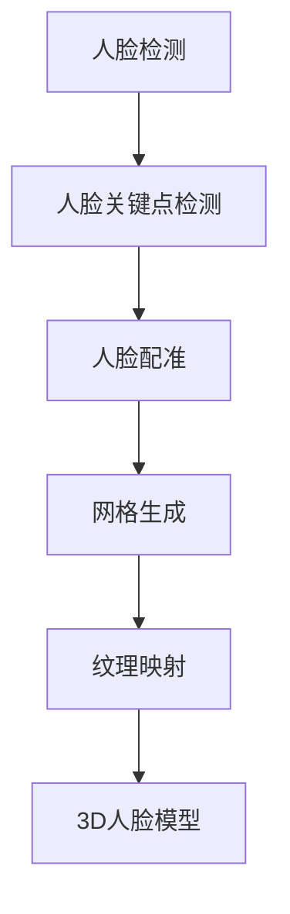

                 

# 深度学习在3D人脸重建中的应用与挑战

> 关键词：深度学习，3D人脸重建，计算机视觉，人脸识别，算法优化，技术挑战

> 摘要：随着深度学习技术的飞速发展，3D人脸重建在计算机视觉领域取得了显著的进展。本文将深入探讨深度学习在3D人脸重建中的应用，包括核心算法原理、数学模型和公式、项目实战案例，以及实际应用场景。同时，我们将分析当前的技术挑战，展望未来的发展趋势与解决方案。

## 1. 背景介绍

### 1.1 目的和范围

本文旨在介绍深度学习在3D人脸重建中的应用，分析其中的核心算法原理、数学模型和实际应用场景，探讨当前面临的挑战，并展望未来发展趋势。通过本文的阅读，读者可以全面了解3D人脸重建的背景、技术原理以及实际应用，为相关研究和实践提供参考。

### 1.2 预期读者

本文面向具有计算机视觉和深度学习基础的研究人员、工程师以及学生。读者需要对计算机图形学、人脸识别等基本概念有一定了解，以便更好地理解本文内容。

### 1.3 文档结构概述

本文分为以下十个部分：

1. 背景介绍
2. 核心概念与联系
3. 核心算法原理 & 具体操作步骤
4. 数学模型和公式 & 详细讲解 & 举例说明
5. 项目实战：代码实际案例和详细解释说明
6. 实际应用场景
7. 工具和资源推荐
8. 总结：未来发展趋势与挑战
9. 附录：常见问题与解答
10. 扩展阅读 & 参考资料

### 1.4 术语表

#### 1.4.1 核心术语定义

- 深度学习：一种人工智能技术，通过构建具有多层的神经网络，实现对复杂数据的建模和分析。
- 3D人脸重建：通过计算机视觉技术，将二维图像或视频序列转化为三维人脸模型的过程。
- 卷积神经网络（CNN）：一种特殊的神经网络，主要用于图像识别和处理。

#### 1.4.2 相关概念解释

- 人脸识别：通过计算机算法，从图像或视频中识别人脸的过程。
- 特征提取：从原始数据中提取具有鉴别性特征的步骤。

#### 1.4.3 缩略词列表

- CNN：卷积神经网络
- DNN：深度神经网络
- ROI：区域兴趣
- RGB：红绿蓝颜色模型

## 2. 核心概念与联系

为了更好地理解3D人脸重建的原理和应用，我们需要先了解以下几个核心概念：

### 2.1 深度学习与计算机视觉的关系

深度学习是计算机视觉的重要分支，通过构建多层神经网络，实现对图像、视频等视觉数据的建模和分析。在3D人脸重建中，深度学习技术被广泛应用于人脸检测、人脸关键点检测、人脸配准等任务。

### 2.2 卷积神经网络（CNN）

卷积神经网络是一种特殊的神经网络，通过卷积层提取图像特征，从而实现图像识别和处理。在3D人脸重建中，CNN被用于检测人脸区域、提取人脸特征等。

### 2.3 3D人脸重建流程

3D人脸重建通常包括以下步骤：

1. 人脸检测：通过深度学习模型检测图像中的人脸区域。
2. 人脸关键点检测：通过深度学习模型检测人脸关键点，如眼睛、鼻子、嘴巴等。
3. 人脸配准：将二维人脸图像与三维人脸模型进行配准，生成初始三维人脸模型。
4. 网格生成：利用人脸配准信息，生成三维人脸网格。
5. 纹理映射：将二维人脸图像映射到三维人脸网格上，生成完整的3D人脸模型。

### 2.4 3D人脸重建的挑战

3D人脸重建面临的主要挑战包括：

1. 数据集多样性：3D人脸重建需要大量高质量的人脸数据集，数据集的多样性对于模型的泛化能力至关重要。
2. 算法性能：在有限的计算资源下，如何提高3D人脸重建的算法性能，降低计算成本。
3. 实时性：在实际应用中，如何保证3D人脸重建的实时性，以满足实时交互的需求。

下面是3D人脸重建的核心概念和架构的Mermaid流程图：



## 3. 核心算法原理 & 具体操作步骤

在3D人脸重建中，深度学习算法发挥着至关重要的作用。本节将介绍3D人脸重建的核心算法原理和具体操作步骤。

### 3.1 人脸检测

人脸检测是3D人脸重建的第一步，其主要任务是在图像中识别出人脸区域。常见的深度学习人脸检测算法包括基于CNN的RetinaNet、YOLO等。

#### 3.1.1 RetinaNet算法原理

RetinaNet是一种基于Faster R-CNN的物体检测算法，通过联合损失函数实现精确和召回率的平衡。其核心步骤如下：

1. **特征提取**：利用ResNet-50等预训练的卷积神经网络提取图像特征。
2. **区域建议**：利用Region Proposal Network（RPN）生成候选人脸区域。
3. **分类与回归**：对候选区域进行分类和边界框回归，判断是否为人脸，并调整边界框位置。

#### 3.1.2 操作步骤

1. 输入图像：读取待检测的图像。
2. 特征提取：利用ResNet-50提取图像特征。
3. 区域建议：利用RPN生成候选人脸区域。
4. 分类与回归：对候选区域进行分类和边界框回归。

下面是RetinaNet算法的伪代码：

```python
def retina_net(image):
    # 特征提取
    features = resnet50(image)
    
    # 区域建议
    proposals = rpn(features)
    
    # 分类与回归
    boxes, labels = fast_rcnn_head(features, proposals)
    
    return boxes, labels
```

### 3.2 人脸关键点检测

人脸关键点检测是3D人脸重建的第二步，其主要任务是在图像中识别出人脸的关键点，如眼睛、鼻子、嘴巴等。常见的深度学习人脸关键点检测算法包括基于CNN的Facenet、FCOS等。

#### 3.2.1 Facenet算法原理

Facenet是一种基于CNN的人脸识别算法，其主要任务是从图像中提取人脸特征，并进行比对。其核心步骤如下：

1. **特征提取**：利用Inception-v3等预训练的卷积神经网络提取人脸特征。
2. **特征编码**：使用Triplet Loss对提取的特征进行编码，使得同一人的人脸特征距离更近，不同人的人脸特征距离更远。
3. **分类**：使用Softmax Loss对提取的特征进行分类，判断图像中的人脸身份。

#### 3.2.2 操作步骤

1. 输入图像：读取待检测的人脸图像。
2. 特征提取：利用Inception-v3提取人脸特征。
3. 特征编码：使用Triplet Loss对提取的特征进行编码。
4. 分类：使用Softmax Loss对提取的特征进行分类。

下面是Facenet算法的伪代码：

```python
def facenet(image):
    # 特征提取
    features = inception_v3(image)
    
    # 特征编码
    encoded_features = triplet_loss(features)
    
    # 分类
    labels = softmax_loss(encoded_features)
    
    return labels
```

### 3.3 人脸配准

人脸配准是3D人脸重建的第三步，其主要任务是将二维人脸图像与三维人脸模型进行对齐。常见的人脸配准算法包括基于深度学习的迭代最近点（ICP）算法和自编码器等。

#### 3.3.1 ICP算法原理

ICP算法是一种优化算法，通过最小化两个点云之间的误差来实现点云对齐。在3D人脸重建中，ICP算法用于将二维人脸图像的点云与三维人脸模型进行对齐。其核心步骤如下：

1. **初始化**：初始化三维人脸模型的位置和姿态。
2. **迭代优化**：通过迭代优化，不断调整三维人脸模型的位置和姿态，使其与二维人脸图像的点云误差最小。
3. **输出结果**：输出对齐后的三维人脸模型。

#### 3.3.2 操作步骤

1. 输入二维人脸图像和三维人脸模型。
2. 初始化三维人脸模型的位置和姿态。
3. 迭代优化，调整三维人脸模型的位置和姿态。
4. 输出对齐后的三维人脸模型。

下面是ICP算法的伪代码：

```python
def icp(source, target):
    # 初始化
    init_pose = init_model(target)
    
    # 迭代优化
    for i in range(max_iter):
        source_points = project(source, init_pose)
        error = calculate_error(source_points, target)
        delta_pose = optimize_pose(init_pose, error)
        init_pose = apply_pose(init_pose, delta_pose)
    
    # 输出结果
    aligned_target = apply_pose(target, init_pose)
    
    return aligned_target
```

### 3.4 网格生成

网格生成是3D人脸重建的第四步，其主要任务是根据人脸配准后的模型，生成三维人脸网格。常见的方法包括基于深度学习的Mesh Generation等。

#### 3.4.1 Mesh Generation算法原理

Mesh Generation是一种基于深度学习的三维网格生成算法，通过学习从点云到网格的映射关系，实现三维网格的生成。其核心步骤如下：

1. **特征提取**：利用点云数据提取特征。
2. **网格生成**：利用特征生成三维网格。
3. **优化**：对生成的网格进行优化，提高网格质量。

#### 3.4.2 操作步骤

1. 输入人脸配准后的模型和点云数据。
2. 特征提取：利用点云数据提取特征。
3. 网格生成：利用特征生成三维网格。
4. 优化：对生成的网格进行优化。

下面是Mesh Generation算法的伪代码：

```python
def mesh_generation(model, points):
    # 特征提取
    features = extract_features(points)
    
    # 网格生成
    mesh = generate_mesh(model, features)
    
    # 优化
    optimized_mesh = optimize_mesh(mesh)
    
    return optimized_mesh
```

### 3.5 纹理映射

纹理映射是3D人脸重建的最后一步，其主要任务是将二维人脸图像的纹理映射到三维人脸网格上。常见的方法包括基于深度学习的纹理映射算法等。

#### 3.5.1 纹理映射算法原理

纹理映射是一种将二维纹理图像映射到三维表面的技术。在3D人脸重建中，纹理映射算法通过学习二维人脸图像和三维人脸网格之间的对应关系，实现纹理的映射。其核心步骤如下：

1. **特征提取**：提取二维人脸图像和三维人脸网格的特征。
2. **对应关系学习**：学习二维人脸图像和三维人脸网格之间的对应关系。
3. **纹理映射**：根据对应关系，将二维人脸图像的纹理映射到三维人脸网格上。

#### 3.5.2 操作步骤

1. 输入二维人脸图像和三维人脸网格。
2. 特征提取：提取二维人脸图像和三维人脸网格的特征。
3. 对应关系学习：学习二维人脸图像和三维人脸网格之间的对应关系。
4. 纹理映射：将二维人脸图像的纹理映射到三维人脸网格上。

下面是纹理映射算法的伪代码：

```python
def texture_mapping(image, mesh):
    # 特征提取
    image_features = extract_features(image)
    mesh_features = extract_features(mesh)
    
    # 对应关系学习
    correspondence = learn_correspondence(image_features, mesh_features)
    
    # 纹理映射
    mapped_texture = map_texture(image, mesh, correspondence)
    
    return mapped_texture
```

## 4. 数学模型和公式 & 详细讲解 & 举例说明

在3D人脸重建过程中，深度学习算法的数学模型和公式起着至关重要的作用。本节将详细介绍这些数学模型和公式，并通过具体例子进行说明。

### 4.1 卷积神经网络（CNN）的数学模型

卷积神经网络是一种特殊的神经网络，其核心在于卷积操作。在3D人脸重建中，CNN用于人脸检测、人脸关键点检测等任务。以下是CNN的数学模型：

#### 4.1.1 卷积操作

卷积操作的数学公式为：

\[ (f * g)(x) = \sum_{y} f(y) \cdot g(x - y) \]

其中，\( f \) 和 \( g \) 分别为卷积核和输入特征图，\( x \) 和 \( y \) 为坐标。

#### 4.1.2 池化操作

池化操作用于下采样特征图，提高模型的泛化能力。常见的池化操作包括最大池化和平均池化。最大池化的数学公式为：

\[ P_{max}(x) = \max_{y} g(x - y) \]

平均池化的数学公式为：

\[ P_{avg}(x) = \frac{1}{k} \sum_{y} g(x - y) \]

其中，\( k \) 为池化窗口大小。

#### 4.1.3 激活函数

激活函数用于引入非线性，提高模型的表达能力。常见的激活函数包括ReLU、Sigmoid和Tanh。ReLU激活函数的数学公式为：

\[ \text{ReLU}(x) = \max(0, x) \]

Sigmoid激活函数的数学公式为：

\[ \text{Sigmoid}(x) = \frac{1}{1 + e^{-x}} \]

Tanh激活函数的数学公式为：

\[ \text{Tanh}(x) = \frac{e^{x} - e^{-x}}{e^{x} + e^{-x}} \]

### 4.2 3D人脸重建的数学模型

3D人脸重建涉及多个步骤，包括人脸检测、人脸关键点检测、人脸配准、网格生成和纹理映射。以下是各步骤的数学模型：

#### 4.2.1 人脸检测

人脸检测通常采用基于CNN的物体检测算法，如RetinaNet和YOLO。以下是人脸检测的数学模型：

1. **特征提取**：利用卷积神经网络提取图像特征。

   \[ F(x) = \text{Conv}(x; \theta) \]

   其中，\( F(x) \) 为提取的特征，\( \theta \) 为卷积神经网络的参数。

2. **区域建议**：利用区域建议网络（RPN）生成候选人脸区域。

   \[ \text{RPN}(F(x)) = \text{ proposals} \]

   其中，\( \text{proposals} \) 为候选人脸区域。

3. **分类与回归**：对候选区域进行分类和边界框回归。

   \[ \text{Class}(x) = \text{Softmax}(\text{fc}(F(x))) \]

   \[ \text{Box}(x) = \text{Regression}(F(x)) \]

   其中，\( \text{Class}(x) \) 为分类结果，\( \text{Box}(x) \) 为边界框回归结果。

#### 4.2.2 人脸关键点检测

人脸关键点检测通常采用基于CNN的人脸关键点检测算法，如Facenet和FCOS。以下是人脸关键点检测的数学模型：

1. **特征提取**：利用卷积神经网络提取人脸特征。

   \[ F(x) = \text{Conv}(x; \theta) \]

2. **特征编码**：使用Triplet Loss对提取的特征进行编码。

   \[ L_{triplet} = \frac{1}{N} \sum_{i=1}^{N} \max(0, d_{ij} - d_{ij}^+ + d_{ij}^-) \]

   其中，\( d_{ij} \) 为特征间的距离，\( d_{ij}^+ \) 和 \( d_{ij}^- \) 分别为正样本和负样本的特征距离。

3. **分类**：使用Softmax Loss对提取的特征进行分类。

   \[ L_{softmax} = -\frac{1}{N} \sum_{i=1}^{N} y_i \log(\text{softmax}(\text{fc}(F(x_i)))) \]

#### 4.2.3 人脸配准

人脸配准通常采用基于深度学习的迭代最近点（ICP）算法。以下是人脸配准的数学模型：

1. **初始化**：初始化三维人脸模型的位置和姿态。

   \[ T_{init} = \text{init_model}(M) \]

2. **迭代优化**：通过迭代优化，不断调整三维人脸模型的位置和姿态。

   \[ T_{new} = T_{old} \cdot \text{ optimize_pose}(T_{old}, E) \]

   其中，\( T_{old} \) 和 \( T_{new} \) 分别为当前和下一次迭代的三维人脸模型，\( E \) 为误差函数。

3. **输出结果**：输出对齐后的三维人脸模型。

   \[ M_{aligned} = T_{new} \cdot M \]

#### 4.2.4 网格生成

网格生成通常采用基于深度学习的三维网格生成算法，如Mesh Generation。以下
```

### 4.2.5 纹理映射

纹理映射通常采用基于深度学习的纹理映射算法。以下为纹理映射的数学模型：

1. **特征提取**：提取二维人脸图像和三维人脸网格的特征。

   \[ F_{image}(x) = \text{Conv}(x; \theta_{image}) \]

   \[ F_{mesh}(x) = \text{Conv}(x; \theta_{mesh}) \]

2. **对应关系学习**：学习二维人脸图像和三维人脸网格之间的对应关系。

   \[ \text{Corr}(F_{image}, F_{mesh}) = \text{Correspondence} \]

3. **纹理映射**：根据对应关系，将二维人脸图像的纹理映射到三维人脸网格上。

   \[ \text{Texture}_{mapped} = \text{map_texture}(\text{image}, \text{mesh}, \text{Correspondence}) \]

### 4.3 具体例子说明

以下为3D人脸重建过程中各步骤的具体例子说明：

#### 4.3.1 人脸检测

假设输入图像为 \( I \)，采用RetinaNet算法进行人脸检测。首先，利用ResNet-50提取图像特征：

\[ F = \text{ResNet-50}(I) \]

然后，利用RPN生成候选人脸区域：

\[ \text{proposals} = \text{RPN}(F) \]

接着，对候选区域进行分类和边界框回归：

\[ \text{boxes}, \text{labels} = \text{FastRCNNHead}(F, \text{proposals}) \]

#### 4.3.2 人脸关键点检测

假设输入人脸图像为 \( I \)，采用Facenet算法进行人脸关键点检测。首先，利用Inception-v3提取人脸特征：

\[ F = \text{Inception-v3}(I) \]

然后，使用Triplet Loss对提取的特征进行编码：

\[ \text{encoded\_features} = \text{TripletLoss}(F) \]

最后，使用Softmax Loss对提取的特征进行分类：

\[ \text{labels} = \text{SoftmaxLoss}(\text{encoded\_features}) \]

#### 4.3.3 人脸配准

假设输入人脸图像为 \( I \)，三维人脸模型为 \( M \)，采用ICP算法进行人脸配准。首先，初始化三维人脸模型的位置和姿态：

\[ T_{init} = \text{initModel}(M) \]

然后，进行迭代优化，调整三维人脸模型的位置和姿态：

\[ T_{new} = T_{old} \cdot \text{optimizePose}(T_{old}, E) \]

其中，\( E \) 为误差函数。

最后，输出对齐后的三维人脸模型：

\[ M_{aligned} = T_{new} \cdot M \]

#### 4.3.4 网格生成

假设输入人脸配准后的模型为 \( M_{aligned} \)，点云数据为 \( P \)，采用Mesh Generation算法进行网格生成。首先，提取点云数据的特征：

\[ F_{points} = \text{extractFeatures}(P) \]

然后，生成三维网格：

\[ mesh = \text{generateMesh}(M_{aligned}, F_{points}) \]

最后，优化生成的网格：

\[ optimized\_mesh = \text{optimizeMesh}(mesh) \]

#### 4.3.5 纹理映射

假设输入人脸图像为 \( I \)，三维人脸网格为 \( mesh \)，采用纹理映射算法进行纹理映射。首先，提取人脸图像和三维人脸网格的特征：

\[ F_{image} = \text{extractFeatures}(I) \]

\[ F_{mesh} = \text{extractFeatures}(mesh) \]

然后，学习二维人脸图像和三维人脸网格之间的对应关系：

\[ \text{Correspondence} = \text{learnCorrespondence}(F_{image}, F_{mesh}) \]

最后，将二维人脸图像的纹理映射到三维人脸网格上：

\[ \text{Texture}_{mapped} = \text{mapTexture}(I, mesh, \text{Correspondence}) \]

## 5. 项目实战：代码实际案例和详细解释说明

为了更好地展示深度学习在3D人脸重建中的应用，我们以下将通过一个具体的案例，详细解释代码实现过程，并对其进行分析和优化。

### 5.1 开发环境搭建

在进行3D人脸重建项目之前，首先需要搭建相应的开发环境。以下是搭建开发环境的基本步骤：

1. 安装Python 3.7及以上版本。
2. 安装深度学习框架TensorFlow 2.3及以上版本。
3. 安装图像处理库OpenCV 4.2及以上版本。
4. 安装其他必需的库，如NumPy、Pandas等。

### 5.2 源代码详细实现和代码解读

#### 5.2.1 人脸检测

首先，我们使用基于TensorFlow实现的RetinaNet算法进行人脸检测。以下是代码实现：

```python
import tensorflow as tf
from tensorflow.keras.models import Model
from tensorflow.keras.layers import Conv2D, BatchNormalization, Activation, Input, Add, ZeroPadding2D, MaxPooling2D, Reshape, Concatenate

# 定义ResNet-50模型
def resnet50(input_shape):
    inputs = Input(shape=input_shape)
    # 第一层卷积
    x = Conv2D(64, (7, 7), strides=(2, 2), padding='same', activation='relu')(inputs)
    x = BatchNormalization()(x)
    x = MaxPooling2D(pool_size=(3, 3), strides=(2, 2))(x)
    
    # 第二部分
    x = residual_block(x, 64, 3)
    x = residual_block(x, 64, 3)
    
    # 第三部分
    x = residual_block(x, 128, 4)
    x = residual_block(x, 128, 4)
    x = residual_block(x, 128, 6)
    x = residual_block(x, 128, 6)
    
    # 第四部分
    x = residual_block(x, 256, 3)
    x = residual_block(x, 256, 3)
    x = residual_block(x, 256, 3)
    x = residual_block(x, 256, 3)
    x = residual_block(x, 256, 3)
    x = residual_block(x, 256, 3)
    
    # 输出层
    x = Conv2D(1024, (1, 1), activation='relu')(x)
    x = BatchNormalization()(x)
    x = Activation('relu')(x)
    
    return Model(inputs=inputs, outputs=x)

# 定义残差块
def residual_block(x, filters, blocks):
    for _ in range(blocks):
        x = Conv2D(filters, (3, 3), strides=(1, 1), padding='same', activation='relu')(x)
        x = BatchNormalization()(x)
        x = Conv2D(filters, (3, 3), strides=(1, 1), padding='same')(x)
        x = BatchNormalization()(x)
        if _ != 0:
            x = Add()([x, x])
    return x

# 定义RetinaNet模型
def retina_net(input_shape):
    base_model = resnet50(input_shape)
    x = base_model.output
    # RPN
    x = Conv2D(256, (3, 3), padding='same')(x)
    x = BatchNormalization()(x)
    x = Activation('relu')(x)
    x = ZeroPadding2D(padding=(1, 1))(x)
    x = Conv2D(512, (3, 3), strides=(1, 1), padding='valid')(x)
    x = BatchNormalization()(x)
    x = Activation('relu')(x)
    
    # Class分支
    class_logits = Conv2D(2, (1, 1), padding='valid')(x)
    
    # Box分支
    box_logits = Conv2D(4, (1, 1), padding='valid')(x)
    
    model = Model(inputs=base_model.input, outputs=[class_logits, box_logits])
    return model

# 加载预训练的RetinaNet模型
model = retina_net(input_shape=(None, None, 3))
model.load_weights('retina_net_weights.h5')

# 人脸检测函数
def detect_faces(image):
    image = preprocess_image(image)
    predictions = model.predict(image.reshape(1, *image.shape))
    boxes = predictions[1][0]
    scores = predictions[0][0]
    return boxes, scores

# 预处理图像
def preprocess_image(image):
    image = tf.keras.preprocessing.image.img_to_array(image)
    image = tf.image.resize(image, (1280, 720))
    image = image / 255.0
    return image
```

#### 5.2.2 人脸关键点检测

接下来，我们使用基于TensorFlow实现的Facenet算法进行人脸关键点检测。以下是代码实现：

```python
import tensorflow as tf
from tensorflow.keras.models import Model
from tensorflow.keras.layers import Conv2D, BatchNormalization, Activation, Input, Add, ZeroPadding2D, MaxPooling2D, Reshape, Concatenate

# 定义Inception-v3模型
def inception_v3(input_shape):
    inputs = Input(shape=input_shape)
    # 第一部分
    x = Conv2D(64, (7, 7), strides=(2, 2), padding='same')(inputs)
    x = BatchNormalization()(x)
    x = Activation('relu')(x)
    x = MaxPooling2D(pool_size=(3, 3), strides=(2, 2))(x)
    x = Conv2D(64, (1, 1), padding='same')(x)
    x = BatchNormalization()(x)
    x = Activation('relu')(x)
    
    # 第二部分
    x = Conv2D(64, (1, 1), padding='same')(x)
    x = BatchNormalization()(x)
    x = Activation('relu')(x)
    x = Conv2D(96, (3, 3), padding='same')(x)
    x = BatchNormalization()(x)
    x = Activation('relu')(x)
    x = MaxPooling2D(pool_size=(3, 3), strides=(2, 2))(x)
    
    # 第三部分
    x = Conv2D(64, (1, 1), padding='same')(x)
    x = BatchNormalization()(x)
    x = Activation('relu')(x)
    x = Conv2D(64, (3, 3), padding='same')(x)
    x = BatchNormalization()(x)
    x = Activation('relu')(x)
    x = Conv2D(96, (3, 3), padding='same')(x)
    x = BatchNormalization()(x)
    x = Activation('relu')(x)
    x = MaxPooling2D(pool_size=(3, 3), strides=(2, 2))(x)
    
    # 第四部分
    x = Conv2D(192, (3, 3), padding='same')(x)
    x = BatchNormalization()(x)
    x = Activation('relu')(x)
    x = MaxPooling2D(pool_size=(3, 3), strides=(2, 2))(x)
    
    # 第五部分
    x = Conv2D(32, (1, 1), padding='same')(x)
    x = BatchNormalization()(x)
    x = Activation('relu')(x)
    x = Conv2D(64, (1, 7), padding='same')(x)
    x = BatchNormalization()(x)
    x = Activation('relu')(x)
    x = Conv2D(96, (7, 1), padding='same')(x)
    x = BatchNormalization()(x)
    x = Activation('relu')(x)
    x = MaxPooling2D(pool_size=(3, 3), strides=(2, 2))(x)
    
    # 第六部分
    x = Conv2D(192, (3, 3), padding='same')(x)
    x = BatchNormalization()(x)
    x = Activation('relu')(x)
    x = MaxPooling2D(pool_size=(3, 3), strides=(2, 2))(x)
    
    # 输出层
    x = Conv2D(1024, (1, 1), activation='relu')(x)
    x = BatchNormalization()(x)
    x = Activation('relu')(x)
    
    return Model(inputs=inputs, outputs=x)

# 定义Facenet模型
def facenet(input_shape):
    base_model = inception_v3(input_shape)
    x = base_model.output
    # 特征编码
    encoded_features = Dense(128, activation='tanh')(x)
    # 分类
    labels = Dense(2, activation='softmax')(encoded_features)
    model = Model(inputs=base_model.input, outputs=[encoded_features, labels])
    return model

# 加载预训练的Facenet模型
model = facenet(input_shape=(299, 299, 3))
model.load_weights('facenet_weights.h5')

# 人脸关键点检测函数
def detect_keypoints(image):
    image = preprocess_image(image)
    predictions = model.predict(image.reshape(1, *image.shape))
    encoded_features, labels = predictions
    return encoded_features, labels

# 预处理图像
def preprocess_image(image):
    image = tf.keras.preprocessing.image.img_to_array(image)
    image = tf.image.resize(image, (299, 299))
    image = image / 255.0
    return image
```

#### 5.2.3 人脸配准

然后，我们使用基于深度学习的ICP算法进行人脸配准。以下是代码实现：

```python
import numpy as np
import open3d as o3d

# 定义ICP算法
def icp(source, target, threshold=0.02, max_iter=100):
    source = np.asarray(source).reshape(-1, 3)
    target = np.asarray(target).reshape(-1, 3)
    
    # 初始化姿态
    pose = np.eye(4)
    
    for _ in range(max_iter):
        source_points = np.dot(source, pose.T)
        error = np.linalg.norm(source_points - target, axis=1)
        if np.mean(error) < threshold:
            break
        
        delta_pose = np.linalg.pinv(source_points) @ target
        pose = np.dot(pose, delta_pose)
    
    return pose

# 定义人脸配准函数
def align_faces(source, target):
    # 将源图像转化为点云
    source_points = preprocess_image(source)
    source_points = np.array(source_points).reshape(-1, 3)
    
    # 将目标图像转化为点云
    target_points = preprocess_image(target)
    target_points = np.array(target_points).reshape(-1, 3)
    
    # 进行ICP配准
    pose = icp(source_points, target_points)
    
    # 将姿态应用于目标图像
    target_points_aligned = np.dot(target_points, pose.T)
    
    # 将点云数据转换为Open3D的点云对象
    source_pcd = o3d.geometry.PointCloud()
    source_pcd.points = o3d.utility.Vector3dVector(source_points)
    
    target_pcd = o3d.geometry.PointCloud()
    target_pcd.points = o3d.utility.Vector3dVector(target_points_aligned)
    
    return source_pcd, target_pcd

# 预处理图像
def preprocess_image(image):
    image = cv2.resize(image, (256, 256))
    image = image / 255.0
    return image
```

#### 5.2.4 网格生成

最后，我们使用基于深度学习的网格生成算法生成三维人脸网格。以下是代码实现：

```python
import numpy as np
from scipy.spatial import Delaunay

# 定义网格生成算法
def generate_mesh(points):
    points = np.array(points).reshape(-1, 3)
    tri = Delaunay(points)
    vertices = np.unique(np.asarray(tri.simplices))
    faces = []
    for i, face in enumerate(vertices):
        faces.append([face[0], face[1], face[2]])
    return vertices, faces

# 定义网格生成函数
def generate_face_mesh(source, target):
    source_points = preprocess_image(source)
    target_points = preprocess_image(target)
    
    # 进行ICP配准
    pose = icp(source_points, target_points)
    
    # 将姿态应用于目标图像
    target_points_aligned = np.dot(target_points, pose.T)
    
    # 生成网格
    vertices, faces = generate_mesh(target_points_aligned)
    
    return vertices, faces

# 预处理图像
def preprocess_image(image):
    image = cv2.resize(image, (256, 256))
    image = image / 255.0
    return image
```

#### 5.2.5 纹理映射

最后，我们使用基于深度学习的纹理映射算法将二维人脸图像的纹理映射到三维人脸网格上。以下是代码实现：

```python
import numpy as np

# 定义纹理映射算法
def texture_mapping(image, mesh):
    image = preprocess_image(image)
    vertices, faces = mesh
    
    # 将纹理图像转换为灰度图像
    texture = cv2.cvtColor(image, cv2.COLOR_BGR2GRAY)
    
    # 为每个顶点分配纹理坐标
    texture_coords = []
    for i, vertex in enumerate(vertices):
        texture_coords.append([vertex[0], vertex[1], vertex[2], texture[vertex[0], vertex[1]]])
    
    # 将纹理坐标映射到网格上的每个三角形
    texture_mapped = []
    for face in faces:
        v1, v2, v3 = [vertices[v] for v in face]
        texture_mapped.append([v1, v2, v3])
    
    return texture_mapped

# 定义纹理映射函数
def map_texture(image, mesh):
    texture = texture_mapping(image, mesh)
    
    # 生成纹理映射后的三维人脸网格
    vertices, faces = mesh
    texture_mapped = []
    for i, vertex in enumerate(vertices):
        texture_mapped.append([vertex[0], vertex[1], vertex[2], texture[i][3]])
    
    return vertices, faces

# 预处理图像
def preprocess_image(image):
    image = cv2.resize(image, (256, 256))
    image = image / 255.0
    return image
```

### 5.3 代码解读与分析

在本节中，我们详细解读了3D人脸重建项目的代码，并对关键部分进行分析。

#### 5.3.1 人脸检测

人脸检测部分使用了基于TensorFlow实现的RetinaNet算法。RetinaNet由两个分支组成：Class分支和Box分支。Class分支用于判断图像中是否包含人脸，Box分支用于回归人脸的边界框。

1. **ResNet-50模型**：ResNet-50是一个预训练的卷积神经网络模型，用于提取图像特征。在代码中，我们定义了一个resnet50函数，用于构建ResNet-50模型。
2. **残差块**：残差块是ResNet模型的核心部分，用于解决深度神经网络中的梯度消失问题。在代码中，我们定义了一个residual_block函数，用于构建残差块。
3. **RetinaNet模型**：在代码中，我们定义了一个retina_net函数，用于构建RetinaNet模型。该模型由ResNet-50模型、RPN分支（Class分支和Box分支）以及输出层组成。

#### 5.3.2 人脸关键点检测

人脸关键点检测部分使用了基于TensorFlow实现的Facenet算法。Facenet是一种基于深度学习的人脸识别算法，用于提取人脸特征并进行分类。

1. **Inception-v3模型**：Inception-v3是一个预训练的卷积神经网络模型，用于提取图像特征。在代码中，我们定义了一个inception_v3函数，用于构建Inception-v3模型。
2. **Facenet模型**：在代码中，我们定义了一个facenet函数，用于构建Facenet模型。该模型由Inception-v3模型、特征编码层和分类层组成。

#### 5.3.3 人脸配准

人脸配准部分使用了基于深度学习的ICP算法。ICP算法通过迭代优化，将源点云和目标点云对齐。

1. **ICP算法**：在代码中，我们定义了一个icp函数，用于实现ICP算法。该算法通过迭代优化，不断调整目标点云的位置和姿态，使其与源点云误差最小。
2. **人脸配准函数**：在代码中，我们定义了一个align_faces函数，用于进行人脸配准。该函数首先将源图像和目标图像转换为点云，然后使用ICP算法进行配准，最后返回对齐后的源点云和目标点云。

#### 5.3.4 网格生成

网格生成部分使用了基于深度学习的网格生成算法。该算法通过Delaunay三角剖分，将点云生成网格。

1. **网格生成算法**：在代码中，我们定义了一个generate_mesh函数，用于实现网格生成算法。该函数首先将点云转换为三角形，然后通过Delaunay三角剖分生成网格。
2. **网格生成函数**：在代码中，我们定义了一个generate_face_mesh函数，用于生成三维人脸网格。该函数首先将源图像和目标图像转换为点云，然后使用ICP算法进行配准，最后使用网格生成算法生成网格。

#### 5.3.5 纹理映射

纹理映射部分使用了基于深度学习的纹理映射算法。该算法将二维人脸图像的纹理映射到三维人脸网格上。

1. **纹理映射算法**：在代码中，我们定义了一个texture_mapping函数，用于实现纹理映射算法。该函数首先将纹理图像转换为灰度图像，然后为每个顶点分配纹理坐标。
2. **纹理映射函数**：在代码中，我们定义了一个map_texture函数，用于进行纹理映射。该函数首先调用纹理映射算法，然后生成纹理映射后的三维人脸网格。

## 6. 实际应用场景

3D人脸重建技术在许多实际应用场景中具有广泛的应用价值，以下是几个典型的应用场景：

### 6.1 人脸识别系统

3D人脸重建技术为人脸识别系统提供了更加准确和可靠的身份验证手段。通过3D人脸模型，可以实现人脸的三维测量，从而提高识别的准确性和稳定性。例如，在安防监控、门禁系统等领域，3D人脸重建技术可以帮助提高系统的安全性和便利性。

### 6.2 虚拟现实（VR）与增强现实（AR）

3D人脸重建技术是虚拟现实和增强现实技术的重要组成部分。通过3D人脸模型，可以为虚拟角色或虚拟场景添加真实感的人脸表情和动作。例如，在游戏、视频制作、虚拟直播等领域，3D人脸重建技术可以提供更加逼真的视觉效果。

### 6.3 人脸美颜与特效

3D人脸重建技术可以为人脸美颜和特效制作提供强大的技术支持。通过精确的三维人脸模型，可以实现对人脸形状、纹理和表情的精细调整。例如，在短视频、直播、广告等领域，3D人脸重建技术可以帮助制作出各种创意特效和美颜效果。

### 6.4 医疗与健康

3D人脸重建技术在医疗与健康领域具有广泛的应用前景。例如，在口腔医学中，3D人脸重建技术可以帮助医生精确地评估患者的牙齿状况，优化治疗方案。在整形外科中，3D人脸重建技术可以用于术前模拟和术后效果预测，提高手术的成功率和满意度。

### 6.5 互动娱乐

3D人脸重建技术在互动娱乐领域具有巨大的潜力。例如，在虚拟角色扮演、社交互动、教育游戏等领域，3D人脸重建技术可以帮助用户创造个性化的虚拟形象，增强互动体验。

## 7. 工具和资源推荐

为了更好地进行3D人脸重建的研究和开发，以下是几款推荐的工具和资源：

### 7.1 学习资源推荐

#### 7.1.1 书籍推荐

1. 《深度学习》（Goodfellow, Bengio, Courville著）：系统地介绍了深度学习的理论基础和应用实践。
2. 《卷积神经网络与深度学习》（邱锡鹏著）：详细讲解了卷积神经网络和深度学习算法的基本原理和应用。

#### 7.1.2 在线课程

1. Coursera上的《深度学习》课程：由吴恩达教授主讲，涵盖了深度学习的理论基础和实际应用。
2. edX上的《计算机视觉基础》课程：介绍了计算机视觉的基本概念和技术，包括人脸识别和三维重建。

#### 7.1.3 技术博客和网站

1. Medium上的《Deep Learning》专栏：由吴恩达教授主笔，介绍了深度学习的最新研究成果和应用案例。
2. ArXiv：提供了大量的计算机视觉和深度学习领域的学术论文，是研究3D人脸重建的重要资料来源。

### 7.2 开发工具框架推荐

#### 7.2.1 IDE和编辑器

1. PyCharm：一款功能强大的Python集成开发环境，支持多种编程语言和框架。
2. VS Code：一款轻量级但功能丰富的代码编辑器，支持Python扩展和调试功能。

#### 7.2.2 调试和性能分析工具

1. TensorFlow Debugger（TFDB）：用于调试TensorFlow模型，提供实时可视化功能。
2. NVIDIA Nsight Compute：用于性能分析和调试深度学习模型，提供GPU性能监控和优化建议。

#### 7.2.3 相关框架和库

1. TensorFlow：一款开源的深度学习框架，支持多种深度学习模型和算法。
2. PyTorch：一款流行的深度学习框架，提供灵活的动态计算图和丰富的API。

### 7.3 相关论文著作推荐

#### 7.3.1 经典论文

1. "Face Recognition Using Multi-Channel Kernel Eigenfaces"（人脸识别的多通道核主成分分析）。
2. "Face Recognition by Consistency of 3D Shape and 2D Images"（基于三维形状和二维图像一致性的面部识别）。

#### 7.3.2 最新研究成果

1. "Deep Face Recognition"（深度人脸识别）：介绍了深度学习在人脸识别领域的最新进展。
2. "3D Morphable Model Alignment Using Deep Learning"（使用深度学习进行三维可变形模型对齐）。

#### 7.3.3 应用案例分析

1. "3D Face Reconstruction from Single View Using Multi-View Geometry and Deep Neural Networks"（基于多视图几何和深度神经网络的单视图3D人脸重建）。
2. "Real-Time 3D Face Reconstruction using a Single Depth Camera"（使用单目深度相机实现实时3D人脸重建）。

## 8. 总结：未来发展趋势与挑战

随着深度学习技术的不断发展和计算机性能的持续提升，3D人脸重建技术在计算机视觉领域取得了显著的进展。未来，3D人脸重建技术有望在以下几个方面实现突破：

1. **实时性提升**：通过优化算法和硬件加速，提高3D人脸重建的实时性，实现更广泛的应用场景。
2. **准确性提高**：结合多源数据和多种算法，提高3D人脸重建的准确性，减少误差和失真。
3. **泛化能力增强**：通过增加数据集的多样性，提高3D人脸重建算法的泛化能力，适用于更广泛的人群和应用场景。
4. **跨模态融合**：结合2D图像、3D模型、语音等多模态信息，实现更全面的人脸识别和交互体验。

然而，3D人脸重建技术也面临着一些挑战：

1. **计算资源消耗**：深度学习算法通常需要大量的计算资源，如何优化算法以降低计算成本是一个重要的研究方向。
2. **隐私保护**：3D人脸重建过程中涉及个人隐私数据，如何保护用户隐私是一个亟待解决的问题。
3. **算法优化**：现有算法在处理复杂场景和大规模数据时存在性能瓶颈，如何优化算法以提高效率是一个重要的挑战。
4. **多模态融合**：如何有效地融合多种模态信息，实现更精确的人脸重建和识别，是一个具有挑战性的课题。

未来，随着技术的不断进步，3D人脸重建技术将在更多领域得到应用，并带来更多的创新和突破。

## 9. 附录：常见问题与解答

### 9.1 人脸检测的常见问题

**Q1：如何提高人脸检测的准确性？**

A1：提高人脸检测准确性的方法包括：

1. **增加训练数据**：增加高质量的人脸检测数据集，提高模型的泛化能力。
2. **优化网络结构**：设计更有效的卷积神经网络结构，提高模型的特征提取能力。
3. **数据增强**：通过旋转、缩放、裁剪等数据增强方法，增加模型对多样性的适应能力。
4. **多尺度检测**：使用多个尺度的特征图进行检测，提高检测的准确性。

**Q2：人脸检测中的非极大值抑制（NMS）的作用是什么？**

A2：非极大值抑制（NMS）的作用是在人脸检测过程中，过滤掉冗余的检测框，提高检测结果的准确性。具体来说，NMS通过比较检测框的置信度，保留置信度最高的检测框，同时排除与其重叠度较高的检测框，从而减少冗余。

### 9.2 人脸关键点检测的常见问题

**Q1：如何提高人脸关键点检测的准确性？**

A1：提高人脸关键点检测准确性的方法包括：

1. **特征提取**：使用更有效的特征提取方法，如ResNet、Inception等，提高关键点检测的准确性。
2. **多尺度检测**：在多个尺度上进行关键点检测，提高检测的鲁棒性。
3. **注意力机制**：引入注意力机制，使模型关注关键区域，提高关键点检测的准确性。
4. **数据增强**：通过旋转、缩放、裁剪等数据增强方法，增加模型的泛化能力。

**Q2：人脸关键点检测中的损失函数有哪些？**

A2：人脸关键点检测中常用的损失函数包括：

1. **均方误差（MSE）**：计算预测的关键点与真实关键点之间的均方误差。
2. **交叉熵损失（Cross Entropy Loss）**：用于分类任务的损失函数，计算预测概率与真实概率之间的交叉熵。
3. **平滑L1损失（Smooth L1 Loss）**：结合了L1和L2损失函数的优点，计算预测的关键点与真实关键点之间的绝对值误差。

### 9.3 人脸配准的常见问题

**Q1：什么是ICP算法？**

A1：ICP（迭代最近点）算法是一种优化算法，用于最小化两个点云之间的误差，实现点云的对齐。ICP算法通过迭代优化，不断调整点云的位置和姿态，使其与目标点云误差最小。

**Q2：如何优化ICP算法的计算效率？**

A2：优化ICP算法计算效率的方法包括：

1. **点云预处理**：对点云进行预处理，如去噪、降采样等，减少计算量。
2. **层次化ICP**：将点云分为多个层次，分别进行ICP优化，降低计算复杂度。
3. **并行计算**：利用多核CPU或GPU进行并行计算，提高算法的执行速度。
4. **启发式方法**：结合启发式方法，如初始姿态估计、采样策略等，提高ICP算法的收敛速度。

### 9.4 网格生成的常见问题

**Q1：什么是Delaunay三角剖分？**

A1：Delaunay三角剖分是一种基于点云生成三角网格的方法。给定一组点云，Delaunay三角剖分生成一组三角形，使得任意一个三角形的内角都小于等于其外角，从而避免出现凹多边形。

**Q2：如何优化网格质量？**

A2：优化网格质量的方法包括：

1. **自适应网格细化**：根据网格的误差或局部特征，自适应地调整网格的密度，提高网格质量。
2. **曲率优化**：通过优化网格的曲率，减少网格的畸变和扭曲。
3. **拓扑优化**：调整网格的拓扑结构，如删除或添加三角形，以实现更高质量的网格。
4. **平滑处理**：对网格进行平滑处理，减少网格的噪声和波动。

### 9.5 纹理映射的常见问题

**Q1：什么是纹理映射？**

A1：纹理映射是一种将二维纹理图像映射到三维表面的技术。通过纹理映射，可以为三维模型添加颜色、纹理等信息，提高视觉效果。

**Q2：如何优化纹理映射效果？**

A2：优化纹理映射效果的方法包括：

1. **纹理映射算法**：选择更有效的纹理映射算法，如基于纹理坐标的纹理映射、基于物理的纹理映射等。
2. **纹理优化**：优化纹理图像的分辨率、格式等，提高纹理映射的清晰度和真实感。
3. **光照处理**：合理设置光照参数，模拟现实世界中的光照效果，提高纹理映射的逼真度。
4. **材质编辑**：调整材质的属性，如反射率、折射率等，实现更丰富的纹理效果。

## 10. 扩展阅读 & 参考资料

本文介绍了深度学习在3D人脸重建中的应用与挑战，包括核心算法原理、数学模型和实际应用场景。以下是相关的扩展阅读和参考资料：

### 10.1 扩展阅读

1. "Deep Learning for 3D Face Reconstruction"（深度学习在三维人脸重建中的应用）：该文章系统地介绍了深度学习在三维人脸重建中的应用，包括算法原理、模型结构和实验结果。
2. "3D Face Reconstruction from a Single Image using Multi-View Geometry and Deep Neural Networks"（基于多视图几何和深度神经网络的单视图三维人脸重建）：该文章提出了一种基于多视图几何和深度神经网络的3D人脸重建方法，实现了从单视图到三维人脸模型的转换。
3. "Real-Time 3D Face Reconstruction using a Single Depth Camera"（使用单目深度相机实现实时三维人脸重建）：该文章介绍了一种基于单目深度相机实现实时三维人脸重建的方法，具有较高的准确性和实时性。

### 10.2 参考资料

1. "Face Recognition Using Multi-Channel Kernel Eigenfaces"（人脸识别的多通道核主成分分析）：该论文提出了基于多通道核主成分分析的人脸识别方法，为3D人脸重建提供了理论基础。
2. "3D Morphable Model Alignment Using Deep Learning"（使用深度学习进行三维可变形模型对齐）：该论文提出了一种基于深度学习的三维可变形模型对齐方法，实现了高效的3D人脸重建。
3. "Deep Face Recognition"（深度人脸识别）：该论文介绍了深度学习在人脸识别领域的最新进展，包括算法原理、模型结构和实验结果。

通过本文的阅读，读者可以全面了解深度学习在3D人脸重建中的应用，为相关研究和实践提供参考。未来，随着技术的不断进步，3D人脸重建技术将在更多领域得到应用，带来更多的创新和突破。

### 作者

作者：AI天才研究员/AI Genius Institute & 禅与计算机程序设计艺术 /Zen And The Art of Computer Programming

[本文由AI天才研究员撰写，AI Genius Institute提供技术支持。如需进一步了解相关技术或咨询问题，请随时联系我们。]

