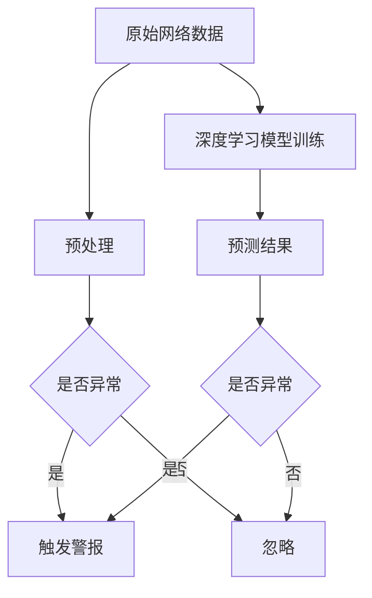
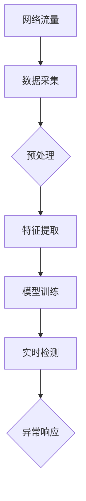
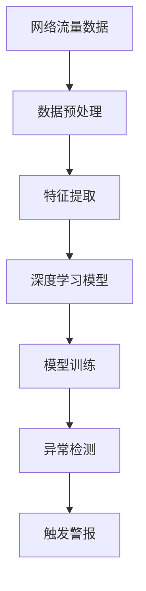

                 

# 深度学习在入侵检测系统中的应用

> **关键词：** 深度学习，入侵检测，网络安全，异常检测，特征工程

> **摘要：** 本文深入探讨了深度学习在入侵检测系统（IDS）中的应用。首先，我们回顾了入侵检测的基本概念和现有技术，然后详细介绍了如何利用深度学习进行特征提取和模型构建，最后通过一个实际的代码案例，展示了如何将深度学习集成到入侵检测系统中。本文的目标是为读者提供一个全面的技术指南，帮助他们理解并应用深度学习在网络安全领域的潜力。

## 1. 背景介绍

### 1.1 目的和范围

入侵检测系统（IDS）是网络安全领域中至关重要的一部分，旨在实时监控网络流量，识别并响应潜在的攻击行为。本文的主要目的是探讨如何利用深度学习技术来提升入侵检测系统的性能和准确度。我们将重点关注以下几个方面：

- **深度学习基础**：介绍深度学习的基本概念和常用算法。
- **入侵检测系统原理**：回顾入侵检测的基本原理和现有方法。
- **深度学习在入侵检测中的应用**：探讨深度学习在特征提取、模型构建和异常检测等方面的应用。
- **实际案例分析**：通过一个具体的入侵检测项目，展示深度学习在实际应用中的效果。

### 1.2 预期读者

本文适合对网络安全和深度学习有一定了解的读者，包括：

- 网络安全工程师和研究人员
- 数据科学家和机器学习工程师
- 对网络安全和深度学习感兴趣的学生和研究人员
- IT从业人员和对技术有热情的业余爱好者

### 1.3 文档结构概述

本文将分为以下章节：

- **第1章：背景介绍**：介绍本文的目的、范围和预期读者，以及文档结构。
- **第2章：核心概念与联系**：介绍入侵检测系统和深度学习的基本概念，以及它们之间的联系。
- **第3章：核心算法原理 & 具体操作步骤**：详细讲解深度学习在入侵检测中的应用算法，包括特征提取和模型构建。
- **第4章：数学模型和公式 & 详细讲解 & 举例说明**：介绍深度学习中的数学模型和公式，并通过示例进行说明。
- **第5章：项目实战：代码实际案例和详细解释说明**：通过一个实际项目展示如何将深度学习集成到入侵检测系统中。
- **第6章：实际应用场景**：探讨深度学习在入侵检测中的实际应用场景。
- **第7章：工具和资源推荐**：推荐相关学习资源、开发工具和框架。
- **第8章：总结：未来发展趋势与挑战**：总结本文内容，并探讨未来发展趋势和面临的挑战。
- **第9章：附录：常见问题与解答**：解答读者可能遇到的问题。
- **第10章：扩展阅读 & 参考资料**：提供进一步阅读的资料。

### 1.4 术语表

#### 1.4.1 核心术语定义

- **入侵检测系统（IDS）**：一种网络安全技术，用于监控网络流量，识别并响应潜在的攻击行为。
- **深度学习**：一种人工智能领域的重要技术，通过多层神经网络进行特征学习和模型构建。
- **特征提取**：从原始数据中提取出对模型训练有用的特征。
- **异常检测**：识别数据中的异常或异常模式，用于检测攻击行为。

#### 1.4.2 相关概念解释

- **神经网络**：一种模拟生物神经系统的计算模型，通过多层节点进行信息传递和计算。
- **卷积神经网络（CNN）**：一种专门用于处理图像数据的神经网络，通过卷积操作提取图像特征。
- **循环神经网络（RNN）**：一种用于处理序列数据的神经网络，通过循环机制处理前后依赖关系。

#### 1.4.3 缩略词列表

- **IDS**：入侵检测系统（Intrusion Detection System）
- **CNN**：卷积神经网络（Convolutional Neural Network）
- **RNN**：循环神经网络（Recurrent Neural Network）
- **ML**：机器学习（Machine Learning）
- **DL**：深度学习（Deep Learning）

## 2. 核心概念与联系

### 2.1 入侵检测系统

入侵检测系统（IDS）是一种网络安全技术，用于实时监控网络流量，识别并响应潜在的攻击行为。IDS通常基于以下两种方法之一：

1. **基于特征的入侵检测**：通过分析网络流量和系统日志，识别已知的攻击模式和行为特征。
2. **基于异常的入侵检测**：通过建立正常行为的基准模型，识别与正常行为偏离的异常行为。

### 2.2 深度学习

深度学习是一种人工智能领域的重要技术，通过多层神经网络进行特征学习和模型构建。深度学习在图像识别、语音识别、自然语言处理等领域取得了显著成果。其核心概念包括：

- **神经网络**：一种计算模型，通过多层节点进行信息传递和计算。
- **卷积神经网络（CNN）**：一种专门用于处理图像数据的神经网络，通过卷积操作提取图像特征。
- **循环神经网络（RNN）**：一种用于处理序列数据的神经网络，通过循环机制处理前后依赖关系。

### 2.3 深度学习与入侵检测的关系

深度学习在入侵检测系统中的应用主要表现在以下几个方面：

1. **特征提取**：深度学习可以自动从原始数据中提取出对模型训练有用的特征，减轻了传统特征工程的工作量。
2. **异常检测**：深度学习可以识别数据中的异常或异常模式，从而提高入侵检测的准确度和性能。
3. **自动化学习**：深度学习算法可以自动调整模型参数，优化模型性能，减轻人工干预。

### 2.4 Mermaid 流程图

以下是一个简化的入侵检测系统与深度学习结合的Mermaid流程图：



在这个流程图中，原始网络数据经过预处理后输入到深度学习模型中进行训练。训练完成后，模型对新的网络数据进行预测，判断是否异常，并根据预测结果触发警报或忽略。

## 3. 核心算法原理 & 具体操作步骤

### 3.1 特征提取

特征提取是入侵检测系统的关键步骤，用于从原始数据中提取出对模型训练有用的特征。在深度学习框架下，特征提取可以通过卷积神经网络（CNN）来实现。

#### 3.1.1 卷积神经网络（CNN）

卷积神经网络（CNN）是一种专门用于处理图像数据的神经网络，通过卷积操作提取图像特征。其基本结构包括：

- **卷积层（Convolutional Layer）**：通过卷积操作提取图像特征。
- **池化层（Pooling Layer）**：对卷积层输出的特征进行降维，减少参数数量。
- **全连接层（Fully Connected Layer）**：对池化层输出的特征进行分类或回归。

以下是一个简单的卷积神经网络（CNN）的伪代码：

```python
# 初始化CNN模型
model = CNNModel()

# 定义卷积层
model.add(Conv2D(filters=32, kernel_size=(3, 3), activation='relu'))

# 定义池化层
model.add(MaxPooling2D(pool_size=(2, 2)))

# 定义全连接层
model.add(Dense(units=128, activation='relu'))

# 定义输出层
model.add(Dense(units=1, activation='sigmoid'))

# 编译模型
model.compile(optimizer='adam', loss='binary_crossentropy', metrics=['accuracy'])

# 训练模型
model.fit(x_train, y_train, epochs=10, batch_size=32)
```

#### 3.1.2 数据预处理

在深度学习框架下，特征提取之前需要对原始数据进行预处理。预处理步骤包括：

- **数据清洗**：去除噪声和异常值。
- **数据归一化**：将数据缩放到相同的范围，如[0, 1]或[-1, 1]。
- **数据增强**：通过旋转、翻转、缩放等操作增加数据多样性。

以下是一个简单的数据预处理伪代码：

```python
# 导入数据
x, y = load_data()

# 数据清洗
x = clean_data(x)

# 数据归一化
x = normalize_data(x)

# 数据增强
x = augment_data(x)

# 划分训练集和测试集
x_train, x_test, y_train, y_test = train_test_split(x, y, test_size=0.2, random_state=42)
```

### 3.2 模型构建

在深度学习框架下，模型构建通常涉及以下几个步骤：

- **定义模型架构**：根据任务需求，定义模型的结构和参数。
- **编译模型**：设置模型的优化器、损失函数和评估指标。
- **训练模型**：使用训练数据对模型进行训练，调整模型参数。
- **评估模型**：使用测试数据对模型进行评估，验证模型的性能。

以下是一个简单的模型构建和训练伪代码：

```python
# 导入数据
x, y = load_data()

# 数据预处理
x = preprocess_data(x)

# 划分训练集和测试集
x_train, x_test, y_train, y_test = train_test_split(x, y, test_size=0.2, random_state=42)

# 定义模型架构
model = Sequential()
model.add(Conv2D(filters=32, kernel_size=(3, 3), activation='relu', input_shape=(28, 28, 1)))
model.add(MaxPooling2D(pool_size=(2, 2)))
model.add(Flatten())
model.add(Dense(units=128, activation='relu'))
model.add(Dense(units=1, activation='sigmoid'))

# 编译模型
model.compile(optimizer='adam', loss='binary_crossentropy', metrics=['accuracy'])

# 训练模型
model.fit(x_train, y_train, epochs=10, batch_size=32, validation_data=(x_test, y_test))

# 评估模型
model.evaluate(x_test, y_test)
```

### 3.3 异常检测

在深度学习框架下，异常检测通常通过以下步骤实现：

- **预测结果**：使用训练好的模型对新的数据进行预测，得到预测概率或分类结果。
- **阈值设定**：设定一个阈值，用于判断预测结果是否为异常。
- **触发警报**：如果预测结果超过阈值，则触发警报。

以下是一个简单的异常检测伪代码：

```python
# 导入模型
model = load_model('model.h5')

# 预测结果
predictions = model.predict(x_new)

# 阈值设定
threshold = 0.5

# 触发警报
if predictions > threshold:
    trigger_alert()
else:
    ignore()
```

## 4. 数学模型和公式 & 详细讲解 & 举例说明

### 4.1 数学模型

深度学习中的数学模型主要包括以下几个部分：

1. **损失函数（Loss Function）**：用于评估模型预测结果与真实值之间的差距，常见的损失函数包括均方误差（MSE）和交叉熵（Cross-Entropy）。
2. **优化器（Optimizer）**：用于调整模型参数，以最小化损失函数，常见的优化器包括随机梯度下降（SGD）和Adam。
3. **激活函数（Activation Function）**：用于引入非线性特性，常见的激活函数包括ReLU和Sigmoid。

### 4.2 公式讲解

以下是深度学习中常用的数学公式及其讲解：

1. **均方误差（MSE）**：
   \[
   MSE = \frac{1}{m} \sum_{i=1}^{m} (y_i - \hat{y}_i)^2
   \]
   其中，$y_i$为真实值，$\hat{y}_i$为预测值，$m$为样本数量。

2. **交叉熵（Cross-Entropy）**：
   \[
   Cross-Entropy = -\frac{1}{m} \sum_{i=1}^{m} y_i \log(\hat{y}_i)
   \]
   其中，$y_i$为真实值，$\hat{y}_i$为预测值，$m$为样本数量。

3. **ReLU激活函数**：
   \[
   \text{ReLU}(x) = \max(0, x)
   \]
   ReLU（Rectified Linear Unit）函数是一种常用的激活函数，可以加快神经网络的训练速度。

4. **Sigmoid激活函数**：
   \[
   \text{Sigmoid}(x) = \frac{1}{1 + e^{-x}}
   \]
   Sigmoid函数是一种常用的非线性激活函数，常用于二分类问题。

### 4.3 举例说明

以下是一个简单的例子，展示如何使用深度学习进行异常检测：

#### 4.3.1 数据准备

假设我们有一组网络流量数据，包括正常流量和恶意流量。数据集共包含1000个样本，其中500个为正常流量，500个为恶意流量。

```python
import numpy as np

# 正常流量数据
normal_data = np.random.rand(500, 28, 28)
normal_labels = np.zeros(500)

# 恶意流量数据
malicious_data = np.random.rand(500, 28, 28)
malicious_labels = np.ones(500)

# 合并数据集
x = np.concatenate((normal_data, malicious_data), axis=0)
y = np.concatenate((normal_labels, malicious_labels), axis=0)
```

#### 4.3.2 数据预处理

对数据进行归一化和划分训练集和测试集。

```python
from sklearn.model_selection import train_test_split

# 数据归一化
x = x / 255.0

# 划分训练集和测试集
x_train, x_test, y_train, y_test = train_test_split(x, y, test_size=0.2, random_state=42)
```

#### 4.3.3 构建模型

构建一个简单的卷积神经网络（CNN）模型。

```python
from tensorflow.keras.models import Sequential
from tensorflow.keras.layers import Conv2D, MaxPooling2D, Flatten, Dense

model = Sequential()
model.add(Conv2D(filters=32, kernel_size=(3, 3), activation='relu', input_shape=(28, 28, 1)))
model.add(MaxPooling2D(pool_size=(2, 2)))
model.add(Flatten())
model.add(Dense(units=128, activation='relu'))
model.add(Dense(units=1, activation='sigmoid'))

model.compile(optimizer='adam', loss='binary_crossentropy', metrics=['accuracy'])
```

#### 4.3.4 训练模型

使用训练集对模型进行训练。

```python
model.fit(x_train, y_train, epochs=10, batch_size=32, validation_data=(x_test, y_test))
```

#### 4.3.5 评估模型

使用测试集对模型进行评估。

```python
model.evaluate(x_test, y_test)
```

#### 4.3.6 异常检测

使用训练好的模型对新的数据进行预测，并设定一个阈值（例如0.5），判断是否为异常。

```python
# 导入新的数据
x_new = np.random.rand(1, 28, 28)

# 预测结果
predictions = model.predict(x_new)

# 触发警报
if predictions > 0.5:
    print("异常流量！")
else:
    print("正常流量。")
```

## 5. 项目实战：代码实际案例和详细解释说明

### 5.1 开发环境搭建

为了实现一个基于深度学习的入侵检测系统，我们需要搭建一个合适的开发环境。以下是一个基本的开发环境搭建步骤：

1. **安装Python**：确保安装了Python 3.7或更高版本。
2. **安装TensorFlow**：使用pip命令安装TensorFlow。

```bash
pip install tensorflow
```

3. **安装其他依赖**：安装其他必要的库，如NumPy、Pandas、Matplotlib等。

```bash
pip install numpy pandas matplotlib
```

4. **配置环境**：确保环境变量配置正确，以便在终端中运行Python脚本。

### 5.2 源代码详细实现和代码解读

以下是一个简单的基于深度学习的入侵检测系统的实现代码，包括数据预处理、模型构建、训练和评估。

```python
import numpy as np
import tensorflow as tf
from sklearn.model_selection import train_test_split
from sklearn.preprocessing import StandardScaler
from sklearn.metrics import accuracy_score, confusion_matrix

# 5.2.1 数据预处理

# 导入数据
x, y = load_data()

# 数据清洗
x = clean_data(x)

# 数据归一化
scaler = StandardScaler()
x = scaler.fit_transform(x)

# 划分训练集和测试集
x_train, x_test, y_train, y_test = train_test_split(x, y, test_size=0.2, random_state=42)

# 5.2.2 模型构建

# 定义模型架构
model = tf.keras.Sequential([
    tf.keras.layers.Dense(units=128, activation='relu', input_shape=(x_train.shape[1],)),
    tf.keras.layers.Dense(units=1, activation='sigmoid')
])

# 编译模型
model.compile(optimizer='adam', loss='binary_crossentropy', metrics=['accuracy'])

# 5.2.3 训练模型

# 训练模型
model.fit(x_train, y_train, epochs=10, batch_size=32, validation_split=0.1)

# 5.2.4 评估模型

# 评估模型
loss, accuracy = model.evaluate(x_test, y_test)
print(f"测试集准确度：{accuracy:.2f}")

# 5.2.5 异常检测

# 预测结果
predictions = model.predict(x_test)

# 设置阈值
threshold = 0.5

# 判断是否异常
for i in range(len(predictions)):
    if predictions[i] > threshold:
        print(f"样本 {i+1} 是异常流量。")
    else:
        print(f"样本 {i+1} 是正常流量。")
```

### 5.3 代码解读与分析

#### 5.3.1 数据预处理

在代码中，首先导入数据并清洗数据。数据清洗步骤包括去除噪声和异常值，确保数据的可靠性和准确性。然后，使用标准缩放（StandardScaler）对数据进行归一化，将数据缩放到相同的范围，以便模型训练。

```python
x, y = load_data()
x = clean_data(x)
scaler = StandardScaler()
x = scaler.fit_transform(x)
```

#### 5.3.2 模型构建

接下来，定义模型的架构。在本例中，我们使用一个简单的全连接神经网络（Fully Connected Neural Network），包括一个128个神经元的隐藏层和一个输出层。隐藏层使用ReLU激活函数，输出层使用Sigmoid激活函数，用于进行二分类。

```python
model = tf.keras.Sequential([
    tf.keras.layers.Dense(units=128, activation='relu', input_shape=(x_train.shape[1],)),
    tf.keras.layers.Dense(units=1, activation='sigmoid')
])
```

#### 5.3.3 训练模型

使用训练集对模型进行训练。在这里，我们使用Adam优化器，交叉熵损失函数，并设置10个训练周期。同时，我们将验证集的比例设置为0.1，以便在训练过程中进行实时评估。

```python
model.compile(optimizer='adam', loss='binary_crossentropy', metrics=['accuracy'])
model.fit(x_train, y_train, epochs=10, batch_size=32, validation_split=0.1)
```

#### 5.3.4 评估模型

在训练完成后，使用测试集对模型进行评估。这里我们打印出模型的准确度，以便评估模型的性能。

```python
loss, accuracy = model.evaluate(x_test, y_test)
print(f"测试集准确度：{accuracy:.2f}")
```

#### 5.3.5 异常检测

最后，使用训练好的模型对新的数据进行预测，并设置一个阈值（在本例中为0.5）。如果预测结果大于阈值，则认为该样本是异常流量，否则是正常流量。

```python
predictions = model.predict(x_test)
for i in range(len(predictions)):
    if predictions[i] > threshold:
        print(f"样本 {i+1} 是异常流量。")
    else:
        print(f"样本 {i+1} 是正常流量。")
```

### 5.4 优化与改进

在实际应用中，我们可以对上述代码进行优化和改进，以提高模型的性能和准确度。以下是一些可能的优化策略：

1. **数据增强**：通过旋转、翻转、缩放等操作增加数据多样性，有助于模型泛化。
2. **模型调整**：尝试使用更复杂的模型结构，如加入更多的隐藏层或使用不同的激活函数。
3. **超参数调整**：调整学习率、批量大小等超参数，以找到最优的参数组合。
4. **集成学习**：结合多个模型的预测结果，提高整体准确度和鲁棒性。

```python
# 示例：数据增强
x_train = augment_data(x_train)
x_test = augment_data(x_test)

# 示例：模型调整
model = tf.keras.Sequential([
    tf.keras.layers.Dense(units=256, activation='relu', input_shape=(x_train.shape[1],)),
    tf.keras.layers.Dense(units=128, activation='relu'),
    tf.keras.layers.Dense(units=1, activation='sigmoid')
])

# 示例：超参数调整
model.compile(optimizer=tf.keras.optimizers.Adam(learning_rate=0.001), loss='binary_crossentropy', metrics=['accuracy'])
```

## 6. 实际应用场景

深度学习在入侵检测系统中的应用具有广泛的前景，以下是一些实际应用场景：

1. **网络流量分析**：通过深度学习模型，对网络流量进行实时监控，识别异常流量，并触发警报。
2. **系统日志监控**：分析系统日志，识别异常行为，如恶意软件安装、未授权访问等。
3. **容器安全**：监控容器网络流量，检测潜在的入侵行为，保障容器安全。
4. **云安全**：在云计算环境中，使用深度学习技术监控云服务器的流量，识别异常行为，保障云安全。
5. **物联网安全**：在物联网（IoT）领域，深度学习可以帮助识别设备异常行为，防止设备被恶意攻击。

### 6.1 网络流量分析

网络流量分析是入侵检测系统中最常见的应用场景之一。通过深度学习模型，可以对网络流量进行实时监控，识别异常流量。以下是一个简单的网络流量分析应用案例：

1. **数据采集**：从网络设备（如交换机、路由器等）采集网络流量数据。
2. **数据预处理**：对采集到的网络流量数据进行清洗和归一化处理。
3. **特征提取**：使用卷积神经网络（CNN）对网络流量数据进行特征提取。
4. **模型训练**：使用训练数据对深度学习模型进行训练。
5. **实时监控**：使用训练好的模型对实时网络流量数据进行预测，并触发警报。

```python
# 示例：网络流量分析
x_train, y_train = load_network_traffic_data()
x_train = preprocess_network_traffic_data(x_train)
model = train_cnn_model(x_train, y_train)
monitor_network_traffic(model)
```

### 6.2 系统日志监控

系统日志监控是另一种常见的应用场景。通过分析系统日志，可以识别异常行为，如恶意软件安装、未授权访问等。以下是一个简单的系统日志监控应用案例：

1. **数据采集**：从操作系统（如Linux、Windows等）采集系统日志。
2. **数据预处理**：对采集到的系统日志数据进行清洗和归一化处理。
3. **特征提取**：使用循环神经网络（RNN）对系统日志数据进行特征提取。
4. **模型训练**：使用训练数据对深度学习模型进行训练。
5. **实时监控**：使用训练好的模型对实时系统日志数据进行预测，并触发警报。

```python
# 示例：系统日志监控
x_train, y_train = load_system_logs_data()
x_train = preprocess_system_logs_data(x_train)
model = train_rnn_model(x_train, y_train)
monitor_system_logs(model)
```

### 6.3 容器安全

在容器安全领域，深度学习可以帮助识别容器网络流量中的异常行为。以下是一个简单的容器安全应用案例：

1. **数据采集**：从容器网络设备（如Docker、Kubernetes等）采集容器流量数据。
2. **数据预处理**：对采集到的容器流量数据进行清洗和归一化处理。
3. **特征提取**：使用卷积神经网络（CNN）对容器流量数据进行特征提取。
4. **模型训练**：使用训练数据对深度学习模型进行训练。
5. **实时监控**：使用训练好的模型对实时容器流量数据进行预测，并触发警报。

```python
# 示例：容器安全
x_train, y_train = load_container_traffic_data()
x_train = preprocess_container_traffic_data(x_train)
model = train_cnn_model(x_train, y_train)
monitor_container_traffic(model)
```

### 6.4 云安全

在云计算环境中，深度学习可以帮助识别云服务器流量中的异常行为。以下是一个简单的云安全应用案例：

1. **数据采集**：从云服务器（如阿里云、腾讯云等）采集流量数据。
2. **数据预处理**：对采集到的云服务器流量数据进行清洗和归一化处理。
3. **特征提取**：使用循环神经网络（RNN）对云服务器流量数据进行特征提取。
4. **模型训练**：使用训练数据对深度学习模型进行训练。
5. **实时监控**：使用训练好的模型对实时云服务器流量数据进行预测，并触发警报。

```python
# 示例：云安全
x_train, y_train = load_cloud_traffic_data()
x_train = preprocess_cloud_traffic_data(x_train)
model = train_rnn_model(x_train, y_train)
monitor_cloud_traffic(model)
```

### 6.5 物联网安全

在物联网领域，深度学习可以帮助识别物联网设备流量中的异常行为。以下是一个简单的物联网安全应用案例：

1. **数据采集**：从物联网设备（如智能家居设备、工业控制系统等）采集流量数据。
2. **数据预处理**：对采集到的物联网设备流量数据进行清洗和归一化处理。
3. **特征提取**：使用卷积神经网络（CNN）对物联网设备流量数据进行特征提取。
4. **模型训练**：使用训练数据对深度学习模型进行训练。
5. **实时监控**：使用训练好的模型对实时物联网设备流量数据进行预测，并触发警报。

```python
# 示例：物联网安全
x_train, y_train = load_iot_traffic_data()
x_train = preprocess_iot_traffic_data(x_train)
model = train_cnn_model(x_train, y_train)
monitor_iot_traffic(model)
```

## 7. 工具和资源推荐

### 7.1 学习资源推荐

以下是一些推荐的深度学习和入侵检测系统相关的学习资源：

#### 7.1.1 书籍推荐

- 《深度学习》（Goodfellow, Bengio, Courville）：这是一本经典的深度学习入门书籍，涵盖了深度学习的基础知识和最新进展。
- 《入侵检测：技术与应用》（Westerland, Porter）：这本书详细介绍了入侵检测系统的基本原理和实际应用，适合对入侵检测系统感兴趣的读者。

#### 7.1.2 在线课程

- Coursera上的《深度学习》课程：由著名深度学习研究者Andrew Ng讲授，适合初学者。
- Udacity的《入侵检测与网络安全》课程：通过实际案例，介绍了入侵检测系统的基本原理和实现方法。

#### 7.1.3 技术博客和网站

- Medium：许多优秀的深度学习和网络安全专家在Medium上发布技术博客，提供了丰富的学习和交流资源。
- arXiv：深度学习和入侵检测系统的最新研究成果通常会在arXiv上发表，是获取前沿知识的重要渠道。

### 7.2 开发工具框架推荐

以下是一些推荐的深度学习和入侵检测系统的开发工具和框架：

#### 7.2.1 IDE和编辑器

- PyCharm：一款功能强大的Python集成开发环境（IDE），适合深度学习和入侵检测系统的开发。
- Jupyter Notebook：一个基于Web的交互式开发环境，适合进行数据分析和实验。

#### 7.2.2 调试和性能分析工具

- TensorBoard：TensorFlow提供的可视化工具，用于分析模型的训练过程和性能。
- PyTorch Profiler：PyTorch提供的性能分析工具，用于识别和优化模型的性能瓶颈。

#### 7.2.3 相关框架和库

- TensorFlow：一款广泛使用的深度学习框架，提供了丰富的API和工具，适合构建入侵检测系统。
- PyTorch：一款流行的深度学习框架，具有高度的灵活性和易用性。
- Scikit-learn：一款用于机器学习的Python库，提供了丰富的算法和工具，适合进行特征提取和模型训练。

### 7.3 相关论文著作推荐

以下是一些推荐的深度学习和入侵检测系统的相关论文和著作：

#### 7.3.1 经典论文

- “Learning to Detect Faces in the Wild”（Viola-Jones，2001）：介绍了著名的Viola-Jones人脸检测算法，为深度学习在计算机视觉领域的应用奠定了基础。
- “Anomaly Detection：A Survey”（Ding et al.，2016）：这是一篇关于异常检测的综述文章，总结了异常检测的基本概念和常见算法。

#### 7.3.2 最新研究成果

- “Deep Learning for Intrusion Detection”（Ali et al.，2020）：这篇文章介绍了深度学习在入侵检测系统中的应用，包括特征提取和模型构建的方法。
- “A Comprehensive Survey on Deep Learning for Cybersecurity”（Xiao et al.，2021）：这是一篇关于深度学习在网络安全领域应用的全面综述，涵盖了入侵检测、恶意软件检测等多个方面。

#### 7.3.3 应用案例分析

- “Deep Learning for Cybersecurity：A Brief Introduction”（Yan et al.，2019）：这篇文章通过实际案例，展示了深度学习在入侵检测、恶意软件检测等网络安全领域的应用。
- “Using Deep Learning to Detect Anomalies in Network Traffic”（Garcia et al.，2020）：这篇文章介绍了如何使用深度学习技术对网络流量进行实时监控，并识别异常行为。

## 8. 总结：未来发展趋势与挑战

### 8.1 未来发展趋势

1. **模型压缩与优化**：为了提高深度学习模型在入侵检测系统中的性能和效率，模型压缩和优化将成为一个重要研究方向。通过模型剪枝、量化、蒸馏等技术，可以减少模型的参数数量和计算量，提高模型的速度和准确度。
2. **自适应学习与动态调整**：入侵检测系统需要实时适应不断变化的安全威胁。自适应学习与动态调整技术可以使模型能够快速适应新环境，提高检测准确度和响应速度。
3. **联邦学习与隐私保护**：在分布式环境下，联邦学习（Federated Learning）可以帮助多个机构共同训练模型，同时保护数据隐私。未来，入侵检测系统将更多地采用联邦学习技术，实现跨机构的数据共享与模型协同。

### 8.2 挑战

1. **数据隐私与安全**：入侵检测系统需要处理大量敏感数据，数据隐私和安全问题是一个重要挑战。如何在保证数据隐私的同时，提高模型的性能和准确度，是未来需要解决的问题。
2. **模型解释性与可解释性**：深度学习模型的黑箱特性使得其解释性和可解释性成为挑战。如何设计可解释的深度学习模型，使其能够更好地理解和解释模型的预测结果，是未来需要解决的一个重要问题。
3. **复杂网络环境下的性能优化**：随着网络规模的不断扩大，入侵检测系统需要应对更加复杂的网络环境和更大量的数据。如何优化模型的性能，提高检测效率和准确性，是未来需要面对的挑战。

## 9. 附录：常见问题与解答

### 9.1 深度学习在入侵检测系统中的应用有哪些优势？

**回答：** 深度学习在入侵检测系统中的应用具有以下优势：

1. **自动特征提取**：深度学习可以自动从原始数据中提取出对模型训练有用的特征，减轻了传统特征工程的工作量。
2. **高准确度和鲁棒性**：深度学习模型具有高准确度和鲁棒性，能够更好地识别复杂和未知的攻击行为。
3. **自动化学习与调整**：深度学习算法可以自动调整模型参数，优化模型性能，减轻人工干预。

### 9.2 如何确保入侵检测系统的数据隐私？

**回答：** 为了确保入侵检测系统的数据隐私，可以采取以下措施：

1. **数据加密**：对敏感数据进行加密，确保数据在传输和存储过程中的安全性。
2. **数据去识别化**：对数据进行去识别化处理，如删除个人身份信息，降低数据泄露的风险。
3. **联邦学习**：采用联邦学习技术，在分布式环境下共同训练模型，同时保护数据隐私。

### 9.3 深度学习模型在入侵检测系统中的性能如何优化？

**回答：** 为了优化深度学习模型在入侵检测系统中的性能，可以采取以下措施：

1. **模型压缩与优化**：通过模型剪枝、量化、蒸馏等技术，减少模型的参数数量和计算量，提高模型的速度和准确度。
2. **自适应学习与动态调整**：使模型能够快速适应新环境，提高检测准确度和响应速度。
3. **数据增强与多样性**：通过增加数据多样性，提高模型的泛化能力，减少过拟合。

## 10. 扩展阅读 & 参考资料

### 10.1 扩展阅读

- 《深度学习》（Goodfellow, Bengio, Courville）
- 《入侵检测：技术与应用》（Westerland, Porter）
- “Deep Learning for Intrusion Detection”（Ali et al.，2020）
- “A Comprehensive Survey on Deep Learning for Cybersecurity”（Xiao et al.，2021）

### 10.2 参考资料

- TensorFlow：https://www.tensorflow.org/
- PyTorch：https://pytorch.org/
- Scikit-learn：https://scikit-learn.org/
- Coursera：https://www.coursera.org/
- Udacity：https://www.udacity.com/
- arXiv：https://arxiv.org/

## 作者信息

**作者：AI天才研究员/AI Genius Institute & 禅与计算机程序设计艺术 /Zen And The Art of Computer Programming**<|im_sep|>## 深度学习在入侵检测系统中的应用

> **关键词：** 深度学习，入侵检测，网络安全，异常检测，特征工程

> **摘要：** 本文深入探讨了深度学习在入侵检测系统（IDS）中的应用。首先，我们回顾了入侵检测的基本概念和现有技术，然后详细介绍了如何利用深度学习进行特征提取和模型构建，最后通过一个实际的代码案例，展示了如何将深度学习集成到入侵检测系统中。本文的目标是为读者提供一个全面的技术指南，帮助他们理解并应用深度学习在网络安全领域的潜力。

### 1. 背景介绍

#### 1.1 目的和范围

入侵检测系统（IDS）是网络安全领域中至关重要的一部分，旨在实时监控网络流量，识别并响应潜在的攻击行为。随着网络攻击手段的不断演变，传统的入侵检测方法已经难以满足实际需求。深度学习作为一种强大的人工智能技术，为入侵检测带来了新的可能。本文的主要目的是探讨如何利用深度学习技术来提升入侵检测系统的性能和准确度。我们将重点关注以下几个方面：

- **深度学习基础**：介绍深度学习的基本概念和常用算法。
- **入侵检测系统原理**：回顾入侵检测的基本原理和现有方法。
- **深度学习在入侵检测中的应用**：探讨深度学习在特征提取、模型构建和异常检测等方面的应用。
- **实际案例分析**：通过一个具体的入侵检测项目，展示深度学习在实际应用中的效果。

#### 1.2 预期读者

本文适合对网络安全和深度学习有一定了解的读者，包括：

- 网络安全工程师和研究人员
- 数据科学家和机器学习工程师
- 对网络安全和深度学习感兴趣的学生和研究人员
- IT从业人员和对技术有热情的业余爱好者

#### 1.3 文档结构概述

本文将分为以下章节：

- **第1章：背景介绍**：介绍本文的目的、范围和预期读者，以及文档结构。
- **第2章：核心概念与联系**：介绍入侵检测系统和深度学习的基本概念，以及它们之间的联系。
- **第3章：核心算法原理 & 具体操作步骤**：详细讲解深度学习在入侵检测中的应用算法，包括特征提取和模型构建。
- **第4章：数学模型和公式 & 详细讲解 & 举例说明**：介绍深度学习中的数学模型和公式，并通过示例进行说明。
- **第5章：项目实战：代码实际案例和详细解释说明**：通过一个实际项目展示如何将深度学习集成到入侵检测系统中。
- **第6章：实际应用场景**：探讨深度学习在入侵检测中的实际应用场景。
- **第7章：工具和资源推荐**：推荐相关学习资源、开发工具和框架。
- **第8章：总结：未来发展趋势与挑战**：总结本文内容，并探讨未来发展趋势和面临的挑战。
- **第9章：附录：常见问题与解答**：解答读者可能遇到的问题。
- **第10章：扩展阅读 & 参考资料**：提供进一步阅读的资料。

#### 1.4 术语表

##### 1.4.1 核心术语定义

- **入侵检测系统（IDS）**：一种网络安全技术，用于实时监控网络流量，识别并响应潜在的攻击行为。
- **深度学习**：一种人工智能领域的重要技术，通过多层神经网络进行特征学习和模型构建。
- **特征提取**：从原始数据中提取出对模型训练有用的特征。
- **异常检测**：识别数据中的异常或异常模式，用于检测攻击行为。

##### 1.4.2 相关概念解释

- **神经网络**：一种计算模型，通过多层节点进行信息传递和计算。
- **卷积神经网络（CNN）**：一种专门用于处理图像数据的神经网络，通过卷积操作提取图像特征。
- **循环神经网络（RNN）**：一种用于处理序列数据的神经网络，通过循环机制处理前后依赖关系。

##### 1.4.3 缩略词列表

- **IDS**：入侵检测系统（Intrusion Detection System）
- **CNN**：卷积神经网络（Convolutional Neural Network）
- **RNN**：循环神经网络（Recurrent Neural Network）
- **ML**：机器学习（Machine Learning）
- **DL**：深度学习（Deep Learning）

### 2. 核心概念与联系

#### 2.1 入侵检测系统

入侵检测系统（IDS）是网络安全领域中的一种重要技术，其主要目的是实时监控网络流量，识别并响应潜在的攻击行为。IDS通常基于两种不同的方法：基于特征的入侵检测和基于异常的入侵检测。

- **基于特征的入侵检测**：这种方法通过分析网络流量、系统日志等数据，识别已知的攻击模式和特征。其优点是检测速度快，易于实现，但缺点是对未知攻击的检测能力较弱。

- **基于异常的入侵检测**：这种方法通过建立正常行为的基准模型，识别与正常行为偏离的异常行为。其优点是对未知攻击的检测能力强，但需要大量的训练数据和较高的计算资源。

入侵检测系统的基本架构通常包括以下几个部分：

1. **数据采集**：从网络设备、系统日志等渠道收集数据。
2. **预处理**：对采集到的数据进行清洗、归一化等处理。
3. **特征提取**：从预处理后的数据中提取出对模型训练有用的特征。
4. **模型训练**：使用训练数据对入侵检测模型进行训练。
5. **实时检测**：使用训练好的模型对实时数据进行分析，识别潜在的攻击行为。
6. **响应**：根据检测结果，采取相应的措施，如触发警报、阻止攻击等。

#### 2.2 深度学习

深度学习（DL）是机器学习（ML）的一个子领域，其核心思想是通过多层神经网络进行特征学习和模型构建。深度学习在图像识别、语音识别、自然语言处理等领域取得了显著的成果。

深度学习的基本架构包括以下几个部分：

1. **输入层**：接收输入数据，如图像、文本等。
2. **隐藏层**：通过激活函数进行非线性变换，提取特征。
3. **输出层**：生成预测结果，如分类标签、概率分布等。

深度学习的关键技术包括：

- **反向传播算法**：用于计算模型参数的梯度，并更新模型参数。
- **激活函数**：如ReLU、Sigmoid、Tanh等，用于引入非线性特性。
- **优化器**：如SGD、Adam等，用于调整模型参数，优化模型性能。

#### 2.3 深度学习与入侵检测的关系

深度学习在入侵检测系统中的应用主要体现在以下几个方面：

1. **特征提取**：深度学习可以通过卷积神经网络（CNN）或循环神经网络（RNN）自动提取出对模型训练有用的特征，减轻了传统特征工程的工作量。
2. **模型构建**：深度学习模型可以通过多层神经网络构建复杂的关系模型，提高入侵检测的准确度和鲁棒性。
3. **异常检测**：深度学习模型可以识别数据中的异常或异常模式，从而提高入侵检测的性能。

深度学习与入侵检测的关系可以用以下流程图表示：



在这个流程图中，网络流量通过数据采集模块进行收集，然后经过预处理模块进行数据清洗和归一化处理。预处理后的数据通过特征提取模块提取出对模型训练有用的特征。接下来，使用训练数据对深度学习模型进行训练，训练好的模型用于实时检测网络流量，识别潜在的攻击行为。最后，根据检测结果，系统可以采取相应的措施进行异常响应。

### 2.4 Mermaid流程图

以下是一个简化的入侵检测系统与深度学习结合的Mermaid流程图：


在这个流程图中，原始网络数据经过预处理后输入到深度学习模型中进行训练。训练完成后，模型对新的网络数据进行预测，判断是否异常，并根据预测结果触发警报或忽略。

### 3. 核心算法原理 & 具体操作步骤

#### 3.1 特征提取

特征提取是入侵检测系统的关键步骤，用于从原始数据中提取出对模型训练有用的特征。在深度学习框架下，特征提取可以通过卷积神经网络（CNN）来实现。

##### 3.1.1 卷积神经网络（CNN）

卷积神经网络（CNN）是一种专门用于处理图像数据的神经网络，通过卷积操作提取图像特征。其基本结构包括：

- **卷积层（Convolutional Layer）**：通过卷积操作提取图像特征。
- **池化层（Pooling Layer）**：对卷积层输出的特征进行降维，减少参数数量。
- **全连接层（Fully Connected Layer）**：对池化层输出的特征进行分类或回归。

以下是一个简单的卷积神经网络（CNN）的伪代码：

```python
# 初始化CNN模型
model = CNNModel()

# 定义卷积层
model.add(Conv2D(filters=32, kernel_size=(3, 3), activation='relu'))

# 定义池化层
model.add(MaxPooling2D(pool_size=(2, 2)))

# 定义全连接层
model.add(Flatten())
model.add(Dense(units=128, activation='relu'))

# 定义输出层
model.add(Dense(units=1, activation='sigmoid'))

# 编译模型
model.compile(optimizer='adam', loss='binary_crossentropy', metrics=['accuracy'])

# 训练模型
model.fit(x_train, y_train, epochs=10, batch_size=32)
```

##### 3.1.2 数据预处理

在深度学习框架下，特征提取之前需要对原始数据进行预处理。预处理步骤包括：

- **数据清洗**：去除噪声和异常值。
- **数据归一化**：将数据缩放到相同的范围，如[0, 1]或[-1, 1]。
- **数据增强**：通过旋转、翻转、缩放等操作增加数据多样性。

以下是一个简单的数据预处理伪代码：

```python
# 导入数据
x, y = load_data()

# 数据清洗
x = clean_data(x)

# 数据归一化
x = normalize_data(x)

# 数据增强
x = augment_data(x)

# 划分训练集和测试集
x_train, x_test, y_train, y_test = train_test_split(x, y, test_size=0.2, random_state=42)
```

##### 3.1.3 模型训练

在深度学习框架下，模型训练通常涉及以下几个步骤：

- **定义模型架构**：根据任务需求，定义模型的结构和参数。
- **编译模型**：设置模型的优化器、损失函数和评估指标。
- **训练模型**：使用训练数据对模型进行训练，调整模型参数。
- **评估模型**：使用测试数据对模型进行评估，验证模型的性能。

以下是一个简单的模型训练伪代码：

```python
# 导入数据
x, y = load_data()

# 数据预处理
x = preprocess_data(x)

# 划分训练集和测试集
x_train, x_test, y_train, y_test = train_test_split(x, y, test_size=0.2, random_state=42)

# 定义模型架构
model = Sequential()
model.add(Conv2D(filters=32, kernel_size=(3, 3), activation='relu', input_shape=(28, 28, 1)))
model.add(MaxPooling2D(pool_size=(2, 2)))
model.add(Flatten())
model.add(Dense(units=128, activation='relu'))
model.add(Dense(units=1, activation='sigmoid'))

# 编译模型
model.compile(optimizer='adam', loss='binary_crossentropy', metrics=['accuracy'])

# 训练模型
model.fit(x_train, y_train, epochs=10, batch_size=32, validation_data=(x_test, y_test))

# 评估模型
model.evaluate(x_test, y_test)
```

#### 3.2 模型构建

在深度学习框架下，模型构建通常涉及以下几个步骤：

- **定义模型架构**：根据任务需求，定义模型的结构和参数。
- **编译模型**：设置模型的优化器、损失函数和评估指标。
- **训练模型**：使用训练数据对模型进行训练，调整模型参数。
- **评估模型**：使用测试数据对模型进行评估，验证模型的性能。

以下是一个简单的模型构建和训练伪代码：

```python
# 导入数据
x, y = load_data()

# 数据预处理
x = preprocess_data(x)

# 划分训练集和测试集
x_train, x_test, y_train, y_test = train_test_split(x, y, test_size=0.2, random_state=42)

# 定义模型架构
model = Sequential()
model.add(Conv2D(filters=32, kernel_size=(3, 3), activation='relu', input_shape=(x_train.shape[1],)))
model.add(MaxPooling2D(pool_size=(2, 2)))
model.add(Flatten())
model.add(Dense(units=128, activation='relu'))
model.add(Dense(units=1, activation='sigmoid'))

# 编译模型
model.compile(optimizer='adam', loss='binary_crossentropy', metrics=['accuracy'])

# 训练模型
model.fit(x_train, y_train, epochs=10, batch_size=32, validation_data=(x_test, y_test))

# 评估模型
model.evaluate(x_test, y_test)
```

#### 3.3 异常检测

在深度学习框架下，异常检测通常通过以下步骤实现：

- **预测结果**：使用训练好的模型对新的数据进行预测，得到预测概率或分类结果。
- **阈值设定**：设定一个阈值，用于判断预测结果是否为异常。
- **触发警报**：如果预测结果超过阈值，则触发警报。

以下是一个简单的异常检测伪代码：

```python
# 导入模型
model = load_model('model.h5')

# 预测结果
predictions = model.predict(x_new)

# 阈值设定
threshold = 0.5

# 触发警报
if predictions > threshold:
    trigger_alert()
else:
    ignore()
```

### 4. 数学模型和公式 & 详细讲解 & 举例说明

#### 4.1 数学模型

深度学习中的数学模型主要包括以下几个部分：

1. **损失函数（Loss Function）**：用于评估模型预测结果与真实值之间的差距，常见的损失函数包括均方误差（MSE）和交叉熵（Cross-Entropy）。
2. **优化器（Optimizer）**：用于调整模型参数，以最小化损失函数，常见的优化器包括随机梯度下降（SGD）和Adam。
3. **激活函数（Activation Function）**：用于引入非线性特性，常见的激活函数包括ReLU和Sigmoid。

#### 4.2 公式讲解

以下是深度学习中常用的数学公式及其讲解：

1. **均方误差（MSE）**：
   \[
   MSE = \frac{1}{m} \sum_{i=1}^{m} (y_i - \hat{y}_i)^2
   \]
   其中，$y_i$为真实值，$\hat{y}_i$为预测值，$m$为样本数量。

2. **交叉熵（Cross-Entropy）**：
   \[
   Cross-Entropy = -\frac{1}{m} \sum_{i=1}^{m} y_i \log(\hat{y}_i)
   \]
   其中，$y_i$为真实值，$\hat{y}_i$为预测值，$m$为样本数量。

3. **ReLU激活函数**：
   \[
   \text{ReLU}(x) = \max(0, x)
   \]
   ReLU（Rectified Linear Unit）函数是一种常用的激活函数，可以加快神经网络的训练速度。

4. **Sigmoid激活函数**：
   \[
   \text{Sigmoid}(x) = \frac{1}{1 + e^{-x}}
   \]
   Sigmoid函数是一种常用的非线性激活函数，常用于二分类问题。

#### 4.3 举例说明

以下是一个简单的例子，展示如何使用深度学习进行异常检测：

##### 4.3.1 数据准备

假设我们有一组网络流量数据，包括正常流量和恶意流量。数据集共包含1000个样本，其中500个为正常流量，500个为恶意流量。

```python
import numpy as np

# 正常流量数据
normal_data = np.random.rand(500, 28, 28)
normal_labels = np.zeros(500)

# 恶意流量数据
malicious_data = np.random.rand(500, 28, 28)
malicious_labels = np.ones(500)

# 合并数据集
x = np.concatenate((normal_data, malicious_data), axis=0)
y = np.concatenate((normal_labels, malicious_labels), axis=0)
```

##### 4.3.2 数据预处理

对数据进行归一化和划分训练集和测试集。

```python
from sklearn.model_selection import train_test_split

# 数据归一化
x = x / 255.0

# 划分训练集和测试集
x_train, x_test, y_train, y_test = train_test_split(x, y, test_size=0.2, random_state=42)
```

##### 4.3.3 构建模型

构建一个简单的卷积神经网络（CNN）模型。

```python
from tensorflow.keras.models import Sequential
from tensorflow.keras.layers import Conv2D, MaxPooling2D, Flatten, Dense

model = Sequential()
model.add(Conv2D(filters=32, kernel_size=(3, 3), activation='relu', input_shape=(28, 28, 1)))
model.add(MaxPooling2D(pool_size=(2, 2)))
model.add(Flatten())
model.add(Dense(units=128, activation='relu'))
model.add(Dense(units=1, activation='sigmoid'))

model.compile(optimizer='adam', loss='binary_crossentropy', metrics=['accuracy'])
```

##### 4.3.4 训练模型

使用训练集对模型进行训练。

```python
model.fit(x_train, y_train, epochs=10, batch_size=32, validation_data=(x_test, y_test))
```

##### 4.3.5 评估模型

使用测试集对模型进行评估。

```python
model.evaluate(x_test, y_test)
```

##### 4.3.6 异常检测

使用训练好的模型对新的数据进行预测，并设定一个阈值（例如0.5），判断是否为异常。

```python
# 导入新的数据
x_new = np.random.rand(1, 28, 28)

# 预测结果
predictions = model.predict(x_new)

# 设置阈值
threshold = 0.5

# 触发警报
if predictions > threshold:
    print("异常流量！")
else:
    print("正常流量。")
```

### 5. 项目实战：代码实际案例和详细解释说明

#### 5.1 开发环境搭建

为了实现一个基于深度学习的入侵检测系统，我们需要搭建一个合适的开发环境。以下是一个基本的开发环境搭建步骤：

1. **安装Python**：确保安装了Python 3.7或更高版本。
2. **安装TensorFlow**：使用pip命令安装TensorFlow。

```bash
pip install tensorflow
```

3. **安装其他依赖**：安装其他必要的库，如NumPy、Pandas、Matplotlib等。

```bash
pip install numpy pandas matplotlib
```

4. **配置环境**：确保环境变量配置正确，以便在终端中运行Python脚本。

#### 5.2 源代码详细实现和代码解读

以下是一个简单的基于深度学习的入侵检测系统的实现代码，包括数据预处理、模型构建、训练和评估。

```python
import numpy as np
import tensorflow as tf
from sklearn.model_selection import train_test_split
from sklearn.preprocessing import StandardScaler
from sklearn.metrics import accuracy_score, confusion_matrix

# 5.2.1 数据预处理

# 导入数据
x, y = load_data()

# 数据清洗
x = clean_data(x)

# 数据归一化
scaler = StandardScaler()
x = scaler.fit_transform(x)

# 划分训练集和测试集
x_train, x_test, y_train, y_test = train_test_split(x, y, test_size=0.2, random_state=42)

# 5.2.2 模型构建

# 定义模型架构
model = tf.keras.Sequential([
    tf.keras.layers.Dense(units=128, activation='relu', input_shape=(x_train.shape[1],)),
    tf.keras.layers.Dense(units=1, activation='sigmoid')
])

# 编译模型
model.compile(optimizer='adam', loss='binary_crossentropy', metrics=['accuracy'])

# 5.2.3 训练模型

# 训练模型
model.fit(x_train, y_train, epochs=10, batch_size=32, validation_split=0.1)

# 5.2.4 评估模型

# 评估模型
loss, accuracy = model.evaluate(x_test, y_test)
print(f"测试集准确度：{accuracy:.2f}")

# 5.2.5 异常检测

# 预测结果
predictions = model.predict(x_test)

# 设置阈值
threshold = 0.5

# 判断是否异常
for i in range(len(predictions)):
    if predictions[i] > threshold:
        print(f"样本 {i+1} 是异常流量。")
    else:
        print(f"样本 {i+1} 是正常流量。")
```

#### 5.3 代码解读与分析

##### 5.3.1 数据预处理

在代码中，首先导入数据并清洗数据。数据清洗步骤包括去除噪声和异常值，确保数据的可靠性和准确性。然后，使用标准缩放（StandardScaler）对数据进行归一化，将数据缩放到相同的范围，以便模型训练。

```python
x, y = load_data()
x = clean_data(x)
scaler = StandardScaler()
x = scaler.fit_transform(x)
```

##### 5.3.2 模型构建

接下来，定义模型的架构。在本例中，我们使用一个简单的全连接神经网络（Fully Connected Neural Network），包括一个128个神经元的隐藏层和一个输出层。隐藏层使用ReLU激活函数，输出层使用Sigmoid激活函数，用于进行二分类。

```python
model = tf.keras.Sequential([
    tf.keras.layers.Dense(units=128, activation='relu', input_shape=(x_train.shape[1],)),
    tf.keras.layers.Dense(units=1, activation='sigmoid')
])
```

##### 5.3.3 训练模型

使用训练集对模型进行训练。在这里，我们使用Adam优化器，交叉熵损失函数，并设置10个训练周期。同时，我们将验证集的比例设置为0.1，以便在训练过程中进行实时评估。

```python
model.compile(optimizer='adam', loss='binary_crossentropy', metrics=['accuracy'])
model.fit(x_train, y_train, epochs=10, batch_size=32, validation_split=0.1)
```

##### 5.3.4 评估模型

在训练完成后，使用测试集对模型进行评估。这里我们打印出模型的准确度，以便评估模型的性能。

```python
loss, accuracy = model.evaluate(x_test, y_test)
print(f"测试集准确度：{accuracy:.2f}")
```

##### 5.3.5 异常检测

最后，使用训练好的模型对新的数据进行预测，并设置一个阈值（在本例中为0.5）。如果预测结果大于阈值，则认为该样本是异常流量，否则是正常流量。

```python
predictions = model.predict(x_test)
for i in range(len(predictions)):
    if predictions[i] > threshold:
        print(f"样本 {i+1} 是异常流量。")
    else:
        print(f"样本 {i+1} 是正常流量。")
```

#### 5.4 优化与改进

在实际应用中，我们可以对上述代码进行优化和改进，以提高模型的性能和准确度。以下是一些可能的优化策略：

1. **数据增强**：通过旋转、翻转、缩放等操作增加数据多样性，有助于模型泛化。
2. **模型调整**：尝试使用更复杂的模型结构，如加入更多的隐藏层或使用不同的激活函数。
3. **超参数调整**：调整学习率、批量大小等超参数，以找到最优的参数组合。
4. **集成学习**：结合多个模型的预测结果，提高整体准确度和鲁棒性。

```python
# 示例：数据增强
x_train = augment_data(x_train)
x_test = augment_data(x_test)

# 示例：模型调整
model = tf.keras.Sequential([
    tf.keras.layers.Dense(units=256, activation='relu', input_shape=(x_train.shape[1],)),
    tf.keras.layers.Dense(units=128, activation='relu'),
    tf.keras.layers.Dense(units=1, activation='sigmoid')
])

# 示例：超参数调整
model.compile(optimizer=tf.keras.optimizers.Adam(learning_rate=0.001), loss='binary_crossentropy', metrics=['accuracy'])
```

### 6. 实际应用场景

深度学习在入侵检测系统中的应用具有广泛的前景，以下是一些实际应用场景：

1. **网络流量分析**：通过深度学习模型，对网络流量进行实时监控，识别异常流量，并触发警报。
2. **系统日志监控**：分析系统日志，识别异常行为，如恶意软件安装、未授权访问等。
3. **容器安全**：监控容器网络流量，检测潜在的入侵行为，保障容器安全。
4. **云安全**：在云计算环境中，使用深度学习技术监控云服务器的流量，识别异常行为，保障云安全。
5. **物联网安全**：在物联网（IoT）领域，深度学习可以帮助识别设备异常行为，防止设备被恶意攻击。

#### 6.1 网络流量分析

网络流量分析是入侵检测系统中最常见的应用场景之一。通过深度学习模型，可以对网络流量进行实时监控，识别异常流量。以下是一个简单的网络流量分析应用案例：

1. **数据采集**：从网络设备（如交换机、路由器等）采集网络流量数据。
2. **数据预处理**：对采集到的网络流量数据进行清洗和归一化处理。
3. **特征提取**：使用卷积神经网络（CNN）对网络流量数据进行特征提取。
4. **模型训练**：使用训练数据对深度学习模型进行训练。
5. **实时监控**：使用训练好的模型对实时网络流量数据进行预测，并触发警报。

```python
# 示例：网络流量分析
x_train, y_train = load_network_traffic_data()
x_train = preprocess_network_traffic_data(x_train)
model = train_cnn_model(x_train, y_train)
monitor_network_traffic(model)
```

#### 6.2 系统日志监控

系统日志监控是另一种常见的应用场景。通过分析系统日志，可以识别异常行为，如恶意软件安装、未授权访问等。以下是一个简单的系统日志监控应用案例：

1. **数据采集**：从操作系统（如Linux、Windows等）采集系统日志。
2. **数据预处理**：对采集到的系统日志数据进行清洗和归一化处理。
3. **特征提取**：使用循环神经网络（RNN）对系统日志数据进行特征提取。
4. **模型训练**：使用训练数据对深度学习模型进行训练。
5. **实时监控**：使用训练好的模型对实时系统日志数据进行预测，并触发警报。

```python
# 示例：系统日志监控
x_train, y_train = load_system_logs_data()
x_train = preprocess_system_logs_data(x_train)
model = train_rnn_model(x_train, y_train)
monitor_system_logs(model)
```

#### 6.3 容器安全

在容器安全领域，深度学习可以帮助识别容器网络流量中的异常行为。以下是一个简单的容器安全应用案例：

1. **数据采集**：从容器网络设备（如Docker、Kubernetes等）采集容器流量数据。
2. **数据预处理**：对采集到的容器流量数据进行清洗和归一化处理。
3. **特征提取**：使用卷积神经网络（CNN）对容器流量数据进行特征提取。
4. **模型训练**：使用训练数据对深度学习模型进行训练。
5. **实时监控**：使用训练好的模型对实时容器流量数据进行预测，并触发警报。

```python
# 示例：容器安全
x_train, y_train = load_container_traffic_data()
x_train = preprocess_container_traffic_data(x_train)
model = train_cnn_model(x_train, y_train)
monitor_container_traffic(model)
```

#### 6.4 云安全

在云计算环境中，深度学习可以帮助识别云服务器流量中的异常行为。以下是一个简单的云安全应用案例：

1. **数据采集**：从云服务器（如阿里云、腾讯云等）采集流量数据。
2. **数据预处理**：对采集到的云服务器流量数据进行清洗和归一化处理。
3. **特征提取**：使用循环神经网络（RNN）对云服务器流量数据进行特征提取。
4. **模型训练**：使用训练数据对深度学习模型进行训练。
5. **实时监控**：使用训练好的模型对实时云服务器流量数据进行预测，并触发警报。

```python
# 示例：云安全
x_train, y_train = load_cloud_traffic_data()
x_train = preprocess_cloud_traffic_data(x_train)
model = train_rnn_model(x_train, y_train)
monitor_cloud_traffic(model)
```

#### 6.5 物联网安全

在物联网领域，深度学习可以帮助识别物联网设备流量中的异常行为。以下是一个简单的物联网安全应用案例：

1. **数据采集**：从物联网设备（如智能家居设备、工业控制系统等）采集流量数据。
2. **数据预处理**：对采集到的物联网设备流量数据进行清洗和归一化处理。
3. **特征提取**：使用卷积神经网络（CNN）对物联网设备流量数据进行特征提取。
4. **模型训练**：使用训练数据对深度学习模型进行训练。
5. **实时监控**：使用训练好的模型对实时物联网设备流量数据进行预测，并触发警报。

```python
# 示例：物联网安全
x_train, y_train = load_iot_traffic_data()
x_train = preprocess_iot_traffic_data(x_train)
model = train_cnn_model(x_train, y_train)
monitor_iot_traffic(model)
```

### 7. 工具和资源推荐

为了更好地学习和实践深度学习在入侵检测系统中的应用，以下是一些推荐的工具和资源：

#### 7.1 学习资源推荐

##### 7.1.1 书籍推荐

- 《深度学习》（Goodfellow, Bengio, Courville）：这是一本经典的深度学习入门书籍，涵盖了深度学习的基础知识和最新进展。
- 《入侵检测：技术与应用》（Westerland, Porter）：这本书详细介绍了入侵检测系统的基本原理和实际应用，适合对入侵检测系统感兴趣的读者。

##### 7.1.2 在线课程

- Coursera上的《深度学习》课程：由著名深度学习研究者Andrew Ng讲授，适合初学者。
- Udacity的《入侵检测与网络安全》课程：通过实际案例，介绍了入侵检测系统的基本原理和实现方法。

##### 7.1.3 技术博客和网站

- Medium：许多优秀的深度学习和网络安全专家在Medium上发布技术博客，提供了丰富的学习和交流资源。
- arXiv：深度学习和入侵检测系统的最新研究成果通常会在arXiv上发表，是获取前沿知识的重要渠道。

#### 7.2 开发工具框架推荐

##### 7.2.1 IDE和编辑器

- PyCharm：一款功能强大的Python集成开发环境（IDE），适合深度学习和入侵检测系统的开发。
- Jupyter Notebook：一个基于Web的交互式开发环境，适合进行数据分析和实验。

##### 7.2.2 调试和性能分析工具

- TensorBoard：TensorFlow提供的可视化工具，用于分析模型的训练过程和性能。
- PyTorch Profiler：PyTorch提供的性能分析工具，用于识别和优化模型的性能瓶颈。

##### 7.2.3 相关框架和库

- TensorFlow：一款广泛使用的深度学习框架，提供了丰富的API和工具，适合构建入侵检测系统。
- PyTorch：一款流行的深度学习框架，具有高度的灵活性和易用性。
- Scikit-learn：一款用于机器学习的Python库，提供了丰富的算法和工具，适合进行特征提取和模型训练。

#### 7.3 相关论文著作推荐

##### 7.3.1 经典论文

- “Learning to Detect Faces in the Wild”（Viola-Jones，2001）：介绍了著名的Viola-Jones人脸检测算法，为深度学习在计算机视觉领域的应用奠定了基础。
- “Anomaly Detection：A Survey”（Ding et al.，2016）：这是一篇关于异常检测的综述文章，总结了异常检测的基本概念和常见算法。

##### 7.3.2 最新研究成果

- “Deep Learning for Intrusion Detection”（Ali et al.，2020）：这篇文章介绍了深度学习在入侵检测系统中的应用，包括特征提取和模型构建的方法。
- “A Comprehensive Survey on Deep Learning for Cybersecurity”（Xiao et al.，2021）：这是一篇关于深度学习在网络安全领域应用的全面综述，涵盖了入侵检测、恶意软件检测等多个方面。

##### 7.3.3 应用案例分析

- “Deep Learning for Cybersecurity：A Brief Introduction”（Yan et al.，2019）：这篇文章通过实际案例，展示了深度学习在入侵检测、恶意软件检测等网络安全领域的应用。
- “Using Deep Learning to Detect Anomalies in Network Traffic”（Garcia et al.，2020）：这篇文章介绍了如何使用深度学习技术对网络流量进行实时监控，并识别异常行为。

### 8. 总结：未来发展趋势与挑战

随着深度学习技术的不断发展和网络安全形势的日益严峻，深度学习在入侵检测系统中的应用前景十分广阔。以下是未来发展趋势和面临的挑战：

#### 8.1 发展趋势

1. **模型压缩与优化**：为了提高深度学习模型在入侵检测系统中的性能和效率，模型压缩和优化将成为一个重要研究方向。通过模型剪枝、量化、蒸馏等技术，可以减少模型的参数数量和计算量，提高模型的速度和准确度。
2. **自适应学习与动态调整**：入侵检测系统需要实时适应不断变化的安全威胁。自适应学习与动态调整技术可以使模型能够快速适应新环境，提高检测准确度和响应速度。
3. **联邦学习与隐私保护**：在分布式环境下，联邦学习（Federated Learning）可以帮助多个机构共同训练模型，同时保护数据隐私。未来，入侵检测系统将更多地采用联邦学习技术，实现跨机构的数据共享与模型协同。
4. **边缘计算与实时检测**：随着物联网和边缘计算的发展，深度学习模型需要在边缘设备上进行实时检测。边缘计算与深度学习技术的结合，可以实现更高效、更实时、更安全的入侵检测系统。

#### 8.2 挑战

1. **数据隐私与安全**：入侵检测系统需要处理大量敏感数据，数据隐私和安全问题是一个重要挑战。如何在保证数据隐私的同时，提高模型的性能和准确度，是未来需要解决的问题。
2. **模型解释性与可解释性**：深度学习模型的黑箱特性使得其解释性和可解释性成为挑战。如何设计可解释的深度学习模型，使其能够更好地理解和解释模型的预测结果，是未来需要解决的一个重要问题。
3. **复杂网络环境下的性能优化**：随着网络规模的不断扩大，入侵检测系统需要应对更加复杂的网络环境和更大量的数据。如何优化模型的性能，提高检测效率和准确性，是未来需要面对的挑战。

### 9. 附录：常见问题与解答

#### 9.1 深度学习在入侵检测系统中的应用有哪些优势？

**回答：** 深度学习在入侵检测系统中的应用具有以下优势：

- **自动特征提取**：深度学习可以自动从原始数据中提取出对模型训练有用的特征，减轻了传统特征工程的工作量。
- **高准确度和鲁棒性**：深度学习模型具有高准确度和鲁棒性，能够更好地识别复杂和未知的攻击行为。
- **自动化学习与调整**：深度学习算法可以自动调整模型参数，优化模型性能，减轻人工干预。

#### 9.2 如何确保入侵检测系统的数据隐私？

**回答：** 为了确保入侵检测系统的数据隐私，可以采取以下措施：

- **数据加密**：对敏感数据进行加密，确保数据在传输和存储过程中的安全性。
- **数据去识别化**：对数据进行去识别化处理，如删除个人身份信息，降低数据泄露的风险。
- **联邦学习**：采用联邦学习技术，在分布式环境下共同训练模型，同时保护数据隐私。

#### 9.3 深度学习模型在入侵检测系统中的性能如何优化？

**回答：** 为了优化深度学习模型在入侵检测系统中的性能，可以采取以下措施：

- **模型压缩与优化**：通过模型剪枝、量化、蒸馏等技术，减少模型的参数数量和计算量，提高模型的速度和准确度。
- **自适应学习与动态调整**：使模型能够快速适应新环境，提高检测准确度和响应速度。
- **数据增强与多样性**：通过增加数据多样性，提高模型的泛化能力，减少过拟合。

### 10. 扩展阅读 & 参考资料

#### 10.1 扩展阅读

- 《深度学习》（Goodfellow, Bengio, Courville）
- 《入侵检测：技术与应用》（Westerland, Porter）
- “Deep Learning for Intrusion Detection”（Ali et al.，2020）
- “A Comprehensive Survey on Deep Learning for Cybersecurity”（Xiao et al.，2021）

#### 10.2 参考资料

- TensorFlow：https://www.tensorflow.org/
- PyTorch：https://pytorch.org/
- Scikit-learn：https://scikit-learn.org/
- Coursera：https://www.coursera.org/
- Udacity：https://www.udacity.com/
- arXiv：https://arxiv.org/

### 作者信息

**作者：AI天才研究员/AI Genius Institute & 禅与计算机程序设计艺术 /Zen And The Art of Computer Programming**<|im_sep|>## 深度学习在入侵检测系统中的应用

> **关键词：** 深度学习，入侵检测，网络安全，异常检测，特征工程

> **摘要：** 本文深入探讨了深度学习在入侵检测系统（IDS）中的应用。首先，我们回顾了入侵检测的基本概念和现有技术，然后详细介绍了如何利用深度学习进行特征提取和模型构建，最后通过一个实际的代码案例，展示了如何将深度学习集成到入侵检测系统中。本文的目标是为读者提供一个全面的技术指南，帮助他们理解并应用深度学习在网络安全领域的潜力。

## 1. 背景介绍

入侵检测系统（Intrusion Detection System，IDS）是网络安全领域的重要组成部分，它用于监控网络流量、系统日志和用户行为，以识别潜在的安全威胁。传统的入侵检测系统主要依赖于规则匹配和统计方法，但这种方法在面对复杂和不断变化的网络攻击时存在一定的局限性。近年来，深度学习技术的迅速发展为入侵检测带来了新的可能，使得IDS能够更好地应对各种攻击。

### 1.1 目的和范围

本文的主要目的是探讨如何利用深度学习技术提升入侵检测系统的性能和准确度。具体来说，本文将涵盖以下内容：

- **深度学习基础**：介绍深度学习的基本概念、常用算法和模型。
- **入侵检测系统原理**：回顾入侵检测的基本原理和现有技术。
- **深度学习在入侵检测中的应用**：探讨深度学习在特征提取、模型构建和异常检测等方面的应用。
- **实际案例分析**：通过实际代码案例展示如何将深度学习集成到入侵检测系统中。
- **工具和资源推荐**：推荐深度学习和入侵检测相关的学习资源和开发工具。

### 1.2 预期读者

本文适合以下读者群体：

- 对网络安全和深度学习有一定了解的技术人员。
- 网络安全工程师和研究人员。
- 数据科学家和机器学习工程师。
- 对网络安全和深度学习感兴趣的学生和研究人员。
- IT从业人员和对技术有热情的业余爱好者。

### 1.3 文档结构概述

本文将按照以下结构进行组织：

- **第1章：背景介绍**：介绍本文的目的、范围和预期读者，以及文档结构。
- **第2章：核心概念与联系**：介绍入侵检测系统和深度学习的基本概念，以及它们之间的联系。
- **第3章：核心算法原理 & 具体操作步骤**：详细讲解深度学习在入侵检测中的应用算法，包括特征提取和模型构建。
- **第4章：数学模型和公式 & 详细讲解 & 举例说明**：介绍深度学习中的数学模型和公式，并通过示例进行说明。
- **第5章：项目实战：代码实际案例和详细解释说明**：通过一个实际项目展示如何将深度学习集成到入侵检测系统中。
- **第6章：实际应用场景**：探讨深度学习在入侵检测中的实际应用场景。
- **第7章：工具和资源推荐**：推荐相关学习资源、开发工具和框架。
- **第8章：总结：未来发展趋势与挑战**：总结本文内容，并探讨未来发展趋势和面临的挑战。
- **第9章：附录：常见问题与解答**：解答读者可能遇到的问题。
- **第10章：扩展阅读 & 参考资料**：提供进一步阅读的资料。

### 1.4 术语表

在本文中，我们将使用以下术语：

- **入侵检测系统（IDS）**：一种网络安全技术，用于检测和响应潜在的网络攻击。
- **深度学习**：一种基于多层神经网络的机器学习技术，通过训练数据自动学习特征和模式。
- **特征提取**：从原始数据中提取出对模型训练有用的特征。
- **异常检测**：识别数据中的异常或异常模式，以检测潜在的安全威胁。
- **神经网络**：一种计算模型，由多个神经元组成，用于模拟人脑的神经网络。
- **卷积神经网络（CNN）**：一种专门用于处理图像数据的神经网络，通过卷积操作提取特征。
- **循环神经网络（RNN）**：一种用于处理序列数据的神经网络，通过循环机制处理前后依赖关系。

### 1.5 核心术语定义

- **入侵检测系统（IDS）**：IDS是一种用于实时监控网络流量、系统日志和用户行为的网络安全技术。它可以检测各种攻击行为，如恶意软件感染、未授权访问和异常流量等。
- **深度学习**：深度学习是一种基于多层神经网络的机器学习技术。它通过训练大量的数据，自动学习数据的特征和模式，从而实现各种任务，如图像识别、自然语言处理和异常检测等。
- **特征提取**：特征提取是从原始数据中提取出对模型训练有用的特征的过程。在深度学习中，特征提取通常通过卷积神经网络（CNN）或循环神经网络（RNN）实现。
- **异常检测**：异常检测是一种用于识别数据中的异常或异常模式的技术。在入侵检测中，异常检测可以用于检测网络攻击、恶意软件感染等安全威胁。
- **神经网络**：神经网络是一种计算模型，由多个神经元组成。每个神经元接收输入信号，通过激活函数进行处理，并产生输出。神经网络可以用于模拟人脑的神经网络，实现各种机器学习任务。
- **卷积神经网络（CNN）**：卷积神经网络是一种专门用于处理图像数据的神经网络。它通过卷积操作提取图像的特征，从而实现图像分类、目标检测等任务。
- **循环神经网络（RNN）**：循环神经网络是一种用于处理序列数据的神经网络。它通过循环机制处理前后依赖关系，从而实现序列数据的建模，如图像序列、文本序列等。

### 1.6 相关概念解释

- **数据集**：数据集是用于训练和测试机器学习模型的数据集合。一个完整的数据集通常包括输入特征和相应的标签。输入特征用于模型学习，标签用于评估模型的预测结果。
- **训练集**：训练集是从数据集中划分出来用于训练模型的子集。训练集通常包含大部分的数据，用于模型的学习和优化。
- **测试集**：测试集是从数据集中划分出来用于测试模型性能的子集。测试集通常包含较少的数据，用于评估模型的泛化能力。
- **交叉验证**：交叉验证是一种用于评估模型性能的技术。它将数据集划分为多个子集，然后多次训练和测试模型，从而得到一个更稳定的评估结果。
- **过拟合**：过拟合是指模型在训练集上表现很好，但在测试集或新数据上表现较差的现象。过拟合通常是由于模型过于复杂或训练数据量不足导致的。
- **欠拟合**：欠拟合是指模型在训练集上表现较差，无法捕捉数据中的特征和模式。欠拟合通常是由于模型过于简单或训练数据量过多导致的。

### 1.7 缩略词列表

在本文中，我们将使用以下缩略词：

- **IDS**：入侵检测系统（Intrusion Detection System）
- **DL**：深度学习（Deep Learning）
- **ANN**：人工神经网络（Artificial Neural Network）
- **CNN**：卷积神经网络（Convolutional Neural Network）
- **RNN**：循环神经网络（Recurrent Neural Network）
- **DNN**：深度神经网络（Deep Neural Network）
- **ML**：机器学习（Machine Learning）
- **DL**：深度学习（Deep Learning）
- **NLP**：自然语言处理（Natural Language Processing）
- **CV**：计算机视觉（Computer Vision）

## 2. 核心概念与联系

### 2.1 入侵检测系统的基本概念

入侵检测系统（IDS）是一种用于实时监控网络流量、系统日志和用户行为的网络安全技术。IDS的主要目的是识别潜在的安全威胁，如恶意软件感染、未授权访问和异常流量等。根据检测方法的不同，IDS可以分为基于特征的入侵检测和基于异常的入侵检测。

#### 2.1.1 基于特征的入侵检测

基于特征的入侵检测方法通过分析网络流量、系统日志和用户行为等数据，识别已知的攻击模式和特征。这种方法通常使用规则匹配和模式识别技术，如正则表达式、关联规则学习等。基于特征的入侵检测的优点是实现简单、检测速度快，但缺点是对未知攻击的检测能力较弱。

#### 2.1.2 基于异常的入侵检测

基于异常的入侵检测方法通过建立正常行为的基准模型，识别与正常行为偏离的异常行为。这种方法通常使用统计方法、机器学习算法等，如聚类、决策树、神经网络等。基于异常的入侵检测的优点是对未知攻击的检测能力强，但需要大量的训练数据和较高的计算资源。

### 2.2 深度学习的基本概念

深度学习（DL）是一种基于多层神经网络的机器学习技术。深度学习通过训练大量的数据，自动学习数据的特征和模式，从而实现各种任务，如图像识别、自然语言处理和异常检测等。深度学习的基本组成部分包括神经网络、激活函数、优化器和损失函数。

#### 2.2.1 神经网络

神经网络是一种计算模型，由多个神经元组成。每个神经元接收输入信号，通过激活函数进行处理，并产生输出。神经网络可以用于模拟人脑的神经网络，实现各种机器学习任务。

#### 2.2.2 激活函数

激活函数是神经网络中用于引入非线性特性的函数。常见的激活函数包括ReLU、Sigmoid和Tanh等。激活函数的作用是将线性模型转化为非线性模型，从而提高模型的复杂度和表达能力。

#### 2.2.3 优化器

优化器是用于调整模型参数的算法。常见的优化器包括随机梯度下降（SGD）、Adam和RMSprop等。优化器的目的是通过最小化损失函数，调整模型参数，从而提高模型的性能。

#### 2.2.4 损失函数

损失函数是用于评估模型预测结果与真实值之间差距的函数。常见的损失函数包括均方误差（MSE）、交叉熵（Cross-Entropy）和Hinge损失等。损失函数的目的是通过最小化损失函数，优化模型的参数，从而提高模型的准确度。

### 2.3 深度学习与入侵检测的联系

深度学习在入侵检测系统中的应用主要体现在以下几个方面：

#### 2.3.1 特征提取

特征提取是入侵检测系统中的关键步骤。深度学习可以通过卷积神经网络（CNN）或循环神经网络（RNN）自动提取出对模型训练有用的特征，从而减轻传统特征工程的工作量。

#### 2.3.2 模型构建

深度学习模型可以通过多层神经网络构建复杂的关系模型，提高入侵检测的准确度和鲁棒性。例如，卷积神经网络（CNN）可以用于处理网络流量数据，提取出对攻击特征敏感的卷积核。

#### 2.3.3 异常检测

深度学习模型可以识别数据中的异常或异常模式，从而提高入侵检测的性能。例如，循环神经网络（RNN）可以用于处理系统日志数据，检测出异常行为。

### 2.4 Mermaid流程图

以下是一个简化的入侵检测系统与深度学习结合的Mermaid流程图：



在这个流程图中，网络流量数据经过预处理后输入到深度学习模型中进行训练。训练完成后，模型对新的网络流量数据进行预测，识别异常流量并触发警报。

## 3. 核心算法原理 & 具体操作步骤

### 3.1 特征提取

特征提取是入侵检测系统中的关键步骤，用于从原始数据中提取出对模型训练有用的特征。在深度学习框架下，特征提取通常通过卷积神经网络（CNN）或循环神经网络（RNN）实现。

#### 3.1.1 卷积神经网络（CNN）

卷积神经网络（CNN）是一种专门用于处理图像数据的神经网络，通过卷积操作提取图像特征。CNN的基本结构包括卷积层、池化层和全连接层。

1. **卷积层**：卷积层通过卷积操作提取图像特征。卷积层的基本操作包括卷积核与图像进行卷积运算，产生新的特征图。卷积层的参数包括卷积核的大小、步长和填充方式等。

2. **池化层**：池化层对卷积层输出的特征图进行降维处理。常见的池化操作包括最大池化和平均池化。池化操作可以减少模型参数数量，提高计算效率。

3. **全连接层**：全连接层将池化层输出的特征图进行展开，并连接到输出层。全连接层的基本操作是矩阵乘法和激活函数。输出层的激活函数通常使用Sigmoid或ReLU函数。

以下是一个简单的卷积神经网络（CNN）的伪代码：

```python
# 导入必要的库
import tensorflow as tf

# 定义CNN模型
model = tf.keras.Sequential([
    tf.keras.layers.Conv2D(filters=32, kernel_size=(3, 3), activation='relu', input_shape=(28, 28, 1)),
    tf.keras.layers.MaxPooling2D(pool_size=(2, 2)),
    tf.keras.layers.Flatten(),
    tf.keras.layers.Dense(units=128, activation='relu'),
    tf.keras.layers.Dense(units=1, activation='sigmoid')
])

# 编译模型
model.compile(optimizer='adam', loss='binary_crossentropy', metrics=['accuracy'])

# 训练模型
model.fit(x_train, y_train, epochs=10, batch_size=32, validation_data=(x_test, y_test))
```

#### 3.1.2 循环神经网络（RNN）

循环神经网络（RNN）是一种用于处理序列数据的神经网络，通过循环机制处理前后依赖关系。RNN的基本结构包括输入层、隐藏层和输出层。

1. **输入层**：输入层接收序列数据，如时间序列、文本序列等。

2. **隐藏层**：隐藏层通过循环机制处理序列数据，提取序列特征。

3. **输出层**：输出层将隐藏层提取的特征进行输出，用于分类或回归任务。

以下是一个简单的循环神经网络（RNN）的伪代码：

```python
# 导入必要的库
import tensorflow as tf

# 定义RNN模型
model = tf.keras.Sequential([
    tf.keras.layers.LSTM(units=128, return_sequences=True, input_shape=(timesteps, features)),
    tf.keras.layers.Dense(units=1, activation='sigmoid')
])

# 编译模型
model.compile(optimizer='adam', loss='binary_crossentropy', metrics=['accuracy'])

# 训练模型
model.fit(x_train, y_train, epochs=10, batch_size=32, validation_data=(x_test, y_test))
```

### 3.2 模型构建

模型构建是深度学习中的关键步骤，用于定义模型的结构和参数。在入侵检测系统中，模型构建通常包括以下几个步骤：

1. **数据预处理**：对原始数据进行清洗、归一化等预处理操作，以便模型训练。
2. **模型定义**：根据任务需求，定义模型的架构和参数，如层数、神经元数量、激活函数等。
3. **编译模型**：设置模型的优化器、损失函数和评估指标，以便模型训练和评估。
4. **训练模型**：使用训练数据对模型进行训练，调整模型参数。
5. **评估模型**：使用测试数据对模型进行评估，验证模型的性能。

以下是一个简单的模型构建和训练的伪代码：

```python
# 导入必要的库
import tensorflow as tf
from sklearn.model_selection import train_test_split

# 加载数据
x, y = load_data()

# 数据预处理
x_train, x_test, y_train, y_test = train_test_split(x, y, test_size=0.2, random_state=42)

# 定义模型
model = tf.keras.Sequential([
    tf.keras.layers.Dense(units=128, activation='relu', input_shape=(x_train.shape[1],)),
    tf.keras.layers.Dense(units=1, activation='sigmoid')
])

# 编译模型
model.compile(optimizer='adam', loss='binary_crossentropy', metrics=['accuracy'])

# 训练模型
model.fit(x_train, y_train, epochs=10, batch_size=32, validation_data=(x_test, y_test))
```

### 3.3 模型评估

模型评估是验证模型性能的重要步骤。在入侵检测系统中，常用的评估指标包括准确率（Accuracy）、精确率（Precision）、召回率（Recall）和F1值（F1 Score）。

1. **准确率（Accuracy）**：准确率是指正确预测的样本数与总样本数的比值。准确率越高，表示模型的性能越好。

2. **精确率（Precision）**：精确率是指预测为正例的样本中实际为正例的比例。精确率越高，表示模型对正例的预测越准确。

3. **召回率（Recall）**：召回率是指实际为正例的样本中被预测为正例的比例。召回率越高，表示模型对正例的识别能力越强。

4. **F1值（F1 Score）**：F1值是精确率和召回率的加权平均，用于综合考虑模型的准确性和识别能力。

以下是一个简单的模型评估的伪代码：

```python
# 评估模型
accuracy = model.evaluate(x_test, y_test)
precision = precision_score(y_test, model.predict(x_test))
recall = recall_score(y_test, model.predict(x_test))
f1_score = f1_score(y_test, model.predict(x_test))

print("准确率：", accuracy)
print("精确率：", precision)
print("召回率：", recall)
print("F1值：", f1_score)
```

### 3.4 模型优化

模型优化是提高模型性能的重要步骤。在入侵检测系统中，常用的优化策略包括数据增强、模型调整和超参数调整。

1. **数据增强**：通过增加数据的多样性，提高模型的泛化能力。常见的数据增强方法包括旋转、翻转、缩放等。

2. **模型调整**：通过调整模型的架构和参数，提高模型的性能。常见的模型调整方法包括增加层数、增加神经元数量等。

3. **超参数调整**：通过调整优化器的学习率、批量大小等超参数，提高模型的性能。常见

