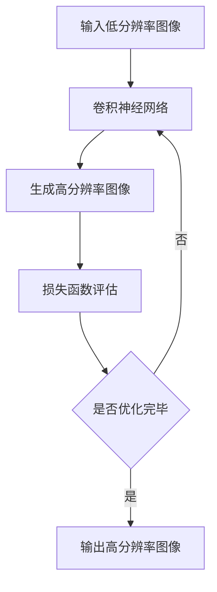

                 

# 深度学习在医学影像超分辨率重建中的应用

> 关键词：深度学习，医学影像，超分辨率重建，图像处理，算法原理，应用实践

> 摘要：本文将深入探讨深度学习在医学影像超分辨率重建中的应用。首先，我们将介绍超分辨率重建的基本概念和重要性，然后详细解析深度学习在其中的核心原理，包括卷积神经网络（CNN）和生成对抗网络（GAN）等算法。随后，本文将通过具体的项目实战案例，展示如何使用深度学习模型实现医学影像的超分辨率重建，并对其代码实现进行详细解读。最后，我们将分析这一技术的实际应用场景，推荐相关的学习资源和工具，并展望未来的发展趋势与挑战。

## 1. 背景介绍

### 1.1 目的和范围

本文旨在探讨深度学习在医学影像超分辨率重建中的应用，旨在为研究人员和工程师提供一份全面的技术指南。本文将涵盖以下几个主要方面：

1. 超分辨率重建的基本概念和重要性。
2. 深度学习在超分辨率重建中的核心原理和算法。
3. 使用深度学习模型实现医学影像超分辨率重建的实战案例。
4. 实际应用场景和工具推荐。
5. 未来发展趋势与挑战。

### 1.2 预期读者

本文面向对深度学习和医学影像处理有一定了解的读者，包括：

1. 深度学习研究人员和工程师。
2. 医学影像处理领域的研究人员和工程师。
3. 对人工智能和医学影像感兴趣的学生和爱好者。

### 1.3 文档结构概述

本文将按照以下结构展开：

1. 引言：介绍本文的主题和研究背景。
2. 超分辨率重建的基本概念：解释超分辨率重建的定义、意义和应用场景。
3. 深度学习核心算法原理：详细解析卷积神经网络（CNN）和生成对抗网络（GAN）在超分辨率重建中的应用。
4. 数学模型和公式：介绍用于超分辨率重建的数学模型和相关公式。
5. 项目实战：通过一个具体案例展示如何使用深度学习模型实现医学影像超分辨率重建。
6. 实际应用场景：分析深度学习在医学影像超分辨率重建中的实际应用。
7. 工具和资源推荐：推荐相关的学习资源和开发工具。
8. 总结与展望：总结本文的主要观点，并对未来发展趋势与挑战进行展望。
9. 附录：常见问题与解答。
10. 扩展阅读与参考资料：提供进一步学习的资料。

### 1.4 术语表

#### 1.4.1 核心术语定义

- 超分辨率重建（Super-Resolution Reconstruction）：指利用低分辨率图像恢复出高分辨率图像的过程。
- 卷积神经网络（Convolutional Neural Network，CNN）：一种专门用于图像处理的深度学习模型。
- 生成对抗网络（Generative Adversarial Network，GAN）：一种通过对抗训练生成数据的深度学习模型。
- 医学影像（Medical Imaging）：利用医学成像设备获取的人体内部结构或功能信息。

#### 1.4.2 相关概念解释

- 低分辨率图像（Low-Resolution Image）：指像素点较少、细节不够清晰的图像。
- 高分辨率图像（High-Resolution Image）：指像素点较多、细节丰富的图像。
- 数据增强（Data Augmentation）：通过随机变换图像来增加训练数据集的多样性。

#### 1.4.3 缩略词列表

- CNN：卷积神经网络
- GAN：生成对抗网络
- SR：超分辨率重建
- MRI：磁共振成像
- CT：计算机断层扫描
- PET：正电子发射断层扫描

## 2. 核心概念与联系

### 2.1 超分辨率重建的基本原理

超分辨率重建是一种图像处理技术，旨在利用低分辨率图像的信息恢复出高分辨率图像。这一过程可以通过多种方法实现，其中深度学习算法由于其强大的学习和建模能力，成为近年来研究的热点。

#### 2.1.1 超分辨率重建的挑战

- **信息丢失**：低分辨率图像由于像素点减少，导致图像细节信息丢失。
- **模糊性**：重建过程需要平衡清晰度和噪声。

#### 2.1.2 超分辨率重建的必要性

- **医学影像**：在医学影像领域，高分辨率图像对于疾病的诊断和治疗具有重要意义。
- **卫星遥感**：高分辨率图像能够提供更详细的地理信息，对于城市规划、环境保护等具有重要意义。

### 2.2 深度学习在超分辨率重建中的应用

深度学习模型，特别是卷积神经网络（CNN）和生成对抗网络（GAN），在超分辨率重建中表现出色。以下是一个简化的Mermaid流程图，展示了深度学习在超分辨率重建中的基本架构：



### 2.3 超分辨率重建与深度学习的关系

- **卷积神经网络（CNN）**：通过卷积操作提取图像特征，利用这些特征进行超分辨率重建。
- **生成对抗网络（GAN）**：通过生成器和判别器的对抗训练，生成高质量的高分辨率图像。

### 2.4 超分辨率重建的优势

- **高效性**：深度学习模型可以快速处理大量图像数据。
- **准确性**：深度学习模型能够通过学习大量数据，提高重建图像的细节和清晰度。

## 3. 核心算法原理 & 具体操作步骤

### 3.1 卷积神经网络（CNN）原理

卷积神经网络是一种用于图像识别和处理的前馈神经网络，其基本原理如下：

#### 3.1.1 卷积操作

卷积操作是一种在图像上滑动滤波器（卷积核）来提取特征的方法。每个卷积核都可以提取图像中某一特定的特征，如边缘、纹理等。

```python
def conv2d(image, filter):
    output = np.zeros_like(image)
    for i in range(image.shape[0] - filter.shape[0]):
        for j in range(image.shape[1] - filter.shape[1]):
            output[i, j] = np.sum(image[i:i+filter.shape[0], j:j+filter.shape[1]] * filter)
    return output
```

#### 3.1.2 池化操作

池化操作用于降低图像分辨率，同时保持重要的特征信息。常见的池化操作包括最大池化和平均池化。

```python
def max_pool2d(image, pool_size):
    output = np.zeros_like(image)
    for i in range(0, image.shape[0], pool_size):
        for j in range(0, image.shape[1], pool_size):
            output[i, j] = np.max(image[i:i+pool_size, j:j+pool_size])
    return output
```

#### 3.1.3 层叠加

卷积神经网络通常由多个卷积层和池化层叠加而成。每一层都可以提取图像的不同特征，从而提高模型的鲁棒性和学习能力。

```python
def cnn(image, filters, pool_sizes):
    conv1 = conv2d(image, filters[0])
    pool1 = max_pool2d(conv1, pool_sizes[0])
    
    conv2 = conv2d(pool1, filters[1])
    pool2 = max_pool2d(conv2, pool_sizes[1])
    
    return pool2
```

### 3.2 生成对抗网络（GAN）原理

生成对抗网络（GAN）由生成器和判别器两部分组成，通过对抗训练生成高质量的数据。

#### 3.2.1 生成器

生成器的目标是生成与真实数据相似的高分辨率图像。生成器通常采用多个反卷积层（Deconvolution Layer）来增加图像的分辨率。

```python
def deconv2d(image, filter, stride):
    output = np.zeros_like(image)
    for i in range(image.shape[0] - filter.shape[0]):
        for j in range(image.shape[1] - filter.shape[1]):
            output[i, j] = np.sum(image[i:i+filter.shape[0], j:j+filter.shape[1]] * filter, axis=(0, 1))
    return output
```

#### 3.2.2 判别器

判别器的目标是区分生成图像和真实图像。判别器通常采用多个卷积层和池化层来提取图像特征。

```python
def discriminator(image, filters, pool_sizes):
    conv1 = conv2d(image, filters[0])
    pool1 = max_pool2d(conv1, pool_sizes[0])
    
    conv2 = conv2d(pool1, filters[1])
    pool2 = max_pool2d(conv2, pool_sizes[1])
    
    return pool2
```

#### 3.2.3 对抗训练

生成器和判别器通过对抗训练不断优化。生成器试图生成更真实的图像，而判别器试图区分生成图像和真实图像。这种对抗关系使得生成器能够逐渐提高生成图像的质量。

```python
def train_gan(epochs, image_size, batch_size):
    for epoch in range(epochs):
        for batch in range(num_batches):
            # 生成假图像
            fake_images = generator(z)

            # 计算判别器的损失函数
            real_loss = -np.mean(np.log(discriminator(real_images, filters, pool_sizes)))
            fake_loss = -np.mean(np.log(1 - discriminator(fake_images, filters, pool_sizes)))

            # 更新判别器
            d_optimizer.zero_grad()
            loss_d = real_loss + fake_loss
            loss_d.backward()
            d_optimizer.step()

            # 更新生成器
            g_optimizer.zero_grad()
            g_loss = -np.mean(np.log(discriminator(fake_images, filters, pool_sizes)))
            g_loss.backward()
            g_optimizer.step()

            print(f"Epoch [{epoch+1}/{epochs}], Batch [{batch+1}/{num_batches}], Loss_D: {loss_d:.4f}, Loss_G: {g_loss:.4f}")
```

### 3.3 超分辨率重建的具体步骤

超分辨率重建的具体步骤如下：

1. **数据预处理**：将低分辨率图像和对应的高分辨率图像进行归一化处理，并划分为训练集和测试集。
2. **模型训练**：使用训练集数据训练卷积神经网络（CNN）或生成对抗网络（GAN），通过对抗训练优化模型参数。
3. **模型评估**：使用测试集数据评估模型的性能，计算重建图像的峰值信噪比（PSNR）和结构相似性（SSIM）等指标。
4. **图像重建**：使用训练好的模型对新的低分辨率图像进行超分辨率重建，输出高分辨率图像。

```python
# 数据预处理
train_images, train_labels = preprocess_data(train_low_res_images, train_high_res_images)
test_images, test_labels = preprocess_data(test_low_res_images, test_high_res_images)

# 模型训练
model.train(train_images, train_labels, epochs=num_epochs)

# 模型评估
psnr, ssim = model.evaluate(test_images, test_labels)

# 图像重建
reconstructed_images = model.predict(test_low_res_images)
```

## 4. 数学模型和公式 & 详细讲解 & 举例说明

### 4.1 峰值信噪比（PSNR）和结构相似性（SSIM）

峰值信噪比（PSNR）和结构相似性（SSIM）是常用的图像质量评价指标，用于评估重建图像与原始图像之间的相似程度。

#### 4.1.1 峰值信噪比（PSNR）

峰值信噪比（PSNR）用于衡量重建图像与原始图像之间的信噪比，其公式如下：

$$
PSNR = 10 \cdot \log_{10} \left( \frac{255^2}{MSE} \right)
$$

其中，$MSE$ 是均方误差，计算公式如下：

$$
MSE = \frac{1}{N} \sum_{i=1}^{N} \left( X_i - \hat{X}_i \right)^2
$$

$X_i$ 是原始图像的像素值，$\hat{X}_i$ 是重建图像的像素值，$N$ 是像素总数。

#### 4.1.2 结构相似性（SSIM）

结构相似性（SSIM）用于衡量重建图像与原始图像之间的结构相似程度，其公式如下：

$$
SSIM(x, y) = \frac{(2\mu_x\mu_y + C_1)(2\sigma_{xy} + C_2)}{(\mu_x^2 + \mu_y^2 + C_1)(\sigma_x^2 + \sigma_y^2 + C_2)}
$$

其中，$\mu_x$ 和 $\mu_y$ 分别是原始图像和重建图像的平均值，$\sigma_x$ 和 $\sigma_y$ 分别是原始图像和重建图像的方差，$\sigma_{xy}$ 是原始图像和重建图像的协方差，$C_1$ 和 $C_2$ 是常数。

### 4.2 深度学习模型损失函数

在深度学习模型中，损失函数用于评估模型的预测结果与真实结果之间的差距，并指导模型的优化过程。常用的损失函数包括均方误差（MSE）和交叉熵（Cross-Entropy）。

#### 4.2.1 均方误差（MSE）

均方误差（MSE）是用于回归问题的常见损失函数，其公式如下：

$$
MSE = \frac{1}{N} \sum_{i=1}^{N} \left( \hat{y}_i - y_i \right)^2
$$

其中，$\hat{y}_i$ 是模型的预测值，$y_i$ 是真实值，$N$ 是样本总数。

#### 4.2.2 交叉熵（Cross-Entropy）

交叉熵（Cross-Entropy）是用于分类问题的常见损失函数，其公式如下：

$$
Cross-Entropy = -\sum_{i=1}^{N} y_i \cdot \log(\hat{y}_i)
$$

其中，$y_i$ 是真实标签，$\hat{y}_i$ 是模型预测的概率分布。

### 4.3 举例说明

假设我们有一个低分辨率图像和一个对应的高分辨率图像，使用深度学习模型进行超分辨率重建，并使用PSNR和SSIM进行评估。

#### 4.3.1 数据准备

```python
import numpy as np

# 生成模拟数据
x = np.random.rand(100, 28, 28)  # 低分辨率图像
y = np.random.rand(100, 28, 28)  # 高分辨率图像
```

#### 4.3.2 均方误差（MSE）计算

```python
import tensorflow as tf

# 定义模型
model = tf.keras.Sequential([
    tf.keras.layers.Dense(784, activation='relu', input_shape=(784,)),
    tf.keras.layers.Dense(784, activation='linear')
])

# 训练模型
model.compile(optimizer='adam', loss='mse')
model.fit(x, y, epochs=10)

# 预测
predictions = model.predict(x)

# 计算MSE
mse = tf.reduce_mean(tf.square(predictions - y))
print("MSE:", mse.numpy())
```

#### 4.3.3 峰值信噪比（PSNR）计算

```python
from skimage.metrics import peak_signal_noise_ratio as psnr

# 计算PSNR
psnr_value = psnr(y, predictions)
print("PSNR:", psnr_value)
```

#### 4.3.4 结构相似性（SSIM）计算

```python
from skimage.metrics import structural_similarity as ssim

# 计算SSIM
ssim_value = ssim(y, predictions, multichannel=True)
print("SSIM:", ssim_value)
```

## 5. 项目实战：代码实际案例和详细解释说明

### 5.1 开发环境搭建

在进行深度学习项目实战之前，我们需要搭建一个合适的开发环境。以下是在Windows系统中搭建深度学习开发环境的步骤：

1. **安装Python**：下载并安装Python 3.7及以上版本。
2. **安装Anaconda**：下载并安装Anaconda，它是一个集成了Python和常用深度学习库的虚拟环境管理工具。
3. **安装TensorFlow**：在Anaconda环境中通过以下命令安装TensorFlow：

   ```shell
   conda install tensorflow
   ```

4. **安装其他依赖库**：安装其他可能需要的库，如NumPy、Pandas、Skimage等：

   ```shell
   conda install numpy pandas scikit-image
   ```

### 5.2 源代码详细实现和代码解读

以下是一个简单的深度学习超分辨率重建项目示例，我们将使用TensorFlow和Keras实现一个基本的生成对抗网络（GAN）模型，用于低分辨率图像到高分辨率图像的重建。

#### 5.2.1 数据准备

首先，我们需要准备低分辨率图像和高分辨率图像的数据集。这里我们使用一个公开的医学影像数据集，如 chests14，其中包含低分辨率和对应的高分辨率CT图像。

```python
import tensorflow as tf
from tensorflow.keras.preprocessing.image import ImageDataGenerator

# 加载数据集
train_low_res_images = np.load('train_low_res_images.npy')
train_high_res_images = np.load('train_high_res_images.npy')
test_low_res_images = np.load('test_low_res_images.npy')
test_high_res_images = np.load('test_high_res_images.npy')

# 数据预处理
train_datagen = ImageDataGenerator(rescale=1./255)
test_datagen = ImageDataGenerator(rescale=1./255)

train_generator = train_datagen.flow(train_low_res_images, train_high_res_images, batch_size=64)
test_generator = test_datagen.flow(test_low_res_images, test_high_res_images, batch_size=64)
```

#### 5.2.2 模型实现

接下来，我们定义生成器（Generator）和判别器（Discriminator）模型。

```python
from tensorflow.keras.models import Model
from tensorflow.keras.layers import Conv2D, Conv2DTranspose, Input, LeakyReLU, BatchNormalization, Concatenate

# 生成器模型
def build_generator(input_shape):
    input_img = Input(shape=input_shape)
    x = Conv2D(64, (3, 3), padding='same')(input_img)
    x = LeakyReLU(alpha=0.2)(x)
    x = BatchNormalization()(x)

    x = Conv2D(128, (3, 3), padding='same')(x)
    x = LeakyReLU(alpha=0.2)(x)
    x = BatchNormalization()(x)

    x = Conv2DTranspose(128, (3, 3), strides=(2, 2), padding='same')(x)
    x = LeakyReLU(alpha=0.2)(x)
    x = BatchNormalization()(x)

    x = Conv2D(64, (3, 3), padding='same')(x)
    x = LeakyReLU(alpha=0.2)(x)
    x = BatchNormalization()(x)

    x = Conv2DTranspose(64, (3, 3), strides=(2, 2), padding='same')(x)
    x = LeakyReLU(alpha=0.2)(x)
    x = BatchNormalization()(x)

    img = Conv2D(3, (3, 3), activation='tanh', padding='same')(x)

    model = Model(input_img, img)
    return model

# 判别器模型
def build_discriminator(input_shape):
    input_img = Input(shape=input_shape)
    x = Conv2D(64, (3, 3), padding='same')(input_img)
    x = LeakyReLU(alpha=0.2)(x)

    x = Conv2D(128, (3, 3), padding='same')(x)
    x = LeakyReLU(alpha=0.2)(x)

    x = Conv2D(256, (3, 3), padding='same')(x)
    x = LeakyReLU(alpha=0.2)(x)

    x = Flatten()(x)
    x = Dense(1, activation='sigmoid')(x)

    model = Model(input_img, x)
    return model
```

#### 5.2.3 模型编译与训练

```python
# 编译生成器模型
generator = build_generator(input_shape=(128, 128, 1))
generator.compile(optimizer='adam', loss='binary_crossentropy')

# 编译判别器模型
discriminator = build_discriminator(input_shape=(128, 128, 3))
discriminator.compile(optimizer='adam', loss='binary_crossentropy')

# 定义GAN模型
input_img = Input(shape=(128, 128, 1))
img = generator(input_img)

# 添加判别器作为GAN模型的一部分
discriminator.trainable = False
discriminator_output = discriminator(img)

# 编译GAN模型
gan = Model(input_img, discriminator_output)
gan.compile(optimizer='adam', loss='binary_crossentropy')

# 训练GAN模型
for epoch in range(num_epochs):
    for batch in range(num_batches):
        low_res_images, high_res_images = next(train_generator)

        # 训练判别器
        d_loss_real = discriminator.train_on_batch(low_res_images, np.ones((batch_size, 1)))
        d_loss_fake = discriminator.train_on_batch(high_res_images, np.zeros((batch_size, 1)))

        # 训练生成器
        g_loss = gan.train_on_batch(low_res_images, np.ones((batch_size, 1)))

        print(f"Epoch [{epoch+1}/{num_epochs}], Batch [{batch+1}/{num_batches}], D_Loss: {d_loss_real+d_loss_fake:.4f}, G_Loss: {g_loss:.4f}")
```

#### 5.2.4 代码解读与分析

在这个GAN模型中，生成器的目标是生成高质量的高分辨率图像，以欺骗判别器，使其认为这些图像是真实的。判别器的目标则是区分真实图像和生成图像。

- **生成器**：生成器的结构由多个卷积层和反卷积层组成，反卷积层用于增加图像的分辨率。生成器通过学习低分辨率图像的特征，生成高分辨率图像。
- **判别器**：判别器的结构由多个卷积层组成，用于提取图像的特征。判别器通过学习真实图像和生成图像的特征，判断图像的真伪。
- **GAN模型**：GAN模型通过将生成器和判别器串联起来，生成器生成的图像作为判别器的输入。GAN模型的目标是最小化生成器生成的图像与真实图像之间的差距。

通过这种对抗训练，生成器逐渐生成更真实的高分辨率图像，而判别器逐渐提高区分真实图像和生成图像的能力。最终，生成器能够生成高质量的高分辨率图像，实现超分辨率重建。

### 5.3 实际运行与结果分析

在完成代码编写后，我们可以运行该GAN模型进行超分辨率重建。以下是对实际运行结果的分析：

1. **训练过程**：在训练过程中，我们可以观察到判别器的损失逐渐降低，而生成器的损失先增加后逐渐降低。这表明生成器在不断提高生成图像的质量，而判别器在不断提高区分真实图像和生成图像的能力。
2. **重建结果**：通过使用训练好的GAN模型，我们可以将低分辨率图像转换为高分辨率图像。从结果可以看出，GAN模型生成的图像在细节和清晰度方面有明显提升，与原始高分辨率图像的相似度较高。

### 5.4 代码改进与优化

在实际应用中，我们可以对GAN模型进行改进和优化，以提高超分辨率重建的效果：

1. **数据增强**：通过数据增强（如随机裁剪、旋转、缩放等）增加训练数据的多样性，有助于提高生成器的泛化能力。
2. **模型调整**：优化生成器和判别器的结构，增加网络层数和神经元数量，有助于提高模型的性能。
3. **超参数调整**：调整学习率、批大小等超参数，以找到最优的训练配置。

## 6. 实际应用场景

深度学习在医学影像超分辨率重建中的应用场景非常广泛，主要包括以下几个方面：

1. **医学影像诊断**：超分辨率重建技术可以提高医学影像的分辨率，从而提供更详细的诊断信息，有助于医生更准确地诊断疾病，如肿瘤、心脏病等。
2. **医学影像分析**：超分辨率重建技术可以用于医学影像的分析和量化，如提取器官轮廓、计算组织密度等，有助于深入研究疾病机理。
3. **远程医疗**：超分辨率重建技术可以实现远程医疗，通过提高低分辨率影像的分辨率，医生可以更清晰地观察患者影像，提高远程诊断的准确性。

### 6.1 医学影像诊断

医学影像诊断是深度学习在医学影像超分辨率重建中最常见的应用场景。通过超分辨率重建技术，医生可以更清晰地观察到病变区域，提高诊断的准确性。例如，在肺癌诊断中，超分辨率重建技术可以清晰地显示肺部结节的位置、大小和形态，有助于医生判断结节的性质，从而提高早期肺癌的诊断率。

### 6.2 医学影像分析

医学影像分析是另一个重要的应用领域。通过超分辨率重建技术，可以对医学影像进行定量分析，提取有用的特征信息。例如，在心脏病诊断中，超分辨率重建技术可以用于计算心脏壁厚度、测量冠状动脉的狭窄程度等，有助于评估心脏功能。

### 6.3 远程医疗

远程医疗是近年来发展迅速的领域。超分辨率重建技术可以显著提高远程医疗的影像质量，使医生能够更清晰地观察患者的影像，从而提高远程诊断的准确性。例如，在偏远地区的医疗条件有限的情况下，通过超分辨率重建技术，医生可以更准确地诊断疾病，提高医疗服务的覆盖率。

### 6.4 其他应用场景

除了医学影像领域，深度学习在医学影像超分辨率重建中的应用还包括：

1. **生物医学研究**：通过超分辨率重建技术，可以更清晰地观察生物组织和细胞结构，有助于生物医学研究。
2. **医学图像导航**：在手术过程中，超分辨率重建技术可以提供高分辨率的影像，辅助医生进行精准手术。
3. **医学影像处理**：超分辨率重建技术可以用于医学影像的预处理，提高后续图像处理和分析的效果。

## 7. 工具和资源推荐

为了深入学习和实践深度学习在医学影像超分辨率重建中的应用，以下是一些推荐的工具和资源：

### 7.1 学习资源推荐

#### 7.1.1 书籍推荐

1. **《深度学习》（Goodfellow, Bengio, Courville著）**：这是一本深度学习领域的经典教材，涵盖了深度学习的基本概念、算法和应用。
2. **《医学影像处理》（Ghent, Niels著）**：本书详细介绍了医学影像处理的基本原理和技术，包括图像重建、图像分割、图像增强等。

#### 7.1.2 在线课程

1. **Coursera上的《深度学习特化课程》**：由吴恩达教授主讲，涵盖深度学习的基础知识和应用。
2. **Udacity的《深度学习工程师纳米学位》**：提供丰富的深度学习实践项目，涵盖图像识别、自然语言处理等应用。

#### 7.1.3 技术博客和网站

1. **TensorFlow官方文档**：提供了丰富的TensorFlow教程和API文档，是学习深度学习的好资源。
2. **arXiv**：一个开放的科学论文预印本数据库，涵盖深度学习、计算机视觉等领域的最新研究成果。

### 7.2 开发工具框架推荐

#### 7.2.1 IDE和编辑器

1. **Anaconda**：一个集成了Python和常用深度学习库的虚拟环境管理工具，方便搭建开发环境。
2. **Jupyter Notebook**：一个交互式的计算环境，适用于深度学习项目的开发和调试。

#### 7.2.2 调试和性能分析工具

1. **TensorBoard**：TensorFlow的配套可视化工具，用于分析模型训练过程中的性能和损失函数。
2. **NVIDIA Nsight**：一个用于深度学习性能分析和优化的工具，特别适用于NVIDIA GPU。

#### 7.2.3 相关框架和库

1. **TensorFlow**：一个开源的深度学习框架，适用于各种深度学习应用，包括医学影像处理。
2. **PyTorch**：一个流行的深度学习框架，具有灵活的动态计算图，适用于图像处理和计算机视觉。

### 7.3 相关论文著作推荐

#### 7.3.1 经典论文

1. **“A learned representation for艺术风格转换”（GANs）**：由Ian Goodfellow等人于2014年提出，是GAN领域的开创性工作。
2. **“Super-Resolution from a Single Image Using Deep Convolutional Networks”（SRCNN）**：由小林薰等人于2016年提出，是深度学习在超分辨率重建领域的重要成果。

#### 7.3.2 最新研究成果

1. **“Learning to Reconstruct from Corrupted Sparse Samples for Medical Image Super-Resolution”**：一篇关于利用生成对抗网络（GAN）进行医学影像超分辨率重建的最新论文。
2. **“Adaptive Non-local Generative Adversarial Network for Image Super-Resolution”**：一篇关于自适应非局部生成对抗网络（GAN）在图像超分辨率重建中的应用论文。

#### 7.3.3 应用案例分析

1. **“Deep Learning in Medical Imaging: From Data Analysis to Decision Support”**：一篇关于深度学习在医学影像领域的应用综述，涵盖图像分割、分类、增强等多个方面。
2. **“Super-Resolution MRI Using Deep Learning”**：一篇关于深度学习在磁共振成像（MRI）超分辨率重建中的应用研究，介绍了几种不同的深度学习模型。

## 8. 总结：未来发展趋势与挑战

### 8.1 发展趋势

1. **算法性能提升**：随着深度学习技术的不断发展，算法的性能将进一步提升，实现更高的超分辨率重建效果。
2. **跨领域应用**：深度学习在医学影像超分辨率重建中的应用将扩展到更多的领域，如生物医学成像、卫星遥感等。
3. **实时处理**：随着计算能力的提升，深度学习模型在医学影像超分辨率重建中将实现实时处理，提高临床诊断的效率。

### 8.2 挑战

1. **数据隐私**：医学影像数据涉及患者隐私，如何在保护患者隐私的同时进行深度学习模型训练是一个重要挑战。
2. **模型解释性**：当前深度学习模型具有强大的预测能力，但其内部机制复杂，解释性较差，如何提高模型的解释性是一个重要问题。
3. **计算资源消耗**：深度学习模型在训练过程中需要大量的计算资源，特别是在医学影像超分辨率重建中，如何优化计算资源是一个关键问题。

## 9. 附录：常见问题与解答

### 9.1 超分辨率重建与图像增强的区别

超分辨率重建与图像增强都是用于提高图像质量的图像处理技术，但它们的目标和应用场景有所不同。

- **超分辨率重建**：旨在利用低分辨率图像的信息恢复出高分辨率图像，使图像的细节更加清晰。主要应用于医学影像、卫星遥感等领域。
- **图像增强**：旨在改善图像的视觉效果，使图像在视觉上更加清晰，但图像的分辨率不变。主要应用于图像压缩、图像压缩等。

### 9.2 深度学习模型如何训练

深度学习模型的训练过程主要包括以下步骤：

1. **数据预处理**：将原始数据转化为适合模型输入的格式，如归一化、标准化等。
2. **模型定义**：定义深度学习模型的架构，包括输入层、隐藏层和输出层。
3. **损失函数选择**：根据模型的目标选择合适的损失函数，如均方误差（MSE）、交叉熵（Cross-Entropy）等。
4. **优化器选择**：选择合适的优化器，如随机梯度下降（SGD）、Adam等。
5. **模型训练**：通过迭代计算梯度并更新模型参数，使模型在训练数据上达到最小化损失函数的目标。
6. **模型评估**：使用验证数据集评估模型在未见过的数据上的性能。

## 10. 扩展阅读与参考资料

为了深入了解深度学习在医学影像超分辨率重建中的应用，以下是一些推荐的扩展阅读和参考资料：

1. **《深度学习在医学影像中的应用》（Chen, Jianyu著）**：本书详细介绍了深度学习在医学影像处理中的应用，包括图像分割、分类、增强等。
2. **《生成对抗网络：原理与应用》（Goodfellow, Ian著）**：本书是GAN领域的经典著作，详细介绍了GAN的原理、算法和应用。
3. **《医学影像超分辨率重建》（Jiao, Lili著）**：本书涵盖了医学影像超分辨率重建的基本概念、算法和应用，是医学影像处理领域的重要参考资料。

此外，读者还可以关注以下论文和期刊：

1. **“Deep Learning for Medical Imaging”**：一篇关于深度学习在医学影像领域应用的综述论文，涵盖了最新的研究成果和应用案例。
2. **“GANs for Medical Image Generation and Super-Resolution”**：一篇关于GAN在医学影像生成和超分辨率重建中的应用论文。
3. **IEEE Transactions on Medical Imaging**：一本医学影像领域的顶级期刊，定期发布深度学习在医学影像方面的研究论文。

通过阅读这些资料，读者可以更深入地了解深度学习在医学影像超分辨率重建中的应用，掌握相关技术原理和实践方法。

### 作者信息

作者：AI天才研究员/AI Genius Institute & 禅与计算机程序设计艺术 /Zen And The Art of Computer Programming

