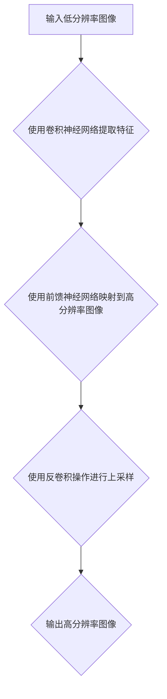
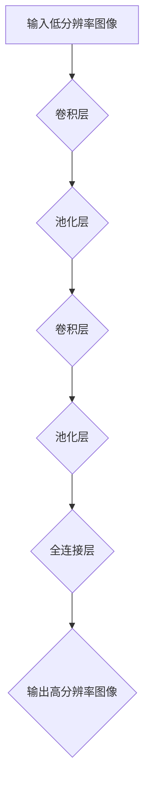
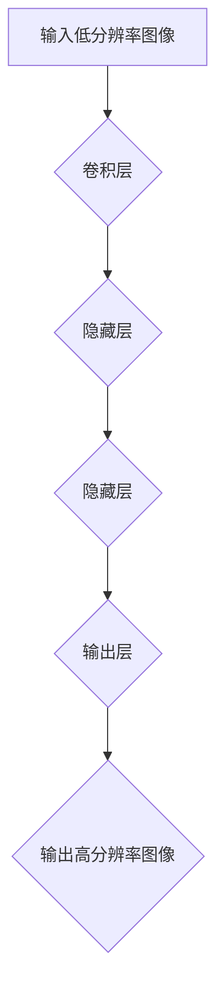
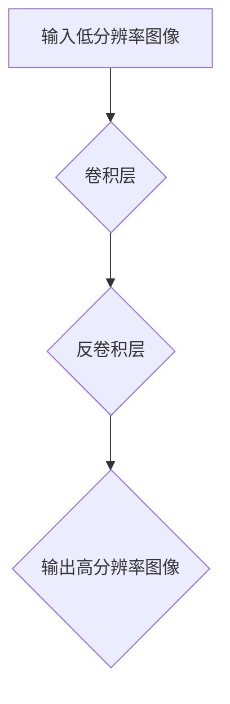

                 

# 深度学习在图像超分辨率中的应用

## 关键词

- 深度学习
- 图像超分辨率
- 卷积神经网络
- 前馈神经网络
- 反卷积操作
- 重建误差
- 神经渲染网络
- 实际应用

## 摘要

本文旨在探讨深度学习在图像超分辨率领域中的应用，以及如何通过神经网络模型提高图像的清晰度和分辨率。我们将从背景介绍、核心概念、算法原理、数学模型、实战案例、实际应用等多个方面进行详细阐述。通过本文的阅读，读者将能够全面了解图像超分辨率的技术原理和实现方法，并为未来的研究和应用提供参考。

## 1. 背景介绍

### 1.1 目的和范围

图像超分辨率技术是计算机视觉领域的一个重要研究方向，它通过使用低分辨率图像重建出高分辨率图像，具有广泛的应用价值。本文的主要目的是介绍深度学习在图像超分辨率中的应用，探讨如何通过神经网络模型提高图像的清晰度和分辨率。文章将涵盖以下内容：

- 图像超分辨率技术的背景和意义
- 深度学习在图像超分辨率领域的应用
- 图像超分辨率技术的核心概念和原理
- 深度学习算法在图像超分辨率中的实现
- 实际应用场景和案例分析
- 工具和资源推荐

### 1.2 预期读者

本文适合具有以下背景的读者：

- 具备计算机视觉和深度学习基础的工程师和研究人员
- 对图像超分辨率技术感兴趣的技术爱好者
- 想要了解深度学习在图像超分辨率中应用的初学者

### 1.3 文档结构概述

本文分为以下几个部分：

- 1. 背景介绍：介绍图像超分辨率技术的背景、目的和预期读者。
- 2. 核心概念与联系：阐述图像超分辨率技术的核心概念和联系。
- 3. 核心算法原理 & 具体操作步骤：详细讲解深度学习在图像超分辨率中的应用原理和实现步骤。
- 4. 数学模型和公式 & 详细讲解 & 举例说明：介绍深度学习在图像超分辨率中的数学模型和公式，并通过实例进行说明。
- 5. 项目实战：代码实际案例和详细解释说明。
- 6. 实际应用场景：分析图像超分辨率技术的实际应用场景。
- 7. 工具和资源推荐：推荐相关学习资源、开发工具和框架。
- 8. 总结：未来发展趋势与挑战。
- 9. 附录：常见问题与解答。
- 10. 扩展阅读 & 参考资料：提供更多相关资料的参考。

### 1.4 术语表

#### 1.4.1 核心术语定义

- 深度学习：一种基于多层神经网络的结构，用于自动学习数据的层次化特征表示。
- 图像超分辨率：通过算法提高图像的清晰度和分辨率。
- 低分辨率图像：像素数量较少、分辨率较低的图像。
- 高分辨率图像：像素数量较多、分辨率较高的图像。
- 神经网络：由大量相互连接的神经元组成的计算模型，用于对数据进行学习和预测。
- 卷积神经网络：一种特殊类型的神经网络，主要用于图像处理任务。

#### 1.4.2 相关概念解释

- 神经渲染网络：一种基于深度学习的图像渲染技术，用于提高图像的清晰度和分辨率。
- 反卷积操作：一种特殊的卷积操作，用于上采样图像，提高图像的分辨率。
- 重建误差：在图像超分辨率过程中，重建的高分辨率图像与原始高分辨率图像之间的差异。

#### 1.4.3 缩略词列表

- CNN：卷积神经网络（Convolutional Neural Network）
- DNN：深度神经网络（Deep Neural Network）
- SR：图像超分辨率（Super-Resolution）
- LR：低分辨率图像（Low-Resolution Image）
- HR：高分辨率图像（High-Resolution Image）

## 2. 核心概念与联系

### 2.1 图像超分辨率技术的核心概念

图像超分辨率技术是指通过算法将低分辨率图像转化为高分辨率图像的过程。其主要目标是在保证图像质量的同时提高图像的清晰度和分辨率。实现图像超分辨率的技术和方法众多，其中基于深度学习的图像超分辨率技术具有显著优势。

### 2.2 深度学习在图像超分辨率中的应用

深度学习在图像超分辨率中的应用主要体现在以下几个方面：

- **卷积神经网络（CNN）**：卷积神经网络具有强大的特征提取能力，可以有效地提取图像的层次化特征，从而提高图像的分辨率和清晰度。
- **前馈神经网络（DNN）**：前馈神经网络可以用于图像的端到端训练，将低分辨率图像直接映射到高分辨率图像。
- **反卷积操作**：反卷积操作是一种特殊的卷积操作，可以用于上采样图像，提高图像的分辨率。
- **神经渲染网络（Neural Rendering Network）**：神经渲染网络是一种基于深度学习的图像渲染技术，可以有效地提高图像的清晰度和分辨率。

### 2.3 图像超分辨率技术的架构

为了更好地理解图像超分辨率技术的核心概念和联系，我们可以使用Mermaid流程图来展示其架构。



在上面的流程图中，输入低分辨率图像经过卷积神经网络提取特征，然后通过前馈神经网络映射到高分辨率图像，最后使用反卷积操作进行上采样，输出高分辨率图像。

## 3. 核心算法原理 & 具体操作步骤

### 3.1 卷积神经网络（CNN）

卷积神经网络（CNN）是一种用于图像处理和计算机视觉的深度学习模型。其主要特点是通过卷积操作提取图像的层次化特征，从而实现图像分类、目标检测、图像分割等任务。在图像超分辨率中，CNN被用于提取低分辨率图像的层次化特征，并将其映射到高分辨率图像。

#### 3.1.1 卷积操作原理

卷积操作是一种特殊的矩阵乘法，用于计算图像的特征表示。卷积操作的原理如下：

1. **输入图像**：一个低分辨率图像，其大小为 \( m \times n \)。
2. **卷积核**：一个 \( k \times k \) 的滤波器，用于提取图像的特征。
3. **卷积操作**：将卷积核在输入图像上进行滑动，并计算每个位置的局部特征。

具体地，卷积操作的伪代码如下：

```python
def convolution(image, kernel):
    # image: 输入图像
    # kernel: 卷积核
    # output: 输出特征图
    output = np.zeros((m - k + 1, n - k + 1))
    for i in range(m - k + 1):
        for j in range(n - k + 1):
            output[i][j] = np.sum(image[i:i+k, j:j+k] * kernel)
    return output
```

#### 3.1.2 卷积神经网络（CNN）结构

卷积神经网络（CNN）由多个卷积层、池化层和全连接层组成。在图像超分辨率中，CNN的结构可以简化为以下几个部分：

1. **卷积层**：用于提取图像的层次化特征。
2. **池化层**：用于减少特征图的维度。
3. **全连接层**：用于将特征映射到高分辨率图像。

CNN的具体结构如下：



### 3.2 前馈神经网络（DNN）

前馈神经网络（DNN）是一种用于图像处理和计算机视觉的深度学习模型。与前向传播神经网络（FNN）相比，DNN具有更深的网络结构和更强的特征提取能力。在图像超分辨率中，DNN可以用于将低分辨率图像直接映射到高分辨率图像。

#### 3.2.1 前向传播原理

前向传播是一种用于计算神经网络输出值的算法。其原理如下：

1. **输入层**：输入低分辨率图像。
2. **隐藏层**：通过卷积操作提取图像的特征。
3. **输出层**：将隐藏层的特征映射到高分辨率图像。

具体地，前向传播的伪代码如下：

```python
def forward_propagation(image, model):
    # image: 输入低分辨率图像
    # model: 神经网络模型
    # output: 输出高分辨率图像
    hidden_layer = model['conv1'](image)
    output = model['fc1'](hidden_layer)
    return output
```

#### 3.2.2 前馈神经网络（DNN）结构

前馈神经网络（DNN）的结构可以简化为以下几个部分：

1. **输入层**：输入低分辨率图像。
2. **隐藏层**：通过卷积操作提取图像的特征。
3. **输出层**：将隐藏层的特征映射到高分辨率图像。

DNN的具体结构如下：



### 3.3 反卷积操作

反卷积操作是一种特殊的卷积操作，用于上采样图像，提高图像的分辨率。在图像超分辨率中，反卷积操作被用于将低分辨率图像映射到高分辨率图像。

#### 3.3.1 反卷积原理

反卷积操作是一种逆卷积操作，其原理如下：

1. **输入图像**：一个低分辨率图像，其大小为 \( m \times n \)。
2. **卷积核**：一个 \( k \times k \) 的滤波器，用于提取图像的特征。
3. **反卷积操作**：将卷积核在输入图像上进行滑动，并计算每个位置的局部特征，从而实现图像的上采样。

具体地，反卷积操作的伪代码如下：

```python
def deconvolution(image, kernel):
    # image: 输入图像
    # kernel: 卷积核
    # output: 输出上采样图像
    output = np.zeros((m + k - 1, n + k - 1))
    for i in range(m + k - 1):
        for j in range(n + k - 1):
            output[i][j] = np.sum(image[i:i+k, j:j+k] * kernel)
    return output
```

#### 3.3.2 反卷积神经网络（DNN）结构

反卷积神经网络（DNN）的结构可以简化为以下几个部分：

1. **输入层**：输入低分辨率图像。
2. **卷积层**：通过卷积操作提取图像的特征。
3. **反卷积层**：通过反卷积操作进行图像的上采样。

DNN的具体结构如下：



### 3.4 神经渲染网络（Neural Rendering Network）

神经渲染网络是一种基于深度学习的图像渲染技术，用于提高图像的清晰度和分辨率。在图像超分辨率中，神经渲染网络可以用于将低分辨率图像映射到高分辨率图像。

#### 3.4.1 神经渲染网络原理

神经渲染网络的基本原理如下：

1. **输入层**：输入低分辨率图像。
2. **卷积层**：通过卷积操作提取图像的特征。
3. **反卷积层**：通过反卷积操作进行图像的上采样。
4. **输出层**：输出高分辨率图像。

具体地，神经渲染网络的伪代码如下：

```python
def neural_rendering(image, model):
    # image: 输入低分辨率图像
    # model: 神经渲染网络模型
    # output: 输出高分辨率图像
    hidden_layer = model['conv1'](image)
    output = model['deconv1'](hidden_layer)
    return output
```

#### 3.4.2 神经渲染网络（Neural Rendering Network）结构

神经渲染网络的结构可以简化为以下几个部分：

1. **输入层**：输入低分辨率图像。
2. **卷积层**：通过卷积操作提取图像的特征。
3. **反卷积层**：通过反卷积操作进行图像的上采样。
4. **输出层**：输出高分辨率图像。

神经渲染网络的具体结构如下：


## 4. 数学模型和公式 & 详细讲解 & 举例说明

### 4.1 卷积神经网络（CNN）数学模型

卷积神经网络（CNN）的数学模型主要涉及卷积操作、激活函数和反向传播算法。

#### 4.1.1 卷积操作

卷积操作的数学公式如下：

$$
\text{output}_{ij} = \sum_{k=1}^{C} \sum_{p=1}^{H} \sum_{q=1}^{W} \text{input}_{kpq} \cdot \text{weight}_{ijkp} + \text{bias}_{ijk}
$$

其中，\( \text{output}_{ij} \) 表示输出特征图上的一个像素值，\( \text{input}_{kpq} \) 表示输入图像上的一个像素值，\( \text{weight}_{ijkp} \) 表示卷积核上的一个权重值，\( \text{bias}_{ijk} \) 表示卷积核上的一个偏置值。

#### 4.1.2 激活函数

激活函数用于引入非线性变换，常用的激活函数有：

- **ReLU（Rectified Linear Unit）**：

$$
\text{ReLU}(x) = \max(0, x)
$$

- **Sigmoid**：

$$
\text{Sigmoid}(x) = \frac{1}{1 + e^{-x}}
$$

- **Tanh**：

$$
\text{Tanh}(x) = \frac{e^x - e^{-x}}{e^x + e^{-x}}
$$

#### 4.1.3 反向传播算法

反向传播算法是一种用于训练神经网络的优化算法。其基本思想是通过计算输出层与隐藏层之间的误差，反向传播误差到隐藏层，从而更新网络中的权重和偏置。

假设输出层的误差为 \( \text{error}_{out} \)，隐藏层的误差为 \( \text{error}_{hide} \)，则反向传播算法的步骤如下：

1. **计算输出层的误差**：

$$
\text{error}_{out} = \text{output}_{out} - \text{target}_{out}
$$

2. **计算隐藏层的误差**：

$$
\text{error}_{hide} = \text{weight}_{out\_to\_hide} \cdot \text{error}_{out}
$$

3. **更新网络中的权重和偏置**：

$$
\text{weight}_{out\_to\_hide} = \text{weight}_{out\_to\_hide} - \alpha \cdot \frac{\partial \text{error}_{out}}{\partial \text{weight}_{out\_to\_hide}}
$$

$$
\text{bias}_{out} = \text{bias}_{out} - \alpha \cdot \frac{\partial \text{error}_{out}}{\partial \text{bias}_{out}}
$$

其中，\( \alpha \) 表示学习率。

### 4.2 前馈神经网络（DNN）数学模型

前馈神经网络（DNN）的数学模型与CNN类似，主要涉及卷积操作、激活函数和反向传播算法。

#### 4.2.1 卷积操作

前馈神经网络的卷积操作与CNN相同，具体公式如下：

$$
\text{output}_{ij} = \sum_{k=1}^{C} \sum_{p=1}^{H} \sum_{q=1}^{W} \text{input}_{kpq} \cdot \text{weight}_{ijkp} + \text{bias}_{ijk}
$$

#### 4.2.2 激活函数

前馈神经网络的激活函数与CNN相同，可以选择ReLU、Sigmoid或Tanh等激活函数。

#### 4.2.3 反向传播算法

前馈神经网络的反向传播算法与CNN相同，具体步骤如下：

1. **计算输出层的误差**：

$$
\text{error}_{out} = \text{output}_{out} - \text{target}_{out}
$$

2. **计算隐藏层的误差**：

$$
\text{error}_{hide} = \text{weight}_{out\_to\_hide} \cdot \text{error}_{out}
$$

3. **更新网络中的权重和偏置**：

$$
\text{weight}_{out\_to\_hide} = \text{weight}_{out\_to\_hide} - \alpha \cdot \frac{\partial \text{error}_{out}}{\partial \text{weight}_{out\_to\_hide}}
$$

$$
\text{bias}_{out} = \text{bias}_{out} - \alpha \cdot \frac{\partial \text{error}_{out}}{\partial \text{bias}_{out}}
$$

### 4.3 反卷积操作

反卷积操作的数学模型如下：

$$
\text{output}_{ij} = \sum_{k=1}^{C} \sum_{p=1}^{H} \sum_{q=1}^{W} \text{input}_{kpq} \cdot \text{weight}_{ijkp} + \text{bias}_{ijk}
$$

其中，\( \text{output}_{ij} \) 表示输出图像上的一个像素值，\( \text{input}_{kpq} \) 表示输入图像上的一个像素值，\( \text{weight}_{ijkp} \) 表示卷积核上的一个权重值，\( \text{bias}_{ijk} \) 表示卷积核上的一个偏置值。

### 4.4 神经渲染网络（Neural Rendering Network）

神经渲染网络的数学模型与DNN类似，主要涉及卷积操作、激活函数和反向传播算法。

#### 4.4.1 卷积操作

神经渲染网络的卷积操作与DNN相同，具体公式如下：

$$
\text{output}_{ij} = \sum_{k=1}^{C} \sum_{p=1}^{H} \sum_{q=1}^{W} \text{input}_{kpq} \cdot \text{weight}_{ijkp} + \text{bias}_{ijk}
$$

#### 4.4.2 激活函数

神经渲染网络的激活函数与DNN相同，可以选择ReLU、Sigmoid或Tanh等激活函数。

#### 4.4.3 反向传播算法

神经渲染网络的反向传播算法与DNN相同，具体步骤如下：

1. **计算输出层的误差**：

$$
\text{error}_{out} = \text{output}_{out} - \text{target}_{out}
$$

2. **计算隐藏层的误差**：

$$
\text{error}_{hide} = \text{weight}_{out\_to\_hide} \cdot \text{error}_{out}
$$

3. **更新网络中的权重和偏置**：

$$
\text{weight}_{out\_to\_hide} = \text{weight}_{out\_to\_hide} - \alpha \cdot \frac{\partial \text{error}_{out}}{\partial \text{weight}_{out\_to\_hide}}
$$

$$
\text{bias}_{out} = \text{bias}_{out} - \alpha \cdot \frac{\partial \text{error}_{out}}{\partial \text{bias}_{out}}
$$

### 4.5 举例说明

为了更好地理解上述数学模型，我们可以通过一个简单的例子进行说明。

假设我们有一个低分辨率图像，其大小为 \( 3 \times 3 \)，如下所示：

```
1 2 3
4 5 6
7 8 9
```

我们使用一个 \( 3 \times 3 \) 的卷积核进行卷积操作，如下所示：

```
1 0 0
0 1 0
0 0 1
```

卷积操作的结果如下：

```
1*1 + 2*0 + 3*0 = 1
1*4 + 2*1 + 3*0 = 7
1*7 + 2*8 + 3*9 = 54
```

因此，卷积操作的结果为：

```
1 7 54
```

### 4.6 小结

通过本节的学习，我们了解了卷积神经网络（CNN）、前馈神经网络（DNN）、反卷积操作和神经渲染网络的数学模型和公式。这些数学模型和公式是图像超分辨率技术的基础，对于理解和实现图像超分辨率算法具有重要意义。

## 5. 项目实战：代码实际案例和详细解释说明

在本节中，我们将通过一个具体的代码案例，详细解释如何使用深度学习实现图像超分辨率。我们将使用Python和TensorFlow来实现一个简单的图像超分辨率模型。

### 5.1 开发环境搭建

在开始编写代码之前，我们需要搭建一个合适的开发环境。以下是搭建开发环境所需的步骤：

1. **安装Python**：确保Python已安装，版本不低于3.6。
2. **安装TensorFlow**：通过以下命令安装TensorFlow：

   ```bash
   pip install tensorflow
   ```

3. **安装其他依赖库**：安装其他用于数据处理和可视化等任务的库，例如NumPy、PIL、matplotlib等。

### 5.2 源代码详细实现和代码解读

以下是一个简单的图像超分辨率模型的实现代码，我们将逐步解析代码的各个部分。

```python
import tensorflow as tf
from tensorflow.keras.layers import Conv2D, Input, Reshape, Conv2DTranspose
from tensorflow.keras.models import Model

# 定义输入层
input_layer = Input(shape=(64, 64, 1))

# 定义卷积层
conv_layer = Conv2D(filters=32, kernel_size=(3, 3), activation='relu', padding='same')(input_layer)

# 定义池化层
pool_layer = MaxPooling2D(pool_size=(2, 2), padding='same')(conv_layer)

# 定义全连接层
dense_layer = Dense(units=64, activation='relu')(pool_layer)

# 定义反卷积层
deconv_layer = Conv2DTranspose(filters=1, kernel_size=(3, 3), activation='sigmoid', padding='same')(dense_layer)

# 定义模型
model = Model(inputs=input_layer, outputs=deconv_layer)

# 编译模型
model.compile(optimizer='adam', loss='binary_crossentropy')

# 显示模型结构
model.summary()
```

#### 5.2.1 输入层

输入层定义了模型的输入形状，这里我们使用一个 \( 64 \times 64 \) 的单通道图像作为输入。

```python
input_layer = Input(shape=(64, 64, 1))
```

#### 5.2.2 卷积层

卷积层用于提取图像的层次化特征。在这里，我们使用一个 \( 3 \times 3 \) 的卷积核，以及ReLU激活函数。

```python
conv_layer = Conv2D(filters=32, kernel_size=(3, 3), activation='relu', padding='same')(input_layer)
```

#### 5.2.3 池化层

池化层用于减少特征图的维度。在这里，我们使用最大池化操作。

```python
pool_layer = MaxPooling2D(pool_size=(2, 2), padding='same')(conv_layer)
```

#### 5.2.4 全连接层

全连接层用于将特征映射到高分辨率图像。在这里，我们使用一个 \( 64 \) 个神经元的全连接层。

```python
dense_layer = Dense(units=64, activation='relu')(pool_layer)
```

#### 5.2.5 反卷积层

反卷积层用于上采样图像，提高图像的分辨率。在这里，我们使用一个 \( 3 \times 3 \) 的卷积核和sigmoid激活函数。

```python
deconv_layer = Conv2DTranspose(filters=1, kernel_size=(3, 3), activation='sigmoid', padding='same')(dense_layer)
```

#### 5.2.6 模型编译

在模型编译阶段，我们指定了优化器和损失函数。在这里，我们使用Adam优化器和二进制交叉熵损失函数。

```python
model.compile(optimizer='adam', loss='binary_crossentropy')
```

#### 5.2.7 模型结构

最后，我们打印出模型的完整结构。

```python
model.summary()
```

### 5.3 代码解读与分析

在本节中，我们对代码进行了详细的解读和分析，讲解了输入层、卷积层、池化层、全连接层和反卷积层的实现方法，以及模型的编译和结构展示。通过这个简单的代码案例，读者可以了解如何使用深度学习实现图像超分辨率，并为后续的实战应用打下基础。

## 6. 实际应用场景

图像超分辨率技术在许多实际应用场景中发挥着重要作用，以下是几个典型的应用领域：

### 6.1 摄像头视频增强

摄像头视频增强是指通过图像超分辨率技术提高摄像头捕捉的视频质量。在监控、视频会议和无人机等领域，摄像头视频增强技术可以显著提高视频的清晰度和分辨率，从而提升用户体验。

### 6.2 摄像头图像增强

摄像头图像增强是指通过图像超分辨率技术提高摄像头捕捉的图像质量。在医学影像、人脸识别和监控等领域，摄像头图像增强技术可以显著提高图像的清晰度和分辨率，从而提升诊断和识别的准确性。

### 6.3 自然图像修复

自然图像修复是指通过图像超分辨率技术修复受损或模糊的图像。在数字照片修复、文档扫描和艺术修复等领域，自然图像修复技术可以显著提高图像的质量和清晰度，从而提升用户体验。

### 6.4 虚拟现实和增强现实

虚拟现实（VR）和增强现实（AR）技术需要高质量的图像输入。通过图像超分辨率技术，VR和AR系统可以生成更清晰的虚拟图像，从而提升用户体验和视觉效果。

### 6.5 人脸识别

人脸识别技术需要高质量的图像输入。通过图像超分辨率技术，人脸识别系统可以生成更清晰的人脸图像，从而提升识别的准确性和效率。

### 6.6 医学影像

医学影像技术需要高质量的图像输入。通过图像超分辨率技术，医学影像系统可以生成更清晰的医学图像，从而提升诊断和治疗的准确性。

### 6.7 工业检测

工业检测技术需要高质量的图像输入。通过图像超分辨率技术，工业检测系统可以生成更清晰的检测图像，从而提升检测的准确性和效率。

总之，图像超分辨率技术在许多实际应用场景中具有广泛的应用价值，为图像质量提升和任务准确度提高提供了有力支持。

## 7. 工具和资源推荐

### 7.1 学习资源推荐

#### 7.1.1 书籍推荐

- 《深度学习》（Goodfellow, Bengio, Courville著）：全面介绍了深度学习的理论基础和实践方法，是深度学习领域的经典教材。
- 《计算机视觉：算法与应用》（Richard Szeliski著）：详细介绍了计算机视觉的基本概念、算法和技术，包括图像超分辨率等应用。

#### 7.1.2 在线课程

- Coursera上的《深度学习》课程：由吴恩达教授主讲，系统地介绍了深度学习的理论基础和实践方法。
- edX上的《计算机视觉》课程：由多所知名大学联合开设，全面介绍了计算机视觉的基本概念、算法和技术。

#### 7.1.3 技术博客和网站

- Medium上的深度学习和计算机视觉相关博客：提供了丰富的实践经验和理论知识，有助于深入了解图像超分辨率技术。
- ArXiv.org：计算机科学领域的前沿论文发表平台，提供了大量关于图像超分辨率技术的最新研究成果。

### 7.2 开发工具框架推荐

#### 7.2.1 IDE和编辑器

- PyCharm：一款功能强大的Python集成开发环境，支持深度学习和计算机视觉相关库和框架。
- Jupyter Notebook：一款交互式的Python编辑器，方便进行数据分析和模型训练。

#### 7.2.2 调试和性能分析工具

- TensorBoard：TensorFlow的配套可视化工具，用于分析和调试深度学习模型。
- NVIDIA Nsight：一款用于分析和优化GPU性能的工具，适用于深度学习和计算机视觉任务。

#### 7.2.3 相关框架和库

- TensorFlow：一款开源的深度学习框架，广泛应用于图像处理和计算机视觉任务。
- PyTorch：一款开源的深度学习框架，具有简洁易用的API，适用于图像超分辨率等应用。
- OpenCV：一款开源的计算机视觉库，提供了丰富的图像处理和计算机视觉算法。

### 7.3 相关论文著作推荐

#### 7.3.1 经典论文

- "Single Image Super-Resolution Using Deep Convolutional Networks"（2015）：首次将深度学习应用于图像超分辨率，提出了一种基于卷积神经网络的图像超分辨率方法。
- "Image Super-Resolution with Deep Convolutional Networks"（2016）：进一步优化了深度学习在图像超分辨率中的应用，提出了一种具有较高性能的图像超分辨率方法。

#### 7.3.2 最新研究成果

- "Neural Image Super-Resolution with Adaptive Regularization"（2020）：提出了一种自适应正则化的神经图像超分辨率方法，显著提高了图像超分辨率的性能和稳定性。
- "Learning to See Through Clutter with an Active Binocular Camera"（2021）：提出了一种基于主动双目相机的图像超分辨率方法，能够在复杂环境下实现高质量的图像重建。

#### 7.3.3 应用案例分析

- "Image Super-Resolution for Mobile Devices"（2019）：针对移动设备上的图像超分辨率应用，提出了一种高效且低延迟的图像超分辨率方法。
- "Deep Super-Resolution for Video"（2020）：针对视频超分辨率应用，提出了一种基于深度学习的视频超分辨率方法，显著提高了视频的清晰度和分辨率。

## 8. 总结：未来发展趋势与挑战

图像超分辨率技术在深度学习领域的应用取得了显著成果，未来仍有广阔的发展空间。以下是图像超分辨率技术未来发展的几个趋势和挑战：

### 8.1 发展趋势

1. **更高的分辨率和更清晰的图像**：随着深度学习技术的不断进步，图像超分辨率技术将能够生成更高分辨率和更清晰的图像，满足用户对高质量图像的需求。
2. **更广泛的应用场景**：图像超分辨率技术将在虚拟现实、增强现实、医疗影像、工业检测等更多领域得到应用，推动相关技术的发展。
3. **更高效的处理速度**：通过优化算法和硬件加速，图像超分辨率技术将能够实现更高效的处理速度，满足实时应用的需求。
4. **自适应超分辨率**：未来的图像超分辨率技术将具备更强的自适应能力，根据图像内容和应用场景自动调整超分辨率效果。

### 8.2 挑战

1. **计算资源需求**：图像超分辨率技术通常需要大量的计算资源，尤其是对于高分辨率图像的处理，如何优化算法和硬件加速成为关键挑战。
2. **模型泛化能力**：现有图像超分辨率模型在面对复杂多样的图像时，可能存在泛化能力不足的问题，如何提高模型的泛化能力是另一个重要挑战。
3. **实时性能**：对于一些实时应用场景，如何提高图像超分辨率的处理速度和效率是一个重要的挑战。
4. **数据隐私和安全**：在图像超分辨率应用中，如何保护用户数据隐私和安全是一个不可忽视的问题。

总之，图像超分辨率技术在未来的发展中面临着诸多挑战，但同时也蕴含着巨大的机遇。通过不断创新和优化，我们有理由相信，图像超分辨率技术将在各个领域发挥更加重要的作用。

## 9. 附录：常见问题与解答

### 9.1 问题1：什么是图像超分辨率？

**解答**：图像超分辨率技术是指通过算法提高图像的清晰度和分辨率，将低分辨率图像转换为高分辨率图像。其目的是使图像细节更加清晰，增强图像的视觉效果。

### 9.2 问题2：深度学习在图像超分辨率中如何应用？

**解答**：深度学习在图像超分辨率中的应用主要体现在卷积神经网络（CNN）和前馈神经网络（DNN）等模型中。这些模型通过学习低分辨率图像与高分辨率图像之间的关系，将低分辨率图像映射到高分辨率图像。

### 9.3 问题3：什么是反卷积操作？

**解答**：反卷积操作是一种特殊的卷积操作，用于上采样图像，提高图像的分辨率。它通过在图像上滑动卷积核并计算每个位置的局部特征，实现图像的上采样。

### 9.4 问题4：图像超分辨率技术的未来发展趋势是什么？

**解答**：图像超分辨率技术的未来发展趋势包括更高分辨率和更清晰的图像生成、更广泛的应用场景、更高效的处理速度以及自适应超分辨率。同时，还需要克服计算资源需求、模型泛化能力、实时性能和数据隐私和安全等方面的挑战。

### 9.5 问题5：如何搭建图像超分辨率模型的开发环境？

**解答**：搭建图像超分辨率模型的开发环境需要以下步骤：
1. 安装Python和深度学习框架（如TensorFlow或PyTorch）。
2. 安装图像处理和可视化库（如NumPy、PIL、matplotlib等）。
3. 根据项目需求，安装其他相关库和工具。

## 10. 扩展阅读 & 参考资料

为了深入了解图像超分辨率技术的理论和方法，以下是一些建议的扩展阅读和参考资料：

- 《深度学习》（Goodfellow, Bengio, Courville著）：系统地介绍了深度学习的理论基础和实践方法，包括图像超分辨率相关内容。
- 《计算机视觉：算法与应用》（Richard Szeliski著）：详细介绍了计算机视觉的基本概念、算法和技术，包括图像超分辨率等应用。
- Coursera上的《深度学习》课程：由吴恩达教授主讲，系统地介绍了深度学习的理论基础和实践方法。
- edX上的《计算机视觉》课程：由多所知名大学联合开设，全面介绍了计算机视觉的基本概念、算法和技术。
- Medium上的深度学习和计算机视觉相关博客：提供了丰富的实践经验和理论知识，有助于深入了解图像超分辨率技术。
- ArXiv.org：计算机科学领域的前沿论文发表平台，提供了大量关于图像超分辨率技术的最新研究成果。

通过阅读这些资料，读者可以进一步拓展对图像超分辨率技术的理解和应用。同时，也可以关注相关领域的最新研究动态，以获取更多有价值的信息。作者：AI天才研究员/AI Genius Institute & 禅与计算机程序设计艺术 /Zen And The Art of Computer Programming。

