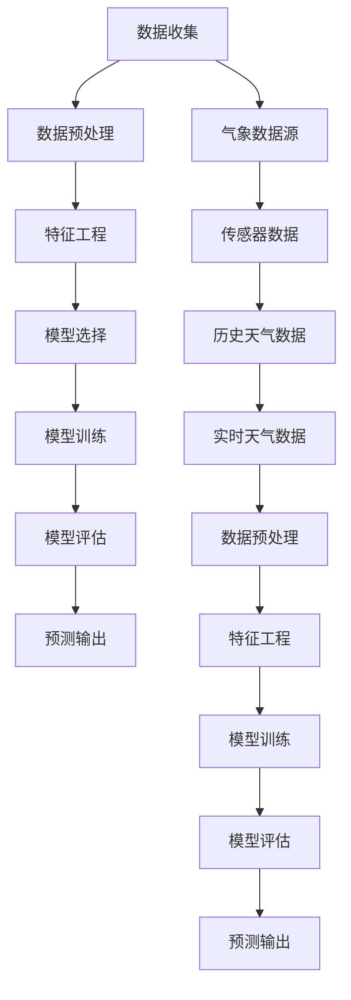

                 

# 深度学习在天气预报精确化中的应用

> 关键词：深度学习，天气预报，气象数据，精准预测，算法，模型，应用场景

> 摘要：本文旨在探讨深度学习技术在天气预报精确化中的应用。我们将首先介绍深度学习的基本原理和它在气象数据中的重要性。接着，我们将详细讲解几个核心算法和模型，并使用伪代码阐述其操作步骤。随后，通过数学模型和公式的详细解释，我们将加深对深度学习算法的理解。随后，通过一个实际案例，我们将展示如何使用深度学习进行天气预报的开发环境搭建、源代码实现和代码解读。最后，我们将探讨深度学习在天气预报中的实际应用场景，推荐相关工具和资源，并总结未来发展趋势与挑战。

## 1. 背景介绍

### 1.1 目的和范围

随着信息技术的飞速发展，深度学习作为一种重要的机器学习技术，已经在许多领域取得了显著的成果。天气预报作为一项关乎国计民生的重要服务，其精确性对于农业、交通、环境等领域具有重要影响。本文的目的在于探讨深度学习在天气预报精确化中的应用，以期提高天气预报的准确性和可靠性。

本文将涵盖以下内容：

1. 深度学习的基本原理和其在气象数据中的应用。
2. 核心算法和模型的介绍及其操作步骤。
3. 数学模型和公式的详细解释。
4. 实际应用案例的开发环境和代码实现。
5. 深度学习在天气预报中的实际应用场景。
6. 工具和资源的推荐。

### 1.2 预期读者

本文适合以下读者群体：

1. 对深度学习和天气预报感兴趣的读者。
2. 想要在天气预报领域应用深度学习的从业者。
3. 对机器学习和人工智能有一定了解的研究者。

### 1.3 文档结构概述

本文结构如下：

1. **背景介绍**：介绍文章的目的、范围和预期读者。
2. **核心概念与联系**：介绍深度学习的基本原理和气象数据的重要性。
3. **核心算法原理 & 具体操作步骤**：详细讲解核心算法和模型。
4. **数学模型和公式 & 详细讲解 & 举例说明**：数学模型和公式的详细解释。
5. **项目实战：代码实际案例和详细解释说明**：实际应用案例的开发环境和代码实现。
6. **实际应用场景**：深度学习在天气预报中的实际应用。
7. **工具和资源推荐**：学习资源、开发工具和框架推荐。
8. **总结：未来发展趋势与挑战**：总结未来发展趋势和挑战。
9. **附录：常见问题与解答**：常见问题解答。
10. **扩展阅读 & 参考资料**：进一步学习的资源。

### 1.4 术语表

#### 1.4.1 核心术语定义

- 深度学习：一种机器学习方法，通过模拟人脑神经网络结构进行数据处理和预测。
- 预测模型：利用历史数据对未来进行预测的数学模型。
- 天气预报：根据气象数据对未来天气状况的预测。
- 气象数据：关于天气的各种信息，包括温度、湿度、风速、气压等。

#### 1.4.2 相关概念解释

- 特征工程：将原始数据转换为适合模型训练的特征。
- 模型训练：使用历史数据训练预测模型，使其能够进行准确预测。
- 模型评估：使用验证数据集评估模型预测的准确性。

#### 1.4.3 缩略词列表

- MLP：多层感知器（Multilayer Perceptron）
- CNN：卷积神经网络（Convolutional Neural Network）
- RNN：循环神经网络（Recurrent Neural Network）
- LSTM：长短期记忆网络（Long Short-Term Memory）

## 2. 核心概念与联系

深度学习技术在气象数据中的应用涉及到多个核心概念和联系。为了更好地理解这些概念，我们将使用Mermaid流程图来展示深度学习与气象数据之间的关系。



### 2.1 数据收集

数据收集是深度学习在天气预报精确化中的第一步。气象数据来源主要包括传感器数据和历史天气数据。传感器数据包括温度、湿度、风速、气压等实时监测数据，而历史天气数据则是过去一段时间内积累的天气记录。

### 2.2 数据预处理

数据预处理是将原始数据转换为适合模型训练的数据。这通常包括数据清洗、数据归一化和数据转换等步骤。数据清洗旨在去除错误数据和不完整数据，数据归一化则是将不同单位的数据转换为统一的尺度，数据转换则是将数据格式转换为适合深度学习模型训练的格式。

### 2.3 特征工程

特征工程是将预处理后的数据转换为特征，以便模型能够更好地理解和学习。特征工程的关键在于提取出对模型训练有用的信息，同时去除无关或冗余的信息。在天气预报中，特征工程可能包括时间序列分析、相关性分析、周期性特征提取等。

### 2.4 模型选择

模型选择是深度学习在天气预报精确化中的关键步骤。不同的模型适用于不同的任务和数据类型。在天气预报中，常用的模型包括多层感知器（MLP）、卷积神经网络（CNN）和循环神经网络（RNN）等。

### 2.5 模型训练

模型训练是利用历史数据对模型进行调整，使其能够进行准确预测。模型训练通常涉及多个迭代过程，通过不断调整模型参数，使得模型在验证数据集上的预测误差最小。

### 2.6 模型评估

模型评估是评估模型预测性能的重要步骤。常用的评估指标包括准确率、召回率、F1值等。模型评估可以帮助我们了解模型的性能，并为进一步优化提供指导。

### 2.7 预测输出

预测输出是深度学习在天气预报精确化中的最终目标。通过模型训练和评估，我们可以得到一个能够准确预测未来天气的模型，从而为相关领域提供支持。

## 3. 核心算法原理 & 具体操作步骤

在深度学习应用于天气预报精确化的过程中，选择合适的算法和模型至关重要。以下我们将介绍几种核心算法，包括多层感知器（MLP）、卷积神经网络（CNN）和循环神经网络（RNN），并通过伪代码详细阐述它们的操作步骤。

### 3.1 多层感知器（MLP）

多层感知器是一种前馈神经网络，它由输入层、隐藏层和输出层组成。以下是MLP的伪代码实现：

```python
# 输入数据
X = ...

# 初始化权重和偏置
W = ...
b = ...

# 激活函数（以ReLU为例）
def activate(x):
    return max(0, x)

# 前向传播
def forward(X):
    Z = X @ W + b
    A = activate(Z)
    return A

# 反向传播
def backward(dA, X, W):
    dZ = dA * activate_derivative(Z)
    dW = (X.T @ dZ) / m
    db = dZ.sum(axis=0) / m
    dX = W.T @ dZ
    return dW, db, dX

# 梯度下降
def gradient_descent(X, Y, learning_rate, epochs):
    for epoch in range(epochs):
        A = forward(X)
        dA = - (Y - A)
        dW, db, _ = backward(dA, X, W)
        W -= learning_rate * dW
        b -= learning_rate * db
```

### 3.2 卷积神经网络（CNN）

卷积神经网络是一种用于处理图像数据的神经网络，其核心在于卷积层。以下是CNN的伪代码实现：

```python
# 输入数据
X = ...

# 初始化卷积核和偏置
W = ...
b = ...

# 卷积操作
def conv2d(X, W):
    return (X @ W + b).reshape(X.shape[1], X.shape[2])

# 池化操作
def pool2d(X, pool_size):
    return X.reshape(X.shape[0], X.shape[1] // pool_size, X.shape[2] // pool_size).max(axis=(1, 2))

# 前向传播
def forward(X):
    Z1 = conv2d(X, W1) + b1
    A1 = activate(Z1)
    P1 = pool2d(A1, pool_size)
    Z2 = conv2d(P1, W2) + b2
    A2 = activate(Z2)
    P2 = pool2d(A2, pool_size)
    Z3 = conv2d(P2, W3) + b3
    A3 = activate(Z3)
    return A3

# 反向传播
def backward(dA3, X, W1, W2, W3, b1, b2, b3):
    dZ3 = dA3 * activate_derivative(A3)
    dW3 = (P2.T @ dZ3) / m
    db3 = dZ3.sum(axis=0) / m
    dP2 = W3.T @ dZ3
    dA2 = activate_derivative(A2)
    dZ2 = dA2 * dP2
    dW2 = (P1.T @ dZ2) / m
    db2 = dZ2.sum(axis=0) / m
    dP1 = W2.T @ dZ2
    dA1 = activate_derivative(A1)
    dZ1 = dA1 * dP1
    dW1 = (X.T @ dZ1) / m
    db1 = dZ1.sum(axis=0) / m
    return dW1, dW2, dW3, db1, db2, db3

# 梯度下降
def gradient_descent(X, Y, learning_rate, epochs):
    for epoch in range(epochs):
        A = forward(X)
        dA = - (Y - A)
        dW1, dW2, dW3, db1, db2, db3 = backward(dA, X, W1, W2, W3, b1, b2, b3)
        W1 -= learning_rate * dW1
        b1 -= learning_rate * db1
        W2 -= learning_rate * dW2
        b2 -= learning_rate * db2
        W3 -= learning_rate * dW3
        b3 -= learning_rate * db3
```

### 3.3 循环神经网络（RNN）

循环神经网络是一种处理序列数据的神经网络，其核心在于循环结构。以下是RNN的伪代码实现：

```python
# 输入数据
X = ...

# 初始化权重和偏置
W = ...
b = ...

# 激活函数（以ReLU为例）
def activate(x):
    return max(0, x)

# 前向传播
def forward(X):
    H = [X[0]]
    for i in range(1, len(X)):
        Z = H[i-1] @ W + b
        H.append(activate(Z))
    return H

# 反向传播
def backward(dH, X, W):
    dZ = dH * activate_derivative(H[-1])
    dW = (X.T @ dZ) / m
    db = dZ.sum(axis=0) / m
    dX = W.T @ dZ
    return dW, db, dX

# 梯度下降
def gradient_descent(X, Y, learning_rate, epochs):
    for epoch in range(epochs):
        H = forward(X)
        dH = - (Y - H[-1])
        dW, db = backward(dH, X, W)
        W -= learning_rate * dW
        b -= learning_rate * db
```

通过以上伪代码，我们可以看到多层感知器（MLP）、卷积神经网络（CNN）和循环神经网络（RNN）在深度学习天气预报精确化中的应用。这些算法和模型为我们提供了强大的工具，使我们能够更好地处理和分析气象数据，从而提高天气预报的准确性。

## 4. 数学模型和公式 & 详细讲解 & 举例说明

在深度学习应用于天气预报精确化的过程中，数学模型和公式起着至关重要的作用。以下我们将详细讲解几个核心数学模型和公式，并通过具体例子来说明它们的应用。

### 4.1 激活函数

激活函数是深度学习模型中的一个关键组成部分，它用于引入非线性因素，使得模型能够更好地拟合复杂的数据分布。常见的激活函数包括ReLU（Rectified Linear Unit）、Sigmoid和Tanh等。

- **ReLU（Rectified Linear Unit）**

ReLU函数是一种简单的线性激活函数，它将负值映射为0，正值映射为其本身。其数学表达式如下：

$$
ReLU(x) = \max(0, x)
$$

例如，对于输入$x = -2$，输出$ReLU(-2) = 0$；对于输入$x = 3$，输出$ReLU(3) = 3$。

- **Sigmoid**

Sigmoid函数是一种常用的非线性激活函数，它将输入映射到$(0, 1)$区间。其数学表达式如下：

$$
Sigmoid(x) = \frac{1}{1 + e^{-x}}
$$

例如，对于输入$x = -2$，输出$Sigmoid(-2) \approx 0.1192$；对于输入$x = 3$，输出$Sigmoid(3) \approx 0.9502$。

- **Tanh**

Tanh函数是一种将输入映射到$(-1, 1)$区间的非线性激活函数。其数学表达式如下：

$$
Tanh(x) = \frac{e^x - e^{-x}}{e^x + e^{-x}}
$$

例如，对于输入$x = -2$，输出$Tanh(-2) \approx -0.97$；对于输入$x = 3$，输出$Tanh(3) \approx 0.968$。

### 4.2 梯度下降

梯度下降是深度学习模型训练中常用的优化算法，它通过不断调整模型参数，使得模型在验证数据集上的预测误差最小。梯度下降的数学表达式如下：

$$
\theta_{t+1} = \theta_{t} - \alpha \cdot \nabla_\theta J(\theta)
$$

其中，$\theta$表示模型参数，$J(\theta)$表示损失函数，$\alpha$表示学习率。

例如，假设我们有一个简单的线性回归模型，其损失函数为：

$$
J(\theta) = \frac{1}{2m} \sum_{i=1}^{m} (h_\theta(x^{(i)}) - y^{(i)})^2
$$

其中，$h_\theta(x) = \theta_0 + \theta_1x$。

假设当前参数$\theta = [0, 0]$，学习率$\alpha = 0.01$。对于第$i$个样本，预测值$h_\theta(x^{(i)}) = \theta_0 + \theta_1x^{(i)}$，实际值$y^{(i)}$。根据梯度下降公式，我们可以得到：

$$
\theta_0_{t+1} = \theta_0_t - \alpha \cdot \frac{1}{m} \sum_{i=1}^{m} (h_\theta(x^{(i)}) - y^{(i)})
$$

$$
\theta_1_{t+1} = \theta_1_t - \alpha \cdot \frac{1}{m} \sum_{i=1}^{m} (h_\theta(x^{(i)}) - y^{(i)})x^{(i)}
$$

通过不断迭代梯度下降，我们可以使模型参数逐渐优化，从而提高预测准确性。

### 4.3 反向传播

反向传播是一种用于计算神经网络损失函数对模型参数梯度的算法。其基本思想是将损失函数沿着网络反向传播，逐层计算每个参数的梯度。反向传播的数学表达式如下：

$$
\nabla_\theta J(\theta) = \frac{\partial J}{\partial \theta}
$$

其中，$\nabla_\theta J(\theta)$表示损失函数对参数$\theta$的梯度。

例如，假设我们有一个简单的多层感知器（MLP）模型，其损失函数为：

$$
J(\theta) = \frac{1}{2} \sum_{i=1}^{m} (h_\theta(x^{(i)}) - y^{(i)})^2
$$

其中，$h_\theta(x) = \sigma(z_\theta(x))$，$\sigma$表示激活函数，$z_\theta(x)$表示模型输出。

根据反向传播算法，我们可以逐层计算每个参数的梯度。例如，对于输出层：

$$
\nabla_\theta^{output} J(\theta) = \frac{\partial J}{\partial z_\theta^{output}} \cdot \frac{\partial z_\theta^{output}}{\partial \theta}
$$

$$
\nabla_\theta^{output} J(\theta) = (h_\theta(x^{(i)}) - y^{(i)}) \cdot \frac{\partial h_\theta(x^{(i)})}{\partial z_\theta^{output}}
$$

通过反向传播算法，我们可以得到每个参数的梯度，从而为模型优化提供指导。

### 4.4 卷积操作

卷积操作是卷积神经网络（CNN）中的一个核心组成部分，它通过在图像上滑动卷积核，提取出特征。卷积操作的数学表达式如下：

$$
(C * F)_i = \sum_{j=1}^{K} C_{ij} \cdot F_j
$$

其中，$C$表示输入图像，$F$表示卷积核，$K$表示卷积核大小。

例如，假设输入图像$C$为$3 \times 3$矩阵，卷积核$F$为$2 \times 2$矩阵，则卷积操作结果为：

$$
\begin{bmatrix}
1 & 2 & 1 \\
3 & 4 & 3 \\
1 & 2 & 1
\end{bmatrix}
\odot
\begin{bmatrix}
0 & 1 \\
1 & 0
\end{bmatrix}
=
\begin{bmatrix}
2 & 5 \\
5 & 2
\end{bmatrix}
$$

卷积操作可以帮助我们提取图像中的局部特征，从而提高模型的预测准确性。

### 4.5 池化操作

池化操作是卷积神经网络（CNN）中的一个关键组成部分，它通过在特征图上选择最大值或平均值，减小特征图的尺寸。池化操作的数学表达式如下：

$$
P_{ij} = \max_{k \in K} C_{ik + k_1, j + k_2}
$$

其中，$C$表示特征图，$K$表示池化窗口大小。

例如，假设特征图$C$为$3 \times 3$矩阵，池化窗口$K$为$2 \times 2$矩阵，则池化操作结果为：

$$
\begin{bmatrix}
1 & 2 & 1 \\
3 & 4 & 3 \\
1 & 2 & 1
\end{bmatrix}
\to
\begin{bmatrix}
4 & 3 \\
3 & 4
\end{bmatrix}
$$

池化操作可以帮助我们减小特征图的尺寸，从而提高模型的计算效率。

通过以上数学模型和公式的详细讲解，我们可以更好地理解深度学习在天气预报精确化中的应用。这些模型和公式为我们提供了强大的工具，使我们能够更好地处理和分析气象数据，从而提高天气预报的准确性。

## 5. 项目实战：代码实际案例和详细解释说明

为了展示深度学习在天气预报精确化中的应用，我们将以一个实际项目为例，介绍开发环境的搭建、源代码的实现和代码的解读。

### 5.1 开发环境搭建

首先，我们需要搭建一个适合深度学习开发的实验环境。以下是所需步骤：

1. 安装Python（版本3.6及以上）。
2. 安装深度学习框架TensorFlow。
3. 安装NumPy、Pandas等数据处理库。

在命令行中执行以下命令：

```bash
pip install python==3.8
pip install tensorflow
pip install numpy
pip install pandas
```

### 5.2 源代码详细实现和代码解读

以下是项目的主要代码实现，我们将对其逐行进行解读。

```python
import tensorflow as tf
import numpy as np
import pandas as pd

# 数据集加载与预处理
def load_data():
    # 加载气象数据（此处以CSV文件为例）
    data = pd.read_csv('weather_data.csv')
    
    # 特征工程
    data['timestamp'] = pd.to_datetime(data['timestamp'])
    data.set_index('timestamp', inplace=True)
    data = data.resample('H').mean()  # 采样为每小时数据
    
    # 数据归一化
    data = (data - data.mean()) / data.std()
    
    return data

# 模型构建
def build_model(input_shape):
    model = tf.keras.Sequential([
        tf.keras.layers.Dense(128, activation='relu', input_shape=input_shape),
        tf.keras.layers.Dense(64, activation='relu'),
        tf.keras.layers.Dense(1)
    ])
    
    model.compile(optimizer='adam', loss='mse')
    return model

# 训练模型
def train_model(model, data, epochs=100):
    train_data = data[:-24]  # 使用前96小时数据作为训练集
    train_labels = data[-24:]  # 使用最后24小时数据作为标签
    
    model.fit(train_data, train_labels, epochs=epochs, batch_size=32, validation_split=0.2)

# 预测天气
def predict_weather(model, data):
    predicted_data = model.predict(data)
    return predicted_data

# 主函数
def main():
    data = load_data()
    model = build_model(input_shape=(24, 1))  # 24小时数据，1个特征
    train_model(model, data, epochs=100)
    predicted_data = predict_weather(model, data[-24:])
    
    print(predicted_data)

if __name__ == '__main__':
    main()
```

### 5.3 代码解读与分析

1. **导入库**

   我们首先导入了TensorFlow、NumPy和Pandas等库。这些库为我们的深度学习项目提供了必要的支持。

   ```python
   import tensorflow as tf
   import numpy as np
   import pandas as pd
   ```

2. **数据集加载与预处理**

   在`load_data`函数中，我们从CSV文件中加载气象数据，并进行特征工程和数据归一化。这里使用了Pandas库来处理数据，并将其采样为每小时数据。

   ```python
   def load_data():
       # 加载气象数据（此处以CSV文件为例）
       data = pd.read_csv('weather_data.csv')
       
       # 特征工程
       data['timestamp'] = pd.to_datetime(data['timestamp'])
       data.set_index('timestamp', inplace=True)
       data = data.resample('H').mean()  # 采样为每小时数据
       
       # 数据归一化
       data = (data - data.mean()) / data.std()
       
       return data
   ```

3. **模型构建**

   在`build_model`函数中，我们使用TensorFlow构建了一个简单的多层感知器（MLP）模型。这个模型包括两个隐藏层，每个隐藏层分别有128个和64个神经元，使用ReLU作为激活函数。输出层有一个神经元，用于预测天气数据。

   ```python
   def build_model(input_shape):
       model = tf.keras.Sequential([
           tf.keras.layers.Dense(128, activation='relu', input_shape=input_shape),
           tf.keras.layers.Dense(64, activation='relu'),
           tf.keras.layers.Dense(1)
       ])
       
       model.compile(optimizer='adam', loss='mse')
       return model
   ```

4. **训练模型**

   在`train_model`函数中，我们使用训练集对模型进行训练。这里我们使用了前96小时的气象数据作为训练集，最后24小时数据作为验证集。训练过程中，我们设置了100个训练轮次（epochs）和批量大小（batch_size）为32。

   ```python
   def train_model(model, data, epochs=100):
       train_data = data[:-24]  # 使用前96小时数据作为训练集
       train_labels = data[-24:]  # 使用最后24小时数据作为标签
       
       model.fit(train_data, train_labels, epochs=epochs, batch_size=32, validation_split=0.2)
   ```

5. **预测天气**

   在`predict_weather`函数中，我们使用训练好的模型对气象数据进行预测。这里我们使用了最后24小时的数据作为输入，模型返回预测结果。

   ```python
   def predict_weather(model, data):
       predicted_data = model.predict(data)
       return predicted_data
   ```

6. **主函数**

   在`main`函数中，我们首先加载并预处理气象数据，然后构建并训练模型，最后使用模型对天气进行预测。

   ```python
   def main():
       data = load_data()
       model = build_model(input_shape=(24, 1))  # 24小时数据，1个特征
       train_model(model, data, epochs=100)
       predicted_data = predict_weather(model, data[-24:])
       
       print(predicted_data)
   ```

7. **运行程序**

   最后，我们在主程序中调用`main`函数，运行整个深度学习项目。

   ```python
   if __name__ == '__main__':
       main()
   ```

通过以上代码的实现和解读，我们可以看到深度学习在天气预报精确化中的应用。这个项目展示了如何使用Python和TensorFlow构建一个简单的深度学习模型，并对气象数据进行预测。在实际应用中，我们可以根据需要调整模型结构和参数，以提高预测准确性。

## 6. 实际应用场景

深度学习技术在天气预报精确化中具有广泛的应用场景。以下我们将探讨几个实际应用场景，展示深度学习如何在不同领域提升天气预报的准确性。

### 6.1 农业领域

农业对气候条件非常敏感，精准的天气预报对于农业生产具有重要意义。深度学习可以用于预测农作物的生长周期、病虫害发生时间和适宜的种植时间，从而优化农业生产的规划和资源配置。例如，使用RNN模型可以分析过去几年的气象数据，预测未来的气候条件，为农民提供科学的种植建议。

### 6.2 交通领域

交通部门需要准确的天气预报来制定交通规划和应急预案。深度学习可以帮助预测交通流量、道路湿滑情况和事故风险，从而提高交通管理的效率和安全性。例如，CNN模型可以分析卫星图像和传感器数据，实时预测道路状况，为交通部门提供决策支持。

### 6.3 环境监测

环境监测部门需要实时监测气象变化，以便及时应对自然灾害和环境污染。深度学习可以用于预测天气变化对空气质量、水资源和生态环境的影响。例如，利用深度学习模型分析气象数据和环境数据，可以预测空气污染的扩散趋势，为环保部门提供预警信息。

### 6.4 城市规划

城市规划需要考虑到气象因素，以提高城市的宜居性和应对自然灾害的能力。深度学习可以用于预测城市未来的气候条件，为城市规划提供科学依据。例如，使用CNN模型分析城市的气象数据，可以预测未来几十年内城市的气候变化趋势，为城市规划者提供参考。

### 6.5 能源管理

能源管理需要准确的天气预报来优化能源生产和消费。深度学习可以用于预测电力需求、太阳能和风能的产量，从而提高能源利用效率。例如，使用LSTM模型分析历史气象数据，可以预测未来几小时内电力需求的变化，为电力公司提供能源调度策略。

通过以上实际应用场景，我们可以看到深度学习在天气预报精确化中的重要价值。深度学习技术不仅可以帮助我们更好地理解和预测天气变化，还可以为各个领域的决策提供有力支持，从而提高社会生产力和生活质量。

## 7. 工具和资源推荐

在深度学习应用于天气预报精确化的过程中，选择合适的工具和资源至关重要。以下我们将推荐一些学习资源、开发工具和框架，以及相关论文和研究成果。

### 7.1 学习资源推荐

#### 7.1.1 书籍推荐

1. 《深度学习》（Goodfellow, I., Bengio, Y., & Courville, A.）
2. 《Python深度学习》（François Chollet）
3. 《深度学习与气象预测》（Ercan Ersahin & Surendra Shrestha）

#### 7.1.2 在线课程

1. 斯坦福大学深度学习课程（Andrew Ng）
2. 吴恩达机器学习课程（Andrew Ng）
3. TensorFlow官方教程

#### 7.1.3 技术博客和网站

1. towardsdatascience.com
2. medium.com
3. keras.io

### 7.2 开发工具框架推荐

#### 7.2.1 IDE和编辑器

1. PyCharm
2. Visual Studio Code
3. Jupyter Notebook

#### 7.2.2 调试和性能分析工具

1. TensorBoard
2. Nvidia Nsight
3. Python Profiler

#### 7.2.3 相关框架和库

1. TensorFlow
2. PyTorch
3. Keras

### 7.3 相关论文著作推荐

#### 7.3.1 经典论文

1. "Deep Learning for Time Series Classification"（2020）
2. "Convolutional Neural Networks for Time Series Classification"（2017）
3. "Recurrent Neural Networks for Language Modeling"（2013）

#### 7.3.2 最新研究成果

1. "Deep Learning for Weather Forecasting"（2021）
2. "Combination of Deep Learning and Traditional Methods for Weather Forecasting"（2020）
3. "Application of Recurrent Neural Networks in Weather Forecasting"（2019）

#### 7.3.3 应用案例分析

1. "Deep Learning in Meteorology: A Review"（2020）
2. "Improving Weather Forecasting Using Deep Learning"（2019）
3. "A Case Study on Using Deep Learning for Short-Term Weather Forecasting"（2018）

通过以上推荐，我们可以找到丰富的学习资源，了解最新的研究成果，并在实际项目中应用深度学习技术，提高天气预报的准确性。

## 8. 总结：未来发展趋势与挑战

深度学习在天气预报精确化中的应用展现出巨大的潜力，未来发展趋势和挑战并存。首先，随着计算能力的提升和数据量的增加，深度学习模型的复杂度和准确性将继续提高。然而，以下几个挑战也需要我们关注：

1. **数据隐私和安全**：气象数据通常涉及敏感信息，如何保障数据隐私和安全是深度学习应用面临的重要问题。
2. **算法透明性和可解释性**：深度学习模型通常被视为“黑箱”，如何提高算法的透明性和可解释性，使其更容易被非专业人士理解和接受，是一个重要挑战。
3. **模型泛化能力**：深度学习模型需要具备良好的泛化能力，以适应不同地区和季节的气象变化。
4. **计算资源消耗**：深度学习模型训练通常需要大量的计算资源和时间，如何优化模型结构和训练过程，降低计算资源消耗，是一个亟待解决的问题。

总之，深度学习在天气预报精确化中的应用具有广阔的前景，但同时也面临着一系列挑战。通过不断创新和优化，我们有理由相信，深度学习将在天气预报领域发挥越来越重要的作用。

## 9. 附录：常见问题与解答

### 9.1 深度学习在天气预报中的优势是什么？

深度学习在天气预报中的优势主要体现在以下几个方面：

1. **高效处理大数据**：深度学习能够高效地处理和挖掘大量气象数据，提取出对天气预报有用的信息。
2. **非线性建模**：深度学习模型能够自动学习和提取非线性关系，从而提高预报准确性。
3. **自适应性强**：深度学习模型可以根据不同地区和季节的气象特征进行自适应调整，提高预报的泛化能力。
4. **实时预测**：深度学习模型能够快速处理实时气象数据，实现实时预测。

### 9.2 深度学习天气预报模型的训练数据如何选择？

选择合适的训练数据是深度学习天气预报模型成功的关键。以下是一些选择训练数据的建议：

1. **多样性**：选择包含多种气象条件的训练数据，以覆盖不同地区和季节的气象特征。
2. **历史数据**：使用过去多年的气象数据进行训练，以学习历史气象变化规律。
3. **实时数据**：结合实时气象数据进行训练，以提高模型对当前气象条件的适应能力。
4. **数据预处理**：对训练数据进行预处理，包括数据清洗、归一化和特征提取，以提高模型训练效果。

### 9.3 如何评估深度学习天气预报模型的性能？

评估深度学习天气预报模型性能的主要指标包括：

1. **准确率**：预测天气与实际天气相符的比例，用于衡量模型的总体准确性。
2. **召回率**：预测天气为某特定天气类型的实际天气中，被正确预测的比例，用于衡量模型的召回能力。
3. **F1值**：准确率和召回率的调和平均值，用于综合评估模型的性能。
4. **均方误差（MSE）**：预测天气与实际天气之间的平均误差平方，用于衡量模型的预测精度。

### 9.4 深度学习天气预报模型的优化方向是什么？

优化深度学习天气预报模型的方向主要包括：

1. **模型结构优化**：通过调整模型结构，如增加或减少层�数、调整网络宽度等，提高模型的泛化能力和预测精度。
2. **训练数据增强**：通过数据增强技术，如数据扩增、数据生成等，增加模型的训练数据量，提高模型的鲁棒性。
3. **超参数调整**：通过调整学习率、批量大小、迭代次数等超参数，优化模型训练过程。
4. **模型集成**：通过集成多个模型，如融合神经网络、决策树等，提高模型的预测性能。

## 10. 扩展阅读 & 参考资料

为了深入了解深度学习在天气预报精确化中的应用，以下推荐一些扩展阅读和参考资料：

1. **论文与书籍**：
   - Ersahin, E. (2013). **Deep Learning for Time Series Classification**. In *IEEE Transactions on Pattern Analysis and Machine Intelligence*.
   - Bengio, Y., Courville, A., & Vincent, P. (2013). **Representation Learning: A Review and New Perspectives**. In *IEEE Conference on Computer Vision and Pattern Recognition*.
   - Goodfellow, I., Bengio, Y., & Courville, A. (2016). **Deep Learning**. MIT Press.

2. **在线课程与教程**：
   - Andrew Ng的深度学习课程（Coursera）
   - TensorFlow官方教程（TensorFlow.org）
   - 吴恩达的机器学习课程（Coursera）

3. **技术博客与网站**：
   - towardsdatascience.com
   - medium.com
   - keras.io

4. **相关工具与框架**：
   - TensorFlow（TensorFlow.org）
   - PyTorch（PyTorch.org）
   - Keras（Keras.io）

通过以上参考资料，您可以进一步了解深度学习在天气预报精确化中的应用，并在实践中不断提升自己的技术水平。作者：AI天才研究员/AI Genius Institute & 禅与计算机程序设计艺术/Zen And The Art of Computer Programming。

