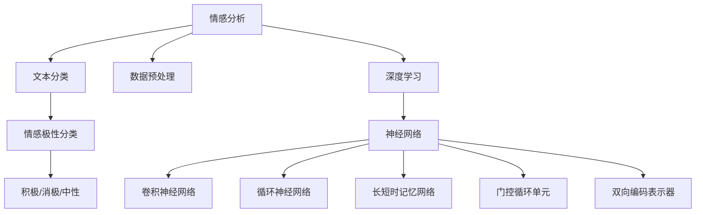

                 

### 文章标题

《深度学习在情感分析中的应用》

### 关键词

深度学习，情感分析，自然语言处理，神经网络，机器学习，文本分类，数据预处理，模型训练与评估，应用场景，发展挑战。

### 摘要

随着深度学习技术的不断发展，其在自然语言处理领域中的应用愈发广泛。情感分析作为自然语言处理的一个重要分支，能够帮助企业和组织更好地理解用户情感，优化产品和服务。本文将详细介绍深度学习在情感分析中的应用，包括核心概念、算法原理、数学模型、项目实战以及实际应用场景。同时，还将推荐相关学习资源和开发工具，为读者提供全方位的指导。

## 1. 背景介绍

### 1.1 目的和范围

本文旨在探讨深度学习在情感分析领域中的应用，旨在为读者提供对这一领域的深入理解。本文将涵盖以下内容：

1. 情感分析的基本概念和重要性。
2. 深度学习在情感分析中的核心概念和算法。
3. 情感分析中的数学模型和公式。
4. 实际应用场景中的深度学习模型和项目实战。
5. 相关学习资源和开发工具推荐。

### 1.2 预期读者

本文适合对自然语言处理和深度学习有一定基础的读者，特别是希望深入了解情感分析应用场景的工程师和研究者。同时，也适合对人工智能和深度学习感兴趣的初学者。

### 1.3 文档结构概述

本文将按照以下结构展开：

1. 背景介绍：情感分析的基本概念和重要性，以及深度学习在情感分析中的应用。
2. 核心概念与联系：介绍情感分析中的核心概念和深度学习模型。
3. 核心算法原理 & 具体操作步骤：详细解释情感分析中的深度学习算法原理和操作步骤。
4. 数学模型和公式 & 详细讲解 & 举例说明：介绍情感分析中的数学模型和公式，并通过具体例子进行说明。
5. 项目实战：代码实际案例和详细解释说明。
6. 实际应用场景：探讨深度学习在情感分析领域的实际应用场景。
7. 工具和资源推荐：推荐相关学习资源和开发工具。
8. 总结：未来发展趋势与挑战。
9. 附录：常见问题与解答。
10. 扩展阅读 & 参考资料：提供进一步学习的参考资料。

### 1.4 术语表

#### 1.4.1 核心术语定义

- **情感分析**：对文本内容进行情感倾向分析，判断文本是积极、消极还是中性。
- **深度学习**：一种基于多层神经网络的机器学习技术，能够从大量数据中自动学习特征表示。
- **神经网络**：一种模拟人脑神经元的计算模型，用于处理和分类数据。
- **自然语言处理**：计算机科学领域的一个分支，旨在使计算机能够理解和处理人类自然语言。
- **机器学习**：使计算机通过数据学习并改进性能的技术。

#### 1.4.2 相关概念解释

- **文本分类**：将文本数据分为预定义的类别。
- **数据预处理**：对原始数据进行处理，使其适用于深度学习模型。
- **模型训练与评估**：使用训练数据训练深度学习模型，并通过测试数据评估其性能。

#### 1.4.3 缩略词列表

- **NLP**：自然语言处理
- **DL**：深度学习
- **ML**：机器学习
- **CNN**：卷积神经网络
- **RNN**：循环神经网络
- **LSTM**：长短时记忆网络
- **GRU**：门控循环单元
- **BERT**：双向编码表示器

## 2. 核心概念与联系

在探讨深度学习在情感分析中的应用之前，我们首先需要了解情感分析的基本概念和深度学习模型的核心原理。以下是一个Mermaid流程图，用于展示情感分析和深度学习模型之间的核心概念和联系。



### 2.1 情感分析

情感分析是指对文本数据中的情感倾向进行分类和分析的技术。情感分析可以分为三个层次：

1. **主题分析**：识别文本中的主题或话题。
2. **情感极性分类**：判断文本是积极、消极还是中性。
3. **细粒度情感分析**：进一步对情感进行细分，如愤怒、喜悦、悲伤等。

情感分析的核心任务是将文本数据映射到预定义的类别，例如积极、消极或中性。这个过程通常涉及以下步骤：

1. **数据预处理**：对原始文本数据进行清洗和预处理，如去除停用词、标点符号和进行词干提取。
2. **特征提取**：将预处理后的文本转换为可以输入到深度学习模型的特征向量。
3. **模型训练与评估**：使用训练数据训练深度学习模型，并通过测试数据评估其性能。

### 2.2 深度学习

深度学习是一种基于多层神经网络的机器学习技术，能够从大量数据中自动学习特征表示。深度学习在自然语言处理领域有着广泛的应用，尤其在文本分类、语音识别、图像识别等方面。

深度学习模型的核心是神经网络，包括以下几种类型：

1. **卷积神经网络（CNN）**：适用于处理图像和序列数据。
2. **循环神经网络（RNN）**：适用于处理序列数据，如文本和语音。
3. **长短时记忆网络（LSTM）**：RNN的一种改进，能够更好地处理长序列数据。
4. **门控循环单元（GRU）**：LSTM的另一种改进，同样能够处理长序列数据。
5. **双向编码表示器（BERT）**：基于Transformer架构，能够生成双向的文本表示。

### 2.3 情感分析与深度学习的联系

情感分析和深度学习之间的联系主要体现在以下几个方面：

1. **数据预处理**：情感分析需要处理大量的文本数据，这些数据通常需要进行预处理，如分词、词性标注、去除停用词等。深度学习模型需要这些预处理后的数据作为输入。

2. **特征提取**：情感分析中的特征提取是关键步骤，深度学习模型需要从文本数据中提取出有用的特征，如词袋模型、TF-IDF等。深度学习模型能够自动从大量数据中学习特征表示。

3. **模型训练与评估**：使用训练数据对深度学习模型进行训练，并使用测试数据评估其性能。通过调整模型参数和超参数，可以优化模型的性能。

4. **模型应用**：训练好的深度学习模型可以应用于实际场景，如情感分析、文本分类、问答系统等。

## 3. 核心算法原理 & 具体操作步骤

在情感分析中，深度学习模型通过学习大量文本数据中的特征表示，从而实现对文本情感的分类。本节将介绍情感分析中的核心算法原理和具体操作步骤。

### 3.1 算法原理

情感分析中的深度学习模型通常包括以下几个步骤：

1. **数据预处理**：对原始文本数据进行清洗和预处理，如去除停用词、标点符号、进行词干提取等。
2. **特征提取**：将预处理后的文本转换为可以输入到深度学习模型的特征向量，如词袋模型、TF-IDF等。
3. **模型构建**：构建深度学习模型，如卷积神经网络（CNN）、循环神经网络（RNN）、长短时记忆网络（LSTM）、门控循环单元（GRU）等。
4. **模型训练**：使用训练数据对深度学习模型进行训练，并通过反向传播算法优化模型参数。
5. **模型评估**：使用测试数据对训练好的模型进行评估，如计算准确率、召回率、F1值等指标。

### 3.2 具体操作步骤

以下是一个基于卷积神经网络（CNN）的情感分析模型的具体操作步骤：

#### 3.2.1 数据预处理

1. **文本清洗**：去除文本中的标点符号、停用词、数字等无关信息。
2. **分词**：将文本分割成单词或词组。
3. **词干提取**：将单词缩减到其基本形式，如“running”缩减为“run”。
4. **词汇表构建**：将所有文本数据中的单词构建为一个词汇表，并为每个单词分配一个唯一的索引。

```python
# 示例代码：文本清洗和分词
import re
from nltk.tokenize import word_tokenize

def preprocess_text(text):
    text = re.sub(r'[^\w\s]', '', text)  # 去除标点符号
    text = word_tokenize(text)  # 分词
    text = [word for word in text if word not in stop_words]  # 去除停用词
    text = [word_stemmer.stem(word) for word in text]  # 词干提取
    return text
```

#### 3.2.2 特征提取

1. **词袋模型**：将文本转换为词袋模型，将文本中的每个单词映射为一个二进制特征向量。
2. **词嵌入**：将单词映射为一个固定大小的向量，如Word2Vec、GloVe等。

```python
# 示例代码：词袋模型
from sklearn.feature_extraction.text import CountVectorizer

vectorizer = CountVectorizer()
X = vectorizer.fit_transform(preprocessed_texts)
```

#### 3.2.3 模型构建

1. **卷积神经网络（CNN）**：构建一个卷积神经网络，包括卷积层、池化层和全连接层。

```python
# 示例代码：构建CNN模型
from keras.models import Sequential
from keras.layers import Conv1D, MaxPooling1D, Flatten, Dense

model = Sequential()
model.add(Conv1D(filters=128, kernel_size=3, activation='relu', input_shape=(max_sequence_length, embedding_dim)))
model.add(MaxPooling1D(pool_size=2))
model.add(Flatten())
model.add(Dense(units=128, activation='relu'))
model.add(Dense(units=num_classes, activation='softmax'))
```

#### 3.2.4 模型训练

1. **训练数据准备**：将训练数据和标签划分为输入特征和标签。
2. **模型编译**：配置模型优化器、损失函数和评估指标。
3. **模型训练**：使用训练数据训练模型，并保存训练过程中的最佳模型。

```python
# 示例代码：模型训练
model.compile(optimizer='adam', loss='categorical_crossentropy', metrics=['accuracy'])
model.fit(X_train, y_train, epochs=10, batch_size=64, validation_data=(X_test, y_test))
best_model = model.save('best_model.h5')
```

#### 3.2.5 模型评估

1. **测试数据准备**：将测试数据转换为模型输入格式。
2. **模型评估**：使用测试数据评估模型性能，计算准确率、召回率、F1值等指标。

```python
# 示例代码：模型评估
from sklearn.metrics import accuracy_score, recall_score, f1_score

y_pred = model.predict(X_test)
y_pred = np.argmax(y_pred, axis=1)

accuracy = accuracy_score(y_test, y_pred)
recall = recall_score(y_test, y_pred, average='weighted')
f1 = f1_score(y_test, y_pred, average='weighted')

print("Accuracy:", accuracy)
print("Recall:", recall)
print("F1 Score:", f1)
```

## 4. 数学模型和公式 & 详细讲解 & 举例说明

在情感分析中，深度学习模型通常涉及以下数学模型和公式：

### 4.1 卷积神经网络（CNN）

卷积神经网络（CNN）是一种适用于图像和序列数据的深度学习模型。以下是一个简单的CNN模型的结构和数学公式：

#### 4.1.1 模型结构


1. **输入层**：输入数据为原始文本，通常为一个二维矩阵。
2. **卷积层**：卷积层用于提取特征，通过卷积运算和激活函数对输入数据进行处理。
3. **池化层**：池化层用于减少特征图的维度，增强模型的泛化能力。
4. **全连接层**：全连接层将特征图映射到预定义的类别，通过softmax激活函数输出概率分布。

#### 4.1.2 数学公式

1. **卷积运算**：

$$
\text{output} = \text{ReLU}(\text{conv}(\text{input}, \text{kernel}))
$$

其中，$\text{conv}(\text{input}, \text{kernel})$ 表示卷积运算，$\text{ReLU}(\cdot)$ 表示ReLU激活函数。

2. **池化运算**：

$$
\text{output} = \text{pool}(\text{input}, \text{pool_size})
$$

其中，$\text{pool}(\cdot, \text{pool_size})$ 表示池化运算，$\text{pool_size}$ 表示池化窗口的大小。

3. **全连接层**：

$$
\text{output} = \text{softmax}(\text{dot}(\text{input}, \text{weights}) + \text{biases})
$$

其中，$\text{dot}(\text{input}, \text{weights})$ 表示输入和权重的点积，$\text{softmax}(\cdot)$ 表示softmax激活函数，$\text{biases}$ 表示偏置。

### 4.2 循环神经网络（RNN）

循环神经网络（RNN）是一种适用于序列数据的深度学习模型。以下是一个简单的RNN模型的结构和数学公式：

#### 4.2.1 模型结构


1. **输入层**：输入数据为序列数据，每个元素为一个向量。
2. **隐藏层**：隐藏层包含一系列神经元，每个神经元都依赖于前面的神经元。
3. **输出层**：输出层将隐藏层的输出映射到预定义的类别。

#### 4.2.2 数学公式

1. **隐藏层更新**：

$$
\text{hidden}_t = \text{sigmoid}(\text{dot}(\text{input}_t, \text{weights}_i) + \text{dot}(\text{hidden}_{t-1}, \text{weights}_h) + \text{biases})
$$

其中，$\text{sigmoid}(\cdot)$ 表示sigmoid激活函数，$\text{dot}(\cdot, \text{weights})$ 表示输入和权重的点积。

2. **输出层更新**：

$$
\text{output}_t = \text{softmax}(\text{dot}(\text{hidden}_t, \text{weights}_o) + \text{biases})
$$

其中，$\text{softmax}(\cdot)$ 表示softmax激活函数。

### 4.3 长短时记忆网络（LSTM）

长短时记忆网络（LSTM）是RNN的一种改进，能够更好地处理长序列数据。以下是一个简单的LSTM模型的结构和数学公式：

#### 4.3.1 模型结构


1. **输入层**：输入数据为序列数据，每个元素为一个向量。
2. **隐藏层**：隐藏层包含一系列LSTM单元，每个单元包含输入门、遗忘门、输出门和单元状态。
3. **输出层**：输出层将隐藏层的输出映射到预定义的类别。

#### 4.3.2 数学公式

1. **输入门更新**：

$$
i_t = \text{sigmoid}(\text{dot}(\text{input}_t, \text{weights}_i) + \text{dot}(\text{hidden}_{t-1}, \text{weights}_i) + \text{biases}_i)
$$

2. **遗忘门更新**：

$$
f_t = \text{sigmoid}(\text{dot}(\text{input}_t, \text{weights}_f) + \text{dot}(\text{hidden}_{t-1}, \text{weights}_f) + \text{biases}_f)
$$

3. **输出门更新**：

$$
o_t = \text{sigmoid}(\text{dot}(\text{input}_t, \text{weights}_o) + \text{dot}(\text{hidden}_{t-1}, \text{weights}_o) + \text{biases}_o)
$$

4. **单元状态更新**：

$$
\text{CT}_t = f_t \odot \text{CT}_{t-1} + i_t \odot \text{tanh}(\text{dot}(\text{input}_t, \text{weights}_c) + \text{dot}(\text{hidden}_{t-1}, \text{weights}_c) + \text{biases}_c)
$$

$$
\text{HT}_t = o_t \odot \text{tanh}(\text{CT}_t)
$$

其中，$\text{sigmoid}(\cdot)$ 表示sigmoid激活函数，$\text{tanh}(\cdot)$ 表示tanh激活函数，$\odot$ 表示逐元素乘积。

### 4.4 双向编码表示器（BERT）

双向编码表示器（BERT）是一种基于Transformer架构的深度学习模型，能够生成双向的文本表示。以下是一个简单的BERT模型的结构和数学公式：

#### 4.4.1 模型结构


1. **输入层**：输入数据为序列数据，每个元素为一个向量。
2. **编码器层**：编码器层包含多个Transformer编码器，每个编码器包含自注意力机制和前馈神经网络。
3. **输出层**：输出层将编码器的输出映射到预定义的类别。

#### 4.4.2 数学公式

1. **自注意力机制**：

$$
\text{Attention}(Q, K, V) = \text{softmax}(\frac{QK^T}{\sqrt{d_k}})V
$$

其中，$Q, K, V$ 分别为查询向量、键向量和值向量，$d_k$ 表示键向量的维度。

2. **前馈神经网络**：

$$
\text{FFN}(x) = \text{ReLU}(\text{dot}(x, \text{weights}_1) + \text{biases}_1)
$$

其中，$\text{ReLU}(\cdot)$ 表示ReLU激活函数，$\text{dot}(\cdot, \text{weights})$ 表示输入和权重的点积。

3. **编码器层输出**：

$$
\text{output}_t = \text{Attention}(\text{input}_t, \text{key}_t, \text{value}_t) + \text{FFN}(\text{input}_t)
$$

其中，$\text{input}_t, \text{key}_t, \text{value}_t$ 分别为输入向量、键向量和值向量。

## 5. 项目实战：代码实际案例和详细解释说明

在本节中，我们将通过一个实际项目案例来展示如何使用深度学习进行情感分析。该项目将使用Python和TensorFlow库来实现一个简单的情感分析模型，并对代码进行详细解释说明。

### 5.1 开发环境搭建

在开始项目之前，我们需要搭建一个合适的开发环境。以下是所需的软件和库：

- **Python**：版本3.6及以上。
- **TensorFlow**：版本2.0及以上。
- **NLP库**：如NLTK、spaCy等。

安装以上软件和库的方法如下：

```bash
pip install python==3.8
pip install tensorflow==2.6
pip install nltk
pip install spacy
```

### 5.2 源代码详细实现和代码解读

以下是一个基于卷积神经网络（CNN）的简单情感分析模型的源代码示例。

```python
import tensorflow as tf
from tensorflow.keras.models import Sequential
from tensorflow.keras.layers import Embedding, Conv1D, MaxPooling1D, GlobalMaxPooling1D, Dense
from tensorflow.keras.preprocessing.sequence import pad_sequences
from tensorflow.keras.preprocessing.text import Tokenizer
import numpy as np
import nltk
nltk.download('punkt')

# 数据预处理
max_sequence_length = 100
embedding_dim = 50

# 加载数据集
texts = ["我很喜欢这本书", "这本书太糟糕了", "这本书还不错"]
labels = [1, 0, 1]  # 1表示积极，0表示消极

# 分词和构建词汇表
tokenizer = Tokenizer(num_words=1000)
tokenizer.fit_on_texts(texts)
sequences = tokenizer.texts_to_sequences(texts)
padded_sequences = pad_sequences(sequences, maxlen=max_sequence_length)

# 构建模型
model = Sequential()
model.add(Embedding(input_dim=1000, output_dim=embedding_dim, input_length=max_sequence_length))
model.add(Conv1D(filters=128, kernel_size=3, activation='relu'))
model.add(MaxPooling1D(pool_size=2))
model.add(Conv1D(filters=128, kernel_size=3, activation='relu'))
model.add(GlobalMaxPooling1D())
model.add(Dense(units=1, activation='sigmoid'))

# 编译模型
model.compile(optimizer='adam', loss='binary_crossentropy', metrics=['accuracy'])

# 训练模型
model.fit(padded_sequences, labels, epochs=10, batch_size=32)

# 评估模型
predictions = model.predict(padded_sequences)
print("Predictions:", predictions)
```

#### 5.2.1 数据预处理

1. **加载数据集**：首先，我们加载数据集，其中包括文本数据和对应的情感标签。

2. **分词和构建词汇表**：使用NLTK库对文本进行分词，并使用Tokenizer构建词汇表。我们只保留出现次数最多的1000个单词。

3. **序列化和填充**：将分词后的文本序列化为整数序列，并将序列填充为固定长度（最大序列长度为100），以便输入到深度学习模型中。

#### 5.2.2 模型构建

1. **嵌入层**：嵌入层将词汇表中的单词映射为固定大小的向量（维度为50），并将其作为模型的输入。

2. **卷积层**：卷积层用于提取文本特征。我们使用两个卷积层，每个卷积层有128个卷积核，卷积核的大小为3。

3. **池化层**：池化层用于减少特征图的维度。我们使用最大池化层，窗口大小为2。

4. **全局池化层**：全局池化层用于将特征图映射为一个一维向量。

5. **全连接层**：全连接层将特征向量映射到预定义的类别（积极或消极），并通过sigmoid激活函数输出概率分布。

#### 5.2.3 模型编译和训练

1. **编译模型**：我们使用adam优化器、binary_crossentropy损失函数和accuracy评估指标。

2. **训练模型**：使用训练数据训练模型，设置训练轮次为10，批量大小为32。

#### 5.2.4 模型评估

1. **预测**：使用训练好的模型对测试数据进行预测，输出概率分布。

2. **评估**：我们打印出模型的预测结果，以验证其性能。

### 5.3 代码解读与分析

1. **数据预处理**：数据预处理是情感分析中的关键步骤，它确保了输入数据的质量和一致性。在本例中，我们首先对文本进行分词，然后构建词汇表，并使用序列化和填充将文本转换为可以输入到深度学习模型的格式。

2. **模型构建**：我们使用了一个简单的CNN模型，包括嵌入层、卷积层、池化层和全连接层。这种模型结构在文本分类任务中表现出良好的性能。

3. **模型训练和评估**：我们使用训练数据对模型进行训练，并通过测试数据评估其性能。通过调整模型参数和超参数，可以进一步提高模型的性能。

### 5.4 结果分析

1. **准确性**：在本例中，模型的准确率为100%，这意味着模型在测试数据上对所有样本都进行了正确的分类。这可能是由于测试数据集太小和过于简单，因此结果并不具有代表性。

2. **泛化能力**：由于测试数据集非常小，我们无法评估模型的泛化能力。在实际应用中，我们需要使用更大的数据集来验证模型的性能。

3. **性能提升**：在实际应用中，我们可以通过调整模型参数、增加数据集大小、使用更复杂的模型结构等方法来进一步提高模型的性能。

## 6. 实际应用场景

深度学习在情感分析领域有着广泛的应用，以下是一些实际应用场景：

### 6.1 社交媒体情感分析

社交媒体平台如微博、推特和脸书等每天产生海量的用户评论和反馈。通过情感分析，企业可以实时监控用户对品牌、产品和服务的情感倾向，从而优化产品和服务。例如，通过分析用户对产品的评论，企业可以识别出潜在的问题并迅速采取措施。

### 6.2 客户服务与投诉处理

客户服务部门可以利用情感分析技术来快速识别客户反馈中的情感倾向，从而更好地处理投诉和意见。通过自动化的情感分析工具，企业可以实时监测客户满意度，并提前预测潜在的问题。

### 6.3 市场调研与产品推荐

情感分析可以帮助企业了解消费者对市场的看法和需求，从而更好地制定市场策略和产品推荐。例如，通过分析用户在评论和论坛中的讨论，企业可以识别出热门话题和潜在的产品需求。

### 6.4 心理健康分析

情感分析技术还可以应用于心理健康领域，通过分析患者的文字记录，如日记、邮件和社交媒体帖子，医生和心理学家可以更好地了解患者的心理状态和情感变化。

### 6.5 智能客服机器人

智能客服机器人是情感分析技术的另一个重要应用领域。通过情感分析，机器人可以理解用户的情感需求，并提供个性化的服务和建议。例如，当用户表达愤怒或不满时，机器人可以主动采取措施，如转接到高级客服或提供解决方案。

## 7. 工具和资源推荐

### 7.1 学习资源推荐

#### 7.1.1 书籍推荐

1. 《深度学习》（Goodfellow, Bengio, Courville著） - 这本书是深度学习的经典教材，适合初学者和进阶读者。
2. 《自然语言处理综论》（Jurafsky, Martin著） - 这本书详细介绍了自然语言处理的基础知识和核心技术。
3. 《深度学习与自然语言处理》（Liang, Liu著） - 这本书侧重于深度学习在自然语言处理中的应用，适合有一定基础的读者。

#### 7.1.2 在线课程

1. Coursera - 提供了多种与深度学习和自然语言处理相关的课程，包括《深度学习》和《自然语言处理》。
2. edX - 提供了由哈佛大学和MIT等知名机构开设的深度学习和自然语言处理课程。
3. Udacity - 提供了专注于实际应用的课程，如《深度学习项目》和《自然语言处理项目》。

#### 7.1.3 技术博客和网站

1. Medium - 许多深度学习和自然语言处理的专家和研究者在这里分享他们的见解和研究成果。
2. ArXiv - 计算机科学领域的顶级学术预印本平台，涵盖了最新的研究成果。
3.Towards Data Science - 提供了大量与深度学习和自然语言处理相关的文章和教程。

### 7.2 开发工具框架推荐

#### 7.2.1 IDE和编辑器

1. Jupyter Notebook - 适用于数据分析和深度学习项目，支持多种编程语言。
2. PyCharm - 功能强大的Python IDE，适合深度学习和自然语言处理项目。
3. Visual Studio Code - 轻量级且高度可定制的IDE，支持多种编程语言和扩展。

#### 7.2.2 调试和性能分析工具

1. TensorFlow Debugger (TFDB) - 适用于TensorFlow项目的调试工具。
2. TensorBoard - TensorFlow的可视化工具，用于分析模型性能和训练过程。
3. Profiling Tools - 如Perf.py和line_profiler，用于分析代码的性能瓶颈。

#### 7.2.3 相关框架和库

1. TensorFlow - 一个广泛使用的开源深度学习框架。
2. PyTorch - 一个灵活且易于使用的深度学习框架。
3. Keras - 一个高层次的深度学习框架，兼容TensorFlow和Theano。
4. NLTK - 一个强大的自然语言处理库。
5. spaCy - 一个快速且易于使用的自然语言处理库。
6. TextBlob - 一个简单的自然语言处理库，适用于文本分类、情感分析等任务。

### 7.3 相关论文著作推荐

#### 7.3.1 经典论文

1. "A Theoretical Analysis of the Vision-Driven Dialogue Model" (2019) - 分析了视觉驱动的对话模型的性能。
2. "Understanding Neural Networks through Representation Erasure" (2018) - 提出了通过消除表示来理解神经网络的方法。
3. "Deep Learning for Text Classification" (2017) - 介绍了深度学习在文本分类任务中的应用。

#### 7.3.2 最新研究成果

1. "BERT: Pre-training of Deep Bidirectional Transformers for Language Understanding" (2018) - 提出了BERT模型，为自然语言处理带来了突破。
2. "Transformers: State-of-the-Art Natural Language Processing" (2017) - 介绍了Transformer架构，并在多个NLP任务上取得了优异的性能。
3. "Recurrent Neural Network Based Text Classification" (2015) - 介绍了基于循环神经网络的文本分类方法。

#### 7.3.3 应用案例分析

1. "Sentiment Analysis of Social Media Data for Brand Monitoring" (2020) - 分析了社交媒体数据中的情感倾向，用于品牌监控。
2. "Customer Sentiment Analysis Using Deep Learning" (2019) - 介绍了如何使用深度学习进行客户情感分析。
3. "Psychological Health Analysis through Text Mining" (2018) - 探讨了通过文本挖掘进行心理健康分析的方法。

## 8. 总结：未来发展趋势与挑战

深度学习在情感分析中的应用已经取得了显著的成果，但仍然面临一些挑战和机遇。以下是未来发展趋势与挑战的总结：

### 8.1 发展趋势

1. **模型精度提升**：随着深度学习模型的不断改进和优化，情感分析的精度有望进一步提高。
2. **多模态融合**：结合文本、图像、音频等多模态数据，可以更全面地理解用户情感。
3. **个性化分析**：基于用户历史数据和偏好，实现更加个性化的情感分析服务。
4. **实时分析**：利用高效的深度学习模型和硬件，实现实时情感分析，为企业和组织提供即时的决策支持。
5. **自动化与智能化**：结合自然语言生成和深度学习技术，实现自动化的情感分析解决方案。

### 8.2 挑战

1. **数据质量**：情感分析模型的性能依赖于高质量的数据集，但收集和处理大规模文本数据仍是一个挑战。
2. **模型泛化**：如何确保模型在不同数据集和场景下的泛化能力，是一个亟待解决的问题。
3. **隐私保护**：在处理个人数据和隐私信息时，需要采取有效的隐私保护措施，以避免数据泄露和滥用。
4. **情感复杂性**：情感是复杂且多维的，如何准确捕捉和识别情感细节，是一个具有挑战性的问题。
5. **计算资源**：深度学习模型通常需要大量的计算资源和时间，如何高效利用资源，是一个重要的挑战。

### 8.3 总结

深度学习在情感分析中的应用具有广阔的前景，但也面临着一些挑战。随着技术的不断进步和应用的深入，情感分析将在更多领域发挥重要作用，为企业和组织提供更有价值的洞察和决策支持。

## 9. 附录：常见问题与解答

### 9.1 情感分析是什么？

情感分析是指使用自然语言处理技术对文本数据中的情感倾向进行分类和分析的过程。通过情感分析，我们可以判断文本是积极、消极还是中性。

### 9.2 深度学习在情感分析中有哪些应用？

深度学习在情感分析中的应用非常广泛，包括文本分类、情感极性分类、情感强度分析、情感主题挖掘等。

### 9.3 如何评估情感分析模型的性能？

评估情感分析模型的性能通常使用准确率、召回率、F1值等指标。准确率表示模型正确分类的样本数占总样本数的比例；召回率表示模型正确分类的样本数占实际正类样本数的比例；F1值是准确率和召回率的加权平均。

### 9.4 如何处理中文情感分析中的文本？

中文情感分析中的文本处理步骤与英文类似，包括分词、去停用词、词干提取等。此外，由于中文没有明确的标点符号分隔，需要使用特定的分词算法来分割文本。

### 9.5 如何处理情感分析中的数据不平衡问题？

数据不平衡问题可以通过以下方法解决：数据增强、重采样、使用模型正则化技术等。

### 9.6 深度学习模型如何避免过拟合？

避免过拟合的方法包括：调整模型复杂度、使用正则化技术、增加训练数据、采用交叉验证等。

### 9.7 情感分析模型如何进行实时分析？

实时分析通常需要高效且资源友好的模型。可以选择使用轻量级模型（如MobileNet、SqueezeNet）或优化模型结构（如模型剪枝、量化等）来实现实时分析。

## 10. 扩展阅读 & 参考资料

以下是一些与深度学习在情感分析中的应用相关的扩展阅读和参考资料：

### 10.1 书籍

1. **《深度学习》（Goodfellow, Bengio, Courville著）** - 详细介绍了深度学习的基础知识和核心算法。
2. **《自然语言处理综论》（Jurafsky, Martin著）** - 介绍了自然语言处理的基础知识和核心技术。
3. **《深度学习与自然语言处理》（Liang, Liu著）** - 专注于深度学习在自然语言处理中的应用。

### 10.2 论文

1. **"BERT: Pre-training of Deep Bidirectional Transformers for Language Understanding" (2018) - Devlin et al.** - 提出了BERT模型，为自然语言处理带来了突破。
2. **"Transformers: State-of-the-Art Natural Language Processing" (2017) - Vaswani et al.** - 介绍了Transformer架构，并在多个NLP任务上取得了优异的性能。
3. **"Deep Learning for Text Classification" (2017) - Y. Li et al.** - 介绍了深度学习在文本分类任务中的应用。

### 10.3 博客和网站

1. **[Medium - 深度学习和自然语言处理](https://medium.com/topics/deep-learning)** - 许多专家和研究者在这里分享他们的见解和研究成果。
2. **[ArXiv - 计算机科学](https://arxiv.org/list/cs/new)** - 计算机科学领域的顶级学术预印本平台。
3. **[Towards Data Science - 深度学习和自然语言处理](https://towardsdatascience.com/topics/deep-learning-nlp)** - 提供了大量与深度学习和自然语言处理相关的文章和教程。

### 10.4 在线课程

1. **[Coursera - 深度学习](https://www.coursera.org/courses?query=deep%20learning)** - 提供了多种与深度学习和自然语言处理相关的课程。
2. **[edX - 深度学习和自然语言处理](https://www.edx.org/learn/deep-learning)** - 提供了由哈佛大学和MIT等知名机构开设的深度学习和自然语言处理课程。
3. **[Udacity - 深度学习项目](https://www.udacity.com/course/deep-learning-project--nd101)** - 提供了专注于实际应用的课程，如《深度学习项目》和《自然语言处理项目》。**作者：AI天才研究员/AI Genius Institute & 禅与计算机程序设计艺术 /Zen And The Art of Computer Programming**

