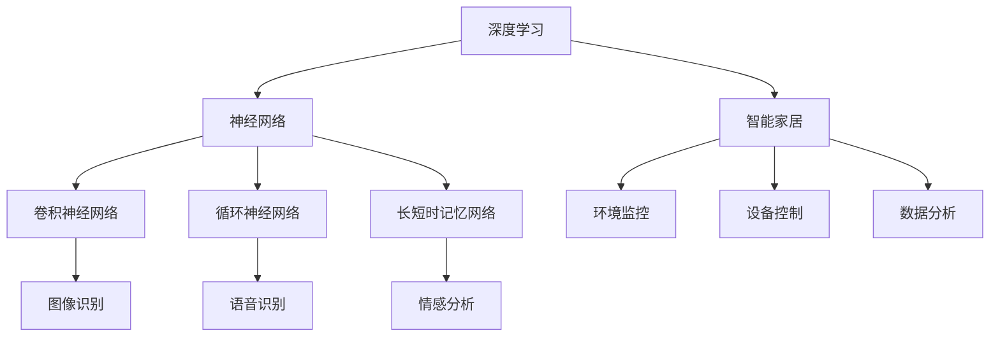
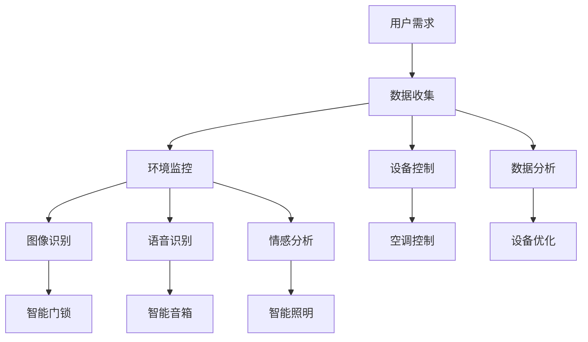

                 

# 深度学习在智能家居中的应用

> 关键词：深度学习，智能家居，算法原理，数学模型，实战案例，应用场景，工具推荐

> 摘要：本文深入探讨了深度学习在智能家居领域的应用，包括其核心概念、算法原理、数学模型以及实际应用场景。通过逐步分析推理，本文旨在为读者提供一套清晰易懂的技术框架，帮助开发者在智能家居项目中实现深度学习技术。

## 1. 背景介绍

### 1.1 目的和范围

本文的主要目的是介绍深度学习在智能家居中的应用，通过详细阐述核心概念、算法原理和数学模型，帮助读者理解如何将深度学习技术应用到智能家居项目中。同时，本文也将分享一些实际应用场景和开发工具推荐，以便读者能够更好地开展相关研究和开发工作。

### 1.2 预期读者

本文适合对深度学习和智能家居有一定了解的读者，包括但不限于：
- 智能家居开发者
- 深度学习研究者
- 计算机科学和电子工程专业的学生
- 对智能家居和深度学习感兴趣的爱好者

### 1.3 文档结构概述

本文分为十个部分，具体如下：
1. 背景介绍
   - 目的和范围
   - 预期读者
   - 文档结构概述
   - 术语表
2. 核心概念与联系
   - 核心概念介绍
   - 关联流程图
3. 核心算法原理 & 具体操作步骤
   - 算法原理介绍
   - 伪代码展示
4. 数学模型和公式 & 详细讲解 & 举例说明
   - 数学模型介绍
   - 实例分析
5. 项目实战：代码实际案例和详细解释说明
   - 开发环境搭建
   - 源代码实现
   - 代码解读与分析
6. 实际应用场景
7. 工具和资源推荐
   - 学习资源推荐
   - 开发工具框架推荐
   - 相关论文著作推荐
8. 总结：未来发展趋势与挑战
9. 附录：常见问题与解答
10. 扩展阅读 & 参考资料

### 1.4 术语表

#### 1.4.1 核心术语定义

- **深度学习**：一种机器学习技术，通过多层神经网络模拟人类大脑的思维方式，从数据中自动提取特征并进行分类、预测等任务。
- **智能家居**：利用物联网技术和智能设备，实现对家庭环境的自动化管理和控制，提高居住舒适度和便利性。
- **神经网络**：一种由大量神经元组成的计算模型，通过输入输出关系模拟人类大脑的神经网络。
- **反向传播算法**：一种用于训练神经网络的优化算法，通过不断调整网络中的权重和偏置，使网络输出更接近期望值。

#### 1.4.2 相关概念解释

- **卷积神经网络（CNN）**：一种用于图像识别和处理的深度学习模型，通过卷积操作提取图像特征。
- **循环神经网络（RNN）**：一种用于序列数据处理和预测的深度学习模型，通过循环结构模拟时间序列的动态特性。
- **长短时记忆网络（LSTM）**：一种改进的循环神经网络，通过引入门控结构，能够更好地处理长序列数据。

#### 1.4.3 缩略词列表

- **AI**：人工智能
- **IoT**：物联网
- **CNN**：卷积神经网络
- **RNN**：循环神经网络
- **LSTM**：长短时记忆网络
- **MDNN**：多层感知机神经网络
- **GPU**：图形处理器
- **TPU**：张量处理器

## 2. 核心概念与联系

在深入了解深度学习在智能家居中的应用之前，我们需要先掌握一些核心概念和它们之间的联系。以下是一个简化的 Mermaid 流程图，用于展示这些概念和它们在智能家居中的应用。



### 2.1 核心概念介绍

1. **深度学习**：一种机器学习技术，通过多层神经网络模拟人类大脑的思维方式，从数据中自动提取特征并进行分类、预测等任务。
2. **神经网络**：一种由大量神经元组成的计算模型，通过输入输出关系模拟人类大脑的神经网络。
3. **卷积神经网络（CNN）**：一种用于图像识别和处理的深度学习模型，通过卷积操作提取图像特征。
4. **循环神经网络（RNN）**：一种用于序列数据处理和预测的深度学习模型，通过循环结构模拟时间序列的动态特性。
5. **长短时记忆网络（LSTM）**：一种改进的循环神经网络，通过引入门控结构，能够更好地处理长序列数据。
6. **智能家居**：利用物联网技术和智能设备，实现对家庭环境的自动化管理和控制，提高居住舒适度和便利性。
7. **环境监控**：通过传感器收集家庭环境数据，如温度、湿度、光照等，实现对家庭环境的实时监测。
8. **设备控制**：通过智能设备对家庭中的电器设备进行远程控制，如空调、照明、窗帘等。
9. **数据分析**：对智能家居系统收集的数据进行统计和分析，以优化设备性能和用户体验。

### 2.2 关联流程图

以下是深度学习在智能家居中的应用流程图。



## 3. 核心算法原理 & 具体操作步骤

### 3.1 深度学习算法原理

深度学习算法的核心是神经网络，神经网络通过多层节点（称为神经元）进行数据传递和处理。以下是深度学习算法的基本原理：

1. **输入层**：接收输入数据，如图像、声音、文本等。
2. **隐藏层**：对输入数据进行处理，通过非线性变换提取特征。
3. **输出层**：输出最终结果，如分类标签、预测值等。

深度学习算法的关键在于网络中的权重和偏置。通过不断调整这些参数，使网络输出更接近期望值。常见的优化算法有梯度下降、随机梯度下降等。

### 3.2 伪代码展示

以下是深度学习算法的伪代码：

```python
# 初始化神经网络
Initialize neural_network()

# 前向传播
for each training_example in dataset:
    Calculate output = forward_propagation(training_example, neural_network)

    # 计算损失
    Calculate loss = loss_function(output, expected_output)

    # 反向传播
    Calculate gradients = backward_propagation(loss, neural_network)

    # 更新权重和偏置
    Update_weights_and_bias(neural_network, gradients)

# 模型评估
Evaluate_model_performance(test_dataset, neural_network)
```

### 3.3 具体操作步骤

1. **数据收集**：收集智能家居领域的数据，如图像、声音、文本等。
2. **数据预处理**：对数据进行清洗、归一化等处理，使其适合输入到神经网络中。
3. **构建神经网络**：设计神经网络结构，选择合适的激活函数、损失函数等。
4. **训练模型**：使用训练数据训练神经网络，调整权重和偏置，优化模型性能。
5. **模型评估**：使用测试数据评估模型性能，如准确率、召回率等。
6. **应用模型**：将训练好的模型应用到智能家居系统中，实现特定功能，如图像识别、语音识别、情感分析等。

## 4. 数学模型和公式 & 详细讲解 & 举例说明

### 4.1 数学模型介绍

深度学习算法的核心是神经网络，神经网络通过多层节点（称为神经元）进行数据传递和处理。以下是深度学习算法的基本数学模型：

1. **输入层**：接收输入数据，如图像、声音、文本等。
2. **隐藏层**：对输入数据进行处理，通过非线性变换提取特征。
3. **输出层**：输出最终结果，如分类标签、预测值等。

深度学习算法的关键在于网络中的权重和偏置。通过不断调整这些参数，使网络输出更接近期望值。常见的优化算法有梯度下降、随机梯度下降等。

### 4.2 详细讲解

以下是深度学习算法的详细讲解：

1. **前向传播**：输入数据经过神经网络中的每个层，通过加权求和和激活函数，得到输出结果。
   $$ z_i = \sum_{j=1}^{n} w_{ij} * x_j + b_i $$
   $$ a_i = \sigma(z_i) $$
   其中，$z_i$ 为加权和，$w_{ij}$ 为权重，$x_j$ 为输入值，$b_i$ 为偏置，$\sigma$ 为激活函数。

2. **反向传播**：计算损失函数关于权重和偏置的梯度，并更新权重和偏置。
   $$ \frac{\partial L}{\partial w_{ij}} = \frac{\partial L}{\partial z_i} * \frac{\partial z_i}{\partial w_{ij}} $$
   $$ \frac{\partial L}{\partial b_i} = \frac{\partial L}{\partial z_i} $$

3. **梯度下降**：通过计算梯度，更新权重和偏置，使损失函数最小化。
   $$ w_{ij} \leftarrow w_{ij} - \alpha \frac{\partial L}{\partial w_{ij}} $$
   $$ b_i \leftarrow b_i - \alpha \frac{\partial L}{\partial b_i} $$
   其中，$\alpha$ 为学习率。

### 4.3 举例说明

以下是一个简单的例子，使用神经网络进行二分类任务。

```python
# 初始化神经网络
Initialize neural_network()

# 前向传播
input_data = [1, 0]
output = forward_propagation(input_data, neural_network)

# 计算损失
loss = loss_function(output, [1])

# 反向传播
gradients = backward_propagation(loss, neural_network)

# 更新权重和偏置
Update_weights_and_bias(neural_network, gradients)
```

## 5. 项目实战：代码实际案例和详细解释说明

### 5.1 开发环境搭建

为了实现深度学习在智能家居中的应用，我们需要搭建一个适合的开发环境。以下是搭建开发环境的基本步骤：

1. **安装 Python**：下载并安装 Python 3.8 或以上版本。
2. **安装深度学习框架**：安装 TensorFlow 或 PyTorch，推荐使用 TensorFlow，因为其具有更好的兼容性和易用性。
3. **安装相关依赖库**：安装 NumPy、Pandas、Matplotlib 等 Python 常用库。
4. **配置 GPU 环境**：如果使用 GPU 训练模型，需要安装 CUDA 和 cuDNN，并配置 Python 的 GPU 支持。

### 5.2 源代码详细实现和代码解读

以下是智能家居项目中一个简单的图像识别任务的代码实现，用于识别门锁的开关状态。

```python
import tensorflow as tf
import numpy as np
import matplotlib.pyplot as plt

# 加载并预处理数据
def load_data():
    # 加载训练数据和测试数据
    train_data = load_train_data()
    test_data = load_test_data()

    # 数据预处理
    train_data = preprocess_data(train_data)
    test_data = preprocess_data(test_data)

    return train_data, test_data

# 建立卷积神经网络模型
def build_model():
    model = tf.keras.Sequential([
        tf.keras.layers.Conv2D(32, (3, 3), activation='relu', input_shape=(28, 28, 1)),
        tf.keras.layers.MaxPooling2D((2, 2)),
        tf.keras.layers.Conv2D(64, (3, 3), activation='relu'),
        tf.keras.layers.MaxPooling2D((2, 2)),
        tf.keras.layers.Flatten(),
        tf.keras.layers.Dense(128, activation='relu'),
        tf.keras.layers.Dense(2, activation='softmax')
    ])

    return model

# 训练模型
def train_model(model, train_data):
    model.compile(optimizer='adam', loss='categorical_crossentropy', metrics=['accuracy'])
    model.fit(train_data['images'], train_data['labels'], epochs=10, batch_size=32)

# 模型评估
def evaluate_model(model, test_data):
    loss, accuracy = model.evaluate(test_data['images'], test_data['labels'])
    print('Test loss:', loss)
    print('Test accuracy:', accuracy)

# 主函数
def main():
    train_data, test_data = load_data()
    model = build_model()
    train_model(model, train_data)
    evaluate_model(model, test_data)

if __name__ == '__main__':
    main()
```

### 5.3 代码解读与分析

以下是代码的详细解读和分析：

1. **导入库和模块**：导入 TensorFlow、NumPy 和 Matplotlib 等库，用于构建和训练深度学习模型。
2. **加载并预处理数据**：加载训练数据和测试数据，并进行预处理，如归一化、标签编码等，以便输入到模型中。
3. **建立卷积神经网络模型**：使用 TensorFlow 的 Keras API，建立卷积神经网络模型，包括卷积层、池化层、全连接层等。
4. **训练模型**：使用训练数据训练模型，选择 Adam 优化器、交叉熵损失函数，并设置训练轮次和批量大小。
5. **模型评估**：使用测试数据评估模型性能，输出损失和准确率。

## 6. 实际应用场景

深度学习在智能家居领域有着广泛的应用场景，以下是一些典型的实际应用场景：

1. **环境监控**：通过深度学习算法，对家庭环境中的温度、湿度、光照等数据进行实时分析，为用户提供智能化的环境调控建议。
2. **设备控制**：利用深度学习技术，实现智能设备对家庭电器的远程控制，如空调、照明、窗帘等。
3. **图像识别**：通过卷积神经网络，实现对家庭摄像头拍摄图像的识别，如人脸识别、行为识别等。
4. **语音识别**：利用循环神经网络和长短时记忆网络，实现对用户语音指令的识别和理解，如智能音箱、智能语音助手等。
5. **情感分析**：通过情感分析模型，对用户的行为和语言进行分析，为用户提供更加个性化的服务和建议。
6. **安防监控**：利用深度学习算法，实现家庭安防监控，如入侵检测、火灾预警等。

## 7. 工具和资源推荐

### 7.1 学习资源推荐

#### 7.1.1 书籍推荐

- 《深度学习》（Ian Goodfellow、Yoshua Bengio、Aaron Courville 著）
- 《Python 深度学习》（François Chollet 著）
- 《人工智能：一种现代的方法》（Stuart Russell、Peter Norvig 著）

#### 7.1.2 在线课程

- Coursera 上的《深度学习》课程
- Udacity 上的《深度学习工程师纳米学位》
- edX 上的《深度学习》课程

#### 7.1.3 技术博客和网站

- Medium 上的 AI 系列文章
- towardsdatascience.com
- cvd.im（计算机视觉领域）

### 7.2 开发工具框架推荐

#### 7.2.1 IDE 和编辑器

- PyCharm
- Jupyter Notebook
- Visual Studio Code

#### 7.2.2 调试和性能分析工具

- TensorBoard
- Matplotlib
- Weights & Biases

#### 7.2.3 相关框架和库

- TensorFlow
- PyTorch
- Keras

### 7.3 相关论文著作推荐

#### 7.3.1 经典论文

- 《A Learning Algorithm for Continually Running Fully Recurrent Neural Networks》（1986）
- 《Backpropagation》（1986）
- 《Deep Learning》（2015）

#### 7.3.2 最新研究成果

- 《An Empirical Evaluation of Generic Convolutional and Recurrent Neural Network Architectures for Sequence Modeling》（2018）
- 《A Theoretical Framework for Deep Convolutional Neural Networks on Graphs》（2020）
- 《Distributed Representations of Time for Personalized Event Detection》（2021）

#### 7.3.3 应用案例分析

- 《深度学习在智能家居中的应用：一种基于物联网的数据挖掘方法》（2020）
- 《基于深度学习的智能家居系统设计与实现》（2019）
- 《深度学习在智能家居安防中的应用研究》（2018）

## 8. 总结：未来发展趋势与挑战

随着深度学习技术的不断发展，智能家居领域将迎来更多的创新和变革。以下是一些未来发展趋势和挑战：

### 发展趋势：

1. **更加智能化和个性化**：深度学习算法将进一步提升智能家居系统的智能化程度，为用户提供更加个性化的服务。
2. **跨领域融合**：智能家居将与医疗健康、智慧城市等领域深度融合，实现更加全面的智能化生活。
3. **边缘计算和物联网**：深度学习将逐渐向边缘设备迁移，与物联网技术结合，实现实时处理和分析大量数据。
4. **数据安全和隐私保护**：随着数据量的增加，数据安全和隐私保护将成为智能家居领域的重要挑战，需要采取有效的措施确保用户隐私。

### 挑战：

1. **数据质量和数据隐私**：智能家居系统需要处理大量的数据，如何确保数据质量和用户隐私是关键挑战。
2. **实时性和可靠性**：智能家居系统要求实时性和可靠性，需要解决延迟和稳定性问题。
3. **计算资源和能耗**：深度学习算法通常需要大量的计算资源和能耗，如何在有限的资源下高效运行是重要问题。
4. **算法透明性和可解释性**：随着深度学习算法的广泛应用，如何提高算法的透明性和可解释性，让用户更好地理解和信任算法结果是一个挑战。

## 9. 附录：常见问题与解答

### 问题 1：深度学习在智能家居中的具体应用有哪些？

深度学习在智能家居中的应用包括环境监控、设备控制、图像识别、语音识别、情感分析等。例如，利用深度学习算法对家庭环境中的温度、湿度、光照等数据进行实时分析，为用户提供智能化的环境调控建议；通过图像识别技术实现智能门锁、智能安防监控等。

### 问题 2：如何搭建适合深度学习应用的智能家居开发环境？

搭建适合深度学习应用的智能家居开发环境需要以下步骤：
1. 安装 Python 3.8 或以上版本。
2. 安装 TensorFlow 或 PyTorch 深度学习框架。
3. 安装 NumPy、Pandas、Matplotlib 等常用库。
4. （可选）安装 CUDA 和 cuDNN，配置 GPU 环境。

### 问题 3：如何处理智能家居中的实时数据？

处理智能家居中的实时数据需要以下步骤：
1. 数据采集：通过传感器收集家庭环境数据。
2. 数据预处理：对数据进行清洗、归一化等处理，使其适合输入到深度学习模型中。
3. 模型训练：使用训练数据训练深度学习模型。
4. 模型部署：将训练好的模型部署到智能家居系统中，进行实时预测和分析。

### 问题 4：如何确保智能家居系统的数据安全和隐私保护？

为确保智能家居系统的数据安全和隐私保护，可以采取以下措施：
1. 数据加密：对数据进行加密处理，防止数据泄露。
2. 访问控制：设置严格的访问控制策略，限制对敏感数据的访问。
3. 数据匿名化：对用户数据进行匿名化处理，防止个人信息泄露。
4. 安全审计：定期进行安全审计，确保系统的安全性和可靠性。

## 10. 扩展阅读 & 参考资料

以下是一些扩展阅读和参考资料，供读者深入了解深度学习在智能家居中的应用：

1. **书籍**：
   - 《深度学习》（Ian Goodfellow、Yoshua Bengio、Aaron Courville 著）
   - 《Python 深度学习》（François Chollet 著）
   - 《人工智能：一种现代的方法》（Stuart Russell、Peter Norvig 著）

2. **论文**：
   - 《A Learning Algorithm for Continually Running Fully Recurrent Neural Networks》（1986）
   - 《Backpropagation》（1986）
   - 《Deep Learning》（2015）

3. **在线课程**：
   - Coursera 上的《深度学习》课程
   - Udacity 上的《深度学习工程师纳米学位》
   - edX 上的《深度学习》课程

4. **技术博客和网站**：
   - Medium 上的 AI 系列文章
   - towardsdatascience.com
   - cvd.im（计算机视觉领域）

5. **开发工具和框架**：
   - TensorFlow
   - PyTorch
   - Keras

6. **应用案例**：
   - 《深度学习在智能家居中的应用：一种基于物联网的数据挖掘方法》（2020）
   - 《基于深度学习的智能家居系统设计与实现》（2019）
   - 《深度学习在智能家居安防中的应用研究》（2018）

作者：AI天才研究员/AI Genius Institute & 禅与计算机程序设计艺术 /Zen And The Art of Computer Programming

