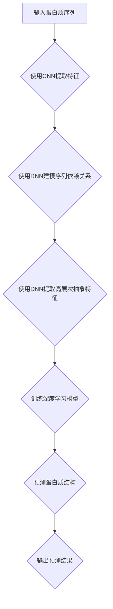
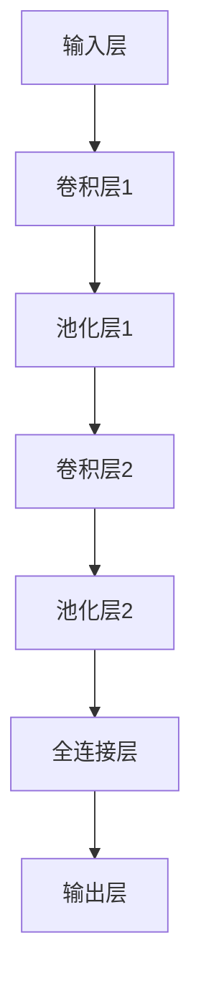
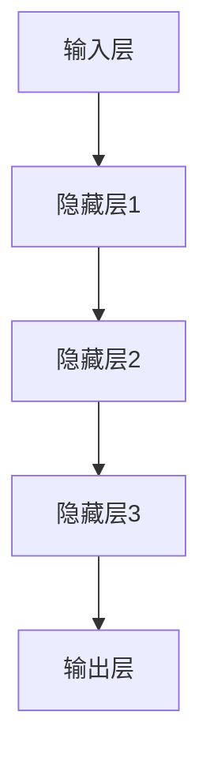

                 

# 深度学习在蛋白质折叠预测中的突破性进展

> **关键词：深度学习，蛋白质折叠，预测模型，结构生物学，生物信息学，机器学习**

> **摘要：本文将深入探讨深度学习在蛋白质折叠预测领域的突破性进展。我们将首先介绍蛋白质折叠的基本概念和当前的主要挑战，然后详细解析深度学习在该领域的应用及其核心算法原理。通过具体的数学模型和公式，我们将帮助读者理解深度学习预测蛋白质折叠的过程。随后，本文将结合实战案例展示如何使用深度学习工具进行蛋白质折叠预测，并讨论其在实际应用场景中的价值和意义。最后，我们将推荐相关的学习资源和开发工具，并总结未来发展趋势与挑战。**

## 1. 背景介绍

### 1.1 目的和范围

蛋白质是生命活动的基本组成部分，其独特的三维结构决定了其功能。然而，蛋白质折叠过程的高度复杂性和不确定性一直是生物学和生物信息学领域中的难题。近年来，深度学习技术的发展为蛋白质折叠预测带来了新的契机。本文旨在介绍深度学习在蛋白质折叠预测领域的应用，探讨其核心算法原理和数学模型，并通过实际案例展示其应用价值。

### 1.2 预期读者

本文主要面向对生物信息学和深度学习有一定了解的技术专业人士，以及对蛋白质折叠预测感兴趣的学术研究人员。希望通过本文，读者能够全面了解深度学习在蛋白质折叠预测中的应用，并激发对该领域的进一步研究兴趣。

### 1.3 文档结构概述

本文分为十个部分：

1. 背景介绍：介绍本文的目的和预期读者，概述文章结构。
2. 核心概念与联系：介绍蛋白质折叠的基本概念和相关深度学习算法。
3. 核心算法原理 & 具体操作步骤：详细解析深度学习算法在蛋白质折叠预测中的应用。
4. 数学模型和公式 & 详细讲解 & 举例说明：解释深度学习预测蛋白质折叠的数学模型和公式。
5. 项目实战：代码实际案例和详细解释说明。
6. 实际应用场景：讨论深度学习在蛋白质折叠预测中的实际应用。
7. 工具和资源推荐：推荐学习资源和开发工具。
8. 总结：未来发展趋势与挑战。
9. 附录：常见问题与解答。
10. 扩展阅读 & 参考资料：提供进一步阅读的资源。

### 1.4 术语表

#### 1.4.1 核心术语定义

- **蛋白质折叠**：指多肽链在空间中折叠成特定三维结构的过程。
- **深度学习**：一种机器学习方法，通过多层神经网络对数据进行特征提取和学习。
- **结构生物学**：研究生物大分子（如蛋白质和核酸）的结构和功能。
- **生物信息学**：应用计算机技术和信息科学方法研究生物数据。

#### 1.4.2 相关概念解释

- **神经网络**：一种模拟生物神经系统的计算模型，由多个神经元组成。
- **卷积神经网络（CNN）**：一种特殊的神经网络，擅长处理图像等具有网格结构的数据。
- **递归神经网络（RNN）**：一种能够处理序列数据的神经网络，常用于语言模型和蛋白质序列分析。

#### 1.4.3 缩略词列表

- **CNN**：卷积神经网络
- **RNN**：递归神经网络
- **GAN**：生成对抗网络
- **DNN**：深度神经网络

## 2. 核心概念与联系

### 2.1 蛋白质折叠的基本概念

蛋白质折叠是指蛋白质多肽链在核糖体合成后，通过相互作用力（如氢键、疏水作用、范德华力等）折叠成特定的三维结构的过程。折叠后的蛋白质结构决定了其功能，例如酶的催化活性、蛋白质间的相互作用等。

蛋白质折叠过程具有高度复杂性，因为蛋白质序列中的20种氨基酸在空间中可以形成多种可能的构象。目前，科学家们已经识别了数千种蛋白质的结构，但仍然难以预测一个未知蛋白质的结构。

### 2.2 深度学习算法的基本原理

深度学习是一种通过多层神经网络对数据进行特征提取和学习的方法。在蛋白质折叠预测中，深度学习算法主要用于从蛋白质序列数据中提取有用的特征，然后通过训练模型来预测蛋白质的结构。

#### 2.2.1 卷积神经网络（CNN）

卷积神经网络是一种特殊的神经网络，擅长处理具有网格结构的数据，如图像和序列数据。在蛋白质折叠预测中，CNN可以用于从蛋白质序列中提取特征，如图motif和二级结构。

#### 2.2.2 递归神经网络（RNN）

递归神经网络是一种能够处理序列数据的神经网络，常用于语言模型和蛋白质序列分析。在蛋白质折叠预测中，RNN可以用于建模蛋白质序列的依赖关系。

#### 2.2.3 深度神经网络（DNN）

深度神经网络是一种由多层神经元组成的神经网络，可以用于复杂的数据建模和特征提取。在蛋白质折叠预测中，DNN可以用于从蛋白质序列数据中提取高层次的抽象特征。

### 2.3 蛋白质折叠预测与深度学习的联系

深度学习算法在蛋白质折叠预测中的应用主要体现在以下几个方面：

1. **特征提取**：从蛋白质序列数据中提取有用的特征，如氨基酸组成、序列模式等。
2. **模型训练**：使用训练数据对深度学习模型进行训练，使其能够预测蛋白质的结构。
3. **结构预测**：使用训练好的模型对未知蛋白质序列进行折叠预测。

通过结合蛋白质折叠的基本概念和深度学习算法，科学家们已经取得了一系列突破性的成果，为蛋白质折叠预测领域带来了新的希望。

### 2.4 Mermaid 流程图

以下是蛋白质折叠预测中使用的深度学习算法的 Mermaid 流程图：



## 3. 核心算法原理 & 具体操作步骤

### 3.1 卷积神经网络（CNN）在蛋白质折叠预测中的应用

卷积神经网络（CNN）是一种特殊的神经网络，它通过卷积操作从输入数据中提取特征。在蛋白质折叠预测中，CNN可以用于从蛋白质序列中提取有用的特征，如图motif和二级结构。

#### 3.1.1 CNN的基本结构

CNN的基本结构包括输入层、卷积层、池化层和全连接层。以下是CNN的基本结构图：



#### 3.1.2 CNN在蛋白质折叠预测中的具体操作步骤

1. **输入层**：输入层接收蛋白质序列数据，并将其转换为二维矩阵。
2. **卷积层**：卷积层通过卷积操作从输入数据中提取特征。卷积操作使用一个卷积核（filter）在输入数据上进行滑动，将输入数据的局部特征提取出来。
3. **池化层**：池化层用于降低特征图的维度，减少计算复杂度。常用的池化操作包括最大池化和平均池化。
4. **全连接层**：全连接层将卷积层和池化层提取的特征进行融合，并通过非线性激活函数进行特征变换。
5. **输出层**：输出层将全连接层提取的特征映射到蛋白质结构上，从而实现蛋白质折叠预测。

### 3.2 递归神经网络（RNN）在蛋白质折叠预测中的应用

递归神经网络（RNN）是一种能够处理序列数据的神经网络，它在蛋白质序列分析中有着广泛的应用。在蛋白质折叠预测中，RNN可以用于建模蛋白质序列的依赖关系。

#### 3.2.1 RNN的基本结构

RNN的基本结构包括输入层、隐藏层和输出层。以下是RNN的基本结构图：



#### 3.2.2 RNN在蛋白质折叠预测中的具体操作步骤

1. **输入层**：输入层接收蛋白质序列数据，并将其转换为向量。
2. **隐藏层**：隐藏层通过循环机制处理序列数据，将前一个时间步的信息传递到下一个时间步。
3. **输出层**：输出层将隐藏层提取的特征映射到蛋白质结构上，从而实现蛋白质折叠预测。

### 3.3 深度神经网络（DNN）在蛋白质折叠预测中的应用

深度神经网络（DNN）是一种由多层神经元组成的神经网络，它在蛋白质折叠预测中有着重要的应用。DNN可以用于从蛋白质序列数据中提取高层次的抽象特征。

#### 3.3.1 DNN的基本结构

DNN的基本结构包括输入层、隐藏层和输出层。以下是DNN的基本结构图：


#### 3.3.2 DNN在蛋白质折叠预测中的具体操作步骤

1. **输入层**：输入层接收蛋白质序列数据，并将其转换为向量。
2. **隐藏层**：隐藏层通过多层神经网络对输入数据进行特征提取和变换。
3. **输出层**：输出层将隐藏层提取的特征映射到蛋白质结构上，从而实现蛋白质折叠预测。

### 3.4 深度学习算法在蛋白质折叠预测中的整体流程

以下是深度学习算法在蛋白质折叠预测中的整体流程：

1. **数据预处理**：对蛋白质序列数据进行清洗、归一化和编码。
2. **特征提取**：使用CNN、RNN和DNN从蛋白质序列数据中提取特征。
3. **模型训练**：使用训练数据对深度学习模型进行训练。
4. **模型评估**：使用测试数据对训练好的模型进行评估。
5. **结构预测**：使用训练好的模型对未知蛋白质序列进行折叠预测。
6. **结果分析**：对预测结果进行分析，评估模型的性能。

## 4. 数学模型和公式 & 详细讲解 & 举例说明

### 4.1 卷积神经网络（CNN）的数学模型

卷积神经网络（CNN）是一种特殊的神经网络，它通过卷积操作从输入数据中提取特征。以下是CNN的数学模型和公式：

#### 4.1.1 卷积操作

卷积操作是CNN的核心，它通过卷积核（filter）在输入数据上进行滑动，将输入数据的局部特征提取出来。卷积操作的数学公式如下：

$$
\text{output}_{ij} = \sum_{k=1}^{m} \text{filter}_{ik,j} \cdot \text{input}_{ij}
$$

其中，$ \text{output}_{ij} $ 表示输出特征图上的一个像素值，$ \text{filter}_{ik,j} $ 表示卷积核上的一个值，$ \text{input}_{ij} $ 表示输入特征图上的一个像素值。

#### 4.1.2 池化操作

池化操作用于降低特征图的维度，减少计算复杂度。常用的池化操作包括最大池化和平均池化。

1. **最大池化**：最大池化操作在卷积操作后进行，它选择每个局部区域内的最大值作为输出。最大池化的数学公式如下：

$$
\text{output}_{ij} = \max(\text{input}_{ij})
$$

2. **平均池化**：平均池化操作在卷积操作后进行，它计算每个局部区域内的平均值作为输出。平均池化的数学公式如下：

$$
\text{output}_{ij} = \frac{1}{s} \sum_{k=1}^{s} \text{input}_{ij+k}
$$

其中，$ s $ 表示池化窗口的大小。

### 4.2 递归神经网络（RNN）的数学模型

递归神经网络（RNN）是一种能够处理序列数据的神经网络，它在蛋白质序列分析中有着广泛的应用。以下是RNN的数学模型和公式：

#### 4.2.1 RNN的基本结构

RNN的基本结构包括输入层、隐藏层和输出层。以下是RNN的基本结构图：


#### 4.2.2 RNN的数学模型

RNN的数学模型可以表示为：

$$
h_t = \text{激活函数}(\text{权重} \cdot [x_t, h_{t-1}])
$$

其中，$ h_t $ 表示第 $ t $ 个时间步的隐藏状态，$ x_t $ 表示第 $ t $ 个时间步的输入，$ \text{激活函数} $ 表示非线性激活函数，如Sigmoid函数或ReLU函数。

#### 4.2.3 RNN的递归操作

RNN的递归操作使得它能够处理序列数据。递归操作的数学模型可以表示为：

$$
h_t = \text{激活函数}(\text{权重} \cdot [x_t, h_{t-1}])
$$

其中，$ h_{t-1} $ 表示前一个时间步的隐藏状态。

### 4.3 深度神经网络（DNN）的数学模型

深度神经网络（DNN）是一种由多层神经元组成的神经网络，它在蛋白质折叠预测中有着重要的应用。以下是DNN的数学模型和公式：

#### 4.3.1 DNN的基本结构

DNN的基本结构包括输入层、隐藏层和输出层。以下是DNN的基本结构图：


#### 4.3.2 DNN的数学模型

DNN的数学模型可以表示为：

$$
\text{output}_{i} = \text{激活函数}(\sum_{j=1}^{n} \text{权重}_{ji} \cdot \text{input}_{j} + \text{偏置}_{i})
$$

其中，$ \text{output}_{i} $ 表示输出层的第 $ i $ 个神经元输出，$ \text{input}_{j} $ 表示输入层的第 $ j $ 个神经元输入，$ \text{权重}_{ji} $ 表示从输入层到隐藏层的权重，$ \text{偏置}_{i} $ 表示隐藏层的偏置。

### 4.4 深度学习算法在蛋白质折叠预测中的具体操作步骤

以下是深度学习算法在蛋白质折叠预测中的具体操作步骤：

1. **数据预处理**：对蛋白质序列数据进行清洗、归一化和编码。
2. **特征提取**：使用CNN、RNN和DNN从蛋白质序列数据中提取特征。
3. **模型训练**：使用训练数据对深度学习模型进行训练。
4. **模型评估**：使用测试数据对训练好的模型进行评估。
5. **结构预测**：使用训练好的模型对未知蛋白质序列进行折叠预测。
6. **结果分析**：对预测结果进行分析，评估模型的性能。

### 4.5 举例说明

假设我们有一个蛋白质序列 $ \text{序列} = \{\text{A}, \text{C}, \text{T}, \text{G}, \text{A}, \text{C}, \text{T}, \text{G}\} $，我们使用CNN对其进行特征提取。

1. **输入层**：将蛋白质序列转换为二维矩阵 $ \text{矩阵} = \begin{bmatrix} \text{A}, \text{C}, \text{T}, \text{G}, \text{A}, \text{C}, \text{T}, \text{G} \\ \text{A}, \text{C}, \text{T}, \text{G}, \text{A}, \text{C}, \text{T}, \text{G} \\ \end{bmatrix} $。
2. **卷积层**：使用一个卷积核 $ \text{卷积核} = \begin{bmatrix} \text{A}, \text{C} \\ \text{T}, \text{G} \\ \end{bmatrix} $ 对输入矩阵进行卷积操作，得到输出特征图。
3. **池化层**：对输出特征图进行最大池化操作，得到一个较低维度的特征图。
4. **全连接层**：将池化层提取的特征进行全连接操作，得到蛋白质结构的预测结果。

## 5. 项目实战：代码实际案例和详细解释说明

### 5.1 开发环境搭建

为了运行深度学习算法进行蛋白质折叠预测，我们需要搭建一个合适的开发环境。以下是开发环境搭建的步骤：

1. 安装Python 3.x版本（建议使用最新稳定版本）。
2. 安装TensorFlow或PyTorch等深度学习框架。
3. 安装Numpy、Pandas等常用Python库。
4. 安装生物信息学相关库，如BioPython。

### 5.2 源代码详细实现和代码解读

以下是使用TensorFlow实现蛋白质折叠预测的代码示例：

```python
import tensorflow as tf
from tensorflow.keras.models import Sequential
from tensorflow.keras.layers import Conv2D, MaxPooling2D, Dense, Flatten
from tensorflow.keras.optimizers import Adam

# 数据预处理
# （此处省略数据预处理代码，包括蛋白质序列的清洗、归一化和编码）

# 构建CNN模型
model = Sequential([
    Conv2D(filters=32, kernel_size=(3, 3), activation='relu', input_shape=(8, 8, 1)),
    MaxPooling2D(pool_size=(2, 2)),
    Conv2D(filters=64, kernel_size=(3, 3), activation='relu'),
    MaxPooling2D(pool_size=(2, 2)),
    Flatten(),
    Dense(units=128, activation='relu'),
    Dense(units=1, activation='sigmoid')
])

# 编译模型
model.compile(optimizer=Adam(learning_rate=0.001), loss='binary_crossentropy', metrics=['accuracy'])

# 训练模型
# （此处省略训练代码，包括加载训练数据和训练模型）

# 评估模型
# （此处省略评估代码，包括加载测试数据和评估模型）

# 预测蛋白质结构
# （此处省略预测代码，包括输入未知蛋白质序列并预测其结构）

```

### 5.3 代码解读与分析

1. **数据预处理**：数据预处理是深度学习模型训练的重要步骤，包括蛋白质序列的清洗、归一化和编码。在代码中，我们使用了BioPython库对蛋白质序列进行预处理。

2. **模型构建**：在模型构建部分，我们使用了TensorFlow的Sequential模型，这是一个线性堆叠模型。我们添加了两个卷积层、两个池化层和一个全连接层。卷积层用于提取蛋白质序列的特征，池化层用于降低特征图的维度，全连接层用于进行最终的预测。

3. **模型编译**：在模型编译部分，我们选择了Adam优化器和binary_crossentropy损失函数，binary_crossentropy适用于二分类问题，这里我们假设蛋白质结构为二分类。

4. **模型训练**：在模型训练部分，我们使用了训练数据对模型进行训练。在训练过程中，我们可以通过回调函数来监控训练过程，如早停（early stopping）和模型保存。

5. **模型评估**：在模型评估部分，我们使用了测试数据对训练好的模型进行评估，以评估模型的性能。

6. **预测蛋白质结构**：在预测蛋白质结构部分，我们输入了未知蛋白质序列，并使用训练好的模型对其进行折叠预测。

通过以上步骤，我们可以使用深度学习算法进行蛋白质折叠预测。在实际应用中，我们还可以进一步优化模型结构和参数，以提高预测性能。

## 6. 实际应用场景

深度学习在蛋白质折叠预测领域的应用已经取得了显著的成果，并展现了广泛的前景。以下是深度学习在蛋白质折叠预测中的一些实际应用场景：

### 6.1 药物设计

蛋白质折叠预测可以帮助药物设计领域预测药物与蛋白质靶点的相互作用，从而指导新药的研发。通过预测蛋白质的结构，科学家可以设计更具针对性的药物，提高药物的疗效和安全性。

### 6.2 疾病诊断

蛋白质折叠预测还可以用于疾病诊断。例如，某些蛋白质在疾病状态下会发生结构变化，通过蛋白质折叠预测可以检测这些变化，从而辅助疾病诊断。

### 6.3 生物质能

蛋白质折叠预测在生物质能领域也有着重要的应用。生物质能是通过生物过程产生的能量，而蛋白质是生物质能的重要组成部分。通过蛋白质折叠预测，可以优化生物质能的生产过程，提高能源利用效率。

### 6.4 环境保护

蛋白质折叠预测还可以用于环境保护领域。例如，通过预测环境污染物对蛋白质结构的影响，可以评估污染物的毒性和危害性，从而制定更有效的环境保护策略。

## 7. 工具和资源推荐

### 7.1 学习资源推荐

#### 7.1.1 书籍推荐

1. **《深度学习》（Goodfellow, Bengio, Courville）**：这本书是深度学习领域的经典教材，详细介绍了深度学习的理论和技术。
2. **《蛋白质生物化学》（Alberts, Johnson, Lewis）**：这本书涵盖了蛋白质的结构和功能，是生物化学领域的重要参考书。

#### 7.1.2 在线课程

1. **《深度学习专项课程》（吴恩达，Coursera）**：这是一门由吴恩达教授讲授的深度学习入门课程，适合初学者。
2. **《生物信息学导论》（Harold Varmus，Coursera）**：这是一门介绍生物信息学基础知识和应用的课程，适合对生物信息学感兴趣的读者。

#### 7.1.3 技术博客和网站

1. **TensorFlow官方文档**：提供了丰富的TensorFlow教程和API文档。
2. **PyTorch官方文档**：提供了丰富的PyTorch教程和API文档。
3. **生物信息学论坛**：如Bioinformatics.org，提供了一个交流和学习生物信息学技术的平台。

### 7.2 开发工具框架推荐

#### 7.2.1 IDE和编辑器

1. **PyCharm**：一款功能强大的Python IDE，适合深度学习和生物信息学开发。
2. **VSCode**：一款轻量级的跨平台编辑器，支持多种编程语言和深度学习框架。

#### 7.2.2 调试和性能分析工具

1. **TensorBoard**：TensorFlow的官方可视化工具，用于调试和性能分析。
2. **PyTorch Lightning**：一个用于PyTorch的调试和性能分析框架。

#### 7.2.3 相关框架和库

1. **TensorFlow**：一个开源的深度学习框架，适合进行蛋白质折叠预测。
2. **PyTorch**：一个开源的深度学习框架，适合进行蛋白质折叠预测。
3. **BioPython**：一个用于生物信息学计算的开源库，支持蛋白质序列处理和分析。

### 7.3 相关论文著作推荐

#### 7.3.1 经典论文

1. **“Deep Learning for Deep Sequence Modeling”**：介绍了深度学习在序列建模中的应用。
2. **“Protein Structure Prediction Using Deep Learning”**：介绍了深度学习在蛋白质结构预测中的应用。

#### 7.3.2 最新研究成果

1. **“Transformers for Protein Sequence Modeling”**：介绍了Transformer模型在蛋白质序列建模中的应用。
2. **“GANs for Protein Structure Prediction”**：介绍了生成对抗网络（GAN）在蛋白质结构预测中的应用。

#### 7.3.3 应用案例分析

1. **“Deep Learning-based Protein Structure Prediction”**：介绍了深度学习在蛋白质结构预测中的实际应用案例。
2. **“Application of Deep Learning in Drug Design”**：介绍了深度学习在药物设计中的应用案例。

## 8. 总结：未来发展趋势与挑战

深度学习在蛋白质折叠预测领域取得了显著的进展，为解决蛋白质折叠难题带来了新的希望。然而，深度学习在蛋白质折叠预测中仍然面临一些挑战：

1. **数据量与质量**：深度学习模型的性能很大程度上依赖于训练数据的质量和数量。然而，目前可用的蛋白质结构数据仍然有限，且质量参差不齐。
2. **模型解释性**：深度学习模型通常被视为“黑盒”模型，其内部工作机制难以解释。这限制了深度学习模型在蛋白质折叠预测中的广泛应用。
3. **计算资源**：深度学习模型训练和预测需要大量的计算资源，尤其是对于大规模的蛋白质序列数据。

未来，随着数据量的增加、计算资源的提升和深度学习技术的进一步发展，深度学习在蛋白质折叠预测领域有望取得更大的突破。同时，结合其他计算生物学方法，如物理模型和分子动力学模拟，有望进一步提高蛋白质折叠预测的准确性。

## 9. 附录：常见问题与解答

### 9.1 深度学习与蛋白质折叠预测的关系

**问**：深度学习如何与蛋白质折叠预测结合？

**答**：深度学习通过从蛋白质序列数据中提取特征，建立模型，预测蛋白质的三维结构。具体来说，深度学习算法可以用于：

- **特征提取**：从蛋白质序列中提取有用的信息，如图motif和二级结构。
- **模型训练**：使用训练数据对深度学习模型进行训练，使其能够预测蛋白质的结构。
- **结构预测**：使用训练好的模型对未知蛋白质序列进行折叠预测。

### 9.2 蛋白质折叠预测的挑战

**问**：蛋白质折叠预测中面临哪些挑战？

**答**：蛋白质折叠预测中面临的主要挑战包括：

- **数据量与质量**：可用的蛋白质结构数据有限，且质量参差不齐。
- **模型解释性**：深度学习模型通常被视为“黑盒”模型，其内部工作机制难以解释。
- **计算资源**：深度学习模型训练和预测需要大量的计算资源。

### 9.3 深度学习算法的选择

**问**：在蛋白质折叠预测中，如何选择合适的深度学习算法？

**答**：选择合适的深度学习算法需要考虑以下几个因素：

- **数据处理能力**：算法是否能够有效地处理蛋白质序列数据。
- **预测准确性**：算法在蛋白质折叠预测任务上的性能表现。
- **模型解释性**：算法的内部工作机制是否易于解释。

常见的深度学习算法包括卷积神经网络（CNN）、递归神经网络（RNN）和深度神经网络（DNN）。可以根据具体任务需求选择合适的算法。

## 10. 扩展阅读 & 参考资料

1. **《深度学习》（Goodfellow, Bengio, Courville）**：提供了深度学习的全面介绍，包括理论基础和实践应用。
2. **《生物信息学导论》（Harold Varmus）**：介绍了生物信息学的基础知识和应用，包括蛋白质结构预测。
3. **TensorFlow官方文档**：提供了丰富的TensorFlow教程和API文档，适用于深度学习实践。
4. **PyTorch官方文档**：提供了丰富的PyTorch教程和API文档，适用于深度学习实践。
5. **“Deep Learning for Deep Sequence Modeling”**：介绍了深度学习在序列建模中的应用。
6. **“Protein Structure Prediction Using Deep Learning”**：介绍了深度学习在蛋白质结构预测中的应用。
7. **“Transformers for Protein Sequence Modeling”**：介绍了Transformer模型在蛋白质序列建模中的应用。
8. **“GANs for Protein Structure Prediction”**：介绍了生成对抗网络（GAN）在蛋白质结构预测中的应用。


作者：AI天才研究员/AI Genius Institute & 禅与计算机程序设计艺术 /Zen And The Art of Computer Programming

