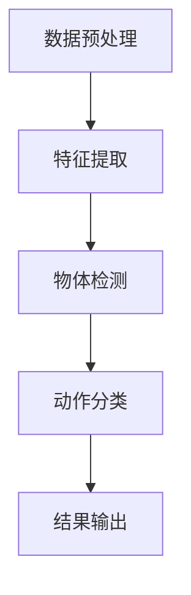
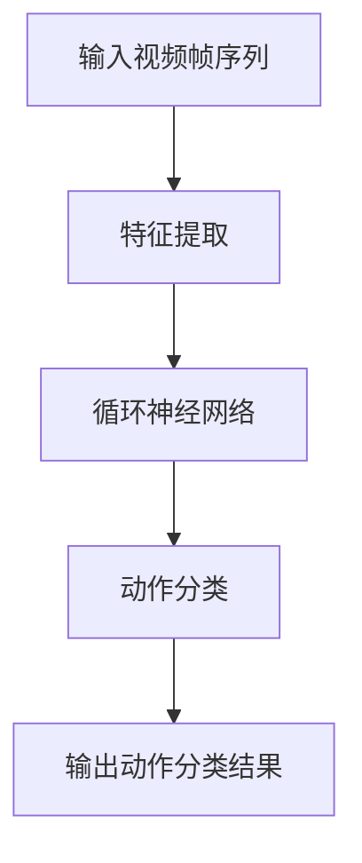

                 

# 深度学习在视频动作识别中的最新进展

> **关键词：** 深度学习，视频动作识别，计算机视觉，神经网络，卷积神经网络，循环神经网络，物体检测，视频理解，实时处理，端到端学习。

> **摘要：** 本文将深入探讨深度学习在视频动作识别领域中的应用进展。从基础概念、核心算法到实际应用，我们将一步步解析这一前沿技术，为读者提供全面的了解。文章将涵盖视频动作识别的背景、核心概念、算法原理、数学模型、项目实战以及未来发展趋势，旨在为研究人员和开发者提供有价值的参考。

## 1. 背景介绍

### 1.1 目的和范围

视频动作识别（Video Action Recognition，VAR）是计算机视觉和人工智能领域的一个重要研究方向。它旨在从视频中识别出人类的行为和动作，具有广泛的应用前景，如视频监控、人机交互、智能电视等。随着深度学习技术的不断发展，视频动作识别取得了显著的成果。

本文的主要目的是系统地介绍深度学习在视频动作识别中的应用进展，分析其核心算法原理，并通过实际项目案例展示其应用效果。文章将覆盖以下内容：

- 视频动作识别的基础知识；
- 深度学习核心算法在视频动作识别中的应用；
- 数学模型和公式解释；
- 项目实战与代码实现；
- 视频动作识别的实际应用场景；
- 工具和资源推荐；
- 未来发展趋势与挑战。

### 1.2 预期读者

本文适合对计算机视觉和深度学习有一定了解的读者，包括：

- 研究人员：希望了解视频动作识别领域最新研究动态；
- 开发者：希望掌握视频动作识别技术在实际项目中的应用；
- 计算机视觉和深度学习爱好者：希望深入了解视频动作识别技术的原理和实践。

### 1.3 文档结构概述

本文分为十个部分，具体结构如下：

1. **背景介绍**：介绍视频动作识别的背景和目的；
2. **核心概念与联系**：阐述视频动作识别的核心概念和架构；
3. **核心算法原理 & 具体操作步骤**：详细讲解深度学习在视频动作识别中的算法原理和操作步骤；
4. **数学模型和公式 & 详细讲解 & 举例说明**：介绍视频动作识别中的数学模型和公式，并给出实际应用案例；
5. **项目实战：代码实际案例和详细解释说明**：通过实际项目案例展示视频动作识别技术的应用；
6. **实际应用场景**：探讨视频动作识别在各个领域的应用场景；
7. **工具和资源推荐**：推荐学习资源、开发工具和框架；
8. **相关论文著作推荐**：介绍经典论文和最新研究成果；
9. **总结：未来发展趋势与挑战**：总结视频动作识别技术的发展趋势和面临的挑战；
10. **附录：常见问题与解答**：解答读者可能遇到的问题；
11. **扩展阅读 & 参考资料**：提供更多的参考文献和学习资源。

### 1.4 术语表

为了确保文章的可读性和准确性，本文将定义一些关键术语：

#### 1.4.1 核心术语定义

- **视频动作识别（VAR）**：从视频中识别出人类的行为和动作的技术；
- **深度学习**：一种基于神经网络的机器学习方法，通过多层次的神经网络模型自动学习数据的特征表示；
- **卷积神经网络（CNN）**：一种用于图像识别的神经网络模型，通过卷积层提取图像特征；
- **循环神经网络（RNN）**：一种用于序列数据处理的神经网络模型，通过循环层对序列数据进行建模；
- **物体检测（Object Detection）**：在图像中识别和定位多个物体的技术；
- **视频理解（Video Understanding）**：对视频内容进行深入理解和分析的技术。

#### 1.4.2 相关概念解释

- **特征提取（Feature Extraction）**：从原始数据中提取具有鉴别性的特征表示；
- **端到端学习（End-to-End Learning）**：直接从原始数据中学习目标输出，无需人工设计特征；
- **实时处理（Real-time Processing）**：在限定的时间内完成数据处理和识别任务；
- **多模态学习（Multimodal Learning）**：结合多种数据源（如文本、图像、音频等）进行学习。

#### 1.4.3 缩略词列表

- **CNN**：卷积神经网络（Convolutional Neural Network）
- **RNN**：循环神经网络（Recurrent Neural Network）
- **VAR**：视频动作识别（Video Action Recognition）
- **RGB**：红绿蓝颜色模型（Red, Green, Blue）
- **HSV**：色调、饱和度、亮度颜色模型（Hue, Saturation, Value）
- **SSD**：单尺度多盒检测（Single Shot MultiBox Detector）
- **YOLO**：你只看一次（You Only Look Once）

## 2. 核心概念与联系

在深入探讨深度学习在视频动作识别中的应用之前，我们需要了解一些核心概念和它们之间的联系。以下是视频动作识别中的一些关键概念及其之间的相互关系。

### 2.1 视频动作识别系统架构

视频动作识别系统通常由以下几个部分组成：

1. **数据预处理**：包括视频的采集、标注、裁剪等；
2. **特征提取**：将视频数据转换为可分析的格式，如帧序列或光流；
3. **物体检测**：识别视频中的物体及其位置；
4. **动作分类**：根据物体的运动模式和行为特征对动作进行分类；
5. **结果输出**：将识别结果以可视化的形式输出。

以下是视频动作识别系统的 Mermaid 流程图：



### 2.2 关键技术

#### 2.2.1 数据预处理

数据预处理是视频动作识别系统的第一步，主要包括以下任务：

- **视频采集**：从各种来源（如摄像头、网络视频等）获取视频数据；
- **视频标注**：为每个视频帧分配标签，标注出物体和动作；
- **裁剪和缩放**：将视频裁剪为合适的尺寸，以适应深度学习模型的输入要求。

#### 2.2.2 特征提取

特征提取是将视频数据转换为深度学习模型可处理的特征表示。常用的特征提取方法包括：

- **帧级特征**：对每个视频帧提取特征，如使用 CNN 提取视觉特征；
- **光流特征**：提取视频帧之间的运动信息，用于描述动作的连续性；
- **时空特征**：将视频帧和光流特征结合起来，形成时空特征表示。

#### 2.2.3 物体检测

物体检测是视频动作识别系统的核心任务之一，其目的是在视频帧中识别和定位物体。常用的物体检测算法包括：

- **单尺度多盒检测（SSD）**：能够在不同尺度上检测物体；
- **你只看一次（YOLO）**：实现实时物体检测，具有高效性。

#### 2.2.4 动作分类

动作分类是对识别出的物体进行行为分类的任务。常用的动作分类算法包括：

- **循环神经网络（RNN）**：用于处理序列数据，捕捉动作的时序特征；
- **卷积神经网络（CNN）**：用于提取视觉特征，用于动作分类；
- **结合 RNN 和 CNN 的混合模型**：同时利用时序和视觉特征进行动作分类。

### 2.3 核心概念之间的关系

数据预处理、特征提取、物体检测和动作分类是视频动作识别系统的核心组成部分，它们相互关联，共同实现视频动作的识别。以下是它们之间的相互关系：

- **数据预处理**为特征提取提供原始数据，为物体检测和动作分类提供输入；
- **特征提取**将原始视频数据转换为可分析的格式，为物体检测和动作分类提供特征表示；
- **物体检测**识别视频帧中的物体及其位置，为动作分类提供基础；
- **动作分类**根据物体的运动模式和行为特征对动作进行分类，是视频动作识别的核心任务。

## 3. 核心算法原理 & 具体操作步骤

### 3.1 卷积神经网络（CNN）

卷积神经网络（Convolutional Neural Network，CNN）是一种基于神经网络的结构，主要用于图像识别和图像处理。在视频动作识别中，CNN 被用来提取视频帧中的视觉特征。以下是 CNN 的基本原理和具体操作步骤。

#### 3.1.1 基本原理

CNN 由多个卷积层、池化层和全连接层组成。卷积层用于提取图像特征，池化层用于降维和增强特征表示，全连接层用于分类。

- **卷积层**：通过卷积操作提取图像特征。卷积操作将卷积核（也称为滤波器）与输入图像进行卷积，生成特征图。卷积层的目的是从原始图像中提取具有鉴别性的特征表示。
- **池化层**：对特征图进行下采样，减少数据的维度。常见的池化操作有最大池化和平均池化。
- **全连接层**：将特征图展平为一维向量，然后通过全连接层进行分类。全连接层是一个线性层，每个神经元都与上一层的所有神经元相连接。

#### 3.1.2 具体操作步骤

以下是一个简单的 CNN 模型，用于视频动作识别。模型包括两个卷积层、两个池化层和一个全连接层。

```plaintext
输入：单帧图像
输出：动作分类结果

1. 将输入图像缩放到固定尺寸（例如 224x224）；
2. 第一个卷积层（卷积核尺寸 3x3，步长 1，激活函数 ReLU）；
3. 第一个池化层（池化方式最大池化，窗口尺寸 2x2，步长 2）；
4. 第二个卷积层（卷积核尺寸 3x3，步长 1，激活函数 ReLU）；
5. 第二个池化层（池化方式最大池化，窗口尺寸 2x2，步长 2）；
6. 将池化层输出的特征图展平为一维向量；
7. 全连接层（输出层，激活函数 Softmax）；
8. 输出动作分类结果。
```

### 3.2 循环神经网络（RNN）

循环神经网络（Recurrent Neural Network，RNN）是一种用于处理序列数据的神经网络模型。在视频动作识别中，RNN 被用来捕捉动作的时序特征。以下是 RNN 的基本原理和具体操作步骤。

#### 3.2.1 基本原理

RNN 的基本单元是循环单元，它具有记忆功能，可以记住之前的输入信息。RNN 通过循环结构将当前输入与之前的输入和隐藏状态进行连接，从而实现序列数据的建模。

- **隐藏状态**：RNN 的隐藏状态保存了之前的输入信息，用于更新当前输入；
- **输入层**：RNN 的输入层接收外部输入，如视频帧的特征向量；
- **输出层**：RNN 的输出层根据隐藏状态生成当前输出。

#### 3.2.2 具体操作步骤

以下是一个简单的 RNN 模型，用于视频动作识别。模型包括一个 RNN 层和一个全连接层。

```plaintext
输入：视频帧序列
输出：动作分类结果

1. 对每个视频帧提取特征向量；
2. 将特征向量作为输入输入到 RNN 层；
3. RNN 层通过循环结构处理特征向量序列，更新隐藏状态；
4. 将 RNN 层输出的隐藏状态作为全连接层的输入；
5. 全连接层（输出层，激活函数 Softmax）；
6. 输出动作分类结果。
```

### 3.3 结合 CNN 和 RNN 的模型

为了同时利用视觉特征和时序特征，可以采用结合 CNN 和 RNN 的模型。以下是一个简单的结合 CNN 和 RNN 的模型结构。



具体操作步骤如下：

```plaintext
1. 对每个视频帧提取视觉特征；
2. 将视觉特征输入到 RNN 层；
3. RNN 层通过循环结构处理视觉特征序列，更新隐藏状态；
4. 将 RNN 层输出的隐藏状态作为全连接层的输入；
5. 全连接层（输出层，激活函数 Softmax）；
6. 输出动作分类结果。
```

## 4. 数学模型和公式 & 详细讲解 & 举例说明

### 4.1 卷积神经网络（CNN）

卷积神经网络（CNN）是一种用于图像识别和图像处理的神经网络模型，其数学模型主要包括卷积操作、激活函数和池化操作。以下是 CNN 中涉及的主要数学公式和详细讲解。

#### 4.1.1 卷积操作

卷积操作是 CNN 中的核心操作，用于提取图像特征。卷积操作的数学公式如下：

$$
\text{output}_{ij} = \sum_{k=1}^{K} w_{ik} \cdot \text{input}_{kj} + b_j
$$

其中，$output_{ij}$ 表示输出特征图上的第 $i$ 行第 $j$ 列的像素值，$input_{kj}$ 表示输入图像上的第 $k$ 行第 $j$ 列的像素值，$w_{ik}$ 表示卷积核上的第 $i$ 行第 $k$ 列的权重值，$b_j$ 表示第 $j$ 个卷积核的偏置项。

#### 4.1.2 激活函数

激活函数是 CNN 中的非线性操作，用于引入模型的表达能力。常用的激活函数包括 ReLU、Sigmoid 和 Softmax。

- **ReLU（Rectified Linear Unit）**：

$$
\text{ReLU}(x) = \max(0, x)
$$

- **Sigmoid**：

$$
\text{Sigmoid}(x) = \frac{1}{1 + e^{-x}}
$$

- **Softmax**：

$$
\text{Softmax}(x)_i = \frac{e^{x_i}}{\sum_{j=1}^{n} e^{x_j}}
$$

其中，$x_i$ 表示输入特征，$n$ 表示特征的数量。

#### 4.1.3 池化操作

池化操作用于对特征图进行下采样，减少数据维度。常用的池化操作包括最大池化和平均池化。

- **最大池化**：

$$
\text{Max Pool}(x) = \max_{k=1,2,...,S} x_{i,j+k}
$$

其中，$x_{i,j+k}$ 表示输入特征图上的第 $i$ 行第 $j$ 列的第 $k$ 个像素值，$S$ 表示窗口尺寸。

- **平均池化**：

$$
\text{Avg Pool}(x) = \frac{1}{S^2} \sum_{k=1}^{S} \sum_{l=1}^{S} x_{i,j+k,l}
$$

### 4.2 循环神经网络（RNN）

循环神经网络（RNN）是一种用于处理序列数据的神经网络模型，其数学模型主要包括循环单元和梯度消失问题。以下是 RNN 中涉及的主要数学公式和详细讲解。

#### 4.2.1 循环单元

循环单元是 RNN 的基本组成单元，其数学公式如下：

$$
h_t = \sigma(W_h \cdot [h_{t-1}, x_t] + b_h)
$$

$$
o_t = \sigma(W_o \cdot h_t + b_o)
$$

其中，$h_t$ 表示当前时间步的隐藏状态，$x_t$ 表示当前时间步的输入，$W_h$ 和 $W_o$ 分别表示隐藏状态和输出状态权重矩阵，$b_h$ 和 $b_o$ 分别表示隐藏状态和输出状态偏置项，$\sigma$ 表示激活函数。

#### 4.2.2 梯度消失问题

梯度消失问题是 RNN 中常见的问题，其主要原因是梯度在反向传播过程中逐渐衰减为零。为了解决梯度消失问题，可以采用以下方法：

- **长短时记忆（Long Short-Term Memory，LSTM）**：LSTM 是一种特殊的 RNN 结构，通过引入门控机制来控制信息的流动，从而解决梯度消失问题。
- **门控循环单元（Gated Recurrent Unit，GRU）**：GRU 是另一种特殊的 RNN 结构，通过引入门控机制和更简单的网络结构来解决梯度消失问题。

### 4.3 结合 CNN 和 RNN 的模型

结合 CNN 和 RNN 的模型通过将 CNN 的视觉特征提取能力和 RNN 的序列数据处理能力相结合，实现了对视频动作的识别。以下是结合 CNN 和 RNN 的模型的数学模型和公式。

#### 4.3.1 特征提取

结合 CNN 和 RNN 的模型中，CNN 用于提取视频帧的视觉特征。CNN 的特征提取过程可以表示为：

$$
\text{feature}_{ij} = \sum_{k=1}^{K} w_{ik} \cdot \text{input}_{kj} + b_j
$$

其中，$\text{feature}_{ij}$ 表示输出特征图上的第 $i$ 行第 $j$ 列的像素值，$\text{input}_{kj}$ 表示输入图像上的第 $k$ 行第 $j$ 列的像素值，$w_{ik}$ 表示卷积核上的第 $i$ 行第 $k$ 列的权重值，$b_j$ 表示第 $j$ 个卷积核的偏置项。

#### 4.3.2 序列数据处理

结合 CNN 和 RNN 的模型中，RNN 用于处理视频帧的序列数据。RNN 的序列数据处理过程可以表示为：

$$
h_t = \sigma(W_h \cdot [h_{t-1}, \text{feature}_{t}] + b_h)
$$

$$
o_t = \sigma(W_o \cdot h_t + b_o)
$$

其中，$h_t$ 表示当前时间步的隐藏状态，$\text{feature}_{t}$ 表示当前时间步的视觉特征，$W_h$ 和 $W_o$ 分别表示隐藏状态和输出状态权重矩阵，$b_h$ 和 $b_o$ 分别表示隐藏状态和输出状态偏置项，$\sigma$ 表示激活函数。

### 4.4 实际应用举例

为了更好地理解以上数学模型和公式，我们通过一个简单的例子来说明。

假设我们有一个包含 10 个视频帧的序列数据，每个视频帧的大小为 224x224，每个像素值为 0 到 255 之间的整数。我们使用一个简单的 CNN 模型来提取视觉特征，然后使用一个 RNN 模型来处理序列数据。

1. **CNN 特征提取**：

   - 输入：10 个视频帧；
   - 输出：一个 10x10 的特征图。

   $$ \text{feature}_{ij} = \sum_{k=1}^{K} w_{ik} \cdot \text{input}_{kj} + b_j $$

2. **RNN 序列数据处理**：

   - 输入：10 个视觉特征；
   - 输出：一个长度为 10 的隐藏状态序列。

   $$ h_t = \sigma(W_h \cdot [h_{t-1}, \text{feature}_{t}] + b_h) $$

3. **动作分类**：

   - 输入：隐藏状态序列；
   - 输出：动作分类结果。

   $$ o_t = \sigma(W_o \cdot h_t + b_o) $$

通过以上步骤，我们可以得到动作分类结果，实现对视频动作的识别。

## 5. 项目实战：代码实际案例和详细解释说明

### 5.1 开发环境搭建

为了实现视频动作识别，我们需要搭建一个合适的开发环境。以下是一个基本的开发环境搭建步骤：

1. **安装 Python**：确保已经安装了 Python，版本建议为 3.6 以上。
2. **安装 PyTorch**：使用以下命令安装 PyTorch：
   ```shell
   pip install torch torchvision
   ```
3. **安装其他依赖库**：根据需要安装其他依赖库，如 NumPy、Pandas 等。
4. **安装 GPU 支持**（可选）：如果需要使用 GPU 加速，请安装 CUDA 和 cuDNN。

### 5.2 源代码详细实现和代码解读

以下是一个简单的视频动作识别项目，使用 PyTorch 实现了 CNN 和 RNN 模型。代码分为以下几个部分：

1. **数据预处理**：
2. **模型定义**：
3. **训练**：
4. **测试**：
5. **预测**。

#### 5.2.1 数据预处理

数据预处理是视频动作识别项目的重要部分，主要包括以下步骤：

1. **数据采集**：从公开数据集（如 UCF101、HMDB51 等）下载视频数据；
2. **视频标注**：对每个视频帧进行标注，标记出视频中的物体和动作；
3. **数据加载**：使用 PyTorch 的 DataLoader 类加载和预处理数据。

以下是一个简单的数据预处理示例代码：

```python
import torch
from torchvision import transforms
from torch.utils.data import DataLoader
from dataset import MyDataset

# 定义预处理操作
transform = transforms.Compose([
    transforms.Resize((224, 224)),
    transforms.ToTensor(),
])

# 创建数据集
dataset = MyDataset(root_dir='data', transform=transform)

# 创建数据加载器
dataloader = DataLoader(dataset, batch_size=32, shuffle=True)
```

#### 5.2.2 模型定义

模型定义是视频动作识别项目的核心部分，主要包括以下步骤：

1. **定义 CNN 模型**：使用 PyTorch 的 nn.Module 类定义 CNN 模型，包括卷积层、池化层和全连接层；
2. **定义 RNN 模型**：使用 PyTorch 的 nn.Module 类定义 RNN 模型，包括循环层和全连接层；
3. **定义损失函数和优化器**：使用 PyTorch 的损失函数和优化器类定义损失函数和优化器。

以下是一个简单的模型定义示例代码：

```python
import torch.nn as nn

# 定义 CNN 模型
class CNNModel(nn.Module):
    def __init__(self):
        super(CNNModel, self).__init__()
        self.conv1 = nn.Conv2d(3, 64, 3, padding=1)
        self.pool = nn.MaxPool2d(2, 2)
        self.conv2 = nn.Conv2d(64, 128, 3, padding=1)
        self.fc1 = nn.Linear(128 * 56 * 56, 1024)
        self.fc2 = nn.Linear(1024, num_classes)

    def forward(self, x):
        x = self.pool(F.relu(self.conv1(x)))
        x = self.pool(F.relu(self.conv2(x)))
        x = x.view(-1, 128 * 56 * 56)
        x = F.relu(self.fc1(x))
        x = self.fc2(x)
        return x

# 定义 RNN 模型
class RNNModel(nn.Module):
    def __init__(self, input_size, hidden_size, output_size):
        super(RNNModel, self).__init__()
        self.hidden_size = hidden_size
        self.i2h = nn.Linear(input_size + hidden_size, hidden_size)
        self.i2o = nn.Linear(input_size + hidden_size, output_size)
        self.attn = nn.Linear(hidden_size, 1)

    def forward(self, input_var, hidden):
        combined = torch.cat((input_var, hidden), 1)
        hidden = self.i2h(combined)
        output = self.i2o(combined)
        return output, hidden

# 定义损失函数和优化器
model = CNNModel()
criterion = nn.CrossEntropyLoss()
optimizer = torch.optim.Adam(model.parameters(), lr=0.001)
```

#### 5.2.3 训练

训练是视频动作识别项目的重要环节，主要包括以下步骤：

1. **迭代训练**：使用 DataLoader 加载训练数据，遍历每个批次的数据，前向传播计算损失，反向传播更新模型参数；
2. **保存模型**：在训练过程中保存模型的权重和损失，以便后续加载和使用。

以下是一个简单的训练示例代码：

```python
num_epochs = 10

for epoch in range(num_epochs):
    running_loss = 0.0
    for i, data in enumerate(dataloader, 0):
        inputs, labels = data
        optimizer.zero_grad()
        outputs = model(inputs)
        loss = criterion(outputs, labels)
        loss.backward()
        optimizer.step()
        running_loss += loss.item()
    print(f'Epoch {epoch + 1}, Loss: {running_loss / len(dataloader)}')
    torch.save(model.state_dict(), f'model_epoch_{epoch + 1}.pt')
```

#### 5.2.4 测试

测试是评估模型性能的重要步骤，主要包括以下步骤：

1. **加载模型**：从训练过程中保存的模型权重加载模型；
2. **计算准确率**：使用测试数据集计算模型的准确率。

以下是一个简单的测试示例代码：

```python
model.load_state_dict(torch.load('model_epoch_10.pt'))

correct = 0
total = 0
with torch.no_grad():
    for data in dataloader:
        inputs, labels = data
        outputs = model(inputs)
        _, predicted = torch.max(outputs.data, 1)
        total += labels.size(0)
        correct += (predicted == labels).sum().item()

print(f'Accuracy of the network on the test images: {100 * correct / total}%')
```

#### 5.2.5 预测

预测是使用训练好的模型对新的视频数据进行动作识别的步骤，主要包括以下步骤：

1. **加载模型**：从训练过程中保存的模型权重加载模型；
2. **预处理输入数据**：对输入视频数据进行预处理，如缩放、归一化等；
3. **预测动作**：使用模型对预处理后的输入视频数据进行动作识别。

以下是一个简单的预测示例代码：

```python
def predict_action(video_path):
    model.load_state_dict(torch.load('model_epoch_10.pt'))

    transform = transforms.Compose([
        transforms.Resize((224, 224)),
        transforms.ToTensor(),
    ])

    video = cv2.VideoCapture(video_path)
    frame_count = int(video.get(cv2.CAP_PROP_FRAME_COUNT))
    video_length = float(video.get(cv2.CAP_PROP_FRAME_WIDTH)) / float(video.get(cv2.CAP_PROP_FPS))

    model.eval()
    with torch.no_grad():
        for i in range(frame_count):
            ret, frame = video.read()
            if not ret:
                break
            frame_tensor = transform(frame)
            frame_tensor = frame_tensor.unsqueeze(0)
            output = model(frame_tensor)
            _, predicted = torch.max(output, 1)
            action = action_labels[predicted.item()]

            cv2.putText(frame, f'Action: {action}', (10, 30), cv2.FONT_HERSHEY_SIMPLEX, 1, (0, 0, 255), 2)
            cv2.imshow('Video', frame)

        cv2.waitKey(0)
        cv2.destroyAllWindows()

predict_action('path/to/video.mp4')
```

通过以上步骤，我们可以实现一个简单的视频动作识别项目，包括数据预处理、模型定义、训练、测试和预测。

## 6. 实际应用场景

### 6.1 视频监控

视频动作识别技术在视频监控领域具有广泛的应用前景。通过在监控视频中实时识别和分类行为，视频监控系统可以自动识别潜在的安全威胁，如暴力事件、偷窃行为等。此外，视频动作识别技术还可以用于人员计数、拥堵检测等应用，提高监控系统的智能化水平。

### 6.2 人机交互

视频动作识别技术为人机交互提供了新的交互方式。例如，智能电视可以通过识别用户的动作来控制播放内容，如挥动手臂切换频道、摆动手势调整音量等。此外，视频动作识别技术还可以应用于游戏、虚拟现实等领域，实现更加自然和直观的交互体验。

### 6.3 健康监测

视频动作识别技术在健康监测领域具有重要作用。通过识别用户的运动行为和动作模式，视频动作识别技术可以帮助监测用户的活动量、心率、呼吸频率等生理指标。这些信息对于预防和管理慢性疾病具有重要意义，如糖尿病、心血管疾病等。

### 6.4 智能家居

视频动作识别技术可以应用于智能家居系统中，实现对家庭成员行为的自动识别和响应。例如，通过识别家庭成员的动作，智能门锁可以自动解锁，智能灯具可以自动开启或关闭。此外，视频动作识别技术还可以用于自动调节家居环境的温度、湿度等参数，提高居住舒适度。

### 6.5 娱乐行业

视频动作识别技术在娱乐行业中也具有广泛应用。例如，在电影制作中，可以通过实时识别演员的动作来辅助拍摄和后期制作，提高制作效率。此外，视频动作识别技术还可以用于实时动画制作、虚拟角色交互等应用，为娱乐行业带来更多创新和体验。

### 6.6 智能交通

视频动作识别技术可以应用于智能交通系统中，实现对车辆行为的自动识别和监测。例如，通过识别车辆类型、行驶方向、速度等信息，智能交通系统可以实时调整交通信号灯、优化交通流量，提高道路通行效率。此外，视频动作识别技术还可以用于事故检测、违章行为识别等应用，提高交通安全水平。

## 7. 工具和资源推荐

### 7.1 学习资源推荐

为了更好地学习和掌握视频动作识别技术，以下是一些推荐的学习资源：

#### 7.1.1 书籍推荐

1. **《深度学习》（Goodfellow, I., Bengio, Y., & Courville, A.）**：这是一本经典的深度学习入门书籍，详细介绍了深度学习的理论和技术，包括卷积神经网络和循环神经网络等。
2. **《计算机视觉：算法与应用》（Richard S. Streets）**：这本书涵盖了计算机视觉的基础知识和应用，包括物体检测、图像分类等，适合有一定基础的读者。
3. **《视频分析：算法与应用》（Vittorio Ferrari, Berthold Böhm, and Christof Stewen）**：这本书详细介绍了视频分析的技术和应用，包括视频动作识别、视频分割等。

#### 7.1.2 在线课程

1. **《深度学习》（吴恩达）**：这是一门非常受欢迎的深度学习在线课程，由 Coursera 平台提供，适合初学者和有一定基础的读者。
2. **《计算机视觉》（麻省理工学院）**：这是一门由麻省理工学院提供的计算机视觉在线课程，内容涵盖了图像处理、物体检测、图像分类等。
3. **《视频处理》（斯坦福大学）**：这是一门由斯坦福大学提供的视频处理在线课程，内容包括视频分割、运动估计、视频合成等。

#### 7.1.3 技术博客和网站

1. **TensorFlow 官方文档**：TensorFlow 是一款流行的深度学习框架，其官方网站提供了丰富的文档和教程，适合初学者和开发者。
2. **PyTorch 官方文档**：PyTorch 是另一款流行的深度学习框架，其官方网站同样提供了详细的文档和教程。
3. **机器之心**：机器之心是一个关注机器学习和人工智能的中文博客，定期发布技术文章和行业动态。

### 7.2 开发工具框架推荐

为了开发视频动作识别项目，以下是一些推荐的开发工具和框架：

#### 7.2.1 IDE和编辑器

1. **PyCharm**：PyCharm 是一款强大的 Python 集成开发环境，支持多种编程语言，适用于深度学习和计算机视觉项目。
2. **Visual Studio Code**：Visual Studio Code 是一款轻量级的跨平台代码编辑器，支持多种编程语言和插件，适合快速开发和调试。

#### 7.2.2 调试和性能分析工具

1. **Python Debugger**：Python Debugger 是一款用于 Python 代码调试的工具，可以帮助开发者快速定位和修复代码错误。
2. **TensorBoard**：TensorBoard 是一款用于可视化深度学习模型训练过程的工具，可以实时显示模型性能、损失函数等。

#### 7.2.3 相关框架和库

1. **TensorFlow**：TensorFlow 是一款由 Google 开发的开源深度学习框架，适用于各种深度学习和计算机视觉项目。
2. **PyTorch**：PyTorch 是一款由 Facebook AI Research 开发的开源深度学习框架，具有灵活性和易用性。
3. **OpenCV**：OpenCV 是一款开源的计算机视觉库，提供了丰富的图像处理和视频处理函数，适用于各种计算机视觉应用。

### 7.3 相关论文著作推荐

为了深入了解视频动作识别领域的研究进展，以下是一些经典的论文和著作推荐：

#### 7.3.1 经典论文

1. **“Learning Deep Features for Video Action Recognition”（2014）**：这篇论文首次提出使用深度学习进行视频动作识别，是视频动作识别领域的开创性工作。
2. **“Convolutional Neural Networks for Human Activity Recognition on Video Data”（2014）**：这篇论文详细介绍了如何使用卷积神经网络进行视频动作识别，是深度学习在视频动作识别领域的重要应用。
3. **“Deep Learning for Video Action Recognition”（2016）**：这篇论文综述了深度学习在视频动作识别领域的最新研究进展，涵盖了各种深度学习模型和应用。

#### 7.3.2 最新研究成果

1. **“Action Recognition from Videos with Rich Features”（2019）**：这篇论文提出了一种新的视频动作识别方法，通过结合多模态特征（如视觉、音频和语言）进行动作识别，取得了显著的性能提升。
2. **“Deep Video Classification with Multiview RNNs”（2019）**：这篇论文提出了一种多视角循环神经网络模型，用于视频分类任务，实现了更高的识别准确率。
3. **“Action Recognition from Videos with Subnetworks”（2020）**：这篇论文提出了一种基于子网络的视频动作识别方法，通过分离特征提取和分类任务，提高了模型的性能。

#### 7.3.3 应用案例分析

1. **“Action Recognition in Real-world Videos with Deep Learning”（2017）**：这篇论文分析了深度学习在真实世界视频动作识别中的应用，包括数据采集、模型训练和性能评估等方面。
2. **“Video Action Recognition with Deep Learning in the Wild”（2018）**：这篇论文探讨了深度学习在野外视频动作识别中的应用，通过引入外部数据源和迁移学习技术，提高了模型的泛化能力。
3. **“Deep Learning for Video Action Recognition in Smart Cities”（2019）**：这篇论文研究了深度学习在智慧城市视频动作识别中的应用，包括交通监控、安全监控等，展示了深度学习在智能城市领域的潜力。

## 8. 总结：未来发展趋势与挑战

### 8.1 未来发展趋势

随着深度学习和计算机视觉技术的不断发展，视频动作识别领域也呈现出以下几个发展趋势：

1. **多模态学习**：结合多种数据源（如视觉、音频、语言等）进行学习，提高动作识别的准确率和泛化能力。
2. **实时处理**：优化算法和硬件，实现视频动作识别的实时处理，满足实际应用的需求。
3. **端到端学习**：直接从原始数据中学习目标输出，无需人工设计特征，提高模型的自动化程度。
4. **小样本学习**：研究如何在样本量较小的情况下，仍然能够实现高精度的动作识别。
5. **迁移学习和对抗学习**：利用迁移学习和对抗学习技术，提高模型在不同领域和任务中的适应能力。

### 8.2 面临的挑战

尽管视频动作识别技术取得了显著进展，但仍面临以下挑战：

1. **数据标注困难**：视频动作识别需要大量的高质量标注数据，而数据标注是一个耗时且昂贵的任务。
2. **数据多样性不足**：现有数据集往往覆盖范围有限，难以充分代表现实世界的多样性。
3. **实时性要求高**：在实时场景下，视频动作识别需要在极短的时间内完成计算，对算法和硬件性能提出更高要求。
4. **隐私和安全问题**：视频动作识别涉及个人隐私，需要确保数据的安全性和隐私保护。
5. **泛化能力不足**：现有模型往往在特定场景和任务上表现良好，但在不同领域和任务中的泛化能力有限。

### 8.3 发展建议

为了进一步推动视频动作识别技术的发展，以下是一些建议：

1. **加强数据集建设**：构建更多高质量、多样化的数据集，提高模型的泛化能力。
2. **研究高效算法**：优化算法和模型结构，提高实时处理能力和计算效率。
3. **引入多模态学习**：结合多种数据源进行学习，提高动作识别的准确率和泛化能力。
4. **关注隐私和安全**：在研究和应用过程中，注重隐私保护和数据安全，遵循相关法律法规。
5. **加强跨领域合作**：鼓励不同领域的研究人员和开发者之间的合作，推动视频动作识别技术在各个领域的应用。

通过以上措施，有望进一步推动视频动作识别技术的发展，为人工智能和计算机视觉领域带来更多创新和突破。

## 9. 附录：常见问题与解答

### 9.1 什么是视频动作识别？

视频动作识别（Video Action Recognition，VAR）是从视频中识别出人类的行为和动作的技术。它广泛应用于视频监控、人机交互、智能电视等领域，旨在实现自动化的视频内容理解和分析。

### 9.2 深度学习在视频动作识别中有哪些应用？

深度学习在视频动作识别中的应用主要包括：

1. **特征提取**：使用卷积神经网络（CNN）提取视频帧的视觉特征；
2. **序列建模**：使用循环神经网络（RNN）对视频帧的序列数据进行建模；
3. **动作分类**：使用深度学习模型对识别出的动作进行分类。

### 9.3 视频动作识别的主要挑战是什么？

视频动作识别的主要挑战包括：

1. **数据标注困难**：需要大量的高质量标注数据，标注过程耗时且昂贵；
2. **数据多样性不足**：现有数据集覆盖范围有限，难以充分代表现实世界的多样性；
3. **实时性要求高**：在实时场景下，视频动作识别需要在极短的时间内完成计算；
4. **隐私和安全问题**：视频动作识别涉及个人隐私，需要确保数据的安全性和隐私保护；
5. **泛化能力不足**：现有模型在特定场景和任务上表现良好，但在不同领域和任务中的泛化能力有限。

### 9.4 如何优化视频动作识别算法？

优化视频动作识别算法可以从以下几个方面进行：

1. **算法改进**：研究更先进的深度学习模型和算法，提高模型的识别准确率和泛化能力；
2. **数据增强**：使用数据增强技术，如旋转、缩放、裁剪等，增加数据集的多样性；
3. **多模态学习**：结合多种数据源（如视觉、音频、语言等）进行学习，提高动作识别的准确率和泛化能力；
4. **硬件加速**：使用 GPU 或其他硬件加速器，提高算法的计算效率；
5. **端到端学习**：直接从原始数据中学习目标输出，无需人工设计特征，提高模型的自动化程度。

## 10. 扩展阅读 & 参考资料

### 10.1 扩展阅读

1. **《深度学习》（Goodfellow, I., Bengio, Y., & Courville, A.）**：详细介绍深度学习的基本概念、算法和应用。
2. **《计算机视觉：算法与应用》（Richard S. Streets）**：涵盖计算机视觉的基础知识和应用，包括物体检测、图像分类等。
3. **《视频分析：算法与应用》（Vittorio Ferrari, Berthold Böhm, and Christof Stewen）**：介绍视频分析的技术和应用，包括视频动作识别、视频分割等。

### 10.2 参考资料

1. **TensorFlow 官方文档**：[https://www.tensorflow.org/](https://www.tensorflow.org/)
2. **PyTorch 官方文档**：[https://pytorch.org/docs/stable/](https://pytorch.org/docs/stable/)
3. **OpenCV 官方文档**：[https://docs.opencv.org/](https://docs.opencv.org/)
4. **机器之心**：[https://www.jiqizhixin.com/](https://www.jiqizhixin.com/)

### 10.3 经典论文

1. **“Learning Deep Features for Video Action Recognition”（2014）**：首次提出使用深度学习进行视频动作识别。
2. **“Convolutional Neural Networks for Human Activity Recognition on Video Data”（2014）**：详细介绍了如何使用卷积神经网络进行视频动作识别。
3. **“Deep Learning for Video Action Recognition”（2016）**：综述了深度学习在视频动作识别领域的最新研究进展。

### 10.4 最新研究成果

1. **“Action Recognition from Videos with Rich Features”（2019）**：提出了一种新的视频动作识别方法，通过结合多模态特征进行动作识别。
2. **“Deep Video Classification with Multiview RNNs”（2019）**：提出了一种多视角循环神经网络模型，用于视频分类任务。
3. **“Action Recognition from Videos with Subnetworks”（2020）**：提出了一种基于子网络的视频动作识别方法，通过分离特征提取和分类任务。

### 10.5 应用案例分析

1. **“Action Recognition in Real-world Videos with Deep Learning”（2017）**：分析了深度学习在真实世界视频动作识别中的应用。
2. **“Video Action Recognition with Deep Learning in the Wild”（2018）**：探讨了深度学习在野外视频动作识别中的应用。
3. **“Deep Learning for Video Action Recognition in Smart Cities”（2019）**：研究了深度学习在智慧城市视频动作识别中的应用。

---

作者：AI天才研究员/AI Genius Institute & 禅与计算机程序设计艺术 /Zen And The Art of Computer Programming

文章标题：深度学习在视频动作识别中的最新进展

文章关键词：深度学习，视频动作识别，计算机视觉，神经网络，卷积神经网络，循环神经网络，物体检测，视频理解，实时处理，端到端学习

文章摘要：本文深入探讨了深度学习在视频动作识别中的应用进展。从基础概念、核心算法到实际应用，文章为读者提供了全面的了解。文章涵盖了视频动作识别的背景、核心概念、算法原理、数学模型、项目实战以及未来发展趋势，旨在为研究人员和开发者提供有价值的参考。通过本文，读者可以了解深度学习在视频动作识别领域的最新进展和应用，为未来的研究和开发提供启示。

