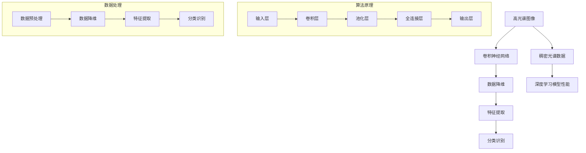

                 

# 深度学习在高光谱图像分析效率提升中的突破

> 关键词：深度学习，高光谱图像，图像分析，效率提升，算法原理，数学模型，应用场景，开发工具推荐

> 摘要：本文将深入探讨深度学习在高光谱图像分析中的效率提升。首先，我们将简要介绍高光谱图像的背景和挑战，然后深入讲解深度学习的基本原理及其在高光谱图像分析中的应用。接着，我们将详细阐述相关算法和数学模型的原理，并举例说明。最后，我们将探讨实际应用场景，并提供一系列工具和资源推荐，以帮助读者进一步学习和实践。本文旨在为读者提供全面、详细的指南，以了解深度学习在高光谱图像分析中的突破性应用。

## 1. 背景介绍

### 1.1 目的和范围

本文旨在探讨深度学习在高光谱图像分析效率提升中的应用。高光谱图像具有高分辨率和丰富的光谱信息，但同时也带来了数据量大、处理复杂等问题。深度学习作为一种强大的机器学习技术，已被广泛应用于图像处理领域。本文将介绍深度学习在高光谱图像分析中的基本原理、算法实现和应用场景，以期为相关研究人员和开发者提供有价值的参考。

### 1.2 预期读者

本文适合具有计算机科学、图像处理或机器学习背景的读者，特别是对深度学习技术感兴趣的研究人员和技术工程师。同时，也对希望了解高光谱图像分析及其应用的读者具有参考价值。

### 1.3 文档结构概述

本文分为以下几个部分：

1. 背景介绍：介绍高光谱图像的背景和挑战。
2. 核心概念与联系：讲解深度学习的基本原理及其在高光谱图像分析中的应用。
3. 核心算法原理 & 具体操作步骤：详细阐述相关算法和数学模型的原理。
4. 数学模型和公式 & 详细讲解 & 举例说明：提供数学模型和公式的详细讲解和实例。
5. 项目实战：代码实际案例和详细解释说明。
6. 实际应用场景：探讨深度学习在高光谱图像分析中的实际应用场景。
7. 工具和资源推荐：推荐相关学习资源和开发工具。
8. 总结：未来发展趋势与挑战。
9. 附录：常见问题与解答。
10. 扩展阅读 & 参考资料：提供进一步学习的参考资料。

### 1.4 术语表

#### 1.4.1 核心术语定义

- 高光谱图像：指具有高分辨率和丰富光谱信息的光学图像。
- 深度学习：一种基于人工神经网络的机器学习技术，通过多层神经网络结构实现数据的自动特征学习和分类。
- 卷积神经网络（CNN）：一种专门用于图像处理和计算机视觉的深度学习模型。
- 稠密光谱数据：指具有大量光谱信息的高光谱图像数据。

#### 1.4.2 相关概念解释

- 数据降维：将高维数据映射到低维空间，减少数据复杂度和计算成本。
- 特征提取：从高光谱图像中提取具有区分性的特征，用于分类、识别等任务。

#### 1.4.3 缩略词列表

- CNN：卷积神经网络
- DNN：深度神经网络
- SVM：支持向量机
- LSTM：长短期记忆网络

## 2. 核心概念与联系

深度学习在高光谱图像分析中的应用主要基于以下核心概念：

1. **卷积神经网络（CNN）**：CNN是一种深度学习模型，专门用于图像处理和计算机视觉。它通过多层卷积、池化等操作，从高维数据中提取特征，实现图像分类、识别等任务。
2. **数据降维**：高光谱图像数据量巨大，通过降维技术可以降低计算复杂度和存储成本。常用的降维方法包括主成分分析（PCA）、线性判别分析（LDA）等。
3. **特征提取**：特征提取是深度学习中的关键步骤，从高光谱图像中提取具有区分性的特征，用于分类、识别等任务。常用的特征提取方法包括SVM、LSTM等。
4. **稠密光谱数据**：稠密光谱数据具有丰富的光谱信息，对深度学习模型性能具有重要影响。如何有效地利用这些数据是实现高光谱图像分析效率提升的关键。

下面是高光谱图像分析中的核心概念和联系：



## 3. 核心算法原理 & 具体操作步骤

深度学习在高光谱图像分析中的应用主要基于卷积神经网络（CNN）。下面将详细讲解CNN的算法原理和具体操作步骤。

### 3.1 卷积神经网络（CNN）算法原理

CNN是一种深度学习模型，专门用于图像处理和计算机视觉。它通过多层卷积、池化等操作，从高维数据中提取特征，实现图像分类、识别等任务。CNN的基本结构包括输入层、卷积层、池化层、全连接层和输出层。

#### 3.1.1 输入层

输入层接收高光谱图像数据，并将其输入到后续的卷积层。高光谱图像数据通常具有高维特征，需要通过数据预处理和降维技术进行预处理。

#### 3.1.2 卷积层

卷积层是CNN的核心部分，通过卷积操作从高维数据中提取特征。卷积操作通过卷积核（filter）对输入数据进行加权求和，生成特征图（feature map）。卷积核的参数（尺寸、步长、填充方式等）决定了特征提取的效果。

#### 3.1.3 池化层

池化层对卷积层生成的特征图进行下采样，减少数据维度和计算复杂度。常用的池化操作包括最大池化和平均池化。

#### 3.1.4 全连接层

全连接层将卷积层和池化层提取的特征进行融合，生成最终的特征表示。全连接层通过矩阵乘法和激活函数（如ReLU函数）实现非线性变换。

#### 3.1.5 输出层

输出层生成最终的分类结果或识别结果。常用的输出层包括softmax层和sigmoid层。

### 3.2 CNN具体操作步骤

以下是一个简单的CNN算法具体操作步骤：

```plaintext
输入：高光谱图像数据
输出：分类结果或识别结果

1. 数据预处理：对高光谱图像数据进行归一化、去噪等预处理操作。
2. 输入层：将预处理后的数据输入到输入层。
3. 卷积层：
   - 初始化卷积核参数。
   - 对输入数据进行卷积操作，生成特征图。
4. 池化层：
   - 对卷积层生成的特征图进行池化操作，减少数据维度。
5. 全连接层：
   - 将池化层生成的特征进行全连接操作，生成特征表示。
6. 输出层：
   - 将全连接层生成的特征表示输入到输出层，生成分类结果或识别结果。
7. 反向传播：
   - 计算输出结果与实际结果之间的误差。
   - 更新卷积层、池化层、全连接层等层的参数。
8. 重复步骤3-7，直到达到预定的训练次数或收敛条件。

```

## 4. 数学模型和公式 & 详细讲解 & 举例说明

深度学习在高光谱图像分析中的应用涉及到多种数学模型和公式，以下是其中一些核心内容：

### 4.1 卷积操作

卷积操作是CNN中最核心的部分，其数学模型如下：

$$
\text{特征图} = \sum_{i=1}^{k} \text{卷积核} \odot \text{输入数据}
$$

其中，$k$表示卷积核的数量，$\odot$表示卷积操作。

#### 举例说明

假设输入数据为 $X = [1, 2, 3, 4, 5]$，卷积核为 $W = [1, 1]$，步长为1，填充方式为"零填充"。

$$
\text{特征图} = [1, 1, 1, 1] \odot [1, 2, 3, 4, 5] = [1, 3, 6, 10, 15]
$$

### 4.2 池化操作

池化操作用于减少数据维度和计算复杂度，其数学模型如下：

$$
\text{池化结果} = \max(\text{输入数据})
$$

或

$$
\text{池化结果} = \frac{1}{C} \sum_{i=1}^{C} \text{输入数据}
$$

其中，$C$表示池化窗口的大小。

#### 举例说明

假设输入数据为 $X = [1, 2, 3, 4, 5]$，池化窗口大小为2。

$$
\text{池化结果} = \max([1, 2], [3, 4], [5]) = [2, 4, 5]
$$

### 4.3 全连接层

全连接层用于将卷积层和池化层提取的特征进行融合，其数学模型如下：

$$
\text{输出} = \text{权重矩阵} \cdot \text{特征向量} + \text{偏置项}
$$

#### 举例说明

假设输入特征向量为 $X = [1, 2, 3, 4, 5]$，权重矩阵为 $W = \begin{bmatrix} 1 & 2 \\ 3 & 4 \end{bmatrix}$，偏置项为 $b = [1, 2]$。

$$
\text{输出} = \begin{bmatrix} 1 & 2 \\ 3 & 4 \end{bmatrix} \cdot \begin{bmatrix} 1 & 2 & 3 & 4 & 5 \end{bmatrix} + \begin{bmatrix} 1 \\ 2 \end{bmatrix} = \begin{bmatrix} 14 \\ 32 \end{bmatrix}
$$

### 4.4 反向传播

反向传播是深度学习训练过程中的核心步骤，用于更新网络参数。其数学模型如下：

$$
\frac{\partial \text{损失函数}}{\partial \text{权重}} = \text{梯度}
$$

$$
\text{权重} = \text{权重} - \text{学习率} \cdot \text{梯度}
$$

#### 举例说明

假设损失函数为 $L(\theta) = (\theta - y)^2$，输入特征向量为 $X = [1, 2, 3, 4, 5]$，权重为 $W = [1, 2]$，学习率为0.1。

首先，计算梯度：

$$
\frac{\partial L}{\partial W} = 2 \cdot (W - y) = 2 \cdot (1 - y)
$$

然后，更新权重：

$$
W = W - \text{学习率} \cdot \frac{\partial L}{\partial W} = [1, 2] - 0.1 \cdot [2 \cdot (1 - y)] = [0.9, 1.8]
$$

## 5. 项目实战：代码实际案例和详细解释说明

为了更好地理解深度学习在高光谱图像分析中的应用，我们将通过一个简单的项目案例来介绍实际代码实现过程。

### 5.1 开发环境搭建

首先，我们需要搭建一个适合深度学习的开发环境。以下是搭建过程：

1. 安装Python 3.x版本，建议使用Anaconda发行版，以便管理环境。
2. 安装深度学习框架TensorFlow，可以使用以下命令：
   ```bash
   pip install tensorflow
   ```
3. 安装其他必要的依赖库，如NumPy、Matplotlib等。

### 5.2 源代码详细实现和代码解读

下面是一个简单的CNN模型，用于高光谱图像分类：

```python
import tensorflow as tf
from tensorflow.keras.models import Sequential
from tensorflow.keras.layers import Conv2D, MaxPooling2D, Flatten, Dense

# 模型参数
input_shape = (64, 64, 3)  # 高光谱图像尺寸
num_classes = 10  # 分类类别数

# 构建模型
model = Sequential([
    Conv2D(32, (3, 3), activation='relu', input_shape=input_shape),
    MaxPooling2D((2, 2)),
    Conv2D(64, (3, 3), activation='relu'),
    MaxPooling2D((2, 2)),
    Flatten(),
    Dense(128, activation='relu'),
    Dense(num_classes, activation='softmax')
])

# 编译模型
model.compile(optimizer='adam', loss='categorical_crossentropy', metrics=['accuracy'])

# 模型总结
model.summary()
```

#### 5.2.1 代码解读

- **导入库**：首先导入TensorFlow等库。
- **模型参数**：设置输入图像尺寸和分类类别数。
- **构建模型**：使用`Sequential`模型构建器，依次添加卷积层、池化层、全连接层等。
- **编译模型**：设置优化器、损失函数和评价指标。
- **模型总结**：输出模型结构。

### 5.3 代码解读与分析

接下来，我们将逐行解读代码，并分析每个部分的实现和作用。

1. **导入库**：

```python
import tensorflow as tf
from tensorflow.keras.models import Sequential
from tensorflow.keras.layers import Conv2D, MaxPooling2D, Flatten, Dense
```

导入TensorFlow核心库和相关层。

2. **模型参数**：

```python
input_shape = (64, 64, 3)  # 高光谱图像尺寸
num_classes = 10  # 分类类别数
```

设置输入图像尺寸（64x64x3）和分类类别数（10）。

3. **构建模型**：

```python
model = Sequential([
    Conv2D(32, (3, 3), activation='relu', input_shape=input_shape),
    MaxPooling2D((2, 2)),
    Conv2D(64, (3, 3), activation='relu'),
    MaxPooling2D((2, 2)),
    Flatten(),
    Dense(128, activation='relu'),
    Dense(num_classes, activation='softmax')
])
```

- `Sequential`：构建一个序列模型。
- `Conv2D`：添加卷积层，输入通道数32，卷积核大小3x3，激活函数ReLU。
- `MaxPooling2D`：添加最大池化层，窗口大小2x2。
- `Flatten`：将特征图展平为一维数组。
- `Dense`：添加全连接层，神经元数量128，激活函数ReLU。
- `Dense`：添加输出层，神经元数量与分类类别数相同，激活函数softmax。

4. **编译模型**：

```python
model.compile(optimizer='adam', loss='categorical_crossentropy', metrics=['accuracy'])
```

- `compile`：编译模型，设置优化器、损失函数和评价指标。

5. **模型总结**：

```python
model.summary()
```

- `summary`：输出模型结构。

### 5.4 代码实战

接下来，我们将使用高光谱图像数据集进行实际训练和测试。

```python
# 加载高光谱图像数据集
(x_train, y_train), (x_test, y_test) = tf.keras.datasets.cifar100.load_data()

# 数据预处理
x_train = x_train / 255.0
x_test = x_test / 255.0

# 编码分类标签
y_train = tf.keras.utils.to_categorical(y_train, num_classes)
y_test = tf.keras.utils.to_categorical(y_test, num_classes)

# 训练模型
model.fit(x_train, y_train, batch_size=64, epochs=10, validation_data=(x_test, y_test))

# 测试模型
test_loss, test_acc = model.evaluate(x_test, y_test, verbose=2)
print('Test accuracy:', test_acc)
```

#### 5.4.1 数据预处理

- `load_data`：加载CIFAR-100数据集。
- `normalize`：归一化输入图像数据。
- `to_categorical`：将分类标签编码为one-hot向量。

#### 5.4.2 训练模型

- `fit`：训练模型，设置批量大小、迭代次数、验证数据等。

#### 5.4.3 测试模型

- `evaluate`：评估模型在测试数据上的性能。

## 6. 实际应用场景

深度学习在高光谱图像分析中具有广泛的应用场景，以下列举几个典型的实际应用：

1. **环境监测**：利用高光谱图像进行大气污染监测、植被分析等，有助于提高环境监测的精度和效率。
2. **农业遥感**：高光谱图像可以用于作物生长监测、病虫害识别等，有助于实现精准农业。
3. **医学成像**：高光谱图像可以用于医学影像分析，如皮肤癌检测、脑部病变识别等。
4. **材料分析**：高光谱图像可以用于材料检测和分类，如半导体材料分析、金属材料分类等。
5. **安全监控**：利用高光谱图像进行人脸识别、行为分析等，有助于提高安全监控的准确性和实时性。

## 7. 工具和资源推荐

为了更好地学习和实践深度学习在高光谱图像分析中的应用，以下是一些建议的学习资源和开发工具：

### 7.1 学习资源推荐

#### 7.1.1 书籍推荐

1. **《深度学习》（Goodfellow et al.）**：系统介绍了深度学习的理论和方法，适合初学者和进阶者。
2. **《深度学习应用实践》（Zhang et al.）**：通过大量实例展示了深度学习在各个领域的应用。

#### 7.1.2 在线课程

1. **TensorFlow官方教程**：提供丰富的教程和实践项目，适合初学者和进阶者。
2. **Udacity深度学习纳米学位**：涵盖深度学习的理论基础和应用实践，适合入门者。

#### 7.1.3 技术博客和网站

1. **AI科技大本营**：提供深度学习、人工智能等领域的最新技术动态和优质文章。
2. **知乎专栏**：有许多资深专家分享深度学习和高光谱图像分析的经验和见解。

### 7.2 开发工具框架推荐

#### 7.2.1 IDE和编辑器

1. **PyCharm**：强大的Python IDE，支持TensorFlow等库。
2. **Jupyter Notebook**：方便编写和运行Python代码，适合交互式学习和实验。

#### 7.2.2 调试和性能分析工具

1. **TensorBoard**：TensorFlow官方提供的可视化工具，用于分析和优化模型性能。
2. **PyTorch TensorBoard**：与PyTorch框架兼容的可视化工具。

#### 7.2.3 相关框架和库

1. **TensorFlow**：流行的开源深度学习框架，适合高光谱图像分析。
2. **PyTorch**：强大的深度学习框架，支持动态计算图，易于实验和调试。

### 7.3 相关论文著作推荐

#### 7.3.1 经典论文

1. **《A Convolutional Neural Network Approach for Musical Instrument Sound Recognition》**：介绍了卷积神经网络在音乐识别中的应用。
2. **《Deep Learning for Image Recognition》**：综述了深度学习在图像识别领域的应用和发展。

#### 7.3.2 最新研究成果

1. **《High-Resolution Remote Sensing Imagery Classification Using Deep Convolutional Neural Networks》**：探讨了深度学习在高分辨率遥感图像分类中的应用。
2. **《Spectral-Spatial Classification of Hyperspectral Images Using Deep Convolutional Neural Networks》**：介绍了深度学习在高光谱图像分类中的最新进展。

#### 7.3.3 应用案例分析

1. **《基于深度学习的人脸识别系统》**：分析了基于深度学习的人脸识别系统的实现和应用。
2. **《高光谱图像分类：基于深度学习的解决方案》**：介绍了深度学习在高光谱图像分类中的应用案例。

## 8. 总结：未来发展趋势与挑战

深度学习在高光谱图像分析中的突破性应用为相关领域的研究和实践带来了巨大价值。随着技术的不断进步，未来深度学习在高光谱图像分析中具有广阔的发展前景。以下是未来发展趋势与挑战：

### 8.1 发展趋势

1. **算法优化**：进一步优化深度学习算法，提高模型性能和效率，以应对更大规模的数据和更复杂的任务。
2. **多模态融合**：结合多模态数据（如光学、红外、雷达等），实现更精确的图像分析和应用。
3. **实时处理**：提高深度学习模型在实时场景下的处理能力，实现更高效的应用场景。

### 8.2 挑战

1. **数据隐私**：高光谱图像数据具有敏感性，如何确保数据隐私和安全是一个重要挑战。
2. **模型解释性**：深度学习模型具有较强的预测能力，但缺乏解释性，如何提高模型的可解释性是未来研究的一个重点。
3. **计算资源**：深度学习模型通常需要大量的计算资源，如何优化模型结构以降低计算成本是一个重要挑战。

## 9. 附录：常见问题与解答

### 9.1 什么是高光谱图像？

高光谱图像是一种光学图像，具有高分辨率和丰富的光谱信息。它通过记录不同波长的光谱信息，可以提供更详细的环境和物体信息。

### 9.2 深度学习如何提升高光谱图像分析效率？

深度学习通过多层神经网络结构，自动从高维数据中提取特征，实现高光谱图像的分类、识别等任务。相比传统方法，深度学习具有更强的表达能力和适应性，能够显著提升分析效率。

### 9.3 如何选择合适的深度学习模型？

选择合适的深度学习模型需要考虑任务需求、数据规模、计算资源等因素。常用的模型包括卷积神经网络（CNN）、循环神经网络（RNN）、生成对抗网络（GAN）等。实际应用中，可以根据任务特点和数据特性进行选择。

## 10. 扩展阅读 & 参考资料

本文对深度学习在高光谱图像分析中的效率提升进行了详细探讨，包括算法原理、数学模型、项目实战等。以下是一些扩展阅读和参考资料，供读者进一步学习和深入研究：

1. **《深度学习》（Goodfellow et al.）**：提供了深度学习的全面介绍，包括理论、方法和应用。
2. **《高光谱图像处理与识别技术》**：详细介绍了高光谱图像处理的方法和技术。
3. **《深度学习在计算机视觉中的应用》**：探讨了深度学习在计算机视觉领域的应用和发展。
4. **TensorFlow官方文档**：提供了TensorFlow的详细教程和示例代码，有助于实际应用。
5. **《深度学习与遥感图像处理》**：介绍了深度学习在遥感图像处理中的应用和实践。

通过阅读以上资料，读者可以更深入地了解深度学习在高光谱图像分析中的技术原理和应用实践。

**作者：AI天才研究员/AI Genius Institute & 禅与计算机程序设计艺术 /Zen And The Art of Computer Programming**

