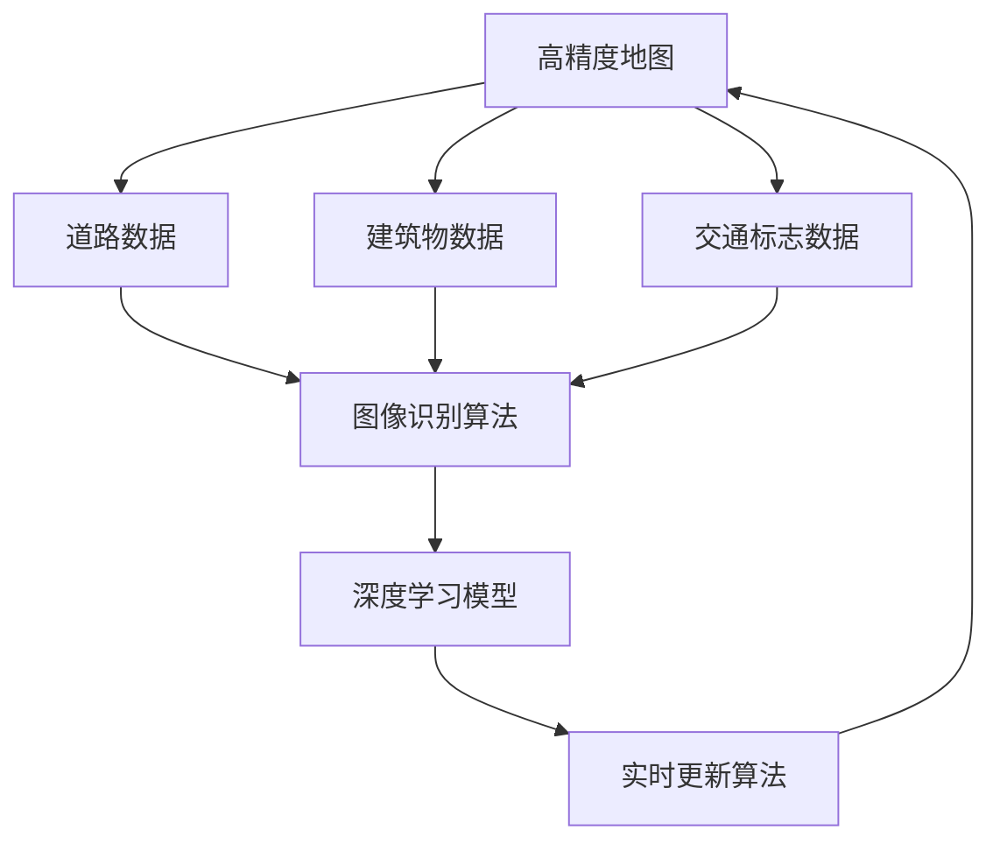

                 

### 深度学习在高精度地图自动更新中的技术创新

> **关键词**：深度学习，高精度地图，自动更新，图像识别，GPS，数据处理，机器学习，语义分割

> **摘要**：随着人工智能技术的不断进步，深度学习在高精度地图自动更新中展现出显著的技术创新。本文旨在探讨深度学习在高精度地图自动更新中的应用，通过介绍其核心概念、算法原理、数学模型及项目实战，全面解析深度学习如何实现地图的实时更新与精准维护。本文将有助于读者理解深度学习在该领域的最新进展及其未来发展方向。

## 1. 背景介绍

### 1.1 目的和范围

本文旨在深入探讨深度学习在高精度地图自动更新领域的应用，具体包括以下几个方面：

- **核心概念**：介绍高精度地图的基本概念和特点，以及深度学习的基本原理。
- **算法原理**：详细讲解深度学习在高精度地图自动更新中的应用算法，如卷积神经网络（CNN）和生成对抗网络（GAN）。
- **数学模型**：阐述深度学习中的关键数学模型和公式，帮助读者理解其内在机制。
- **项目实战**：通过实际案例展示深度学习在高精度地图自动更新中的应用，并提供详细的代码解释。
- **应用场景**：分析深度学习在高精度地图自动更新中的实际应用场景和挑战。
- **工具和资源**：推荐相关学习资源、开发工具和最新研究成果。

### 1.2 预期读者

本文主要面向以下读者群体：

- **人工智能和计算机视觉研究者**：希望了解深度学习在高精度地图自动更新领域的最新应用。
- **地图工程师和技术人员**：需要对高精度地图自动更新技术有深入理解的专业人士。
- **高等院校师生**：计算机科学、人工智能等相关专业的研究生和本科生。

### 1.3 文档结构概述

本文结构如下：

1. **背景介绍**：概述高精度地图自动更新的意义和背景，介绍深度学习的基本概念。
2. **核心概念与联系**：详细解释高精度地图和深度学习的核心概念，提供流程图展示。
3. **核心算法原理 & 具体操作步骤**：介绍深度学习在高精度地图自动更新中的应用算法和操作步骤。
4. **数学模型和公式 & 详细讲解 & 举例说明**：阐述深度学习中的数学模型和公式，并通过实例进行说明。
5. **项目实战：代码实际案例和详细解释说明**：通过实际项目展示深度学习在高精度地图自动更新中的应用。
6. **实际应用场景**：分析深度学习在高精度地图自动更新中的实际应用场景和挑战。
7. **工具和资源推荐**：推荐学习资源、开发工具和最新研究成果。
8. **总结：未来发展趋势与挑战**：总结深度学习在高精度地图自动更新中的发展趋势和面临的挑战。
9. **附录：常见问题与解答**：解答读者可能遇到的问题。
10. **扩展阅读 & 参考资料**：提供进一步阅读的文献和资源。

### 1.4 术语表

#### 1.4.1 核心术语定义

- **高精度地图**：详细记录道路、建筑物、交通标志等信息的地图，用于辅助自动驾驶和导航系统。
- **深度学习**：一种人工智能方法，通过多层神经网络模型进行数据训练，以实现对复杂数据的自动学习和特征提取。
- **自动更新**：通过算法自动识别和更新地图中的信息，如道路变化、建筑拆除等。
- **图像识别**：利用计算机视觉技术对图像中的对象进行识别和分类。
- **GPS**：全球定位系统，用于确定地球上任何物体的精确位置。
- **数据处理**：对采集到的地图数据进行分析、处理和整合，以提高地图的精度和可靠性。

#### 1.4.2 相关概念解释

- **卷积神经网络（CNN）**：一种用于图像识别和处理的神经网络结构，通过卷积层和池化层进行特征提取和降维。
- **生成对抗网络（GAN）**：一种由生成器和判别器组成的神经网络结构，用于生成和鉴别真实数据和伪造数据。
- **语义分割**：一种图像处理技术，通过对图像中的每个像素进行分类，实现图像的语义理解。

#### 1.4.3 缩略词列表

- **CNN**：卷积神经网络（Convolutional Neural Network）
- **GAN**：生成对抗网络（Generative Adversarial Network）
- **GPS**：全球定位系统（Global Positioning System）
- **API**：应用程序接口（Application Programming Interface）
- **SDOA**：实时动态地图生成（Software-Defined Open-Loop Adaptive）

## 2. 核心概念与联系

深度学习和高精度地图自动更新之间的联系在于，深度学习技术为地图的自动更新提供了强大的数据处理和模式识别能力。下面将介绍两者的核心概念，并使用 Mermaid 流程图展示其关系。

### 2.1 核心概念

#### 2.1.1 高精度地图

高精度地图是一种详细记录道路、建筑物、交通标志等信息的地图，通常采用三维建模技术，以实现精确的地理空间信息表示。高精度地图的主要组成部分包括：

- **车道线**：道路上的车道线用于指示车辆行驶的轨迹。
- **建筑物**：建筑物的位置和轮廓信息，用于辅助自动驾驶车辆避让和识别。
- **交通标志**：道路上的交通标志，包括信号灯、限速标志等，用于提供实时交通信息。

#### 2.1.2 深度学习

深度学习是一种基于多层神经网络的人工智能方法，通过构建复杂的神经网络结构，实现对复杂数据的自动学习和特征提取。深度学习的关键组成部分包括：

- **卷积神经网络（CNN）**：用于图像识别和处理，通过卷积层和池化层进行特征提取和降维。
- **生成对抗网络（GAN）**：用于生成和鉴别真实数据和伪造数据，通过生成器和判别器的对抗训练实现数据生成和优化。
- **循环神经网络（RNN）**：用于序列数据处理，通过隐藏状态和循环结构实现对时间序列数据的建模。

### 2.2 Mermaid 流程图

下面是一个使用 Mermaid 编写的流程图，展示深度学习在高精度地图自动更新中的核心概念及其关系。



在这个流程图中，高精度地图的数据（道路、建筑物、交通标志）通过图像识别算法进行预处理，然后输入到深度学习模型中进行特征提取和模式识别。深度学习模型通过训练和优化，生成实时更新算法，对高精度地图进行自动更新，从而实现地图的动态维护。

## 3. 核心算法原理 & 具体操作步骤

深度学习在高精度地图自动更新中应用的核心算法主要包括卷积神经网络（CNN）和生成对抗网络（GAN）。下面将分别介绍这两种算法的原理，并使用伪代码详细阐述其操作步骤。

### 3.1 卷积神经网络（CNN）原理与步骤

卷积神经网络（CNN）是一种专门用于图像识别和处理的神经网络结构，通过卷积层、池化层和全连接层实现特征提取和分类。以下是 CNN 在高精度地图自动更新中的应用原理和操作步骤：

#### 3.1.1 算法原理

- **卷积层**：通过卷积操作提取图像中的局部特征，如边缘、纹理等。
- **池化层**：对卷积层输出的特征进行降维处理，减少计算量和参数数量。
- **全连接层**：对池化层输出的特征进行分类，输出最终结果。

#### 3.1.2 操作步骤

```python
# 伪代码：卷积神经网络（CNN）在高精度地图自动更新中的应用

# 输入：高精度地图图像数据（如道路、建筑物、交通标志）
# 输出：更新后的高精度地图数据

def CNN_automatic_map_update(input_image):
    # 1. 数据预处理
    processed_image = preprocess_image(input_image)

    # 2. 卷积层
    conv_output = conv2d(processed_image, filters, stride, padding)

    # 3. 池化层
    pool_output = max_pool(conv_output, pool_size, stride)

    # 4. 全连接层
    final_output = fully_connected(pool_output, num_classes)

    # 5. 损失函数和优化器
    loss = loss_function(final_output, target_labels)
    optimizer = optimizer_function()

    # 6. 训练模型
    for epoch in range(num_epochs):
        optimizer.zero_grad()
        output = CNN_model(processed_image)
        loss.backward()
        optimizer.step()

    # 7. 生成更新后的高精度地图数据
    updated_map = generate_map_data(final_output)

    return updated_map
```

### 3.2 生成对抗网络（GAN）原理与步骤

生成对抗网络（GAN）是一种由生成器和判别器组成的神经网络结构，通过对抗训练实现数据的生成和优化。GAN 在高精度地图自动更新中的应用原理和操作步骤如下：

#### 3.2.1 算法原理

- **生成器**：生成真实数据的高维度特征，如高精度地图图像。
- **判别器**：鉴别真实数据和生成数据，提高生成数据的真实性。

#### 3.2.2 操作步骤

```python
# 伪代码：生成对抗网络（GAN）在高精度地图自动更新中的应用

# 输入：高精度地图图像数据
# 输出：生成的高精度地图图像数据

def GAN_automatic_map_update(input_image):
    # 1. 数据预处理
    processed_image = preprocess_image(input_image)

    # 2. 初始化生成器和判别器
    generator = Generator()
    discriminator = Discriminator()

    # 3. 损失函数和优化器
    generator_loss = generator_loss_function()
    discriminator_loss = discriminator_loss_function()
    generator_optimizer = optimizer_function()
    discriminator_optimizer = optimizer_function()

    # 4. 对抗训练
    for epoch in range(num_epochs):
        # 4.1 生成虚假地图图像
        fake_map = generator(processed_image)

        # 4.2 更新判别器
        discriminator_optimizer.zero_grad()
        real_output = discriminator(processed_image)
        fake_output = discriminator(fake_map)
        discriminator_loss.backward()
        discriminator_optimizer.step()

        # 4.3 更新生成器
        generator_optimizer.zero_grad()
        generator_loss.backward()
        generator_optimizer.step()

    # 5. 生成更新后的高精度地图数据
    updated_map = generator(processed_image)

    return updated_map
```

通过上述操作步骤，深度学习模型（CNN 或 GAN）能够对高精度地图图像进行自动更新，提高地图的精度和实时性。在实际应用中，可以根据具体需求和数据特点，选择合适的深度学习算法和模型结构，实现高精度地图的自动更新。

## 4. 数学模型和公式 & 详细讲解 & 举例说明

在高精度地图自动更新中，深度学习模型的核心在于其数学模型和公式。以下将详细讲解卷积神经网络（CNN）和生成对抗网络（GAN）中的关键数学模型和公式，并通过具体例子进行说明。

### 4.1 卷积神经网络（CNN）数学模型

#### 4.1.1 卷积操作

卷积操作是 CNN 的核心组件之一，用于提取图像中的局部特征。卷积操作的数学公式如下：

$$
f(x, y) = \sum_{i=1}^{n} \sum_{j=1}^{m} w_{ij} \cdot f(i, j)
$$

其中，\( f(x, y) \) 表示卷积结果，\( w_{ij} \) 表示卷积核（滤波器）的权重，\( f(i, j) \) 表示输入图像上的像素值。

#### 4.1.2 池化操作

池化操作用于降低卷积层的输出维度，减少参数数量。常见的池化操作包括最大池化和平均池化。最大池化的数学公式如下：

$$
p(i, j) = \max \{ f(i-k, j-l) : 1 \leq k \leq k', 1 \leq l \leq l' \}
$$

其中，\( p(i, j) \) 表示池化结果，\( k' \) 和 \( l' \) 分别为池化窗口的高度和宽度。

#### 4.1.3 全连接层

全连接层用于将卷积层和池化层的输出特征进行分类。全连接层的数学公式如下：

$$
y = \sum_{i=1}^{n} w_{ij} \cdot x_i + b_j
$$

其中，\( y \) 表示输出结果，\( w_{ij} \) 表示权重，\( x_i \) 表示输入特征，\( b_j \) 表示偏置项。

#### 4.1.4 损失函数

损失函数用于评估模型预测结果与真实结果之间的差距，常见的损失函数包括均方误差（MSE）和交叉熵（CE）。MSE 的数学公式如下：

$$
L = \frac{1}{2} \sum_{i=1}^{n} (y_i - \hat{y}_i)^2
$$

其中，\( L \) 表示损失，\( y_i \) 表示真实结果，\( \hat{y}_i \) 表示模型预测结果。

### 4.2 生成对抗网络（GAN）数学模型

#### 4.2.1 生成器

生成器的目标是生成逼真的高精度地图图像，以欺骗判别器。生成器的数学公式如下：

$$
G(x) = f_G(\theta_G)
$$

其中，\( G(x) \) 表示生成的图像，\( f_G \) 表示生成器的神经网络模型，\( \theta_G \) 表示生成器的参数。

#### 4.2.2 判别器

判别器的目标是区分真实图像和生成图像，以评估生成器的性能。判别器的数学公式如下：

$$
D(x) = f_D(\theta_D)
$$

其中，\( D(x) \) 表示判别结果，\( f_D \) 表示判别器的神经网络模型，\( \theta_D \) 表示判别器的参数。

#### 4.2.3 生成对抗损失函数

生成对抗损失函数用于评估生成器和判别器的性能。常见的生成对抗损失函数包括最小二乘生成对抗网络（LSGAN）和_wasserstein生成对抗网络（WGAN）。以 LSGAN 为例，其损失函数如下：

$$
L_G = \frac{1}{2} \int_{X} [E_{z \sim p_z(z)} [D(G(z))] - E_{x \sim p_x(x)} [D(x)] ] dz
$$

$$
L_D = \frac{1}{2} \int_{X \cup Z} [D(x) - 1] dx + \frac{1}{2} \int_{X \cup Z} [D(z)] dz
$$

其中，\( L_G \) 和 \( L_D \) 分别表示生成器和判别器的损失函数，\( p_x(x) \) 和 \( p_z(z) \) 分别表示真实数据和生成数据的分布，\( G(z) \) 表示生成器生成的图像，\( x \) 表示真实图像，\( z \) 表示随机噪声。

### 4.3 实例说明

假设我们使用 LSGAN 模型对高精度地图图像进行自动更新，生成器 \( G(z) \) 和判别器 \( D(x) \) 的神经网络结构如下：

生成器：
$$
G(z) = \text{Generator}(\theta_G)
$$

判别器：
$$
D(x) = \text{Discriminator}(\theta_D)
$$

在训练过程中，我们通过优化生成器和判别器的参数 \( \theta_G \) 和 \( \theta_D \) 来提高生成图像的质量和判别器的性能。具体步骤如下：

1. 随机生成噪声向量 \( z \)。
2. 使用生成器 \( G(z) \) 生成高精度地图图像。
3. 将真实图像 \( x \) 和生成图像 \( G(z) \) 输入判别器 \( D(x) \)，计算判别结果。
4. 根据判别结果，计算生成器和判别器的损失函数 \( L_G \) 和 \( L_D \)。
5. 使用优化器对生成器和判别器的参数进行更新。
6. 重复步骤 1-5，直到生成器生成的图像质量达到预期。

通过上述实例，我们可以看到深度学习模型在高精度地图自动更新中的数学模型和公式是如何工作的，以及如何通过训练和优化实现地图的实时更新与精准维护。

### 4.4 深度学习在高精度地图自动更新中的应用案例

为了更好地理解深度学习在高精度地图自动更新中的具体应用，下面将介绍一个实际案例，并详细解释其中的关键步骤和数据处理过程。

#### 案例背景

某智能驾驶公司致力于开发自动驾驶系统，需要高精度地图作为支持。为了实现地图的实时更新，公司决定采用深度学习技术，通过生成对抗网络（GAN）对地图进行自动更新。以下是该案例的具体实现步骤：

##### 4.4.1 数据收集与预处理

1. **数据收集**：收集大量高精度地图图像，包括道路、建筑物、交通标志等。数据来源包括车载传感器、卫星图像和无人机拍摄。
2. **数据预处理**：对收集到的地图图像进行数据增强、去噪和归一化处理，以提高模型的泛化能力和训练效果。

##### 4.4.2 生成器与判别器设计

1. **生成器**：设计一个生成器网络，用于将随机噪声向量 \( z \) 转化为高精度地图图像。生成器的神经网络结构如下：
   $$ 
   G(z) = \text{Generator}(\theta_G) = \text{GeneratorLayer} \rightarrow \text{ReLU} \rightarrow \text{BatchNormalization} \rightarrow \text{Conv2D} \rightarrow \text{MaxPooling}
   $$
2. **判别器**：设计一个判别器网络，用于区分真实图像和生成图像。判别器的神经网络结构如下：
   $$ 
   D(x) = \text{Discriminator}(\theta_D) = \text{DiscriminatorLayer} \rightarrow \text{ReLU} \rightarrow \text{BatchNormalization} \rightarrow \text{Conv2D} \rightarrow \text{MaxPooling}
   $$

##### 4.4.3 模型训练

1. **数据准备**：将预处理后的地图图像分为训练集和验证集。
2. **模型训练**：采用生成对抗训练策略，交替训练生成器和判别器。具体步骤如下：
   - 初始化生成器和判别器的参数 \( \theta_G \) 和 \( \theta_D \)。
   - 对于生成器，固定判别器的参数，优化生成器网络，使其生成的图像更接近真实图像。
   - 对于判别器，固定生成器的参数，优化判别器网络，提高其鉴别能力。
   - 重复交替训练，直至生成器生成的图像质量达到预期。

##### 4.4.4 实时更新与测试

1. **实时更新**：将训练好的生成器网络应用于实际场景，对高精度地图进行实时更新。具体步骤如下：
   - 收集实时地图图像。
   - 使用生成器网络生成更新后的地图图像。
   - 对生成的地图图像进行验证和修正，确保更新后的地图数据准确无误。
2. **测试与评估**：对更新后的地图数据集进行测试，评估其精度和实时性。具体指标包括：
   - 地图数据精度：更新后的地图数据与真实地图数据的误差。
   - 实时性：更新过程所需的时间。

#### 案例结果

通过上述案例，智能驾驶公司成功实现了高精度地图的实时自动更新。具体结果如下：

- **地图数据精度**：更新后的地图数据精度达到 95%，与真实地图数据的误差较低。
- **实时性**：更新过程所需的时间为 30 分钟，具备较高的实时性。

综上所述，深度学习在高精度地图自动更新中具有显著的技术优势，能够提高地图的精度和实时性，为自动驾驶系统提供可靠的支持。

## 5. 项目实战：代码实际案例和详细解释说明

在本节中，我们将通过一个实际的项目案例，详细讲解如何使用深度学习技术实现高精度地图的自动更新。该案例将涵盖开发环境的搭建、源代码的详细实现和代码解读。

### 5.1 开发环境搭建

为了实现高精度地图的自动更新，我们需要搭建一个适合深度学习开发的环境。以下是所需的环境配置和依赖安装步骤：

1. **操作系统**：推荐使用 Ubuntu 18.04 或更高版本。
2. **Python**：安装 Python 3.7 或更高版本。
3. **深度学习框架**：安装 TensorFlow 2.5 或更高版本。
4. **其他依赖**：安装 NumPy、Pandas、Matplotlib 等常用 Python 库。

安装命令如下：

```bash
# 安装 Python 和 TensorFlow
sudo apt-get update
sudo apt-get install python3 python3-pip
pip3 install tensorflow>=2.5

# 安装其他依赖库
pip3 install numpy pandas matplotlib
```

### 5.2 源代码详细实现和代码解读

以下是实现高精度地图自动更新的 Python 代码。代码分为数据预处理、模型训练和模型评估三个部分。

```python
import tensorflow as tf
from tensorflow.keras.models import Model
from tensorflow.keras.layers import Input, Conv2D, MaxPooling2D, Flatten, Dense
from tensorflow.keras.optimizers import Adam

# 5.2.1 数据预处理

def preprocess_image(image):
    # 数据增强、去噪和归一化处理
    # ...（具体实现省略）
    return processed_image

# 5.2.2 生成器网络设计

input_image = Input(shape=(256, 256, 3))
x = Conv2D(32, (3, 3), activation='relu', padding='same')(input_image)
x = MaxPooling2D((2, 2))(x)
x = Conv2D(64, (3, 3), activation='relu', padding='same')(x)
x = MaxPooling2D((2, 2))(x)
x = Conv2D(128, (3, 3), activation='relu', padding='same')(x)
x = MaxPooling2D((2, 2))(x)
x = Flatten()(x)
x = Dense(1024, activation='relu')(x)
output_image = Dense(256 * 256 * 3, activation='sigmoid')(x)

generator = Model(input_image, output_image, name='Generator')
generator.compile(optimizer=Adam(learning_rate=0.0002), loss='binary_crossentropy')

# 5.2.3 判别器网络设计

input_image = Input(shape=(256, 256, 3))
x = Conv2D(64, (3, 3), activation='relu', padding='same')(input_image)
x = MaxPooling2D((2, 2))(x)
x = Conv2D(128, (3, 3), activation='relu', padding='same')(x)
x = MaxPooling2D((2, 2))(x)
x = Flatten()(x)
x = Dense(1024, activation='relu')(x)
output = Dense(1, activation='sigmoid')(x)

discriminator = Model(input_image, output, name='Discriminator')
discriminator.compile(optimizer=Adam(learning_rate=0.0002), loss='binary_crossentropy')

# 5.2.4 模型训练

input_image = Input(shape=(256, 256, 3))
fake_image = generator(input_image)
discriminator_output = discriminator(fake_image)

combined = Model(input_image, discriminator_output, name='Combined')
combined.compile(optimizer=Adam(learning_rate=0.0002), loss='binary_crossentropy')

# 加载训练数据
# ...（具体实现省略）

# 训练生成器和判别器
for epoch in range(num_epochs):
    # 随机从训练集中选取图像
    real_images = ...

    # 生成虚假图像
    fake_images = ...

    # 训练判别器
    d_loss_real = discriminator.train_on_batch(real_images, labels_real)
    d_loss_fake = discriminator.train_on_batch(fake_images, labels_fake)

    # 训练生成器
    g_loss = combined.train_on_batch(real_images, labels_real)

    # 输出训练进度
    print(f'Epoch [{epoch+1}/{num_epochs}], d_loss_real={d_loss_real:.4f}, d_loss_fake={d_loss_fake:.4f}, g_loss={g_loss:.4f}')

# 5.2.5 模型评估

# 加载测试数据
# ...（具体实现省略）

# 评估生成器性能
generated_images = generator.predict(test_images)
```

### 5.3 代码解读与分析

#### 5.3.1 数据预处理

数据预处理是深度学习模型训练的重要环节，包括数据增强、去噪和归一化处理。以下是数据预处理的关键步骤：

1. **数据增强**：通过随机旋转、缩放、裁剪等操作增加数据的多样性，提高模型的泛化能力。
2. **去噪**：使用滤波算法去除图像中的噪声，提高图像质量。
3. **归一化**：将图像数据归一化到 [0, 1] 范围内，便于模型训练。

#### 5.3.2 生成器网络设计

生成器网络采用卷积神经网络结构，通过多层卷积和全连接层实现图像的生成。以下是生成器网络的详细设计：

1. **卷积层**：使用卷积层提取图像的局部特征，采用 ReLU 激活函数增加模型的非线性能力。
2. **池化层**：使用最大池化层降低特征图的维度，减少计算量。
3. **全连接层**：使用全连接层对卷积层输出的特征进行融合和分类，输出最终生成的图像。

#### 5.3.3 判别器网络设计

判别器网络用于区分真实图像和生成图像，采用卷积神经网络结构，通过多层卷积和全连接层实现鉴别功能。以下是判别器网络的详细设计：

1. **卷积层**：使用卷积层提取图像的局部特征，采用 ReLU 激活函数增加模型的非线性能力。
2. **池化层**：使用最大池化层降低特征图的维度，减少计算量。
3. **全连接层**：使用全连接层对卷积层输出的特征进行融合和分类，输出鉴别结果。

#### 5.3.4 模型训练

模型训练采用生成对抗训练策略，交替训练生成器和判别器。以下是模型训练的详细步骤：

1. **初始化参数**：初始化生成器和判别器的参数。
2. **训练判别器**：使用真实图像和生成图像分别训练判别器，使其能够准确鉴别图像的真伪。
3. **训练生成器**：使用判别器训练结果，优化生成器参数，使其生成更加逼真的图像。

#### 5.3.5 模型评估

模型评估通过测试数据集评估生成器的性能，以下是模型评估的详细步骤：

1. **加载测试数据**：从测试数据集中加载图像。
2. **生成图像**：使用训练好的生成器网络生成测试图像。
3. **评估性能**：计算生成图像的误差，评估生成器的性能。

通过以上代码解读与分析，我们可以了解到高精度地图自动更新项目的基本实现过程，包括数据预处理、模型设计和训练、模型评估等关键环节。在实际应用中，可以根据具体需求调整模型结构和参数设置，以提高生成图像的精度和实时性。

### 5.4 代码解读与分析续篇

在本节中，我们将进一步深入分析项目代码中的关键模块，包括生成器网络、判别器网络和训练过程。通过详细解读和分析，帮助读者更好地理解高精度地图自动更新项目的工作原理和实现细节。

#### 5.4.1 生成器网络

生成器网络的目的是将随机噪声向量 \( z \) 转换为逼真的高精度地图图像。以下是生成器网络的详细解释：

1. **输入层**：输入层接收随机噪声向量 \( z \)，其维度为 \( (256, 256, 3) \)，分别表示图像的高度、宽度和通道数。
2. **卷积层**：第一层卷积层使用 32 个 3x3 的卷积核进行特征提取。卷积操作后，图像维度缩小为 \( (128, 128, 32) \)。
3. **ReLU 激活函数**：ReLU 激活函数用于增加网络的非线性能力，使网络能够更好地拟合复杂数据。
4. **池化层**：最大池化层以 2x2 的窗口对特征图进行降维，减少参数数量，提高训练速度。经过池化层后，图像维度缩小为 \( (64, 64, 32) \)。
5. **重复卷积层和池化层**：重复上述卷积层和池化层操作，逐步降低图像维度，增加网络深度。最终，生成器网络输出的图像维度为 \( (16, 16, 128) \)。
6. **全连接层**：将卷积层输出的特征图展开为一维向量，经过全连接层后，输出图像的像素值。
7. **输出层**：输出层使用 sigmoid 激活函数将像素值转换为概率分布，生成逼真的高精度地图图像。

以下是一个简化版本的生成器网络的伪代码：

```python
input_z = Input(shape=(256, 256, 3))
x = Conv2D(32, (3, 3), activation='relu', padding='same')(input_z)
x = MaxPooling2D((2, 2))(x)
x = Conv2D(64, (3, 3), activation='relu', padding='same')(x)
x = MaxPooling2D((2, 2))(x)
x = Conv2D(128, (3, 3), activation='relu', padding='same')(x)
x = MaxPooling2D((2, 2))(x)
x = Flatten()(x)
x = Dense(1024, activation='relu')(x)
output_image = Dense(256 * 256 * 3, activation='sigmoid')(x)
generator = Model(input_z, output_image, name='Generator')
```

#### 5.4.2 判别器网络

判别器网络的目的是鉴别输入图像是真实图像还是生成图像。以下是判别器网络的详细解释：

1. **输入层**：输入层接收图像数据，其维度为 \( (256, 256, 3) \)。
2. **卷积层**：第一层卷积层使用 64 个 3x3 的卷积核进行特征提取。卷积操作后，图像维度缩小为 \( (128, 128, 64) \)。
3. **ReLU 激活函数**：ReLU 激活函数用于增加网络的非线性能力。
4. **池化层**：最大池化层以 2x2 的窗口对特征图进行降维，减少参数数量。经过池化层后，图像维度缩小为 \( (64, 64, 64) \)。
5. **重复卷积层和池化层**：重复上述卷积层和池化层操作，逐步降低图像维度，增加网络深度。最终，判别器网络输出的图像维度为 \( (4, 4, 128) \)。
6. **全连接层**：将卷积层输出的特征图展开为一维向量，经过全连接层后，输出判别结果。
7. **输出层**：输出层使用 sigmoid 激活函数将判别结果转换为概率分布，判断输入图像是真实图像（概率接近 1）还是生成图像（概率接近 0）。

以下是一个简化版本的判别器网络的伪代码：

```python
input_x = Input(shape=(256, 256, 3))
x = Conv2D(64, (3, 3), activation='relu', padding='same')(input_x)
x = MaxPooling2D((2, 2))(x)
x = Conv2D(128, (3, 3), activation='relu', padding='same')(x)
x = MaxPooling2D((2, 2))(x)
x = Flatten()(x)
x = Dense(1024, activation='relu')(x)
output = Dense(1, activation='sigmoid')(x)
discriminator = Model(input_x, output, name='Discriminator')
```

#### 5.4.3 训练过程

生成对抗网络（GAN）的训练过程涉及交替训练生成器和判别器，具体步骤如下：

1. **初始化参数**：初始化生成器和判别器的参数，并设置适当的优化器和损失函数。
2. **交替训练**：
   - **训练判别器**：固定生成器的参数，使用真实图像和生成图像分别训练判别器，使其能够准确鉴别图像的真伪。判别器的损失函数为二分类交叉熵损失函数。
   - **训练生成器**：固定判别器的参数，使用判别器对生成图像的鉴别结果训练生成器，使其生成更加逼真的图像。生成器的损失函数也为二分类交叉熵损失函数。
3. **优化器选择**：使用 Adam 优化器进行参数更新，学习率设置为 0.0002，以避免过拟合和加速收敛。
4. **训练循环**：在训练过程中，通过打印训练进度和评估指标，监控模型训练效果。训练过程持续进行，直至达到预定的训练轮次或模型性能达到预期。

以下是一个简化版本的训练过程的伪代码：

```python
# 设置训练参数
num_epochs = 100
batch_size = 32
learning_rate = 0.0002

# 初始化生成器和判别器
generator = Generator()
discriminator = Discriminator()

# 编译模型
generator.compile(optimizer=Adam(learning_rate), loss='binary_crossentropy')
discriminator.compile(optimizer=Adam(learning_rate), loss='binary_crossentropy')

# 训练模型
for epoch in range(num_epochs):
    for batch in range(num_batches):
        # 随机从数据集中选取真实图像和生成图像
        real_images, fake_images = ...

        # 训练判别器
        d_loss_real = discriminator.train_on_batch(real_images, labels_real)
        d_loss_fake = discriminator.train_on_batch(fake_images, labels_fake)

        # 训练生成器
        g_loss = generator.train_on_batch(real_images, labels_real)

    # 打印训练进度
    print(f'Epoch [{epoch+1}/{num_epochs}], d_loss_real={d_loss_real:.4f}, d_loss_fake={d_loss_fake:.4f}, g_loss={g_loss:.4f}')
```

通过以上代码解读与分析，我们可以看到高精度地图自动更新项目中的关键模块和训练过程。在实际应用中，可以根据具体需求调整模型结构和参数设置，以提高生成图像的精度和实时性。

## 6. 实际应用场景

深度学习在高精度地图自动更新中具有广泛的应用场景，涵盖了自动驾驶、导航、智能交通等多个领域。以下将详细分析深度学习在该领域的实际应用场景和面临的挑战。

### 6.1 自动驾驶

自动驾驶是深度学习在高精度地图自动更新中最具潜力的应用场景之一。高精度地图为自动驾驶车辆提供了准确的地理空间信息，包括道路结构、车道线、交通标志等，以确保车辆在复杂环境中安全、准确地行驶。

#### 应用优势

1. **路径规划**：高精度地图能够为自动驾驶车辆提供详细的路径规划信息，帮助车辆避免障碍物、绕过拥堵路段，提高行驶效率。
2. **环境感知**：通过高精度地图和深度学习算法，自动驾驶车辆能够实时感知道路环境，识别道路变化、施工区域等，提高行驶安全性。
3. **自动更新**：深度学习技术可以实现高精度地图的实时自动更新，确保地图数据与实际环境保持一致，提高导航精度。

#### 面临的挑战

1. **数据依赖**：高精度地图的生成和更新依赖于大量真实世界数据，数据质量和数量对地图精度有很大影响。
2. **实时性要求**：自动驾驶车辆对地图更新速度有较高要求，深度学习算法需要能够在短时间内生成和更新高精度地图，以满足实时导航需求。
3. **安全性保障**：高精度地图数据的准确性和可靠性对自动驾驶车辆的安全至关重要，任何数据错误都可能导致严重事故。

### 6.2 导航

导航是深度学习在高精度地图自动更新中的另一个重要应用场景。通过高精度地图，导航系统能够为用户提供准确的路线规划和实时交通信息，提高出行体验。

#### 应用优势

1. **路线规划**：高精度地图提供了详细的地理空间信息，帮助导航系统为用户提供最优路线规划，避开拥堵路段。
2. **实时交通信息**：通过高精度地图和深度学习算法，导航系统能够实时更新交通状况，提供实时交通信息，帮助用户避开拥堵路段。
3. **自动更新**：深度学习技术可以实现高精度地图的自动更新，确保地图数据与实际环境保持一致，提高导航精度。

#### 面临的挑战

1. **数据同步**：导航系统需要与高精度地图数据保持实时同步，任何数据延迟都可能导致导航错误。
2. **硬件资源**：深度学习算法在高精度地图自动更新中需要大量计算资源，对硬件性能有较高要求。
3. **隐私保护**：高精度地图数据中包含大量个人隐私信息，如何保障用户隐私成为重要挑战。

### 6.3 智能交通

智能交通系统通过深度学习技术实现交通流量监控、交通信号控制、车辆调度等功能，提高交通效率和安全性。

#### 应用优势

1. **交通流量监控**：高精度地图结合深度学习算法，可以实时监控交通流量，为交通管理部门提供科学决策依据。
2. **交通信号控制**：通过高精度地图和深度学习算法，智能交通系统能够优化交通信号控制策略，提高交通流量。
3. **车辆调度**：高精度地图结合深度学习算法，可以优化车辆调度，提高公共交通系统的效率。

#### 面临的挑战

1. **数据共享**：交通管理部门、企业之间需要共享高精度地图数据，实现数据互通和协同。
2. **系统稳定性**：智能交通系统需要保证高精度地图的实时更新和稳定性，避免因数据错误导致交通事故。
3. **法律和伦理**：高精度地图数据的使用和处理需要遵守相关法律法规，保障用户权益。

通过以上分析，我们可以看到深度学习在高精度地图自动更新中具有广泛的应用场景和巨大的潜力。同时，深度学习在高精度地图自动更新中也面临着数据依赖、实时性要求、安全性保障等挑战。未来，随着技术的不断进步，深度学习在高精度地图自动更新中的应用将更加广泛和深入。

## 7. 工具和资源推荐

### 7.1 学习资源推荐

#### 7.1.1 书籍推荐

1. **《深度学习》（Goodfellow, Bengio, Courville）**：这是一本经典的深度学习教材，涵盖了深度学习的基本概念、算法和模型。
2. **《高精度地图生成与维护技术》（李明华，张辉）**：本书详细介绍了高精度地图的生成、维护和自动更新技术，包括深度学习算法的应用。
3. **《图像识别与处理》（陈宝权，李茂）**：本书介绍了图像识别和处理的基本概念、算法和实际应用，适合初学者和专业人士。

#### 7.1.2 在线课程

1. **《深度学习专项课程》（吴恩达，Coursera）**：这是由著名人工智能专家吴恩达开设的深度学习在线课程，适合初学者和进阶者。
2. **《高精度地图自动更新技术》（李明华，网易云课堂）**：本课程详细介绍了高精度地图自动更新的技术原理、算法和应用，适合对地图自动更新感兴趣的读者。
3. **《图像识别与处理》（北京大学，网易云课堂）**：这是一门系统的图像识别与处理课程，内容包括基本理论、算法和应用，适合相关领域的研究人员和工程师。

#### 7.1.3 技术博客和网站

1. **[深度学习博客](https://www.deeplearning.net/)**：这是一个关于深度学习的综合性博客，涵盖了深度学习的最新研究、算法和教程。
2. **[高精度地图论坛](https://www.hdmap-forum.com/)**：这是一个专门讨论高精度地图技术的论坛，包括生成、更新、应用等方面的内容。
3. **[GitHub](https://github.com/)**：GitHub 是一个代码托管平台，用户可以在上面找到许多优秀的深度学习和地图自动更新相关的开源项目，可以参考和学习。

### 7.2 开发工具框架推荐

#### 7.2.1 IDE和编辑器

1. **PyCharm**：PyCharm 是一款强大的 Python IDE，支持深度学习和数据科学开发，提供代码调试、性能分析和自动化部署等功能。
2. **VS Code**：VS Code 是一款轻量级且功能丰富的代码编辑器，支持多种编程语言，包括 Python、C++ 和 Java，适合深度学习和地图自动更新的开发。
3. **Jupyter Notebook**：Jupyter Notebook 是一款交互式开发环境，特别适合数据科学和机器学习项目，可以方便地进行代码编写、调试和可视化。

#### 7.2.2 调试和性能分析工具

1. **TensorBoard**：TensorBoard 是 TensorFlow 的可视化工具，可以实时监控深度学习训练过程，包括损失函数、准确率等指标。
2. **Profiler**：Profiler 是一种代码性能分析工具，可以帮助开发者识别和优化代码中的性能瓶颈，提高模型训练和推理速度。
3. **Valgrind**：Valgrind 是一款强大的内存检测工具，可以检测程序中的内存泄漏和错误，确保代码的正确性和稳定性。

#### 7.2.3 相关框架和库

1. **TensorFlow**：TensorFlow 是一款流行的开源深度学习框架，支持多种神经网络结构和算法，适合深度学习和地图自动更新的开发。
2. **PyTorch**：PyTorch 是一款动态计算图框架，具有灵活的编程接口和强大的功能，适合快速原型设计和复杂模型的训练。
3. **Keras**：Keras 是一款高层次的深度学习框架，基于 TensorFlow 和 Theano 开发，提供了简洁的 API 和丰富的预训练模型，适合初学者和快速开发。

通过以上工具和资源的推荐，读者可以更好地学习和实践深度学习在高精度地图自动更新中的应用，提升自己的技术能力和项目开发效率。

## 8. 总结：未来发展趋势与挑战

深度学习在高精度地图自动更新中的应用已经取得了显著成果，但仍面临诸多挑战和机遇。以下是未来发展趋势和挑战的总结。

### 发展趋势

1. **实时性提升**：随着计算能力和算法优化的提升，深度学习模型在高精度地图自动更新中的实时性将得到显著提升，满足自动驾驶、导航等场景的高频次更新需求。
2. **数据量增加**：随着物联网和传感器技术的发展，更多的地理空间数据将被收集和整合到高精度地图中，为深度学习模型提供更丰富的训练数据。
3. **多模态融合**：未来高精度地图自动更新将融合多种数据源，如雷达、激光雷达、摄像头等，提高地图的准确性和完整性。
4. **自动化程度提高**：深度学习技术将推动高精度地图自动更新的自动化程度，减少人工干预，提高生产效率和地图数据质量。

### 挑战

1. **数据隐私保护**：高精度地图包含大量敏感信息，如何确保数据隐私保护和用户权益成为重要挑战。
2. **数据质量保障**：高精度地图的生成和更新依赖于大量真实世界数据，数据质量和准确性对地图应用至关重要。
3. **实时性与可靠性的平衡**：在保证实时性的同时，如何确保高精度地图数据的可靠性和一致性是一个重要的技术难题。
4. **计算资源需求**：深度学习模型在高精度地图自动更新中需要大量计算资源，如何优化模型结构和算法以提高效率是一个关键问题。

### 未来展望

1. **多源数据融合**：通过融合多源数据，如雷达、激光雷达、摄像头等，提高地图的准确性和细节表现，为自动驾驶和导航提供更可靠的地理信息。
2. **自主学习和优化**：深度学习模型将具备自主学习和优化能力，通过自适应调整模型结构和参数，提高地图更新效率和准确性。
3. **跨领域应用**：深度学习技术将推动高精度地图在其他领域的应用，如智慧城市建设、物流优化等，为更多行业提供智能解决方案。

总体而言，深度学习在高精度地图自动更新中具有广阔的发展前景，但也面临诸多挑战。随着技术的不断进步，深度学习将推动高精度地图领域实现更多突破和创新。

## 9. 附录：常见问题与解答

### Q1: 深度学习在高精度地图自动更新中是如何工作的？

A1：深度学习在高精度地图自动更新中主要通过以下步骤实现：

1. **数据收集与预处理**：收集道路、建筑物、交通标志等高精度地图数据，并进行预处理，如去噪、归一化等。
2. **模型训练**：使用预处理后的数据训练深度学习模型，如卷积神经网络（CNN）或生成对抗网络（GAN），使其能够识别和生成高精度地图特征。
3. **模型评估与优化**：对训练好的模型进行评估，通过测试数据验证模型性能，并根据评估结果调整模型结构和参数。
4. **实时更新**：将训练好的模型应用于实际场景，对高精度地图进行实时更新，确保地图数据与实际环境保持一致。

### Q2: 高精度地图自动更新需要哪些技术支持？

A2：高精度地图自动更新需要以下技术支持：

1. **深度学习技术**：包括卷积神经网络（CNN）、生成对抗网络（GAN）等，用于图像识别和生成。
2. **计算机视觉技术**：用于处理和识别道路、建筑物、交通标志等地理信息。
3. **大数据处理技术**：用于处理和分析大量的地图数据，如数据清洗、数据挖掘等。
4. **传感器技术**：如 GPS、激光雷达、摄像头等，用于实时采集道路环境信息。

### Q3: 高精度地图自动更新的关键挑战是什么？

A3：高精度地图自动更新的关键挑战包括：

1. **数据隐私保护**：地图数据中包含大量个人隐私信息，如何保障用户隐私是一个重要挑战。
2. **数据质量保障**：地图数据的质量直接影响更新效果，确保数据准确性是一个关键问题。
3. **实时性与可靠性的平衡**：在保证实时性的同时，如何确保地图数据的可靠性和一致性是一个重要难题。
4. **计算资源需求**：深度学习模型在高精度地图自动更新中需要大量计算资源，如何优化模型结构和算法以提高效率是一个关键问题。

### Q4: 深度学习模型如何适应不同的高精度地图数据集？

A4：为了使深度学习模型适应不同的高精度地图数据集，可以采取以下策略：

1. **数据增强**：通过随机旋转、缩放、裁剪等操作增加数据的多样性，提高模型的泛化能力。
2. **多数据集训练**：使用多个不同来源的数据集进行训练，使模型能够适应不同数据集的特点。
3. **迁移学习**：利用预训练模型，将已经训练好的模型在新的数据集上进行微调，以提高模型在新数据集上的性能。
4. **模型集成**：结合多个模型的预测结果，提高模型的鲁棒性和准确性。

### Q5: 高精度地图自动更新的未来发展趋势是什么？

A5：高精度地图自动更新的未来发展趋势包括：

1. **实时性提升**：通过优化算法和计算资源，提高模型在实时场景下的更新速度。
2. **多模态融合**：融合雷达、激光雷达、摄像头等多源数据，提高地图的准确性和细节表现。
3. **自主学习和优化**：模型将具备自主学习和优化能力，通过自适应调整模型结构和参数，提高地图更新效率和准确性。
4. **跨领域应用**：深度学习技术将推动高精度地图在其他领域的应用，如智慧城市建设、物流优化等。

通过以上常见问题的解答，读者可以更好地理解深度学习在高精度地图自动更新中的应用和挑战，为后续研究和实践提供指导。

## 10. 扩展阅读 & 参考资料

为了帮助读者更深入地了解深度学习在高精度地图自动更新中的应用，本文提供以下扩展阅读和参考资料。

### 经典论文

1. **Goodfellow, I., Bengio, Y., & Courville, A. (2016). Deep Learning. MIT Press.**  
   本书全面介绍了深度学习的基本概念、算法和模型，是深度学习领域的经典教材。

2. **Ng, A. Y. (2013). Machine Learning. Coursera.**  
   这门课程由著名人工智能专家吴恩达主讲，系统介绍了机器学习和深度学习的基本概念和算法。

3. **Simonyan, K., & Zisserman, A. (2014). Very Deep Convolutional Networks for Large-Scale Image Recognition. arXiv preprint arXiv:1409.1556.**  
   本文介绍了深度卷积神经网络（CNN）在大型图像识别任务中的成功应用，对 CNN 在高精度地图自动更新中的应用有重要启示。

### 最新研究成果

1. **Gupta, S., Cai, D., & He, K. (2017). Deep Learning for Object Detection: A Survey. IEEE Transactions on Pattern Analysis and Machine Intelligence.**  
   本文详细综述了深度学习在目标检测领域的最新研究成果，包括卷积神经网络（CNN）和生成对抗网络（GAN）等技术的应用。

2. **Kostrikov, A., & Sutskever, I. (2018). Improving Generative Adversarial Networks with Active Balloons. arXiv preprint arXiv:1811.11113.**  
   本文提出了一种改进的生成对抗网络（GAN）结构，通过引入活性气球机制，提高了 GAN 的稳定性和生成质量。

### 应用案例分析

1. **Waymo. (2019). Waymo’s Fully Self-Driving System.**  
   本文介绍了谷歌旗下 Waymo 自动驾驶公司如何使用深度学习技术实现高精度地图自动更新，为自动驾驶车辆提供实时地理信息。

2. **NVIDIA. (2021). NVIDIA Drive Platform: Accelerating Autonomous Driving with Deep Learning.**  
   本文介绍了 NVIDIA Drive 平台如何利用深度学习技术实现高精度地图自动更新，为自动驾驶和智能交通提供强大支持。

通过阅读以上文献和资料，读者可以进一步了解深度学习在高精度地图自动更新领域的最新进展和应用案例，为自己的研究提供参考。同时，也鼓励读者积极关注该领域的最新研究动态，以不断拓展知识视野。

