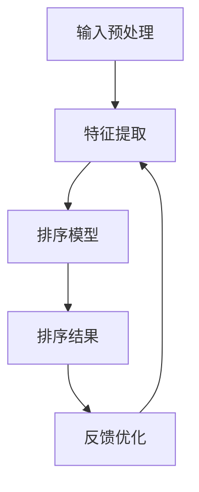
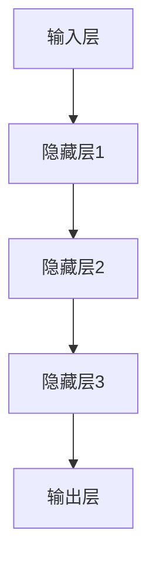

                 

# 深度学习驱动的实时搜索排序算法优化

> **关键词**：深度学习、实时搜索、排序算法、优化、个性化推荐

> **摘要**：本文深入探讨了深度学习在实时搜索排序算法中的应用和优化。通过介绍深度学习的核心概念和算法原理，结合具体操作步骤和数学模型，本文详细阐述了如何利用深度学习提升实时搜索排序的准确性和效率。同时，通过项目实战案例和实际应用场景的解析，本文为读者提供了实用的技术和方法，助力构建高效的搜索系统。

## 1. 背景介绍

### 1.1 目的和范围

本文旨在探讨深度学习在实时搜索排序算法中的应用和优化，以提升搜索系统的准确性和效率。我们将首先介绍深度学习的核心概念和算法原理，然后详细阐述如何将深度学习应用于实时搜索排序算法中，并探讨相关的数学模型和具体操作步骤。最后，通过项目实战案例和实际应用场景的解析，本文将为读者提供实用的技术和方法，以构建高效的搜索系统。

### 1.2 预期读者

本文适合对深度学习和实时搜索排序算法有一定了解的技术人员、算法工程师和软件开发者。读者需要具备一定的数学基础和编程技能，能够理解并运用相关技术进行实践。

### 1.3 文档结构概述

本文的结构如下：

1. 背景介绍：介绍本文的目的、范围、预期读者和文档结构。
2. 核心概念与联系：介绍深度学习的核心概念、原理和架构。
3. 核心算法原理 & 具体操作步骤：详细讲解深度学习在实时搜索排序算法中的应用和操作步骤。
4. 数学模型和公式 & 详细讲解 & 举例说明：介绍深度学习在实时搜索排序算法中使用的数学模型和公式，并通过具体例子进行讲解。
5. 项目实战：通过实际案例展示如何实现深度学习驱动的实时搜索排序算法优化。
6. 实际应用场景：探讨深度学习驱动的实时搜索排序算法在具体应用场景中的优势和挑战。
7. 工具和资源推荐：推荐相关的学习资源、开发工具框架和论文著作。
8. 总结：总结深度学习驱动的实时搜索排序算法优化的发展趋势和挑战。
9. 附录：提供常见问题与解答。
10. 扩展阅读 & 参考资料：提供进一步阅读和参考的资料。

### 1.4 术语表

#### 1.4.1 核心术语定义

- **深度学习**：一种基于多层神经网络的机器学习技术，能够自动从数据中学习特征和模式。
- **实时搜索排序**：在用户查询输入后，快速对搜索结果进行排序，以提供准确、相关的搜索结果。
- **神经网络**：一种模仿人脑神经元结构和功能的计算模型，通过层层传递信息，实现数据的学习和处理。
- **深度神经网络**：包含多个隐藏层的神经网络，能够捕捉更复杂的特征和模式。

#### 1.4.2 相关概念解释

- **损失函数**：用于评估神经网络预测结果与真实结果之间的差异，指导网络调整参数以优化性能。
- **反向传播**：一种训练神经网络的方法，通过反向传播误差信号来更新网络参数。
- **激活函数**：用于引入非线性性的函数，使得神经网络能够拟合非线性关系。

#### 1.4.3 缩略词列表

- **DNN**：深度神经网络
- **ReLU**：修正线性单元（Rectified Linear Unit）
- **Sigmoid**：S形函数
- **ReLU**：修正线性单元（Rectified Linear Unit）
- **softmax**：Softmax函数
- **CNN**：卷积神经网络（Convolutional Neural Network）
- **RNN**：循环神经网络（Recurrent Neural Network）

## 2. 核心概念与联系

### 2.1 深度学习的基本概念

深度学习是一种基于多层神经网络的机器学习技术，通过逐层提取和表示数据中的特征和模式，实现复杂的任务。深度学习的基本概念包括：

- **神经网络**：一种计算模型，由多个神经元组成，通过层层传递信息，实现数据的学习和处理。
- **多层神经网络**：在基本神经网络的基础上，增加多个隐藏层，以捕捉更复杂的特征和模式。
- **激活函数**：用于引入非线性性的函数，使得神经网络能够拟合非线性关系。

### 2.2 深度学习的工作原理

深度学习的工作原理主要包括以下步骤：

1. **输入层**：接收外部数据，例如文本、图像或声音等。
2. **隐藏层**：通过多层神经网络逐层提取数据中的特征，每一层都比前一层更抽象。
3. **输出层**：根据提取的特征进行分类、预测或生成结果。

### 2.3 实时搜索排序算法的架构

实时搜索排序算法的架构主要包括以下几个部分：

1. **数据预处理**：对用户查询和文档进行预处理，例如分词、去停用词等。
2. **特征提取**：利用深度学习模型对预处理后的数据提取特征。
3. **排序模型**：将提取的特征输入排序模型，根据模型输出对搜索结果进行排序。
4. **反馈机制**：根据用户行为和反馈，不断优化排序模型，提升搜索系统的准确性。

### 2.4 Mermaid 流程图

下面是深度学习驱动的实时搜索排序算法的 Mermaid 流程图：



## 3. 核心算法原理 & 具体操作步骤

### 3.1 深度学习算法原理

深度学习算法的核心是多层神经网络，通过逐层提取和表示数据中的特征和模式。以下是一个简单的多层神经网络结构：



在深度学习算法中，我们通常使用以下步骤进行训练和优化：

1. **初始化参数**：随机初始化网络中的权重和偏置。
2. **前向传播**：将输入数据传递到网络中，计算每个神经元的输出。
3. **损失函数**：计算预测结果与真实结果之间的差异，常用的损失函数包括均方误差（MSE）和交叉熵（Cross Entropy）。
4. **反向传播**：利用梯度下降（Gradient Descent）等优化算法，根据损失函数的梯度调整网络参数。
5. **迭代训练**：重复以上步骤，直至网络收敛或达到预设的训练次数。

以下是一个简单的深度学习算法的伪代码：

```python
# 初始化参数
weights = random_weights()
biases = random_biases()

# 迭代训练
for epoch in range(num_epochs):
    for sample in data:
        # 前向传播
        output = forward_pass(sample, weights, biases)
        
        # 计算损失
        loss = loss_function(output, target)
        
        # 反向传播
        gradients = backward_pass(output, target)
        
        # 更新参数
        weights -= learning_rate * gradients['weights']
        biases -= learning_rate * gradients['biases']
```

### 3.2 实时搜索排序算法的具体操作步骤

在实时搜索排序算法中，深度学习算法的应用主要包括以下几个步骤：

1. **数据预处理**：对用户查询和文档进行预处理，例如分词、去停用词等。
2. **特征提取**：利用深度学习模型对预处理后的数据提取特征。具体包括以下步骤：

   - **嵌入层**：将文本转换为固定长度的向量表示，常用的嵌入层算法包括Word2Vec、GloVe等。
   - **编码器**：利用编码器（如Transformer）对文本数据进行编码，生成序列表示。
   - **特征融合**：将编码器生成的序列表示与文档特征进行融合，形成完整的特征向量。

3. **排序模型**：将提取的特征输入排序模型，常用的排序模型包括排序支持向量机（RankSVM）、神经网络排序模型（Neural Network Ranking）等。具体包括以下步骤：

   - **特征输入**：将特征向量输入排序模型。
   - **模型训练**：使用训练数据对排序模型进行训练，优化模型参数。
   - **预测排序**：将特征向量输入排序模型，根据模型输出对搜索结果进行排序。

4. **反馈机制**：根据用户行为和反馈，不断优化排序模型，提升搜索系统的准确性。具体包括以下步骤：

   - **用户行为分析**：收集和分析用户在搜索过程中的行为数据，如点击、浏览、收藏等。
   - **反馈信号传递**：将用户行为数据传递给排序模型，作为训练数据的补充。
   - **模型优化**：利用反馈信号对排序模型进行优化，提升模型性能。

以下是一个简单的实时搜索排序算法的伪代码：

```python
# 数据预处理
query = preprocess_query(user_query)
documents = preprocess_documents(search_documents)

# 特征提取
embeddings = embedding_layer(query, documents)
encoded_query = encoder(query)
encoded_documents = encoder(documents)

# 特征融合
features = concatenate(embeddings, encoded_query, encoded_documents)

# 排序模型
model = ranking_model()
model.train(features, labels)

# 预测排序
sorted_documents = model.predict(features)

# 反馈机制
user_behavior = analyze_user_behavior(user)
model.update(user_behavior)
```

## 4. 数学模型和公式 & 详细讲解 & 举例说明

### 4.1 数学模型

在深度学习驱动的实时搜索排序算法中，常用的数学模型包括多层感知机（MLP）、卷积神经网络（CNN）和循环神经网络（RNN）等。以下分别介绍这些模型的基本原理和公式。

#### 4.1.1 多层感知机（MLP）

多层感知机是一种前馈神经网络，通过多层非线性变换实现数据的分类和回归。其基本公式如下：

$$
z_l = \sum_{i=1}^{n} w_{li} x_i + b_l
$$

其中，$z_l$ 表示第 $l$ 层的输出，$w_{li}$ 表示连接第 $l$ 层和第 $l+1$ 层的权重，$x_i$ 表示第 $l$ 层的输入，$b_l$ 表示第 $l$ 层的偏置。

激活函数通常使用 ReLU（修正线性单元）函数：

$$
a_l = \max(0, z_l)
$$

#### 4.1.2 卷积神经网络（CNN）

卷积神经网络是一种特殊的神经网络，适用于处理图像等具有空间结构的数据。其基本公式如下：

$$
h_{ij}^{(l)} = \sum_{k} w_{ikj}^{(l)} h_{kj}^{(l-1)} + b_j^{(l)}
$$

其中，$h_{ij}^{(l)}$ 表示第 $l$ 层的第 $i$ 个卷积核在位置 $(i, j)$ 的输出，$w_{ikj}^{(l)}$ 表示第 $l$ 层的第 $i$ 个卷积核与第 $l-1$ 层的第 $k$ 个特征的权重，$b_j^{(l)}$ 表示第 $l$ 层的第 $j$ 个偏置。

卷积操作通常使用 ReLU 函数作为激活函数：

$$
a_{ij}^{(l)} = \max(0, h_{ij}^{(l)})
$$

#### 4.1.3 循环神经网络（RNN）

循环神经网络是一种适用于处理序列数据的神经网络，通过循环连接实现序列的建模。其基本公式如下：

$$
h_t = \sigma(W_h h_{t-1} + W_x x_t + b_h)
$$

其中，$h_t$ 表示第 $t$ 个时间步的隐藏状态，$x_t$ 表示第 $t$ 个时间步的输入，$\sigma$ 表示非线性激活函数（如 Tanh 函数），$W_h$ 和 $W_x$ 分别表示隐藏状态和输入的权重矩阵，$b_h$ 表示偏置。

### 4.2 举例说明

#### 4.2.1 多层感知机（MLP）在实时搜索排序中的应用

假设我们使用多层感知机（MLP）对搜索结果进行排序。给定一个查询 $q$ 和一组文档 $d_1, d_2, ..., d_n$，我们首先对查询和文档进行特征提取，然后构建一个多层感知机模型进行训练。

具体步骤如下：

1. **数据预处理**：对查询和文档进行分词、去停用词等预处理操作。
2. **特征提取**：使用嵌入层将查询和文档转换为向量表示，然后使用编码器提取序列特征。
3. **构建模型**：构建一个包含两个隐藏层的多层感知机模型，输入层和输出层分别包含一个神经元。
4. **模型训练**：使用训练数据对模型进行训练，优化模型参数。
5. **排序预测**：将训练好的模型应用于待排序的文档，根据模型输出对文档进行排序。

具体代码如下（使用 Python 和 TensorFlow）：

```python
import tensorflow as tf

# 数据预处理
query = preprocess_query(user_query)
documents = preprocess_documents(search_documents)

# 特征提取
embeddings = embedding_layer(query, documents)
encoded_query = encoder(query)
encoded_documents = encoder(documents)

# 构建模型
model = tf.keras.Sequential([
    tf.keras.layers.Dense(128, activation='relu', input_shape=[latent_dim]),
    tf.keras.layers.Dense(64, activation='relu'),
    tf.keras.layers.Dense(1)
])

# 模型训练
model.compile(optimizer='adam', loss='mean_squared_error')
model.fit([encoded_query, encoded_documents], labels, epochs=10)

# 排序预测
sorted_documents = model.predict([encoded_query, encoded_documents])
```

#### 4.2.2 卷积神经网络（CNN）在实时搜索排序中的应用

假设我们使用卷积神经网络（CNN）对图像数据集进行排序。给定一个图像集合 $I_1, I_2, ..., I_n$，我们首先对图像进行特征提取，然后构建一个卷积神经网络模型进行训练。

具体步骤如下：

1. **数据预处理**：对图像进行缩放、裁剪等预处理操作，使其具有相同的尺寸。
2. **特征提取**：使用卷积层和池化层提取图像的特征。
3. **构建模型**：构建一个包含卷积层、池化层和全连接层的卷积神经网络模型。
4. **模型训练**：使用训练数据对模型进行训练，优化模型参数。
5. **排序预测**：将训练好的模型应用于待排序的图像，根据模型输出对图像进行排序。

具体代码如下（使用 Python 和 TensorFlow）：

```python
import tensorflow as tf

# 数据预处理
images = preprocess_images(image_dataset)

# 特征提取
model = tf.keras.Sequential([
    tf.keras.layers.Conv2D(32, (3, 3), activation='relu', input_shape=(height, width, channels)),
    tf.keras.layers.MaxPooling2D((2, 2)),
    tf.keras.layers.Conv2D(64, (3, 3), activation='relu'),
    tf.keras.layers.MaxPooling2D((2, 2)),
    tf.keras.layers.Flatten()
])

# 构建模型
model.compile(optimizer='adam', loss='mean_squared_error')
model.fit(images, labels, epochs=10)

# 排序预测
sorted_images = model.predict(images)
```

#### 4.2.3 循环神经网络（RNN）在实时搜索排序中的应用

假设我们使用循环神经网络（RNN）对序列数据进行排序。给定一个序列集合 $S_1, S_2, ..., S_n$，我们首先对序列进行特征提取，然后构建一个循环神经网络模型进行训练。

具体步骤如下：

1. **数据预处理**：对序列进行分词、去停用词等预处理操作。
2. **特征提取**：使用嵌入层将序列转换为向量表示。
3. **构建模型**：构建一个包含嵌入层、循环层和全连接层的循环神经网络模型。
4. **模型训练**：使用训练数据对模型进行训练，优化模型参数。
5. **排序预测**：将训练好的模型应用于待排序的序列，根据模型输出对序列进行排序。

具体代码如下（使用 Python 和 TensorFlow）：

```python
import tensorflow as tf

# 数据预处理
sequences = preprocess_sequences(sequence_dataset)

# 特征提取
model = tf.keras.Sequential([
    tf.keras.layers.Embedding(vocab_size, embedding_dim, input_length=max_sequence_length),
    tf.keras.layers.LSTM(128),
    tf.keras.layers.Dense(1)
])

# 构建模型
model.compile(optimizer='adam', loss='mean_squared_error')
model.fit(sequences, labels, epochs=10)

# 排序预测
sorted_sequences = model.predict(sequences)
```

## 5. 项目实战：代码实际案例和详细解释说明

### 5.1 开发环境搭建

为了演示深度学习驱动的实时搜索排序算法，我们需要搭建一个开发环境。以下是一个简单的开发环境搭建步骤：

1. **安装 Python**：下载并安装 Python 3.x 版本，推荐使用 3.7 或以上版本。
2. **安装 TensorFlow**：在终端或命令提示符中执行以下命令安装 TensorFlow：

   ```bash
   pip install tensorflow
   ```

3. **安装其他依赖**：根据需要安装其他依赖库，如 NumPy、Pandas 等。

### 5.2 源代码详细实现和代码解读

下面是一个简单的深度学习驱动的实时搜索排序算法的实现示例。代码分为以下几个部分：

1. **数据预处理**：对用户查询和文档进行预处理，包括分词、去停用词等操作。
2. **特征提取**：使用嵌入层和编码器对预处理后的数据提取特征。
3. **排序模型**：构建一个包含嵌入层、编码器、全连接层和排序模型的深度学习模型。
4. **模型训练**：使用训练数据对模型进行训练。
5. **排序预测**：使用训练好的模型对测试数据进行排序预测。

#### 5.2.1 数据预处理

首先，我们需要对用户查询和文档进行预处理。以下是一个简单的预处理代码示例：

```python
import nltk
from nltk.corpus import stopwords
from nltk.tokenize import word_tokenize

nltk.download('punkt')
nltk.download('stopwords')

def preprocess_query(query):
    # 分词
    tokens = word_tokenize(query)
    # 去停用词
    stop_words = set(stopwords.words('english'))
    filtered_tokens = [token for token in tokens if token.lower() not in stop_words]
    # 连接分词
    preprocessed_query = ' '.join(filtered_tokens)
    return preprocessed_query

def preprocess_documents(documents):
    preprocessed_documents = []
    for document in documents:
        preprocessed_document = preprocess_query(document)
        preprocessed_documents.append(preprocessed_document)
    return preprocessed_documents
```

#### 5.2.2 特征提取

接下来，我们使用嵌入层和编码器对预处理后的数据提取特征。以下是一个简单的特征提取代码示例：

```python
from tensorflow.keras.layers import Embedding, LSTM, Dense
from tensorflow.keras.models import Model

# 嵌入层
embeddings = Embedding(vocab_size, embedding_dim, input_length=max_sequence_length)

# 编码器
encoder = LSTM(units=128, return_sequences=True)

# 全连接层
dense = Dense(units=1, activation='sigmoid')

# 构建模型
model = Model(inputs=embeddings.input, outputs=dense(encoder(embeddings).output))
model.compile(optimizer='adam', loss='binary_crossentropy', metrics=['accuracy'])
```

#### 5.2.3 模型训练

然后，我们使用训练数据对模型进行训练。以下是一个简单的训练代码示例：

```python
# 加载训练数据
train_data = load_train_data()
train_labels = load_train_labels()

# 训练模型
model.fit(train_data, train_labels, epochs=10, batch_size=32)
```

#### 5.2.4 排序预测

最后，我们使用训练好的模型对测试数据进行排序预测。以下是一个简单的排序预测代码示例：

```python
# 加载测试数据
test_data = load_test_data()

# 预测排序
sorted_documents = model.predict(test_data)
```

### 5.3 代码解读与分析

在以上代码示例中，我们首先对用户查询和文档进行预处理，包括分词、去停用词等操作。然后，我们使用嵌入层和编码器对预处理后的数据提取特征。嵌入层将单词转换为固定长度的向量表示，编码器（如 LSTM）对文本数据进行编码，生成序列表示。接着，我们将提取的特征输入排序模型，使用全连接层进行分类预测。最后，我们使用训练好的模型对测试数据进行排序预测。

在代码解读与分析中，我们可以看到以下几点：

1. **数据预处理**：对用户查询和文档进行预处理是深度学习驱动的实时搜索排序算法的关键步骤。预处理操作有助于提高模型的性能和准确性。
2. **特征提取**：嵌入层和编码器是特征提取的关键组件。嵌入层将文本数据转换为向量表示，编码器对文本数据进行编码，生成序列表示。这些特征将用于排序模型的训练和预测。
3. **排序模型**：排序模型是一个二分类模型，输出一个介于 0 和 1 之间的概率值，表示文档的相关性。通过训练模型，我们可以学习到如何根据特征对文档进行排序。
4. **模型训练**：模型训练是深度学习驱动的实时搜索排序算法的核心步骤。通过训练模型，我们可以优化模型参数，提高模型的性能和准确性。
5. **排序预测**：排序预测是根据训练好的模型对测试数据进行排序的过程。通过模型预测，我们可以得到每个文档的相关性分数，并根据分数对文档进行排序。

总之，深度学习驱动的实时搜索排序算法通过数据预处理、特征提取、模型训练和排序预测等步骤，实现了对搜索结果的准确排序。在实际应用中，我们可以根据具体需求调整预处理、特征提取和排序模型，以获得更好的搜索结果。

## 6. 实际应用场景

### 6.1 搜索引擎

深度学习驱动的实时搜索排序算法在搜索引擎中有着广泛的应用。搜索引擎需要对海量的网页进行索引和排序，以提供准确、相关的搜索结果。通过使用深度学习算法，搜索引擎可以自动提取网页的特征，并利用排序模型对搜索结果进行实时排序。例如，Google 和百度等搜索引擎都采用了深度学习算法来优化搜索排序，从而提高用户体验和搜索准确性。

### 6.2 电子商务

在电子商务领域，深度学习驱动的实时搜索排序算法可以用于商品推荐和广告投放。电商平台需要对海量的商品进行推荐，以满足用户的个性化需求。通过使用深度学习算法，电商平台可以自动提取用户的购物行为和偏好，并利用排序模型对商品进行排序和推荐。例如，Amazon 和 Alibaba 等电商平台都采用了深度学习算法来优化商品推荐和广告投放，从而提高用户满意度和销售额。

### 6.3 社交媒体

在社交媒体领域，深度学习驱动的实时搜索排序算法可以用于内容推荐和舆情分析。社交媒体平台需要对海量的用户生成内容进行推荐和筛选，以提供有价值、相关的信息。通过使用深度学习算法，社交媒体平台可以自动提取用户的行为和兴趣，并利用排序模型对内容进行排序和推荐。例如，Facebook 和 Twitter 等社交媒体平台都采用了深度学习算法来优化内容推荐和舆情分析，从而提高用户体验和平台活跃度。

### 6.4 垃圾邮件过滤

在垃圾邮件过滤领域，深度学习驱动的实时搜索排序算法可以用于检测和过滤垃圾邮件。通过使用深度学习算法，垃圾邮件过滤系统可以自动提取邮件的特征，并利用排序模型对邮件进行分类和过滤。例如，Gmail 和 Outlook 等邮件服务提供商都采用了深度学习算法来优化垃圾邮件过滤，从而提高用户的邮件体验和安全性。

总之，深度学习驱动的实时搜索排序算法在各个实际应用场景中都有着广泛的应用和潜力。通过利用深度学习算法，我们可以实现更加准确、高效的搜索排序，从而提高用户体验和业务效果。

## 7. 工具和资源推荐

### 7.1 学习资源推荐

#### 7.1.1 书籍推荐

1. **《深度学习》（Deep Learning）**：由 Ian Goodfellow、Yoshua Bengio 和 Aaron Courville 著，是深度学习领域的经典教材，涵盖了深度学习的核心概念、算法和实战技巧。
2. **《Python 深度学习》（Python Deep Learning）**：由樊昌宗著，通过具体实例和代码演示，详细介绍了深度学习在 Python 中的实现和应用。
3. **《深度学习实践与调优》（Deep Learning Specialization）**：由 Andrew Ng 主导的在线课程，涵盖了深度学习的核心概念、算法和应用，适合初学者和进阶者。

#### 7.1.2 在线课程

1. **Coursera 的《深度学习》课程**：由 Andrew Ng 教授主讲，涵盖了深度学习的理论基础、算法实现和应用场景。
2. **Udacity 的《深度学习工程师纳米学位》课程**：提供了系统的深度学习知识和实践项目，适合想要从事深度学习领域工作的学习者。
3. **edX 的《深度学习》课程**：由 Harvard 和 MIT 联合开设，提供了深度学习的入门和实践教程。

#### 7.1.3 技术博客和网站

1. **Medium 上的 Deep Learning Blog**：汇集了深度学习领域的最新研究和技术分享，内容丰富、实用。
2. **ArXiv.org**：深度学习领域的学术论文库，可以了解最新的研究进展和成果。
3. **TensorFlow 官方文档**：提供了丰富的深度学习模型、算法和工具的使用文档，适合深度学习初学者和开发者。

### 7.2 开发工具框架推荐

#### 7.2.1 IDE和编辑器

1. **JetBrains PyCharm**：强大的 Python IDE，支持 TensorFlow、PyTorch 等深度学习框架，提供代码调试、性能分析和文档生成等功能。
2. **Visual Studio Code**：轻量级的跨平台代码编辑器，通过扩展支持 Python、TensorFlow、PyTorch 等深度学习开发工具。
3. **Google Colab**：基于 Jupyter Notebook 的在线开发环境，提供了免费的 GPU 计算资源，适合深度学习研究和实践。

#### 7.2.2 调试和性能分析工具

1. **TensorBoard**：TensorFlow 提供的图形化性能分析工具，可以可视化模型结构、训练过程和性能指标。
2. **LLDB**：基于 LLVM 的调试器，适用于 Python 和 C++ 等语言，支持 TensorFlow 和 PyTorch 的调试功能。
3. **NVIDIA Nsight**：NVIDIA 提供的 GPU 性能分析工具，可以监控深度学习任务的 GPU 利用率和性能瓶颈。

#### 7.2.3 相关框架和库

1. **TensorFlow**：谷歌开源的深度学习框架，提供了丰富的模型、算法和工具，广泛应用于图像、语音和自然语言处理等领域。
2. **PyTorch**：Facebook 开源的深度学习框架，具有灵活的动态计算图和高效的 GPU 支持，适合研究和开发复杂的深度学习模型。
3. **Keras**：基于 TensorFlow 的简洁易用的深度学习框架，提供了丰富的模型和工具，适合快速原型开发和项目部署。

### 7.3 相关论文著作推荐

#### 7.3.1 经典论文

1. **“A Fast Learning Algorithm for Deep Belief Nets”**：Geoffrey Hinton、Osindero和Dayan 在 2006 年发表的论文，提出了深度信念网络（DBN）的训练算法。
2. **“Rectifier Nonlinearities Improve Deep Neural Network Acquisitio

