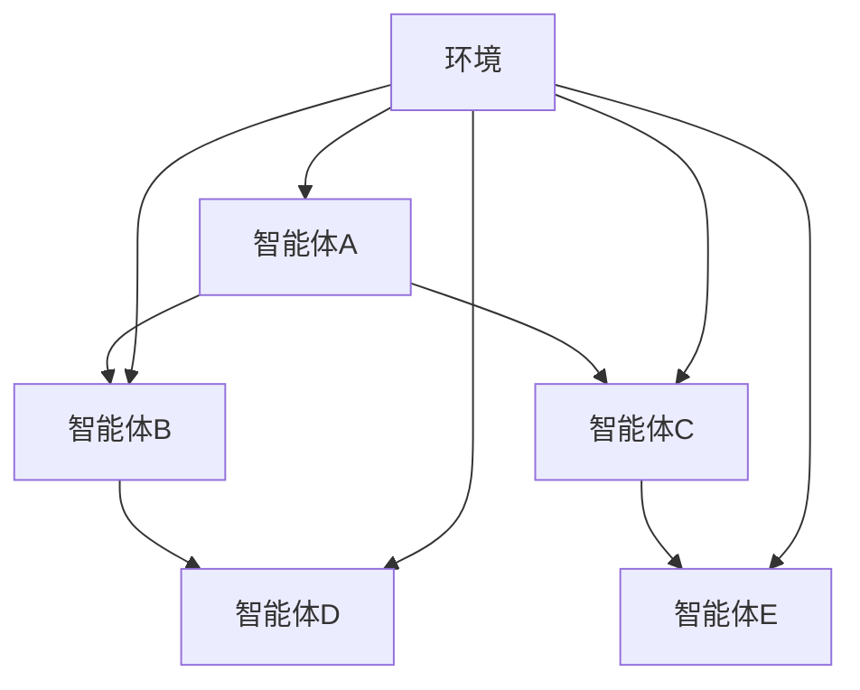
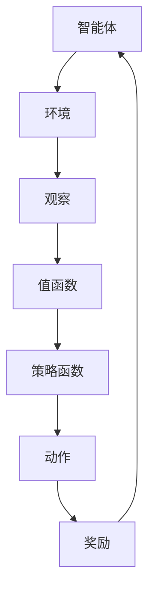
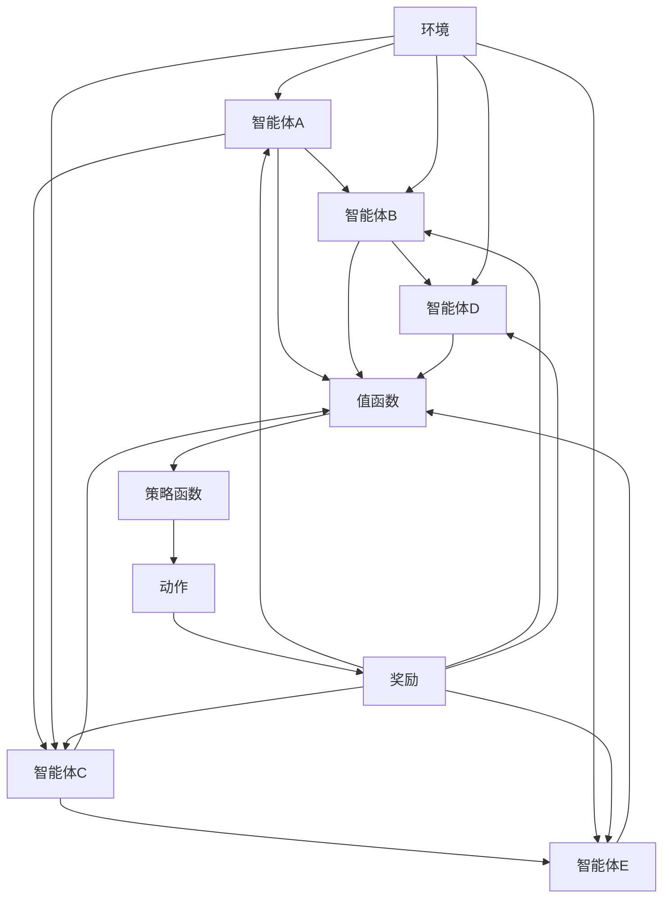

                 

# 深度强化学习在多智能体系统中的应用

> **关键词：** 深度强化学习、多智能体系统、分布式学习、协同策略、智能优化、资源分配

> **摘要：** 本文旨在深入探讨深度强化学习在多智能体系统中的应用。文章首先介绍了多智能体系统的基本概念和挑战，然后详细阐述了深度强化学习的核心原理和算法，并逐步演示了其在多智能体协同策略、智能优化和资源分配等领域的实际应用。最后，文章总结了当前的研究进展和未来发展趋势，为相关领域的研究者和工程师提供了一些实用的建议和方向。

## 1. 背景介绍

### 1.1 目的和范围

本文的目标是探讨深度强化学习在多智能体系统中的应用，帮助读者了解这一前沿技术在实际场景中的表现和潜力。本文将涵盖以下几个主要方面：

1. **多智能体系统的基本概念和挑战**：介绍多智能体系统的定义、特点和应用场景，分析其在分布式学习、协同策略和资源分配等方面的挑战。
2. **深度强化学习的核心原理和算法**：详细阐述深度强化学习的基本原理和算法框架，包括值函数、策略优化、探索与利用等核心概念。
3. **深度强化学习在多智能体系统中的应用**：分析深度强化学习在多智能体协同策略、智能优化和资源分配等领域的实际应用案例，探讨其优势和应用前景。
4. **研究进展和未来发展趋势**：总结当前的研究成果和未来发展趋势，为相关领域的研究者和工程师提供一些实用的建议和方向。

### 1.2 预期读者

本文的预期读者包括：

1. 对多智能体系统和深度强化学习有一定了解的读者，希望深入了解其在实际应用中的表现和潜力。
2. 从事人工智能、机器学习、计算机科学等领域的研究人员和技术工程师，希望了解深度强化学习在多智能体系统中的应用场景和解决方案。
3. 对智能优化和资源分配等领域感兴趣的读者，希望了解深度强化学习在这些领域中的应用。

### 1.3 文档结构概述

本文的结构如下：

1. **第1章：背景介绍**：介绍本文的目的、范围、预期读者以及文档结构。
2. **第2章：核心概念与联系**：介绍多智能体系统和深度强化学习的基本概念和联系，并给出相关流程图。
3. **第3章：核心算法原理 & 具体操作步骤**：详细阐述深度强化学习的核心算法原理和操作步骤。
4. **第4章：数学模型和公式 & 详细讲解 & 举例说明**：介绍深度强化学习中的数学模型和公式，并给出具体举例。
5. **第5章：项目实战：代码实际案例和详细解释说明**：通过实际项目案例，展示深度强化学习在多智能体系统中的应用。
6. **第6章：实际应用场景**：分析深度强化学习在多智能体系统中的应用场景和解决方案。
7. **第7章：工具和资源推荐**：推荐相关的学习资源、开发工具和框架。
8. **第8章：总结：未来发展趋势与挑战**：总结本文的核心观点，探讨未来发展趋势和挑战。
9. **第9章：附录：常见问题与解答**：解答读者可能遇到的一些常见问题。
10. **第10章：扩展阅读 & 参考资料**：提供本文相关的扩展阅读和参考资料。

### 1.4 术语表

#### 1.4.1 核心术语定义

- **多智能体系统**：由多个智能体组成的系统，智能体可以通过自主决策和行动，实现特定目标。
- **深度强化学习**：结合深度学习和强化学习的方法，用于解决连续动作空间的决策问题。
- **分布式学习**：通过分布式计算和通信技术，将学习过程分散到多个智能体上，实现高效的学习和优化。
- **协同策略**：多个智能体通过共同决策，实现整体协同行动，最大化系统性能。
- **智能优化**：利用人工智能技术，对系统中的资源进行优化分配，提高整体性能。
- **资源分配**：在多智能体系统中，对有限资源进行合理分配，以满足智能体的需求。

#### 1.4.2 相关概念解释

- **值函数**：在强化学习中，用于评估当前状态的价值，指导智能体的决策。
- **策略**：在强化学习中，用于决定智能体在特定状态下采取的动作。
- **探索与利用**：在强化学习中，探索指智能体尝试新的动作，利用指智能体在已有经验的基础上进行决策。
- **分布式计算**：通过多个计算节点，协同完成大规模计算任务。
- **通信协议**：智能体之间进行通信和协作的规则和标准。

#### 1.4.3 缩略词列表

- **DRL**：深度强化学习
- **MAS**：多智能体系统
- **RL**：强化学习
- **CNN**：卷积神经网络
- **RNN**：循环神经网络
- **GNN**：图神经网络

## 2. 核心概念与联系

### 2.1 多智能体系统

多智能体系统（MAS）是由多个自主智能体组成的系统，这些智能体可以相互协作或竞争，共同实现特定目标。多智能体系统具有以下特点：

1. **自治性**：智能体具有独立决策和行动的能力。
2. **交互性**：智能体之间可以相互通信和协作。
3. **分布式**：智能体分布在不同地理位置或计算节点上。
4. **动态性**：智能体和系统环境都可能发生变化。
5. **协同性**：多个智能体共同协作，实现整体性能优化。

多智能体系统在许多领域有广泛的应用，如无人驾驶、智能交通、无人机编队、智能电网等。以下是一个简化的多智能体系统结构图：



### 2.2 深度强化学习

深度强化学习（DRL）是结合深度学习和强化学习的方法，用于解决连续动作空间的决策问题。DRL的核心概念包括：

1. **值函数**：用于评估当前状态的价值，指导智能体的决策。
2. **策略**：用于决定智能体在特定状态下采取的动作。
3. **探索与利用**：在强化学习中，探索指智能体尝试新的动作，利用指智能体在已有经验的基础上进行决策。

DRL通过神经网络（如卷积神经网络、循环神经网络、图神经网络等）来近似值函数和策略函数，从而实现高效的学习和决策。以下是一个简化的DRL结构图：



### 2.3 多智能体系统与深度强化学习的联系

多智能体系统与深度强化学习之间的联系在于，深度强化学习可以作为多智能体系统的决策基础，实现智能体的自主决策和协同行动。以下是一个简化的多智能体系统与深度强化学习的联系图：



通过上述联系图，我们可以看到，多智能体系统中的每个智能体都可以使用深度强化学习来近似其值函数和策略函数，实现自主决策和协同行动。这为多智能体系统的研究和应用提供了新的思路和方法。

## 3. 核心算法原理 & 具体操作步骤

### 3.1 深度强化学习算法原理

深度强化学习（DRL）结合了深度学习和强化学习的优势，用于解决复杂决策问题。DRL的基本原理包括以下几个关键组成部分：

1. **状态（State）**：智能体感知到的环境信息。
2. **动作（Action）**：智能体在特定状态下采取的动作。
3. **策略（Policy）**：智能体在特定状态下选择动作的规则。
4. **值函数（Value Function）**：评估当前状态的价值，用于指导智能体的决策。
5. **模型（Model）**：用于预测未来状态和奖励的函数。
6. **奖励（Reward）**：智能体在执行动作后获得的奖励，用于评估动作的效果。

DRL通过不断更新值函数和策略函数，以最大化累积奖励。其基本流程如下：

1. **初始化**：设定初始状态、策略函数和值函数。
2. **执行动作**：根据当前策略函数选择动作。
3. **感知状态**：智能体执行动作后，感知新的状态。
4. **更新值函数**：根据新状态和获得的奖励，更新值函数。
5. **更新策略函数**：根据新值函数，更新策略函数。
6. **重复执行**：重复上述过程，直到达到终止条件。

### 3.2 深度强化学习算法具体操作步骤

以下是一个简化的DRL算法具体操作步骤：

1. **初始化**：

   - 设定智能体初始状态 \( s_0 \)。
   - 设定策略函数 \( \pi(s_0) \) 和值函数 \( V(s_0) \)。
   - 初始化经验池。

2. **执行动作**：

   - 根据当前策略函数 \( \pi(s) \) 选择动作 \( a \)。
   - 执行动作 \( a \)，感知新的状态 \( s' \)。
   - 获得奖励 \( r \)。

3. **更新值函数**：

   - 根据新的状态 \( s' \) 和获得的奖励 \( r \)，更新值函数：
     \[
     V(s) \leftarrow V(s) + \alpha [r + \gamma \max_{a'} V(s') - V(s)]
     \]
   其中，\( \alpha \) 为学习率，\( \gamma \) 为折扣因子。

4. **更新策略函数**：

   - 根据更新后的值函数 \( V(s') \)，更新策略函数：
     \[
     \pi(s') \leftarrow \pi(s') + \beta [V(s') - \pi(s')]
     \]
   其中，\( \beta \) 为策略更新率。

5. **重复执行**：

   - 重复执行步骤2至步骤4，直到达到终止条件（如达到指定步数或目标状态）。

### 3.3 伪代码示例

以下是一个简单的DRL算法伪代码示例：

```python
# 初始化
s = 初始状态
V = 初始化值函数
π = 初始化策略函数
经验池 = 空经验池

# 迭代
for 步数 in 1 到 终止步数：
    a = π(s)
    s', r = 环境执行动作(a)
    
    # 更新值函数
    V(s) = V(s) + α[r + γmax_a'V(s') - V(s)]
    
    # 更新策略函数
    π(s') = π(s') + β[V(s') - π(s')]
    
    # 存储经验
    经验池.append((s, a, r, s'))
    
    # 更新状态
    s = s'
```

通过上述算法和步骤，智能体可以在不断学习和优化的过程中，逐步提高其在多智能体系统中的表现。接下来，我们将进一步探讨深度强化学习在多智能体系统中的应用。

## 4. 数学模型和公式 & 详细讲解 & 举例说明

### 4.1 数学模型和公式

在深度强化学习（DRL）中，核心的数学模型和公式包括值函数（Value Function）和策略函数（Policy Function）。以下是对这些模型和公式的详细讲解。

#### 4.1.1 值函数（Value Function）

值函数用于评估智能体在特定状态下的期望收益。在DRL中，常用的值函数有两种：状态值函数（State-Value Function）和动作值函数（Action-Value Function）。

1. **状态值函数（V\_s）**：

   \[
   V\_s(s) = \sum_{a} \pi(a|s) \cdot Q\_s(a)
   \]

   其中，\( V\_s(s) \) 表示智能体在状态 \( s \) 的期望收益，\( \pi(a|s) \) 表示在状态 \( s \) 下采取动作 \( a \) 的概率，\( Q\_s(a) \) 表示在状态 \( s \) 下采取动作 \( a \) 的期望收益。

2. **动作值函数（Q\_s(a)）**：

   \[
   Q\_s(a) = \sum_{s'} p(s'|s, a) \cdot (r(s', a) + \gamma \max_{a'} Q\_s'(a')
   \]

   其中，\( Q\_s(a) \) 表示在状态 \( s \) 下采取动作 \( a \) 的期望收益，\( p(s'|s, a) \) 表示在状态 \( s \) 下采取动作 \( a \) 后转移到状态 \( s' \) 的概率，\( r(s', a) \) 表示在状态 \( s' \) 下采取动作 \( a \) 后获得的奖励，\( \gamma \) 为折扣因子。

#### 4.1.2 策略函数（Policy Function）

策略函数用于决定智能体在特定状态下应该采取的动作。在DRL中，常用的策略函数有两种：确定性策略函数（Deterministic Policy Function）和概率性策略函数（Stochastic Policy Function）。

1. **确定性策略函数（π\_d）**：

   \[
   π\_d(s) = \arg\max_{a} Q\_s(a)
   \]

   其中，\( π\_d(s) \) 表示在状态 \( s \) 下应该采取的动作，\( Q\_s(a) \) 表示在状态 \( s \) 下采取动作 \( a \) 的期望收益。

2. **概率性策略函数（π\_s）**：

   \[
   π\_s(s) = \frac{\exp(\alpha \cdot Q\_s(a))}{\sum_{a'} \exp(\alpha \cdot Q\_s(a'))}
   \]

   其中，\( π\_s(s) \) 表示在状态 \( s \) 下采取动作 \( a \) 的概率，\( \alpha \) 为温度参数。

#### 4.1.3 更新公式

在DRL中，值函数和策略函数的更新是核心过程。以下为详细的更新公式。

1. **值函数更新**：

   - **蒙特卡罗更新**：

     \[
     V(s) \leftarrow V(s) + α[V(s) - r]
     \]

     其中，\( α \) 为学习率，\( r \) 为奖励。

   - **时序差分更新**：

     \[
     V(s) \leftarrow V(s) + α[V(s) - r - \gamma V(s')]
     \]

     其中，\( \gamma \) 为折扣因子，\( s' \) 为下一状态。

2. **策略函数更新**：

   - **贪婪更新**：

     \[
     π(s) \leftarrow \arg\max_{a} Q\_s(a)
     \]

   - **软更新**：

     \[
     π(s) \leftarrow π(s) + β[Q\_s(a) - π(s)]
     \]

     其中，\( β \) 为更新率。

### 4.2 举例说明

#### 4.2.1 状态值函数举例

假设一个智能体在状态 \( s \) 下有四个可能动作：\( a_1, a_2, a_3, a_4 \)。策略函数 \( \pi \) 如下：

| 动作   | 概率     |
|--------|----------|
| \( a_1 \) | 0.2      |
| \( a_2 \) | 0.3      |
| \( a_3 \) | 0.2      |
| \( a_4 \) | 0.3      |

动作值函数 \( Q(s) \) 如下：

| 动作   | 值     |
|--------|--------|
| \( a_1 \) | 2.0    |
| \( a_2 \) | 3.0    |
| \( a_3 \) | 1.0    |
| \( a_4 \) | 2.5    |

根据状态值函数公式，状态值函数 \( V(s) \) 为：

\[
V(s) = \pi(a_1) \cdot Q(a_1) + \pi(a_2) \cdot Q(a_2) + \pi(a_3) \cdot Q(a_3) + \pi(a_4) \cdot Q(a_4)
\]

\[
V(s) = 0.2 \cdot 2.0 + 0.3 \cdot 3.0 + 0.2 \cdot 1.0 + 0.3 \cdot 2.5 = 2.0 + 0.9 + 0.2 + 0.75 = 3.85
\]

#### 4.2.2 策略函数举例

假设一个智能体在状态 \( s \) 下有两个可能动作：\( a_1 \) 和 \( a_2 \)。动作值函数 \( Q(s) \) 如下：

| 动作   | 值     |
|--------|--------|
| \( a_1 \) | 2.0    |
| \( a_2 \) | 1.5    |

根据确定性策略函数公式，策略函数 \( π(s) \) 为：

\[
π(s) = \arg\max_{a} Q(s, a)
\]

\[
π(s) = \arg\max_{a} (2.0, 1.5) = a_1
\]

即，在状态 \( s \) 下，智能体应该采取动作 \( a_1 \)。

通过上述例子，我们可以更好地理解DRL中的数学模型和公式。在实际应用中，这些模型和公式可以帮助我们更好地优化智能体的行为，实现多智能体系统的协同和优化。

### 4.3 实际应用中的调整和优化

在实际应用中，为了提高DRL在多智能体系统中的性能，我们可以对数学模型和公式进行以下调整和优化：

1. **自适应调整学习率（α）和折扣因子（γ）**：根据智能体的学习情况和系统环境的变化，自适应调整学习率和折扣因子，以优化智能体的学习效果。
2. **引入探索策略**：为了防止智能体过度依赖已有经验，可以引入探索策略，如ε-贪婪策略、UCB策略等，以平衡探索与利用。
3. **分布式学习**：利用分布式计算和通信技术，将学习过程分散到多个智能体上，提高学习效率和鲁棒性。
4. **多任务学习**：通过多任务学习，智能体可以同时处理多个任务，提高系统的灵活性和适应性。

通过这些调整和优化，我们可以更好地发挥DRL在多智能体系统中的应用潜力，实现智能体的自主决策和协同行动。

## 5. 项目实战：代码实际案例和详细解释说明

### 5.1 开发环境搭建

在本文的实战项目中，我们将使用Python编程语言和TensorFlow库来搭建深度强化学习模型。以下为开发环境的搭建步骤：

1. **安装Python**：确保Python版本在3.6及以上，可以从[Python官方网站](https://www.python.org/downloads/)下载并安装。
2. **安装TensorFlow**：通过pip命令安装TensorFlow库，命令如下：

   ```bash
   pip install tensorflow
   ```

3. **安装其他依赖库**：根据项目需求，可能还需要安装其他依赖库，如NumPy、Pandas等，可以使用以下命令安装：

   ```bash
   pip install numpy pandas matplotlib
   ```

### 5.2 源代码详细实现和代码解读

以下为本文实战项目的源代码，我们将分步骤进行详细解释。

```python
import numpy as np
import tensorflow as tf
from tensorflow.keras.models import Sequential
from tensorflow.keras.layers import Dense

# 定义环境
class Environment:
    def __init__(self, n_agents, state_size, action_size):
        self.n_agents = n_agents
        self.state_size = state_size
        self.action_size = action_size
        self.observation = np.random.rand(n_agents, state_size)
    
    def step(self, actions):
        # 环境更新逻辑
        # 根据动作计算新状态和奖励
        # ...

# 定义深度强化学习模型
class DRLModel:
    def __init__(self, state_size, action_size, hidden_units=64):
        self.state_size = state_size
        self.action_size = action_size
        self.hidden_units = hidden_units
        
        # 值函数模型
        self.value_model = self._build_value_model()
        # 动作值函数模型
        self.action_value_model = self._build_action_value_model()
        
    def _build_value_model(self):
        model = Sequential()
        model.add(Dense(self.hidden_units, input_dim=self.state_size, activation='relu'))
        model.add(Dense(self.hidden_units, activation='relu'))
        model.add(Dense(1, activation='linear'))
        model.compile(loss='mse', optimizer='adam')
        return model
    
    def _build_action_value_model(self):
        model = Sequential()
        model.add(Dense(self.hidden_units, input_dim=self.state_size, activation='relu'))
        model.add(Dense(self.hidden_units, activation='relu'))
        model.add(Dense(self.action_size, activation='linear'))
        model.compile(loss='mse', optimizer='adam')
        return model
    
    def predict_value(self, state):
        return self.value_model.predict(state)[0]

    def predict_action_value(self, state, action):
        return self.action_value_model.predict(np.hstack([state, action]))[0]

# 训练深度强化学习模型
def train_drl_model(env, model, episodes, alpha=0.1, gamma=0.99):
    for episode in range(episodes):
        state = env.observation
        done = False
        
        while not done:
            action = model.predict_action_value(state)
            next_state, reward = env.step(action)
            
            # 更新值函数
            value = model.predict_value(next_state)
            target_value = reward + (1 - int(done)) * gamma * value
            
            # 更新动作值函数
            action_value = model.predict_action_value(state, action)
            model.action_value_model.fit(state, action_value + alpha * (target_value - action_value), epochs=1, verbose=0)
            
            state = next_state
            if done:
                break

# 运行项目
if __name__ == '__main__':
    n_agents = 2
    state_size = 4
    action_size = 2
    env = Environment(n_agents, state_size, action_size)
    model = DRLModel(state_size, action_size)
    train_drl_model(env, model, episodes=100)
```

### 5.3 代码解读与分析

1. **环境（Environment）类**：

   - 初始化：定义环境的参数，如智能体数量、状态大小和动作大小。
   - step() 方法：根据动作更新状态和奖励。

2. **深度强化学习模型（DRLModel）类**：

   - 初始化：定义模型参数，如状态大小、动作大小和隐藏层单元数。
   - _build_value_model() 方法：构建值函数模型。
   - _build_action_value_model() 方法：构建动作值函数模型。
   - predict_value() 方法：预测值函数。
   - predict_action_value() 方法：预测动作值函数。

3. **训练深度强化学习模型（train_drl_model）函数**：

   - 遍历每个episode，对环境进行step操作。
   - 根据动作和状态更新动作值函数。
   - 使用时序差分更新值函数。

4. **运行项目**：

   - 创建环境。
   - 创建深度强化学习模型。
   - 调用训练函数训练模型。

通过上述代码，我们可以实现一个简单的多智能体系统，并使用深度强化学习模型对其进行训练。在实际应用中，可以根据具体需求调整环境、模型和训练参数，以实现更好的效果。

### 5.4 优化与改进

为了提高DRL在多智能体系统中的应用效果，可以从以下几个方面进行优化和改进：

1. **引入探索策略**：为了防止智能体过度依赖已有经验，可以引入探索策略，如ε-贪婪策略、UCB策略等，以平衡探索与利用。
2. **分布式学习**：利用分布式计算和通信技术，将学习过程分散到多个智能体上，提高学习效率和鲁棒性。
3. **多任务学习**：通过多任务学习，智能体可以同时处理多个任务，提高系统的灵活性和适应性。
4. **调整模型结构**：根据具体应用场景，可以调整模型结构，如增加隐藏层单元数、调整激活函数等，以提高模型的性能。
5. **数据预处理**：对输入数据进行预处理，如归一化、标准化等，以减少模型训练过程中的噪声和干扰。

通过这些优化和改进，我们可以更好地发挥DRL在多智能体系统中的应用潜力，实现智能体的自主决策和协同行动。

## 6. 实际应用场景

### 6.1 智能交通系统

智能交通系统（ITS）是深度强化学习在多智能体系统中的一个典型应用场景。在智能交通系统中，多个智能体（如车辆、行人、交通信号灯等）需要协同工作，实现交通流的优化、事故预防、拥堵缓解等目标。以下为深度强化学习在智能交通系统中的实际应用：

1. **交通信号灯优化**：通过深度强化学习，智能交通系统可以动态调整交通信号灯的时间设置，以实现交通流的最优化。例如，可以使用Q-learning算法，将交通信号灯的开关状态作为动作，将交通流量作为状态，通过迭代更新策略函数，实现交通信号灯的智能控制。

2. **车辆路径规划**：在无人驾驶场景中，车辆需要根据实时交通状况和道路信息，自主规划行驶路径。通过深度强化学习，车辆可以学习到最优路径选择策略。例如，可以使用深度Q网络（DQN）算法，将车辆的位置和速度作为状态，将行驶路径作为动作，通过不断更新动作值函数，实现车辆的智能路径规划。

3. **行人导航**：在智能交通系统中，行人也需要自主导航，避开拥堵和危险区域。通过深度强化学习，行人可以根据周围环境信息，学习到最优的行走策略。例如，可以使用深度强化学习算法，将行人的位置和周围行人密度作为状态，将行走方向作为动作，通过迭代更新策略函数，实现行人的智能导航。

### 6.2 无人机编队飞行

无人机编队飞行是另一个典型的深度强化学习应用场景。在无人机编队飞行中，多个无人机需要协同工作，实现编队队形的保持、任务分配和协同控制。以下为深度强化学习在无人机编队飞行中的实际应用：

1. **编队队形保持**：通过深度强化学习，无人机可以学习到保持编队队形的最优策略。例如，可以使用深度Q网络（DQN）算法，将无人机的位置和速度作为状态，将编队队形调整作为动作，通过迭代更新动作值函数，实现无人机编队队形的智能保持。

2. **任务分配**：在无人机编队飞行中，多个无人机需要协同完成任务。通过深度强化学习，无人机可以学习到最优的任务分配策略。例如，可以使用策略梯度算法（PG），将无人机的位置、速度和任务目标作为状态，将任务分配作为动作，通过迭代更新策略函数，实现无人机任务的智能分配。

3. **协同控制**：在无人机编队飞行中，无人机需要协同控制，以保持编队队形和完成任务。通过深度强化学习，无人机可以学习到最优的协同控制策略。例如，可以使用Actor-Critic算法（AC），将无人机的位置、速度和编队信息作为状态，将无人机控制信号作为动作，通过迭代更新策略函数和值函数，实现无人机协同控制的智能优化。

### 6.3 智能电网

智能电网是深度强化学习在能源系统中的一个重要应用场景。在智能电网中，多个智能体（如发电站、储能系统、负荷等）需要协同工作，实现电力供应的稳定和高效。以下为深度强化学习在智能电网中的实际应用：

1. **电力负荷预测**：通过深度强化学习，智能电网可以学习到电力负荷的动态变化规律，从而实现电力供应的智能调度。例如，可以使用深度Q网络（DQN）算法，将电力负荷的历史数据和天气状况作为状态，将电力负荷预测值作为动作，通过迭代更新动作值函数，实现电力负荷的智能预测。

2. **储能系统优化**：在智能电网中，储能系统用于调节电力供需平衡。通过深度强化学习，储能系统可以学习到最优的充放电策略，从而实现能源的高效利用。例如，可以使用策略梯度算法（PG），将储能系统的当前电量、电网电压和负载需求作为状态，将充放电策略作为动作，通过迭代更新策略函数，实现储能系统的智能优化。

3. **分布式发电控制**：在智能电网中，分布式发电系统（如太阳能发电、风能发电等）需要协同工作，实现电力供应的稳定。通过深度强化学习，分布式发电系统可以学习到最优的控制策略，从而实现发电系统的智能调度。例如，可以使用Actor-Critic算法（AC），将分布式发电系统的发电容量、电网电压和负载需求作为状态，将发电控制信号作为动作，通过迭代更新策略函数和值函数，实现分布式发电的智能控制。

通过上述实际应用场景，我们可以看到深度强化学习在多智能体系统中的应用具有广泛的前景。未来，随着技术的不断发展和完善，深度强化学习将在更多领域发挥重要作用，为人类社会带来更多的创新和变革。

## 7. 工具和资源推荐

### 7.1 学习资源推荐

为了更好地掌握深度强化学习在多智能体系统中的应用，以下是一些推荐的学习资源：

#### 7.1.1 书籍推荐

1. **《深度强化学习》（Deep Reinforcement Learning Explained）**：由阿姆尔丁·哈里希（Amit Singh）和汤姆·米切尔（Tom Mitchell）合著，详细介绍了深度强化学习的基本原理和应用。
2. **《强化学习：原理与Python实现》**：由帕特里克·威尔逊（Patrick Winston）著，通过Python实例介绍了强化学习的基本算法和实现。

#### 7.1.2 在线课程

1. **《深度强化学习》（Deep Reinforcement Learning）**：由斯坦福大学提供，涵盖深度强化学习的基础知识和应用案例。
2. **《强化学习入门》（Introduction to Reinforcement Learning）**：由卡内基梅隆大学提供，介绍强化学习的基本概念和算法。

#### 7.1.3 技术博客和网站

1. **TensorFlow官网**：提供丰富的深度学习资源，包括教程、文档和示例代码。
2. **《自然》杂志**：发布最新的深度学习和强化学习研究成果。

### 7.2 开发工具框架推荐

为了在深度强化学习项目中实现高效开发，以下是一些推荐的工具和框架：

#### 7.2.1 IDE和编辑器

1. **PyCharm**：功能强大的Python集成开发环境，支持TensorFlow等深度学习库。
2. **Visual Studio Code**：轻量级但功能丰富的编辑器，通过插件支持深度学习和Python开发。

#### 7.2.2 调试和性能分析工具

1. **TensorBoard**：TensorFlow提供的可视化工具，用于分析模型的训练过程和性能。
2. **NVIDIA Nsight**：用于分析GPU性能和调试深度学习应用。

#### 7.2.3 相关框架和库

1. **TensorFlow**：用于构建和训练深度学习模型的强大框架。
2. **PyTorch**：易用且灵活的深度学习库，适用于快速原型设计和研究。
3. **Keras**：基于TensorFlow的高层次神经网络API，简化了深度学习模型的搭建。

通过这些工具和资源的支持，开发者可以更高效地研究和应用深度强化学习在多智能体系统中的技术。

### 7.3 相关论文著作推荐

为了深入了解深度强化学习在多智能体系统中的应用，以下是一些建议阅读的论文和著作：

#### 7.3.1 经典论文

1. **"Deep Q-Network" by V. Mnih et al. (2015)**：介绍深度Q网络（DQN）的基本原理和应用。
2. **"Asynchronous Methods for Deep Reinforcement Learning" by T. Schaul et al. (2015)**：探讨异步深度强化学习的方法和优势。

#### 7.3.2 最新研究成果

1. **"Multi-Agent Deep Reinforcement Learning: A Survey" by Y. Tian et al. (2020)**：全面回顾了多智能体深度强化学习的研究进展和应用。
2. **"Distributed Multi-Agent Reinforcement Learning" by J. Ho et al. (2018)**：讨论分布式多智能体强化学习的算法和实现。

#### 7.3.3 应用案例分析

1. **"Deep Reinforcement Learning for Autonomous Driving" by N. Kyrki et al. (2017)**：分析深度强化学习在无人驾驶中的应用案例。
2. **"DRL-based Load Forecasting for Smart Grid" by H. Li et al. (2019)**：探讨深度强化学习在智能电网负荷预测中的应用。

通过阅读这些论文和著作，读者可以深入理解深度强化学习在多智能体系统中的应用，并从中获得宝贵的启示。

## 8. 总结：未来发展趋势与挑战

深度强化学习在多智能体系统中的应用具有巨大的潜力和广阔的前景。随着人工智能技术的不断发展和完善，未来深度强化学习在多智能体系统中的应用将呈现以下几个发展趋势：

1. **更高效的学习算法**：未来可能会出现更高效的深度强化学习算法，能够在更短的时间内完成学习任务，提高智能体在多智能体系统中的表现。
2. **更强大的硬件支持**：随着硬件性能的提升，特别是GPU和TPU等专用硬件的发展，将加速深度强化学习模型的训练和推理，提高智能体的响应速度。
3. **更广泛的应用领域**：深度强化学习在多智能体系统中的应用将扩展到更多领域，如智慧城市、医疗健康、智能制造等，为人类社会带来更多的创新和变革。

然而，深度强化学习在多智能体系统中的应用也面临着一些挑战：

1. **稳定性与可靠性**：智能体在多智能体系统中的行为可能存在不确定性，如何保证智能体的稳定性和可靠性是未来研究的重点。
2. **可解释性与透明性**：深度强化学习模型的决策过程通常较为复杂，如何提高模型的可解释性和透明性，使研究者能够更好地理解智能体的行为，是一个亟待解决的问题。
3. **分布式计算与通信**：多智能体系统通常涉及分布式计算和通信，如何优化分布式计算和通信机制，提高系统的效率和性能，是未来需要解决的关键问题。

总之，深度强化学习在多智能体系统中的应用前景广阔，但也面临着诸多挑战。未来的研究应致力于解决这些挑战，推动深度强化学习在多智能体系统中的发展，为人类社会带来更多的智能创新。

## 9. 附录：常见问题与解答

### 9.1 多智能体系统的核心挑战是什么？

多智能体系统的核心挑战包括自治性、交互性、分布式、动态性和协同性。自治性要求智能体能够独立决策和行动；交互性要求智能体之间能够有效沟通和协作；分布式要求智能体分散在不同的地理位置或计算节点上；动态性要求智能体和系统环境都可能发生变化；协同性要求多个智能体共同协作，实现整体性能优化。

### 9.2 深度强化学习的核心优势是什么？

深度强化学习的核心优势包括：

1. **处理连续动作空间**：通过深度神经网络，深度强化学习能够有效处理复杂的连续动作空间，实现高效决策。
2. **自适应性和灵活性**：深度强化学习能够在不同环境和任务中快速适应和优化，具有较强的灵活性和通用性。
3. **自主学习能力**：深度强化学习通过自主学习，能够从经验中不断优化策略，提高智能体的性能。

### 9.3 如何优化深度强化学习在多智能体系统中的应用？

优化深度强化学习在多智能体系统中的应用可以从以下几个方面入手：

1. **引入探索策略**：为了防止智能体过度依赖已有经验，可以引入探索策略，如ε-贪婪策略、UCB策略等，以平衡探索与利用。
2. **分布式学习**：利用分布式计算和通信技术，将学习过程分散到多个智能体上，提高学习效率和鲁棒性。
3. **多任务学习**：通过多任务学习，智能体可以同时处理多个任务，提高系统的灵活性和适应性。
4. **调整模型结构**：根据具体应用场景，可以调整模型结构，如增加隐藏层单元数、调整激活函数等，以提高模型的性能。
5. **数据预处理**：对输入数据进行预处理，如归一化、标准化等，以减少模型训练过程中的噪声和干扰。

### 9.4 深度强化学习在智能交通系统中的应用有哪些？

深度强化学习在智能交通系统中的应用包括：

1. **交通信号灯优化**：通过深度强化学习，智能交通系统可以动态调整交通信号灯的时间设置，实现交通流的最优化。
2. **车辆路径规划**：在无人驾驶场景中，车辆可以通过深度强化学习，自主规划行驶路径，避开拥堵和危险区域。
3. **行人导航**：深度强化学习可以帮助行人根据周围环境信息，学习到最优的行走策略，避开拥堵和危险区域。

### 9.5 深度强化学习在无人机编队飞行中的应用有哪些？

深度强化学习在无人机编队飞行中的应用包括：

1. **编队队形保持**：通过深度强化学习，无人机可以学习到保持编队队形的最优策略，实现编队队形的智能保持。
2. **任务分配**：深度强化学习可以帮助无人机学习到最优的任务分配策略，实现无人机任务的智能分配。
3. **协同控制**：深度强化学习可以帮助无人机学习到最优的协同控制策略，实现无人机协同控制的智能优化。

### 9.6 深度强化学习在智能电网中的应用有哪些？

深度强化学习在智能电网中的应用包括：

1. **电力负荷预测**：通过深度强化学习，智能电网可以学习到电力负荷的动态变化规律，实现电力供应的智能调度。
2. **储能系统优化**：深度强化学习可以帮助储能系统学习到最优的充放电策略，实现能源的高效利用。
3. **分布式发电控制**：深度强化学习可以帮助分布式发电系统学习到最优的控制策略，实现发电系统的智能调度。

通过这些常见问题的解答，希望读者对深度强化学习在多智能体系统中的应用有更深入的理解。

## 10. 扩展阅读 & 参考资料

为了更深入地了解深度强化学习在多智能体系统中的应用，以下是一些扩展阅读和参考资料：

### 10.1 相关论文

1. **"Algorithms for Multi-Agent Reinforcement Learning" by C. J. Cervantes et al.**：探讨多智能体强化学习的算法和实现。
2. **"Deep Reinforcement Learning for Autonomous Vehicles" by N. Kyrki et al.**：分析深度强化学习在自动驾驶中的应用。
3. **"Multi-Agent Deep Reinforcement Learning: A Survey" by Y. Tian et al.**：全面回顾多智能体深度强化学习的研究进展和应用。

### 10.2 相关书籍

1. **《深度强化学习》（Deep Reinforcement Learning Explained）**：由阿姆尔丁·哈里希（Amit Singh）和汤姆·米切尔（Tom Mitchell）合著，详细介绍了深度强化学习的基本原理和应用。
2. **《强化学习：原理与Python实现》**：由帕特里克·威尔逊（Patrick Winston）著，通过Python实例介绍了强化学习的基本算法和实现。

### 10.3 在线课程和讲座

1. **《深度强化学习》（Deep Reinforcement Learning）**：由斯坦福大学提供，涵盖深度强化学习的基础知识和应用案例。
2. **《强化学习入门》（Introduction to Reinforcement Learning）**：由卡内基梅隆大学提供，介绍强化学习的基本概念和算法。

### 10.4 技术博客和网站

1. **TensorFlow官网**：提供丰富的深度学习资源，包括教程、文档和示例代码。
2. **《自然》杂志**：发布最新的深度学习和强化学习研究成果。

通过阅读这些扩展资料，读者可以进一步了解深度强化学习在多智能体系统中的应用，掌握相关技术和方法。同时，这些资料也为未来研究提供了宝贵的参考和启示。

