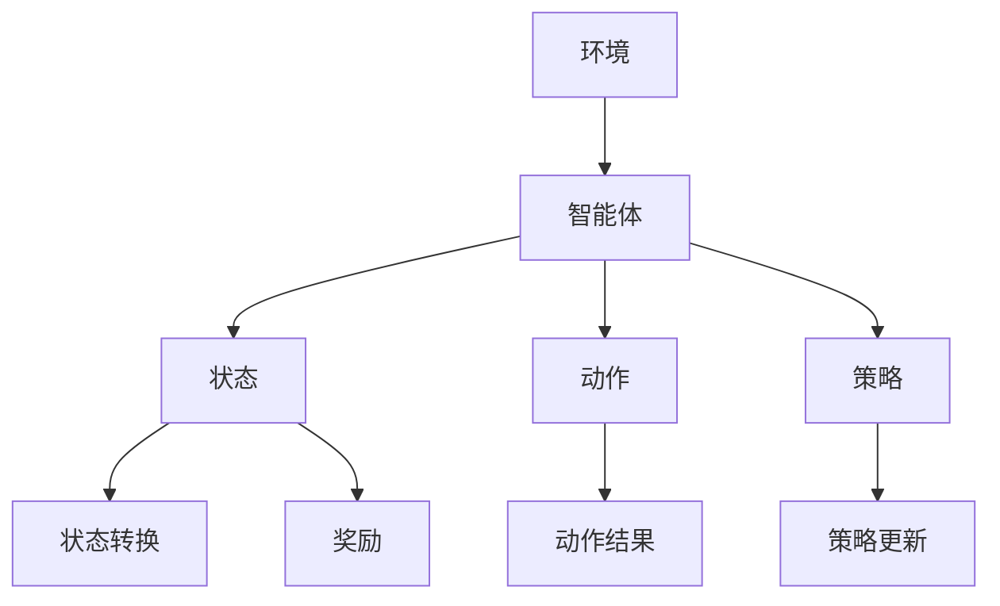

                 

# 深度强化学习在多智能体系统中的应用

> 关键词：深度强化学习、多智能体系统、协作学习、对抗学习、博弈论、应用场景、数学模型

> 摘要：本文旨在探讨深度强化学习在多智能体系统中的应用，通过分析深度强化学习的核心算法原理、数学模型以及具体操作步骤，结合实际项目案例进行深入讲解，旨在帮助读者理解并掌握如何将深度强化学习应用于多智能体系统中的协作学习、对抗学习和博弈论等场景，为相关领域的研究者和开发者提供有价值的参考。

## 1. 背景介绍

### 1.1 目的和范围

本文的主要目的是介绍深度强化学习在多智能体系统中的应用，并探讨其核心算法原理、数学模型以及实际操作步骤。文章将涵盖以下内容：

1. **背景介绍**：介绍多智能体系统、深度强化学习的定义、应用场景以及研究现状。
2. **核心概念与联系**：分析深度强化学习与多智能体系统之间的联系，并通过Mermaid流程图展示核心概念和架构。
3. **核心算法原理 & 具体操作步骤**：详细讲解深度强化学习的算法原理，使用伪代码阐述具体操作步骤。
4. **数学模型和公式**：介绍深度强化学习中的数学模型和公式，并进行举例说明。
5. **项目实战**：通过代码实际案例，详细解释说明如何应用深度强化学习于多智能体系统中。
6. **实际应用场景**：探讨深度强化学习在多智能体系统中的实际应用场景。
7. **工具和资源推荐**：推荐相关学习资源、开发工具和框架。
8. **总结**：总结未来发展趋势与挑战。
9. **附录**：常见问题与解答。
10. **扩展阅读 & 参考资料**：提供进一步学习的资料。

### 1.2 预期读者

本文适合以下读者群体：

1. 深度强化学习和多智能体系统的研究者。
2. 计算机科学、人工智能等相关领域的学生和从业者。
3. 对深度强化学习在多智能体系统中的应用感兴趣的读者。

### 1.3 文档结构概述

本文结构如下：

1. **背景介绍**：介绍多智能体系统和深度强化学习的定义、应用场景以及研究现状。
2. **核心概念与联系**：分析深度强化学习与多智能体系统之间的联系，并通过Mermaid流程图展示核心概念和架构。
3. **核心算法原理 & 具体操作步骤**：详细讲解深度强化学习的算法原理，使用伪代码阐述具体操作步骤。
4. **数学模型和公式**：介绍深度强化学习中的数学模型和公式，并进行举例说明。
5. **项目实战**：通过代码实际案例，详细解释说明如何应用深度强化学习于多智能体系统中。
6. **实际应用场景**：探讨深度强化学习在多智能体系统中的实际应用场景。
7. **工具和资源推荐**：推荐相关学习资源、开发工具和框架。
8. **总结**：总结未来发展趋势与挑战。
9. **附录**：常见问题与解答。
10. **扩展阅读 & 参考资料**：提供进一步学习的资料。

### 1.4 术语表

#### 1.4.1 核心术语定义

- **多智能体系统**：由多个智能体组成的系统，这些智能体之间可以相互交互、协作或竞争。
- **深度强化学习**：一种结合深度学习和强化学习的方法，通过深度神经网络来学习智能体在动态环境中的最优策略。
- **策略**：智能体在给定状态下的动作选择规则。
- **状态**：描述智能体所处环境的特征向量。
- **动作**：智能体在状态下的决策。
- **奖励**：评价智能体动作好坏的指标。

#### 1.4.2 相关概念解释

- **协作学习**：多智能体系统中的智能体通过相互协作来实现共同的目标。
- **对抗学习**：多智能体系统中的智能体之间相互对抗，以实现各自的最大利益。
- **博弈论**：研究多个智能体之间相互竞争和协作的数学理论。

#### 1.4.3 缩略词列表

- **DRL**：深度强化学习（Deep Reinforcement Learning）
- **MAS**：多智能体系统（Multi-Agent Systems）
- **RL**：强化学习（Reinforcement Learning）
- **DNN**：深度神经网络（Deep Neural Network）
- **Q-Learning**：Q值学习算法
- **SARSA**：部分观察的同步策略评估和同步策略改进算法

## 2. 核心概念与联系

### 2.1 多智能体系统

多智能体系统（MAS）是由多个智能体（agent）组成的系统，这些智能体之间可以相互交互、协作或竞争。智能体是具有自主决策和行动能力的实体，可以是个体、机器、程序等。多智能体系统在许多领域都有广泛应用，如自动化制造、物流管理、智能交通、金融投资等。

### 2.2 深度强化学习

深度强化学习（DRL）是一种结合深度学习和强化学习的方法，通过深度神经网络（DNN）来学习智能体在动态环境中的最优策略。DRL的核心思想是让智能体在给定的环境中通过不断尝试和错误，逐渐学会最优策略，从而实现智能体的自主学习和决策。

### 2.3 核心概念联系

深度强化学习与多智能体系统之间的联系主要体现在以下几个方面：

1. **智能体之间的交互**：深度强化学习中的智能体可以通过环境与智能体之间的交互来获取状态和奖励，从而实现策略的优化。在多智能体系统中，智能体之间的交互是实现协作、对抗和博弈的重要手段。
2. **策略的多样性**：深度强化学习通过学习策略来指导智能体的行为。在多智能体系统中，不同智能体可能具有不同的目标，因此需要设计多样化的策略来适应不同场景。
3. **动态环境**：多智能体系统中的环境是动态变化的，智能体需要根据环境的变化调整策略。深度强化学习中的智能体在动态环境中通过不断尝试和错误来学习最优策略，从而适应环境变化。

### 2.4 Mermaid流程图

以下是一个简单的Mermaid流程图，展示深度强化学习在多智能体系统中的应用核心概念和架构：



## 3. 核心算法原理 & 具体操作步骤

### 3.1 算法原理

深度强化学习（DRL）的核心原理是基于强化学习（RL）和深度学习（DL）的方法，通过训练深度神经网络（DNN）来学习智能体在动态环境中的最优策略。DRL的主要组成部分包括智能体（agent）、环境（environment）、状态（state）、动作（action）和奖励（reward）。

1. **智能体（agent）**：智能体是执行动作的主体，它通过感知环境状态，选择动作，并根据动作结果获得奖励，从而逐渐学习到最优策略。
2. **环境（environment）**：环境是智能体执行动作的场所，它根据智能体的动作产生新的状态，并给予智能体相应的奖励。
3. **状态（state）**：状态是描述环境当前状态的向量，它是智能体决策的依据。
4. **动作（action）**：动作是智能体在给定状态下执行的行为，它是智能体与环境的交互方式。
5. **奖励（reward）**：奖励是评价智能体动作好坏的指标，它指导智能体选择最优动作。

### 3.2 具体操作步骤

以下是一个简单的DRL算法操作步骤，使用伪代码进行阐述：

```python
# 初始化智能体、环境和神经网络模型
agent = initialize_agent()
environment = initialize_environment()
model = initialize_model()

# 设置训练参数
episodes = 1000
max_steps = 100
learning_rate = 0.001
discount_factor = 0.9

# 开始训练
for episode in range(episodes):
    state = environment.reset()
    done = False
    
    while not done:
        # 智能体根据当前状态选择动作
        action = agent.select_action(state)
        
        # 环境根据动作产生新的状态和奖励
        next_state, reward, done = environment.step(action)
        
        # 更新智能体的策略
        agent.update_model(state, action, reward, next_state, done)
        
        # 更新当前状态
        state = next_state

    # 计算并打印训练结果
    total_reward = environment.get_total_reward()
    print(f"Episode: {episode}, Total Reward: {total_reward}")
```

### 3.3 算法细节

1. **初始化**：在训练开始前，需要初始化智能体、环境和神经网络模型。智能体负责选择动作和更新模型，环境负责生成状态和奖励，神经网络模型用于学习最优策略。
2. **选择动作**：智能体根据当前状态选择动作，可以通过策略网络或值网络进行预测。策略网络输出一个概率分布，表示智能体在给定状态下选择不同动作的概率。值网络输出一个值，表示智能体在给定状态下执行某个动作的预期奖励。
3. **更新模型**：根据新的状态、动作、奖励和下一状态，智能体更新神经网络模型，以优化策略。更新过程中需要考虑奖励的折扣因子，以平衡短期和长期奖励。
4. **训练参数**：训练过程中需要设置训练参数，如学习率、折扣因子、训练轮次和最大步数等。合适的参数选择可以提高训练效率和模型性能。

## 4. 数学模型和公式

### 4.1 Q值学习算法

Q值学习算法是深度强化学习中的核心算法之一，它通过学习Q值（Quality Value）来指导智能体的动作选择。Q值表示智能体在给定状态下执行某个动作的预期奖励，其数学模型如下：

$$
Q(s, a) = \sum_{s'} p(s' | s, a) \cdot r(s', a) + \gamma \cdot \max_{a'} Q(s', a')
$$

其中：

- \( Q(s, a) \)：状态s下执行动作a的Q值。
- \( s \)：当前状态。
- \( a \)：执行的动作。
- \( s' \)：下一状态。
- \( a' \)：下一动作。
- \( p(s' | s, a) \)：在状态s下执行动作a后转移到状态s'的概率。
- \( r(s', a) \)：在状态s'下执行动作a的奖励。
- \( \gamma \)：奖励的折扣因子，用于平衡短期和长期奖励。

### 4.2 策略网络和值网络

深度强化学习中的策略网络和值网络是两个核心神经网络模型。策略网络用于预测智能体在给定状态下选择不同动作的概率分布，值网络用于预测智能体在给定状态下执行某个动作的预期奖励。其数学模型如下：

#### 策略网络

$$
\pi(\text{action} | \text{state}) = \text{softmax}(\text{output}_{\theta_{\pi}}(s))
$$

其中：

- \( \pi(\text{action} | \text{state}) \)：策略网络输出的动作概率分布。
- \( \text{output}_{\theta_{\pi}}(s) \)：策略网络在状态s下的输出。
- \( \text{softmax} \)：softmax函数，用于将输出转换为概率分布。

#### 值网络

$$
V(s) = \text{output}_{\theta_{V}}(s)
$$

其中：

- \( V(s) \)：值网络在状态s下的输出，表示智能体在状态s下的预期奖励。
- \( \text{output}_{\theta_{V}}(s) \)：值网络在状态s下的输出。

### 4.3 举例说明

假设智能体在给定状态s下有两个动作a1和a2，策略网络和值网络的输出如下：

#### 策略网络输出

$$
\pi(\text{action} | s) = \begin{cases}
0.6 & \text{if action = a1} \\
0.4 & \text{if action = a2}
\end{cases}
$$

#### 值网络输出

$$
V(s) = \begin{cases}
10 & \text{if state = s1} \\
5 & \text{if state = s2}
\end{cases}
$$

根据这些输出，智能体在状态s下选择动作a1的概率为0.6，动作a2的概率为0.4。同时，智能体在状态s1下的预期奖励为10，状态s2下的预期奖励为5。

## 5. 项目实战：代码实际案例和详细解释说明

### 5.1 开发环境搭建

在进行项目实战之前，首先需要搭建合适的开发环境。本文选择Python作为编程语言，使用TensorFlow作为深度学习框架，具体步骤如下：

1. **安装Python**：前往Python官方网站（https://www.python.org/）下载Python安装包，并按照提示安装。
2. **安装TensorFlow**：在命令行中运行以下命令安装TensorFlow：

```bash
pip install tensorflow
```

3. **安装其他依赖**：根据项目需求，安装其他相关依赖，如NumPy、Pandas等。

### 5.2 源代码详细实现和代码解读

以下是一个简单的深度强化学习在多智能体系统中的应用代码示例，用于两个智能体的协作学习。代码主要分为三个部分：环境（Environment）、智能体（Agent）和训练（Train）。

#### 环境类（Environment）

```python
import numpy as np

class Environment:
    def __init__(self, num_agents, state_size, action_size):
        self.num_agents = num_agents
        self.state_size = state_size
        self.action_size = action_size
        self.reset()

    def reset(self):
        self.states = np.zeros((self.num_agents, self.state_size))
        self.rewards = np.zeros(self.num_agents)
        return self.states

    def step(self, actions):
        # 在这里编写智能体交互的具体逻辑，并计算奖励
        next_states = self.calculate_next_states(actions)
        rewards = self.calculate_rewards(actions)
        done = False  # 判断是否达到终止条件，例如最大步数等
        return next_states, rewards, done

    def calculate_next_states(self, actions):
        # 根据动作计算下一状态
        next_states = np.zeros((self.num_agents, self.state_size))
        # ...
        return next_states

    def calculate_rewards(self, actions):
        # 根据动作计算奖励
        rewards = np.zeros(self.num_agents)
        # ...
        return rewards
```

#### 智能体类（Agent）

```python
import tensorflow as tf

class Agent:
    def __init__(self, state_size, action_size, learning_rate, discount_factor):
        self.state_size = state_size
        self.action_size = action_size
        self.learning_rate = learning_rate
        self.discount_factor = discount_factor
        self.model = self.create_model()

    def create_model(self):
        # 创建深度神经网络模型
        model = tf.keras.Sequential([
            tf.keras.layers.Dense(64, activation='relu', input_shape=(self.state_size,)),
            tf.keras.layers.Dense(64, activation='relu'),
            tf.keras.layers.Dense(self.action_size, activation='softmax')
        ])
        model.compile(loss='categorical_crossentropy', optimizer=tf.keras.optimizers.Adam(self.learning_rate))
        return model

    def select_action(self, state):
        # 根据当前状态选择动作
        action_probs = self.model.predict(state)
        action = np.random.choice(self.action_size, p=action_probs[0])
        return action

    def update_model(self, state, action, reward, next_state, done):
        # 更新模型
        if not done:
            target = reward + self.discount_factor * np.max(self.model.predict(next_state))
        else:
            target = reward

        y = np.zeros(self.action_size)
        y[action] = target
        self.model.fit(state, y, epochs=1, verbose=0)
```

#### 训练类（Train）

```python
class Train:
    def __init__(self, environment, agent, episodes, max_steps):
        self.environment = environment
        self.agent = agent
        self.episodes = episodes
        self.max_steps = max_steps

    def run(self):
        for episode in range(self.episodes):
            state = self.environment.reset()
            done = False

            while not done:
                action = self.agent.select_action(state)
                next_state, reward, done = self.environment.step(action)
                self.agent.update_model(state, action, reward, next_state, done)
                state = next_state

            # 计算并打印训练结果
            total_reward = self.environment.get_total_reward()
            print(f"Episode: {episode}, Total Reward: {total_reward}")
```

### 5.3 代码解读与分析

1. **环境类（Environment）**：环境类定义了智能体交互的具体逻辑，包括状态和奖励的计算。在`calculate_next_states`和`calculate_rewards`方法中，可以根据具体需求实现智能体的协作学习或对抗学习逻辑。
2. **智能体类（Agent）**：智能体类定义了智能体的行为和策略更新。在`create_model`方法中，使用TensorFlow创建深度神经网络模型，并在`select_action`方法中选择动作。在`update_model`方法中，使用经验回放机制更新模型。
3. **训练类（Train）**：训练类负责运行整个训练过程，包括初始化环境、智能体，执行训练循环，并计算并打印训练结果。

通过上述代码示例，我们可以实现一个简单的深度强化学习在多智能体系统中的应用项目。在实际开发过程中，可以根据具体需求进行扩展和优化，如增加智能体数量、引入对抗学习、调整神经网络结构等。

## 6. 实际应用场景

深度强化学习在多智能体系统中的应用非常广泛，以下是一些典型的实际应用场景：

### 6.1 自动驾驶

自动驾驶是深度强化学习在多智能体系统中的一个重要应用领域。在自动驾驶系统中，多个智能体（如车辆、行人、其他车辆等）需要相互交互和协作，以实现安全、高效、可靠的行驶。深度强化学习可以用于训练自动驾驶智能体，使其在复杂交通环境中学会最优驾驶策略。

### 6.2 货物配送

在货物运输和配送领域，多智能体系统可以用于优化配送路径、调度车辆和资源。通过深度强化学习，智能体可以学习到最优的协作和调度策略，从而提高配送效率、降低成本和减少碳排放。

### 6.3 金融投资

在金融投资领域，多智能体系统可以用于模拟市场动态、预测股价走势和优化投资组合。深度强化学习可以帮助智能体在市场波动中调整投资策略，实现风险控制和收益最大化。

### 6.4 智能制造

在智能制造领域，多智能体系统可以用于优化生产流程、提高生产效率和降低成本。通过深度强化学习，智能体可以学习到最优的生产调度和资源分配策略，从而提高生产灵活性和响应速度。

### 6.5 智能交通

在智能交通领域，多智能体系统可以用于优化交通信号控制、交通流量管理和车辆调度。通过深度强化学习，智能体可以学习到最优的交通管理策略，从而提高交通效率和减少拥堵。

### 6.6 游戏和娱乐

在游戏和娱乐领域，多智能体系统可以用于设计智能游戏角色、创造互动体验和提升游戏乐趣。通过深度强化学习，智能体可以学习到复杂的游戏策略和玩法，从而提高游戏的可玩性和娱乐性。

## 7. 工具和资源推荐

### 7.1 学习资源推荐

#### 7.1.1 书籍推荐

- 《深度学习》（Deep Learning）[Goodfellow, Bengio, Courville]
- 《强化学习》（Reinforcement Learning: An Introduction）[Sutton, Barto]
- 《多智能体系统导论》（Introduction to Multi-Agent Systems）[Wooldridge]

#### 7.1.2 在线课程

- 《深度学习专项课程》（Deep Learning Specialization）[Andrew Ng, Coursera]
- 《强化学习专项课程》（Reinforcement Learning Specialization）[David Silver, Coursera]
- 《多智能体系统设计与实现》（Design and Implementation of Multi-Agent Systems）[Robots in Service, Udacity]

#### 7.1.3 技术博客和网站

- [TensorFlow官网](https://www.tensorflow.org/)
- [PyTorch官网](https://pytorch.org/)
- [GitHub上的深度强化学习项目](https://github.com/search?q=deep+reinforcement+learning)

### 7.2 开发工具框架推荐

#### 7.2.1 IDE和编辑器

- PyCharm
- VS Code
- Jupyter Notebook

#### 7.2.2 调试和性能分析工具

- TensorFlow Debugger (TFDB)
- PyTorch Profiler
- NVIDIA Nsight

#### 7.2.3 相关框架和库

- TensorFlow
- PyTorch
- OpenAI Gym
- Stable Baselines

### 7.3 相关论文著作推荐

#### 7.3.1 经典论文

- [Deep Q-Networks](https://www.nature.com/articles/s41586-018-0053-y) [DQN论文]
- [Asynchronous Methods for Deep Reinforcement Learning](https://arxiv.org/abs/1602.01783) [A3C论文]
- [Proximal Policy Optimization](https://arxiv.org/abs/1707.06347) [PPO论文]

#### 7.3.2 最新研究成果

- [Multi-Agent Deep Reinforcement Learning: A Comprehensive Survey](https://arxiv.org/abs/1908.01865) [DRL多智能体综述]
- [Deep Reinforcement Learning for Autonomous Driving](https://arxiv.org/abs/1910.12721) [自动驾驶DRL论文]

#### 7.3.3 应用案例分析

- [DeepMind：DeepMind官网](https://deepmind.com/)
- [OpenAI：OpenAI官网](https://openai.com/)
- [Google AI：Google AI官网](https://ai.google/)

## 8. 总结：未来发展趋势与挑战

深度强化学习在多智能体系统中的应用前景广阔，随着技术的不断进步，其发展趋势和挑战主要体现在以下几个方面：

### 8.1 发展趋势

1. **算法优化**：现有的深度强化学习算法在多智能体系统中存在一定的局限性，如收敛速度慢、不稳定等问题。未来的研究将重点关注算法优化，提高算法的收敛速度和稳定性。
2. **跨领域应用**：深度强化学习在多智能体系统中的应用将不断拓展，从传统的自动驾驶、金融投资等领域延伸到更多领域，如医疗、教育、农业等。
3. **实时性增强**：随着多智能体系统复杂性的增加，实时性要求越来越高。未来的研究将关注如何提高深度强化学习在多智能体系统中的实时性能。
4. **安全性提升**：多智能体系统在应用过程中可能面临恶意攻击、安全漏洞等问题。未来的研究将关注如何提高多智能体系统的安全性，保障系统的稳定运行。

### 8.2 挑战

1. **计算资源限制**：深度强化学习在多智能体系统中的计算资源需求较高，特别是在大规模多智能体系统中，如何高效地利用计算资源是一个重要挑战。
2. **数据隐私保护**：多智能体系统中的数据往往涉及敏感信息，如何确保数据隐私保护，避免数据泄露是一个亟待解决的问题。
3. **复杂环境建模**：多智能体系统中的环境复杂多样，如何准确建模和预测环境状态是一个挑战。未来的研究将关注如何提高环境建模的精度和鲁棒性。
4. **协同与竞争平衡**：在多智能体系统中，智能体之间既存在协作又存在竞争关系。如何平衡协同与竞争，实现系统整体最优是一个重要挑战。

总之，深度强化学习在多智能体系统中的应用前景广阔，但也面临诸多挑战。未来的研究将继续深入探索，以期实现多智能体系统中的高效、稳定、安全运行。

## 9. 附录：常见问题与解答

### 9.1 问题1：什么是深度强化学习？

**回答**：深度强化学习（DRL）是一种结合深度学习和强化学习的方法，通过深度神经网络（DNN）来学习智能体在动态环境中的最优策略。它利用深度神经网络的能力来处理复杂的特征，同时利用强化学习的反馈机制来指导智能体的行为。

### 9.2 问题2：深度强化学习与传统的强化学习有什么区别？

**回答**：传统的强化学习使用简单的状态和动作表示，而深度强化学习通过深度神经网络来学习复杂的特征表示。这使得深度强化学习能够处理更加复杂的问题，并且在某些任务上表现出更好的性能。

### 9.3 问题3：如何优化深度强化学习算法的收敛速度？

**回答**：可以通过以下方法优化深度强化学习算法的收敛速度：
- **使用经验回放**：通过经验回放机制来减少样本的相关性，提高训练效率。
- **使用优先级采样**：对经验样本进行优先级排序，优先训练对目标值影响较大的样本。
- **使用自适应学习率**：根据训练过程动态调整学习率，避免过拟合和欠拟合。

### 9.4 问题4：深度强化学习在多智能体系统中的应用有哪些？

**回答**：深度强化学习在多智能体系统中的应用包括但不限于：
- **自动驾驶**：用于训练自动驾驶车辆的决策策略。
- **物流配送**：用于优化物流配送的路径规划和资源调度。
- **金融投资**：用于模拟市场动态和优化投资组合。
- **智能制造**：用于优化生产流程和资源分配。

### 9.5 问题5：如何在多智能体系统中实现协作学习？

**回答**：在多智能体系统中实现协作学习可以通过以下方法：
- **共享奖励**：智能体共同完成目标，共享奖励。
- **信息共享**：智能体之间交换信息，协同决策。
- **策略协同**：智能体之间通过策略协同，实现共同目标。

## 10. 扩展阅读 & 参考资料

为了进一步了解深度强化学习在多智能体系统中的应用，以下是推荐的扩展阅读和参考资料：

### 10.1 书籍

- 《深度强化学习：原理与算法》（Reinforcement Learning: An Introduction）[Sutton, Barto]
- 《多智能体系统导论》（Introduction to Multi-Agent Systems）[Wooldridge]
- 《深度学习》（Deep Learning）[Goodfellow, Bengio, Courville]

### 10.2 论文

- [Deep Q-Networks](https://www.nature.com/articles/s41586-018-0053-y) [DQN论文]
- [Asynchronous Methods for Deep Reinforcement Learning](https://arxiv.org/abs/1602.01783) [A3C论文]
- [Proximal Policy Optimization](https://arxiv.org/abs/1707.06347) [PPO论文]

### 10.3 技术博客和网站

- [TensorFlow官网](https://www.tensorflow.org/)
- [PyTorch官网](https://pytorch.org/)
- [OpenAI官网](https://openai.com/)

### 10.4 在线课程

- 《深度学习专项课程》（Deep Learning Specialization）[Andrew Ng, Coursera]
- 《强化学习专项课程》（Reinforcement Learning Specialization）[David Silver, Coursera]
- 《多智能体系统设计与实现》（Design and Implementation of Multi-Agent Systems）[Robots in Service, Udacity]

### 10.5 开发工具和框架

- TensorFlow
- PyTorch
- OpenAI Gym
- Stable Baselines

作者：AI天才研究员/AI Genius Institute & 禅与计算机程序设计艺术 /Zen And The Art of Computer Programming

