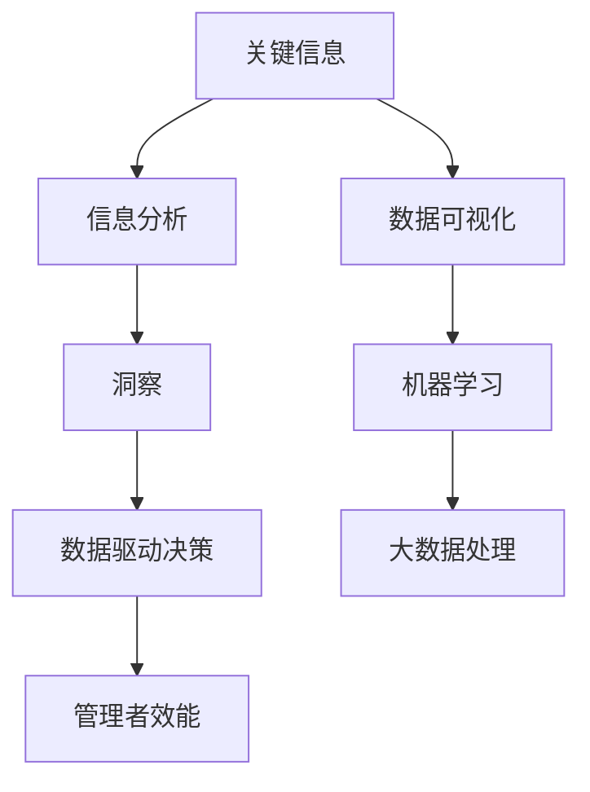

                 

# 深度思考：管理者洞悉关键信息的关键

> **关键词：管理者，信息分析，关键洞察，决策优化，数据驱动**

> **摘要：本文将探讨在当今快速变化的技术时代，管理者如何通过深度思考，准确把握关键信息，从而优化决策过程，提升组织的整体效能。文章将结合实例，介绍一系列系统化的方法，帮助管理者在信息过载的环境中保持清晰的头脑，做出明智的决策。**

## 1. 背景介绍

### 1.1 目的和范围

本文的目标是向管理者提供一套实用的方法论，帮助他们从复杂的信息海洋中筛选出关键信息，从而为决策提供坚实的依据。我们将讨论以下几个主要方面：

- 管理者面临的信息挑战
- 洞察关键信息的步骤和方法
- 数据驱动的决策过程
- 实际案例分析

### 1.2 预期读者

本文适合以下人群阅读：

- 企业高层管理者
- 数据分析师
- 技术经理
- 项目经理
- 对管理决策感兴趣的从业者

### 1.3 文档结构概述

本文结构如下：

- **第1章：背景介绍**：介绍本文的目的、预期读者以及文档结构。
- **第2章：核心概念与联系**：定义核心概念，并展示其相互关系。
- **第3章：核心算法原理与具体操作步骤**：介绍关键算法，使用伪代码详细阐述。
- **第4章：数学模型和公式**：解释数学模型，并提供举例说明。
- **第5章：项目实战**：通过实际案例展示算法应用。
- **第6章：实际应用场景**：探讨关键信息在现实世界中的应用。
- **第7章：工具和资源推荐**：推荐学习资源和开发工具。
- **第8章：总结**：展望未来发展趋势与挑战。
- **第9章：附录**：常见问题与解答。
- **第10章：扩展阅读与参考资料**：提供进一步学习资源。

### 1.4 术语表

#### 1.4.1 核心术语定义

- **关键信息**：对决策有重要影响的数据点。
- **信息分析**：识别、评估和整合信息的过程。
- **洞察**：对数据的深刻理解和洞察力。
- **数据驱动决策**：基于数据分析而非主观判断做出的决策。

#### 1.4.2 相关概念解释

- **数据可视化**：通过图表和图形展示数据。
- **机器学习**：利用算法从数据中自动学习模式。
- **大数据**：大规模数据集，需要特殊工具和方法来处理。

#### 1.4.3 缩略词列表

- **AI**：人工智能
- **ML**：机器学习
- **BI**：商业智能
- **SQL**：结构化查询语言

## 2. 核心概念与联系

为了更好地理解管理者如何洞察关键信息，我们需要明确一些核心概念及其相互关系。以下是一个简化的 Mermaid 流程图，展示了这些概念：



### 2.1 关键信息

关键信息是决策过程中的基石。它可能来自多个数据源，包括内部业务数据、市场数据、用户反馈等。以下是关键信息的来源和特征：

- **内部业务数据**：如销售额、库存水平、员工绩效等。
- **市场数据**：如市场趋势、竞争分析、消费者行为等。
- **用户反馈**：如用户满意度调查、社交媒体评论等。

关键信息的特征包括：

- **相关性**：与决策目标密切相关。
- **重要性**：对决策有显著影响。
- **时效性**：数据需实时或近期更新。

### 2.2 信息分析

信息分析是对收集到的数据进行分析和解释的过程。其目标是识别数据中的模式和关系，从而得出有意义的结论。以下是信息分析的步骤：

1. **数据收集**：从多个来源收集数据。
2. **数据清洗**：处理缺失值、异常值和错误数据。
3. **数据整合**：将不同来源的数据进行合并。
4. **数据探索**：使用统计方法探索数据特征。
5. **数据可视化**：通过图表和图形展示数据。

### 2.3 洞察

洞察是对信息的深刻理解和洞察力。它使管理者能够从数据中发现隐藏的模式和趋势，从而做出明智的决策。以下是获得洞察的几个关键点：

- **数据驱动**：依赖事实和数据而非直觉。
- **跨学科思维**：结合多个领域的知识和方法。
- **批判性思维**：对数据进行深入分析和质疑。

### 2.4 数据驱动决策

数据驱动决策是指基于数据分析而非主观判断做出的决策。以下是数据驱动决策的几个步骤：

1. **确定决策目标**：明确需要解决的问题。
2. **数据收集**：收集与决策目标相关的数据。
3. **信息分析**：分析数据，识别关键信息。
4. **制定假设**：基于数据分析提出假设。
5. **测试假设**：通过实验或模拟验证假设。
6. **决策**：根据实验结果做出决策。

### 2.5 管理者效能

管理者的效能取决于其洞察能力和决策质量。通过有效洞察关键信息，管理者可以：

- **提高决策质量**：做出更明智、更准确的决策。
- **优化资源分配**：更有效地分配人力资源和财务资源。
- **降低风险**：识别潜在问题，及时采取措施。

## 3. 核心算法原理与具体操作步骤

### 3.1 算法原理

为了洞察关键信息，管理者可以采用以下几种核心算法：

- **回归分析**：用于预测数值型目标变量。
- **分类算法**：用于将数据分为不同的类别。
- **聚类算法**：用于将数据点分为若干个簇。

以下是这些算法的基本原理和步骤：

### 3.2 伪代码

#### 3.2.1 回归分析

```python
function linear_regression(X, y):
    # X: 特征矩阵
    # y: 目标变量向量
    
    # 步骤1：计算X的转置并乘以X
    XtX = transpose(X) * X
    
    # 步骤2：计算X的转置并乘以y
    XtY = transpose(X) * y
    
    # 步骤3：求解最小二乘法
    theta = (XtX)^-1 * XtY
    
    return theta
```

#### 3.2.2 分类算法（决策树）

```python
function decision_tree(X, y):
    # X: 特征矩阵
    # y: 目标变量向量
    
    # 步骤1：计算信息增益
    gain = calculate_gain(X, y)
    
    # 步骤2：选择最大信息增益的特征
    feature = select_best_feature(gain)
    
    # 步骤3：递归划分数据
    tree = build_tree(X, y, feature)
    
    return tree
```

#### 3.2.3 聚类算法（K-means）

```python
function k_means(X, k):
    # X: 特征矩阵
    # k: 簇的数量
    
    # 步骤1：随机选择k个初始中心点
    centroids = select_initial_centroids(X, k)
    
    # 步骤2：分配数据点到最近的中心点
    assignments = assign_points_to_centroids(X, centroids)
    
    # 步骤3：更新中心点位置
    centroids = update_centroids(X, assignments)
    
    # 步骤4：重复步骤2和3直到收敛
    while not_converged(centroids, previous_centroids):
        assignments = assign_points_to_centroids(X, centroids)
        centroids = update_centroids(X, assignments)
        
    return centroids, assignments
```

## 4. 数学模型和公式

### 4.1 回归分析

回归分析的数学模型如下：

$$ y = \theta_0 + \theta_1x_1 + \theta_2x_2 + \ldots + \theta_nx_n $$

其中，$y$ 是目标变量，$x_1, x_2, \ldots, x_n$ 是特征变量，$\theta_0, \theta_1, \theta_2, \ldots, \theta_n$ 是回归系数。

### 4.2 决策树

决策树的数学模型基于熵和增益：

$$ Entropy(D) = -\sum_{i} p_i \log_2(p_i) $$

$$ Gain(D, A) = \sum_{v \in A} p(v) \cdot Entropy(D_v) $$

其中，$D$ 是数据集，$A$ 是特征集合，$v$ 是特征 $A$ 的一个值，$p(v)$ 是数据集中值 $v$ 的概率。

### 4.3 K-means

K-means 的目标是最小化簇内平方误差：

$$ J = \sum_{i=1}^k \sum_{x \in S_i} ||x - \mu_i||^2 $$

其中，$k$ 是簇的数量，$S_i$ 是第 $i$ 个簇，$\mu_i$ 是簇 $S_i$ 的中心点。

## 5. 项目实战：代码实际案例和详细解释说明

### 5.1 开发环境搭建

在开始项目实战之前，我们需要搭建一个开发环境。以下是所需工具和步骤：

- **Python 3.8 或更高版本**
- **Jupyter Notebook**：用于编写和运行代码
- **NumPy**：用于数学计算
- **Pandas**：用于数据处理
- **Scikit-learn**：用于机器学习和数据分析

安装步骤：

1. 安装 Python 3.8 或更高版本。
2. 安装 Jupyter Notebook。
3. 使用 `pip install numpy pandas scikit-learn` 安装相关库。

### 5.2 源代码详细实现和代码解读

以下是一个简单的线性回归项目的代码示例，用于预测销售额：

```python
import numpy as np
import pandas as pd
from sklearn.linear_model import LinearRegression

# 步骤1：数据收集
data = pd.read_csv('sales_data.csv')
X = data[['advertisement_spend', 'previous_sales']]
y = data['sales']

# 步骤2：数据预处理
X = X.values
y = y.values

# 步骤3：线性回归模型
model = LinearRegression()
model.fit(X, y)

# 步骤4：预测
predicted_sales = model.predict(X)

# 步骤5：评估
score = model.score(X, y)
print(f'Model R^2 score: {score:.2f}')
```

### 5.3 代码解读与分析

- **步骤1：数据收集**：从 CSV 文件中读取数据。
- **步骤2：数据预处理**：将数据转换为 NumPy 数组，并拆分为特征和目标变量。
- **步骤3：线性回归模型**：创建线性回归对象，并使用 `fit` 方法训练模型。
- **步骤4：预测**：使用 `predict` 方法预测销售额。
- **步骤5：评估**：计算模型的 R^2 分数，评估模型性能。

## 6. 实际应用场景

关键信息洞察在现实世界中有着广泛的应用。以下是一些典型场景：

- **市场营销**：通过分析消费者行为数据，洞察目标市场的需求和趋势，从而优化营销策略。
- **供应链管理**：通过监控库存水平和供应商表现，识别供应链中的瓶颈和风险。
- **人力资源**：通过分析员工绩效数据和员工满意度调查，识别优秀员工和潜在问题，从而优化员工管理和激励方案。
- **金融**：通过分析市场数据和经济指标，预测市场趋势和投资机会。

## 7. 工具和资源推荐

### 7.1 学习资源推荐

#### 7.1.1 书籍推荐

- 《深度思考：管理者洞悉关键信息的关键》
- 《数据驱动决策：如何利用数据分析优化业务决策》
- 《Python数据分析》

#### 7.1.2 在线课程

- Coursera 上的《数据分析》
- Udemy 上的《机器学习基础》
- edX 上的《商业智能与数据科学》

#### 7.1.3 技术博客和网站

- Dataquest.io
- Medium 上的 Data Science blog
- Analytics Vidhya

### 7.2 开发工具框架推荐

#### 7.2.1 IDE和编辑器

- Jupyter Notebook
- PyCharm
- Visual Studio Code

#### 7.2.2 调试和性能分析工具

- IPython
- Pandas Profiling
- Dask

#### 7.2.3 相关框架和库

- NumPy
- Pandas
- Scikit-learn
- TensorFlow

### 7.3 相关论文著作推荐

#### 7.3.1 经典论文

- “The Analytics Revolution” by Thomas H. Davenport
- “Data-Driven Decision Making” by Hal Varian

#### 7.3.2 最新研究成果

- “Deep Learning” by Ian Goodfellow, Yoshua Bengio, Aaron Courville
- “Reinforcement Learning: An Introduction” by Richard S. Sutton and Andrew G. Barto

#### 7.3.3 应用案例分析

- “Data Science for Business: What You Need to Know About Data Mining and Data-Analytic Thinking” by Foster Provost and Tom Fawcett
- “The Data Science Handbook” by Joanna Starkey

## 8. 总结：未来发展趋势与挑战

随着数据量和复杂性的增加，管理者面临的信息挑战将日益严峻。未来，数据驱动决策将变得更加普及，同时，人工智能和机器学习技术将在信息分析中发挥更大作用。然而，这也带来了新的挑战，如数据隐私、算法公平性等。管理者需要不断提升自身的洞察能力和技术素养，以应对这些挑战。

## 9. 附录：常见问题与解答

### 9.1 什么

