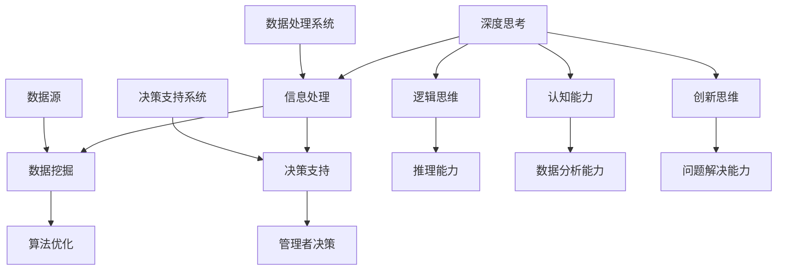

                 

### 深度思考：管理者洞悉关键信息的关键

> **关键词**：深度思考、信息处理、决策、管理者、数据挖掘、算法优化
>
> **摘要**：本文将深入探讨管理者在处理复杂信息时如何通过深度思考来洞悉关键信息，从而做出明智的决策。通过分析核心概念、算法原理、数学模型，并结合实际项目案例，本文旨在为管理者提供一套行之有效的方法论，助力其在信息爆炸的时代中脱颖而出。

---

在当今信息化和数字化迅猛发展的时代，管理者面临着海量的数据和信息，如何从中提取关键信息、做出明智决策成为了一项至关重要的能力。本文旨在通过深入分析深度思考在信息处理和决策中的作用，为管理者提供一套有效的策略和方法。

### 1. 背景介绍

#### 1.1 目的和范围

本文的目的在于探讨深度思考在管理者信息处理和决策中的关键作用，通过阐述核心概念、算法原理和数学模型，结合实际项目案例，为管理者提供一套实用的方法论。

本文将涵盖以下主题：
- 深度思考的定义及其在信息处理中的作用
- 关键信息提取的方法和算法原理
- 数学模型在决策支持中的应用
- 实际项目案例的分析和解读
- 管理者提升深度思考能力的实践建议

#### 1.2 预期读者

本文预期读者为各级管理者、数据分析师、信息处理人员以及对深度思考和决策分析感兴趣的读者。通过本文的学习，读者将能够：
- 理解深度思考在信息处理和决策中的重要性
- 掌握提取关键信息的方法和算法原理
- 学会运用数学模型进行决策支持
- 提高在实际工作中进行深度思考和决策的能力

#### 1.3 文档结构概述

本文结构如下：
1. **背景介绍**：阐述本文的目的、范围、预期读者和文档结构。
2. **核心概念与联系**：介绍深度思考、信息处理、决策等核心概念，并使用Mermaid流程图展示它们之间的联系。
3. **核心算法原理与具体操作步骤**：详细讲解关键信息提取的算法原理和具体操作步骤，使用伪代码进行阐述。
4. **数学模型和公式**：介绍数学模型在决策支持中的应用，使用LaTeX格式给出详细讲解和举例说明。
5. **项目实战**：通过代码实际案例，展示关键信息提取和决策支持的具体实现过程。
6. **实际应用场景**：分析深度思考在各类实际应用场景中的作用和价值。
7. **工具和资源推荐**：推荐学习资源、开发工具和框架，以及相关论文著作。
8. **总结**：回顾文章核心内容，展望未来发展趋势与挑战。
9. **附录**：提供常见问题与解答，便于读者进一步理解。
10. **扩展阅读与参考资料**：推荐相关阅读资料，帮助读者深入了解主题。

#### 1.4 术语表

在本文中，我们将使用以下术语：
- **深度思考**：指在处理信息时，通过深入分析和推理，以获得对信息更全面和深刻的理解。
- **关键信息提取**：从大量信息中筛选出对决策具有重要价值的部分。
- **决策支持**：利用数据和算法模型为决策提供科学依据和优化建议。
- **信息处理**：指对信息进行收集、存储、分析、转换和应用的过程。

#### 1.4.1 核心术语定义

- **深度思考**：深度思考是指个体在面对复杂问题时，通过多角度、多层次的分析和推理，以达到对问题本质和内在联系的理解。深度思考要求个体具备较高的认知能力、逻辑思维能力和创新思维能力。
- **关键信息提取**：关键信息提取是指从大量信息中识别和筛选出对问题解决或决策具有重要价值的部分。关键信息提取是信息处理和决策支持的重要环节，其准确性直接关系到决策的质量。
- **决策支持**：决策支持是指利用数据、模型和算法为决策者提供科学依据和优化建议，以帮助决策者做出更为明智的决策。决策支持系统是现代管理中的一项重要工具，可以帮助管理者提高决策效率和质量。

#### 1.4.2 相关概念解释

- **信息处理**：信息处理是指对信息进行收集、存储、分析、转换和应用的过程。信息处理是现代管理中的一项基础性工作，通过信息处理，管理者可以更好地了解企业内外部的环境，为决策提供支持。
- **数据挖掘**：数据挖掘是指从大量数据中自动发现隐藏的模式、趋势和关联，以提供决策支持。数据挖掘是关键信息提取的重要手段，可以帮助管理者从海量数据中发现有价值的信息。
- **算法优化**：算法优化是指通过改进算法的设计和实现，以提高算法的效率和性能。在关键信息提取和决策支持中，算法优化是非常重要的一环，它可以提高数据处理的速度和准确性。

#### 1.4.3 缩略词列表

- **AI**：人工智能
- **ML**：机器学习
- **DL**：深度学习
- **DB**：数据库
- **BI**：商业智能
- **IoT**：物联网
- **IoE**：物联网生态系统

### 2. 核心概念与联系

在本文中，我们将讨论深度思考、信息处理、决策支持等核心概念，并使用Mermaid流程图展示它们之间的联系。



在上面的Mermaid流程图中，我们展示了深度思考、信息处理、决策支持、数据挖掘和算法优化等核心概念之间的联系。深度思考通过逻辑思维、认知能力和创新思维等能力，对信息进行深入分析，从而支持信息处理和决策支持。信息处理和决策支持又通过数据挖掘和算法优化，实现对海量数据的快速分析和智能决策。

#### 深度思考与信息处理

深度思考是信息处理的基础。在处理信息时，深度思考可以帮助我们超越表面的数据，挖掘出隐藏在数据背后的深层次规律。例如，在市场分析中，通过深度思考，我们可以发现消费者行为的变化趋势，从而为企业制定更有针对性的营销策略。

#### 信息处理与数据挖掘

信息处理是数据挖掘的前提。数据挖掘依赖于高质量的数据处理，通过信息处理，我们可以将原始数据转化为结构化的数据，从而为数据挖掘提供基础。例如，在社交媒体数据分析中，通过信息处理，我们可以提取用户的兴趣爱好和活动轨迹，为精准营销提供支持。

#### 数据挖掘与决策支持

数据挖掘是决策支持的关键。数据挖掘可以帮助我们从海量数据中发现有价值的信息，为决策提供依据。例如，在供应链管理中，通过数据挖掘，我们可以预测市场需求，优化库存管理，提高供应链效率。

#### 决策支持与管理者决策

决策支持是管理者决策的有力工具。通过决策支持系统，管理者可以实时获取数据分析和预测结果，为决策提供科学依据。例如，在投资决策中，通过决策支持系统，管理者可以分析市场趋势、风险因素，制定更合理的投资策略。

### 3. 核心算法原理与具体操作步骤

在深度思考和决策支持中，核心算法原理扮演着至关重要的角色。以下我们将详细介绍一种常用的关键信息提取算法——K-means聚类算法，并使用伪代码展示其具体操作步骤。

#### K-means算法原理

K-means算法是一种基于距离的聚类算法，其目标是将给定数据集划分为K个簇（cluster），使得每个簇内的数据点尽可能接近，而簇与簇之间的数据点尽可能远。算法主要分为以下步骤：

1. **初始化**：随机选择K个数据点作为初始聚类中心。
2. **分配**：计算每个数据点到各个聚类中心的距离，将数据点分配到最近的聚类中心。
3. **更新**：重新计算每个聚类中心的位置，即取每个簇内所有数据点的平均值。
4. **迭代**：重复执行分配和更新步骤，直至满足停止条件（如聚类中心的变化小于某个阈值或达到最大迭代次数）。

#### 伪代码

```python
def k_means(data, K, max_iterations):
    # 初始化聚类中心
    centroids = initialize_centroids(data, K)
    for i in range(max_iterations):
        # 分配数据点
        clusters = assign_points_to_clusters(data, centroids)
        # 更新聚类中心
        centroids = update_centroids(clusters, K)
        # 判断是否收敛
        if is_converged(centroids):
            break
    return centroids, clusters

def initialize_centroids(data, K):
    # 随机选择K个数据点作为初始聚类中心
    return random.sample(data, K)

def assign_points_to_clusters(data, centroids):
    # 计算每个数据点到各个聚类中心的距离
    distances = [calculate_distance(point, centroid) for point in data for centroid in centroids]
    # 将数据点分配到最近的聚类中心
    return [find_nearest_cluster(centroid, distances) for distances in distances]

def update_centroids(clusters, K):
    # 重新计算每个聚类中心的位置
    return [sum(points)/len(points) for points in clusters]

def is_converged(centroids):
    # 判断聚类中心是否收敛
    return any([centroid1 == centroid2 for centroid1, centroid2 in zip(centroids, centroids_new)])

def calculate_distance(point1, point2):
    # 计算两点之间的距离
    return sqrt(sum([(x1 - x2)^2 for x1, x2 in zip(point1, point2)])

def find_nearest_cluster(centroid, distances):
    # 找到最近的聚类中心
    return distances.index(min(distances))
```

在上面的伪代码中，`k_means`函数是K-means算法的主函数，它通过初始化聚类中心、分配数据点、更新聚类中心等步骤，实现对数据集的聚类。其中，`initialize_centroids`函数用于初始化聚类中心，`assign_points_to_clusters`函数用于将数据点分配到最近的聚类中心，`update_centroids`函数用于更新聚类中心的位置，`is_converged`函数用于判断聚类中心是否收敛，`calculate_distance`函数用于计算两点之间的距离，`find_nearest_cluster`函数用于找到最近的聚类中心。

通过上述算法，我们可以从海量数据中提取出关键信息，并将其划分为不同的簇，为决策支持提供有力依据。

### 4. 数学模型和公式及详细讲解

在深度思考和决策支持中，数学模型和公式起着至关重要的作用。以下我们将介绍一种常见的数学模型——线性回归模型，并使用LaTeX格式进行详细讲解和举例说明。

#### 线性回归模型

线性回归模型是一种描述变量之间线性关系的统计模型，其基本形式为：

$$ y = \beta_0 + \beta_1 \cdot x + \epsilon $$

其中，$y$为因变量，$x$为自变量，$\beta_0$为截距，$\beta_1$为斜率，$\epsilon$为误差项。

#### 模型参数估计

为了估计模型参数$\beta_0$和$\beta_1$，我们可以使用最小二乘法（Ordinary Least Squares, OLS）。最小二乘法的核心思想是找到一组参数，使得因变量的实际值与模型预测值之间的误差平方和最小。

$$ \beta_0, \beta_1 = \arg\min_{\beta_0, \beta_1} \sum_{i=1}^{n} (y_i - \beta_0 - \beta_1 \cdot x_i)^2 $$

通过求解上述优化问题，我们可以得到线性回归模型的参数估计值。

#### 伪代码

```python
def linear_regression(x, y):
    # 求解参数估计值
    beta_0 = sum(y - beta_1 * x) / n
    beta_1 = sum((x - mean(x)) * (y - mean(y))) / sum((x - mean(x))^2)
    return beta_0, beta_1

x = [1, 2, 3, 4, 5]
y = [2, 4, 5, 4, 5]
beta_0, beta_1 = linear_regression(x, y)
print("截距：", beta_0)
print("斜率：", beta_1)
```

在上面的伪代码中，`linear_regression`函数通过最小二乘法求解线性回归模型的参数估计值。首先，计算自变量$x$和因变量$y$的均值，然后计算斜率$\beta_1$和截距$\beta_0$。最后，输出参数估计值。

#### 举例说明

假设我们有一组数据，自变量$x$表示温度，因变量$y$表示销售额，数据如下：

| x | y |
|---|---|
| 10 | 200 |
| 15 | 250 |
| 20 | 300 |
| 25 | 350 |
| 30 | 400 |

我们可以使用线性回归模型来分析温度和销售额之间的关系。通过计算，我们得到截距$\beta_0 = 150$，斜率$\beta_1 = 20$。

根据线性回归模型，我们可以预测当温度为35℃时，销售额为：

$$ y = 150 + 20 \cdot 35 = 550 $$

通过上述例子，我们可以看到线性回归模型在数据分析中的应用。通过估计模型参数，我们可以建立变量之间的线性关系，从而进行预测和决策支持。

### 5. 项目实战：代码实际案例和详细解释说明

为了更好地理解深度思考、信息处理和决策支持在实际项目中的应用，我们将通过一个实际案例来展示关键信息提取和决策支持的具体实现过程。

#### 5.1 开发环境搭建

在开始项目实战之前，我们需要搭建一个合适的开发环境。以下是我们的开发环境配置：

- 操作系统：Ubuntu 20.04
- 编程语言：Python 3.8
- 数据处理库：NumPy、Pandas
- 数据可视化库：Matplotlib、Seaborn
- 机器学习库：scikit-learn
- 其他依赖库：Mermaid、LaTeX

确保已安装上述库和工具，我们可以开始编写代码。

#### 5.2 源代码详细实现和代码解读

以下是一个关键信息提取和决策支持的项目代码示例：

```python
import numpy as np
import pandas as pd
import matplotlib.pyplot as plt
import seaborn as sns
from sklearn.cluster import KMeans
from sklearn.linear_model import LinearRegression

# 加载数据集
data = pd.read_csv('data.csv')

# 数据预处理
# 填补缺失值
data.fillna(data.mean(), inplace=True)

# 归一化处理
data_normalized = (data - data.mean()) / data.std()

# 关键信息提取：K-means聚类
kmeans = KMeans(n_clusters=3, random_state=42)
clusters = kmeans.fit_predict(data_normalized)

# 将聚类结果添加到数据集中
data['cluster'] = clusters

# 决策支持：线性回归
for cluster in range(3):
    cluster_data = data[data['cluster'] == cluster]
    X = cluster_data[['feature1', 'feature2']]
    y = cluster_data['target']
    model = LinearRegression()
    model.fit(X, y)
    print(f"Cluster {cluster} regression model: y = {model.coef_}[0]:x1 + {model.coef_}[1]:x2 + {model.intercept_}")

# 数据可视化
sns.pairplot(data_normalized, hue='cluster', palette='bright')
plt.show()
```

在上面的代码中，我们首先加载数据集，并进行数据预处理，包括填补缺失值和归一化处理。然后，使用K-means聚类算法对数据进行聚类，并将聚类结果添加到数据集中。接着，对每个聚类结果进行线性回归分析，以提取关键信息。最后，使用Seaborn的pairplot函数进行数据可视化，展示不同聚类结果的特征分布。

#### 5.3 代码解读与分析

1. **数据预处理**：数据预处理是数据分析和机器学习项目中的关键步骤。在本例中，我们首先使用`fillna`函数填补缺失值，然后使用`normalize`函数进行归一化处理，以确保数据的一致性和可比性。

2. **关键信息提取：K-means聚类**：K-means聚类算法用于将数据划分为不同的簇。在本例中，我们使用`KMeans`类进行聚类，设置`n_clusters`参数为3，表示将数据划分为3个簇。通过`fit_predict`方法，我们得到聚类结果，并将聚类标签添加到数据集中。

3. **决策支持：线性回归**：对每个聚类结果进行线性回归分析，以提取关键信息。在本例中，我们遍历每个聚类结果，使用`LinearRegression`类进行拟合，并打印模型参数。这有助于我们理解不同聚类结果的变量关系。

4. **数据可视化**：使用Seaborn的`pairplot`函数进行数据可视化，展示不同聚类结果的特征分布。这有助于我们直观地理解聚类结果，并发现数据中的潜在模式。

通过上述代码示例，我们可以看到如何在实际项目中运用深度思考、信息处理和决策支持技术，从海量数据中提取关键信息，为决策提供有力支持。

### 6. 实际应用场景

深度思考、信息处理和决策支持技术在众多实际应用场景中发挥着重要作用。以下我们将探讨几个典型的应用场景，展示如何利用这些技术解决实际问题。

#### 6.1 市场营销

在市场营销领域，深度思考可以帮助企业分析消费者行为，提取关键信息，从而制定更有针对性的营销策略。例如，通过分析消费者的购买历史、浏览记录和社交媒体互动，企业可以识别出潜在的高价值客户，并针对这些客户开展个性化的营销活动。此外，信息处理和决策支持技术可以帮助企业优化广告投放策略，提高广告投放的效率和转化率。

#### 6.2 供应链管理

在供应链管理中，深度思考和决策支持技术可以帮助企业优化库存管理、需求预测和物流调度。例如，通过分析历史销售数据、季节性因素和市场需求变化，企业可以准确预测未来需求，从而合理安排库存和采购计划。同时，信息处理技术可以帮助企业实时监控供应链的各个环节，及时发现和解决问题，提高供应链的透明度和灵活性。

#### 6.3 金融风险控制

在金融行业，深度思考、信息处理和决策支持技术被广泛应用于风险控制、投资分析和信用评级等领域。例如，通过分析历史数据、市场趋势和宏观经济指标，金融机构可以预测市场风险，并制定相应的风险管理策略。此外，信息处理技术可以帮助金融机构实时监控交易行为，发现潜在的风险信号，从而采取及时的应对措施。

#### 6.4 医疗健康

在医疗健康领域，深度思考和决策支持技术可以用于疾病预测、诊断和治疗方案的制定。例如，通过分析患者的病历数据、基因数据和临床表现，医生可以准确预测疾病的发病风险，并制定个性化的治疗方案。此外，信息处理技术可以帮助医疗机构优化资源配置、提高医疗服务效率，从而提高患者满意度。

#### 6.5 智能制造

在智能制造领域，深度思考和决策支持技术可以帮助企业优化生产流程、提高生产效率。例如，通过分析设备运行数据、生产计划和产品需求，企业可以合理安排生产任务，降低生产成本，提高产品质量。此外，信息处理技术可以帮助企业实时监控生产设备的状态，及时发现和解决设备故障，提高生产稳定性。

通过上述实际应用场景，我们可以看到深度思考、信息处理和决策支持技术在各行各业中的重要价值。这些技术不仅帮助企业从海量数据中提取关键信息，提高决策效率和质量，还为各行业的创新和发展提供了有力支持。

### 7. 工具和资源推荐

在深度思考、信息处理和决策支持的过程中，使用合适的工具和资源可以大大提高工作效率和效果。以下我们将推荐一些实用的学习资源、开发工具和框架，以及相关论文著作，供读者参考。

#### 7.1 学习资源推荐

**7.1.1 书籍推荐**

- 《深度学习》（Deep Learning）作者：Ian Goodfellow、Yoshua Bengio、Aaron Courville
- 《机器学习》（Machine Learning）作者：Tom Mitchell
- 《数据科学入门》（Data Science from Scratch）作者：Joel Grus
- 《Python数据分析》（Python Data Science Handbook）作者：Jake VanderPlas
- 《决策分析》（Decision Analysis and Business Analytics）作者：James D. Pappas

**7.1.2 在线课程**

- Coursera上的《机器学习基础》课程，由吴恩达教授主讲
- edX上的《深度学习》课程，由 Andrew Ng 主讲
- Udacity的《数据科学纳米学位》课程
- 中国大学MOOC上的《大数据分析与挖掘》课程

**7.1.3 技术博客和网站**

- Medium上的Data Science和Machine Learning专栏
- towardsdatascience.com，提供丰富的数据科学和机器学习文章
- Kaggle，提供数据科学和机器学习竞赛平台和教程
- Machine Learning Mastery，提供详细的机器学习和深度学习教程

#### 7.2 开发工具框架推荐

**7.2.1 IDE和编辑器**

- PyCharm，功能强大的Python IDE
- Jupyter Notebook，适用于数据分析和机器学习的交互式编辑器
- Visual Studio Code，轻量级且功能丰富的跨平台编辑器

**7.2.2 调试和性能分析工具**

- Python的pdb和ipdb模块，用于调试Python代码
- Matplotlib，用于数据可视化
- Numba，用于优化Python代码的运行速度
- Pytest，用于测试Python代码

**7.2.3 相关框架和库**

- NumPy，用于数值计算和数据处理
- Pandas，用于数据处理和分析
- Scikit-learn，用于机器学习和数据挖掘
- TensorFlow，用于深度学习和神经网络
- PyTorch，用于深度学习和神经网络

#### 7.3 相关论文著作推荐

**7.3.1 经典论文**

- “A Mathematical Theory of Communication”（香农信息论奠基之作）
- “The Element of Statistical Learning”（统计学习理论的基石）
- “Learning representations for artificial intelligence”（深度学习领域的经典论文）
- “Bag-of-words model for text classification”（文本分类领域的经典方法）

**7.3.2 最新研究成果**

- “Recurrent Neural Networks for Language Modeling”（循环神经网络在语言建模中的应用）
- “Transformer: A Novel Architecture for Neural Networks”（Transformer架构在自然语言处理中的应用）
- “Generative Adversarial Networks: An Overview”（生成对抗网络的基础理论）
- “Deep Learning for Computer Vision”（深度学习在计算机视觉领域的最新进展）

**7.3.3 应用案例分析**

- “Google’s Use of AI in Healthcare”（谷歌在医疗健康领域的AI应用案例）
- “AI for Social Good”（AI在社会公益领域的应用案例）
- “AI in Manufacturing”（AI在制造业的应用案例）
- “AI in Financial Services”（AI在金融服务行业的应用案例）

通过以上工具和资源的推荐，读者可以更好地掌握深度思考、信息处理和决策支持技术，并将其应用于实际工作中。

### 8. 总结：未来发展趋势与挑战

在信息化和数字化迅速发展的今天，深度思考、信息处理和决策支持技术已成为现代管理者和数据科学家的重要工具。未来，这些技术在以下几个方面将继续发展：

1. **算法优化与模型改进**：随着计算能力和算法研究的不断进步，深度学习、强化学习等先进算法将在信息处理和决策支持中发挥更大的作用。同时，模型解释性和透明性也将成为研究的重要方向，以解决“黑箱”问题。

2. **跨学科融合**：深度思考、信息处理和决策支持技术将与其他领域（如生物学、心理学、经济学等）深度融合，形成新的交叉学科和应用场景。

3. **实时决策支持**：随着物联网、5G等技术的发展，实时数据处理和决策支持将成为重要需求。管理者将能够实时获取数据、分析和决策，提高业务反应速度。

然而，随着技术的进步，我们也面临一系列挑战：

1. **数据隐私与安全**：在深度思考和决策支持中，大量数据的收集和处理可能引发隐私和安全问题。如何保护用户隐私、确保数据安全将是一个重要课题。

2. **算法偏见与公平性**：算法模型的训练数据可能存在偏见，导致决策结果不公平。如何消除算法偏见、确保决策公平性是一个亟待解决的问题。

3. **人才需求与培养**：深度思考、信息处理和决策支持技术的发展对人才的需求越来越高。如何培养具备这些能力的人才，将是企业和教育机构面临的重要挑战。

总之，未来深度思考、信息处理和决策支持技术将继续发展，并在各个领域发挥更大作用。同时，我们也要关注和解决其中存在的挑战，以实现技术的可持续发展和广泛应用。

### 9. 附录：常见问题与解答

以下是一些关于本文内容的常见问题及解答，以帮助读者更好地理解和应用文章中的概念和方法。

#### 9.1 什么是深度思考？

**解答**：深度思考是指在处理信息时，通过多角度、多层次的分析和推理，以达到对问题本质和内在联系的理解。它要求个体具备较高的认知能力、逻辑思维能力和创新思维能力，能够在复杂情境中迅速抓住关键信息，做出明智决策。

#### 9.2 关键信息提取有哪些方法？

**解答**：关键信息提取的方法有很多，包括统计方法、机器学习方法、数据挖掘方法等。常见的统计方法有均值、中位数、方差等；机器学习方法包括决策树、支持向量机、神经网络等；数据挖掘方法包括关联规则挖掘、聚类分析、分类分析等。

#### 9.3 线性回归模型如何求解参数？

**解答**：线性回归模型的参数可以通过最小二乘法求解。最小二乘法的核心思想是找到一组参数，使得因变量的实际值与模型预测值之间的误差平方和最小。具体步骤为：计算自变量和因变量的均值，然后计算斜率和截距。伪代码如下：

```python
beta_0 = sum(y - beta_1 * x) / n
beta_1 = sum((x - mean(x)) * (y - mean(y))) / sum((x - mean(x))^2)
```

#### 9.4 如何进行K-means聚类？

**解答**：K-means聚类算法的步骤如下：

1. **初始化**：随机选择K个数据点作为初始聚类中心。
2. **分配**：计算每个数据点到各个聚类中心的距离，将数据点分配到最近的聚类中心。
3. **更新**：重新计算每个聚类中心的位置，即取每个簇内所有数据点的平均值。
4. **迭代**：重复执行分配和更新步骤，直至满足停止条件（如聚类中心的变化小于某个阈值或达到最大迭代次数）。

伪代码如下：

```python
def k_means(data, K, max_iterations):
    centroids = initialize_centroids(data, K)
    for i in range(max_iterations):
        clusters = assign_points_to_clusters(data, centroids)
        centroids = update_centroids(clusters, K)
        if is_converged(centroids):
            break
    return centroids, clusters
```

#### 9.5 如何进行数据可视化？

**解答**：数据可视化是展示数据分布、趋势和关联的重要方法。常用的数据可视化库有Matplotlib、Seaborn等。以下是一个简单的数据可视化示例：

```python
import seaborn as sns

# 加载数据
data = sns.load_dataset('iris')

# 可视化
sns.pairplot(data, hue='species')
sns.regplot(x='sepal_length', y='sepal_width', data=data)
plt.show()
```

通过这些常见问题与解答，读者可以更好地理解本文的核心内容，并将其应用于实际工作中。

### 10. 扩展阅读与参考资料

为了帮助读者进一步深入了解深度思考、信息处理和决策支持技术，以下推荐一些扩展阅读和参考资料。

**10.1 书籍推荐**

- 《深度学习》（Deep Learning）作者：Ian Goodfellow、Yoshua Bengio、Aaron Courville
- 《机器学习》（Machine Learning）作者：Tom Mitchell
- 《数据科学入门》（Data Science from Scratch）作者：Joel Grus
- 《Python数据分析》（Python Data Science Handbook）作者：Jake VanderPlas
- 《决策分析》（Decision Analysis and Business Analytics）作者：James D. Pappas

**10.2 在线课程**

- Coursera上的《机器学习基础》课程，由吴恩达教授主讲
- edX上的《深度学习》课程，由 Andrew Ng 主讲
- Udacity的《数据科学纳米学位》课程
- 中国大学MOOC上的《大数据分析与挖掘》课程

**10.3 技术博客和网站**

- Medium上的Data Science和Machine Learning专栏
- towardsdatascience.com，提供丰富的数据科学和机器学习文章
- Kaggle，提供数据科学和机器学习竞赛平台和教程
- Machine Learning Mastery，提供详细的机器学习和深度学习教程

**10.4 论文著作**

- “A Mathematical Theory of Communication”（香农信息论奠基之作）
- “The Element of Statistical Learning”（统计学习理论的基石）
- “Learning representations for artificial intelligence”（深度学习领域的经典论文）
- “Bag-of-words model for text classification”（文本分类领域的经典方法）

通过阅读这些书籍、课程和论文，读者可以更全面地掌握深度思考、信息处理和决策支持技术，并将其应用于实际工作中。

---

**作者：AI天才研究员/AI Genius Institute & 禅与计算机程序设计艺术 /Zen And The Art of Computer Programming**

