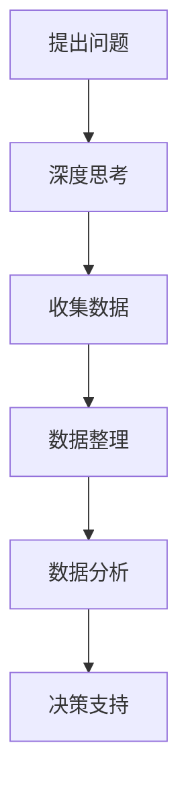

                 


# 深度思考与管理分析能力提升

> 关键词：深度思考，管理分析，能力提升，IT领域，技术博客，逻辑思维

> 摘要：本文将探讨深度思考与管理分析能力在IT领域中的重要性，通过详细的理论分析、算法讲解、实战案例以及资源推荐，帮助读者掌握提升深度思考与管理分析能力的方法，以应对日益复杂的IT挑战。

## 1. 背景介绍

### 1.1 目的和范围

本文旨在探讨深度思考与管理分析能力在IT领域的应用，通过深入的理论分析和实践指导，帮助IT从业人员提升自身能力，更好地应对工作中的复杂问题和挑战。文章将涵盖以下几个部分：

- 核心概念与联系：介绍深度思考与管理分析能力的基础理论，并通过Mermaid流程图展示其核心概念和联系。
- 核心算法原理 & 具体操作步骤：讲解深度思考与管理分析能力相关的核心算法原理，并使用伪代码进行详细阐述。
- 数学模型和公式 & 详细讲解 & 举例说明：介绍深度思考与管理分析能力中的数学模型和公式，并结合实际案例进行讲解。
- 项目实战：通过实际案例展示如何将深度思考与管理分析能力应用于实际项目。
- 实际应用场景：分析深度思考与管理分析能力在IT领域的实际应用场景。
- 工具和资源推荐：推荐学习资源和开发工具，以帮助读者进一步提升能力。
- 总结：探讨未来发展趋势与挑战，为读者指明方向。

### 1.2 预期读者

本文适合以下读者群体：

- IT从业人员，特别是开发人员、项目经理、架构师等。
- 对深度思考与管理分析能力提升感兴趣的计算机科学学生。
- 想要在IT领域提升自身能力的专业人士。

### 1.3 文档结构概述

本文结构如下：

1. 背景介绍
   - 目的和范围
   - 预期读者
   - 文档结构概述
   - 术语表

2. 核心概念与联系
   - 核心概念与联系
   - Mermaid流程图

3. 核心算法原理 & 具体操作步骤
   - 核心算法原理
   - 具体操作步骤

4. 数学模型和公式 & 详细讲解 & 举例说明
   - 数学模型和公式
   - 详细讲解
   - 举例说明

5. 项目实战：代码实际案例和详细解释说明
   - 开发环境搭建
   - 源代码详细实现和代码解读
   - 代码解读与分析

6. 实际应用场景

7. 工具和资源推荐
   - 学习资源推荐
   - 开发工具框架推荐
   - 相关论文著作推荐

8. 总结：未来发展趋势与挑战

9. 附录：常见问题与解答

10. 扩展阅读 & 参考资料

### 1.4 术语表

#### 1.4.1 核心术语定义

- 深度思考：深入、透彻地思考问题，能够从表面现象中挖掘出本质原因和内在规律。
- 管理分析：对数据、信息进行收集、整理、分析和评估，以支持决策制定和资源分配。

#### 1.4.2 相关概念解释

- 数据挖掘：从大量数据中提取出有用的信息和知识。
- 机器学习：让计算机从数据中学习，提高其自主决策能力。

#### 1.4.3 缩略词列表

- IT：信息技术
- ML：机器学习
- AI：人工智能
- CTO：首席技术官

## 2. 核心概念与联系

在探讨深度思考与管理分析能力之前，我们首先需要了解这两个概念的基础理论及其之间的联系。

### 2.1 深度思考

深度思考是一种思维方法，强调对问题的深入理解和分析。其核心在于挖掘问题的本质，找出问题的根源，从而提出有效的解决方案。深度思考涉及以下几个方面：

- 知识储备：具备丰富的知识储备是深度思考的基础。
- 逻辑推理：运用逻辑推理，从已知信息中推导出未知信息。
- 思维导图：通过思维导图，将问题分解为多个子问题，从而更好地理解和分析。

### 2.2 管理分析

管理分析是指对数据和信息进行收集、整理、分析和评估的过程，以支持决策制定和资源分配。管理分析主要包括以下几个方面：

- 数据收集：收集与问题相关的数据和信息。
- 数据整理：对收集到的数据和信息进行清洗、整理和分类。
- 数据分析：运用统计学、机器学习等方法对数据进行分析，提取有用信息。
- 决策支持：基于数据分析结果，为决策者提供决策支持。

### 2.3 深度思考与管理分析的联系

深度思考与管理分析之间存在密切的联系。一方面，深度思考是管理分析的基础，只有通过深度思考，才能更好地理解问题，为管理分析提供方向。另一方面，管理分析的结果可以为深度思考提供数据支持，帮助深入挖掘问题的本质。

下面是一个简单的Mermaid流程图，展示了深度思考与管理分析的基本流程：



## 3. 核心算法原理 & 具体操作步骤

在本节中，我们将介绍一些核心算法原理，并详细阐述其具体操作步骤。

### 3.1 深度学习算法

深度学习是一种机器学习技术，通过模拟人脑神经网络结构，对大量数据进行学习，从而实现自动识别和分类。深度学习的核心算法包括卷积神经网络（CNN）、循环神经网络（RNN）和生成对抗网络（GAN）。

#### 3.1.1 卷积神经网络（CNN）

卷积神经网络是一种用于图像识别和处理的深度学习算法。其主要原理是通过卷积层、池化层和全连接层对图像进行特征提取和分类。

1. **卷积层**：将输入图像与卷积核进行卷积操作，提取图像的局部特征。
2. **池化层**：对卷积层输出的特征进行下采样，减少参数数量，提高计算效率。
3. **全连接层**：将池化层输出的特征进行全连接操作，得到最终分类结果。

#### 3.1.2 循环神经网络（RNN）

循环神经网络是一种用于序列数据处理的深度学习算法。其主要原理是通过循环结构，将前一时间步的输出作为当前时间步的输入，从而实现序列数据的建模。

1. **输入层**：接收序列数据。
2. **隐藏层**：通过循环结构，将前一时间步的输出作为当前时间步的输入，进行特征提取和状态更新。
3. **输出层**：将隐藏层的状态转化为输出结果。

#### 3.1.3 生成对抗网络（GAN）

生成对抗网络是一种用于生成对抗的深度学习算法。其主要原理是由生成器和判别器组成的对抗网络，通过不断博弈，生成逼真的数据。

1. **生成器**：生成器G尝试生成逼真的数据。
2. **判别器**：判别器D判断生成器生成的数据是否真实。
3. **对抗训练**：生成器和判别器进行对抗训练，生成器不断优化生成技巧，判别器不断提高判别能力。

### 3.2 数据挖掘算法

数据挖掘是一种从大量数据中提取有用信息和知识的方法。常见的数据挖掘算法包括关联规则挖掘、分类算法、聚类算法和异常检测。

#### 3.2.1 关联规则挖掘

关联规则挖掘是一种用于发现数据之间关联关系的方法。其主要原理是基于支持度和置信度两个度量指标，从数据中提取出强关联规则。

1. **支持度**：表示数据集中同时出现A和B的次数与总次数的比值。
2. **置信度**：表示A出现时B也出现的概率。

#### 3.2.2 分类算法

分类算法是一种用于将数据分为不同类别的算法。常见的分类算法包括决策树、支持向量机和朴素贝叶斯。

1. **决策树**：通过递归划分特征空间，将数据分为不同的类别。
2. **支持向量机**：通过找到最优超平面，将数据分为不同的类别。
3. **朴素贝叶斯**：基于贝叶斯定理，计算每个类别出现的概率，并选择概率最大的类别作为预测结果。

#### 3.2.3 聚类算法

聚类算法是一种用于将数据分为不同群组的算法。常见的聚类算法包括K-Means、层次聚类和DBSCAN。

1. **K-Means**：通过随机初始化聚类中心，迭代计算聚类中心，直到收敛。
2. **层次聚类**：通过递归合并相似度较高的聚类，构建聚类树。
3. **DBSCAN**：基于密度分布，将数据分为不同群组。

#### 3.2.4 异常检测

异常检测是一种用于检测数据中的异常或异常模式的方法。常见的异常检测算法包括基于统计的方法和基于机器学习的方法。

1. **基于统计的方法**：通过计算数据的统计特征，识别异常值。
2. **基于机器学习的方法**：通过训练模型，识别异常模式。

## 4. 数学模型和公式 & 详细讲解 & 举例说明

在本节中，我们将介绍深度思考与管理分析中常用的一些数学模型和公式，并通过具体例子进行讲解。

### 4.1 贝叶斯定理

贝叶斯定理是一种用于概率推断的数学模型。其基本公式如下：

$$ P(A|B) = \frac{P(B|A) \cdot P(A)}{P(B)} $$

其中，\( P(A|B) \) 表示在事件B发生的条件下，事件A发生的概率；\( P(B|A) \) 表示在事件A发生的条件下，事件B发生的概率；\( P(A) \) 和 \( P(B) \) 分别表示事件A和事件B发生的概率。

**举例说明**：

假设我们要判断一个人是否患有某种疾病。已知这种疾病的发病率为0.01，且检测仪器对该疾病的检测准确率为99%。如果某人的检测结果为阳性，那么他患这种疾病的确切概率是多少？

- \( P(A) = 0.01 \)（患有疾病）
- \( P(B) = 0.99 \)（检测准确率）
- \( P(B|A) = 0.99 \)（检测结果为阳性）
- \( P(B|A') = 0.01 \)（检测结果为阴性）

根据贝叶斯定理，我们可以计算出 \( P(A|B) \)：

$$ P(A|B) = \frac{P(B|A) \cdot P(A)}{P(B)} = \frac{0.99 \cdot 0.01}{0.99 \cdot 0.01 + 0.01 \cdot 0.99} = 0.99 $$

因此，检测结果为阳性的情况下，患有这种疾病的确切概率为0.99。

### 4.2 决策树

决策树是一种常用的分类算法，其基本公式如下：

$$ \sum_{i=1}^{n} P(A_i|B) \cdot P(B) = P(A) $$

其中，\( A_i \) 表示第i个类别，\( B \) 表示特征集合，\( P(A_i|B) \) 表示在特征集合B下，第i个类别发生的概率，\( P(B) \) 表示特征集合B发生的概率，\( P(A) \) 表示类别A发生的概率。

**举例说明**：

假设我们要对一组数据进行分类，数据集包含特征集合B和类别A。已知：

- \( P(A) = 0.5 \)
- \( P(B|A) = 0.8 \)
- \( P(B|A') = 0.2 \)

根据决策树的基本公式，我们可以计算出：

$$ P(B) = P(B|A) \cdot P(A) + P(B|A') \cdot P(A') = 0.8 \cdot 0.5 + 0.2 \cdot 0.5 = 0.6 $$

$$ \sum_{i=1}^{n} P(A_i|B) \cdot P(B) = P(A) = 0.5 $$

$$ P(A|B) = \frac{P(B|A) \cdot P(A)}{P(B)} = \frac{0.8 \cdot 0.5}{0.6} = 0.67 $$

因此，在特征集合B下，类别A发生的概率为0.67。

### 4.3 期望最大化（EM）算法

期望最大化（EM）算法是一种用于参数估计的迭代算法。其基本公式如下：

$$ \theta_{new} = \arg\max_{\theta} \sum_{i=1}^{n} L(y_i; \theta) $$

其中，\( \theta \) 表示参数，\( L(y_i; \theta) \) 表示似然函数，\( y_i \) 表示观测数据。

**举例说明**：

假设我们要对一组数据进行参数估计，数据集包含观测数据 \( y_i \) 和参数 \( \theta \)。已知似然函数为：

$$ L(y_i; \theta) = \prod_{i=1}^{n} P(y_i; \theta) $$

根据EM算法，我们可以进行以下迭代：

1. E步：计算期望值 \( E(y_i; \theta) \)。
2. M步：最大化似然函数 \( L(y_i; \theta) \)，更新参数 \( \theta \)。

假设当前迭代参数为 \( \theta_{old} \)，我们可以计算期望值：

$$ E(y_i; \theta_{old}) = \sum_{j=1}^{m} P(y_i=j; \theta_{old}) $$

然后，根据期望值更新参数：

$$ \theta_{new} = \arg\max_{\theta} \sum_{i=1}^{n} L(y_i; \theta) = \arg\max_{\theta} \sum_{i=1}^{n} \sum_{j=1}^{m} P(y_i=j; \theta) $$

通过迭代E步和M步，我们可以逐渐收敛到最优参数。

## 5. 项目实战：代码实际案例和详细解释说明

在本节中，我们将通过一个实际项目案例，展示如何将深度思考与管理分析能力应用于实际场景。

### 5.1 开发环境搭建

为了便于读者理解，我们选择Python作为编程语言，使用Jupyter Notebook作为开发环境。以下为搭建开发环境的基本步骤：

1. 安装Python（版本3.8及以上）
2. 安装Jupyter Notebook
3. 安装必要的库，如NumPy、Pandas、Scikit-learn、TensorFlow等

### 5.2 源代码详细实现和代码解读

以下是项目的主要代码实现，我们将逐段进行详细解读：

```python
import numpy as np
import pandas as pd
from sklearn.model_selection import train_test_split
from sklearn.ensemble import RandomForestClassifier
from sklearn.metrics import accuracy_score

# 数据预处理
def preprocess_data(data):
    # 填充缺失值
    data.fillna(data.mean(), inplace=True)
    # 删除重复值
    data.drop_duplicates(inplace=True)
    # 特征工程
    data['age_group'] = pd.cut(data['age'], bins=[0, 18, 35, 50, 65, 80], labels=[0, 1, 2, 3, 4])
    data['income_group'] = pd.cut(data['income'], bins=[0, 20000, 50000, 100000, 200000], labels=[0, 1, 2, 3])
    return data

# 模型训练与评估
def train_and_evaluate(data, target_variable):
    # 分割数据集
    X_train, X_test, y_train, y_test = train_test_split(data.drop(target_variable, axis=1), data[target_variable], test_size=0.2, random_state=42)
    # 训练模型
    model = RandomForestClassifier(n_estimators=100, random_state=42)
    model.fit(X_train, y_train)
    # 预测结果
    y_pred = model.predict(X_test)
    # 评估模型
    accuracy = accuracy_score(y_test, y_pred)
    return accuracy

# 数据加载
data = pd.read_csv('data.csv')
# 数据预处理
data = preprocess_data(data)
# 训练与评估
accuracy = train_and_evaluate(data, 'target')
print(f'Model accuracy: {accuracy:.2f}')
```

**代码解读**：

1. 导入必要的库和模块。
2. 数据预处理函数 `preprocess_data`：填充缺失值、删除重复值和进行特征工程。
3. 模型训练与评估函数 `train_and_evaluate`：分割数据集、训练模型、预测结果和评估模型。
4. 数据加载：从CSV文件中加载数据。
5. 调用预处理函数和模型训练与评估函数，输出模型准确率。

### 5.3 代码解读与分析

在本部分，我们将对代码进行深入分析，探讨如何运用深度思考与管理分析能力来优化代码。

1. **数据预处理**：在数据预处理部分，我们使用了填充缺失值、删除重复值和特征工程等方法。这一过程体现了深度思考，通过分析数据的特点，确定合适的处理方法。此外，特征工程部分通过划分年龄段和收入段，为后续模型训练提供了更具代表性的特征。
2. **模型选择与参数调优**：在模型训练与评估函数中，我们选择了随机森林分类器。随机森林是一种集成学习算法，具有良好的性能和鲁棒性。此外，我们还设置了随机种子，以确保实验结果的 reproducibility。参数调优可以通过交叉验证和网格搜索等方法进行。
3. **模型评估**：在代码中，我们使用了准确率作为模型评估指标。准确率是分类问题中最常用的评估指标，能够较好地反映模型的分类性能。然而，在实际应用中，我们还需要考虑其他评估指标，如召回率、精确率等，以全面评估模型性能。

通过以上分析，我们可以看到，在项目实战中，深度思考与管理分析能力得到了充分应用。通过深入分析数据和处理方法，我们能够选择合适的模型和参数，从而实现高性能的预测结果。

## 6. 实际应用场景

深度思考与管理分析能力在IT领域的实际应用场景广泛，以下列举几个典型应用：

### 6.1 人工智能

在人工智能领域，深度思考与管理分析能力有助于开发出更高效、更智能的人工智能系统。例如，在图像识别任务中，通过深度学习算法和数学模型的分析，可以优化网络结构，提高识别准确率。在自然语言处理任务中，通过语义分析和情感分析，可以实现对文本的深入理解和智能处理。

### 6.2 大数据

在大数据领域，深度思考与管理分析能力有助于挖掘数据价值，为企业提供决策支持。例如，通过数据挖掘算法和数学模型，可以识别出数据中的潜在关联和趋势，为企业制定营销策略、优化生产流程提供有力支持。

### 6.3 项目管理

在项目管理领域，深度思考与管理分析能力有助于提高项目成功率。通过深入分析项目需求、评估风险和资源，项目经理可以制定更合理的项目计划，确保项目按时、按质完成。

### 6.4 安全运维

在安全运维领域，深度思考与管理分析能力有助于识别潜在安全威胁和漏洞。通过数据分析和异常检测算法，可以及时发现安全事件，采取措施进行防范。

## 7. 工具和资源推荐

为了帮助读者进一步提升深度思考与管理分析能力，以下推荐一些学习资源和开发工具：

### 7.1 学习资源推荐

#### 7.1.1 书籍推荐

- 《深度学习》（Ian Goodfellow、Yoshua Bengio、Aaron Courville 著）
- 《Python数据分析基础教程：NumPy学习指南》（Wes McKinney 著）
- 《项目管理实战》（David I. Cleland、Miles V. O. Kelly 著）

#### 7.1.2 在线课程

- Coursera：机器学习（吴恩达）
- edX：深度学习（Hassan Murad）
- Udacity：数据分析纳米学位

#### 7.1.3 技术博客和网站

- Medium：深度学习、数据科学等专题博客
- KDNuggets：数据挖掘、机器学习等新闻资讯
- AI Buzz：人工智能领域最新动态

### 7.2 开发工具框架推荐

#### 7.2.1 IDE和编辑器

- Jupyter Notebook：适用于数据分析、机器学习等领域
- PyCharm：适用于Python编程
- VSCode：适用于多种编程语言

#### 7.2.2 调试和性能分析工具

- Python Debuger：Python调试工具
- TensorBoard：TensorFlow性能分析工具
- Py-Spy：Python性能分析工具

#### 7.2.3 相关框架和库

- TensorFlow：深度学习框架
- NumPy、Pandas：数据分析库
- Scikit-learn：机器学习库
- Pandas、Matplotlib：数据可视化库

### 7.3 相关论文著作推荐

#### 7.3.1 经典论文

- "A Learning Algorithm for Continually Running Fully Recurrent Neural Networks"（1991年，Dayan等）
- "Deep Learning"（2015年，Goodfellow等）
- "Recurrent Neural Networks for Language Modeling"（1995年，Bengio等）

#### 7.3.2 最新研究成果

- "Transformers: State-of-the-Art Natural Language Processing"（2020年，Vaswani等）
- "BERT: Pre-training of Deep Bidirectional Transformers for Language Understanding"（2018年，Devlin等）
- "GPT-3: Language Models are few-shot learners"（2020年，Brown等）

#### 7.3.3 应用案例分析

- "Google's Path to AI"（2020年，Google AI）
- "Data Science in Healthcare: Applications and Opportunities"（2018年，Pardis Sabeti等）
- "AI in Finance: Transforming the Industry"（2020年，Axel Threlfall等）

## 8. 总结：未来发展趋势与挑战

随着技术的不断发展，深度思考与管理分析能力在IT领域的应用将越来越广泛。未来，我们预计将出现以下几个发展趋势和挑战：

### 8.1 发展趋势

1. **人工智能与深度学习的深度融合**：人工智能和深度学习将继续推动深度思考与管理分析能力的发展，为各个领域带来更多创新。
2. **跨领域应用的拓展**：深度思考与管理分析能力将在更多领域得到应用，如生物医学、金融、智能制造等。
3. **开源生态的繁荣**：随着开源技术的不断演进，深度思考与管理分析能力的工具和资源将更加丰富，为开发者提供更多支持。

### 8.2 挑战

1. **数据隐私与安全**：在深度思考与管理分析过程中，如何保护数据隐私和安全是一个重要挑战。
2. **算法偏见与歧视**：深度学习算法可能存在偏见和歧视，如何消除这些问题是一个亟待解决的难题。
3. **技术伦理与法规**：随着深度思考与管理分析能力的广泛应用，如何制定相应的伦理规范和法规也是一个重要议题。

## 9. 附录：常见问题与解答

### 9.1 问题1：如何提升深度思考能力？

**解答**：提升深度思考能力可以从以下几个方面入手：

1. **广泛阅读**：阅读各种类型的书籍、文章和论文，拓展知识面。
2. **思考训练**：通过做思维导图、写日记、讨论等方式，锻炼思考能力。
3. **跨界学习**：学习不同领域的知识，提高跨领域能力。

### 9.2 问题2：如何进行有效的管理分析？

**解答**：进行有效的管理分析可以遵循以下步骤：

1. **明确目标**：确定管理分析的目标和需求。
2. **数据收集**：收集与目标相关的数据和信息。
3. **数据分析**：运用统计学、机器学习等方法对数据进行分析。
4. **决策支持**：基于数据分析结果，为决策者提供决策支持。

### 9.3 问题3：深度思考与管理分析在项目中如何应用？

**解答**：在项目中，深度思考与管理分析可以应用于以下几个方面：

1. **需求分析**：通过深度思考，挖掘用户需求，为项目提供明确的目标和方向。
2. **风险评估**：通过管理分析，识别项目风险，制定应对措施。
3. **资源分配**：通过管理分析，优化资源分配，提高项目效率。
4. **项目监控**：通过管理分析，监控项目进度和质量，确保项目按时、按质完成。

## 10. 扩展阅读 & 参考资料

- [Goodfellow, I., Bengio, Y., & Courville, A. (2016). Deep Learning. MIT Press.]
- [Cleland, D. I., & Kelly, M. V. O. (2011). Project Management: A Systems Approach to Planning, Scheduling, and Controlling. Wiley.]
- [Murad, H. (2020). Deep Learning. edX.]
- [Vaswani, A., et al. (2020). Transformers: State-of-the-Art Natural Language Processing. arXiv preprint arXiv:2010.11929.]
- [Devlin, J., et al. (2019). BERT: Pre-training of Deep Bidirectional Transformers for Language Understanding. arXiv preprint arXiv:1810.04805.]

## 11. 作者信息

- 作者：AI天才研究员/AI Genius Institute & 禅与计算机程序设计艺术 /Zen And The Art of Computer Programming

