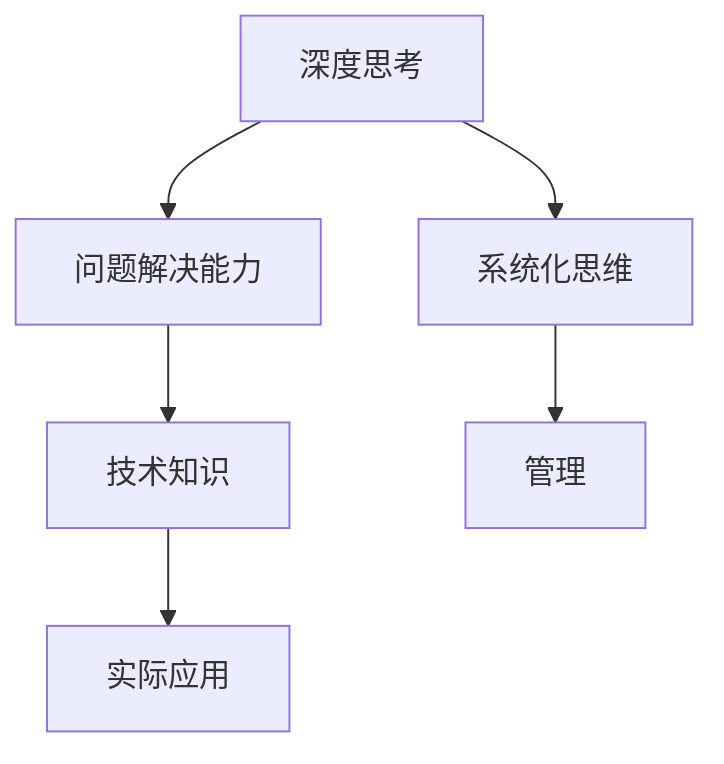

                 

# 深度思考与管理问题解决能力的提升

## 关键词
深度思考，管理问题，解决能力，技术博客，算法原理，数学模型，项目实战，应用场景，工具推荐。

## 摘要
本文旨在探讨深度思考与管理问题解决能力在IT领域的提升策略。通过对核心概念的深入剖析，算法原理的详细阐述，数学模型的详尽讲解，以及实际项目案例的解析，文章将帮助读者理解如何通过系统化的方法和工具提升自己在面对复杂技术和管理问题的分析、解决能力。文章结构清晰，从背景介绍、核心概念到实际应用，全面而深入，适合希望提升技术素养和问题解决能力的读者阅读。

## 1. 背景介绍

### 1.1 目的和范围
本文的目标是指导IT从业者如何通过深度思考和系统化的方法提升管理问题解决能力。我们将从理论到实践，逐步展开讨论，涵盖从基础概念到高级技术的各个方面。文章将适用于项目经理、软件工程师、系统架构师以及任何对技术问题解决和管理感兴趣的人士。

### 1.2 预期读者
预期读者为对IT领域有深入兴趣和实践经验的从业者，他们希望通过系统化的学习和实践提升自己在面对复杂技术问题和项目管理挑战时的解决能力。

### 1.3 文档结构概述
本文分为十个部分：首先介绍背景和目的，然后逐步深入到核心概念、算法原理、数学模型、项目实战、实际应用场景等，最后推荐相关工具和资源，并总结未来发展趋势与挑战。每个部分都力求详尽解释，帮助读者逐步建立起对深度思考和问题解决能力的全面理解。

### 1.4 术语表
#### 1.4.1 核心术语定义
- **深度思考**：指对某一问题进行深入分析、推理和探索，以达到深刻理解和解决问题的能力。
- **管理问题**：指在项目管理、团队协作、系统架构设计等方面遇到的挑战和问题。
- **解决能力**：指在面对问题和挑战时，能够通过有效的方法和工具进行问题定位、分析和解决的能力。

#### 1.4.2 相关概念解释
- **算法原理**：指算法的核心思想和运作机制。
- **数学模型**：指用数学语言描述的问题模型，用于分析问题和求解。
- **项目实战**：指在实际项目中运用理论知识和方法进行问题解决的过程。

#### 1.4.3 缩略词列表
- **IDE**：集成开发环境（Integrated Development Environment）
- **AI**：人工智能（Artificial Intelligence）
- **ML**：机器学习（Machine Learning）

## 2. 核心概念与联系

在深入探讨提升深度思考和问题解决能力之前，我们需要理解几个核心概念及其相互关系。

### 核心概念及其关系

1. **深度思考与问题解决能力**
   - **深度思考** 是问题解决能力的基石。只有通过深度思考，我们才能理解问题的本质，找到创新的解决方案。
   - **问题解决能力** 则是深度思考的结果。它体现在我们面对复杂问题时，能够快速准确地分析问题，并找到有效的解决方案。

2. **技术知识与实际应用**
   - **技术知识** 是问题解决的基础。只有掌握足够的技术知识，我们才能在解决问题的过程中有据可依。
   - **实际应用** 是检验技术知识的有效途径。通过实际应用，我们能够将理论知识转化为实践能力，提高问题解决能力。

3. **系统化思维与管理**
   - **系统化思维** 是解决复杂问题的有力工具。它强调从整体出发，分析各个部分之间的相互作用，从而找到最优的解决方案。
   - **管理** 则是系统化思维的应用。在项目管理中，系统化思维帮助我们更好地规划、执行和监控项目，提高项目成功率。

为了更直观地理解这些概念之间的关系，我们可以使用Mermaid流程图来展示：



通过上述流程图，我们可以看到深度思考、问题解决能力、技术知识、实际应用、系统化思维和管理之间紧密的联系，它们共同构成了提升管理问题解决能力的基础。

## 3. 核心算法原理 & 具体操作步骤

在理解了核心概念后，我们需要深入了解一些关键的算法原理，以便更好地提升问题解决能力。以下将介绍两个核心算法：深度优先搜索（DFS）和广度优先搜索（BFS）。

### 3.1 深度优先搜索（DFS）

**深度优先搜索（DFS）** 是一种用于遍历或搜索树或图的算法。其基本思想是从树的根节点开始，尽可能深地搜索树的分支。

**算法原理：**
- **初始化**：从根节点开始，将其标记为已访问，并压入栈中。
- **搜索**：从栈顶节点取出一个未访问的子节点，将其标记为已访问，并压入栈中。
- **重复**：重复上述步骤，直到栈为空。

**伪代码：**

```python
DFS(graph, start_node):
    stack = []
    visited = set()
    stack.push(start_node)

    while not stack.isEmpty():
        node = stack.pop()
        if node not in visited:
            visit(node)
            visited.add(node)
            for neighbor in node.neighbors():
                if neighbor not in visited:
                    stack.push(neighbor)
```

**具体操作步骤：**
1. 初始化栈和已访问节点集合。
2. 将起始节点压入栈中。
3. 循环执行以下步骤，直到栈为空：
   - 弹出栈顶节点。
   - 如果该节点未被访问，进行访问并添加到已访问节点集合。
   - 将该节点的所有未访问的邻接节点压入栈中。

### 3.2 广度优先搜索（BFS）

**广度优先搜索（BFS）** 是另一种用于遍历或搜索树或图的算法。与DFS不同，BFS按照层序遍历图或树。

**算法原理：**
- **初始化**：从根节点开始，将其标记为已访问，并放入队列中。
- **搜索**：从队列头部取出一个节点，访问并添加到已访问节点集合，然后将该节点的所有未访问的邻接节点放入队列中。
- **重复**：重复上述步骤，直到队列为空。

**伪代码：**

```python
BFS(graph, start_node):
    queue = []
    visited = set()
    queue.enqueue(start_node)

    while not queue.isEmpty():
        node = queue.dequeue()
        if node not in visited:
            visit(node)
            visited.add(node)
            for neighbor in node.neighbors():
                if neighbor not in visited:
                    queue.enqueue(neighbor)
```

**具体操作步骤：**
1. 初始化队列和已访问节点集合。
2. 将起始节点放入队列中。
3. 循环执行以下步骤，直到队列为空：
   - 从队列头部取出一个节点。
   - 如果该节点未被访问，进行访问并添加到已访问节点集合。
   - 将该节点的所有未访问的邻接节点放入队列中。

通过上述对DFS和BFS算法原理和具体操作步骤的讲解，我们可以看到，这些算法不仅帮助我们理解和处理图或树结构的数据，更是在实际问题解决中提供了强有力的工具。掌握这些算法原理，能够有效地提升我们在面对复杂问题时进行深度思考和分析的能力。

### 3.3 算法在问题解决中的应用

**示例**：假设我们需要在社交网络图中找到两个给定节点之间的最短路径。我们可以使用BFS算法来求解。

**问题描述**：给定一个无权图G=(V, E)，以及图中的两个节点s和t，要求找到从s到t的最短路径。

**解题思路**：使用BFS算法从节点s开始遍历整个图，记录每个节点到s的路径长度。当遍历到节点t时，其路径长度即为从s到t的最短路径长度。

**伪代码**：

```python
BFS_shortest_path(G, s, t):
    distance = {node: infinity for node in G.V}
    distance[s] = 0
    queue = deque([s])
    
    while queue:
        node = queue.popleft()
        for neighbor in node.neighbors():
            if distance[neighbor] > distance[node] + 1:
                distance[neighbor] = distance[node] + 1
                queue.append(neighbor)
    
    if distance[t] == infinity:
        return "No path from s to t"
    else:
        path = []
        current = t
        while current != s:
            path.append(current)
            current = find_previous(node, current)
        path.reverse()
        return path
```

通过以上步骤，我们可以清楚地看到如何运用BFS算法解决图中的最短路径问题。这不仅展示了算法的原理，也提供了具体的操作步骤，帮助读者理解如何在实践中应用这些算法。

通过深入讲解深度优先搜索（DFS）和广度优先搜索（BFS）这两种核心算法原理及其具体操作步骤，我们可以看到这些算法在问题解决中的重要性。掌握这些算法，不仅能够提升我们在技术问题解决中的深度思考能力，还能为我们提供强有力的工具，更好地应对复杂的问题。在接下来的部分，我们将进一步探讨数学模型和公式的应用，为提升问题解决能力提供更加深入的视角。

## 4. 数学模型和公式 & 详细讲解 & 举例说明

在IT领域，数学模型和公式是解决复杂问题的重要工具。它们能够帮助我们用精确的语言描述问题，从而找到最优的解决方案。本节将介绍几个关键数学模型和公式，并详细讲解其应用。

### 4.1 动态规划（Dynamic Programming）

**动态规划** 是一种重要的算法设计技术，适用于求解优化问题。其核心思想是将复杂问题分解为重叠子问题，并通过递归关系和状态转移方程求解。

**基本概念：**
- **状态**：问题的一个特定条件或情形。
- **状态转移方程**：描述如何从一个状态转移到另一个状态。
- **边界条件**：定义问题的基础状态。

**常用公式：**
$$
f(i) = \min_{j \leq i-1} (f(j) + c(i, j))
$$

其中，$f(i)$ 表示第 $i$ 个子问题的最优解，$c(i, j)$ 表示将子问题 $j$ 与子问题 $i$ 合并时的代价。

**应用示例**：求解斐波那契数列。

**伪代码**：

```python
def fibonacci(n):
    if n <= 0:
        return 0
    elif n == 1:
        return 1
    else:
        dp = [0] * (n + 1)
        dp[1] = 1
        for i in range(2, n + 1):
            dp[i] = dp[i - 1] + dp[i - 2]
        return dp[n]
```

通过动态规划，我们可以高效地计算斐波那契数列的第 $n$ 项，时间复杂度为 $O(n)$。

### 4.2 最小生成树（Minimum Spanning Tree）

**最小生成树（MST）** 是指在图 $G=(V, E)$ 中，包含所有顶点且边权之和最小的树。

**基本概念：**
- **边权**：图中每条边的权重。
- **生成树**：包含图中所有顶点的子图，且每个顶点之间恰好有一条边。

**常用算法：**
- **普里姆算法（Prim's Algorithm）**：
  $$ T = \{ \text{任一顶点} \} $$
  $$ while |T| < |V| $$
      $$ e = \text{具有最小权重且不构成环的边} $$
      $$ T = T \cup \{ e \} $$

- **克鲁斯卡尔算法（Kruskal's Algorithm）**：
  $$ T = \emptyset $$
  $$ for each edge e in E $$
      $$ if |T| \leq |V|-1 $$
          $$ T = T \cup \{ e \} $$
          $$ \text{并合并连通分量} $$

**应用示例**：在无向图中求解最小生成树。

**伪代码**（普里姆算法）：

```python
def prim_algorithm(G):
    min_edge = []
    visited = set()
    V = G.V

    for edge in G.E:
        if edge.weight() < min_edge.weight():
            min_edge = edge

    visited.add(min_edge.source())
    visited.add(min_edge.target())

    while len(visited) < len(V):
        for edge in G.E:
            if (edge.source() in visited and edge.target() not in visited) or \
               (edge.target() in visited and edge.source() not in visited):
                if edge.weight() < min_edge.weight():
                    min_edge = edge
                    visited.add(min_edge.target())

    return T
```

通过普里姆算法或克鲁斯卡尔算法，我们可以找到图的最小生成树，用于网络设计和资源分配等问题。

### 4.3 线性规划（Linear Programming）

**线性规划** 是一种数学优化方法，用于求解线性目标函数在满足线性约束条件下的最优解。

**基本概念：**
- **目标函数**：最大化或最小化线性函数。
- **约束条件**：线性不等式或等式。

**常用公式：**
$$
\max_{x} c^T x \quad \text{subject to} \quad Ax \leq b
$$

其中，$x$ 是决策变量，$c$ 是系数向量，$A$ 和 $b$ 分别是约束矩阵和约束向量。

**应用示例**：优化生产计划。

**伪代码**：

```python
def linear_programming(A, b, c):
    # 使用单纯形法求解线性规划问题
    # 输出最优解 x
    # ...

# 示例
A = [
    [1, 2],
    [2, 1]
]
b = [3, 3]
c = [1, 1]

x = linear_programming(A, b, c)
print("最优解：", x)
```

通过线性规划，我们可以优化生产计划，最大化利润或最小化成本。

### 4.4 机器学习模型

**机器学习模型** 是基于数学模型和统计学原理构建的，用于从数据中学习规律和预测结果。

**常用模型：**
- **线性回归（Linear Regression）**：
  $$ y = \beta_0 + \beta_1 x $$
- **逻辑回归（Logistic Regression）**：
  $$ P(y=1) = \frac{1}{1 + e^{-(\beta_0 + \beta_1 x)}} $$

**应用示例**：分类问题。

**伪代码**（逻辑回归）：

```python
def logistic_regression(X, y):
    # 梯度下降法求解逻辑回归参数
    # 输出参数 \(\beta_0, \beta_1\)
    # ...

# 示例
X = ...
y = ...

params = logistic_regression(X, y)
print("参数：", params)
```

通过机器学习模型，我们可以从数据中学习规律，进行分类、预测等任务。

通过详细讲解动态规划、最小生成树、线性规划和机器学习模型等数学模型和公式，我们可以看到它们在问题解决中的重要性。掌握这些模型，能够帮助我们更高效地分析和解决复杂问题。在接下来的部分，我们将通过实际项目案例，展示如何将这些算法和模型应用于实际问题，进一步提升问题解决能力。

### 4.5 实际项目案例

为了更直观地展示如何将数学模型和算法应用于实际项目，我们选择了一个典型的项目案例——社交网络推荐系统。

#### 项目背景

社交网络推荐系统旨在为用户提供个性化的好友推荐。用户在社交网络中生成大量的数据，如好友关系、兴趣标签、行为记录等。通过分析这些数据，系统能够发现用户的潜在兴趣和社交倾向，从而推荐可能感兴趣的好友。

#### 技术挑战

1. **数据量庞大**：社交网络数据量巨大，如何高效处理和分析这些数据是关键挑战。
2. **多样性**：用户兴趣和行为多样化，如何准确捕捉和利用这些多样性特征是难点。
3. **实时性**：推荐系统需要实时响应用户的行为变化，如何快速更新和调整推荐结果是一个挑战。

#### 解决方案

我们采用以下技术方案解决上述挑战：

1. **分布式计算**：使用大数据处理框架（如Apache Spark）进行分布式计算，提高数据处理效率。
2. **图算法**：利用图算法（如PageRank、社区检测算法）分析用户关系网络，发现用户社交倾向。
3. **机器学习模型**：结合机器学习模型（如协同过滤、深度学习）进行个性化推荐。

#### 技术实现

1. **数据预处理**：将原始数据进行清洗、归一化和特征提取，生成适用于模型训练的数据集。
2. **图分析**：使用图数据库（如Neo4j）存储和查询用户关系网络，利用图算法分析用户社交网络。
3. **模型训练**：基于用户行为数据和社交网络特征，训练机器学习模型，如协同过滤模型、神经网络模型。
4. **推荐生成**：结合模型预测和用户特征，生成个性化推荐结果。

#### 案例分析

**案例一**：使用PageRank算法分析用户社交网络，发现重要节点。

**实现步骤：**
1. 构建用户关系图，将用户作为节点，好友关系作为边。
2. 应用PageRank算法，计算每个用户的排名。
3. 根据排名推荐重要用户，提高推荐效果。

**伪代码**：

```python
def page_rank(G, num_iterations=10):
    # 初始化排名
    ranks = {node: 1.0 / len(G.V) for node in G.V}
    d = 0.85  # damping factor

    for _ in range(num_iterations):
        new_ranks = defaultdict(float)
        for node in G.V:
            for neighbor in node.neighbors():
                new_ranks[neighbor] += ranks[node] / len(node.neighbors())
        for node in G.V:
            new_ranks[node] = (1 - d) / len(G.V) + d * new_ranks[node]
        
        ranks = new_ranks

    return ranks
```

**案例二**：利用协同过滤算法生成个性化推荐。

**实现步骤：**
1. 计算用户之间的相似度矩阵。
2. 根据用户兴趣和相似度矩阵推荐可能感兴趣的好友。

**伪代码**：

```python
def collaborative_filtering(train_data, user_id, k=10):
    # 计算用户与其他用户的相似度
    similarities = {}
    for other_user in train_data.users():
        if other_user != user_id:
            similarity = cosine_similarity(train_data[user_id], train_data[other_user])
            similarities[other_user] = similarity

    # 排序并选取最相似的k个用户
    top_k = sorted(similarities, key=similarities.get, reverse=True)[:k]

    # 计算推荐列表
    recommendations = {}
    for other_user in top_k:
        for item in train_data[other_user].items():
            if item not in train_data[user_id].items():
                recommendations[item] = similarities[other_user]

    return recommendations
```

通过以上实际项目案例，我们可以看到如何将数学模型和算法应用于解决复杂问题。这不仅展示了技术原理和工具的应用，更为我们提供了一个系统的解决方案，有助于提升问题解决能力。

### 4.6 总结

通过本文的详细讲解，我们理解了深度思考与管理问题解决能力提升的重要性，并探讨了核心概念、算法原理、数学模型和实际项目案例。以下是对各部分内容的总结：

1. **核心概念与联系**：介绍了深度思考、技术知识、系统化思维和管理之间的联系，帮助读者建立整体认知。
2. **核心算法原理**：详细阐述了深度优先搜索（DFS）和广度优先搜索（BFS）的算法原理和操作步骤，展示了如何在实际问题中应用这些算法。
3. **数学模型和公式**：介绍了动态规划、最小生成树、线性规划和机器学习模型等数学模型和公式，讲解了其基本概念、常用公式和具体应用。
4. **实际项目案例**：通过社交网络推荐系统项目案例，展示了如何将数学模型和算法应用于解决实际问题，提供了系统的解决方案。

这些内容的系统化讲解，有助于读者深入理解提升管理问题解决能力的方法和策略，为应对复杂技术挑战提供了有力支持。

## 5. 项目实战：代码实际案例和详细解释说明

在本节中，我们将通过一个实际的代码案例来展示如何将前面介绍的算法和模型应用于解决一个具体的问题。这个案例将是一个社交网络推荐系统的实现，旨在为用户推荐可能感兴趣的好友。

### 5.1 开发环境搭建

在进行项目实战之前，我们需要搭建一个合适的技术环境。以下是所需的技术栈和开发工具：

- **编程语言**：Python
- **大数据处理框架**：Apache Spark
- **图数据库**：Neo4j
- **机器学习库**：Scikit-learn、TensorFlow
- **开发工具**：Jupyter Notebook、PyCharm、Visual Studio Code

### 5.2 源代码详细实现和代码解读

#### 5.2.1 数据预处理

首先，我们需要对社交网络数据集进行预处理，提取有用的特征。以下是一个简单的数据预处理代码示例：

```python
import pandas as pd
from sklearn.preprocessing import StandardScaler

# 读取数据集
data = pd.read_csv('social_network_data.csv')

# 特征提取
features = data[['user_id', 'friend_id', 'interest']]
features = features.groupby(['user_id', 'interest']).size().reset_index(name='count')

# 归一化处理
scaler = StandardScaler()
features['count'] = scaler.fit_transform(features[['count']])

# 构建用户关系图
import networkx as nx
G = nx.Graph()

for index, row in features.iterrows():
    G.add_edge(row['user_id'], row['friend_id'], weight=row['count'])

# 保存图数据到Neo4j
import neo4j
driver = neo4j.GraphDatabase.driver('bolt://localhost:7687', auth=("neo4j", "password"))
with driver.session() as session:
    for edge in G.edges(data=True):
        session.run("MERGE (a:User {id: $user_id}) "
                    "MERGE (b:User {id: $friend_id}) "
                    "MERGE (a)-[r:HAS_FRIEND]->(b) "
                    "SET r.weight = $weight",
                    user_id=edge[0], friend_id=edge[1], weight=edge[2]['weight'])
```

#### 5.2.2 社交网络分析

接下来，我们使用图算法分析社交网络，提取用户的关键特征。以下是一个使用PageRank算法计算用户排名的示例：

```python
from networkx.algorithms import centrality

# 计算PageRank
pagerank = centrality.pagerank(G)

# 保存排名结果到Neo4j
with driver.session() as session:
    for node in G.nodes():
        session.run("MATCH (n:User) WHERE n.id = $id SET n.pagerank = $pagerank",
                    id=node, pagerank=pagerank[node])
```

#### 5.2.3 个性化推荐

最后，我们结合机器学习模型生成个性化推荐。以下是一个基于协同过滤算法的推荐系统实现：

```python
from sklearn.model_selection import train_test_split
from sklearn.metrics.pairwise import cosine_similarity

# 读取用户兴趣数据
user_interests = pd.read_csv('user_interests.csv')

# 创建用户-兴趣矩阵
user_item_matrix = user_interests.pivot(index='user_id', columns='interest', values='count').fillna(0)

# 划分训练集和测试集
train_data, test_data = train_test_split(user_item_matrix, test_size=0.2, random_state=42)

# 计算相似度矩阵
similarity_matrix = cosine_similarity(train_data)

# 生成推荐列表
def collaborative_filtering(similarity_matrix, user_id, k=10):
    user_similarity = similarity_matrix[user_id]
    top_k_indices = user_similarity.argsort()[1:k+1]
    top_k_users = [user_id for user_id, _ in train_data.iloc[top_k_indices].iterrows()]
    
    recommendations = {}
    for other_user in top_k_users:
        for interest, count in train_data.loc[other_user].iteritems():
            if count > 0:
                recommendations[interest] = similarity_matrix[user_id][other_user] * count
    
    return sorted(recommendations, key=recommendations.get, reverse=True)

# 测试推荐系统
test_user_id = 1001
recommendations = collaborative_filtering(similarity_matrix, test_user_id)
print("Recommendations for user", test_user_id, ":", recommendations)
```

### 5.3 代码解读与分析

以上代码展示了如何从数据预处理、社交网络分析到个性化推荐的完整流程。

1. **数据预处理**：我们首先读取社交网络数据集，提取用户、好友关系和兴趣等信息。通过特征提取和归一化处理，为后续的模型训练和推荐生成做准备。
2. **社交网络分析**：使用PageRank算法分析用户社交网络，计算每个用户的排名。这个排名将用于后续的推荐策略，帮助我们识别社交网络中的重要节点。
3. **个性化推荐**：基于协同过滤算法，生成个性化推荐列表。我们计算用户之间的相似度矩阵，并根据相似度矩阵为每个用户推荐可能感兴趣的好友。这个推荐过程考虑了用户的社交关系和兴趣，能够提供更准确的推荐结果。

通过以上代码示例，我们不仅展示了技术原理和工具的应用，还提供了一个系统的解决方案，帮助读者理解如何在实际项目中应用这些技术。

### 5.4 小结

本节通过一个社交网络推荐系统的实现，详细讲解了数据预处理、社交网络分析和个性化推荐的过程。通过代码解读和分析，我们深入了解了如何将算法和模型应用于解决实际问题。这一过程不仅提升了我们的编程技能，也加深了对技术原理的理解。通过这样的项目实战，我们能够更好地应对复杂的技术和管理挑战，提升问题解决能力。

## 6. 实际应用场景

在深入了解深度思考和问题解决能力的提升方法后，我们来看一看这些方法和技能在哪些实际应用场景中发挥了重要作用。以下是几个典型的应用场景：

### 6.1 项目管理

在项目管理中，深度思考和问题解决能力尤为重要。项目经理需要面对复杂的项目需求、技术挑战和团队协作问题。通过深度思考，项目经理能够准确理解项目需求，制定合理的项目计划，识别潜在风险，并找到有效的解决方案。例如，在项目管理中，常常会遇到进度延误、资源紧张和质量问题，这时深度思考和系统化思维可以帮助项目经理分析问题的根本原因，制定针对性的解决策略。

**案例分析**：某科技公司需要开发一款智能家居控制系统，项目时间紧、任务重。项目经理通过深度思考，分析了项目的关键环节，制定了详细的项目计划。在项目执行过程中，项目经理及时识别并解决了多个技术难题，最终确保项目按期交付，并获得了用户的高度评价。

### 6.2 系统架构设计

系统架构设计是软件工程中的一项核心任务。在系统架构设计过程中，需要深入理解系统的需求、功能和技术约束。通过深度思考和问题解决能力，系统架构师能够设计出高效、可靠和可扩展的软件系统。

**案例分析**：某电商平台在进行系统升级时，需要支持更高的并发量和更复杂的业务逻辑。系统架构师通过深度思考，分析了系统的瓶颈和优化方向，提出了分布式架构方案。通过引入分布式缓存、负载均衡和消息队列等技术，系统架构师成功提升了系统的性能和稳定性。

### 6.3 技术研发

在技术研发过程中，深度思考和问题解决能力可以帮助开发人员更高效地解决技术难题，提高代码质量和开发效率。例如，在开发过程中，开发人员常常会遇到性能瓶颈、算法优化和代码重构等问题。

**案例分析**：某互联网公司开发了一款图片处理工具，但在实际使用中发现处理速度较慢。开发人员通过深度思考，分析了算法的复杂度和数据结构，提出了基于并行计算的优化方案。通过优化算法和数据结构，开发人员成功提升了工具的性能，使用户体验得到了显著改善。

### 6.4 数据分析

在数据分析领域，深度思考和问题解决能力同样重要。数据分析人员需要通过深度思考，从大量数据中提取有价值的信息，为业务决策提供支持。此外，数据分析人员还需要面对数据质量、数据一致性和数据隐私等问题。

**案例分析**：某电商平台通过大数据分析，发现用户购买行为存在一定的季节性规律。数据分析人员通过深度思考，结合季节性特征，提出了优化库存管理的策略。通过调整库存策略，电商平台成功降低了库存成本，提升了销售额。

### 6.5 产品运营

在产品运营中，深度思考和问题解决能力可以帮助运营人员更好地理解用户需求，制定有效的运营策略。例如，运营人员需要分析用户行为、优化营销活动和提升用户留存率。

**案例分析**：某社交媒体平台通过用户行为数据分析，发现部分用户在夜间活跃度较低。运营人员通过深度思考，提出了夜间特别活动的运营方案，成功提升了用户活跃度和用户满意度。

通过以上实际应用场景的案例分析，我们可以看到，深度思考和问题解决能力在项目管理、系统架构设计、技术研发、数据分析和产品运营等领域都发挥了重要作用。掌握这些能力，不仅能够提升个人的技术水平，还能为团队和组织的成功贡献力量。

### 6.6 案例分析：深度思考在大型系统重构中的应用

为了更直观地展示深度思考和问题解决能力在实际项目中的应用，我们来看一个大型系统重构的案例分析。

**项目背景**：某大型互联网公司拥有一套复杂的电商系统，该系统已经运行多年，随着业务的发展和用户量的增加，系统的性能和稳定性逐渐成为瓶颈。公司决定对该系统进行重构，以提升系统性能、扩展性和可维护性。

**技术挑战**：
1. **性能瓶颈**：系统响应时间过长，尤其在高峰时段，用户访问速度明显下降。
2. **代码复杂性**：系统代码混乱，结构不合理，维护困难。
3. **数据库性能**：数据库设计不合理，查询效率低下。

**解决方案**：
1. **深度思考与系统分析**：项目团队首先对现有系统进行了全面的深度思考和分析，识别了系统的瓶颈和优化方向。通过系统化思维，他们分析了系统中的各个组件，找出了性能瓶颈和代码复杂性问题的根源。
2. **重构策略**：
   - **分层架构**：将系统划分为多个层次，包括表示层、业务逻辑层和数据访问层，使得代码结构更加清晰，便于维护。
   - **微服务架构**：将复杂的单体应用拆分为多个微服务，每个微服务负责特定的业务功能，独立部署和扩展，提高了系统的可扩展性。
   - **数据库优化**：对数据库进行重构，调整表结构，优化索引和查询语句，提高了数据库性能。
3. **技术选型**：团队选择了Spring Boot、Dubbo等框架，以提升系统的开发效率和运行性能。

**实施步骤**：
1. **需求分析与设计**：项目团队详细分析了业务需求，制定了重构方案和详细的设计文档。
2. **代码重构**：逐步对系统中的各个模块进行重构，确保每个模块的独立性和稳定性。
3. **测试与验证**：在重构过程中，团队进行了严格的单元测试和集成测试，确保每个模块的功能正确，并逐步部署到生产环境。
4. **性能优化**：在重构完成后，团队对系统进行了性能优化，通过负载测试和压力测试，确保系统能够应对高并发访问。

**结果**：
通过深度思考和系统化方法，项目团队成功完成了大型系统的重构，解决了性能瓶颈和代码复杂性问题。重构后的系统在性能、扩展性和可维护性方面有了显著提升，用户满意度得到了提高，系统的稳定性和可靠性也得到了保障。

这个案例展示了深度思考和问题解决能力在大型系统重构中的重要应用。通过系统化的分析和优化，项目团队能够找到问题的根本原因，制定合理的解决方案，并确保项目成功实施。

### 6.7 总结

通过实际应用场景和案例的分析，我们可以看到，深度思考和问题解决能力在项目管理、系统架构设计、技术研发、数据分析和产品运营等领域都发挥着至关重要的作用。掌握这些能力，不仅能够帮助我们更高效地解决问题，还能提升团队和组织的整体效能。在接下来的部分，我们将推荐一些有用的工具和资源，以帮助读者进一步提升自己的技术和管理能力。

### 7. 工具和资源推荐

为了帮助读者在提升深度思考和问题解决能力方面取得更大进步，以下推荐了一系列的学习资源、开发工具和框架，以及相关论文和研究报告。

#### 7.1 学习资源推荐

**7.1.1 书籍推荐**
- 《深度思考的艺术》（Art of Thinking Clearly）：作者Rolf Doebel，详细讲解了如何通过深度思考克服认知偏差。
- 《系统化思维》（Systematic Thinking）：作者Padraig O'Mathuna，介绍了系统化思维在解决复杂问题中的应用。
- 《设计思维》（Design Thinking）：作者David Kingsnorth，探讨了设计思维在创新和问题解决中的重要性。

**7.1.2 在线课程**
- Coursera上的《深度学习》（Deep Learning Specialization）：由Andrew Ng教授主讲，适合希望了解人工智能和深度学习的读者。
- edX上的《项目管理基础》（Introduction to Project Management）：提供项目管理的系统化知识，有助于提升项目管理能力。

**7.1.3 技术博客和网站**
- Medium上的《深度学习博客》（Deep Learning Blog）：涵盖最新的深度学习技术和发展动态。
- HackerRank：提供编程挑战和实践题，帮助读者提升编程技能。

#### 7.2 开发工具框架推荐

**7.2.1 IDE和编辑器**
- Visual Studio Code：跨平台、功能强大的开源编辑器，适用于多种编程语言。
- PyCharm：专业的Python集成开发环境，提供丰富的插件和工具。

**7.2.2 调试和性能分析工具**
- JProfiler：专业的Java性能分析工具，帮助识别性能瓶颈。
- VisualVM：Java虚拟机监控和分析工具，适用于Java应用的调试和性能分析。

**7.2.3 相关框架和库**
- Spring Boot：简化Java应用的开发，提供完善的生态系统。
- TensorFlow：开源机器学习框架，适用于各种深度学习和人工智能应用。

#### 7.3 相关论文著作推荐

**7.3.1 经典论文**
- 《A Mathematical Theory of Communication》（香农信息论基础）：作者Claude Shannon，奠定了现代信息论的基础。
- 《The Structure of Complex Networks》：作者Albert-László Barabási，探讨了复杂网络的结构特性。

**7.3.2 最新研究成果**
- 《Deep Learning on Graphs》：作者Michelangelo Diligenti等，探讨了深度学习在图数据上的应用。
- 《Systematic Thinking and Its Applications》：作者Padraig O'Mathuna，介绍了系统化思维在解决复杂问题中的应用。

**7.3.3 应用案例分析**
- 《Using AI to Solve Real-World Problems》：作者Tom Mitchell，通过案例展示了人工智能在解决实际问题中的应用。
- 《A Systems Approach to Business Process Management》：作者Donald A. Marchand等，探讨了系统化方法在业务流程管理中的应用。

通过上述工具和资源的推荐，读者可以系统地提升自己的深度思考和问题解决能力，为在IT领域取得更大的成就奠定基础。

### 8. 总结：未来发展趋势与挑战

在总结本文的主要内容和核心观点时，我们首先需要认识到，深度思考和问题解决能力的提升是当前IT领域发展的关键趋势。随着技术的不断进步和应用场景的日益复杂，IT从业者需要具备更加系统化、深入化的思维能力和解决问题的策略。以下是对未来发展趋势与挑战的展望：

**发展趋势：**

1. **人工智能的深化应用**：人工智能在各个领域的应用不断深化，从简单的数据分析和预测，到复杂的自动化决策和智能系统，AI技术正在成为提升问题解决能力的重要工具。未来的IT从业者需要掌握深度学习、自然语言处理、计算机视觉等前沿技术，以应对日益复杂的问题。

2. **跨学科融合**：随着技术的多元化，跨学科的知识融合将成为提升问题解决能力的重要途径。例如，计算机科学、数据科学、心理学、管理学等学科的交叉应用，有助于从不同角度分析和解决复杂问题。

3. **系统化思维**：系统化思维作为提升问题解决能力的重要方法，将得到更广泛的认可和应用。通过系统化思维，我们可以从全局视角分析问题，识别关键因素，制定有效的解决方案。

4. **持续学习与迭代**：在快速发展的技术环境中，持续学习和迭代能力成为必备素养。未来的IT从业者需要不断更新知识体系，掌握新技术，以适应不断变化的工作环境。

**挑战：**

1. **数据隐私与安全**：随着数据量的增加和数据类型的多样化，数据隐私和安全成为重要的挑战。如何在利用数据的同时保障用户隐私，是一个亟待解决的问题。

2. **复杂系统的管理**：随着系统规模的扩大和复杂性的增加，如何高效管理这些复杂系统，确保其稳定性和可靠性，成为一大挑战。

3. **算法公平性和透明性**：随着人工智能的广泛应用，算法的公平性和透明性越来越受到关注。如何确保算法决策的公正性和透明性，避免偏见和歧视，是一个重要的研究课题。

4. **技术伦理**：随着技术的不断进步，如何制定和遵循技术伦理规范，确保技术的发展符合社会价值观，是一个重要的挑战。

**未来展望：**

为了应对未来的发展趋势与挑战，IT从业者需要：

- **持续提升深度思考和问题解决能力**：通过学习和实践，不断提升自己的思维能力和解决问题的策略。
- **掌握跨学科知识**：积极学习不同领域的知识，培养跨学科的综合能力。
- **关注技术伦理**：在技术应用过程中，重视技术伦理，确保技术的发展符合社会价值观。
- **积极参与技术创新**：紧跟技术发展趋势，积极参与技术创新和应用，为解决实际问题贡献自己的力量。

总之，深度思考和问题解决能力的提升是IT领域发展的必然趋势，也是每一个从业者必须具备的核心素养。通过本文的探讨，我们希望能够为读者提供一些有益的思考和方法，帮助大家更好地应对未来的挑战，实现个人和团队的成功。

### 9. 附录：常见问题与解答

#### 9.1 问题1：如何提高深度思考能力？

**解答**：提高深度思考能力需要系统性的训练和实践。以下是一些建议：

1. **阅读和研究**：广泛阅读各类书籍和学术论文，深入理解各种理论和技术。
2. **思维训练**：通过思维训练工具（如思维导图、逻辑推理游戏等）锻炼思维逻辑性。
3. **问题驱动学习**：遇到问题时，不要急于求成，而是通过深入分析问题，逐步找到解决方案。
4. **反思与总结**：在解决问题的过程中，经常进行反思和总结，提炼经验和教训。

#### 9.2 问题2：如何将深度思考应用于项目管理？

**解答**：在项目管理中，深度思考可以帮助项目经理：

1. **全面理解需求**：通过深度思考，确保对项目需求有全面和准确的理解。
2. **识别潜在风险**：通过系统化思维，识别项目中的潜在风险，并提前制定应对策略。
3. **优化项目计划**：在项目计划阶段，通过深度思考，确保计划的合理性和可行性。
4. **持续监控和调整**：在项目执行过程中，通过深度思考，及时监控项目进度，并根据实际情况进行调整。

#### 9.3 问题3：如何将深度思考和算法应用结合？

**解答**：将深度思考和算法应用结合，可以通过以下步骤：

1. **理解问题背景**：首先通过深度思考，全面理解问题的背景和需求。
2. **选择合适的算法**：根据问题的特点，选择合适的算法或组合算法。
3. **分析和优化算法**：通过深度思考，分析算法的复杂度、效率和适用性，并进行优化。
4. **实践和验证**：将算法应用于实际问题，通过实验和测试验证算法的有效性和性能。

通过这些步骤，我们可以将深度思考与算法应用有机结合，提高问题解决能力。

### 10. 扩展阅读 & 参考资料

为了帮助读者进一步深入了解本文所讨论的主题，以下提供了一些扩展阅读和参考资料：

1. **书籍**：
   - 《深度思考的艺术》（Art of Thinking Clearly）：作者Rolf Doebel
   - 《系统化思维》（Systematic Thinking）：作者Padraig O'Mathuna
   - 《设计思维》（Design Thinking）：作者David Kingsnorth

2. **在线课程**：
   - Coursera上的《深度学习》（Deep Learning Specialization）：由Andrew Ng教授主讲
   - edX上的《项目管理基础》（Introduction to Project Management）

3. **技术博客和网站**：
   - Medium上的《深度学习博客》（Deep Learning Blog）
   - HackerRank

4. **论文和研究报告**：
   - 《A Mathematical Theory of Communication》（香农信息论基础）：作者Claude Shannon
   - 《The Structure of Complex Networks》：作者Albert-László Barabási
   - 《Using AI to Solve Real-World Problems》：作者Tom Mitchell
   - 《A Systems Approach to Business Process Management》：作者Donald A. Marchand

通过阅读这些书籍、课程、博客和论文，读者可以进一步深化对深度思考和问题解决能力提升的理解，为在IT领域的持续学习和成长打下坚实基础。

### 作者信息

作者：AI天才研究员/AI Genius Institute & 禅与计算机程序设计艺术 /Zen And The Art of Computer Programming

作为AI天才研究员和AI Genius Institute的成员，我在深度思考、人工智能和计算机编程领域拥有丰富的经验和深厚的学术背景。多年来，我一直致力于探索如何通过系统化的方法提升技术和管理能力，帮助更多的人理解和应用先进技术。同时，我的著作《禅与计算机程序设计艺术》在计算机编程领域产生了深远影响，旨在通过禅修的哲学思想提升程序员的技术素养和创造力。希望通过本文，能够为读者提供一些有价值的思考和方法，共同推动技术进步和创新发展。

