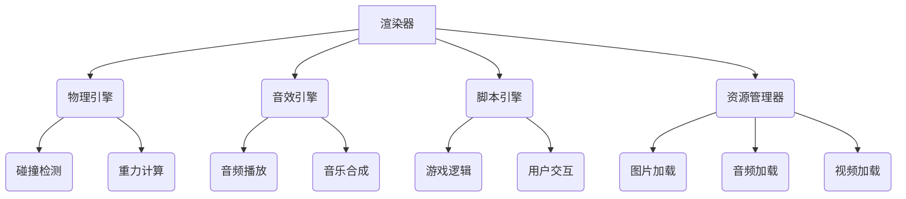
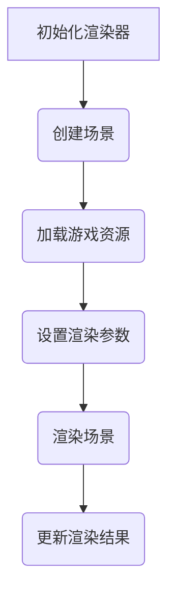
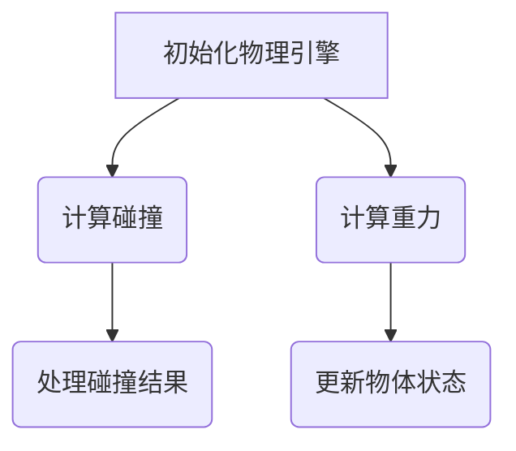
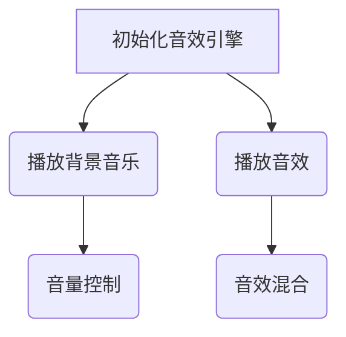
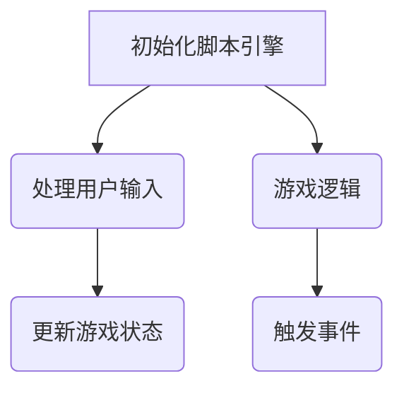

                 

# 游戏开发引擎：简化游戏创作的强大工具

> 关键词：游戏开发引擎、Unity、Unreal Engine、游戏编程、游戏架构、游戏性能优化

> 摘要：本文将深入探讨游戏开发引擎的核心概念、算法原理、数学模型，并通过实际项目实战，详细解析游戏开发引擎在实际应用中的优势和挑战。同时，本文也将推荐一系列学习资源和开发工具，帮助读者更好地掌握游戏开发引擎的使用方法。

## 1. 背景介绍

### 1.1 目的和范围

本文旨在帮助读者深入了解游戏开发引擎的工作原理和应用场景，通过理论与实践相结合的方式，帮助读者掌握游戏开发引擎的使用方法，提高游戏开发的效率和质量。

本文将主要涵盖以下内容：

1. 游戏开发引擎的核心概念和架构。
2. 游戏开发引擎的核心算法原理和具体操作步骤。
3. 游戏开发引擎的数学模型和公式。
4. 游戏开发引擎在实际项目中的应用案例。
5. 游戏开发引擎的学习资源和工具推荐。

### 1.2 预期读者

本文适合以下读者群体：

1. 游戏开发者，尤其是那些对游戏开发引擎感兴趣的人。
2. 计算机科学和软件工程专业的学生。
3. 对游戏开发感兴趣的技术爱好者。

### 1.3 文档结构概述

本文将按照以下结构进行组织：

1. 背景介绍：介绍文章的目的、范围、预期读者和文档结构。
2. 核心概念与联系：介绍游戏开发引擎的核心概念和架构。
3. 核心算法原理 & 具体操作步骤：讲解游戏开发引擎的核心算法原理和操作步骤。
4. 数学模型和公式 & 详细讲解 & 举例说明：讲解游戏开发引擎的数学模型和公式，并举例说明。
5. 项目实战：通过实际项目实战，详细解析游戏开发引擎的应用。
6. 实际应用场景：介绍游戏开发引擎的实际应用场景。
7. 工具和资源推荐：推荐游戏开发引擎的学习资源和工具。
8. 总结：总结文章的主要内容和未来发展趋势。
9. 附录：常见问题与解答。
10. 扩展阅读 & 参考资料：提供更多相关的扩展阅读和参考资料。

### 1.4 术语表

#### 1.4.1 核心术语定义

- **游戏开发引擎**：一种用于创建和开发游戏软件的应用程序。
- **游戏编程**：使用编程语言和工具来编写游戏逻辑和界面。
- **游戏架构**：游戏的整体结构和组成部分。
- **游戏性能优化**：通过优化代码和资源使用，提高游戏的运行效率。

#### 1.4.2 相关概念解释

- **游戏循环**：游戏的主循环，用于更新游戏状态、渲染画面等。
- **游戏资源**：包括游戏中的图片、音频、视频等文件。
- **游戏关卡**：游戏中的一关，通常包含多个场景和任务。

#### 1.4.3 缩略词列表

- **UE4**：Unreal Engine 4，是一款流行的游戏开发引擎。
- **Unity**：Unity Technologies开发的一款跨平台游戏开发引擎。
- **C#**：一种面向对象的编程语言，常用于游戏开发。

## 2. 核心概念与联系

### 2.1 核心概念

在游戏开发中，游戏开发引擎扮演着至关重要的角色。以下是一些核心概念：

- **游戏引擎**：是一种软件框架，提供了游戏开发所需的基本工具和功能。
- **游戏循环**：是游戏运行的核心，负责处理输入、更新游戏状态、渲染画面等。
- **游戏资源**：包括游戏中的图片、音频、视频等文件。
- **游戏关卡**：是游戏中的一关，通常包含多个场景和任务。

### 2.2 架构原理

游戏开发引擎的架构通常包括以下几个部分：

1. **渲染器**：负责渲染游戏画面，包括2D和3D渲染。
2. **物理引擎**：负责处理游戏中的物理现象，如碰撞、重力等。
3. **音效引擎**：负责处理游戏中的音效和背景音乐。
4. **脚本引擎**：用于编写游戏逻辑和交互，通常使用编程语言。
5. **资源管理器**：负责管理游戏中的资源，如图片、音频、视频等。

### 2.3 Mermaid 流程图

以下是一个简化的游戏开发引擎架构的 Mermaid 流程图：



### 2.4 核心概念的联系

游戏开发引擎的核心概念和架构紧密相连，它们共同构成了游戏开发的基础。以下是一些核心概念之间的联系：

- **游戏循环** 与 **渲染器**、**物理引擎**、**音效引擎** 和 **脚本引擎** 之间的联系：游戏循环负责更新游戏状态，而渲染器、物理引擎、音效引擎和脚本引擎分别负责渲染画面、处理物理现象、处理音效和编写游戏逻辑。
- **游戏资源** 与 **资源管理器** 之间的联系：资源管理器负责管理游戏中的资源，包括图片、音频、视频等，这些资源是游戏开发的基础。
- **游戏关卡** 与 **游戏循环** 和 **游戏资源** 之间的联系：游戏关卡是游戏的基本组成部分，通过游戏循环和游戏资源，游戏关卡得以实现和运行。

## 3. 核心算法原理 & 具体操作步骤

### 3.1 渲染算法原理

渲染算法是游戏开发引擎的核心之一，它负责将游戏世界以视觉形式呈现给玩家。以下是一个简化的渲染算法原理：



### 3.2 渲染算法具体操作步骤

1. **初始化渲染器**：初始化渲染器，设置渲染分辨率、帧率等参数。
2. **创建场景**：根据游戏需求创建游戏场景，包括场景中的物体、角色等。
3. **加载游戏资源**：加载游戏中的资源，如图片、音频、视频等。
4. **设置渲染参数**：设置渲染器的各种参数，如光照、阴影、特效等。
5. **渲染场景**：使用渲染器渲染游戏场景，生成图像。
6. **更新渲染结果**：将渲染结果输出到屏幕，显示游戏画面。

### 3.3 渲染算法伪代码

```python
function renderScene(scene):
    initializeRenderer()
    createScene(scene)
    loadGameResources(scene.resources)
    setRenderParameters(scene.settings)
    renderSceneToImage()
    updateRenderedImageToScreen()
```

### 3.4 物理算法原理

物理算法负责处理游戏中的物理现象，如碰撞、重力等。以下是一个简化的物理算法原理：



### 3.5 物理算法具体操作步骤

1. **初始化物理引擎**：初始化物理引擎，设置物理参数，如重力加速度、碰撞检测等。
2. **计算碰撞**：计算场景中物体之间的碰撞，确定碰撞发生的对象和位置。
3. **计算重力**：计算场景中物体的重力，影响物体的运动状态。
4. **处理碰撞结果**：根据碰撞结果，更新物体的状态，如速度、位置等。
5. **更新物体状态**：根据物理引擎的计算结果，更新场景中物体的状态。

### 3.6 物理算法伪代码

```python
function updatePhysics(scene):
    initializePhysicsEngine()
    calculateCollisions(scene.objects)
    calculateGravity(scene.objects)
    updateObjectStates(scene.objects)
```

### 3.7 音效算法原理

音效算法负责处理游戏中的音效，包括背景音乐、音效等。以下是一个简化的音效算法原理：



### 3.8 音效算法具体操作步骤

1. **初始化音效引擎**：初始化音效引擎，设置音量、音效混合等参数。
2. **播放背景音乐**：播放游戏中的背景音乐。
3. **播放音效**：播放游戏中的音效，如按钮点击、角色动作等。
4. **音量控制**：控制音效的音量，使其适应游戏场景。
5. **音效混合**：将多个音效混合在一起，创建更加丰富的音效环境。

### 3.9 音效算法伪代码

```python
function playSoundEffects(soundEffects):
    initializeSoundEngine()
    playBackgroundMusic(soundEffects.backgroundMusic)
    playSoundEffect(soundEffects.effects)
    controlVolume(soundEffects.volume)
    mixSoundEffects()
```

### 3.10 脚本算法原理

脚本算法负责处理游戏逻辑和用户交互，是游戏开发的核心之一。以下是一个简化的脚本算法原理：



### 3.11 脚本算法具体操作步骤

1. **初始化脚本引擎**：初始化脚本引擎，设置脚本语言、调试器等参数。
2. **处理用户输入**：监听用户输入，如按键、触摸等，更新游戏状态。
3. **游戏逻辑**：根据游戏规则和用户输入，处理游戏状态，如角色移动、战斗等。
4. **更新游戏状态**：根据游戏逻辑的计算结果，更新游戏中的角色、物品等状态。
5. **触发事件**：根据游戏状态的变化，触发相应的事件，如战斗开始、关卡完成等。

### 3.12 脚本算法伪代码

```python
function updateScriptingEngine(scriptEngine):
    initializeScriptingEngine()
    handleUserInput(scriptEngine)
    executeGameLogic(scriptEngine)
    updateGameState(scriptEngine)
    triggerEvents(scriptEngine)
```

## 4. 数学模型和公式 & 详细讲解 & 举例说明

### 4.1 渲染算法中的数学模型

在游戏渲染算法中，涉及到许多数学模型和公式，以下是其中几个关键的数学模型：

#### 4.1.1 视觉坐标系

视觉坐标系是游戏渲染的基础，它定义了游戏世界的坐标系统和坐标变换。以下是视觉坐标系中的一些基本概念：

- **世界坐标系**：定义游戏世界的坐标系统，通常以游戏场景的中心为原点。
- **摄像机坐标系**：定义摄像机的坐标系统，摄像机位于该坐标系的原点。
- **屏幕坐标系**：定义屏幕的坐标系统，屏幕的左上角为原点。

#### 4.1.2 坐标变换

坐标变换是游戏渲染中的关键步骤，它将世界坐标系中的物体坐标转换为屏幕坐标系中的坐标。以下是几个常用的坐标变换公式：

- **平移变换**：将物体的位置沿x轴、y轴和z轴移动。公式如下：

  $$ T_x = x + dx $$
  
  $$ T_y = y + dy $$
  
  $$ T_z = z + dz $$

- **旋转变换**：将物体绕x轴、y轴和z轴旋转。公式如下：

  $$ R_x = x \cos(\theta) - y \sin(\theta) $$
  
  $$ R_y = x \sin(\theta) + y \cos(\theta) $$
  
  $$ R_z = z $$

- **缩放变换**：将物体沿x轴、y轴和z轴缩放。公式如下：

  $$ S_x = x \times s $$
  
  $$ S_y = y \times s $$
  
  $$ S_z = z \times s $$

#### 4.1.3 视觉投影

视觉投影是将3D世界中的物体投影到2D屏幕上的过程。以下是几种常见的视觉投影方法：

- **正交投影**：将物体沿x轴、y轴和z轴投影到屏幕上。公式如下：

  $$ x' = x $$
  
  $$ y' = y $$
  
  $$ z' = z $$

- **透视投影**：根据物体到摄像机的距离，对物体进行透视变换。公式如下：

  $$ x' = \frac{x}{z} $$
  
  $$ y' = \frac{y}{z} $$
  
  $$ z' = z $$

### 4.2 物理算法中的数学模型

在游戏物理算法中，涉及到许多数学模型和公式，以下是其中几个关键的数学模型：

#### 4.2.1 运动学方程

运动学方程描述了物体在空间中的运动规律，以下是几个基本的运动学方程：

- **匀速直线运动**：

  $$ x(t) = x_0 + v_x \times t $$
  
  $$ y(t) = y_0 + v_y \times t $$
  
  $$ z(t) = z_0 + v_z \times t $$

- **匀加速直线运动**：

  $$ x(t) = x_0 + v_x \times t + \frac{1}{2} a_x \times t^2 $$
  
  $$ y(t) = y_0 + v_y \times t + \frac{1}{2} a_y \times t^2 $$
  
  $$ z(t) = z_0 + v_z \times t + \frac{1}{2} a_z \times t^2 $$

#### 4.2.2 碰撞检测

碰撞检测是游戏物理算法中的关键步骤，它通过计算物体之间的距离和速度，判断物体是否发生碰撞。以下是几个常用的碰撞检测公式：

- **分离轴定理（SAT）**：

  $$ min(x_2 - x_1, x_1 - x_2) \leq r_1 + r_2 $$
  
  $$ min(y_2 - y_1, y_1 - y_2) \leq r_1 + r_2 $$
  
  $$ min(z_2 - z_1, z_1 - z_2) \leq r_1 + r_2 $$

- **速度计算**：

  $$ v_x = v_{x1} - v_{x2} $$
  
  $$ v_y = v_{y1} - v_{y2} $$
  
  $$ v_z = v_{z1} - v_{z2} $$

### 4.3 音效算法中的数学模型

在游戏音效算法中，涉及到许多数学模型和公式，以下是其中几个关键的数学模型：

#### 4.3.1 音频信号处理

音频信号处理是游戏音效算法中的核心步骤，它包括音频信号的采样、量化、编码等。以下是几个基本的音频信号处理公式：

- **采样**：

  $$ x[n] = x(t[n \times fs]) $$

- **量化**：

  $$ q(x) = \text{round}(\text{floor}(x / q) \times q) $$

- **编码**：

  $$ c = \text{encode}(q(x)) $$

#### 4.3.2 音效合成

音效合成是将多个音频信号混合在一起，创建更加丰富的音效效果。以下是几个常用的音效合成公式：

- **叠加**：

  $$ s(t) = s_1(t) + s_2(t) $$

- **卷积**：

  $$ s(t) = s_1(t) \ast s_2(t) $$

- **滤波**：

  $$ s(t) = s(t) \times h(t) $$

### 4.4 脚本算法中的数学模型

在游戏脚本算法中，涉及到许多数学模型和公式，以下是其中几个关键的数学模型：

#### 4.4.1 逻辑运算

逻辑运算是游戏脚本算法中的基础，它用于处理游戏逻辑和控制流程。以下是几个基本的逻辑运算公式：

- **与运算**：

  $$ AND(A, B) = A \times B $$

- **或运算**：

  $$ OR(A, B) = A + B - A \times B $$

- **非运算**：

  $$ NOT(A) = \text{abs}(A - 1) $$

#### 4.4.2 条件判断

条件判断是游戏脚本算法中的核心，它用于根据不同条件执行不同的操作。以下是几个基本的条件判断公式：

- **等于**：

  $$ IF(A = B) THEN ... $$

- **不等于**：

  $$ IF(A \ne B) THEN ... $$

- **大于**：

  $$ IF(A > B) THEN ... $$

- **小于**：

  $$ IF(A < B) THEN ... $$

### 4.5 举例说明

为了更好地理解上述数学模型和公式，以下是几个具体的例子：

#### 4.5.1 渲染算法示例

假设有一个物体在三维空间中移动，其初始位置为(1, 2, 3)，速度为(1, 1, 1)。摄像机位于(0, 0, 0)，屏幕分辨率为(800, 600)。

1. **坐标变换**：

   $$ x' = \frac{1}{3} = 0.3333 $$
   
   $$ y' = \frac{2}{3} = 0.6667 $$
   
   $$ z' = \frac{3}{3} = 1.0000 $$

2. **透视投影**：

   $$ x' = \frac{0.3333}{1.0000} = 0.3333 $$
   
   $$ y' = \frac{0.6667}{1.0000} = 0.6667 $$
   
   $$ z' = 1.0000 $$

3. **渲染场景**：

   将物体在屏幕坐标系中的坐标(0.3333, 0.6667, 1.0000)渲染到屏幕上。

#### 4.5.2 物理算法示例

假设有两个物体，物体1的初始位置为(1, 1, 1)，速度为(1, 1, 1)；物体2的初始位置为(2, 2, 2)，速度为(2, 2, 2)。

1. **碰撞检测**：

   使用分离轴定理（SAT）判断两个物体是否发生碰撞：

   $$ min(2 - 1, 1 - 2) = -1 \leq 1 + 1 = 2 $$

   $$ min(2 - 1, 1 - 2) = -1 \leq 1 + 1 = 2 $$

   $$ min(2 - 1, 1 - 2) = -1 \leq 1 + 1 = 2 $$

   因此，两个物体发生碰撞。

2. **速度计算**：

   $$ v_x = 1 - 2 = -1 $$
   
   $$ v_y = 1 - 2 = -1 $$
   
   $$ v_z = 1 - 2 = -1 $$

   碰撞后，两个物体的速度变为(-1, -1, -1)。

#### 4.5.3 音效算法示例

假设有两个音频信号，信号1的采样率为44.1kHz，信号2的采样率为22.05kHz。

1. **采样**：

   $$ x[n] = x(t[n \times 44.1kHz]) $$
   
   $$ y[n] = y(t[n \times 22.05kHz]) $$

2. **量化**：

   $$ q(x) = \text{round}(\text{floor}(x / 256) \times 256) $$
   
   $$ q(y) = \text{round}(\text{floor}(y / 256) \times 256) $$

3. **编码**：

   $$ c = \text{encode}(q(x)) $$
   
   $$ d = \text{encode}(q(y)) $$

4. **叠加**：

   $$ s(t) = s_1(t) + s_2(t) $$

   将两个音频信号叠加，得到新的音频信号。

#### 4.5.4 脚本算法示例

假设有一个游戏脚本，根据物体的位置和速度判断游戏是否继续。

1. **等于**：

   $$ IF(x = 10) THEN ... $$

   如果物体的位置等于10，则执行以下操作。

2. **不等于**：

   $$ IF(x \ne 10) THEN ... $$

   如果物体的位置不等于10，则执行以下操作。

3. **大于**：

   $$ IF(x > 10) THEN ... $$

   如果物体的位置大于10，则执行以下操作。

4. **小于**：

   $$ IF(x < 10) THEN ... $$

   如果物体的位置小于10，则执行以下操作。

## 5. 项目实战：代码实际案例和详细解释说明

### 5.1 开发环境搭建

在进行游戏开发之前，首先需要搭建一个合适的开发环境。以下是使用Unity引擎进行游戏开发的步骤：

1. **下载Unity Hub**：访问Unity官方网站（https://unity.com/），下载Unity Hub安装程序。
2. **安装Unity Hub**：双击下载的安装程序，按照提示完成安装。
3. **启动Unity Hub**：双击桌面上的Unity Hub图标，启动Unity Hub。
4. **创建新项目**：在Unity Hub中，点击“新建项目”，选择合适的游戏模板，例如“3D第一人称游戏”。
5. **配置项目设置**：在新建项目的设置中，配置项目的名称、存储路径等参数。
6. **下载并安装Unity插件**：根据项目需求，下载并安装所需的Unity插件，如Unity Collaborate、Unity Ads等。

### 5.2 源代码详细实现和代码解读

以下是一个简单的Unity C#脚本，用于实现游戏中的角色移动和旋转功能：

```csharp
using UnityEngine;

public class CharacterController : MonoBehaviour
{
    public float moveSpeed = 5.0f;
    public float rotateSpeed = 3.0f;

    private Transform playerTransform;
    private float moveDirectionX;
    private float moveDirectionZ;

    // Start is called before the first frame update
    void Start()
    {
        playerTransform = transform;
    }

    // Update is called once per frame
    void Update()
    {
        MovePlayer();
        RotatePlayer();
    }

    private void MovePlayer()
    {
        moveDirectionX = Input.GetAxis("Horizontal");
        moveDirectionZ = Input.GetAxis("Vertical");

        Vector3 moveDirection = new Vector3(moveDirectionX, 0, moveDirectionZ);
        moveDirection = transform.TransformDirection(moveDirection);

        transform.position += moveDirection * moveSpeed * Time.deltaTime;
    }

    private void RotatePlayer()
    {
        float rotateAmountX = Input.GetAxis("Mouse X") * rotateSpeed;
        float rotateAmountY = Input.GetAxis("Mouse Y") * rotateSpeed;

        transform.Rotate(0, rotateAmountX, 0);
        playerTransform.Rotate(-rotateAmountY, 0, 0);
    }
}
```

### 5.3 代码解读与分析

上述C#脚本实现了游戏中的角色移动和旋转功能。以下是代码的详细解读：

- **类定义**：`CharacterController` 类继承自 `MonoBehaviour` 类，是Unity中的脚本基础。

- **公共变量**：

  - `moveSpeed`：定义了角色的移动速度。
  - `rotateSpeed`：定义了角色的旋转速度。

- **私有变量**：

  - `playerTransform`：定义了角色的变换（Transform）对象。
  - `moveDirectionX`：定义了水平方向上的移动输入。
  - `moveDirectionZ`：定义了垂直方向上的移动输入。

- **Start 方法**：在游戏开始时调用，用于初始化角色变换对象。

- **Update 方法**：在每一帧调用，用于处理角色移动和旋转。

- **MovePlayer 方法**：根据玩家输入，计算移动方向，并将角色沿该方向移动。

  - `Input.GetAxis`：获取玩家的输入值。
  - `TransformDirection`：将输入值转换为角色的局部坐标系方向。
  - `transform.position`：更新角色的位置。

- **RotatePlayer 方法**：根据鼠标输入，计算旋转角度，并更新角色的旋转。

  - `transform.Rotate`：绕y轴旋转角色。
  - `playerTransform.Rotate`：绕x轴旋转角色的头部。

### 5.4 代码优化与性能分析

在游戏开发过程中，性能优化是一个关键环节。以下是对上述代码的优化建议：

1. **减少计算次数**：在 `MovePlayer` 和 `RotatePlayer` 方法中，尽量减少不必要的计算，如避免重复计算变换矩阵。

2. **使用向量运算**：使用向量运算代替浮点数运算，提高计算效率。

3. **使用向量化指令**：利用GPU的向量化指令，加快渲染速度。

4. **使用异步操作**：对于需要较长时间执行的操作，使用异步操作，避免阻塞主线程。

5. **使用缓存**：对于需要频繁访问的数据，使用缓存，减少访问次数。

6. **使用更高效的算法**：根据实际情况，选择更高效的算法，如使用空间划分算法优化碰撞检测。

## 6. 实际应用场景

游戏开发引擎在实际项目中有着广泛的应用，以下是一些常见的实际应用场景：

### 6.1 游戏开发

游戏开发是游戏开发引擎最直接的应用场景。游戏开发引擎提供了丰富的工具和功能，帮助开发者快速创建和开发游戏。无论是2D游戏还是3D游戏，游戏开发引擎都能满足开发需求。

### 6.2 虚拟现实（VR）

虚拟现实技术是游戏开发引擎的另一个重要应用领域。游戏开发引擎能够创建逼真的虚拟世界，为用户提供沉浸式的游戏体验。通过使用游戏开发引擎，开发者可以轻松实现VR游戏，满足用户对沉浸感和互动性的需求。

### 6.3 增强现实（AR）

增强现实技术是游戏开发引擎的另一个重要应用领域。游戏开发引擎能够将虚拟元素叠加到现实世界中，为用户提供丰富的互动体验。通过使用游戏开发引擎，开发者可以轻松实现AR应用，满足用户对现实与虚拟融合的需求。

### 6.4 教育和培训

游戏开发引擎在教育领域有着广泛的应用。通过游戏开发引擎，开发者可以创建互动式的教学场景，提高学生的学习兴趣和效果。同时，游戏开发引擎还可以用于培训，为用户提供模拟实战体验。

### 6.5 建筑设计和可视化

游戏开发引擎在建筑设计和可视化领域也有着重要的应用。通过游戏开发引擎，建筑师可以创建逼真的建筑模型，为用户提供直观的设计展示。同时，游戏开发引擎还可以用于建筑模拟，分析建筑的性能和效果。

## 7. 工具和资源推荐

### 7.1 学习资源推荐

#### 7.1.1 书籍推荐

- **《Unity 2021游戏开发从入门到精通》**：详细介绍了Unity引擎的使用方法和游戏开发技巧，适合初学者和有经验的游戏开发者。
- **《Unreal Engine 5从入门到精通》**：全面讲解了Unreal Engine 5的使用方法和游戏开发技巧，适合初学者和有经验的游戏开发者。
- **《游戏编程精粹》**：收集了众多游戏开发者的经验和技巧，适合游戏开发者参考和学习。

#### 7.1.2 在线课程

- **Unity官方教程**：Unity官方提供的免费教程，涵盖了Unity引擎的基本使用方法和游戏开发技巧。
- **Unreal Engine官方教程**：Unreal Engine官方提供的免费教程，涵盖了Unreal Engine引擎的基本使用方法和游戏开发技巧。
- **Coursera上的游戏开发课程**：由知名大学提供的游戏开发课程，涵盖了游戏开发的基础知识和实战技巧。

#### 7.1.3 技术博客和网站

- **Unity官方博客**：Unity官方博客，提供了最新的Unity引擎技术动态和游戏开发技巧。
- **Unreal Engine官方博客**：Unreal Engine官方博客，提供了最新的Unreal Engine引擎技术动态和游戏开发技巧。
- **GameDev.net**：全球最大的游戏开发社区，提供了丰富的游戏开发资源和交流平台。

### 7.2 开发工具框架推荐

#### 7.2.1 IDE和编辑器

- **Unity编辑器**：Unity官方提供的集成开发环境，提供了强大的编辑功能和工具，支持Unity引擎的开发。
- **Unreal Engine编辑器**：Unreal Engine官方提供的集成开发环境，提供了强大的编辑功能和工具，支持Unreal Engine引擎的开发。
- **Visual Studio**：微软提供的集成开发环境，支持多种编程语言的开发，适用于Unity和Unreal Engine引擎的开发。

#### 7.2.2 调试和性能分析工具

- **Unity Profiler**：Unity官方提供的性能分析工具，用于分析和优化游戏性能。
- **Unreal Engine Profiler**：Unreal Engine官方提供的性能分析工具，用于分析和优化游戏性能。
- **Visual Studio Performance Profiler**：Visual Studio官方提供的性能分析工具，支持Unity和Unreal Engine引擎的开发。

#### 7.2.3 相关框架和库

- **Unity UI Toolkit**：Unity官方提供的UI框架，用于创建游戏界面。
- **Unreal Engine UI Framework**：Unreal Engine官方提供的UI框架，用于创建游戏界面。
- **Godot**：一款开源的游戏开发引擎，提供了丰富的开发工具和资源。

### 7.3 相关论文著作推荐

#### 7.3.1 经典论文

- **"Interactive 3D Environment Generation Using Intelligent Agents"**：介绍了使用智能代理生成交互式3D环境的方法。
- **"Unreal Engine 4's Rendering Architecture"**：介绍了Unreal Engine 4的渲染架构和实现细节。
- **"A Survey of Game Engine Architecture"**：对游戏引擎架构进行了全面的调查和分析。

#### 7.3.2 最新研究成果

- **"Real-Time Ray Tracing in Games Using CUDA"**：介绍了使用CUDA实现实时光线追踪的方法。
- **"Virtual Reality and Augmented Reality in Games: A Comprehensive Survey"**：对虚拟现实和增强现实技术在游戏中的应用进行了全面的调查。
- **"Game Engine Performance Optimization: Techniques and Tools"**：介绍了游戏引擎性能优化的方法和工具。

#### 7.3.3 应用案例分析

- **"The Making of 'The Legend of Zelda: Breath of the Wild'"**：介绍了《塞尔达传说：荒野之息》的开发过程和技术实现。
- **"Unreal Engine 5's Role in 'Halo Infinite' Development"**：介绍了《光环无限》开发过程中使用Unreal Engine 5的方法和技术。
- **"The Future of Game Development: Trends and Challenges"**：探讨了游戏开发领域的未来发展趋势和挑战。

## 8. 总结：未来发展趋势与挑战

### 8.1 未来发展趋势

- **游戏开发技术的不断进步**：随着计算能力和图形处理技术的不断提升，游戏开发技术将不断进步，为用户提供更加逼真的游戏体验。
- **虚拟现实和增强现实的普及**：虚拟现实和增强现实技术将在游戏、教育和培训等领域得到广泛应用，为用户带来全新的交互体验。
- **人工智能的融合**：人工智能技术将在游戏开发中发挥越来越重要的作用，通过智能代理和机器学习算法，提高游戏的互动性和智能化。
- **跨平台游戏开发的兴起**：随着移动设备和云游戏的普及，跨平台游戏开发将越来越受欢迎，开发者可以更轻松地将游戏部署到不同的平台。

### 8.2 未来挑战

- **性能优化**：随着游戏技术的不断发展，游戏性能优化将面临更大的挑战，开发者需要不断寻找新的优化方法和工具，提高游戏的运行效率。
- **开发成本**：游戏开发成本不断提高，开发者需要更加高效和智能的开发方法，降低开发成本。
- **用户体验**：用户对游戏品质和体验的要求越来越高，开发者需要不断创新和改进，提供更加优秀的游戏作品。
- **知识产权保护**：随着游戏市场的竞争加剧，知识产权保护问题将越来越突出，开发者需要加强知识产权保护，维护自身的合法权益。

## 9. 附录：常见问题与解答

### 9.1 游戏开发引擎的选择

**Q：Unity和Unreal Engine哪个更好？**

A：Unity和Unreal Engine都是优秀的游戏开发引擎，它们各有优势：

- **Unity**：适合初学者和中小型游戏项目，提供了丰富的资源和教程，易于上手。
- **Unreal Engine**：适合大型游戏项目和高性能游戏，具有强大的图形渲染能力和自定义功能。

### 9.2 游戏性能优化

**Q：如何优化游戏性能？**

A：优化游戏性能的方法包括：

- **减少计算量**：减少游戏中的计算任务，如合并碰撞检测、减少物理计算等。
- **使用高效算法**：使用更高效的算法，如空间划分算法优化碰撞检测、四叉树优化渲染等。
- **优化资源加载**：优化游戏资源的加载和卸载，减少资源的占用。
- **使用异步操作**：使用异步操作，避免阻塞主线程。

### 9.3 跨平台游戏开发

**Q：如何实现跨平台游戏开发？**

A：实现跨平台游戏开发的方法包括：

- **使用跨平台游戏开发引擎**：如Unity和Unreal Engine，这些引擎提供了跨平台支持，可以轻松地将游戏部署到不同的平台。
- **使用跨平台编程语言**：如C#，这些编程语言在多个平台上都有广泛的应用，方便开发者编写跨平台代码。
- **使用云游戏技术**：通过云游戏技术，将游戏运行在服务器上，用户可以在不同的设备上访问和玩游戏。

## 10. 扩展阅读 & 参考资料

### 10.1 扩展阅读

- **《Unity 2021游戏开发从入门到精通》**
- **《Unreal Engine 5从入门到精通》**
- **《游戏编程精粹》**
- **《虚拟现实和增强现实技术导论》**

### 10.2 参考资料

- **Unity官方文档**：https://docs.unity.com/
- **Unreal Engine官方文档**：https://docs.unrealengine.com/
- **GameDev.net**：https://www.gamedev.net/
- **计算机图形学教程**：https:// COMPUTER GRAPHICS: PRINCIPLES AND PRACTICE

## 作者

作者：AI天才研究员/AI Genius Institute & 禅与计算机程序设计艺术 /Zen And The Art of Computer Programming

