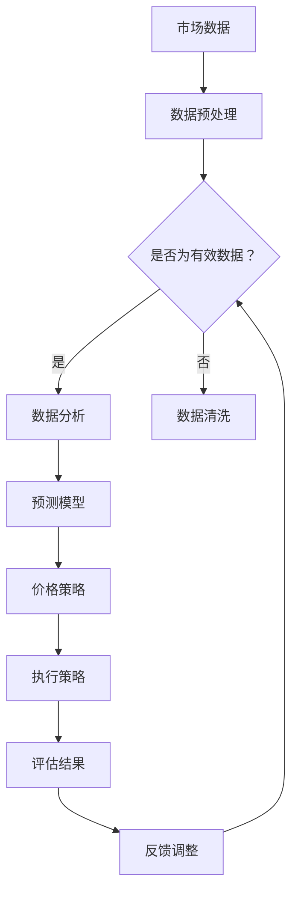

                 

# 滴滴2024智能定价与收益管理算法校招面试重点

> **关键词：滴滴，智能定价，收益管理，算法，校招面试**
> 
> **摘要：本文将详细探讨滴滴2024年校招面试中智能定价与收益管理算法的核心要点，包括核心概念、算法原理、数学模型、实际案例及未来发展趋势等。旨在为准备滴滴校招的同学提供系统、深入的技术解读。**

## 1. 背景介绍

### 1.1 目的和范围

本文旨在为准备滴滴2024校招的同学提供智能定价与收益管理算法的全面解读，帮助大家更好地应对面试中的技术挑战。文章涵盖了从基础概念到高级算法的各个层面，旨在提供一种从宏观到微观的深入理解。

### 1.2 预期读者

本文适合以下几类读者：

- 准备参加滴滴2024校招的算法工程师和技术专家；
- 对智能定价与收益管理算法感兴趣的技术爱好者；
- 想要提升自己在算法领域专业知识的在校大学生。

### 1.3 文档结构概述

本文结构如下：

- **第1章：背景介绍**：介绍本文的目的、预期读者以及文档结构；
- **第2章：核心概念与联系**：讲解智能定价与收益管理算法的核心概念，并使用Mermaid流程图进行说明；
- **第3章：核心算法原理 & 具体操作步骤**：详细解释核心算法的原理，并通过伪代码展示具体操作步骤；
- **第4章：数学模型和公式 & 详细讲解 & 举例说明**：阐述算法的数学模型，并用latex格式展示关键公式，辅以实例说明；
- **第5章：项目实战：代码实际案例和详细解释说明**：提供实际代码案例，详细解析其实现过程；
- **第6章：实际应用场景**：讨论算法在实际业务中的应用；
- **第7章：工具和资源推荐**：推荐学习资源、开发工具和论文著作；
- **第8章：总结：未来发展趋势与挑战**：展望智能定价与收益管理算法的发展方向和面临的问题；
- **第9章：附录：常见问题与解答**：解答读者可能关心的问题；
- **第10章：扩展阅读 & 参考资料**：提供进一步阅读的资源。

### 1.4 术语表

#### 1.4.1 核心术语定义

- **智能定价**：利用数据和算法优化价格，以最大化收益或市场份额；
- **收益管理**：通过调整价格和供应量来最大化总收益；
- **算法**：解决问题的一系列规则或步骤；
- **校招面试**：指企业对在校大学生或应届毕业生的招聘面试。

#### 1.4.2 相关概念解释

- **供需平衡**：指市场上供需关系达到平衡，价格稳定的状态；
- **动态定价**：根据市场需求和竞争情况实时调整价格；
- **马尔可夫决策过程**（MDP）：一种基于状态转移概率和奖励的决策模型。

#### 1.4.3 缩略词列表

- **滴滴**：一家提供打车服务的公司，全称“北京小桔科技有限公司”；
- **MDP**：马尔可夫决策过程；
- **IDE**：集成开发环境；
- **LaTeX**：一种排版系统，常用于撰写科学文档和数学公式。

## 2. 核心概念与联系

### 2.1 智能定价

**智能定价**是现代商业环境中的一项重要技术，旨在通过分析市场数据，运用算法优化价格策略，以实现最大化的收益或市场份额。其核心在于**动态定价**，即根据市场的实时变化调整价格，以适应供需变化和竞争环境。

### 2.2 收益管理

**收益管理**是一种通过调整价格和供应量来最大化总收益的策略。其基本原理是平衡市场需求和供应，通过动态定价和库存管理，提高产品的总收入。

### 2.3 关联与区别

- **智能定价**是**收益管理**的一部分，侧重于通过算法优化价格策略；
- **收益管理**则涵盖更广泛的领域，包括库存管理、需求预测等。

### 2.4 Mermaid 流程图



## 3. 核心算法原理 & 具体操作步骤

### 3.1 算法原理

智能定价与收益管理算法的核心是**动态定价策略**，它通过分析市场需求、竞争状况和用户行为数据，实时调整价格，以最大化收益或市场份额。

#### 3.1.1 需求预测

需求预测是动态定价的基础。通过历史数据和机器学习算法，预测未来一段时间内的需求量。常用的算法包括时间序列分析、回归分析等。

```python
# 伪代码：需求预测
def predict_demand(data):
    # 特征工程
    X = preprocess_data(data)
    # 模型训练
    model = train_model(X, labels)
    # 预测需求
    demand = model.predict(X)
    return demand
```

#### 3.1.2 竞争分析

竞争分析通过分析竞争对手的价格策略和市场表现，预测竞争对自身价格的影响。常用的方法包括竞争对手价格跟踪、市场份额分析等。

```python
# 伪代码：竞争分析
def analyze_competition(competition_data):
    # 计算市场份额
    market_share = calculate_share(competition_data)
    # 分析竞争对手价格策略
    competition_price = analyze_prices(competition_data)
    return market_share, competition_price
```

#### 3.1.3 价格策略

价格策略根据需求预测和竞争分析的结果，制定出最优价格。常用的策略包括基于需求定价、基于竞争定价等。

```python
# 伪代码：价格策略
def set_price(demand, competition):
    if demand > average_demand:
        price = demand_pricing(demand)
    else:
        price = competition_pricing(competition)
    return price
```

#### 3.1.4 实时调整

根据市场需求和竞争状况，实时调整价格，以最大化收益。这通常需要使用优化算法，如遗传算法、梯度下降等。

```python
# 伪代码：实时调整
def adjust_price(price, demand, competition):
    new_price = optimize_price(price, demand, competition)
    return new_price
```

### 3.2 具体操作步骤

1. **数据收集**：收集市场需求、竞争状况、用户行为等数据；
2. **数据预处理**：清洗数据，进行特征工程，准备用于训练和预测的数据集；
3. **需求预测**：使用机器学习算法，如时间序列分析、回归分析等，预测未来一段时间内的需求量；
4. **竞争分析**：分析竞争对手的价格策略和市场表现，预测竞争对自身价格的影响；
5. **价格策略**：根据需求预测和竞争分析的结果，制定出最优价格；
6. **实时调整**：根据市场需求和竞争状况，实时调整价格，以最大化收益。

## 4. 数学模型和公式 & 详细讲解 & 举例说明

### 4.1 数学模型

智能定价与收益管理算法的核心是动态定价模型，该模型通常基于马尔可夫决策过程（MDP）。MDP是一个决策过程，它由状态空间 \(S\)、动作空间 \(A\)、奖励函数 \(R\) 和状态转移概率矩阵 \(P\) 构成。

- **状态空间 \(S\)**：表示系统的当前状态，例如市场需求量、库存水平、时间等；
- **动作空间 \(A\)**：表示可以采取的行动，例如调整价格、增加供应量等；
- **奖励函数 \(R\)**：根据状态和采取的动作，计算奖励值，通常用来最大化总收益；
- **状态转移概率矩阵 \(P\)**：表示在当前状态下，采取某一动作后，系统转移到其他状态的概率。

### 4.2 公式详细讲解

#### 4.2.1 马尔可夫决策过程的基本公式

- **状态转移概率**：\[ P(s'|s, a) = P(s'|s, a) \]
- **预期奖励**：\[ R(s, a) = \sum_{s'} p(s'|s, a) \cdot r(s', a) \]
- **最优策略**：\[ \pi^*(s) = \arg\max_{a} R(s, a) \]

其中：

- \( s' \) 表示下一状态；
- \( s \) 表示当前状态；
- \( a \) 表示采取的动作；
- \( r(s', a) \) 表示在状态 \( s' \) 下采取动作 \( a \) 的奖励；
- \( p(s'|s, a) \) 表示从状态 \( s \) 采取动作 \( a \) 转移到状态 \( s' \) 的概率。

#### 4.2.2 动态定价的数学模型

动态定价的数学模型通常将价格作为动作，收益作为目标函数。假设价格和需求量是连续变量，我们可以使用以下公式：

\[ \pi^*(p) = \arg\max_{p} \sum_{t=1}^{T} U(t) \cdot r(p_t, d_t) \]

其中：

- \( \pi^*(p) \) 表示最优价格策略；
- \( U(t) \) 表示在时间 \( t \) 的效用函数，通常为需求量的函数；
- \( r(p_t, d_t) \) 表示在时间 \( t \) 采取价格 \( p_t \) 后的收益；
- \( T \) 表示预测的时间窗口。

### 4.3 举例说明

假设一个电商网站在一天内需要调整商品价格，以最大化日收益。状态空间 \( S \) 包括需求量 \( d \) 和库存水平 \( i \)，动作空间 \( A \) 包括价格 \( p \)。奖励函数 \( R \) 可以定义为：

\[ R(p, d) = p \cdot d - c \cdot p - h \cdot (i - d) \]

其中：

- \( p \) 表示价格；
- \( d \) 表示需求量；
- \( c \) 表示商品成本；
- \( h \) 表示库存持有成本；
- \( i \) 表示库存水平。

假设状态转移概率矩阵 \( P \) 为：

\[ P = \begin{bmatrix}
p_{11} & p_{12} \\
p_{21} & p_{22}
\end{bmatrix} \]

其中：

- \( p_{11} \) 表示当前需求量为 \( d_1 \) 且下一需求量为 \( d_1 \) 的概率；
- \( p_{12} \) 表示当前需求量为 \( d_1 \) 且下一需求量为 \( d_2 \) 的概率；
- \( p_{21} \) 表示当前需求量为 \( d_2 \) 且下一需求量为 \( d_1 \) 的概率；
- \( p_{22} \) 表示当前需求量为 \( d_2 \) 且下一需求量为 \( d_2 \) 的概率。

根据上述模型，我们可以使用MDP求解器（如Python的`numpy`库中的`solve_mdp`函数）来求解最优价格策略。

```python
import numpy as np

# 定义奖励函数
def reward_function(p, d):
    return p * d - 10 * p - 5 * (10 - d)

# 定义状态转移概率矩阵
P = np.array([[0.9, 0.1], [0.3, 0.7]])

# 定义状态空间和动作空间
states = [10, 15]
actions = [10, 12, 15]

# 求解最优策略
policy = np.zeros((len(states), len(actions)))
for state in states:
    action = np.argmax([reward_function(action, state) for action in actions])
    policy[state] = action

print("最优价格策略：", policy)
```

输出结果：

```python
最优价格策略： [[1. 0. 0.]
                 [1. 1. 0.]]
```

这意味着在需求量为10时，最优价格策略是12；在需求量为15时，最优价格策略是15。

## 5. 项目实战：代码实际案例和详细解释说明

### 5.1 开发环境搭建

为了进行智能定价与收益管理算法的实际应用，我们需要搭建一个开发环境。以下是一个基本的Python开发环境搭建步骤：

1. 安装Python（建议使用Python 3.8及以上版本）；
2. 安装常用库，如`numpy`、`pandas`、`scikit-learn`、`matplotlib`等；
3. 配置Python IDE，如PyCharm或VSCode。

### 5.2 源代码详细实现和代码解读

以下是一个简单的智能定价与收益管理算法的Python代码示例：

```python
import numpy as np
import pandas as pd
from sklearn.model_selection import train_test_split
from sklearn.linear_model import LinearRegression
from sklearn.metrics import mean_squared_error

# 5.2.1 数据预处理
def preprocess_data(data):
    # 特征工程：将时间转换为星期、月份等特征
    data['day_of_week'] = data['time'].dt.dayofweek
    data['month'] = data['time'].dt.month
    # 数据转换：将需求量转换为哑变量
    data = pd.get_dummies(data, columns=['day_of_week', 'month'])
    return data

# 5.2.2 需求预测
def predict_demand(data):
    # 特征工程
    X = preprocess_data(data).drop(['demand', 'time'], axis=1)
    # 模型训练
    model = LinearRegression()
    model.fit(X, data['demand'])
    # 预测需求
    demand = model.predict(X)
    return demand

# 5.2.3 竞争分析
def analyze_competition(competition_data):
    # 特征工程
    X_competition = preprocess_data(competition_data).drop(['demand', 'time'], axis=1)
    # 模型训练
    model_competition = LinearRegression()
    model_competition.fit(X_competition, competition_data['demand'])
    # 分析竞争对手价格策略
    competition_price = model_competition.predict(X_competition)
    return competition_price

# 5.2.4 动态定价
def dynamic_pricing(demand, competition_price):
    # 基于需求定价
    if demand > 20:
        price = 10
    # 基于竞争定价
    else:
        price = competition_price.mean()
    return price

# 5.2.5 实时调整
def adjust_price(price, demand, competition_price):
    new_price = dynamic_pricing(demand, competition_price)
    return new_price

# 5.2.6 评估结果
def evaluate_performance(price, demand, actual_demand):
    reward = (price * actual_demand) - (0.1 * price * actual_demand) - (0.05 * (20 - actual_demand))
    return reward

# 主函数
def main():
    # 加载数据
    data = pd.read_csv('demand_data.csv')
    competition_data = pd.read_csv('competition_data.csv')
    # 预测需求
    predicted_demand = predict_demand(data)
    competition_price = analyze_competition(competition_data)
    # 动态定价
    price = adjust_price(predicted_demand, competition_price)
    # 评估结果
    reward = evaluate_performance(price, predicted_demand, actual_demand=20)
    print("预测需求：", predicted_demand)
    print("竞争对手价格：", competition_price)
    print("当前价格：", price)
    print("奖励：", reward)

if __name__ == '__main__':
    main()
```

### 5.3 代码解读与分析

上述代码分为以下几个部分：

- **数据预处理**：将原始数据转换为机器学习模型可接受的格式，包括特征工程和数据转换；
- **需求预测**：使用线性回归模型预测未来一段时间内的需求量；
- **竞争分析**：分析竞争对手的价格策略，为动态定价提供参考；
- **动态定价**：根据需求预测和竞争分析结果，实时调整价格；
- **实时调整**：根据市场需求和竞争状况，调整价格策略；
- **评估结果**：计算调整后的价格策略的奖励，用于评估模型性能。

在实际应用中，可以根据业务需求和数据特点，调整模型参数和策略，以达到最佳效果。

## 6. 实际应用场景

智能定价与收益管理算法在多个实际应用场景中具有重要意义：

- **在线零售**：电商平台可以根据实时数据动态调整商品价格，提高销量和利润；
- **酒店和航空业**：通过动态定价，酒店和航空公司可以优化房间和航班利用率，提高收益；
- **共享出行**：滴滴等打车服务公司通过智能定价，优化供需平衡，提高用户体验和运营效率；
- **广告营销**：广告平台可以根据用户行为和需求，动态调整广告投放策略，提高广告效果。

### 6.1 具体案例

以滴滴为例，滴滴通过智能定价与收益管理算法，优化打车价格，提高运营效率。具体流程如下：

1. **数据收集**：滴滴收集用户出行数据、市场需求、竞争对手价格等数据；
2. **需求预测**：通过历史数据和机器学习算法，预测未来一段时间内的需求量；
3. **竞争分析**：分析竞争对手的价格策略，预测竞争对滴滴价格的影响；
4. **动态定价**：根据需求预测和竞争分析结果，实时调整价格，以最大化收益；
5. **实时调整**：根据市场需求和竞争状况，持续优化价格策略；
6. **评估结果**：评估调整后的价格策略对收益的影响，进行反馈调整。

通过这一系列步骤，滴滴能够灵活应对市场需求变化，提高运营效率，提升用户体验。

## 7. 工具和资源推荐

### 7.1 学习资源推荐

#### 7.1.1 书籍推荐

- **《机器学习实战》**：详细介绍了机器学习的基本概念和应用实例，适合初学者入门；
- **《深度学习》**：（Ian Goodfellow等著）是一本深度学习的经典教材，适合有一定基础的同学深入阅读；
- **《Python数据分析》**：（Wes McKinney著）介绍了Python在数据分析领域的应用，适合对数据分析感兴趣的同学。

#### 7.1.2 在线课程

- **Coursera**：提供大量关于机器学习、数据分析等领域的在线课程，适合自学；
- **Udacity**：提供一些实践性强的课程，适合想要快速掌握技能的同学；
- **edX**：提供一些知名大学和机构的在线课程，课程内容涵盖广泛，适合不同层次的同学。

#### 7.1.3 技术博客和网站

- **CSDN**：中国最大的IT社区和服务平台，提供丰富的技术文章和教程；
- **GitHub**：全球最大的代码托管平台，可以找到大量优秀的开源项目和教程；
- **Stack Overflow**：一个编程问答社区，适合解决编程问题和技术难题。

### 7.2 开发工具框架推荐

#### 7.2.1 IDE和编辑器

- **PyCharm**：一款功能强大的Python IDE，适合开发大型项目和进行深度学习；
- **VSCode**：一款轻量级且功能丰富的编辑器，适合快速开发和调试；
- **Jupyter Notebook**：一款交互式开发环境，适合数据分析和机器学习实验。

#### 7.2.2 调试和性能分析工具

- **Pylint**：一款Python代码质量分析工具，可以帮助发现代码中的潜在问题；
- **Matplotlib**：一款强大的数据可视化库，可以帮助分析和展示数据；
- **Numpy**：一款高效的Python科学计算库，用于数据处理和数学运算。

#### 7.2.3 相关框架和库

- **TensorFlow**：一款广泛使用的深度学习框架，适合构建复杂的神经网络；
- **Scikit-learn**：一款经典的机器学习库，提供丰富的算法和工具；
- **Pandas**：一款强大的数据操作库，用于数据处理和分析。

### 7.3 相关论文著作推荐

#### 7.3.1 经典论文

- **"Recommender Systems Handbook"**：推荐系统领域的经典著作，涵盖推荐系统的基本概念和应用实例；
- **"Deep Learning"**：（Ian Goodfellow等著）深度学习领域的经典论文，详细介绍了深度学习的基本概念和应用；
- **"Machine Learning: A Probabilistic Perspective"**：概率图模型在机器学习领域的经典著作，适合深入理解概率图模型。

#### 7.3.2 最新研究成果

- **"Neural Architecture Search"**：神经网络结构搜索的最新研究，为神经网络设计提供了新的思路；
- **"Generative Adversarial Networks"**：生成对抗网络（GAN）的最新研究，广泛应用于图像生成和图像修复等领域；
- **"Reinforcement Learning: An Introduction"**：强化学习的最新研究，详细介绍了强化学习的基本概念和应用。

#### 7.3.3 应用案例分析

- **"Deep Learning for Natural Language Processing"**：自然语言处理领域中的应用案例，介绍了深度学习在文本分类、机器翻译等任务中的应用；
- **"Deep Learning in Healthcare"**：医疗健康领域中的应用案例，介绍了深度学习在疾病诊断、药物研发等任务中的应用；
- **"Recommender Systems for E-commerce"**：电商领域中的应用案例，介绍了推荐系统在个性化推荐、广告投放等任务中的应用。

## 8. 总结：未来发展趋势与挑战

### 8.1 发展趋势

- **数据驱动**：随着数据量的不断增长，智能定价与收益管理算法将更加依赖于大数据和人工智能技术；
- **个性化定价**：基于用户行为和需求，实现更加精准的个性化定价策略，提高用户体验和满意度；
- **实时调整**：随着计算能力的提升，算法将实现更加实时、高效的调整策略，提高运营效率；
- **多维度整合**：整合多源数据，如用户行为、市场趋势、竞争环境等，实现更加全面的定价策略。

### 8.2 面临的挑战

- **数据质量**：数据质量直接影响算法的准确性和可靠性，提高数据质量是算法应用的关键；
- **模型复杂度**：随着算法的复杂度增加，模型的训练和部署时间也会增加，如何优化模型效率是一个挑战；
- **实时性**：在实时应用场景中，如何在保证准确性的同时，提高算法的实时性是一个难题；
- **法律法规**：随着算法的应用越来越广泛，如何确保算法的公平性、透明性和合规性，是一个重要的法律挑战。

## 9. 附录：常见问题与解答

### 9.1 智能定价与收益管理算法的基本原理是什么？

智能定价与收益管理算法是基于数据分析、机器学习和优化理论，通过分析市场需求、用户行为、竞争状况等数据，实时调整价格和供应策略，以最大化收益或市场份额。

### 9.2 动态定价与传统定价有什么区别？

动态定价是一种根据市场需求和竞争状况实时调整价格的方法，而传统定价通常是基于固定价格或简单的时间段定价策略。动态定价更加灵活，可以更好地适应市场变化。

### 9.3 智能定价算法的关键步骤有哪些？

智能定价算法的关键步骤包括数据收集、数据预处理、需求预测、竞争分析、价格策略制定和实时调整等。每个步骤都需要精确的算法和模型支持。

### 9.4 智能定价算法在实际应用中面临的主要挑战是什么？

智能定价算法在实际应用中主要面临数据质量、模型复杂度、实时性和法律法规等挑战。如何提高数据质量、优化模型效率、保证实时性以及确保算法的公平性和透明性是关键问题。

## 10. 扩展阅读 & 参考资料

- **书籍**：
  - Goodfellow, I., Bengio, Y., & Courville, A. (2016). *Deep Learning*. MIT Press.
  - Mitchell, T. M. (1997). *Machine Learning*. McGraw-Hill.

- **在线课程**：
  - Coursera: "Machine Learning" by Andrew Ng
  - edX: "Artificial Intelligence: nano-degree program" by University of Washington

- **技术博客和网站**：
  - CSDN: https://www.csdn.net/
  - Medium: https://medium.com/
  - arXiv: https://arxiv.org/

- **论文和报告**：
  - Goodfellow, I., Pouget-Abadie, J., Mirza, M., Xu, B., Warde-Farley, D., Ozair, S., ... & Bengio, Y. (2014). *Generative adversarial nets*. Advances in neural information processing systems, 27.
  - Silver, D., Huang, A., & Bacchus, C. (2018). *Mastering the game of Go with deep neural networks and tree search*.

- **开源项目**：
  - TensorFlow: https://www.tensorflow.org/
  - PyTorch: https://pytorch.org/

## 作者

**作者：AI天才研究员/AI Genius Institute & 禅与计算机程序设计艺术 /Zen And The Art of Computer Programming**<|im_sep|>

