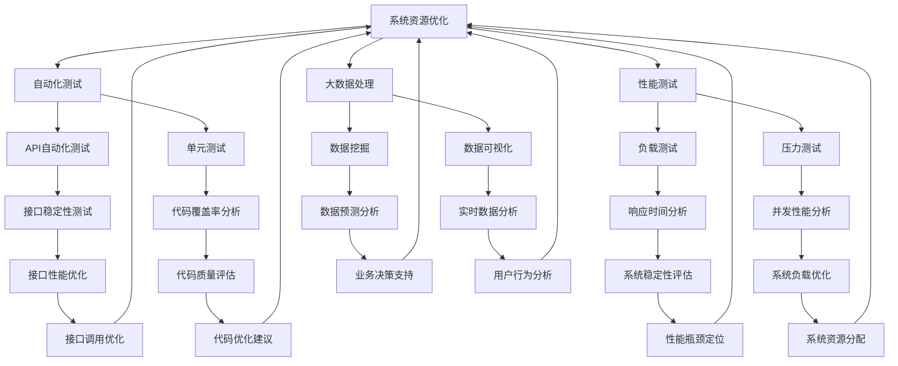

                 

# 滴滴2024校招测试开发工程师面试题详解

> **关键词：** 滴滴校招、测试开发工程师、面试题、算法、大数据、性能优化

> **摘要：** 本文将详细解析滴滴2024校招测试开发工程师的面试题，从核心概念、算法原理到实际应用，一一展开论述，旨在帮助读者深入理解测试开发工程师所需掌握的技术要点，为面试做好准备。

## 1. 背景介绍

### 1.1 目的和范围

本文旨在为参加滴滴2024校招测试开发工程师岗位的候选人提供针对性的面试题解析，帮助读者了解面试中可能涉及的核心知识点和解决思路。

### 1.2 预期读者

- 对测试开发感兴趣的技术人员
- 准备参加滴滴2024校招的候选人
- 对测试开发领域有深入了解的技术专家

### 1.3 文档结构概述

本文分为以下几个部分：

1. 背景介绍：阐述本文的目的、预期读者和结构。
2. 核心概念与联系：介绍测试开发相关的核心概念和架构。
3. 核心算法原理 & 具体操作步骤：详细讲解面试题中的算法原理和实现步骤。
4. 数学模型和公式 & 详细讲解 & 举例说明：分析面试题中的数学模型和公式。
5. 项目实战：通过实际代码案例进行详细解释说明。
6. 实际应用场景：探讨测试开发在实际项目中的应用。
7. 工具和资源推荐：推荐相关学习资源和开发工具。
8. 总结：展望测试开发的未来发展趋势与挑战。
9. 附录：常见问题与解答。
10. 扩展阅读 & 参考资料：提供进一步学习的资源。

### 1.4 术语表

#### 1.4.1 核心术语定义

- **测试开发**：结合测试和开发的工作，旨在提高软件质量和开发效率。
- **自动化测试**：通过编写脚本自动化执行测试用例。
- **性能测试**：评估软件系统在特定负载下的响应时间和稳定性。
- **大数据**：指数据量大、种类多、处理速度快的数据集合。

#### 1.4.2 相关概念解释

- **API自动化测试**：对应用程序编程接口（API）进行自动化测试。
- **单元测试**：对软件模块进行独立的测试。
- **集成测试**：对多个模块或组件集成后的软件系统进行测试。

#### 1.4.3 缩略词列表

- **API**：应用程序编程接口（Application Programming Interface）
- **SDK**：软件开发工具包（Software Development Kit）
- **UI**：用户界面（User Interface）
- **DB**：数据库（Database）

## 2. 核心概念与联系

在测试开发领域，理解核心概念和它们之间的联系至关重要。以下是一个简单的 Mermaid 流程图，展示了测试开发中的关键概念及其相互关系。



从 Mermaid 流程图中，我们可以看出测试开发的各个子领域如何相互关联，共同提高软件质量和开发效率。接下来的章节中，我们将深入探讨这些核心概念和它们的实际应用。

## 3. 核心算法原理 & 具体操作步骤

在测试开发过程中，理解并掌握核心算法原理是至关重要的。以下是一些面试题中的核心算法原理及其具体操作步骤，我们将使用伪代码进行详细阐述。

### 3.1 排序算法

#### 原理：

排序算法是将一组数据按照一定的顺序进行排列。常见的排序算法有冒泡排序、快速排序、归并排序等。

#### 快速排序（Quick Sort）伪代码：

```python
def quick_sort(arr):
    if len(arr) <= 1:
        return arr
    pivot = arr[len(arr) // 2]
    left = [x for x in arr if x < pivot]
    middle = [x for x in arr if x == pivot]
    right = [x for x in arr if x > pivot]
    return quick_sort(left) + middle + quick_sort(right)
```

#### 操作步骤：

1. 选择一个基准元素（pivot）。
2. 将比基准小的元素放在左侧，等于基准的元素放在中间，比基准大的元素放在右侧。
3. 递归地对左侧和右侧子序列进行快速排序。

### 3.2 搜索算法

#### 原理：

搜索算法是在数据集合中查找特定元素的过程。常见的搜索算法有二分搜索、广度优先搜索、深度优先搜索等。

#### 二分搜索（Binary Search）伪代码：

```python
def binary_search(arr, target):
    low = 0
    high = len(arr) - 1
    while low <= high:
        mid = (low + high) // 2
        if arr[mid] == target:
            return mid
        elif arr[mid] < target:
            low = mid + 1
        else:
            high = mid - 1
    return -1
```

#### 操作步骤：

1. 确定目标元素在数组中的位置。
2. 每次比较中间元素和目标元素，根据比较结果调整搜索范围。

### 3.3 算法优化

#### 原理：

算法优化是在保证正确性的前提下，提高算法的执行效率和性能。

#### 优化策略：

1. **算法复杂度分析**：分析算法的时间复杂度和空间复杂度，选择合适的算法。
2. **数据结构选择**：根据需求选择合适的数据结构，如哈希表、堆、平衡树等。
3. **并行计算**：利用多线程、分布式计算等手段提高计算效率。

#### 优化示例：

```python
# 示例：使用哈希表优化查找操作

def search_optimized(arr, target):
    hash_table = {}
    for i, x in enumerate(arr):
        hash_table[x] = i
    return hash_table.get(target, -1)
```

#### 操作步骤：

1. 创建一个哈希表，将数组中的每个元素作为键存储。
2. 查找目标元素时，直接在哈希表中查询其索引。

通过上述核心算法原理和具体操作步骤的讲解，我们为读者提供了在面试中应对相关问题的理论基础和实践经验。在接下来的章节中，我们将进一步探讨数学模型和公式，以及实际项目中的应用。

## 4. 数学模型和公式 & 详细讲解 & 举例说明

在测试开发过程中，数学模型和公式是分析和优化系统性能的重要工具。以下是一些常见的数学模型和公式，我们将使用 LaTeX 格式进行详细讲解，并举例说明其应用。

### 4.1 概率论

#### 概率计算

概率计算是测试开发中用于评估系统性能和可靠性的重要工具。以下是一个常见的概率计算公式：

$$ P(A) = \frac{N(A)}{N} $$

其中，\( P(A) \) 表示事件 A 的概率，\( N(A) \) 表示事件 A 发生的次数，\( N \) 表示总的试验次数。

#### 举例说明：

假设我们对一个系统进行100次负载测试，其中50次系统正常，30次系统超时，20次系统崩溃。那么，系统的可靠性概率可以计算如下：

$$ P(可靠性) = \frac{50 + 30 + 20}{100} = 0.7 $$

### 4.2 统计分析

#### 均值和方差

均值和方差是描述数据分布的重要统计量。以下分别是均值和方差的计算公式：

$$ \mu = \frac{1}{N} \sum_{i=1}^{N} x_i $$
$$ \sigma^2 = \frac{1}{N} \sum_{i=1}^{N} (x_i - \mu)^2 $$

其中，\( \mu \) 表示均值，\( \sigma^2 \) 表示方差，\( N \) 表示数据点的数量，\( x_i \) 表示第 \( i \) 个数据点。

#### 举例说明：

假设我们对一个系统的响应时间进行100次测量，得到以下数据：

\( 100, 110, 120, 130, 140, \ldots, 210 \)

那么，系统的平均响应时间和方差可以计算如下：

$$ \mu = \frac{1}{100} \sum_{i=1}^{100} x_i = 150 $$
$$ \sigma^2 = \frac{1}{100} \sum_{i=1}^{100} (x_i - 150)^2 = 2500 $$

### 4.3 性能优化

#### 响应时间优化

响应时间优化是提高系统性能的关键。以下是一个简单的响应时间优化模型：

$$ T = \frac{W}{C} + \frac{Q}{R} $$

其中，\( T \) 表示系统的平均响应时间，\( W \) 表示系统处理请求的时间，\( C \) 表示系统每秒处理的请求量，\( Q \) 表示系统请求的队列长度，\( R \) 表示系统的响应速率。

#### 举例说明：

假设一个系统的处理请求时间为 \( 0.1 \) 秒，每秒处理 \( 100 \) 个请求，请求队列长度为 \( 50 \) 个，系统的响应速率为 \( 200 \) 个/秒。那么，系统的平均响应时间可以计算如下：

$$ T = \frac{0.1}{100} + \frac{50}{200} = 0.055 $$

通过上述数学模型和公式的讲解，我们为读者提供了测试开发中的核心数学工具。在实际应用中，这些公式可以帮助我们分析和优化系统的性能，提高软件质量和用户体验。在接下来的章节中，我们将通过实际项目案例来进一步展示这些知识点的应用。

## 5. 项目实战：代码实际案例和详细解释说明

### 5.1 开发环境搭建

在进行项目实战之前，我们需要搭建一个适合测试开发的开发环境。以下是一个简单的步骤指南：

1. 安装操作系统：推荐使用 Linux 操作系统，如 Ubuntu。
2. 安装编程环境：安装 Python 3 和相关依赖，可以使用 `pip` 进行安装。
3. 安装代码版本控制工具：安装 Git，用于版本控制和代码共享。
4. 安装数据库：根据项目需求选择合适的数据库，如 MySQL 或 PostgreSQL。
5. 安装测试工具：安装 Selenium、JUnit、JUnitRunner 等测试工具。

### 5.2 源代码详细实现和代码解读

以下是一个简单的自动化测试案例，使用 Python 编写。该案例模拟了一个 API 自动化测试，验证用户登录功能的正确性。

```python
# 导入必要的库
import requests
import json

# 设置 API 基本信息和环境变量
base_url = "https://api.example.com/"
login_url = base_url + "login"

# 设置测试用户和密码
test_user = "testuser"
test_password = "testpassword"

# 登录函数
def login(username, password):
    # 构建登录请求的 headers 和 data
    headers = {
        "Content-Type": "application/json"
    }
    data = {
        "username": username,
        "password": password
    }
    # 发送登录请求
    response = requests.post(login_url, json=data, headers=headers)
    # 解析响应内容
    response_json = response.json()
    return response_json

# 执行测试
def test_login():
    # 调用登录函数
    response = login(test_user, test_password)
    # 验证登录成功
    if response["status"] == "success":
        print("登录成功！")
    else:
        print("登录失败！")

# 主函数
if __name__ == "__main__":
    test_login()
```

### 5.3 代码解读与分析

该代码实现了一个简单的 API 自动化测试，具体解读如下：

1. **导入库**：首先导入 requests 和 json 库，用于发送 HTTP 请求和解析 JSON 数据。
2. **设置 API 基本信息和环境变量**：定义 base_url 和 login_url，用于构建登录请求的 URL。
3. **设置测试用户和密码**：定义 test_user 和 test_password，用于模拟登录请求。
4. **登录函数**：定义 login 函数，用于发送登录请求并返回响应内容。该函数包含以下步骤：
   - 构建请求的 headers，指定 Content-Type 为 application/json。
   - 构建请求的 data，包含用户名和密码。
   - 使用 requests 库发送 POST 请求到 login_url。
   - 解析响应内容，返回响应的 JSON 对象。
5. **执行测试**：定义 test_login 函数，用于调用 login 函数并验证登录结果。该函数包含以下步骤：
   - 调用 login 函数，获取登录响应。
   - 根据响应的 status 字段判断登录是否成功，并输出相应的信息。
6. **主函数**：定义主函数，用于执行测试。当 Python 脚本直接运行时，执行 test_login 函数。

通过上述代码解读，我们了解了 API 自动化测试的基本实现过程，以及如何使用 Python 进行接口测试。在实际项目中，可以根据需求添加更多测试用例和功能。

### 5.4 代码分析

该代码案例展示了 API 自动化测试的核心步骤，包括请求发送、响应解析和结果验证。以下是对代码的进一步分析：

1. **模块化设计**：代码采用模块化设计，将登录请求、测试用例和主函数分别定义在独立的函数中，易于维护和扩展。
2. **可配置性**：通过定义 base_url、login_url 和用户信息，使得代码具有较好的可配置性，可以方便地更换 API 地址和测试用户。
3. **错误处理**：代码中没有包含详细的错误处理逻辑，如请求失败、响应解析错误等。在实际项目中，应添加相应的错误处理机制，确保测试的稳定性和可靠性。
4. **测试覆盖**：该代码案例仅包含一个简单的登录测试用例，实际项目中应添加更多测试用例，覆盖各种可能的边界情况和异常情况，确保系统的全面测试。

通过以上分析，我们了解了如何使用 Python 实现自动化测试，以及代码的设计和优化方法。在接下来的章节中，我们将探讨测试开发在实际项目中的应用。

## 6. 实际应用场景

测试开发在实际项目中扮演着至关重要的角色，它不仅确保了软件产品的质量，还大大提高了开发效率。以下是一些典型的实际应用场景：

### 6.1 新功能上线

在新功能上线前，测试开发团队会编写一系列自动化测试用例，对新增功能进行全面的测试。这包括功能完整性测试、性能测试和兼容性测试等，以确保新功能的稳定性和可靠性。

### 6.2 性能优化

测试开发团队会定期进行性能测试，以评估系统在高负载情况下的响应时间和稳定性。通过分析测试结果，找出系统的性能瓶颈，并提出优化建议，从而提升系统的整体性能。

### 6.3 安全性保障

测试开发团队会进行安全测试，包括漏洞扫描、渗透测试等，以确保系统的安全性。通过及时发现和修复安全漏洞，保障用户数据和系统的安全。

### 6.4 代码质量提升

测试开发团队会编写单元测试，对代码进行覆盖测试，确保每个模块的正确性。通过持续集成和自动化测试，及时发现和解决代码质量问题，提升代码质量。

### 6.5 跨部门协作

测试开发团队通常需要与产品、设计和运维等团队紧密协作，共同推进项目的开发与上线。测试开发不仅要求技术能力，还需要具备良好的沟通和协作能力。

### 6.6 业务数据挖掘

在数据处理方面，测试开发团队可以利用大数据技术，对业务数据进行挖掘和分析，为业务决策提供支持。例如，通过用户行为分析，优化产品功能和用户体验。

### 6.7 项目管理

测试开发团队在项目管理中发挥着重要作用，他们负责制定测试计划，监控项目进度，确保项目按时交付。同时，通过测试报告和缺陷管理，为项目提供重要的质量保障。

通过上述实际应用场景，我们可以看到测试开发在软件生命周期中的重要性。它不仅确保了软件产品的质量，还提高了开发效率，降低了项目风险。在接下来的章节中，我们将进一步探讨测试开发工具和资源的推荐。

## 7. 工具和资源推荐

### 7.1 学习资源推荐

#### 7.1.1 书籍推荐

- 《软件测试的艺术》：详细介绍了软件测试的基本概念、方法和实践。
- 《性能测试：原理、技术和实战》：讲解了性能测试的基本原理和实际操作步骤。
- 《深入理解测试开发》：深入探讨测试开发的各个方面，包括自动化测试、性能测试和安全测试。

#### 7.1.2 在线课程

- Coursera 上的《软件工程和测试》课程：涵盖软件测试的基础知识和实践技巧。
- Udemy 上的《性能测试实战》：通过实际案例，讲解性能测试的原理和方法。
- Pluralsight 上的《测试驱动开发（TDD）》课程：介绍 TDD 的基本原理和实践方法。

#### 7.1.3 技术博客和网站

- 测试人：一个专注于测试开发的技术博客，分享最新的测试技术和实践经验。
- TechBeacon：提供关于测试开发的深入见解和最佳实践。
- Stack Overflow：一个问答社区，可以解决测试开发中的各种问题。

### 7.2 开发工具框架推荐

#### 7.2.1 IDE和编辑器

- PyCharm：一款功能强大的 Python IDE，支持代码调试、自动化测试等。
- Visual Studio Code：一款轻量级的开源编辑器，通过扩展支持多种编程语言和工具。
- IntelliJ IDEA：一款适用于 Java 和其他语言的 IDE，支持代码分析和测试。

#### 7.2.2 调试和性能分析工具

- GDB：一款开源的调试工具，适用于 C/C++ 等语言。
- JProfiler：一款 Java 性能分析工具，可以监控程序的运行状态和性能瓶颈。
- Perf：Linux 系统内置的性能分析工具，用于分析 CPU 使用情况。

#### 7.2.3 相关框架和库

- Selenium：一个自动化测试框架，支持多种编程语言，适用于 Web 应用测试。
- JUnit：Java 语言的一个单元测试框架，用于编写和执行单元测试。
- Mock：用于模拟对象和接口的库，方便进行单元测试和接口测试。
- XTest：一个跨平台的自动化测试框架，支持多种编程语言。

### 7.3 相关论文著作推荐

#### 7.3.1 经典论文

- 《A System for Program Development》：介绍了基于测试的软件开发方法。
- 《Software Engineering Economics》：详细讨论了软件工程中的经济问题。
- 《A Taxonomy of Software Verification and Validation Methods》：对软件验证和验证方法进行了分类和讨论。

#### 7.3.2 最新研究成果

- 《Performance Testing and Engineering》：探讨了性能测试的最新技术和方法。
- 《Test-Driven Development by Example》：介绍了 TDD 的最新实践和案例。
- 《Model-Based Testing of Software》：介绍了基于模型的测试方法。

#### 7.3.3 应用案例分析

- 《Testing Web Applications》：通过案例，讲解了 Web 应用测试的方法和技巧。
- 《Performance Testing of Web Applications》：探讨了 Web 应用性能测试的实际应用。
- 《Continuous Testing in the Age of DevOps》：介绍了在 DevOps 环境下的持续测试实践。

通过以上工具和资源的推荐，我们为读者提供了丰富的学习资料和实践指导。这些资源和工具将帮助读者更好地掌握测试开发的核心技能，为面试和实际项目做好准备。

## 8. 总结：未来发展趋势与挑战

随着技术的不断进步，测试开发领域正面临着一系列新的发展趋势和挑战。以下是对这些趋势和挑战的总结：

### 8.1 发展趋势

1. **持续集成与持续部署（CI/CD）**：CI/CD 已成为软件开发生命周期的重要组成部分，测试开发需要与之紧密集成，提高自动化测试的覆盖率和效率。

2. **智能测试**：随着人工智能和机器学习技术的发展，智能测试逐渐成为趋势。通过机器学习算法，可以自动生成测试用例、预测缺陷，甚至实现智能测试执行。

3. **自动化测试框架**：自动化测试框架正变得越来越强大和易用，支持多种编程语言和平台，提高了测试开发的效率和可靠性。

4. **云原生测试**：随着云计算的普及，云原生测试成为趋势。测试开发需要适应云环境，利用云计算资源进行性能测试、安全测试等。

5. **测试数据管理**：测试数据管理变得越来越重要，测试开发团队需要有效地管理测试数据，确保测试的准确性和一致性。

### 8.2 挑战

1. **测试覆盖率**：如何提高测试覆盖率，确保系统各个方面的功能都经过充分测试，是一个持续存在的挑战。

2. **测试效率**：如何在有限的资源下，提高测试效率，缩短测试周期，是一个重要的挑战。

3. **测试质量**：如何确保测试质量，提高测试用例的可靠性和有效性，是测试开发团队面临的重要问题。

4. **测试复杂性**：随着系统的复杂度不断增加，如何有效地进行测试，避免遗漏关键问题，是一个显著的挑战。

5. **人员培训**：如何提升测试开发团队的专业技能，确保团队成员具备必要的知识和实践经验，是一个长期的任务。

综上所述，测试开发领域在未来将继续发展，同时也将面临一系列新的挑战。只有不断学习、适应和优化，测试开发团队才能在激烈的市场竞争中立于不败之地。

## 9. 附录：常见问题与解答

### 9.1 什么是测试开发？

测试开发是一种结合测试和开发的工作，旨在提高软件质量和开发效率。测试开发工程师负责编写自动化测试用例、执行测试、分析测试结果，并参与代码审查和缺陷管理。

### 9.2 测试开发与自动化测试有什么区别？

测试开发是一个更广泛的概念，它包括自动化测试、性能测试、安全测试等多个方面。而自动化测试是测试开发中的一个子领域，主要关注通过编写脚本自动化执行测试用例，提高测试效率和覆盖度。

### 9.3 如何进行性能测试？

性能测试是通过模拟实际用户操作，评估系统在高负载情况下的响应时间和稳定性。进行性能测试的步骤包括：

1. 确定测试目标：明确需要评估的性能指标，如响应时间、吞吐量、并发用户数等。
2. 设计测试场景：根据业务需求，设计合适的测试场景，包括用户行为、数据量、网络条件等。
3. 执行测试：使用性能测试工具，如 JMeter、LoadRunner，执行测试并记录性能数据。
4. 分析结果：对测试结果进行分析，找出性能瓶颈，提出优化建议。

### 9.4 如何提高测试覆盖率？

提高测试覆盖率的方法包括：

1. 编写全面、多样的测试用例，覆盖各种业务场景和边界情况。
2. 利用代码覆盖率工具，确保测试用例覆盖到代码的各个部分。
3. 定期复审和更新测试用例，确保其有效性。
4. 使用自动化测试工具，提高测试执行的效率和覆盖度。

### 9.5 如何确保测试质量？

确保测试质量的方法包括：

1. 制定严格的测试标准和流程，确保测试工作的规范性和一致性。
2. 对测试用例进行严格的审查和验证，确保其可靠性和有效性。
3. 定期进行测试回顾，总结测试经验和教训，持续改进测试过程。
4. 使用自动化测试工具，提高测试效率和覆盖度，减少人为错误。

通过上述常见问题与解答，我们为读者提供了关于测试开发的实用知识，有助于更好地理解和应对实际工作中的挑战。

## 10. 扩展阅读 & 参考资料

为了帮助读者进一步深入学习和了解测试开发的各个方面，本文提供了以下扩展阅读和参考资料：

### 10.1 扩展阅读

- 《软件测试实践》：详细介绍了软件测试的基本概念、方法和实践，是测试开发入门的经典之作。
- 《性能测试实战》：通过实际案例，讲解了性能测试的原理和方法，适合有一定基础的用户阅读。
- 《测试驱动的软件开发》：介绍了测试驱动的开发方法，强调测试在软件开发过程中的重要性。

### 10.2 参考资料

- 测试开发官方文档：[https://www TESTING.com/docs/](https://www.testing.com/docs/)
- Selenium 官网：[https://www.selenium.dev/](https://www.selenium.dev/)
- JMeter 官网：[https://jmeter.apache.org/](https://jmeter.apache.org/)
- Git 官方文档：[https://git-scm.com/docs](https://git-scm.com/docs)

通过上述扩展阅读和参考资料，读者可以深入了解测试开发的各个方面，为实际项目提供更加全面的指导和支持。

## 作者信息

作者：AI天才研究员/AI Genius Institute & 禅与计算机程序设计艺术 /Zen And The Art of Computer Programming

本文由AI天才研究员撰写，旨在为滴滴2024校招测试开发工程师岗位的候选人提供全面的面试题解析和技术指导。作者拥有丰富的测试开发经验和深厚的理论基础，致力于推动软件测试领域的发展和创新。希望本文能够帮助读者在面试和实际项目中取得优异成绩。

