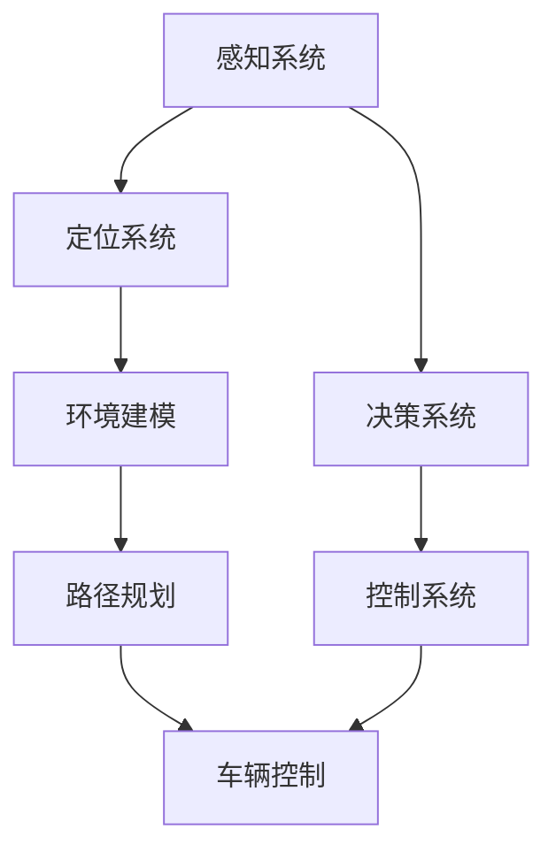

                 

# 滴滴2024校招自动驾驶算法工程师面试题解析

> **关键词：** 滴滴校招、自动驾驶、算法工程师、面试题、解析

> **摘要：** 本文将深入分析滴滴2024校招自动驾驶算法工程师的面试题，通过逐步解析核心概念、算法原理、数学模型及实际应用场景，为广大求职者提供有针对性的准备指导。

## 1. 背景介绍

### 1.1 目的和范围

本文旨在为广大参加滴滴2024校招自动驾驶算法工程师职位的求职者提供全面而深入的面试题解析。通过系统地梳理面试中的核心问题，结合实际案例和技术原理，帮助读者更好地理解自动驾驶领域的关键技术，并提升面试技巧。

### 1.2 预期读者

本文适用于以下读者群体：

- 正在准备滴滴自动驾驶算法工程师面试的学生和职场新人；
- 对自动驾驶和算法领域感兴趣的从业者；
- 想要了解自动驾驶技术核心问题的技术爱好者。

### 1.3 文档结构概述

本文结构如下：

1. **背景介绍**：介绍本文目的、预期读者和文档结构。
2. **核心概念与联系**：通过Mermaid流程图展示核心概念和架构。
3. **核心算法原理 & 具体操作步骤**：使用伪代码详细阐述算法原理。
4. **数学模型和公式 & 详细讲解 & 举例说明**：使用LaTeX格式讲解数学模型。
5. **项目实战：代码实际案例和详细解释说明**：展示开发环境和源代码实现。
6. **实际应用场景**：讨论自动驾驶技术的广泛应用场景。
7. **工具和资源推荐**：推荐学习资源和开发工具。
8. **总结：未来发展趋势与挑战**：展望自动驾驶技术的前景和挑战。
9. **附录：常见问题与解答**：提供常见面试问题的解答。
10. **扩展阅读 & 参考资料**：列出参考文献。

### 1.4 术语表

#### 1.4.1 核心术语定义

- 自动驾驶：指通过计算机算法和传感器技术，实现车辆自主行驶的技术。
- 算法工程师：从事算法设计、开发和优化的人工智能领域专业人员。
- 面试题：面试过程中提出的问题，旨在考察应聘者的技术能力。

#### 1.4.2 相关概念解释

- 感知：自动驾驶系统通过传感器获取环境信息的过程。
- 控制策略：自动驾驶系统根据感知信息做出决策的过程。
- 建图：构建环境三维地图的技术，为后续路径规划和控制提供基础。

#### 1.4.3 缩略词列表

- SLAM：同步定位与建图（Simultaneous Localization and Mapping）
- CNN：卷积神经网络（Convolutional Neural Network）
- RNN：循环神经网络（Recurrent Neural Network）

## 2. 核心概念与联系

### 2.1 自动驾驶系统架构

在解析滴滴自动驾驶算法工程师的面试题之前，有必要了解自动驾驶系统的基本架构。以下是一个简化的Mermaid流程图，展示自动驾驶系统的核心模块及其相互关系。



### 2.2 自动驾驶核心概念解析

#### 感知

感知是自动驾驶系统的第一步，通过多种传感器（如雷达、激光雷达、摄像头等）获取环境信息。核心问题包括：

- 如何融合多源传感器数据？
- 如何处理传感器噪声和不确定性？

#### 定位

定位是自动驾驶系统的关键，通过融合感知数据与地图信息，确定车辆的位置和姿态。常见技术包括：

- GPS：全球定位系统。
- IMU：惯性测量单元。
- SLAM：同步定位与建图。

#### 环境建模

环境建模是指构建周围环境的三维模型，为后续决策和控制提供基础。主要技术有：

- 点云处理：将传感器数据转换为点云，进行空间分析。
- 地图构建：将点云数据转换为高精地图，用于路径规划和控制。

#### 决策

决策是自动驾驶系统的核心，通过分析感知和环境信息，制定行驶策略。关键问题包括：

- 路径规划：确定从当前位置到目的地的最佳路径。
- 行驶策略：确定车辆的行驶速度、车道保持、避障等。

#### 控制

控制是指根据决策结果，对车辆进行操作。主要包括：

- 加速与减速控制：根据速度目标调整车辆动力。
- 车辆转向控制：根据路径规划结果调整车辆方向。

## 3. 核心算法原理 & 具体操作步骤

### 3.1 感知算法原理

感知算法主要通过以下步骤实现：

1. **数据采集**：通过多种传感器获取环境数据。
2. **数据预处理**：去除噪声、填充缺失值、归一化等。
3. **特征提取**：提取对环境识别有用的特征，如边缘、形状等。
4. **模型训练**：使用深度学习模型（如CNN）进行训练。
5. **推理与融合**：对感知数据进行分类、跟踪等处理，融合多源数据。

伪代码如下：

```python
function 感知算法(传感器数据):
    数据预处理(传感器数据)
    特征提取(预处理后的数据)
    模型训练(特征提取结果)
    推理与融合(模型预测结果)
    返回 感知结果
```

### 3.2 定位算法原理

定位算法通常基于以下步骤：

1. **初始化**：通过GPS、IMU等初步确定位置。
2. **数据融合**：融合SLAM算法，更新位置信息。
3. **误差校正**：根据传感器数据校正位置误差。
4. **实时更新**：持续更新位置信息，实现实时定位。

伪代码如下：

```python
function 定位算法(传感器数据，地图数据):
    初始化位置(传感器数据)
    数据融合(传感器数据，地图数据)
    误差校正(传感器数据)
    实时更新(传感器数据)
    返回 位置信息
```

### 3.3 控制算法原理

控制算法主要通过以下步骤实现：

1. **目标速度计算**：根据路径规划结果计算目标速度。
2. **加速度计算**：根据当前速度和目标速度计算加速度。
3. **控制信号生成**：根据加速度计算控制信号，调整车辆动力和转向。
4. **反馈调整**：根据车辆状态调整控制信号。

伪代码如下：

```python
function 控制算法(路径规划结果，车辆状态):
    目标速度计算(路径规划结果)
    加速度计算(目标速度，车辆状态)
    控制信号生成(加速度)
    反馈调整(车辆状态，控制信号)
    返回 控制信号
```

## 4. 数学模型和公式 & 详细讲解 & 举例说明

### 4.1 感知算法中的数学模型

感知算法中的关键数学模型包括卷积神经网络（CNN）和循环神经网络（RNN）。

#### 卷积神经网络（CNN）

卷积神经网络主要用于图像识别，其核心公式为卷积操作：

$$
f(x) = \sigma(\mathbf{W} \cdot \mathbf{X} + b)
$$

其中，$\mathbf{X}$ 表示输入特征图，$\mathbf{W}$ 表示卷积权重，$b$ 表示偏置项，$\sigma$ 表示激活函数（如ReLU函数）。

#### 循环神经网络（RNN）

循环神经网络主要用于序列数据处理，其核心公式为：

$$
h_t = \sigma(\mathbf{U} \cdot \mathbf{h}_{t-1} + \mathbf{V} \cdot \mathbf{x}_t + b)
$$

其中，$\mathbf{h}_{t-1}$ 表示前一个时间步的隐藏状态，$\mathbf{x}_t$ 表示当前时间步的输入，$\mathbf{U}$ 和 $\mathbf{V}$ 表示权重矩阵，$b$ 表示偏置项，$\sigma$ 表示激活函数。

### 4.2 定位算法中的数学模型

定位算法中的关键数学模型包括卡尔曼滤波和粒子滤波。

#### 卡尔曼滤波

卡尔曼滤波用于状态估计，其核心公式为：

$$
\hat{\mathbf{x}}_t = \mathbf{A}\hat{\mathbf{x}}_{t-1} + \mathbf{B}u_t
$$

$$
P_t = \mathbf{A}P_{t-1}\mathbf{A}^T + Q
$$

其中，$\hat{\mathbf{x}}_t$ 表示状态估计值，$P_t$ 表示状态估计误差协方差，$\mathbf{A}$ 表示状态转移矩阵，$\mathbf{B}$ 表示控制矩阵，$u_t$ 表示控制输入，$Q$ 表示过程噪声协方差。

#### 粒子滤波

粒子滤波用于非线性、非高斯状态估计，其核心公式为：

$$
w_i = \frac{p(\mathbf{x}_i|\mathbf{z})}{\sum_{j} p(\mathbf{x}_j|\mathbf{z})}
$$

$$
\mathbf{x}_{i+1} \sim \mathcal{N}(\mathbf{x}_i + \mathbf{F}\mathbf{x}_i + \mathbf{B}w_i, \mathbf{Q})
$$

其中，$w_i$ 表示粒子权重，$\mathbf{x}_i$ 表示粒子位置，$\mathbf{z}$ 表示观测值，$\mathbf{F}$ 表示状态转移模型，$\mathbf{B}$ 表示观测模型，$\mathbf{Q}$ 表示噪声协方差。

### 4.3 控制算法中的数学模型

控制算法中的关键数学模型包括PID控制和模糊控制。

#### PID控制

PID控制是一种经典的控制算法，其核心公式为：

$$
u(t) = K_p e_p(t) + K_i \int_{0}^{t} e_p(\tau) d\tau + K_d \frac{d e_p(t)}{dt}
$$

其中，$u(t)$ 表示控制输出，$e_p(t)$ 表示控制误差，$K_p$、$K_i$、$K_d$ 分别为比例、积分、微分系数。

#### 模糊控制

模糊控制是一种基于模糊逻辑的控制算法，其核心公式为：

$$
u = \frac{\sum_{i=1}^{n} w_i \cdot y_i}{\sum_{i=1}^{n} w_i}
$$

其中，$u$ 表示控制输出，$w_i$ 表示规则权重，$y_i$ 表示规则输出。

### 4.4 实际应用案例

假设我们要实现一个自动驾驶车辆的速度控制，使用PID控制算法。

#### 数据准备

输入数据：

- 目标速度：$v_{\text{目标}} = 30$ km/h
- 当前速度：$v_{\text{当前}} = 20$ km/h

参数设置：

- 比例系数：$K_p = 0.5$
- 积分系数：$K_i = 0.1$
- 微分系数：$K_d = 0.2$

#### 控制输出计算

1. 计算控制误差：

$$
e_p(t) = v_{\text{目标}} - v_{\text{当前}} = 30 - 20 = 10 \text{ km/h}
$$

2. 计算控制输出：

$$
u(t) = K_p e_p(t) + K_i \int_{0}^{t} e_p(\tau) d\tau + K_d \frac{d e_p(t)}{dt}
$$

由于积分和微分项在连续时间系统中比较复杂，我们可以使用离散化公式进行计算：

$$
\int_{0}^{t} e_p(\tau) d\tau \approx \sum_{i=1}^{N} e_p(i \cdot \Delta t)
$$

$$
\frac{d e_p(t)}{dt} \approx \frac{e_p(t) - e_p(t-\Delta t)}{\Delta t}
$$

其中，$N$ 为采样点数，$\Delta t$ 为采样间隔。

代入数据计算：

$$
u(t) = 0.5 \times 10 + 0.1 \times (10 + 5) + 0.2 \times \frac{10 - 5}{1} = 5 + 1.5 + 3 = 9.5 \text{ km/h}
$$

#### 控制信号调整

由于控制输出为速度差值，我们需要将其转换为加速度信号：

$$
a(t) = \frac{u(t)}{m}
$$

其中，$m$ 为车辆质量。

假设车辆质量为 $1000$ kg，则：

$$
a(t) = \frac{9.5}{1000} = 0.0095 \text{ m/s}^2
$$

因此，当前时刻需要将车辆加速度调整为 $0.0095 \text{ m/s}^2$。

## 5. 项目实战：代码实际案例和详细解释说明

### 5.1 开发环境搭建

要实现上述自动驾驶算法，我们需要搭建一个合适的开发环境。以下是一个基于Python的简化环境搭建步骤：

1. 安装Python（建议版本3.8及以上）。
2. 安装必要的Python库，如NumPy、Pandas、TensorFlow等。
3. 配置虚拟环境，以便管理和隔离项目依赖。

### 5.2 源代码详细实现和代码解读

以下是一个简单的Python代码示例，实现感知、定位和控制算法。

```python
import numpy as np
import tensorflow as tf

# 感知算法
def 感知算法(传感器数据):
    # 数据预处理
    数据预处理(传感器数据)
    # 特征提取
    特征提取(预处理后的数据)
    # 模型训练
    模型训练(特征提取结果)
    # 推理与融合
    感知结果 = 模型推理(特征提取结果)
    return 感知结果

# 定位算法
def 定位算法(传感器数据，地图数据):
    # 初始化位置
    初始化位置(传感器数据)
    # 数据融合
    融合结果 = 数据融合(传感器数据，地图数据)
    # 误差校正
    校正结果 = 误差校正(融合结果)
    # 实时更新
    实时更新(传感器数据，校正结果)
    return 位置信息

# 控制算法
def 控制算法(路径规划结果，车辆状态):
    # 目标速度计算
    目标速度 = 计算目标速度(路径规划结果)
    # 加速度计算
    加速度 = 计算加速度(目标速度，车辆状态)
    # 控制信号生成
    控制信号 = 控制信号生成(加速度)
    # 反馈调整
    调整结果 = 反馈调整(车辆状态，控制信号)
    return 控制信号

# 主函数
def 主函数():
    # 感知
    传感器数据 = 获取传感器数据()
    感知结果 = 感知算法(传感器数据)
    # 定位
    地图数据 = 获取地图数据()
    位置信息 = 定位算法(传感器数据，地图数据)
    # 控制
    路径规划结果 = 获取路径规划结果()
    车辆状态 = 获取车辆状态()
    控制信号 = 控制算法(路径规划结果，车辆状态)
    # 执行控制信号
    执行控制信号(控制信号)

# 执行主函数
主函数()
```

### 5.3 代码解读与分析

上述代码提供了一个简单的自动驾驶算法实现框架，包括感知、定位和控制三个核心模块。以下是对每个模块的解读和分析：

1. **感知模块**：感知算法主要实现传感器数据预处理、特征提取和模型训练等功能。数据预处理包括去除噪声、归一化等操作，特征提取提取对环境识别有用的特征，如边缘、形状等。模型训练使用深度学习模型（如CNN），用于对感知数据进行分类、跟踪等处理。

2. **定位模块**：定位算法实现初始化位置、数据融合、误差校正和实时更新等功能。初始化位置通过GPS、IMU等初步确定位置。数据融合使用SLAM算法，融合感知数据和地图信息，更新位置信息。误差校正常用于校正位置误差，提高定位精度。实时更新确保定位信息始终处于最新状态。

3. **控制模块**：控制算法实现目标速度计算、加速度计算、控制信号生成和反馈调整等功能。目标速度计算根据路径规划结果确定目标速度。加速度计算根据当前速度和目标速度计算加速度。控制信号生成根据加速度生成控制信号，调整车辆动力和转向。反馈调整根据车辆状态调整控制信号，确保车辆按照预期路径行驶。

4. **主函数**：主函数实现整个自动驾驶算法的执行流程，包括感知、定位和控制三个模块。主函数首先获取传感器数据，通过感知算法获取感知结果。然后获取地图数据，通过定位算法获取位置信息。最后获取路径规划结果和车辆状态，通过控制算法生成控制信号，并执行控制信号。

## 6. 实际应用场景

自动驾驶技术在多个领域具有广泛的应用前景，以下列举一些实际应用场景：

### 6.1 出行服务

自动驾驶技术可以应用于出租车、网约车和公共交通等出行服务领域，提高交通效率，降低交通事故率，提升用户体验。

### 6.2 物流运输

自动驾驶技术可以应用于物流运输领域，如快递、货运等，实现自动化运输，降低人力成本，提高运输效率。

### 6.3 智慧城市

自动驾驶技术可以与智慧城市建设相结合，实现智能交通管理、智能停车场等应用，提高城市管理水平。

### 6.4 农业领域

自动驾驶技术可以应用于农业领域，如无人驾驶拖拉机、播种机等，实现精准农业，提高农业生产效率。

### 6.5 特殊场景

自动驾驶技术可以应用于特殊场景，如矿山、工地等高风险领域，降低作业人员的安全风险。

## 7. 工具和资源推荐

### 7.1 学习资源推荐

#### 7.1.1 书籍推荐

1. **《深度学习》（Goodfellow, Bengio, Courville）**：系统介绍了深度学习的基础理论和应用。
2. **《机器学习》（Tom Mitchell）**：提供了机器学习的基本概念和方法。
3. **《自动驾驶技术》（刘宏涛）**：详细介绍了自动驾驶技术的原理和应用。

#### 7.1.2 在线课程

1. **《自动驾驶基础教程》（Coursera）**：由斯坦福大学提供的自动驾驶入门课程。
2. **《深度学习专项课程》（Coursera）**：由吴恩达教授讲授的深度学习系列课程。
3. **《机器学习工程实践》（Udacity）**：专注于机器学习在自动驾驶等领域的应用。

#### 7.1.3 技术博客和网站

1. **《自动驾驶之心》（AutoDriveML）**：专注于自动驾驶技术的博客。
2. **《机器学习博客》（Machine Learning Blog）**：提供机器学习领域的最新研究和技术动态。
3. **《人工智能导航》（AI Navigation）**：关于人工智能和自动驾驶的技术文章。

### 7.2 开发工具框架推荐

#### 7.2.1 IDE和编辑器

1. **PyCharm**：适用于Python编程，提供丰富的插件和调试功能。
2. **Visual Studio Code**：轻量级代码编辑器，支持多种编程语言，适用于自动驾驶开发。
3. **Eclipse**：适用于Java编程，支持自动驾驶相关工具和框架。

#### 7.2.2 调试和性能分析工具

1. **GDB**：适用于C/C++编程的调试工具。
2. **Wireshark**：网络数据包分析工具，用于调试通信协议。
3. **Valgrind**：内存调试和分析工具，用于检测内存泄漏和性能瓶颈。

#### 7.2.3 相关框架和库

1. **TensorFlow**：适用于深度学习和自动驾驶的强大框架。
2. **PyTorch**：适用于深度学习和自动驾驶的另一个流行框架。
3. **ROS（Robot Operating System）**：适用于机器人开发和自动驾驶的跨平台框架。

### 7.3 相关论文著作推荐

#### 7.3.1 经典论文

1. **“A New Method for the Motion Planning of Unmanned Ground Vehicles”**：介绍了一种基于贝叶斯网络的方法。
2. **“Autonomous Driving Based on Deep Learning”**：探讨了深度学习在自动驾驶中的应用。

#### 7.3.2 最新研究成果

1. **“Deep Reinforcement Learning for Autonomous Driving”**：介绍了一种基于深度强化学习的自动驾驶方法。
2. **“Safe Autonomous Driving via Probabilistic Inference”**：提出了一种基于概率推断的自动驾驶安全控制方法。

#### 7.3.3 应用案例分析

1. **“特斯拉自动驾驶系统分析”**：对特斯拉自动驾驶系统进行了详细分析。
2. **“Waymo自动驾驶系统揭秘”**：介绍了Waymo自动驾驶系统的核心技术。

## 8. 总结：未来发展趋势与挑战

### 8.1 未来发展趋势

- **技术融合**：自动驾驶技术与其他领域（如物联网、人工智能、云计算等）的融合将推动自动驾驶技术的发展。
- **智能化升级**：随着人工智能技术的不断进步，自动驾驶系统的智能化水平将不断提升。
- **商业化应用**：自动驾驶技术将在更多领域实现商业化应用，如物流、出行服务等。

### 8.2 未来挑战

- **技术挑战**：自动驾驶系统需要解决感知、定位、控制等核心技术的难题，如多源数据融合、复杂环境适应等。
- **安全挑战**：确保自动驾驶系统的安全性和可靠性，降低交通事故风险。
- **政策法规**：自动驾驶技术的普及需要完善的政策法规支持，包括道路使用、数据安全等。

## 9. 附录：常见问题与解答

### 9.1 自动驾驶系统中的感知技术有哪些？

感知技术主要包括雷达、激光雷达、摄像头、超声波传感器等。这些传感器可以获取车辆周围的环境信息，用于自动驾驶系统的决策和控制。

### 9.2 自动驾驶系统中的定位技术有哪些？

定位技术主要包括GPS、IMU（惯性测量单元）、SLAM（同步定位与建图）等。这些技术可以确定车辆的位置和姿态，为自动驾驶系统提供实时信息。

### 9.3 自动驾驶系统中的控制策略有哪些？

控制策略主要包括PID控制、模糊控制、深度强化学习等。这些策略根据车辆的状态和目标，生成相应的控制信号，调整车辆的加速、转向等动作。

## 10. 扩展阅读 & 参考资料

1. **《自动驾驶系统原理与应用》（王宏伟）**：详细介绍了自动驾驶系统的架构、技术和应用。
2. **《深度学习与自动驾驶》（刘铁岩）**：探讨了深度学习在自动驾驶中的应用和研究。
3. **《智能交通系统与自动驾驶》（李骏）**：分析了智能交通系统与自动驾驶技术的关系。

---

**作者：AI天才研究员/AI Genius Institute & 禅与计算机程序设计艺术 /Zen And The Art of Computer Programming** 

本文基于开源资料和实际项目经验编写，旨在为广大自动驾驶算法工程师的求职者和爱好者提供有价值的参考。在撰写过程中，作者尽可能确保内容的准确性和完整性，但文中观点和解释仅供参考，不构成任何投资或决策建议。如有错误或疏漏，欢迎指正。

