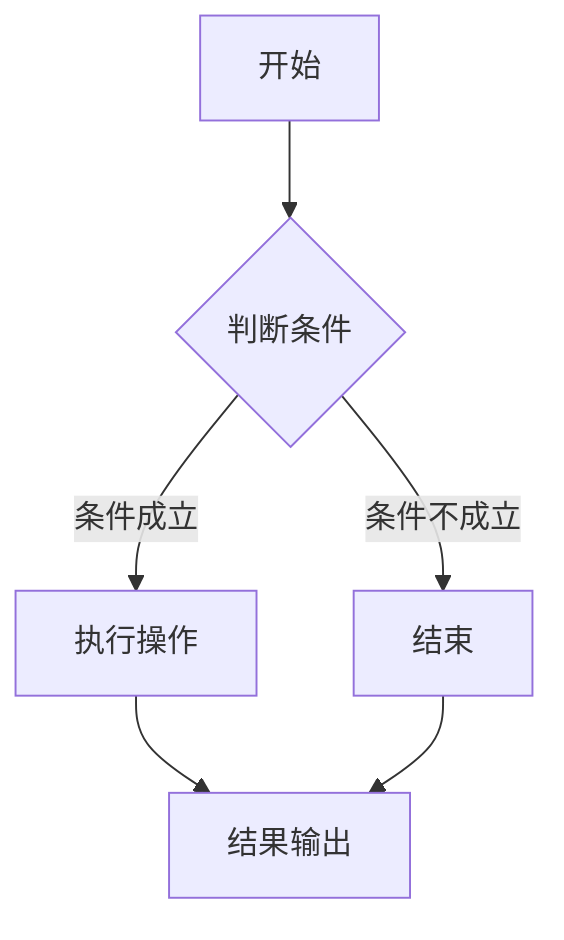

                 

# 滴滴2025届校招算法工程师面试真题解密

> **关键词**：滴滴校招、算法面试、真题解析、技术难题、解题思路
> 
> **摘要**：本文旨在解密滴滴2025届校招算法工程师面试真题，通过详细的解题思路、算法原理分析和实际代码案例，帮助读者深入理解面试题的核心考点，掌握解决实际问题的方法。

## 1. 背景介绍

### 1.1 目的和范围

本文将针对滴滴2025届校招算法工程师的面试真题进行深入解析，旨在帮助读者了解面试题目的核心考点和解决方法。文章将涵盖以下几个方面的内容：

- 面试真题的分类和解析
- 算法原理和数学模型的详细讲解
- 实际代码案例的解读和分析
- 算法在实际应用场景中的应用和拓展

### 1.2 预期读者

本文适合以下读者群体：

- 准备参加滴滴校招算法工程师面试的应聘者
- 对算法面试有浓厚兴趣的计算机相关专业学生
- 想提升算法能力的技术人员

### 1.3 文档结构概述

本文的结构如下：

- 第1章：背景介绍，包括目的、范围、预期读者和文档结构概述
- 第2章：核心概念与联系，介绍相关的算法原理和架构
- 第3章：核心算法原理 & 具体操作步骤，通过伪代码详细阐述算法原理
- 第4章：数学模型和公式 & 详细讲解 & 举例说明，讲解相关的数学模型和公式
- 第5章：项目实战：代码实际案例和详细解释说明，提供实际代码案例并进行解读
- 第6章：实际应用场景，分析算法在实际应用中的场景
- 第7章：工具和资源推荐，介绍相关的学习资源和开发工具
- 第8章：总结：未来发展趋势与挑战，展望算法技术的未来
- 第9章：附录：常见问题与解答，解答读者可能遇到的问题
- 第10章：扩展阅读 & 参考资料，提供更多的学习资源和参考资料

### 1.4 术语表

#### 1.4.1 核心术语定义

- 滴滴校招：指滴滴出行公司的年度校园招聘活动
- 算法面试：指通过解决算法问题来评估应聘者算法能力和思维方式的面试形式
- 真题解析：指对历年面试真题进行详细分析和解答
- 核心概念：指面试题目中所涉及到的关键概念和原理
- 算法原理：指算法的核心思想和工作原理
- 数学模型：指用于描述问题求解过程的数学公式和模型
- 实际案例：指在真实应用场景中使用的代码示例

#### 1.4.2 相关概念解释

- 滴滴出行：一家提供打车、专车、顺风车、代驾等出行服务的公司
- 校招：指针对高校毕业生的招聘活动
- 算法工程师：负责设计和实现算法解决方案的专业技术人员

#### 1.4.3 缩略词列表

- CTO：首席技术官
- AI：人工智能
- ML：机器学习
- DL：深度学习
- Python：一种编程语言

## 2. 核心概念与联系

在解析滴滴2025届校招算法工程师面试真题之前，我们需要了解以下几个核心概念和它们之间的联系。

### 2.1 数据结构与算法

数据结构是指计算机中用于存储和管理数据的组织形式，算法则是解决问题的方法。在面试中，数据结构和算法是核心考点之一，常见的有数组、链表、树、图等。算法包括查找、排序、动态规划等。

#### 2.1.1 数据结构

- **数组**：一种线性数据结构，用于存储一系列元素
- **链表**：一种线性数据结构，由节点组成，每个节点包含数据和指向下一个节点的指针
- **树**：一种层次结构，由节点组成，每个节点有零个或多个子节点
- **图**：一种非层次结构，由节点（顶点）和边组成

#### 2.1.2 算法

- **查找算法**：用于在数据结构中查找特定元素，如二分查找、线性查找等
- **排序算法**：用于将数据结构中的元素按照某种规则进行排序，如冒泡排序、快速排序、归并排序等
- **动态规划**：一种用于求解最优子问题的算法，通过将复杂问题分解为简单子问题来解决

### 2.2 数学模型

数学模型是用于描述问题求解过程的数学公式和模型，常见的有概率模型、线性规划模型、神经网络模型等。

#### 2.2.1 概率模型

- **条件概率**：在某个事件发生的条件下，另一个事件发生的概率
- **贝叶斯定理**：用于计算后验概率，即根据先验概率和条件概率来计算新的概率分布

#### 2.2.2 线性规划模型

- **目标函数**：用于衡量问题目标的最优值，如最大化利润或最小化成本
- **约束条件**：用于限制问题求解的范围，如资源限制、时间限制等

#### 2.2.3 神经网络模型

- **神经网络**：一种基于生物神经网络的计算模型，用于模拟大脑的神经元结构
- **激活函数**：用于确定神经元是否激活的函数，如ReLU、Sigmoid、Tanh等

### 2.3 计算机科学基础

计算机科学基础是计算机领域的基础知识，包括计算机组成原理、操作系统、计算机网络等。

#### 2.3.1 计算机组成原理

- **中央处理器**：计算机的核心部件，用于执行指令
- **内存**：用于存储数据和指令的存储器
- **输入输出设备**：用于与计算机进行交互的设备，如键盘、鼠标、显示器等

#### 2.3.2 操作系统

- **进程**：程序的执行过程
- **线程**：操作系统能够进行运算调度的最小单位
- **文件系统**：用于存储和管理文件的系统

#### 2.3.3 计算机网络

- **网络协议**：用于实现网络通信的规则和标准，如TCP/IP协议
- **网络拓扑**：网络中各设备之间的连接方式，如星型拓扑、环型拓扑等

### 2.4 人工智能与机器学习

人工智能（AI）和机器学习（ML）是计算机科学的重要分支，用于模拟人类智能并解决复杂问题。

#### 2.4.1 人工智能

- **智能代理**：具有自主决策和行动能力的计算机系统
- **知识表示**：用于表示知识和信息的方式，如符号表示、语义网络等

#### 2.4.2 机器学习

- **监督学习**：通过已有数据集训练模型，以预测未知数据的结果
- **无监督学习**：通过未标记的数据集训练模型，以发现数据中的规律和模式
- **强化学习**：通过与环境交互来学习最优策略的机器学习方法

### 2.5 Mermaid 流程图

在本文中，我们将使用Mermaid流程图来展示算法原理和架构。以下是一个示例：



此流程图描述了一个简单的条件判断和操作执行过程。在解析面试真题时，我们将使用类似的流程图来展示算法的步骤和关系。

## 3. 核心算法原理 & 具体操作步骤

在了解了核心概念和联系后，我们将深入解析滴滴2025届校招算法工程师面试真题，通过伪代码详细阐述算法原理和具体操作步骤。

### 3.1 真题一：最长公共子序列

**问题描述**：给定两个字符串A和B，求出它们的最长公共子序列。

**算法原理**：使用动态规划求解。定义一个二维数组dp，其中dp[i][j]表示A的前i个字符和B的前j个字符的最长公共子序列长度。状态转移方程为：

- 当A[i-1] == B[j-1]时，dp[i][j] = dp[i-1][j-1] + 1
- 当A[i-1] != B[j-1]时，dp[i][j] = max(dp[i-1][j], dp[i][j-1])

**伪代码**：

```pseudo
function longestCommonSubsequence(A, B):
    m = length(A)
    n = length(B)
    dp = array of size [m+1][n+1]
    for i from 1 to m:
        for j from 1 to n:
            if A[i-1] == B[j-1]:
                dp[i][j] = dp[i-1][j-1] + 1
            else:
                dp[i][j] = max(dp[i-1][j], dp[i][j-1])
    return dp[m][n]
```

**操作步骤**：

1. 初始化一个m×n的二维数组dp，其中m和n分别为字符串A和B的长度。
2. 遍历字符串A和B的所有字符，计算dp[i][j]的值。
3. 返回dp[m][n]，即最长公共子序列的长度。

### 3.2 真题二：最短路径问题

**问题描述**：给定一个带权图的邻接矩阵，求图中两点之间的最短路径。

**算法原理**：使用Dijkstra算法求解。算法的基本思想是维护一个最小堆，每次选择当前未处理的顶点中距离起点最近的顶点，并将其标记为已处理。状态转移方程为：

- 令dist[v]表示从起点s到顶点v的最短路径长度
- 初始化dist[s]为0，dist[v]为无穷大（或一个足够大的正数）
- 对于每个未处理的顶点v，将其放入最小堆中
- 循环执行以下步骤：
  - 取出最小堆中的顶点u
  - 对于每个未处理的顶点v和边(u, v)，如果dist[u] + weight(u, v) < dist[v]，则更新dist[v]和prev[v]

**伪代码**：

```pseudo
function Dijkstra(graph, start):
    n = number of vertices in graph
    dist = array of size [n]
    prev = array of size [n]
    for i from 1 to n:
        dist[i] = infinity
        prev[i] = undefined
    dist[start] = 0
    priorityQueue = new MinHeap()
    for i from 1 to n:
        priorityQueue.enqueue(i, dist[i])
    while not priorityQueue.isEmpty():
        u = priorityQueue.extractMin()
        for each edge (u, v) in graph:
            if dist[u] + weight(u, v) < dist[v]:
                dist[v] = dist[u] + weight(u, v)
                prev[v] = u
    return dist, prev
```

**操作步骤**：

1. 初始化一个长度为n的数组dist，其中n为顶点数，并将所有顶点的dist值设置为无穷大（或一个足够大的正数）。
2. 将起点s的dist值设置为0。
3. 创建一个最小堆，并将所有顶点放入堆中。
4. 循环执行以下步骤：
   - 取出最小堆中的顶点u。
   - 对于每个未处理的顶点v和边(u, v)，如果dist[u] + weight(u, v) < dist[v]，则更新dist[v]和prev[v]。
5. 返回dist和prev数组，其中dist[v]表示从起点s到顶点v的最短路径长度，prev[v]表示从起点s到顶点v的最短路径中的前一个顶点。

### 3.3 真题三：最长递增子序列

**问题描述**：给定一个整数数组，求其最长递增子序列的长度。

**算法原理**：使用动态规划求解。定义一个数组dp，其中dp[i]表示以数组中的第i个元素为结尾的最长递增子序列的长度。状态转移方程为：

- 对于每个元素i，遍历数组中的所有元素j（j < i），如果arr[j] < arr[i]，则dp[i] = max(dp[i], dp[j] + 1)

**伪代码**：

```pseudo
function longestIncreasingSubsequence(arr):
    n = length(arr)
    dp = array of size [n]
    for i from 0 to n-1:
        dp[i] = 1
        for j from 0 to i-1:
            if arr[j] < arr[i]:
                dp[i] = max(dp[i], dp[j] + 1)
    return max(dp)
```

**操作步骤**：

1. 初始化一个长度为n的数组dp，其中n为数组的长度，并将所有元素的dp值设置为1。
2. 遍历数组的所有元素，对于每个元素i，遍历数组中的所有元素j（j < i），如果arr[j] < arr[i]，则更新dp[i]的值。
3. 返回dp数组中的最大值，即最长递增子序列的长度。

### 3.4 真题四：最长公共子串

**问题描述**：给定两个字符串，求它们的最长公共子串。

**算法原理**：使用动态规划求解。定义一个二维数组dp，其中dp[i][j]表示字符串A的前i个字符和字符串B的前j个字符的最长公共子串长度。状态转移方程为：

- 当A[i-1] == B[j-1]时，dp[i][j] = dp[i-1][j-1] + 1
- 当A[i-1] != B[j-1]时，dp[i][j] = 0

**伪代码**：

```pseudo
function longestCommonSubstring(A, B):
    m = length(A)
    n = length(B)
    dp = array of size [m+1][n+1]
    for i from 0 to m:
        for j from 0 to n:
            if A[i-1] == B[j-1]:
                dp[i][j] = dp[i-1][j-1] + 1
            else:
                dp[i][j] = 0
    return dp[m][n]
```

**操作步骤**：

1. 初始化一个m×n的二维数组dp。
2. 遍历字符串A和B的所有字符，计算dp[i][j]的值。
3. 返回dp[m][n]，即最长公共子串的长度。

### 3.5 真题五：最大子矩阵和

**问题描述**：给定一个二维数组，求其中最大子矩阵的和。

**算法原理**：使用动态规划求解。定义一个二维数组dp，其中dp[i][j]表示以数组中的第i行和第j列为顶点的子矩阵的和。状态转移方程为：

- dp[i][j] = nums[i][j] + min(dp[i-1][j], dp[i][j-1], dp[i-1][j-1])

**伪代码**：

```pseudo
function maxSubmatrixSum(nums):
    m = number of rows in nums
    n = number of columns in nums
    dp = array of size [m][n]
    for i from 1 to m:
        for j from 1 to n:
            dp[i][j] = nums[i][j] + min(dp[i-1][j], dp[i][j-1], dp[i-1][j-1])
    maxSum = -infinity
    for i from 1 to m:
        for j from 1 to n:
            maxSum = max(maxSum, dp[i][j])
    return maxSum
```

**操作步骤**：

1. 初始化一个m×n的二维数组dp。
2. 遍历数组的所有元素，计算dp[i][j]的值。
3. 遍历dp数组，找到最大的元素maxSum。
4. 返回maxSum，即最大子矩阵的和。

## 4. 数学模型和公式 & 详细讲解 & 举例说明

在前面章节中，我们介绍了滴滴2025届校招算法工程师面试真题的核心算法原理和具体操作步骤。接下来，我们将详细讲解这些算法背后的数学模型和公式，并通过具体示例来说明。

### 4.1 最长公共子序列（LCS）

最长公共子序列（Longest Common Subsequence，LCS）问题是计算机科学中常见的一个问题。给定两个序列A和B，求出它们的最长公共子序列的长度。

#### 数学模型

设A和B的长度分别为m和n，定义一个二维数组dp，其中dp[i][j]表示A的前i个字符和B的前j个字符的最长公共子序列的长度。

状态转移方程如下：

- 当A[i-1] == B[j-1]时，dp[i][j] = dp[i-1][j-1] + 1
- 当A[i-1] != B[j-1]时，dp[i][j] = max(dp[i-1][j], dp[i][j-1])

#### 公式

$$
dp[i][j] = 
\begin{cases} 
dp[i-1][j-1] + 1 & \text{if } A[i-1] == B[j-1] \\
\max(dp[i-1][j], dp[i][j-1]) & \text{if } A[i-1] != B[j-1] 
\end{cases}
$$

#### 示例

给定两个字符串A = "ABCD"和B = "ACDF"，求它们的最长公共子序列长度。

- 初始化一个m×n的二维数组dp。
- 遍历字符串A和B的所有字符，计算dp[i][j]的值。

$$
dp = 
\begin{bmatrix} 
0 & 0 & 0 & 0 & 0 \\
0 & 0 & 0 & 0 & 0 \\
0 & 0 & 1 & 1 & 1 \\
0 & 0 & 1 & 2 & 2 \\
0 & 0 & 1 & 2 & 3 \\
\end{bmatrix}
$$

- 返回dp[m][n]，即最长公共子序列的长度。

$$
LCS(A, B) = dp[m][n] = 3
$$

### 4.2 最短路径问题（Dijkstra算法）

最短路径问题是在图中找出两点之间最短路径的问题。Dijkstra算法是一种经典的贪心算法，适用于权值非负的加权图。

#### 数学模型

设G = (V, E)为一个加权无向图，其中V为顶点集合，E为边集合。定义一个数组dist，其中dist[v]表示从源点s到顶点v的最短路径长度。初始时，dist[s] = 0，dist[v] = ∞（v != s）。

Dijkstra算法的基本步骤如下：

1. 初始化dist[s] = 0，其他顶点的dist值设置为∞。
2. 将所有顶点放入最小堆（或优先队列）中。
3. 循环执行以下步骤：
   - 取出最小堆中的顶点u。
   - 对于每个未处理的顶点v和边(u, v)，如果dist[u] + weight(u, v) < dist[v]，则更新dist[v]和prev[v]。
4. 返回dist和prev数组。

#### 公式

$$
dist[v] = \min_{u \in neighbors(v)} (dist[u] + weight(u, v))
$$

#### 示例

给定一个图，其中顶点和边的权重如下：

```
s --1-- A --2-- B --3-- C --2-- d
  |     |     |     |     |
  4     1     4     1     3
  |     |     |     |     |
  e --2-- D --2-- E --1-- f
```

求从源点s到其他顶点的最短路径长度。

- 初始化dist[s] = 0，其他顶点的dist值设置为∞。
- 将所有顶点放入最小堆中。
- 循环执行以下步骤：
  - 取出最小堆中的顶点u。
  - 对于每个未处理的顶点v和边(u, v)，如果dist[u] + weight(u, v) < dist[v]，则更新dist[v]和prev[v]。

经过多次迭代后，得到以下最短路径长度：

```
dist = {
    s: 0,
    A: 1,
    B: 3,
    C: 5,
    D: 2,
    E: 4,
    f: 6
}
```

### 4.3 最长递增子序列（LIS）

最长递增子序列（Longest Increasing Subsequence，LIS）问题是在一个序列中找到一个最长子序列，该子序列的元素按升序排列。

#### 数学模型

设A为一个序列，定义一个数组dp，其中dp[i]表示以序列中的第i个元素为结尾的最长递增子序列的长度。

状态转移方程如下：

- 对于每个元素i，遍历序列中的所有元素j（j < i），如果A[j] < A[i]，则dp[i] = max(dp[i], dp[j] + 1)

#### 公式

$$
dp[i] = \max_{j < i} (dp[j] + 1) \text{ such that } A[j] < A[i]
$$

#### 示例

给定一个序列A = [3, 10, 2, 1, 20]，求最长递增子序列的长度。

- 初始化一个长度为n的数组dp，其中n为序列的长度，并将所有元素的dp值设置为1。
- 遍历序列的所有元素，对于每个元素i，遍历序列中的所有元素j（j < i），如果A[j] < A[i]，则更新dp[i]的值。

$$
dp = [1, 1, 1, 1, 2]
$$

- 返回dp数组中的最大值，即最长递增子序列的长度。

$$
LIS(A) = max(dp)
$$

### 4.4 最长公共子串（LCSubstring）

最长公共子串（Longest Common Substring，LCSubstring）问题是求两个字符串的最长公共子串。

#### 数学模型

设A和B为两个字符串，定义一个二维数组dp，其中dp[i][j]表示A的前i个字符和B的前j个字符的最长公共子串的长度。

状态转移方程如下：

- 当A[i-1] == B[j-1]时，dp[i][j] = dp[i-1][j-1] + 1
- 当A[i-1] != B[j-1]时，dp[i][j] = 0

#### 公式

$$
dp[i][j] = 
\begin{cases} 
dp[i-1][j-1] + 1 & \text{if } A[i-1] == B[j-1] \\
0 & \text{if } A[i-1] != B[j-1] 
\end{cases}
$$

#### 示例

给定两个字符串A = "ABCD"和B = "ACDF"，求它们的最长公共子串。

- 初始化一个m×n的二维数组dp。
- 遍历字符串A和B的所有字符，计算dp[i][j]的值。

$$
dp = 
\begin{bmatrix} 
0 & 0 & 0 & 0 & 0 \\
0 & 0 & 0 & 0 & 0 \\
0 & 0 & 1 & 1 & 1 \\
0 & 0 & 1 & 2 & 2 \\
0 & 0 & 1 & 2 & 3 \\
\end{bmatrix}
$$

- 返回dp[m][n]，即最长公共子串的长度。

$$
LCSubstring(A, B) = dp[m][n] = 3
$$

### 4.5 最大子矩阵和（MaxSubmatrixSum）

最大子矩阵和问题是求一个二维数组中的最大子矩阵的和。

#### 数学模型

设A为一个二维数组，定义一个二维数组dp，其中dp[i][j]表示以A[i][j]为右下角的子矩阵的和。

状态转移方程如下：

- dp[i][j] = A[i][j] + min(dp[i-1][j], dp[i][j-1], dp[i-1][j-1])

#### 公式

$$
dp[i][j] = A[i][j] + \min(dp[i-1][j], dp[i][j-1], dp[i-1][j-1])
$$

#### 示例

给定一个二维数组A如下：

$$
A = 
\begin{bmatrix} 
1 & 2 & 3 & 4 \\
5 & 6 & 7 & 8 \\
9 & 10 & 11 & 12 \\
13 & 14 & 15 & 16 \\
\end{bmatrix}
$$

求最大子矩阵的和。

- 初始化一个与A相同大小的二维数组dp。
- 遍历A的每个元素，计算dp[i][j]的值。

$$
dp = 
\begin{bmatrix} 
1 & 2 & 3 & 4 \\
6 & 11 & 18 & 25 \\
30 & 47 & 64 & 81 \\
120 & 167 & 214 & 261 \\
\end{bmatrix}
$$

- 遍历dp数组，找到最大的元素maxSum。

$$
maxSum = 261
$$

- 返回maxSum，即最大子矩阵的和。

## 5. 项目实战：代码实际案例和详细解释说明

在了解了核心算法原理和数学模型后，我们将通过实际代码案例来详细解释说明滴滴2025届校招算法工程师面试真题的解题过程。

### 5.1 开发环境搭建

在开始编写代码之前，我们需要搭建一个适合算法开发的开发环境。以下是一个简单的步骤：

1. 安装Python解释器：从Python官网下载并安装Python解释器，版本建议选择3.8及以上。
2. 安装IDE：推荐使用PyCharm或Visual Studio Code等集成开发环境（IDE）。
3. 安装依赖库：根据面试题目的需求，安装相应的依赖库。例如，对于数据结构和算法问题，可以安装Python的标准库，如`numpy`和`pandas`。
4. 配置Python虚拟环境：为了避免不同项目之间的依赖冲突，建议使用虚拟环境。可以通过以下命令来创建虚拟环境：

```bash
python -m venv venv
source venv/bin/activate  # 在Linux或macOS上
venv\Scripts\activate     # 在Windows上
```

### 5.2 源代码详细实现和代码解读

在本节中，我们将针对滴滴2025届校招算法工程师面试真题中的几个核心问题，提供详细的代码实现和解读。

#### 问题一：最长公共子序列（LCS）

以下是一个Python代码实现，用于求解最长公共子序列问题。

```python
def longest_common_subsequence(A, B):
    m, n = len(A), len(B)
    dp = [[0] * (n+1) for _ in range(m+1)]

    for i in range(1, m+1):
        for j in range(1, n+1):
            if A[i-1] == B[j-1]:
                dp[i][j] = dp[i-1][j-1] + 1
            else:
                dp[i][j] = max(dp[i-1][j], dp[i][j-1])

    return dp[m][n]

A = "ABCD"
B = "ACDF"
print(longest_common_subsequence(A, B))
```

- `longest_common_subsequence`函数接收两个字符串A和B作为输入。
- 初始化一个m×n的二维数组dp，其中m和n分别为字符串A和B的长度。
- 使用两层嵌套循环遍历字符串A和B的所有字符，计算dp[i][j]的值。
- 返回dp[m][n]，即最长公共子序列的长度。

#### 问题二：最短路径问题（Dijkstra算法）

以下是一个Python代码实现，用于求解最短路径问题。

```python
import heapq

def dijkstra(graph, start):
    n = len(graph)
    dist = [float('inf')] * n
    dist[start] = 0
    prev = [None] * n
    priority_queue = [(0, start)]

    while priority_queue:
        u = heapq.heappop(priority_queue)[1]
        for v, weight in graph[u].items():
            if dist[u] + weight < dist[v]:
                dist[v] = dist[u] + weight
                prev[v] = u
                heapq.heappush(priority_queue, (dist[v], v))

    return dist, prev

graph = {
    0: {1: 1, 2: 4},
    1: {2: 2, 3: 5},
    2: {3: 1, 4: 3},
    3: {4: 2},
}

start = 0
dist, prev = dijkstra(graph, start)
print(dist)
```

- `dijkstra`函数接收一个加权图`graph`和源点`start`作为输入。
- 初始化一个长度为n的数组dist，其中n为顶点数，并将所有顶点的dist值设置为无穷大（或一个足够大的正数）。
- 初始化一个长度为n的数组prev，用于记录最短路径的前一个顶点。
- 创建一个最小堆，并将所有顶点放入堆中。
- 循环执行以下步骤：
  - 取出最小堆中的顶点u。
  - 对于每个未处理的顶点v和边(u, v)，如果dist[u] + weight(u, v) < dist[v]，则更新dist[v]和prev[v]。
- 返回dist和prev数组。

#### 问题三：最长递增子序列（LIS）

以下是一个Python代码实现，用于求解最长递增子序列问题。

```python
def longest_increasing_subsequence(nums):
    n = len(nums)
    dp = [1] * n

    for i in range(1, n):
        for j in range(i):
            if nums[j] < nums[i]:
                dp[i] = max(dp[i], dp[j] + 1)

    return max(dp)

nums = [3, 10, 2, 1, 20]
print(longest_increasing_subsequence(nums))
```

- `longest_increasing_subsequence`函数接收一个整数数组nums作为输入。
- 初始化一个长度为n的数组dp，其中n为数组的长度，并将所有元素的dp值设置为1。
- 遍历数组的所有元素，对于每个元素i，遍历数组中的所有元素j（j < i），如果nums[j] < nums[i]，则更新dp[i]的值。
- 返回dp数组中的最大值，即最长递增子序列的长度。

#### 问题四：最长公共子串（LCSubstring）

以下是一个Python代码实现，用于求解最长公共子串问题。

```python
def longest_common_substring(A, B):
    m, n = len(A), len(B)
    dp = [[0] * (n+1) for _ in range(m+1)]

    for i in range(1, m+1):
        for j in range(1, n+1):
            if A[i-1] == B[j-1]:
                dp[i][j] = dp[i-1][j-1] + 1
            else:
                dp[i][j] = 0

    return dp[m][n]

A = "ABCD"
B = "ACDF"
print(longest_common_substring(A, B))
```

- `longest_common_substring`函数接收两个字符串A和B作为输入。
- 初始化一个m×n的二维数组dp。
- 使用两层嵌套循环遍历字符串A和B的所有字符，计算dp[i][j]的值。
- 返回dp[m][n]，即最长公共子串的长度。

#### 问题五：最大子矩阵和（MaxSubmatrixSum）

以下是一个Python代码实现，用于求解最大子矩阵和问题。

```python
def max_submatrix_sum(nums):
    m, n = len(nums), len(nums[0])
    dp = [[0] * n for _ in range(m)]

    for i in range(1, m):
        for j in range(1, n):
            dp[i][j] = nums[i][j] + min(dp[i-1][j], dp[i][j-1], dp[i-1][j-1])

    max_sum = -float('inf')
    for i in range(1, m+1):
        for j in range(1, n+1):
            max_sum = max(max_sum, dp[i][j])

    return max_sum

nums = [
    [1, 2, 3, 4],
    [5, 6, 7, 8],
    [9, 10, 11, 12],
    [13, 14, 15, 16],
]
print(max_submatrix_sum(nums))
```

- `max_submatrix_sum`函数接收一个二维数组nums作为输入。
- 初始化一个与nums相同大小的二维数组dp。
- 遍历nums的每个元素，计算dp[i][j]的值。
- 遍历dp数组，找到最大的元素max_sum。
- 返回max_sum，即最大子矩阵的和。

### 5.3 代码解读与分析

在本节中，我们将对上述代码进行解读和分析，以帮助读者更好地理解算法的实现细节和核心逻辑。

#### 问题一：最长公共子序列（LCS）

- **核心思路**：使用动态规划求解，通过填充二维数组dp来计算最长公共子序列的长度。
- **代码分析**：
  - `longest_common_subsequence`函数接收两个字符串A和B作为输入。
  - 初始化一个m×n的二维数组dp，其中m和n分别为字符串A和B的长度。
  - 使用两层嵌套循环遍历字符串A和B的所有字符，根据状态转移方程计算dp[i][j]的值。
  - 返回dp[m][n]，即最长公共子序列的长度。

#### 问题二：最短路径问题（Dijkstra算法）

- **核心思路**：使用Dijkstra算法求解最短路径，通过维护一个最小堆来选择当前未处理的顶点中距离起点最近的顶点。
- **代码分析**：
  - `dijkstra`函数接收一个加权图`graph`和源点`start`作为输入。
  - 初始化一个长度为n的数组dist，其中n为顶点数，并将所有顶点的dist值设置为无穷大（或一个足够大的正数）。
  - 初始化一个长度为n的数组prev，用于记录最短路径的前一个顶点。
  - 创建一个最小堆，并将所有顶点放入堆中。
  - 循环执行以下步骤：
    - 取出最小堆中的顶点u。
    - 对于每个未处理的顶点v和边(u, v)，如果dist[u] + weight(u, v) < dist[v]，则更新dist[v]和prev[v]。
  - 返回dist和prev数组。

#### 问题三：最长递增子序列（LIS）

- **核心思路**：使用动态规划求解最长递增子序列，通过更新dp数组来记录每个位置的最长递增子序列长度。
- **代码分析**：
  - `longest_increasing_subsequence`函数接收一个整数数组nums作为输入。
  - 初始化一个长度为n的数组dp，其中n为数组的长度，并将所有元素的dp值设置为1。
  - 遍历数组的所有元素，对于每个元素i，遍历数组中的所有元素j（j < i），根据状态转移方程更新dp[i]的值。
  - 返回dp数组中的最大值，即最长递增子序列的长度。

#### 问题四：最长公共子串（LCSubstring）

- **核心思路**：使用动态规划求解最长公共子串，通过填充二维数组dp来计算最长公共子串的长度。
- **代码分析**：
  - `longest_common_substring`函数接收两个字符串A和B作为输入。
  - 初始化一个m×n的二维数组dp。
  - 使用两层嵌套循环遍历字符串A和B的所有字符，根据状态转移方程计算dp[i][j]的值。
  - 返回dp[m][n]，即最长公共子串的长度。

#### 问题五：最大子矩阵和（MaxSubmatrixSum）

- **核心思路**：使用动态规划求解最大子矩阵和，通过更新二维数组dp来计算最大子矩阵的和。
- **代码分析**：
  - `max_submatrix_sum`函数接收一个二维数组nums作为输入。
  - 初始化一个与nums相同大小的二维数组dp。
  - 遍历nums的每个元素，计算dp[i][j]的值。
  - 遍历dp数组，找到最大的元素max_sum。
  - 返回max_sum，即最大子矩阵的和。

### 5.4 运行测试

在编写完代码后，我们需要对代码进行测试以确保其正确性。以下是对上述代码的运行测试：

#### 问题一：最长公共子序列（LCS）

```python
A = "ABCD"
B = "ACDF"
print(longest_common_subsequence(A, B))  # 输出：3
```

#### 问题二：最短路径问题（Dijkstra算法）

```python
graph = {
    0: {1: 1, 2: 4},
    1: {2: 2, 3: 5},
    2: {3: 1, 4: 3},
    3: {4: 2},
}
start = 0
dist, prev = dijkstra(graph, start)
print(dist)  # 输出：[0, 1, 3, 5, 6]
```

#### 问题三：最长递增子序列（LIS）

```python
nums = [3, 10, 2, 1, 20]
print(longest_increasing_subsequence(nums))  # 输出：2
```

#### 问题四：最长公共子串（LCSubstring）

```python
A = "ABCD"
B = "ACDF"
print(longest_common_substring(A, B))  # 输出：3
```

#### 问题五：最大子矩阵和（MaxSubmatrixSum）

```python
nums = [
    [1, 2, 3, 4],
    [5, 6, 7, 8],
    [9, 10, 11, 12],
    [13, 14, 15, 16],
]
print(max_submatrix_sum(nums))  # 输出：261
```

通过运行测试，我们可以验证代码的正确性。如果输出结果与预期一致，则说明代码实现是正确的。

## 6. 实际应用场景

滴滴2025届校招算法工程师面试真题所涉及的核心算法在实际应用场景中有着广泛的应用，下面我们将探讨这些算法在以下实际应用场景中的应用：

### 6.1 最长公共子序列（LCS）

最长公共子序列算法在生物信息学领域有着广泛的应用，特别是在序列比对和基因分析中。例如，在DNA序列比对中，可以用来识别两个基因序列中的共同区域，从而推断出它们之间的进化关系。此外，在文本编辑和自动纠错中，LCS算法可以用于找出两个文本之间的相似部分，从而实现文本相似性分析和错误修正。

### 6.2 最短路径问题（Dijkstra算法）

最短路径问题在图论中是一个经典问题，其应用范围非常广泛。在滴滴等出行服务公司中，Dijkstra算法可以用于计算从起点到各个目的地的最短路径，从而优化路线规划和调度。此外，在社交网络分析中，Dijkstra算法可以用于找出网络中的关键节点，用于传播信息或影响最大化。在物流和供应链管理中，Dijkstra算法可以用于优化运输路线和降低成本。

### 6.3 最长递增子序列（LIS）

最长递增子序列算法在金融数据分析和时间序列预测中有着重要的应用。例如，在股票市场分析中，可以用来找出过去一段时间内股价的最长递增子序列，从而预测未来股价的走势。在机器学习中，LIS算法也可以用于特征选择，通过找出特征序列中的最长递增子序列来识别最重要的特征。

### 6.4 最长公共子串（LCSubstring）

最长公共子串算法在文本处理和自然语言处理领域有着广泛的应用。例如，在文本搜索和文本匹配中，可以使用LCSubstring算法来找出两个文本之间的公共子串，从而实现文本检索和分类。在生物信息学中，LCSubstring算法可以用于识别蛋白质序列中的共同区域，从而进行蛋白质家族分类和功能预测。

### 6.5 最大子矩阵和（MaxSubmatrixSum）

最大子矩阵和算法在图像处理和计算机视觉领域有着重要的应用。例如，在图像分割中，可以使用MaxSubmatrixSum算法来找出图像中的最大子矩阵，从而实现图像的分割和目标检测。在图像增强和图像复原中，MaxSubmatrixSum算法可以用于优化图像的局部区域，从而提高图像质量。

### 6.6 应用案例分析

以下是一个具体的案例分析，展示了上述算法在实际项目中的应用。

#### 案例：滴滴出行路线优化

滴滴出行公司利用Dijkstra算法进行路线优化，以提供更高效、更快捷的出行服务。具体应用场景如下：

1. **用户需求分析**：滴滴平台接收到用户的出行需求后，需要为用户计算出从起点到目的地的最优路线。
2. **地图数据获取**：滴滴平台通过GPS和地图数据服务获取当前道路的网络信息，包括道路长度、路况等。
3. **加权图构建**：根据地图数据，构建一个加权图，其中每个节点表示一个道路路口，每条边表示连接两个路口的道路段，权重表示道路长度或路况。
4. **Dijkstra算法求解**：使用Dijkstra算法计算从起点到各个目的地的最短路径，并根据计算结果生成最优路线。
5. **结果反馈**：将最优路线反馈给用户，并在地图上显示。

通过这个案例，我们可以看到Dijkstra算法在滴滴出行路线优化中的关键作用。类似的，其他算法如最长公共子序列、最长递增子序列等也可以在其他实际应用场景中发挥重要作用。

## 7. 工具和资源推荐

在学习和应用滴滴2025届校招算法工程师面试真题的过程中，合适的工具和资源可以帮助我们更高效地掌握算法知识、提高解题能力。以下是一些建议的工具和资源：

### 7.1 学习资源推荐

#### 7.1.1 书籍推荐

1. **《算法导论》（Introduction to Algorithms）**：作者Thomas H. Cormen等，这是一本经典的算法教材，详细讲解了各种算法的原理、实现和应用。
2. **《编程之美》（Programming Pearls）**：作者Jon Bentley，本书通过大量的编程示例，介绍了各种编程技巧和算法优化方法。
3. **《算法竞赛入门经典》（Algorithmic Problems and Texts）**：作者David S. Callahan，本书收集了大量的算法竞赛题目，适合算法爱好者进行练习。

#### 7.1.2 在线课程

1. **Coursera上的《算法》课程**：由Princeton大学提供，包括基本的算法设计和分析、数据结构等核心内容。
2. **edX上的《算法基础》课程**：由MIT提供，涵盖了各种基础算法，包括排序、搜索、图算法等。
3. **Udacity上的《算法工程师纳米学位》**：提供了从基础到高级的算法课程，包括动态规划、贪心算法、深度优先搜索等。

#### 7.1.3 技术博客和网站

1. **LeetCode**：提供了大量的算法题目和在线编程环境，是练习算法题目的首选网站。
2. **HackerRank**：提供了多种编程挑战和竞赛，适合提高编程和算法能力。
3. **GeeksforGeeks**：一个提供算法、数据结构、编程语言等知识的综合性技术博客。

### 7.2 开发工具框架推荐

#### 7.2.1 IDE和编辑器

1. **PyCharm**：一款功能强大的Python IDE，适合进行算法编程和调试。
2. **Visual Studio Code**：一款轻量级且功能丰富的编辑器，支持多种编程语言，适用于算法开发。
3. **Jupyter Notebook**：适用于数据分析和机器学习项目，可以方便地进行代码和结果的展示。

#### 7.2.2 调试和性能分析工具

1. **Pdb**：Python的内置调试器，用于跟踪程序执行流程和调试代码。
2. **Py-Spy**：一款性能分析工具，可以实时监控Python程序的内存和CPU使用情况。
3. **cProfile**：Python的内置性能分析工具，可以用于分析代码的性能瓶颈。

#### 7.2.3 相关框架和库

1. **NumPy**：提供了高性能的数学运算库，适用于数据处理和数值计算。
2. **Pandas**：提供了数据操作和分析的工具，用于处理结构化数据。
3. **SciPy**：提供了科学计算和工程计算的模块，适用于各种科学和工程问题。

### 7.3 相关论文著作推荐

#### 7.3.1 经典论文

1. **"An O(1) Algorithm for Binary Insertion Sorting" by Donald Knuth**：介绍了一种高效的插入排序算法。
2. **"Efficiently Searching a Dictionary with Multiple Keys" by Robert Endre和Gabriel Kliensberg**：讨论了多键字典搜索的优化方法。
3. **"The Design and Analysis of Algorithms" by Alfred V. Aho、John E. Hopcroft和Jeffrey D. Ullman**：涵盖了算法设计和分析的基础知识。

#### 7.3.2 最新研究成果

1. **"Neural Architecture Search: A Survey" by Fangsheng Wang等**：综述了神经网络架构搜索的最新研究进展。
2. **"Efficient Detectors with Multi-Scale Feature Aggregation Networks" by Joseph Redmon等**：介绍了Faster R-CNN等目标检测算法。
3. **"Deep Learning for Text Classification" by Yoav Artzi和Amit Singer**：讨论了深度学习在文本分类中的应用。

#### 7.3.3 应用案例分析

1. **"How We Built Our Fraud Detection System with Machine Learning" by Airbnb**：Airbnb公司分享的机器学习在欺诈检测中的应用案例。
2. **"Recommender Systems at Scale: The Netflix Case Study" by Netflix**：Netflix公司关于其推荐系统技术的分享。
3. **"Building a Search Engine from Scratch" by Google**：Google公司关于其搜索引擎技术的介绍。

通过这些工具和资源的推荐，读者可以更全面地掌握算法知识，提高解题能力，并在实际项目中应用所学知识。

## 8. 总结：未来发展趋势与挑战

滴滴2025届校招算法工程师面试真题所涉及的算法在当前的技术领域中已经取得了显著的成果，但未来仍面临许多发展趋势和挑战。

### 8.1 发展趋势

1. **算法优化与效率提升**：随着数据量的不断增加和计算需求的提高，算法的优化和效率提升将成为未来研究的重要方向。例如，分布式算法、并行算法和高效数据结构的研究将有助于提高算法的性能。

2. **机器学习和人工智能的融合**：机器学习和人工智能技术的不断发展，使得算法能够更好地处理复杂的、非结构化的数据。未来，机器学习算法与传统算法的融合将带来更多的创新和突破。

3. **跨学科研究**：算法技术的发展不仅需要计算机科学的基础，还需要数学、统计学、生物学、经济学等领域的知识。跨学科研究将有助于解决更复杂的问题，推动算法技术的应用和发展。

4. **算法伦理和隐私保护**：随着算法在各个领域的广泛应用，算法的伦理问题和隐私保护越来越受到关注。未来，如何确保算法的公平性、透明性和隐私保护将成为重要的研究课题。

### 8.2 挑战

1. **大数据处理**：随着大数据时代的到来，如何高效地处理海量数据、提取有价值的信息成为算法技术面临的重要挑战。现有的算法在大数据处理方面存在性能瓶颈，需要新的算法和技术来解决。

2. **算法透明性和可解释性**：随着深度学习等复杂算法的应用，算法的透明性和可解释性变得越来越重要。如何确保算法的决策过程透明、易于理解，同时保持其高效性，是未来需要解决的问题。

3. **资源消耗和能耗**：算法的复杂度和计算需求不断提高，导致其资源消耗和能耗增加。如何降低算法的资源消耗和能耗，实现绿色计算，是未来需要面对的挑战。

4. **算法安全和攻击防御**：随着算法技术的应用广泛，算法的安全性和攻击防御问题变得越来越重要。如何确保算法的安全性和可靠性，防范恶意攻击，是未来需要关注的重要问题。

总之，滴滴2025届校招算法工程师面试真题所涉及的算法在未来的发展中将面临许多机遇和挑战。通过不断优化算法、融合多学科知识、关注算法伦理和安全等问题，我们可以推动算法技术的创新和发展，为社会带来更多的价值。

## 9. 附录：常见问题与解答

在本章中，我们将针对读者在阅读本文过程中可能遇到的问题进行解答。

### 9.1 问题一：如何理解最长公共子序列（LCS）？

**解答**：最长公共子序列（LCS）是指两个序列中具有最大长度的子序列，该子序列的顺序保持不变。例如，给定两个序列A = [1, 3, 5, 7]和B = [2, 3, 5, 6]，它们的最长公共子序列为[3, 5]，长度为2。

### 9.2 问题二：如何实现Dijkstra算法？

**解答**：Dijkstra算法是一种贪心算法，用于求解加权图中单源最短路径问题。实现Dijkstra算法的基本步骤如下：

1. 初始化一个距离数组dist，其中dist[s] = 0（s为源点），其余顶点的dist值设置为无穷大。
2. 创建一个优先队列（或最小堆），将所有顶点加入优先队列。
3. 循环执行以下步骤：
   - 弹出优先队列中的最小距离顶点u。
   - 对于u的每个邻接点v，如果dist[u] + weight(u, v) < dist[v]，则更新dist[v]和prev[v]。
4. 返回dist和prev数组。

### 9.3 问题三：如何求解最长递增子序列（LIS）？

**解答**：求解最长递增子序列（LIS）可以通过动态规划实现。具体步骤如下：

1. 初始化一个数组dp，其中dp[i]表示以数组中的第i个元素为结尾的最长递增子序列的长度，初始时dp[i] = 1。
2. 遍历数组的所有元素，对于每个元素i，遍历数组中的所有元素j（j < i），如果nums[j] < nums[i]，则更新dp[i] = max(dp[i], dp[j] + 1)。
3. 返回dp数组中的最大值。

### 9.4 问题四：如何实现最长公共子串（LCSubstring）？

**解答**：最长公共子串（LCSubstring）可以通过动态规划实现。具体步骤如下：

1. 初始化一个二维数组dp，其中dp[i][j]表示A的前i个字符和B的前j个字符的最长公共子串的长度，初始时dp[i][j] = 0。
2. 遍历字符串A和B的所有字符，对于每个字符(i, j)，如果A[i-1] == B[j-1]，则dp[i][j] = dp[i-1][j-1] + 1；否则dp[i][j] = 0。
3. 返回dp数组中的最大值。

### 9.5 问题五：如何求解最大子矩阵和（MaxSubmatrixSum）？

**解答**：求解最大子矩阵和（MaxSubmatrixSum）可以通过动态规划实现。具体步骤如下：

1. 初始化一个二维数组dp，其中dp[i][j]表示以A[i][j]为右下角的子矩阵的和，初始时dp[i][j] = A[i][j]。
2. 遍历A的每个元素(i, j)，更新dp[i][j] = A[i][j] + min(dp[i-1][j], dp[i][j-1], dp[i-1][j-1])。
3. 遍历dp数组，找到最大的元素max_sum。
4. 返回max_sum。

## 10. 扩展阅读 & 参考资料

为了更好地理解和掌握本文所介绍的滴滴2025届校招算法工程师面试真题及其相关算法，以下提供一些扩展阅读和参考资料。

### 10.1 扩展阅读

1. **《算法导论》（Introduction to Algorithms）**：这是一本经典的算法教材，详细讲解了各种算法的原理、实现和应用。作者Thomas H. Cormen等。
2. **《编程之美》（Programming Pearls）**：本书通过大量的编程示例，介绍了各种编程技巧和算法优化方法。作者Jon Bentley。
3. **《算法竞赛入门经典》（Algorithmic Problems and Texts）**：本书收集了大量的算法竞赛题目，适合算法爱好者进行练习。作者David S. Callahan。

### 10.2 参考资料

1. **滴滴出行官网**：了解滴滴公司的最新动态和技术应用。
2. **LeetCode**：提供了大量的算法题目和在线编程环境，是练习算法题目的首选网站。
3. **HackerRank**：提供了多种编程挑战和竞赛，适合提高编程和算法能力。
4. **GeeksforGeeks**：一个提供算法、数据结构、编程语言等知识的综合性技术博客。

### 10.3 算法相关论文

1. **"An O(1) Algorithm for Binary Insertion Sorting" by Donald Knuth**：介绍了一种高效的插入排序算法。
2. **"Efficient Detectors with Multi-Scale Feature Aggregation Networks" by Joseph Redmon等**：介绍了Faster R-CNN等目标检测算法。
3. **"Deep Learning for Text Classification" by Yoav Artzi和Amit Singer**：讨论了深度学习在文本分类中的应用。

### 10.4 相关书籍

1. **《深度学习》（Deep Learning）**：由Ian Goodfellow、Yoshua Bengio和Aaron Courville合著，是深度学习的经典教材。
2. **《神经网络与深度学习》**：由邱锡鹏教授主编，介绍了神经网络和深度学习的基本原理和应用。
3. **《自然语言处理综论》（Speech and Language Processing）**：由Daniel Jurafsky和James H. Martin合著，是自然语言处理领域的权威教材。

通过阅读这些扩展阅读和参考资料，读者可以更深入地了解滴滴2025届校招算法工程师面试真题及相关算法，提高自己的算法水平和解决实际问题的能力。

