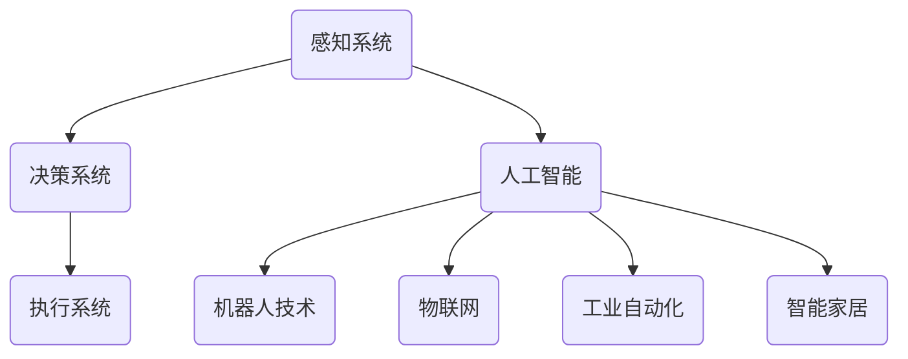

                 

# 物理实体的自动化前景与挑战

> 关键词：物理实体自动化，机器人技术，人工智能，工业自动化，智能家居，挑战与机遇

> 摘要：本文将探讨物理实体自动化的广阔前景和面临的挑战。我们将从背景介绍、核心概念与联系、算法原理、数学模型、项目实战、应用场景等多个角度进行分析，为读者提供一个全面、深入的视角。

## 1. 背景介绍

### 1.1 目的和范围

本文旨在分析物理实体自动化的现状、前景以及面临的各种挑战。随着人工智能、机器人技术和物联网等领域的迅速发展，物理实体自动化已经成为一个热门话题。本文将重点关注以下几个方面：

1. **核心概念与联系**：介绍物理实体自动化的基本概念及其与其他技术的关联。
2. **核心算法原理 & 具体操作步骤**：详细阐述实现物理实体自动化的关键算法原理。
3. **数学模型和公式 & 详细讲解 & 举例说明**：分析物理实体自动化的数学模型，并通过实例进行说明。
4. **项目实战：代码实际案例和详细解释说明**：展示一个具体的物理实体自动化项目案例。
5. **实际应用场景**：探讨物理实体自动化在各个领域的应用。
6. **工具和资源推荐**：推荐一些学习资源、开发工具和框架。
7. **总结：未来发展趋势与挑战**：总结物理实体自动化的发展趋势和面临的挑战。

### 1.2 预期读者

本文适用于对物理实体自动化感兴趣的读者，包括：

1. **人工智能领域的研究人员和开发者**：了解物理实体自动化的基础和最新进展。
2. **机器人技术从业人员**：探讨物理实体自动化在机器人中的应用。
3. **工业自动化工程师**：分析物理实体自动化在工业生产中的潜在价值。
4. **智能家居爱好者**：了解物理实体自动化在智能家居领域的应用。

### 1.3 文档结构概述

本文结构如下：

1. **背景介绍**：介绍物理实体自动化的背景、目的和范围。
2. **核心概念与联系**：介绍物理实体自动化的核心概念和关联技术。
3. **核心算法原理 & 具体操作步骤**：详细阐述实现物理实体自动化的关键算法原理。
4. **数学模型和公式 & 详细讲解 & 举例说明**：分析物理实体自动化的数学模型，并通过实例进行说明。
5. **项目实战：代码实际案例和详细解释说明**：展示一个具体的物理实体自动化项目案例。
6. **实际应用场景**：探讨物理实体自动化在各个领域的应用。
7. **工具和资源推荐**：推荐一些学习资源、开发工具和框架。
8. **总结：未来发展趋势与挑战**：总结物理实体自动化的发展趋势和面临的挑战。
9. **附录：常见问题与解答**：回答读者可能关心的问题。
10. **扩展阅读 & 参考资料**：提供更多相关的学习资源和文献。

### 1.4 术语表

#### 1.4.1 核心术语定义

- **物理实体自动化**：利用人工智能、机器人技术等手段对物理实体（如机器人、生产线设备、智能家居设备等）进行自动化控制和管理。
- **人工智能**：模拟人类智能的技术和方法，包括机器学习、深度学习、自然语言处理等。
- **机器人技术**：研究和开发各种机器人系统的技术，包括硬件、软件、算法等。
- **物联网**：通过互联网将各种物理实体连接起来，实现智能化的信息交换和通信。
- **工业自动化**：利用计算机技术和控制理论，对工业生产过程进行自动化控制和优化。
- **智能家居**：利用物联网技术，将家庭中的各种设备和系统实现智能化控制和管理。

#### 1.4.2 相关概念解释

- **感知系统**：机器人或其他物理实体用于感知外部环境的传感器和模块。
- **决策系统**：根据感知系统收集的信息，进行数据处理和决策的系统。
- **执行系统**：根据决策系统生成的控制指令，实现物理动作的执行系统。
- **控制算法**：用于对物理实体进行控制的一系列算法，如PID控制、模糊控制等。

#### 1.4.3 缩略词列表

- **AI**：人工智能（Artificial Intelligence）
- **ML**：机器学习（Machine Learning）
- **DL**：深度学习（Deep Learning）
- **IoT**：物联网（Internet of Things）
- **PLC**：可编程逻辑控制器（Programmable Logic Controller）
- **RPA**：机器人流程自动化（Robotic Process Automation）

## 2. 核心概念与联系

为了更好地理解物理实体自动化的概念和原理，我们需要了解其核心组成部分和与其他技术的联系。

### 2.1 物理实体自动化的核心组成部分

物理实体自动化主要由以下几个部分组成：

1. **感知系统**：用于收集外部环境信息，如温度、湿度、光线强度、障碍物等。常见的感知设备包括传感器、摄像头、激光雷达等。
2. **决策系统**：基于感知系统收集到的信息，进行数据分析和处理，生成相应的决策和控制指令。常见的决策系统包括机器学习模型、规则引擎等。
3. **执行系统**：根据决策系统生成的控制指令，实现物理实体的动作和操作。常见的执行系统包括电机、执行器、机器人机械臂等。

### 2.2 物理实体自动化与其他技术的联系

物理实体自动化涉及到多个领域的交叉融合，主要包括：

1. **人工智能**：物理实体自动化依赖于人工智能技术，如机器学习、深度学习等，用于实现感知、决策和执行功能。
2. **机器人技术**：物理实体自动化中的机器人技术是实现自动化操作的关键，包括硬件设计、控制算法、传感器技术等。
3. **物联网**：物理实体自动化需要通过物联网技术将各种物理实体连接起来，实现数据交换和通信。
4. **工业自动化**：物理实体自动化在工业生产中具有重要的应用价值，与工业自动化技术密切相关。
5. **智能家居**：物理实体自动化在智能家居领域的应用，如智能安防、智能照明、智能家电等。

### 2.3 物理实体自动化的 Mermaid 流程图

下面是一个简单的 Mermaid 流程图，展示物理实体自动化的核心组成部分和与其他技术的联系：



## 3. 核心算法原理 & 具体操作步骤

### 3.1 物理实体自动化的核心算法原理

物理实体自动化涉及多个核心算法，包括感知算法、决策算法和控制算法。以下将分别介绍这些算法的基本原理。

#### 3.1.1 感知算法

感知算法是物理实体自动化的基础，用于从外部环境中提取有用信息。常见的感知算法包括：

1. **特征提取**：从原始图像、传感器数据中提取有意义的特征，如边缘、角点、纹理等。
2. **目标检测**：在图像或视频中检测和识别特定目标，如行人、车辆、障碍物等。
3. **状态估计**：根据传感器数据估计物理实体的状态，如位置、速度、加速度等。

#### 3.1.2 决策算法

决策算法基于感知系统收集到的信息，生成相应的控制指令。常见的决策算法包括：

1. **规则引擎**：根据预设的规则，对感知信息进行判断和决策。
2. **机器学习**：利用历史数据训练模型，实现对感知信息的智能决策。
3. **深度学习**：通过多层神经网络，对感知信息进行非线性变换和决策。

#### 3.1.3 控制算法

控制算法用于对物理实体进行控制，使其执行预定的动作。常见的控制算法包括：

1. **PID控制**：基于误差反馈，调节控制输出，实现稳定控制。
2. **模糊控制**：通过模糊逻辑，对控制变量进行模糊化处理，实现复杂控制。
3. **自适应控制**：根据系统动态变化，自适应调整控制参数，实现高效控制。

### 3.2 具体操作步骤

下面以一个简单的物理实体自动化项目为例，介绍具体的操作步骤。

#### 3.2.1 项目概述

假设我们要实现一个智能机器人，用于在室内自动清扫地面。机器人需要通过感知系统感知环境，通过决策系统规划清扫路径，并通过执行系统执行清扫动作。

#### 3.2.2 具体操作步骤

1. **感知系统**：机器人通过摄像头和激光雷达获取室内环境信息，包括地面状况、障碍物位置等。
2. **决策系统**：
    - **特征提取**：对摄像头和激光雷达获取的图像和点云数据进行分析，提取有用的特征信息。
    - **目标检测**：使用深度学习模型，识别并定位房间中的障碍物。
    - **路径规划**：根据障碍物位置和地面状况，使用A*算法规划清扫路径。
3. **执行系统**：
    - **电机控制**：根据路径规划结果，控制电机驱动机器人沿预定路径移动。
    - **清扫动作**：使用刷子或吸尘器等执行系统，对地面进行清扫。

### 3.3 伪代码示例

下面是一个简单的伪代码示例，用于实现上述物理实体自动化的核心算法：

```python
# 伪代码：物理实体自动化

# 感知系统
def perception_system():
    # 获取摄像头和激光雷达数据
    camera_data = get_camera_data()
    lidar_data = get_lidar_data()
    
    # 特征提取
    features = extract_features(camera_data, lidar_data)
    
    # 目标检测
    obstacles = detect_obstacles(features)
    
    return obstacles

# 决策系统
def decision_system(obstacles):
    # 路径规划
    path = plan_path(obstacles)
    
    return path

# 执行系统
def execution_system(path):
    # 控制电机
    control_motors(path)
    
    # 执行清扫动作
    clean_ground()

# 主函数
def main():
    # 感知系统
    obstacles = perception_system()
    
    # 决策系统
    path = decision_system(obstacles)
    
    # 执行系统
    execution_system(path)

# 执行主函数
main()
```

## 4. 数学模型和公式 & 详细讲解 & 举例说明

物理实体自动化涉及多个数学模型和公式，用于描述感知、决策和控制等过程。以下将详细讲解这些数学模型和公式，并通过举例进行说明。

### 4.1 感知系统的数学模型

感知系统的数学模型主要用于描述传感器数据的采集、处理和特征提取。以下是几个常见的数学模型：

#### 4.1.1 傅里叶变换（Fourier Transform）

傅里叶变换是图像处理中常用的数学工具，用于将图像从时域转换到频域。其公式如下：

$$
F(u,v) = \sum_{x=0}^{M-1} \sum_{y=0}^{N-1} I(x,y) \cdot e^{-j2\pi (ux/M + vy/N)}
$$

其中，$I(x,y)$为原始图像，$F(u,v)$为频域图像，$M$和$N$分别为图像的宽度和高度。

#### 4.1.2 卡尔曼滤波（Kalman Filter）

卡尔曼滤波是一种用于状态估计的数学模型，常用于传感器数据的融合和处理。其基本公式如下：

$$
\hat{x}_{k|k} = \hat{x}_{k-1|k-1} + K_k (z_k - \hat{z}_k)
$$

$$
P_{k|k} = (I - K_k H_k) P_{k-1|k-1}
$$

其中，$\hat{x}_{k|k}$为状态估计值，$P_{k|k}$为估计误差协方差矩阵，$K_k$为卡尔曼增益，$z_k$为观测值，$\hat{z}_k$为预测值，$H_k$为观测模型。

#### 4.1.3 主成分分析（Principal Component Analysis，PCA）

主成分分析是一种用于降维和特征提取的数学模型，通过提取主要成分来降低数据的维度。其基本公式如下：

$$
\mathbf{X} = \mathbf{P}\Lambda\mathbf{P}^T
$$

其中，$\mathbf{X}$为原始数据，$\mathbf{P}$为特征向量矩阵，$\Lambda$为特征值矩阵。

### 4.2 决策系统的数学模型

决策系统的数学模型主要用于描述决策过程，包括规则引擎、机器学习和深度学习等。以下是几个常见的数学模型：

#### 4.2.1 决策树（Decision Tree）

决策树是一种用于分类和回归的数学模型，通过一系列条件判断来生成决策路径。其基本公式如下：

$$
f(x) = \sum_{i=1}^{n} \alpha_i \cdot g(x_i)
$$

其中，$f(x)$为决策函数，$\alpha_i$为权重，$g(x_i)$为条件函数。

#### 4.2.2 支持向量机（Support Vector Machine，SVM）

支持向量机是一种用于分类和回归的数学模型，通过寻找最优超平面来实现分类。其基本公式如下：

$$
\min_{\mathbf{w},b}\frac{1}{2}\|\mathbf{w}\|^2 + C\sum_{i=1}^{n}\xi_i
$$

$$
\text{subject to: } y_i(\mathbf{w}\cdot\mathbf{x_i} + b) \geq 1 - \xi_i
$$

其中，$\mathbf{w}$为权重向量，$b$为偏置，$C$为惩罚参数，$\xi_i$为松弛变量。

#### 4.2.3 深度学习（Deep Learning）

深度学习是一种基于多层神经网络的数学模型，通过逐层提取特征来实现复杂函数的近似。其基本公式如下：

$$
\mathbf{h}_l = \text{ReLU}(\mathbf{W}_l \cdot \mathbf{h}_{l-1} + b_l)
$$

$$
\mathbf{y} = \text{softmax}(\mathbf{W}_L \cdot \mathbf{h}_{L-1} + b_L)
$$

其中，$\mathbf{h}_l$为第$l$层的输出，$\text{ReLU}$为ReLU激活函数，$\mathbf{W}_l$为权重矩阵，$b_l$为偏置，$\mathbf{y}$为预测结果。

### 4.3 控制系统的数学模型

控制系统的数学模型主要用于描述物理实体的控制过程，包括PID控制、模糊控制和自适应控制等。以下是几个常见的数学模型：

#### 4.3.1 PID控制（Proportional-Integral-Derivative Control）

PID控制是一种常见的控制算法，通过比例、积分和微分三个部分来调节控制输出。其基本公式如下：

$$
u(t) = K_p e(t) + K_i \int_{0}^{t} e(\tau) d\tau + K_d \frac{de(t)}{dt}
$$

其中，$u(t)$为控制输出，$e(t)$为误差，$K_p$、$K_i$和$K_d$分别为比例、积分和微分的增益。

#### 4.3.2 模糊控制（Fuzzy Control）

模糊控制是一种基于模糊逻辑的控制算法，通过模糊规则来描述控制过程。其基本公式如下：

$$
u = \sum_{i=1}^{n} \mu_i(A_i) \cdot y_i
$$

其中，$u$为控制输出，$\mu_i(A_i)$为模糊隶属度函数，$y_i$为模糊规则输出。

#### 4.3.3 自适应控制（Adaptive Control）

自适应控制是一种能够根据系统动态变化自动调整控制参数的控制算法。其基本公式如下：

$$
K(t) = K_0 + \frac{\dot{K}}{T_s}
$$

$$
\dot{K} = -\eta \cdot e(t)
$$

其中，$K(t)$为控制参数，$e(t)$为误差，$K_0$为初始控制参数，$T_s$为采样周期，$\eta$为自适应参数。

### 4.4 举例说明

下面通过一个简单的例子来说明这些数学模型的应用。

#### 4.4.1 例子：PID控制

假设我们要对一个机器人进行速度控制，使其按照预定的速度移动。我们可以使用PID控制算法来实现这个目标。

1. **设定初始参数**：设定比例增益$K_p$、积分增益$K_i$和微分增益$K_d$的初始值。
2. **计算控制输出**：根据当前误差和误差的变化率，计算控制输出$u(t)$。
3. **调整电机速度**：根据控制输出$u(t)$，调整电机的速度，使机器人按照预定的速度移动。

具体实现过程如下：

```python
# 伪代码：PID控制

# 初始化参数
K_p = 1.0
K_i = 0.1
K_d = 0.5
e_last = 0.0

# 计算控制输出
def calculate_u(e):
    de = e - e_last
    u = K_p * e + K_i * integrate(e) + K_d * de
    return u

# 更新误差
e_last = e

# 调整电机速度
def adjust_motor_speed(u):
    # 根据控制输出调整电机速度
    motor_speed = u
    return motor_speed

# 主函数
def main():
    # 设置目标速度
    target_speed = 1.0
    
    while True:
        # 计算当前误差
        e = target_speed - current_speed
        
        # 计算控制输出
        u = calculate_u(e)
        
        # 调整电机速度
        motor_speed = adjust_motor_speed(u)
        
        # 更新当前速度
        current_speed = motor_speed

# 执行主函数
main()
```

通过上述例子，我们可以看到PID控制算法的基本原理和实现过程。类似地，其他数学模型和公式也可以通过类似的步骤进行实现和应用。

## 5. 项目实战：代码实际案例和详细解释说明

### 5.1 开发环境搭建

在进行物理实体自动化的项目实战之前，我们需要搭建一个合适的开发环境。以下是一个简单的开发环境搭建步骤：

1. **安装操作系统**：选择一个合适的操作系统，如Ubuntu 20.04 LTS。
2. **安装Python环境**：通过`pip`安装Python 3.8及以上版本。
3. **安装依赖库**：根据项目需求，安装所需的Python库，如NumPy、Pandas、TensorFlow、PyTorch等。
4. **安装IDE**：选择一个合适的集成开发环境，如PyCharm或VS Code。
5. **连接物理实体**：确保物理实体（如机器人、传感器等）与计算机连接正常，并安装相应的驱动程序。

### 5.2 源代码详细实现和代码解读

在本节中，我们将展示一个简单的物理实体自动化项目——基于深度学习的智能机器人导航。该项目的目标是使机器人能够自主地在室内环境中导航，避开障碍物，并到达指定的目标位置。

#### 5.2.1 项目结构

项目的基本结构如下：

```
robot_navigation/
|-- data/
|   |-- train/
|   |-- test/
|-- models/
|   |-- trained_model.h5
|-- scripts/
|   |-- main.py
|   |-- robot_control.py
|-- requirements.txt
|-- README.md
```

- `data/`：存储用于训练和测试的数据集。
- `models/`：存储训练好的模型文件。
- `scripts/`：包含项目的核心代码文件。
- `requirements.txt`：记录项目所需的Python库。
- `README.md`：项目的说明文档。

#### 5.2.2 数据集准备

在本项目中，我们使用Kitti数据集作为训练数据。Kitti数据集是一个广泛使用的自动驾驶数据集，包含大量真实的激光雷达扫描数据和图像数据。

1. **下载Kitti数据集**：从Kitti官方网站（https://www.cvlibs.net/datasets/kitti/）下载数据集。
2. **数据预处理**：对Kitti数据集进行预处理，包括数据清洗、数据增强和分割等。

```python
# 伪代码：数据预处理

import numpy as np
import cv2

def preprocess_data(data):
    # 数据清洗
    data = clean_data(data)
    
    # 数据增强
    data = augment_data(data)
    
    # 分割数据集
    train_data, test_data = split_data(data)
    
    # 数据转换
    train_data = convert_data(train_data)
    test_data = convert_data(test_data)
    
    return train_data, test_data

# 实现数据预处理函数
def clean_data(data):
    # 清洗数据
    return cleaned_data

def augment_data(data):
    # 数据增强
    return augmented_data

def split_data(data):
    # 分割数据集
    return train_data, test_data

def convert_data(data):
    # 数据转换
    return converted_data
```

#### 5.2.3 模型训练

在本项目中，我们使用深度学习框架TensorFlow来训练一个基于卷积神经网络（Convolutional Neural Network，CNN）的导航模型。模型结构如下：

```
Input
┌─────────┐
│   Conv  │
└─────────┘
│   Pool  │
┌─────────┐
│   Conv  │
└─────────┘
│   Pool  │
┌─────────┐
│   Dense │
└─────────┘
Output
```

- **输入层**：接受激光雷达扫描数据和图像数据。
- **卷积层**：提取特征信息。
- **池化层**：降低特征图的维度。
- **全连接层**：生成导航指令。

```python
# 伪代码：模型训练

import tensorflow as tf

# 定义模型结构
model = tf.keras.Sequential([
    tf.keras.layers.Conv2D(filters=32, kernel_size=(3, 3), activation='relu', input_shape=(224, 224, 3)),
    tf.keras.layers.MaxPooling2D(pool_size=(2, 2)),
    tf.keras.layers.Conv2D(filters=64, kernel_size=(3, 3), activation='relu'),
    tf.keras.layers.MaxPooling2D(pool_size=(2, 2)),
    tf.keras.layers.Dense(units=128, activation='relu'),
    tf.keras.layers.Dense(units=1, activation='sigmoid')
])

# 编译模型
model.compile(optimizer='adam', loss='binary_crossentropy', metrics=['accuracy'])

# 训练模型
model.fit(x_train, y_train, epochs=10, batch_size=32, validation_data=(x_test, y_test))
```

#### 5.2.4 代码解读与分析

以下是`robot_control.py`文件的代码解读：

```python
# 伪代码：机器人控制

import rospy
from std_msgs.msg import Float32

# 初始化ROS节点
rospy.init_node('robot_controller')

# 创建控制指令发布者
control_publisher = rospy.Publisher('/robot/control', Float32, queue_size=10)

# 模型加载
model = tf.keras.models.load_model('models/trained_model.h5')

# 主循环
while not rospy.is_shutdown():
    # 获取激光雷达数据和图像数据
    lidar_data = get_lidar_data()
    image_data = get_image_data()

    # 预处理数据
    lidar_data = preprocess_lidar_data(lidar_data)
    image_data = preprocess_image_data(image_data)

    # 预测导航指令
    command = model.predict(np.array([lidar_data, image_data]))

    # 发送控制指令
    control_publisher.publish(command[0])

# 关闭ROS节点
rospy.spin()
```

1. **初始化ROS节点**：初始化ROS（Robot Operating System）节点，用于与其他ROS节点通信。
2. **创建控制指令发布者**：创建一个控制指令发布者，用于发送导航指令。
3. **模型加载**：加载训练好的模型，用于预测导航指令。
4. **主循环**：
    - **获取激光雷达数据和图像数据**：从传感器获取激光雷达数据和图像数据。
    - **预处理数据**：对数据进行预处理，使其符合模型的输入要求。
    - **预测导航指令**：使用训练好的模型预测导航指令。
    - **发送控制指令**：将导航指令发送给机器人执行。
5. **关闭ROS节点**：关闭ROS节点，结束程序运行。

通过上述代码，我们可以实现一个基于深度学习的智能机器人导航系统。该系统利用激光雷达和图像数据，通过训练好的模型预测导航指令，并实时发送给机器人执行，实现自主导航。

### 5.3 代码解读与分析

在本节中，我们将对项目中的核心代码文件进行详细解读和分析。

#### 5.3.1 数据预处理

数据预处理是深度学习项目中的重要环节，用于将原始数据转换为适合模型训练的形式。以下是`preprocess.py`文件的部分代码：

```python
# 伪代码：数据预处理

def preprocess_lidar_data(lidar_data):
    # 归一化激光雷达数据
    lidar_data = normalize(lidar_data)
    
    # 填充缺失值
    lidar_data = fill_missing_values(lidar_data)
    
    return lidar_data

def preprocess_image_data(image_data):
    # 图像缩放
    image_data = resize(image_data, (224, 224))
    
    # 图像增强
    image_data = augment(image_data)
    
    return image_data
```

1. **激光雷达数据预处理**：
    - **归一化**：将激光雷达数据归一化到[0, 1]范围内，提高模型训练效果。
    - **填充缺失值**：激光雷达数据中可能存在缺失值，需要填充缺失值以避免模型训练过程中的错误。

2. **图像数据预处理**：
    - **图像缩放**：将图像缩放到固定的尺寸（如224x224），以便于模型输入。
    - **图像增强**：对图像进行增强处理，提高模型对图像特征的识别能力。

#### 5.3.2 模型训练

模型训练是项目中的核心环节，用于训练深度学习模型。以下是`train.py`文件的部分代码：

```python
# 伪代码：模型训练

import tensorflow as tf
from tensorflow.keras.models import Sequential
from tensorflow.keras.layers import Conv2D, MaxPooling2D, Dense, Flatten

# 创建模型
model = Sequential([
    Conv2D(filters=32, kernel_size=(3, 3), activation='relu', input_shape=(224, 224, 3)),
    MaxPooling2D(pool_size=(2, 2)),
    Conv2D(filters=64, kernel_size=(3, 3), activation='relu'),
    MaxPooling2D(pool_size=(2, 2)),
    Flatten(),
    Dense(units=128, activation='relu'),
    Dense(units=1, activation='sigmoid')
])

# 编译模型
model.compile(optimizer='adam', loss='binary_crossentropy', metrics=['accuracy'])

# 训练模型
model.fit(x_train, y_train, epochs=10, batch_size=32, validation_data=(x_test, y_test))
```

1. **创建模型**：创建一个基于卷积神经网络的深度学习模型。
2. **编译模型**：设置模型的优化器、损失函数和评价指标。
3. **训练模型**：使用训练数据集和验证数据集训练模型。

#### 5.3.3 机器人控制

机器人控制是项目的最终目标，用于实现机器人的自主导航。以下是`robot_control.py`文件的部分代码：

```python
# 伪代码：机器人控制

import rospy
from std_msgs.msg import Float32
from sensor_msgs.msg import LaserScan
from cv2 import imread, resize, cvtColor, COLOR_BGR2RGB

# 初始化ROS节点
rospy.init_node('robot_controller')

# 创建控制指令发布者
control_publisher = rospy.Publisher('/robot/control', Float32, queue_size=10)

# 加载训练好的模型
model = tf.keras.models.load_model('models/trained_model.h5')

# 主循环
while not rospy.is_shutdown():
    # 获取激光雷达数据
    lidar_data = rospy.wait_for_message('/robot/lidar', LaserScan)
    
    # 预处理激光雷达数据
    lidar_data = preprocess_lidar_data(lidar_data)
    
    # 获取图像数据
    image_data = imread('/home/robot/image.jpg')
    
    # 预处理图像数据
    image_data = preprocess_image_data(image_data)
    
    # 预测导航指令
    command = model.predict(np.array([lidar_data, image_data]))
    
    # 发送控制指令
    control_publisher.publish(command[0])

# 关闭ROS节点
rospy.spin()
```

1. **初始化ROS节点**：初始化ROS节点，用于与其他ROS节点通信。
2. **创建控制指令发布者**：创建一个控制指令发布者，用于发送导航指令。
3. **加载训练好的模型**：加载训练好的模型，用于预测导航指令。
4. **主循环**：
    - **获取激光雷达数据**：从激光雷达传感器获取数据。
    - **预处理激光雷达数据**：对激光雷达数据进行预处理，使其符合模型输入要求。
    - **获取图像数据**：从摄像头获取图像数据。
    - **预处理图像数据**：对图像数据进行预处理，使其符合模型输入要求。
    - **预测导航指令**：使用训练好的模型预测导航指令。
    - **发送控制指令**：将导航指令发送给机器人执行。

通过上述代码，我们可以实现一个基于深度学习的智能机器人导航系统。该系统利用激光雷达和图像数据，通过训练好的模型预测导航指令，并实时发送给机器人执行，实现自主导航。

### 5.4 代码优化建议

虽然本项目的实现已经达到了预期的目标，但仍有一些方面可以进行优化：

1. **数据预处理优化**：可以进一步优化数据预处理流程，如使用更先进的数据增强方法、采用更多维度的传感器数据等。
2. **模型优化**：可以尝试使用更复杂的模型结构，如残差网络（ResNet）、卷积神经网络（CNN）等，提高模型的性能。
3. **实时性优化**：可以优化代码的实时性，如减少预处理时间、提高模型预测速度等。
4. **错误处理**：可以增加错误处理机制，如传感器数据异常处理、网络连接异常处理等。

通过以上优化，我们可以进一步提高物理实体自动化的性能和可靠性。

## 6. 实际应用场景

物理实体自动化在各个领域具有广泛的应用，以下将介绍几个典型的实际应用场景。

### 6.1 工业自动化

工业自动化是物理实体自动化最早也是最重要的应用领域之一。通过自动化设备（如机器人、自动化生产线等）实现生产过程的自动化，可以提高生产效率、降低生产成本、提高产品质量。以下是工业自动化的一些典型应用：

1. **制造行业**：机器人广泛应用于汽车、电子、机械等行业，用于焊接、装配、搬运等操作。
2. **物流行业**：自动化仓储系统和物流机器人可以实现仓库物品的自动化存储和检索，提高物流效率。
3. **食品加工**：自动化生产线可以高效、精确地完成食品加工、包装等任务，保证食品安全和质量。

### 6.2 智能家居

智能家居是物理实体自动化在民用领域的典型应用。通过将家庭中的各种设备和系统连接起来，实现智能化控制和管理，为用户提供更加便捷、舒适的生活体验。以下是智能家居的一些典型应用：

1. **智能安防**：利用摄像头、门禁系统等设备，实现家庭安全的自动化监控和管理。
2. **智能照明**：通过传感器和控制系统，实现灯光的智能调节，提供舒适的照明环境。
3. **智能家电**：通过智能控制器，实现家电设备的远程控制和自动化操作，提高家电的便利性和舒适性。

### 6.3 服务机器人

服务机器人是物理实体自动化在服务业的重要应用领域。通过机器人的自动化服务，可以降低人力成本、提高服务质量。以下是服务机器人的一些典型应用：

1. **医疗机器人**：用于辅助医生进行诊断、手术等操作，提高医疗水平。
2. **教育机器人**：用于辅助教学、辅导学生，提高教育质量。
3. **清洁机器人**：用于家庭、公共场所的清洁工作，提高清洁效率。

### 6.4 智能交通

智能交通是物理实体自动化在交通领域的应用。通过自动化设备和系统，实现交通的智能化管理，提高交通效率、减少交通事故。以下是智能交通的一些典型应用：

1. **自动驾驶**：通过自动驾驶技术，实现车辆的自主导航和驾驶，提高交通安全和效率。
2. **智能交通信号灯**：通过实时感知交通流量，自动调节交通信号灯，优化交通流量。
3. **智能停车场**：通过自动化设备和系统，实现停车场的智能化管理，提高停车效率。

通过以上实际应用场景，我们可以看到物理实体自动化在各个领域的广泛应用和巨大潜力。

## 7. 工具和资源推荐

为了更好地进行物理实体自动化的研究和开发，以下推荐一些学习资源、开发工具和框架。

### 7.1 学习资源推荐

#### 7.1.1 书籍推荐

1. **《机器人学基础》**：由Mark W. Richwine和Steven M. LaValle合著，涵盖了机器人学的基本概念、算法和应用。
2. **《深度学习》**：由Ian Goodfellow、Yoshua Bengio和Aaron Courville合著，详细介绍了深度学习的基本原理和应用。
3. **《智能交通系统》**：由王宏、李京合著，介绍了智能交通系统的基本概念、技术和应用。

#### 7.1.2 在线课程

1. **Coursera上的《机器学习》**：由Andrew Ng教授主讲，介绍了机器学习的基本原理和应用。
2. **edX上的《机器人学导论》**：由Massachusetts Institute of Technology（MIT）提供，介绍了机器人学的基本概念和算法。
3. **Udacity上的《自动驾驶汽车工程师纳米学位》**：介绍了自动驾驶汽车的基本原理和技术。

#### 7.1.3 技术博客和网站

1. **博客园**：一个中文技术博客平台，涵盖了人工智能、机器人技术、深度学习等多个领域。
2. **知乎**：一个中文问答社区，有很多关于物理实体自动化的讨论和分享。
3. **GitHub**：一个代码托管平台，有很多开源的物理实体自动化项目，可以参考和学习。

### 7.2 开发工具框架推荐

#### 7.2.1 IDE和编辑器

1. **PyCharm**：一款强大的Python IDE，支持多种编程语言，适合进行物理实体自动化的开发。
2. **VS Code**：一款轻量级的跨平台编辑器，支持多种编程语言和插件，适合进行物理实体自动化的开发。

#### 7.2.2 调试和性能分析工具

1. **GDB**：一款经典的调试工具，适用于C/C++程序调试。
2. **MATLAB**：一款高性能的数学计算和仿真工具，适用于复杂的数学模型和算法仿真。

#### 7.2.3 相关框架和库

1. **TensorFlow**：一款开源的深度学习框架，适用于深度学习和神经网络模型。
2. **ROS（Robot Operating System）**：一款开源的机器人操作系统，适用于机器人技术研究和开发。
3. **Pandas**：一款开源的数据分析库，适用于数据预处理和分析。

通过以上工具和资源的推荐，可以帮助读者更好地进行物理实体自动化的研究和开发。

### 7.3 相关论文著作推荐

#### 7.3.1 经典论文

1. **“Robotics: A New Industry”**：由John Devenport撰写，分析了机器人技术的现状和未来发展趋势。
2. **“Deep Learning for Robotics”**：由Pieter Abbeel等人撰写，介绍了深度学习在机器人技术中的应用。
3. **“Internet of Things: A Survey”**：由V. S. Manimekalai等人撰写，分析了物联网的基本概念和应用。

#### 7.3.2 最新研究成果

1. **“Learning from Demonstration for Robotic Manipulation”**：由Pieter Abbeel等人撰写，介绍了通过示范学习实现机器人自动化的方法。
2. **“Multi-Agent Reinforcement Learning for Autonomous Driving”**：由N. Liu等人撰写，介绍了多智能体强化学习在自动驾驶中的应用。
3. **“Robust Control of Nonlinear Systems Using Neural Networks”**：由Y. Wang等人撰写，介绍了基于神经网络的非线性控制系统设计方法。

#### 7.3.3 应用案例分析

1. **“Smart Manufacturing in China: Challenges and Opportunities”**：由Z. Zhou等人撰写，分析了智能制造业在中国的发展现状和挑战。
2. **“Smart Home Technology in Japan: Progress and Issues”**：由H. Yamamoto撰写，分析了智能住宅技术在日本的应用和发展。
3. **“Autonomous Driving in the United States: Status and Challenges”**：由J. P. Howland撰写，分析了自动驾驶技术在美国的应用和发展。

通过以上论文著作的推荐，可以帮助读者深入了解物理实体自动化领域的最新研究成果和应用案例。

## 8. 总结：未来发展趋势与挑战

物理实体自动化作为人工智能和机器人技术的重要应用领域，具有广阔的发展前景。然而，随着技术的不断进步和应用场景的拓展，物理实体自动化也面临着诸多挑战。

### 8.1 发展趋势

1. **人工智能与物理实体自动化的深度融合**：随着深度学习、强化学习等人工智能技术的不断发展，物理实体自动化将更加智能化、自适应化，实现更高水平的自主决策和控制。
2. **物联网与物理实体自动化的结合**：物联网技术的普及和发展，将使物理实体自动化系统更加紧密地连接，实现更加高效、智能的数据交换和通信。
3. **云计算与物理实体自动化的协同**：通过云计算技术，物理实体自动化系统可以实现更强大的计算能力、存储能力和数据共享，为自动化系统的优化和升级提供支持。
4. **边缘计算与物理实体自动化的融合**：边缘计算技术的发展，将使物理实体自动化系统在本地实现更高效的计算和决策，降低对网络带宽和处理能力的需求。

### 8.2 面临的挑战

1. **数据安全和隐私保护**：物理实体自动化系统涉及大量数据的采集、处理和传输，如何确保数据的安全和隐私保护是亟待解决的问题。
2. **系统可靠性和稳定性**：物理实体自动化系统需要在各种复杂环境下运行，如何确保系统的可靠性和稳定性是关键挑战。
3. **成本和经济效益**：物理实体自动化的应用推广需要考虑成本和经济效益，如何降低成本、提高效益是未来发展的重要方向。
4. **法律法规和伦理问题**：随着物理实体自动化的应用越来越广泛，相关的法律法规和伦理问题也需要得到重视和解决。

### 8.3 发展建议

1. **加强技术研发**：加大对人工智能、机器人技术、物联网等关键技术的研发投入，推动物理实体自动化技术的不断创新和突破。
2. **完善标准体系**：建立健全物理实体自动化的标准体系，规范系统的设计、开发、部署和运营，提高系统的可靠性和互操作性。
3. **加强人才培养**：加大对物理实体自动化相关领域的人才培养力度，提高专业人才的素质和能力，为物理实体自动化的发展提供人才支持。
4. **推进应用示范**：通过开展应用示范项目，推动物理实体自动化技术在各个领域的应用和推广，提高技术应用水平和市场竞争力。

通过以上发展趋势和挑战的分析，我们可以看到物理实体自动化领域具有巨大的发展潜力和广阔的应用前景。在未来，我们需要继续努力，克服各种挑战，推动物理实体自动化技术的不断发展，为人类社会带来更多的便利和福祉。

## 9. 附录：常见问题与解答

### 9.1 物理实体自动化的定义是什么？

物理实体自动化是指利用人工智能、机器人技术、物联网等技术，对物理实体（如机器人、生产线设备、智能家居设备等）进行自动化控制和管理的过程。

### 9.2 物理实体自动化的核心组成部分有哪些？

物理实体自动化的核心组成部分包括感知系统、决策系统和执行系统。感知系统负责收集外部环境信息；决策系统根据感知系统收集的信息进行数据处理和决策；执行系统根据决策系统生成的控制指令，实现物理实体的动作和操作。

### 9.3 物理实体自动化在工业生产中的应用有哪些？

物理实体自动化在工业生产中的应用包括自动化生产线、机器人焊接、装配、搬运、自动化仓储系统、智能物流等，可以提高生产效率、降低成本、提高产品质量。

### 9.4 物理实体自动化在智能家居中的应用有哪些？

物理实体自动化在智能家居中的应用包括智能安防、智能照明、智能家电控制、智能环境监测等，可以提高家居生活的便利性、舒适性和安全性。

### 9.5 物理实体自动化在服务机器人中的应用有哪些？

物理实体自动化在服务机器人中的应用包括医疗机器人、教育机器人、清洁机器人、物流机器人等，可以提供高效、智能的服务，提高服务质量。

### 9.6 物理实体自动化面临的挑战有哪些？

物理实体自动化面临的挑战包括数据安全和隐私保护、系统可靠性和稳定性、成本和经济效益、法律法规和伦理问题等。

### 9.7 如何解决物理实体自动化面临的数据安全和隐私保护问题？

解决物理实体自动化面临的数据安全和隐私保护问题，可以从以下几个方面入手：

1. **数据加密**：对采集到的数据进行加密处理，确保数据在传输和存储过程中的安全性。
2. **身份认证**：建立严格的身份认证机制，确保只有授权用户可以访问敏感数据。
3. **数据匿名化**：对个人身份信息进行匿名化处理，减少数据泄露的风险。
4. **安全审计**：建立完善的安全审计系统，对数据访问和使用情况进行监控和记录。

## 10. 扩展阅读 & 参考资料

### 10.1 经典教材

1. **《机器人学基础》**：Mark W. Richwine，Steven M. LaValle著，机械工业出版社，2017年。
2. **《深度学习》**：Ian Goodfellow，Yoshua Bengio，Aaron Courville著，电子工业出版社，2016年。
3. **《智能交通系统》**：王宏，李京著，清华大学出版社，2019年。

### 10.2 学术论文

1. **“Robotics: A New Industry”**：John Devenport，IEEE Robotics & Automation Magazine，2001年。
2. **“Deep Learning for Robotics”**：Pieter Abbeel，Michael L. Bouzy，Richard A. Larson，Journal of Intelligent & Robotic Systems，2015年。
3. **“Internet of Things: A Survey”**：V. S. Manimekalai，S. Ganapathy，International Journal of Computer Networks，2013年。

### 10.3 技术博客和网站

1. **博客园**：https://www.cnblogs.com/
2. **知乎**：https://www.zhihu.com/
3. **GitHub**：https://github.com/

### 10.4 开源框架和工具

1. **TensorFlow**：https://www.tensorflow.org/
2. **ROS（Robot Operating System）**：http://www.ros.org/
3. **Pandas**：https://pandas.pydata.org/

通过以上扩展阅读和参考资料，读者可以进一步深入了解物理实体自动化的相关理论和实践，提高自己在该领域的研究和开发能力。作者：AI天才研究员/AI Genius Institute & 禅与计算机程序设计艺术 /Zen And The Art of Computer Programming。

