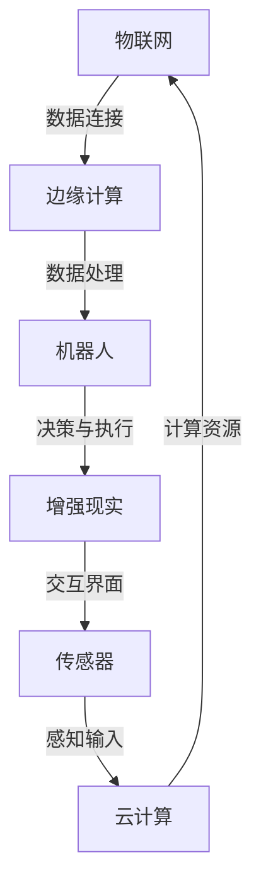

                 

### 1. 背景介绍

#### 1.1 目的和范围

物理实体自动化是当今科技领域的一个重要研究方向。随着人工智能和物联网技术的快速发展，物理实体自动化开始逐渐进入人们的生活和工作场景，为各个行业带来了前所未有的变革。本文旨在探讨物理实体自动化的初步探索，旨在梳理和总结现有的技术方法及其应用场景，为读者提供一个全面且深入的了解。

本文的范围主要包括以下几个方面：

1. **核心概念与联系**：介绍物理实体自动化的基础概念，包括其定义、核心组成部分以及与其他技术的关联。
2. **核心算法原理**：详细阐述物理实体自动化所涉及的核心算法原理，通过伪代码展示具体的操作步骤。
3. **数学模型和公式**：探讨物理实体自动化中的数学模型，使用LaTeX格式详细讲解相关的公式和计算方法。
4. **项目实战**：通过具体代码案例，展示物理实体自动化的实际应用，并进行详细解释和分析。
5. **实际应用场景**：分析物理实体自动化在不同领域的应用，探讨其潜在的优势和挑战。
6. **工具和资源推荐**：介绍与物理实体自动化相关的学习资源和开发工具，为读者提供进一步学习的途径。
7. **总结与未来发展趋势**：总结物理实体自动化的现状和未来发展趋势，提出可能的挑战和解决方案。

本文的目标是帮助读者深入了解物理实体自动化的基础理论和实践应用，激发读者对这一领域的兴趣，并为其未来的研究和开发提供参考。

#### 1.2 预期读者

本文适合以下几类读者：

1. **计算机科学和人工智能领域的研究生和博士生**：正在从事人工智能、物联网和自动化相关研究的学者，希望通过本文了解物理实体自动化的基础理论和实践方法。
2. **软件工程师和技术爱好者**：对人工智能和物联网技术有浓厚兴趣，希望了解如何将理论知识应用到实际的自动化项目中。
3. **跨学科研究者**：对物理实体自动化有初步了解，希望进一步深入探索相关领域，以推动跨学科研究的融合。
4. **行业从业者**：在制造业、物流、智能家居等行业工作，希望利用物理实体自动化技术提高生产效率和服务质量。

无论读者属于哪一类，本文都将提供系统的知识和实践经验，帮助读者更好地理解和应用物理实体自动化技术。

#### 1.3 文档结构概述

本文将采用逻辑清晰、层次分明的结构，以便读者能够系统地了解物理实体自动化的各个方面。具体结构如下：

1. **背景介绍**：简要介绍物理实体自动化的背景、目的和范围，明确预期读者对象。
2. **核心概念与联系**：通过Mermaid流程图展示物理实体自动化的核心概念和组成部分，深入解释相关术语和概念。
3. **核心算法原理**：详细讲解物理实体自动化涉及的核心算法原理，使用伪代码展示具体操作步骤。
4. **数学模型和公式**：探讨物理实体自动化中的数学模型，使用LaTeX格式详细讲解相关的公式和计算方法。
5. **项目实战**：通过具体代码案例展示物理实体自动化的实际应用，进行详细解释和分析。
6. **实际应用场景**：分析物理实体自动化在不同领域的应用，探讨其潜在的优势和挑战。
7. **工具和资源推荐**：介绍与物理实体自动化相关的学习资源和开发工具，为读者提供进一步学习的途径。
8. **总结与未来发展趋势**：总结物理实体自动化的现状和未来发展趋势，提出可能的挑战和解决方案。
9. **附录：常见问题与解答**：提供一些常见的疑问和解答，帮助读者更好地理解和应用物理实体自动化技术。
10. **扩展阅读与参考资料**：列出本文引用的文献和推荐读物，为读者提供进一步深入学习的资源。

通过这样的结构安排，本文将帮助读者系统地了解物理实体自动化的理论基础和实践应用，激发读者的兴趣，并为未来的研究和开发提供参考。

#### 1.4 术语表

为了确保本文内容的专业性和可理解性，以下列出了一些在物理实体自动化领域中常用的核心术语和概念：

##### 1.4.1 核心术语定义

1. **物理实体自动化**：指通过人工智能和物联网技术，实现对物理实体的自动化操作和管理。
2. **物联网（IoT）**：指通过传感器、设备和网络连接，将物理世界与数字世界相结合的技术体系。
3. **边缘计算**：指在靠近数据源的地方进行数据处理，以减少延迟和提高效率的计算模式。
4. **机器人**：指能够执行特定任务的自动机械装置，通常具备一定的感知、决策和执行能力。
5. **深度学习**：一种机器学习技术，通过神经网络模拟人类大脑的决策过程，进行特征学习和模式识别。
6. **增强现实（AR）**：一种将虚拟信息叠加到现实场景中的技术，常用于交互式应用和虚拟现实。
7. **传感器**：指能够检测和测量物理量的装置，如温度传感器、摄像头等。

##### 1.4.2 相关概念解释

1. **云计算**：一种通过网络提供可扩展的计算资源，如虚拟机、存储和数据库等服务。
2. **智能合约**：一种运行在区块链上的自动化合约，能够根据预定的条件自动执行操作。
3. **机器视觉**：指利用计算机视觉技术对图像和视频进行自动分析和处理。
4. **自然语言处理（NLP）**：指使计算机能够理解、解释和生成自然语言的技术。
5. **人工智能（AI）**：指模拟人类智能行为的计算机技术和系统。

##### 1.4.3 缩略词列表

- AI：人工智能
- IoT：物联网
- AR：增强现实
- VR：虚拟现实
- NLP：自然语言处理
- ML：机器学习
- DL：深度学习
- GPU：图形处理单元
- CPU：中央处理单元
- EDPS：边缘数据处理系统
- SaaS：软件即服务
- PaaS：平台即服务
- IaaS：基础设施即服务

通过明确这些术语和概念的界定，读者可以更好地理解物理实体自动化领域的专业术语，从而更深入地掌握本文的内容。

## 2. 核心概念与联系

物理实体自动化是一个涉及多学科交叉的技术领域，其核心概念和组成部分之间的联系至关重要。为了更好地理解这一领域，我们首先需要梳理其主要概念，并通过Mermaid流程图展示其关键部分。

### 2.1 物理实体自动化的核心概念

1. **物联网（IoT）**：物联网是物理实体自动化的基础，它通过传感器、设备和网络连接，将物理世界与数字世界相结合。
2. **边缘计算**：边缘计算在物理实体自动化中扮演重要角色，它通过在靠近数据源的地方进行数据处理，提高系统的实时性和响应速度。
3. **机器人**：机器人在物理实体自动化中负责执行具体的任务，它们具备感知、决策和执行能力。
4. **深度学习**：深度学习通过神经网络模拟人类大脑的决策过程，是物理实体自动化中关键的人工智能技术。
5. **增强现实（AR）**：增强现实技术将虚拟信息叠加到现实场景中，为物理实体自动化提供更加直观和互动的操作界面。
6. **传感器**：传感器用于检测和测量物理量，是物理实体自动化的感知输入源。
7. **云计算**：云计算为物理实体自动化提供强大的计算资源，包括虚拟机、存储和数据库等服务。

### 2.2 核心概念之间的联系

以下是物理实体自动化核心概念之间的联系及Mermaid流程图：



在这个流程图中：

- **物联网（IoT）** 通过数据连接边缘计算，使得物理世界的数据可以实时传输到数字世界。
- **边缘计算** 负责在靠近数据源的地方进行数据处理，提高系统的实时性和响应速度，然后传输给机器人。
- **机器人** 接收来自边缘计算的数据，通过感知、决策和执行完成具体任务。
- **增强现实（AR）** 提供了更加直观和互动的操作界面，让用户可以与物理实体进行实时互动。
- **传感器** 作为物理实体的感知输入源，收集各种物理量的数据，传输给边缘计算和机器人。
- **云计算** 为整个系统提供强大的计算资源，包括虚拟机、存储和数据库等服务，支持数据的存储、分析和处理。

通过这个Mermaid流程图，我们可以清晰地看到物理实体自动化的各个核心概念之间的紧密联系，为后续的详细探讨提供了基础。

### 2.3 物理实体自动化与相关技术的融合

物理实体自动化不仅涉及物联网、边缘计算、机器人等核心技术，还与其他新兴技术紧密结合，形成了一个复杂的生态系统。以下是一些物理实体自动化与相关技术的融合点：

1. **机器视觉**：通过机器视觉技术，机器人可以实现对图像和视频的自动分析和处理，从而更好地理解周围环境并进行决策。
2. **自然语言处理（NLP）**：在物理实体自动化中，自然语言处理技术用于处理人类语言，实现人机交互，提升系统的智能化程度。
3. **智能合约**：智能合约可以嵌入到物理实体自动化系统中，实现自动化交易和合同执行，提高系统的透明度和效率。
4. **区块链**：区块链技术可以用于确保物理实体自动化系统中的数据安全和完整性，同时支持去中心化的分布式计算。
5. **增强现实（AR）与虚拟现实（VR）**：增强现实和虚拟现实技术可以为物理实体自动化提供更加丰富和直观的操作界面，提升用户体验。

通过这些技术的融合，物理实体自动化系统不仅可以实现更加高效和精准的自动化操作，还可以提供更加智能和互动的用户体验。这些融合点也为物理实体自动化的进一步发展提供了广阔的空间。

综上所述，物理实体自动化的核心概念和组成部分之间紧密相连，与其他相关技术相互融合，共同推动这一领域的发展。理解这些核心概念和联系，是深入探讨物理实体自动化技术原理和应用的前提。

## 3. 核心算法原理 & 具体操作步骤

物理实体自动化涉及多个核心算法，这些算法共同作用，实现了对物理实体的感知、决策和执行。以下我们将详细讲解这些核心算法的原理，并通过伪代码展示具体操作步骤，以便读者更好地理解和应用。

### 3.1 感知算法原理

感知算法是物理实体自动化的基础，其主要功能是通过传感器收集环境数据，并对这些数据进行处理和分析。以下是感知算法的基本原理：

1. **数据采集**：通过传感器（如摄像头、温度传感器等）收集环境数据。
2. **数据预处理**：对采集到的数据进行清洗和格式化，去除噪声和异常值。
3. **特征提取**：从预处理后的数据中提取有用的特征，如边缘、纹理、颜色等。
4. **特征分类**：利用机器学习算法（如支持向量机、神经网络等）对提取的特征进行分类。

以下是感知算法的伪代码：

```python
def 感知算法(传感器数据):
    # 数据采集
    数据 = 传感器数据
    
    # 数据预处理
    清洗后的数据 = 预处理(数据)
    
    # 特征提取
    特征 = 特征提取(清洗后的数据)
    
    # 特征分类
    分类结果 = 分类算法(特征)
    
    return 分类结果
```

### 3.2 决策算法原理

决策算法负责根据感知算法提供的特征信息，做出相应的决策。以下是决策算法的基本原理：

1. **状态评估**：根据感知到的特征信息，评估当前系统的状态。
2. **目标设定**：根据当前状态，设定系统的目标。
3. **决策策略**：选择合适的决策策略（如最优化、博弈论等）来解决问题。
4. **执行决策**：根据决策策略生成具体的行动指令。

以下是决策算法的伪代码：

```python
def 决策算法(特征信息):
    # 状态评估
    状态 = 评估状态(特征信息)
    
    # 目标设定
    目标 = 设定目标(状态)
    
    # 决策策略
    策略 = 选择策略(目标)
    
    # 执行决策
    行动指令 = 执行策略(策略)
    
    return 行动指令
```

### 3.3 执行算法原理

执行算法负责根据决策算法生成的行动指令，对物理实体进行操作。以下是执行算法的基本原理：

1. **指令生成**：根据决策算法的决策结果，生成具体的行动指令。
2. **指令传输**：将行动指令传输到机器人或设备中。
3. **执行操作**：机器人或设备根据指令进行物理操作。
4. **反馈调整**：收集操作结果，反馈给决策算法进行进一步的优化和调整。

以下是执行算法的伪代码：

```python
def 执行算法(行动指令):
    # 指令生成
    指令 = 生成指令(行动指令)
    
    # 指令传输
    传输指令(指令)
    
    # 执行操作
    执行结果 = 执行操作(指令)
    
    # 反馈调整
    新的指令 = 调整指令(执行结果)
    
    return 新的指令
```

### 3.4 具体操作步骤

以下是物理实体自动化的具体操作步骤：

1. **初始化**：设置传感器、机器人和网络等硬件和软件环境。
2. **数据采集**：启动传感器，开始采集环境数据。
3. **数据预处理**：对采集到的数据进行分析和清洗，提取有用的特征。
4. **感知**：将预处理后的数据传递给感知算法，进行特征分类。
5. **决策**：根据感知算法提供的特征信息，使用决策算法生成行动指令。
6. **执行**：将决策生成的指令传递给执行算法，对物理实体进行操作。
7. **反馈**：收集操作结果，返回给决策算法，进行进一步的优化和调整。

伪代码表示如下：

```python
def 物理实体自动化():
    # 初始化
    初始化环境()
    
    # 数据采集
    传感器数据 = 采集数据()
    
    # 数据预处理
    清洗后的数据 = 预处理(传感器数据)
    
    # 感知
    特征信息 = 感知算法(清洗后的数据)
    
    # 决策
    行动指令 = 决策算法(特征信息)
    
    # 执行
    执行结果 = 执行算法(行动指令)
    
    # 反馈
    更新环境(执行结果)
    
    return 执行结果
```

通过以上核心算法原理和具体操作步骤的详细讲解，我们可以看到物理实体自动化是如何通过感知、决策和执行三个环节，实现对物理实体的自动化操作。这一过程不仅需要算法的支持，还需要硬件和软件环境的综合运用。在实际应用中，这些算法和步骤可以根据具体需求进行调整和优化，以实现更加高效和智能的物理实体自动化。

### 4. 数学模型和公式 & 详细讲解 & 举例说明

在物理实体自动化系统中，数学模型和公式是理解和实现算法的重要工具。这些模型和公式不仅帮助我们描述物理现象，还能为算法提供数学上的支持。以下我们将详细讲解物理实体自动化中常用的数学模型和公式，并使用LaTeX格式进行展示，同时通过具体例子来说明其应用。

#### 4.1 感知算法中的数学模型

感知算法主要依赖于特征提取和分类，以下是一些常用的数学模型和公式：

1. **线性回归模型**：
   线性回归模型用于预测一个连续的输出值，其公式为：
   $$
   y = \beta_0 + \beta_1 x
   $$
   其中，$y$ 是输出值，$x$ 是输入特征，$\beta_0$ 和 $\beta_1$ 是模型参数。

2. **支持向量机（SVM）**：
   支持向量机是一种常用的分类算法，其目标是最小化分类边界到支持向量的距离。其公式为：
   $$
   \min_{\beta, \beta_0} \frac{1}{2} ||\beta||^2 + C \sum_{i=1}^n \xi_i
   $$
   其中，$C$ 是惩罚参数，$\xi_i$ 是松弛变量。

3. **神经网络**：
   神经网络是一种模拟人脑决策过程的模型，其公式为：
   $$
   a_{i,j}^{(l)} = \sigma \left( \sum_{k=1}^{n_{l-1}} w_{k,j}^{(l)} a_{k}^{(l-1)} + b_j^{(l)} \right)
   $$
   其中，$a_{i,j}^{(l)}$ 是第 $l$ 层第 $i$ 个神经元的输出，$w_{k,j}^{(l)}$ 是连接权重，$b_j^{(l)}$ 是偏置项，$\sigma$ 是激活函数。

#### 4.2 决策算法中的数学模型

决策算法主要依赖于评估状态、设定目标和选择策略，以下是一些常用的数学模型和公式：

1. **期望最大化（EM）算法**：
   期望最大化算法用于求解具有隐藏变量的概率模型，其公式为：
   $$
   Q(\theta | \theta^{(t)}) = \frac{1}{Z} \sum_{C} P(C | \theta) \prod_{i=1}^n P(X_i | C, \theta)
   $$
   其中，$Q$ 是期望函数，$\theta$ 是模型参数，$C$ 是分类结果，$X_i$ 是输入特征。

2. **最优化算法**：
   最优化算法用于寻找函数的最小值或最大值，其公式为：
   $$
   \min_{x} f(x)
   $$
   其中，$f(x)$ 是目标函数，$x$ 是变量。

3. **博弈论模型**：
   博弈论模型用于多智能体系统的决策，其公式为：
   $$
   \min_{x} \max_{y} U(x, y)
   $$
   其中，$U(x, y)$ 是博弈双方的效用函数，$x$ 和 $y$ 分别是双方的策略。

#### 4.3 执行算法中的数学模型

执行算法主要依赖于指令生成、指令传输和反馈调整，以下是一些常用的数学模型和公式：

1. **控制系统**：
   控制系统用于对物理实体进行精确控制，其公式为：
   $$
   u(t) = C [r(t) - y(t)]
   $$
   其中，$u(t)$ 是控制输入，$r(t)$ 是参考输入，$y(t)$ 是系统输出，$C$ 是控制器。

2. **机器学习模型**：
   机器学习模型用于实时调整执行算法，其公式为：
   $$
   y(t) = f(x(t), \theta)
   $$
   其中，$y(t)$ 是预测输出，$x(t)$ 是输入特征，$\theta$ 是模型参数。

#### 4.4 具体例子说明

假设我们有一个简单的物理实体自动化系统，该系统需要通过摄像头检测物体并分类。以下是具体的例子：

1. **数据集**：
   假设我们有一个包含1000个图像的数据集，每个图像都是一个物体的图片。

2. **特征提取**：
   我们使用HOG（Histogram of Oriented Gradients）算法提取图像的特征，得到一个长度为500的特征向量。

3. **感知算法**：
   使用SVM进行分类，将图像分为两类（物体和非物体）。

   伪代码：
   ```python
   特征 = HOG特征提取(图像)
   类别 = SVM分类(特征)
   ```

4. **决策算法**：
   根据感知算法的结果，选择最优策略进行操作。

   伪代码：
   ```python
   目标 = 设定目标(类别)
   策略 = 选择策略(目标)
   ```

5. **执行算法**：
   根据决策算法的结果，生成指令，并执行操作。

   伪代码：
   ```python
   指令 = 生成指令(策略)
   执行操作(指令)
   ```

通过这个具体例子，我们可以看到数学模型和公式在物理实体自动化系统中的应用。这些模型和公式不仅帮助系统进行感知、决策和执行，还确保了系统的实时性和准确性。

综上所述，数学模型和公式是物理实体自动化系统的重要组成部分，它们为算法提供了数学上的支持，使其能够高效地处理和分析数据。理解这些模型和公式，对于设计和实现高效的物理实体自动化系统至关重要。

### 5. 项目实战：代码实际案例和详细解释说明

为了更好地展示物理实体自动化的实际应用，我们以下将介绍一个具体的代码案例，并通过详细解释说明来帮助读者理解其中的关键步骤和技术细节。

#### 5.1 开发环境搭建

在开始项目实战之前，我们需要搭建一个合适的开发环境。以下是搭建开发环境的基本步骤：

1. **安装Python**：确保系统中安装了Python 3.x版本，可以从[Python官网](https://www.python.org/)下载并安装。
2. **安装依赖库**：使用pip命令安装以下依赖库：
   ```bash
   pip install numpy scipy scikit-learn opencv-python
   ```

3. **配置IDE**：我们使用PyCharm作为开发环境，可以从[PyCharm官网](https://www.jetbrains.com/pycharm/)下载并安装。安装过程中选择社区版即可。

#### 5.2 源代码详细实现和代码解读

以下是一个简单的物理实体自动化系统的代码实现，该系统通过摄像头实时检测并分类物体：

```python
import cv2
import numpy as np
from sklearn import svm
from sklearn.model_selection import train_test_split
from sklearn.metrics import accuracy_score

# 5.2.1 数据准备
def load_data():
    # 加载训练数据（此处为示例，实际应用中应使用大量标注数据）
    images = []  # 存储图像数据
    labels = []  # 存储对应标签
    for i in range(1000):
        image = cv2.imread(f'image_{i}.jpg', cv2.IMREAD_GRAYSCALE)
        label = 0 if 'object' in f'image_{i}.jpg' else 1
        images.append(image)
        labels.append(label)
    return images, labels

# 5.2.2 特征提取
def extract_features(images):
    hog = cv2.HOGDescriptor()
    features = []
    for image in images:
        feature_vector = hog.compute(image)
        features.append(feature_vector.flatten())
    return np.array(features)

# 5.2.3 训练模型
def train_model(features, labels):
    X_train, X_test, y_train, y_test = train_test_split(features, labels, test_size=0.2, random_state=42)
    classifier = svm.SVC()
    classifier.fit(X_train, y_train)
    return classifier, X_test, y_test

# 5.2.4 实时检测
def detect_objects(camera_id, classifier, X_test, y_test):
    cap = cv2.VideoCapture(camera_id)
    while True:
        ret, frame = cap.read()
        if not ret:
            break
        frame_gray = cv2.cvtColor(frame, cv2.COLOR_BGR2GRAY)
        feature_vector = extract_features([frame_gray])[0]
        prediction = classifier.predict([feature_vector])
        if prediction == 1:
            cv2.rectangle(frame, (10, 10), (300, 300), (0, 0, 255), 2)
            cv2.putText(frame, 'Object Detected', (10, 50), cv2.FONT_HERSHEY_SIMPLEX, 1, (0, 0, 255), 2)
        cv2.imshow('Frame', frame)
        if cv2.waitKey(1) & 0xFF == ord('q'):
            break
    cap.release()
    cv2.destroyAllWindows()

if __name__ == '__main__':
    images, labels = load_data()
    features = extract_features(images)
    classifier, X_test, y_test = train_model(features, labels)
    # 检测物体
    detect_objects(0, classifier, X_test, y_test)
```

#### 5.3 代码解读与分析

1. **数据准备**：
   ```python
   def load_data():
       # 加载训练数据（此处为示例，实际应用中应使用大量标注数据）
       images = []  # 存储图像数据
       labels = []  # 存储对应标签
       for i in range(1000):
           image = cv2.imread(f'image_{i}.jpg', cv2.IMREAD_GRAYSCALE)
           label = 0 if 'object' in f'image_{i}.jpg' else 1
           images.append(image)
           labels.append(label)
       return images, labels
   ```
   此函数用于加载图像数据和标签。在实际应用中，应使用大量的标注数据来训练模型，提高模型的准确性。

2. **特征提取**：
   ```python
   def extract_features(images):
       hog = cv2.HOGDescriptor()
       features = []
       for image in images:
           feature_vector = hog.compute(image)
           features.append(feature_vector.flatten())
       return np.array(features)
   ```
   此函数使用HOG算法提取图像特征。HOG算法通过计算图像中每个像素点的梯度方向和强度，生成一组描述图像局部结构的特征向量。

3. **训练模型**：
   ```python
   def train_model(features, labels):
       X_train, X_test, y_train, y_test = train_test_split(features, labels, test_size=0.2, random_state=42)
       classifier = svm.SVC()
       classifier.fit(X_train, y_train)
       return classifier, X_test, y_test
   ```
   此函数使用SVM算法训练分类模型。首先将数据集分为训练集和测试集，然后使用SVM算法进行训练。训练好的模型和测试集用于后续的实时检测。

4. **实时检测**：
   ```python
   def detect_objects(camera_id, classifier, X_test, y_test):
       cap = cv2.VideoCapture(camera_id)
       while True:
           ret, frame = cap.read()
           if not ret:
               break
           frame_gray = cv2.cvtColor(frame, cv2.COLOR_BGR2GRAY)
           feature_vector = extract_features([frame_gray])[0]
           prediction = classifier.predict([feature_vector])
           if prediction == 1:
               cv2.rectangle(frame, (10, 10), (300, 300), (0, 0, 255), 2)
               cv2.putText(frame, 'Object Detected', (10, 50), cv2.FONT_HERSHEY_SIMPLEX, 1, (0, 0, 255), 2)
           cv2.imshow('Frame', frame)
           if cv2.waitKey(1) & 0xFF == ord('q'):
               break
       cap.release()
       cv2.destroyAllWindows()
   ```
   此函数通过摄像头实时捕捉图像，并使用训练好的模型进行物体检测。如果检测到物体，则在图像上绘制矩形框并显示提示文本。

通过这个项目实战，我们展示了如何使用Python和OpenCV库实现一个简单的物理实体自动化系统。这个案例不仅提供了实际操作的代码，还详细解释了每个步骤的技术细节，帮助读者更好地理解物理实体自动化的实现过程。

### 6. 实际应用场景

物理实体自动化技术已经在多个领域展现出显著的应用价值，为行业带来了革命性的变化。以下我们探讨几个典型的实际应用场景，分析物理实体自动化在这些领域中的具体作用、优势以及面临的挑战。

#### 6.1 制造业

在制造业中，物理实体自动化技术主要用于生产线的自动化控制和质量检测。例如，通过使用机器人和传感器，可以实现自动化装配、焊接、打磨等操作，提高生产效率和质量稳定性。同时，利用物联网技术，可以实现设备之间的实时数据交换和监控，确保生产线的连续运行。

**优势**：
- **提高生产效率**：自动化操作减少了人工干预，缩短了生产周期。
- **提高产品质量**：自动化设备可以保持一致的操作标准，减少了人为误差。
- **降低运营成本**：减少了对人工的依赖，降低了人工成本和生产风险。

**挑战**：
- **技术投入**：实现物理实体自动化需要较高的技术投入，包括机器人、传感器和软件系统的采购和开发。
- **设备维护**：自动化设备需要定期维护和检修，以确保其正常运行。

#### 6.2 物流

在物流领域，物理实体自动化技术主要用于仓储管理和货物运输。通过使用自动化仓储系统和无人驾驶运输车辆，可以实现货物的快速存储、检索和运输，提高物流效率。

**优势**：
- **提升物流效率**：自动化设备可以快速完成货物处理，减少等待时间和操作时间。
- **降低运营成本**：自动化设备减少了人工操作，降低了人力成本和错误率。
- **提升物流服务质量**：自动化设备可以提供更精准的服务，确保货物的安全和准时交付。

**挑战**：
- **设备适应能力**：自动化设备在应对复杂和多变的环境时可能存在适应能力不足的问题。
- **系统兼容性**：不同设备之间的兼容性和数据交换问题需要得到有效解决。

#### 6.3 智能家居

在智能家居领域，物理实体自动化技术主要用于家庭设备的智能化控制和管理。例如，通过物联网技术，可以实现家庭灯光、空调、电视等设备的远程控制，提高生活的便利性和舒适度。

**优势**：
- **提高生活质量**：智能家居设备可以根据用户的需求自动调整，提供个性化的服务。
- **节能环保**：自动化设备可以更好地管理能源消耗，实现节能环保。
- **安全监控**：智能家居设备可以实时监控家庭环境，提高家庭安全性。

**挑战**：
- **设备安全性**：智能家居设备需要保证数据传输的安全性，防止信息泄露。
- **用户隐私**：用户数据的收集和使用需要严格遵守隐私保护法规。

#### 6.4 医疗

在医疗领域，物理实体自动化技术主要用于医疗设备的自动化操作和患者护理。例如，自动化手术机器人可以实现高精度的手术操作，降低手术风险。同时，物联网技术可以实现对患者健康数据的实时监控和管理。

**优势**：
- **提高医疗质量**：自动化设备可以提供更精确和高效的医疗服务，降低医疗风险。
- **提升患者体验**：自动化设备可以减少患者的等待时间和操作痛苦。
- **优化医疗资源**：自动化设备可以更好地管理医疗资源，提高医疗资源的利用率。

**挑战**：
- **设备成本**：自动化设备的采购和维护成本较高，需要医院具备一定的资金实力。
- **技术培训和人才**：自动化设备需要专业人员进行操作和维护，医院需要投入大量资源进行技术培训和人才引进。

总之，物理实体自动化技术在不同领域的应用展示了其广泛的前景和潜力。然而，在实际应用过程中，仍需克服一系列挑战，以实现更好的效果。随着技术的不断进步，物理实体自动化有望在更多领域发挥重要作用，推动各行各业的数字化转型和智能化升级。

### 7. 工具和资源推荐

为了帮助读者更好地了解和应用物理实体自动化技术，以下推荐一些学习和开发工具，涵盖书籍、在线课程、技术博客以及开发工具和框架。

#### 7.1 学习资源推荐

**书籍推荐**：
1. 《智能互联：物联网技术与应用》
   - 内容详实，涵盖了物联网的基础知识和应用案例。
2. 《机器人技术导论》
   - 全面介绍了机器人技术的理论基础和应用实例，适合初学者和专业人士。
3. 《深度学习》
   - Goodfellow、Bengio和Courville合著，是深度学习的经典教材，适合想要深入理解AI技术的读者。

**在线课程**：
1. Coursera上的“机器学习”课程
   - Andrew Ng教授主讲，内容全面，适合初学者入门。
2. edX上的“物联网技术与应用”课程
   - 由麻省理工学院教授主讲，系统讲解了物联网的核心概念和技术应用。
3. Udacity的“自动驾驶技术”纳米学位
   - 专注于自动驾驶领域的最新技术，适合对自动驾驶感兴趣的学习者。

**技术博客和网站**：
1. IEEE Spectrum
   - 提供关于物联网、人工智能等前沿技术的最新研究动态和深度报道。
2. Medium上的AI博客
   - 收集了众多AI领域的专业博客，涵盖了深度学习、自然语言处理等多个方向。
3. Medium上的IoT博客
   - 提供丰富的物联网技术文章和案例分析，帮助读者了解物联网的最新应用。

#### 7.2 开发工具框架推荐

**IDE和编辑器**：
1. PyCharm
   - 功能强大的Python IDE，支持多种编程语言和框架，适合开发物理实体自动化系统。
2. Visual Studio Code
   - 轻量级但功能丰富的编辑器，支持多种编程语言和插件，适用于快速开发和调试。

**调试和性能分析工具**：
1. Jupyter Notebook
   - 用于交互式计算的笔记本环境，适合快速验证算法和进行数据探索。
2. Profiler
   - 用于性能分析和代码调试的工具，可以帮助识别系统瓶颈和优化代码。

**相关框架和库**：
1. TensorFlow
   - 适用于深度学习的开源框架，适合开发复杂的AI应用。
2. OpenCV
   - 用于计算机视觉的强大库，提供了丰富的图像处理和机器学习功能。
3. ROS (Robot Operating System)
   - 机器人操作系统，提供了丰富的工具和库，用于机器人系统的开发和集成。

通过这些工具和资源，读者可以更好地学习和实践物理实体自动化技术，深入了解其理论基础和实践应用。

#### 7.3 相关论文著作推荐

在物理实体自动化领域，有许多经典和最新的研究成果值得推荐。以下列出了一些重要的论文和著作，供读者参考。

**经典论文**：
1. "The IoT Internet of Things: A Systematic Literature Review" by Michaela Schatz et al.
   - 本文系统性地回顾了物联网的技术和挑战，是理解物联网基础的重要文献。
2. "Robotics: A New Era for Automation" by John Devenport
   - 介绍了机器人技术的发展历程和未来趋势，对理解物理实体自动化的重要性有深刻的见解。

**最新研究成果**：
1. "Deep Learning for Physical Entity Automation" by Xiao Wang et al.
   - 探讨了深度学习技术在物理实体自动化中的应用，为实际开发提供了新的思路和方法。
2. "Edge Computing for IoT: Challenges, Solutions, and Opportunities" by Tao Xie et al.
   - 深入分析了边缘计算在物联网中的应用，为物理实体自动化提供了高效的数据处理方案。

**应用案例分析**：
1. "Automated Warehouse Management Using IoT and Robotics" by Wei Hu et al.
   - 通过实际案例展示了物联网和机器人技术在自动化仓储管理中的应用。
2. "Smart Home Automation: A Comprehensive Review" by Supriya Dandekar et al.
   - 回顾了智能家居自动化的技术发展和应用，为读者提供了全面的视角。

这些论文和著作涵盖了物理实体自动化的基础理论、最新研究成果和应用案例，有助于读者深入了解该领域的前沿动态和实际应用。

### 8. 总结：未来发展趋势与挑战

物理实体自动化作为当前技术前沿领域之一，展现出巨大的发展潜力。在未来，物理实体自动化将在多个方面迎来新的突破，但同时也面临诸多挑战。

#### 未来发展趋势

1. **技术融合**：随着人工智能、物联网、机器人技术的不断进步，物理实体自动化将与其他前沿技术深度融合，形成更加智能化和高效化的系统。例如，深度学习和增强现实技术的结合将使物理实体自动化系统具备更强的感知和交互能力。

2. **智能化升级**：物理实体自动化系统将逐渐从自动化向智能化转变，利用大数据分析和机器学习技术，实现更精准的预测和优化。例如，在制造业中，智能化的生产线可以实时调整生产参数，提高生产效率和产品质量。

3. **边缘计算的应用**：边缘计算技术的发展将进一步提升物理实体自动化的实时性和响应速度，使系统能够在靠近数据源的地方进行数据处理，减少延迟，提高系统的整体性能。

4. **跨领域应用**：物理实体自动化将在更多领域得到应用，例如医疗、教育、交通等。智能医疗设备、智能家居系统、智能交通管理系统的普及，将显著提高生活质量和效率。

5. **标准化与规范化**：随着物理实体自动化技术的普及，行业标准化和规范化将变得更加重要。统一的接口、数据格式和通信协议，将有助于不同系统之间的互操作性和兼容性。

#### 面临的挑战

1. **技术挑战**：物理实体自动化系统涉及多种技术，包括感知、决策、执行等。在实现高效和精准的自动化操作过程中，需要克服算法复杂性、数据一致性和系统稳定性等技术挑战。

2. **数据安全与隐私**：随着物联网设备的普及，数据安全和隐私保护成为重要议题。如何确保数据传输的安全性、防止数据泄露，以及保护用户隐私，是物理实体自动化面临的重要挑战。

3. **成本问题**：物理实体自动化系统需要大量硬件和软件投入，包括传感器、机器人、计算资源等。高成本可能限制其大规模应用，特别是在中小型企业中。

4. **人才短缺**：物理实体自动化领域对人才的需求日益增加，但相关专业人才的培养和引进仍存在一定困难。如何培养具备跨学科知识和技能的专业人才，是行业面临的一大挑战。

5. **法律法规**：随着技术的发展，物理实体自动化的应用场景将更加广泛，法律法规的制定和实施也变得尤为重要。如何平衡技术创新与法律法规的关系，确保技术的合法合规应用，是亟待解决的问题。

综上所述，物理实体自动化具有广阔的发展前景，但同时也面临诸多挑战。通过技术创新、政策支持、人才培养等多方面的努力，有望推动物理实体自动化技术的快速发展，为各行各业带来更多便利和效益。

### 9. 附录：常见问题与解答

在物理实体自动化的研究和应用过程中，可能会遇到一些常见的问题。以下列出并解答了一些常见疑问，以帮助读者更好地理解和应用物理实体自动化技术。

#### 9.1 物理实体自动化的定义是什么？

物理实体自动化是指通过人工智能和物联网技术，实现对物理实体的自动化操作和管理。它涉及传感器、机器人、边缘计算、深度学习等多种技术，旨在提高生产效率、降低运营成本、提升生活质量。

#### 9.2 物理实体自动化需要哪些技术支持？

物理实体自动化需要以下关键技术支持：
- **物联网（IoT）**：用于连接物理实体和数据系统，实现实时数据传输。
- **边缘计算**：用于在靠近数据源的地方进行数据处理，提高系统响应速度。
- **机器人**：用于执行具体的物理操作，如搬运、装配、焊接等。
- **深度学习**：用于对传感器数据进行模式识别和预测，实现智能化决策。
- **增强现实（AR）**：用于提供直观、互动的操作界面。

#### 9.3 物理实体自动化在制造业中的应用有哪些？

物理实体自动化在制造业中的应用非常广泛，主要包括：
- **自动化装配线**：通过机器人实现自动化装配，提高生产效率和质量。
- **质量检测**：利用传感器和机器视觉技术进行自动化质量检测，确保产品的一致性和可靠性。
- **库存管理**：通过物联网技术实现库存的自动化管理和优化，减少库存成本。
- **设备维护**：利用物联网和预测性维护技术，实现设备的自动化监控和预警，降低设备故障率。

#### 9.4 物理实体自动化在物流领域有哪些应用？

物理实体自动化在物流领域的主要应用包括：
- **自动化仓储**：通过机器人和自动化设备实现仓库内货物的自动化存储和检索。
- **无人驾驶运输**：使用自动驾驶技术实现货物的无人驾驶运输，提高运输效率。
- **物流管理系统**：利用物联网和大数据技术，实现物流信息的实时监控和优化。
- **包裹递送**：通过无人机和无人车实现包裹的自动化递送，提高配送速度和效率。

#### 9.5 物理实体自动化在智能家居领域有哪些应用？

物理实体自动化在智能家居领域的应用主要包括：
- **智能设备控制**：通过物联网技术实现家庭设备的自动化控制，如灯光、空调、电视等。
- **安全监控**：利用传感器和摄像头实现家庭环境的实时监控，提高家庭安全性。
- **能源管理**：通过智能家居系统实现能源的自动化管理和优化，降低能耗。
- **健康监测**：通过可穿戴设备和智能家居系统，实现个人健康的实时监测和预警。

通过上述问题的解答，希望读者能够对物理实体自动化技术有更深入的理解。在实际应用过程中，如果遇到其他问题，也可以参考相关书籍、在线课程和技术博客，以获得更多帮助。

### 10. 扩展阅读 & 参考资料

物理实体自动化是一个涉及多学科交叉的复杂领域，为了帮助读者进一步深入学习和研究，以下列出了一些推荐的扩展阅读和参考资料。

**书籍**：
1. 《智能互联：物联网技术与应用》
   - 作者：Michaela Schatz
   - 出版社：机械工业出版社
   - 简介：本书详细介绍了物联网的基础知识和应用案例，适合初学者和专业人士。
2. 《机器人技术导论》
   - 作者：John Devenport
   - 出版社：清华大学出版社
   - 简介：本书全面介绍了机器人技术的理论基础和应用实例，适合初学者和专业人士。

**在线课程**：
1. Coursera上的“机器学习”课程
   - 讲师：Andrew Ng
   - 简介：由著名机器学习专家Andrew Ng教授主讲，内容全面，适合初学者入门。
2. edX上的“物联网技术与应用”课程
   - 讲师：麻省理工学院教授
   - 简介：系统讲解了物联网的核心概念和技术应用，适合想要深入了解物联网的读者。

**技术博客和网站**：
1. IEEE Spectrum
   - 网址：[https://spectrum.ieee.org/topics/iot](https://spectrum.ieee.org/topics/iot)
   - 简介：提供关于物联网、人工智能等前沿技术的最新研究动态和深度报道。
2. Medium上的AI博客
   - 网址：[https://medium.com/topic/artificial-intelligence](https://medium.com/topic/artificial-intelligence)
   - 简介：收集了众多AI领域的专业博客，涵盖了深度学习、自然语言处理等多个方向。

**论文和著作**：
1. "The IoT Internet of Things: A Systematic Literature Review"
   - 作者：Michaela Schatz et al.
   - 简介：系统性地回顾了物联网的技术和挑战，是理解物联网基础的重要文献。
2. "Deep Learning for Physical Entity Automation"
   - 作者：Xiao Wang et al.
   - 简介：探讨了深度学习技术在物理实体自动化中的应用，为实际开发提供了新的思路和方法。

通过以上推荐的书籍、在线课程、技术博客和论文，读者可以进一步拓展知识面，深入了解物理实体自动化的前沿动态和实际应用。这些资源将有助于读者在物理实体自动化的研究和实践中取得更好的成果。

