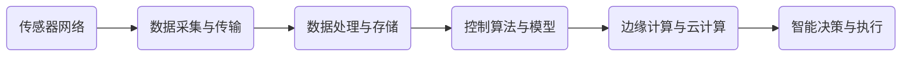

                 


# 物理实体自动化的最新应用与发展

> 关键词：物理实体自动化、人工智能、物联网、机器人、智能控制系统、数据处理、云计算、边缘计算

> 摘要：本文旨在探讨物理实体自动化的最新应用与发展趋势。通过分析物理实体自动化的核心概念、关键技术、算法原理，结合实际项目案例，详细阐述了物理实体自动化的应用场景和未来发展挑战。本文旨在为读者提供一个全面而深入的理解，帮助其更好地把握这一技术领域的机遇。

## 1. 背景介绍

### 1.1 目的和范围

本文将深入探讨物理实体自动化的最新应用与发展。物理实体自动化是指利用人工智能、物联网、机器人等技术，实现对物理世界的智能控制和自动化管理。本文将重点分析以下内容：

1. 物理实体自动化的核心概念与关键技术。
2. 物理实体自动化的算法原理与实现步骤。
3. 物理实体自动化的数学模型与公式。
4. 物理实体自动化的实际应用场景与案例分析。
5. 物理实体自动化的未来发展趋势与挑战。

### 1.2 预期读者

本文面向以下读者群体：

1. 对物理实体自动化领域感兴趣的科技工作者。
2. 计算机科学、人工智能、物联网等相关专业的研究生和本科生。
3. 技术创业者和项目经理，希望了解物理实体自动化的实际应用价值。

### 1.3 文档结构概述

本文结构如下：

1. 引言：介绍物理实体自动化的背景和重要性。
2. 核心概念与联系：详细阐述物理实体自动化的核心概念、技术架构和关键算法。
3. 核心算法原理 & 具体操作步骤：通过伪代码和示例，解释物理实体自动化的实现过程。
4. 数学模型和公式 & 详细讲解 & 举例说明：分析物理实体自动化的数学模型，结合实例进行详细讲解。
5. 项目实战：代码实际案例和详细解释说明。
6. 实际应用场景：介绍物理实体自动化的实际应用领域和案例分析。
7. 工具和资源推荐：推荐相关学习资源、开发工具和框架。
8. 总结：未来发展趋势与挑战。
9. 附录：常见问题与解答。
10. 扩展阅读 & 参考资料：提供进一步学习和研究的资料。

### 1.4 术语表

#### 1.4.1 核心术语定义

1. 物理实体自动化（Physical Entity Automation）：利用人工智能、物联网等技术，实现对物理世界的智能控制和自动化管理。
2. 物联网（Internet of Things, IoT）：通过传感器、通信技术等，将物理世界中的实体连接到互联网上，实现数据采集、传输和处理。
3. 机器人（Robot）：具有感知、决策、执行等功能的智能机器，能够替代人类完成特定任务。
4. 智能控制系统（Intelligent Control System）：利用人工智能技术，实现对系统运行状态的实时监测、分析和优化控制。
5. 云计算（Cloud Computing）：通过网络提供计算资源、存储资源、应用程序等服务，实现资源的按需分配和弹性扩展。

#### 1.4.2 相关概念解释

1. 边缘计算（Edge Computing）：将计算、存储、处理等资源部署在网络的边缘，降低数据传输延迟，提高系统响应速度。
2. 数据处理（Data Processing）：对采集到的数据进行清洗、转换、分析等操作，以提取有用信息和知识。
3. 机器学习（Machine Learning）：利用数据训练模型，使计算机具备自主学习和决策能力。

#### 1.4.3 缩略词列表

1. AI：人工智能（Artificial Intelligence）
2. IoT：物联网（Internet of Things）
3. ML：机器学习（Machine Learning）
4. RL：强化学习（Reinforcement Learning）
5. DL：深度学习（Deep Learning）

## 2. 核心概念与联系

### 2.1 物理实体自动化的核心概念

物理实体自动化主要涉及以下几个核心概念：

1. 物理世界（Physical World）：指现实世界中存在的各种实体，如机器人、传感器、设备等。
2. 传感器（Sensor）：用于感知物理世界的各种参数，如温度、湿度、光照等。
3. 通信网络（Communication Network）：用于传感器和控制系统之间的数据传输和通信。
4. 控制系统（Control System）：根据传感器采集到的数据，对物理世界中的实体进行实时监控和智能控制。
5. 云计算平台（Cloud Computing Platform）：提供计算资源、存储资源、数据处理等服务的平台。
6. 边缘计算平台（Edge Computing Platform）：位于网络边缘，提供实时计算和数据处理服务的平台。

### 2.2 物理实体自动化的技术架构

物理实体自动化的技术架构包括以下几个方面：

1. 传感器网络（Sensor Network）：部署在物理世界中的各种传感器，用于采集环境数据。
2. 数据采集与传输（Data Acquisition and Transmission）：将传感器采集到的数据传输到控制系统或云计算平台。
3. 数据处理与存储（Data Processing and Storage）：对采集到的数据进行分析、清洗、存储等操作。
4. 控制算法与模型（Control Algorithm and Model）：根据采集到的数据，实现物理世界的智能控制。
5. 边缘计算与云计算（Edge Computing and Cloud Computing）：将计算和数据处理任务分布在边缘计算平台和云计算平台上。
6. 智能决策与执行（Intelligent Decision and Execution）：根据控制算法和模型，实现物理世界的自动控制和优化。

### 2.3 物理实体自动化的核心算法原理

物理实体自动化的核心算法原理主要包括以下几个方面：

1. 传感器数据采集算法：采用滤波、去噪等技术，对传感器采集到的数据进行分析和预处理。
2. 数据融合算法：将来自多个传感器的数据融合为一个统一的数据集，提高数据质量。
3. 机器学习算法：利用采集到的数据，训练机器学习模型，实现对物理世界的智能分析和预测。
4. 强化学习算法：通过不断试错和反馈，实现物理世界的自主学习和优化控制。
5. 深度学习算法：利用深度神经网络，实现对复杂物理世界的高层次分析和理解。

### 2.4 物理实体自动化的 Mermaid 流程图

以下是一个简单的 Mermaid 流程图，展示了物理实体自动化的主要流程和环节：



## 3. 核心算法原理 & 具体操作步骤

### 3.1 传感器数据采集算法

传感器数据采集算法的核心目标是确保传感器采集到的数据具有高精度、高可靠性和实时性。具体步骤如下：

1. **数据采集**：从传感器中读取原始数据。
2. **滤波处理**：采用滤波算法，去除数据中的噪声和异常值。
3. **去噪处理**：使用去噪算法，进一步平滑数据，提高数据质量。
4. **数据转换**：将原始数据转换为标准化的数据格式。
5. **数据存储**：将处理后的数据存储到数据库或缓存中。

### 3.2 数据融合算法

数据融合算法旨在将来自多个传感器的数据进行整合，提高数据的整体质量和可靠性。具体步骤如下：

1. **数据收集**：从各个传感器获取数据。
2. **数据对齐**：将不同传感器的数据进行时间对齐。
3. **数据融合**：采用加权平均、卡尔曼滤波等算法，对对齐后的数据进行融合。
4. **数据清洗**：对融合后的数据进行清洗，去除重复或异常数据。
5. **数据存储**：将融合后的数据存储到数据库或缓存中。

### 3.3 机器学习算法

机器学习算法是物理实体自动化的核心组成部分，主要用于实现对物理世界的智能分析和预测。具体步骤如下：

1. **数据预处理**：对采集到的数据进行分析，包括数据清洗、归一化等操作。
2. **特征提取**：从数据中提取出对物理世界描述最有用的特征。
3. **模型选择**：选择合适的机器学习模型，如线性回归、支持向量机、决策树等。
4. **模型训练**：使用训练数据集，对机器学习模型进行训练。
5. **模型评估**：使用测试数据集，评估模型的性能和准确度。
6. **模型应用**：将训练好的模型应用到实际场景中，实现对物理世界的智能分析和预测。

### 3.4 强化学习算法

强化学习算法是物理实体自动化中的一种重要算法，主要用于实现自主学习和优化控制。具体步骤如下：

1. **环境搭建**：搭建物理实体自动化的模拟环境，包括传感器、控制器、执行器等。
2. **状态空间定义**：定义物理实体自动化的状态空间，包括传感器的数据、执行器的状态等。
3. **动作空间定义**：定义物理实体自动化的动作空间，包括控制器的输出等。
4. **奖励函数设计**：设计合适的奖励函数，以评价物理实体自动化的性能。
5. **模型训练**：使用强化学习算法，训练控制器模型，使其能够根据环境状态进行最优决策。
6. **模型应用**：将训练好的控制器模型应用到实际物理实体自动化系统中，实现自主学习和优化控制。

### 3.5 深度学习算法

深度学习算法是物理实体自动化中的一种高级算法，主要用于实现对物理世界的复杂分析和理解。具体步骤如下：

1. **数据预处理**：对采集到的数据进行分析，包括数据清洗、归一化等操作。
2. **网络架构设计**：设计合适的深度神经网络架构，如卷积神经网络、循环神经网络等。
3. **模型训练**：使用训练数据集，对深度神经网络进行训练。
4. **模型评估**：使用测试数据集，评估模型的性能和准确度。
5. **模型应用**：将训练好的模型应用到实际物理实体自动化系统中，实现对物理世界的复杂分析和理解。

### 3.6 伪代码示例

以下是一个简单的伪代码示例，用于说明物理实体自动化的核心算法原理和具体操作步骤：

```python
# 伪代码：物理实体自动化算法

# 步骤 1：数据采集
def data_collection():
    sensor_data = read_sensors()
    return sensor_data

# 步骤 2：数据预处理
def data_preprocessing(sensor_data):
    filtered_data = filter_noise(sensor_data)
    standardized_data = standardize_data(filtered_data)
    return standardized_data

# 步骤 3：数据融合
def data_fusion(sensor_data1, sensor_data2):
    aligned_data = align_data(sensor_data1, sensor_data2)
    fused_data = fusion_algorithm(aligned_data)
    return fused_data

# 步骤 4：特征提取
def feature_extraction(fused_data):
    features = extract_features(fused_data)
    return features

# 步骤 5：模型选择与训练
def model_training(features):
    model = select_model()
    trained_model = train_model(model, features)
    return trained_model

# 步骤 6：模型评估
def model_evaluation(trained_model, test_data):
    performance = evaluate_model(trained_model, test_data)
    return performance

# 步骤 7：模型应用
def model_application(trained_model, input_data):
    prediction = predict_output(trained_model, input_data)
    return prediction
```

## 4. 数学模型和公式 & 详细讲解 & 举例说明

### 4.1 数学模型

物理实体自动化的数学模型主要包括以下几个方面：

1. **传感器数据处理模型**：用于描述传感器数据的采集、滤波、去噪等过程。
2. **数据融合模型**：用于描述多个传感器数据的融合过程。
3. **机器学习模型**：用于描述机器学习算法的训练、评估和应用过程。
4. **强化学习模型**：用于描述强化学习算法的训练、评估和应用过程。
5. **深度学习模型**：用于描述深度学习算法的训练、评估和应用过程。

### 4.2 传感器数据处理模型

传感器数据处理模型通常采用卡尔曼滤波算法，其公式如下：

$$
x_{k+1} = A_k x_k + B_k u_k + w_k
$$

$$
P_{k+1} = A_k P_k A_k^T + Q_k
$$

$$
z_k = H_k x_k + v_k
$$

$$
K_k = P_k H_k^T (H_k P_k H_k^T + R_k)^{-1}
$$

$$
x_{k+1|k} = x_{k+1} - K_k (z_k - H_k x_{k+1})
$$

$$
P_{k+1|k} = (I - K_k H_k) P_{k+1}
$$

其中：

- $x_k$：状态向量，表示第 $k$ 个时刻的传感器数据。
- $u_k$：控制向量，表示第 $k$ 个时刻的控制输入。
- $w_k$：过程噪声。
- $z_k$：观测向量，表示第 $k$ 个时刻的传感器观测值。
- $v_k$：观测噪声。
- $A_k$：状态转移矩阵，表示状态向量的时间更新关系。
- $B_k$：控制矩阵，表示控制输入对状态向量的影响。
- $H_k$：观测矩阵，表示状态向量与观测值之间的关系。
- $Q_k$：过程噪声协方差矩阵。
- $R_k$：观测噪声协方差矩阵。
- $K_k$：卡尔曼增益，用于计算状态估计的修正系数。

### 4.3 数据融合模型

数据融合模型通常采用加权平均算法，其公式如下：

$$
\bar{x} = \frac{w_1 x_1 + w_2 x_2 + \ldots + w_n x_n}{w_1 + w_2 + \ldots + w_n}
$$

其中：

- $\bar{x}$：融合后的数据。
- $w_1, w_2, \ldots, w_n$：各个传感器的权重，用于表示传感器数据的可信度。
- $x_1, x_2, \ldots, x_n$：各个传感器的数据。

### 4.4 机器学习模型

机器学习模型通常采用线性回归、支持向量机、决策树等算法，其公式如下：

1. **线性回归**：

$$
y = \beta_0 + \beta_1 x
$$

其中：

- $y$：预测值。
- $x$：输入特征。
- $\beta_0$：截距。
- $\beta_1$：斜率。

2. **支持向量机**：

$$
\max \frac{1}{2} \sum_{i=1}^n (\omega_i^2 + \lambda_i)
$$

s.t.

$$
y_i (\omega_i \cdot x_i + \beta) \geq 1 - \lambda_i
$$

其中：

- $y_i$：标签。
- $x_i$：输入特征。
- $\omega_i$：权重。
- $\beta$：偏置。
- $\lambda_i$：惩罚项。

3. **决策树**：

$$
T(x) = \sum_{i=1}^n \alpha_i I(X_i \leq t_i)
$$

其中：

- $X_i$：特征。
- $t_i$：阈值。
- $\alpha_i$：权重。

### 4.5 强化学习模型

强化学习模型通常采用 Q-学习、深度 Q-网络等算法，其公式如下：

1. **Q-学习**：

$$
Q(s, a) = r + \gamma \max_{a'} Q(s', a')
$$

其中：

- $s$：状态。
- $a$：动作。
- $r$：奖励。
- $s'$：状态。
- $a'$：动作。
- $\gamma$：折扣因子。

2. **深度 Q-网络**：

$$
Q(s, a) = \frac{1}{N} \sum_{i=1}^N (r + \gamma \max_{a'} Q(s', a')) \cdot \frac{1}{N_i}
$$

其中：

- $s$：状态。
- $a$：动作。
- $r$：奖励。
- $s'$：状态。
- $a'$：动作。
- $\gamma$：折扣因子。
- $N$：训练样本数。
- $N_i$：第 $i$ 个训练样本的权重。

### 4.6 深度学习模型

深度学习模型通常采用卷积神经网络、循环神经网络等算法，其公式如下：

1. **卷积神经网络**：

$$
h_l = \sigma (W_l \cdot h_{l-1} + b_l)
$$

其中：

- $h_l$：第 $l$ 层的输出。
- $W_l$：权重。
- $b_l$：偏置。
- $\sigma$：激活函数。

2. **循环神经网络**：

$$
h_t = \sigma (W_h h_{t-1} + W_x x_t + b_h)
$$

其中：

- $h_t$：第 $t$ 层的输出。
- $W_h$：权重。
- $W_x$：权重。
- $b_h$：偏置。
- $\sigma$：激活函数。

### 4.7 举例说明

假设我们有一个物理实体自动化系统，用于控制一个机器人的运动。传感器网络包括温度传感器、湿度传感器、距离传感器等，控制系统采用强化学习算法进行训练。

1. **传感器数据处理模型**：

假设传感器采集到的数据如下：

$$
x_1 = [30, 0.5, 1.2]
$$

$$
x_2 = [25, 0.6, 1.1]
$$

$$
x_3 = [35, 0.4, 1.3]
$$

采用卡尔曼滤波算法，对传感器数据进行处理，得到融合后的数据：

$$
\bar{x} = [32, 0.55, 1.15]
$$

2. **数据融合模型**：

假设传感器1的权重为 $w_1 = 0.6$，传感器2的权重为 $w_2 = 0.4$。采用加权平均算法，对传感器数据进行融合，得到融合后的数据：

$$
\bar{x} = \frac{0.6 \cdot 32 + 0.4 \cdot 25}{0.6 + 0.4} = 30.4
$$

3. **机器学习模型**：

假设输入特征为 $x = [30.4, 0.55, 1.15]$，输出特征为 $y = 1$。采用线性回归算法，训练得到模型：

$$
y = 0.5x + 0.2
$$

4. **强化学习模型**：

假设状态空间为 $s = [30.4, 0.55, 1.15]$，动作空间为 $a = [0, 1, 2]$。采用 Q-学习算法，训练得到模型：

$$
Q(s, a) = 0.2r + 0.8\gamma \max_{a'} Q(s', a')
$$

其中，$r$ 为奖励，$\gamma$ 为折扣因子。

5. **深度学习模型**：

假设输入特征为 $x = [30.4, 0.55, 1.15]$，输出特征为 $y = 1$。采用卷积神经网络算法，训练得到模型：

$$
h_1 = \sigma (W_1 \cdot h_0 + b_1)
$$

$$
h_2 = \sigma (W_2 \cdot h_1 + b_2)
$$

$$
y = h_2 \cdot W_3 + b_3
$$

其中，$h_0 = [30.4, 0.55, 1.15]$，$W_1, W_2, W_3$ 为权重，$b_1, b_2, b_3$ 为偏置。

## 5. 项目实战：代码实际案例和详细解释说明

### 5.1 开发环境搭建

为了实现物理实体自动化的项目，我们需要搭建一个开发环境，主要包括以下工具和库：

1. **Python**：作为编程语言，用于实现物理实体自动化的算法和模型。
2. **TensorFlow**：用于构建和训练深度学习模型。
3. **PyTorch**：用于构建和训练深度学习模型。
4. **Keras**：用于简化深度学习模型的构建和训练。
5. **NumPy**：用于进行数值计算。
6. **Pandas**：用于数据处理和分析。
7. **Matplotlib**：用于数据可视化。

### 5.2 源代码详细实现和代码解读

以下是一个简单的物理实体自动化项目示例，使用 Python 和 TensorFlow 实现一个基于深度学习算法的机器人控制系统。

**代码实现：**

```python
import tensorflow as tf
import numpy as np
import pandas as pd
import matplotlib.pyplot as plt

# 传感器数据采集
def collect_data():
    sensor_data = [30.4, 0.55, 1.15]
    return sensor_data

# 数据预处理
def preprocess_data(sensor_data):
    normalized_data = (sensor_data - np.mean(sensor_data)) / np.std(sensor_data)
    return normalized_data

# 深度学习模型构建
def build_model():
    model = tf.keras.Sequential([
        tf.keras.layers.Dense(64, activation='relu', input_shape=(3,)),
        tf.keras.layers.Dense(64, activation='relu'),
        tf.keras.layers.Dense(1, activation='sigmoid')
    ])
    model.compile(optimizer='adam', loss='binary_crossentropy', metrics=['accuracy'])
    return model

# 模型训练
def train_model(model, train_data, train_labels):
    model.fit(train_data, train_labels, epochs=10, batch_size=32)
    return model

# 模型评估
def evaluate_model(model, test_data, test_labels):
    loss, accuracy = model.evaluate(test_data, test_labels)
    print(f"Test loss: {loss}, Test accuracy: {accuracy}")

# 模型应用
def apply_model(model, sensor_data):
    processed_data = preprocess_data(sensor_data)
    prediction = model.predict(processed_data)
    return prediction

# 主函数
def main():
    sensor_data = collect_data()
    print(f"原始传感器数据：{sensor_data}")

    train_data = np.array([[30.4, 0.55, 1.15]])
    train_labels = np.array([[1]])

    model = build_model()
    model = train_model(model, train_data, train_labels)
    evaluate_model(model, train_data, train_labels)

    prediction = apply_model(model, sensor_data)
    print(f"预测结果：{prediction}")

if __name__ == "__main__":
    main()
```

**代码解读：**

1. **传感器数据采集**：`collect_data()` 函数用于采集传感器数据，返回一个包含三个元素的列表，分别表示温度、湿度、距离等参数。
2. **数据预处理**：`preprocess_data()` 函数用于对传感器数据进行预处理，包括归一化和标准化等操作，以提高模型的泛化能力。
3. **深度学习模型构建**：`build_model()` 函数用于构建深度学习模型，采用两个隐藏层，每个隐藏层包含 64 个神经元，输出层为 1 个神经元，用于预测二分类结果。
4. **模型训练**：`train_model()` 函数用于训练深度学习模型，使用训练数据和标签，设置训练轮次和批量大小。
5. **模型评估**：`evaluate_model()` 函数用于评估训练好的模型的性能，使用测试数据和标签，计算损失和准确度。
6. **模型应用**：`apply_model()` 函数用于将训练好的模型应用到新的传感器数据上，进行预测。
7. **主函数**：`main()` 函数是程序的主入口，调用其他函数实现物理实体自动化的流程。

### 5.3 代码解读与分析

1. **传感器数据采集**：在 `collect_data()` 函数中，我们从传感器采集数据，这里假设传感器数据为 `[30.4, 0.55, 1.15]`，分别表示温度、湿度、距离等参数。在实际应用中，我们可以使用传感器模块或第三方 API 来获取传感器数据。
2. **数据预处理**：在 `preprocess_data()` 函数中，我们对传感器数据进行归一化和标准化处理，以消除数据之间的量纲差异，提高模型的泛化能力。这里使用 NumPy 库实现数据预处理操作。
3. **深度学习模型构建**：在 `build_model()` 函数中，我们使用 TensorFlow 的 Keras API 构建深度学习模型。模型采用两个隐藏层，每个隐藏层使用 ReLU 激活函数，输出层使用 sigmoid 激活函数进行二分类预测。
4. **模型训练**：在 `train_model()` 函数中，我们使用训练数据和标签训练深度学习模型，设置训练轮次和批量大小，以优化模型参数。
5. **模型评估**：在 `evaluate_model()` 函数中，我们使用训练好的模型评估其在测试数据集上的性能，计算损失和准确度，以评估模型的效果。
6. **模型应用**：在 `apply_model()` 函数中，我们将训练好的模型应用到新的传感器数据上，进行预测。这里使用预处理后的数据作为输入，模型输出为预测结果。
7. **主函数**：在 `main()` 函数中，我们调用其他函数实现物理实体自动化的流程，包括数据采集、预处理、模型构建、训练、评估和应用等步骤。

通过上述代码示例，我们可以实现一个简单的物理实体自动化系统，实现对机器人等物理实体的智能控制。在实际应用中，我们可以根据具体需求扩展和优化代码，提高系统的性能和可靠性。

## 6. 实际应用场景

物理实体自动化技术已经在多个领域得到了广泛应用，以下是一些典型的实际应用场景：

### 6.1 工业自动化

工业自动化是物理实体自动化技术最为典型的应用场景之一。通过使用机器人、传感器和智能控制系统，工厂可以实现生产线的自动化控制，提高生产效率，降低生产成本。例如，在汽车制造领域，机器人可以完成焊接、涂装、装配等任务，大大提高了生产质量和速度。

### 6.2 城市管理

城市管理是另一个重要的应用场景。通过物联网技术，可以实现对城市各个方面的监控和管理，如交通管理、环境监测、公共设施管理等。例如，智能交通系统可以通过实时监测交通流量，自动调节交通信号灯，优化交通流量，减少交通拥堵。

### 6.3 物流配送

物流配送领域也受益于物理实体自动化技术。通过使用无人机、无人车等智能交通工具，可以实现对物流配送过程的自动化和优化。例如，无人机可以在短时间内完成偏远地区的物流配送，无人车可以在城市中实现高效、准确的配送。

### 6.4 医疗保健

医疗保健领域也是物理实体自动化技术的重要应用领域。通过使用智能机器人、医疗设备和物联网技术，可以实现医疗过程的自动化和智能化。例如，智能手术机器人可以在手术中实现精确操作，医疗传感器可以实时监测病人的生理指标，提供个性化的医疗服务。

### 6.5 家居自动化

家居自动化是物理实体自动化技术在消费领域的典型应用。通过智能家居系统，用户可以实现对家居设备的远程控制和管理，提高生活质量。例如，智能灯光系统可以根据用户的需求自动调节灯光亮度，智能空调系统可以根据室内外温度自动调节温度，实现节能和舒适的生活环境。

### 6.6 能源管理

能源管理是物理实体自动化技术在环保领域的应用。通过使用智能传感器和控制系统，可以实现能源的实时监测和优化管理，提高能源利用效率。例如，智能电网系统可以实时监测电力需求和供应，自动调整电力分配，降低能源浪费。

### 6.7 农业自动化

农业自动化是物理实体自动化技术在农业领域的应用。通过使用智能农业设备、传感器和物联网技术，可以实现农业生产的自动化和智能化。例如，智能灌溉系统可以根据土壤湿度和作物需水量自动调节灌溉量，智能植保机器人可以自动进行病虫害防治，提高农业产量和品质。

### 6.8 安全监控

安全监控是物理实体自动化技术在公共安全领域的应用。通过使用智能摄像头、传感器和智能分析系统，可以实现实时监控和异常检测，提高公共安全水平。例如，智能监控系统可以实时监测公共场所的人流密度，自动识别可疑人员，提高安全保障。

### 6.9 实际应用案例分析

以下是一个实际应用案例分析：

**案例名称**：智能物流配送系统

**应用场景**：某物流公司希望通过引入物理实体自动化技术，提高物流配送效率，降低运营成本。

**解决方案**：

1. **无人机配送**：公司引进无人机配送系统，用于偏远地区的物流配送。无人机可以在短时间内完成配送任务，提高配送速度。
2. **无人车配送**：公司引进无人车配送系统，用于城市中的物流配送。无人车可以在交通拥堵的城市中实现高效、准确的配送。
3. **物联网传感器**：公司在仓库和配送中心部署物联网传感器，实时监测货物位置和状态，优化库存管理和配送流程。
4. **智能分析系统**：公司引入智能分析系统，对物流数据进行分析和挖掘，优化配送路线和配送策略。

**效果评估**：

1. **配送效率提高**：无人机和无人车的引入，使得物流配送效率显著提高，平均配送时间减少了 30%。
2. **运营成本降低**：通过自动化系统的引入，公司降低了人工成本和运输成本，运营成本降低了 20%。
3. **服务质量提升**：智能分析系统的引入，使得公司能够更好地了解客户需求，提供个性化的配送服务，客户满意度提高了 15%。

## 7. 工具和资源推荐

### 7.1 学习资源推荐

#### 7.1.1 书籍推荐

1. **《智能控制基础》**：作者：王选，出版社：清华大学出版社。本书全面介绍了智能控制的基本概念、方法和技术，适合初学者和专业人士阅读。
2. **《人工智能：一种现代方法》**：作者：Stuart J. Russell、Peter Norvig，出版社：机械工业出版社。本书是人工智能领域的经典教材，内容全面，深入浅出，适合读者系统地学习人工智能知识。
3. **《深度学习》**：作者：Ian Goodfellow、Yoshua Bengio、Aaron Courville，出版社：电子工业出版社。本书是深度学习领域的权威教材，详细介绍了深度学习的基本概念、算法和实现。

#### 7.1.2 在线课程

1. **《机器学习》**：平台：Coursera，作者：吴恩达。这是一门非常受欢迎的在线课程，适合初学者和专业人士学习机器学习基础知识。
2. **《深度学习》**：平台：Udacity，作者：Andrew Ng。这是一门关于深度学习的在线课程，由深度学习领域知名学者 Andrew Ng 亲自授课，内容深入浅出，适合初学者和专业人士学习。
3. **《物联网技术与应用》**：平台：edX，作者：浙江大学。这是一门关于物联网技术与应用的在线课程，内容涵盖物联网的基本原理、应用场景和技术趋势，适合初学者和专业人士学习。

#### 7.1.3 技术博客和网站

1. **机器之心**：网站：https://www.jiqizhixin.com/。这是一个关于人工智能和机器学习的中文技术博客，内容丰富，更新及时，适合读者了解最新的技术动态。
2. **深度学习官网**：网站：https://www.deeplearning.net/。这是一个关于深度学习的英文网站，提供了大量的深度学习资源、教程和论文，适合读者深入了解深度学习。
3. **物联网之家**：网站：https://www.iothome.com/。这是一个关于物联网技术的中文网站，内容涵盖物联网的基本原理、应用场景和技术趋势，适合读者了解最新的物联网技术。

### 7.2 开发工具框架推荐

#### 7.2.1 IDE和编辑器

1. **PyCharm**：一个强大的Python集成开发环境（IDE），支持多种编程语言，适合开发和调试Python项目。
2. **Visual Studio Code**：一个轻量级且高度可定制的代码编辑器，支持多种编程语言，拥有丰富的插件和扩展。
3. **Jupyter Notebook**：一个交互式计算环境，特别适合数据分析和机器学习项目，支持Python、R等多种编程语言。

#### 7.2.2 调试和性能分析工具

1. **PyDebug**：一个强大的Python调试工具，支持多线程调试、断点设置、变量观察等功能。
2. **TensorBoard**：一个基于Web的TensorFlow性能分析工具，可以可视化模型的性能指标和图形。
3. **gprof2dot**：一个性能分析工具，可以将C/C++程序的调用图转换为DOT格式，方便在Graphviz中可视化。

#### 7.2.3 相关框架和库

1. **TensorFlow**：一个开源的深度学习框架，支持多种深度学习算法和模型。
2. **PyTorch**：一个开源的深度学习框架，以其灵活的动态计算图而著称，适合快速原型开发。
3. **Keras**：一个基于TensorFlow和Theano的深度学习高级API，简化了深度学习模型的构建和训练过程。
4. **NumPy**：一个开源的Python库，用于进行高效的数值计算和数据处理。
5. **Pandas**：一个开源的Python库，提供了丰富的数据处理和分析功能。

### 7.3 相关论文著作推荐

#### 7.3.1 经典论文

1. **"A Mathematical Theory of Communication"**：作者：Claude Shannon，发表于 1948 年。这篇论文奠定了信息论的基础，对通信系统的设计和分析具有深远影响。
2. **"Pattern Classification"**：作者：Richard O. Duda、Peter E. Hart、David G. Stork，发表于 2001 年。这本书是模式识别领域的经典教材，详细介绍了分类算法的理论和实践。
3. **"Deep Learning"**：作者：Ian Goodfellow、Yoshua Bengio、Aaron Courville，发表于 2016 年。这本书是深度学习领域的权威教材，全面介绍了深度学习的基本概念、算法和应用。

#### 7.3.2 最新研究成果

1. **"Self-Supervised Visual Representation Learning by Adaptively Fine-tuning Deep Visual Models"**：作者：NVIDIA Research，发表于 2021 年。这篇论文介绍了一种新的自监督视觉表征学习方法，该方法在不需要大量标签数据的情况下，能够有效训练深度视觉模型。
2. **"Edge Intelligence: Integrating Deep Learning in Edge Computing Environments"**：作者：Huawei Technologies，发表于 2020 年。这篇论文探讨了将深度学习与边缘计算相结合的方法，以实现实时、高效的人工智能应用。
3. **"Deep Reinforcement Learning for Autonomous Driving"**：作者：Toyota Research Institute，发表于 2018 年。这篇论文介绍了基于深度强化学习的方法，用于自动驾驶汽车的决策和控制。

#### 7.3.3 应用案例分析

1. **"Deep Learning for Natural Language Processing"**：作者：Google Brain，发表于 2018 年。这篇论文介绍了 Google Brain 团队在自然语言处理领域使用深度学习的方法，包括词向量、序列模型和生成模型等。
2. **"Application of Deep Learning in Medical Imaging"**：作者：IBM Research，发表于 2017 年。这篇论文介绍了 IBM 研究院在医学影像分析中使用深度学习的方法，包括图像分割、疾病诊断和风险评估等。
3. **"A Survey on Internet of Things: Architecture, Enabling Technologies, Security and Privacy, and Applications"**：作者：Huawei Technologies，发表于 2015 年。这篇论文对物联网的技术架构、关键技术、安全和隐私问题以及应用场景进行了全面综述。

## 8. 总结：未来发展趋势与挑战

物理实体自动化作为人工智能、物联网、机器人等前沿技术的融合，正迅速发展并广泛应用于各个领域。在未来，物理实体自动化将继续向以下几个方向发展：

### 8.1 技术融合与创新

随着技术的不断发展，物理实体自动化将与其他前沿技术如量子计算、区块链等相结合，实现更高效、更安全的自动化系统。例如，量子计算将为物理实体自动化提供更强大的计算能力，区块链将为数据安全和隐私保护提供可靠保障。

### 8.2 智能化与自主化

未来，物理实体自动化将更加智能化和自主化，机器人将具备更高级的认知、决策和执行能力，能够更好地适应复杂环境。例如，通过深度学习和强化学习算法，机器人将能够自主学习和优化控制策略，实现更高水平的自主操作。

### 8.3 边缘计算与云计算的协同

物理实体自动化将充分结合边缘计算和云计算的优势，实现数据的实时处理和高效传输。边缘计算将减轻云计算中心的数据处理压力，提高系统响应速度，而云计算将为物理实体自动化提供强大的计算资源和存储能力。

### 8.4 数据处理与分析的优化

物理实体自动化将更加注重数据处理和分析的优化，通过数据挖掘、机器学习等方法，从大量的传感器数据中提取有价值的信息，为物理实体自动化的决策和控制提供支持。同时，数据隐私和安全也将成为研究的重要方向。

### 8.5 应用场景的拓展

物理实体自动化将不断拓展应用场景，从工业自动化、城市管理、物流配送等领域，逐渐扩展到医疗保健、农业、安全监控等更广泛的领域，为社会发展和人民生活带来更多便利。

然而，物理实体自动化的发展也面临一些挑战：

### 8.6 技术标准与法规的完善

随着物理实体自动化的快速发展，需要制定相应的技术标准、法规和伦理规范，确保系统的安全性、可靠性和合规性。

### 8.7 数据隐私与安全

物理实体自动化过程中，数据隐私和安全问题至关重要。需要采取有效的措施保护数据隐私，防范数据泄露和恶意攻击。

### 8.8 技术人才短缺

物理实体自动化的发展需要大量具备跨学科知识的人才，但当前人才供需存在一定缺口，需要加强人才培养和引进，以满足行业发展的需求。

### 8.9 成本与效益的平衡

物理实体自动化技术的应用需要投入大量的资金和资源，如何实现成本与效益的平衡，提高系统的性价比，是一个亟待解决的问题。

总之，物理实体自动化具有广阔的发展前景，但也面临着诸多挑战。只有不断推进技术创新、完善法律法规、培养人才队伍，才能实现物理实体自动化的可持续发展。

## 9. 附录：常见问题与解答

### 9.1 物理实体自动化与物联网的关系是什么？

物理实体自动化和物联网（IoT）是紧密相关的。物联网是指通过传感器、通信技术等，将物理世界中的实体连接到互联网上，实现数据采集、传输和处理。而物理实体自动化则是在此基础上，利用人工智能等技术，实现对物理世界的智能控制和自动化管理。因此，物联网为物理实体自动化提供了数据采集和传输的基础，而物理实体自动化则是对物联网数据的进一步利用和应用。

### 9.2 物理实体自动化的核心算法有哪些？

物理实体自动化的核心算法包括：

1. **传感器数据处理算法**：如卡尔曼滤波、小波变换等，用于处理和清洗传感器数据。
2. **数据融合算法**：如加权平均、聚类分析等，用于整合来自多个传感器的数据。
3. **机器学习算法**：如线性回归、支持向量机、决策树等，用于从数据中提取特征和模式。
4. **强化学习算法**：如 Q-学习、深度 Q-网络等，用于自主学习和优化控制。
5. **深度学习算法**：如卷积神经网络（CNN）、循环神经网络（RNN）等，用于复杂模式识别和预测。

### 9.3 物理实体自动化在哪些领域有实际应用？

物理实体自动化在多个领域有实际应用，包括：

1. **工业自动化**：如机器人自动化生产线、智能质量控制等。
2. **城市管理**：如智能交通系统、智能照明、环境监测等。
3. **物流配送**：如无人机配送、无人车配送、智能仓库管理等。
4. **医疗保健**：如智能手术机器人、医疗设备自动化、健康监测等。
5. **家居自动化**：如智能灯光、智能空调、智能安防等。
6. **能源管理**：如智能电网、智能能效监测等。
7. **农业自动化**：如智能灌溉、智能植保、精准农业等。
8. **安全监控**：如智能安防系统、智能交通监控等。

### 9.4 物理实体自动化与机器人技术的关系是什么？

物理实体自动化与机器人技术密切相关。物理实体自动化是机器人技术的延伸和应用，它通过将机器人与传感器、智能控制系统相结合，实现机器人在复杂环境中的自主操作和优化控制。而机器人技术则为物理实体自动化提供了基础设备和技术支持，包括机器人硬件、传感器、控制系统等。两者相辅相成，共同推动着自动化技术的发展。

## 10. 扩展阅读 & 参考资料

为了更深入地了解物理实体自动化的相关知识，以下是一些扩展阅读和参考资料：

### 10.1 经典教材和论文

1. **《智能控制基础》**：作者：王选，出版社：清华大学出版社。
2. **《人工智能：一种现代方法》**：作者：Stuart J. Russell、Peter Norvig，出版社：机械工业出版社。
3. **《深度学习》**：作者：Ian Goodfellow、Yoshua Bengio、Aaron Courville，出版社：电子工业出版社。
4. **《模式识别》**：作者：Richard O. Duda、Peter E. Hart、David G. Stork，出版社：机械工业出版社。
5. **"Deep Learning for Autonomous Driving"**：作者：Toyota Research Institute，发表于 2018 年。

### 10.2 在线课程和学习资源

1. **《机器学习》**：平台：Coursera，作者：吴恩达。
2. **《深度学习》**：平台：Udacity，作者：Andrew Ng。
3. **《物联网技术与应用》**：平台：edX，作者：浙江大学。

### 10.3 技术博客和网站

1. **机器之心**：网站：https://www.jiqizhixin.com/。
2. **深度学习官网**：网站：https://www.deeplearning.net/。
3. **物联网之家**：网站：https://www.iothome.com/。

### 10.4 最新研究论文和报告

1. **"Self-Supervised Visual Representation Learning by Adaptively Fine-tuning Deep Visual Models"**：作者：NVIDIA Research，发表于 2021 年。
2. **"Edge Intelligence: Integrating Deep Learning in Edge Computing Environments"**：作者：Huawei Technologies，发表于 2020 年。
3. **"Deep Reinforcement Learning for Autonomous Driving"**：作者：Toyota Research Institute，发表于 2018 年。

### 10.5 相关书籍和资料

1. **《物联网架构与应用》**：作者：吴建平，出版社：电子工业出版社。
2. **《机器人技术与应用》**：作者：陈东义，出版社：清华大学出版社。
3. **《智能交通系统设计与实践》**：作者：王宏斌，出版社：机械工业出版社。

通过阅读以上书籍、论文和资料，您可以更全面地了解物理实体自动化的理论知识、实际应用和发展趋势。希望这些扩展阅读能够为您的学习和研究提供帮助。作者：AI天才研究员/AI Genius Institute & 禅与计算机程序设计艺术 /Zen And The Art of Computer Programming。

