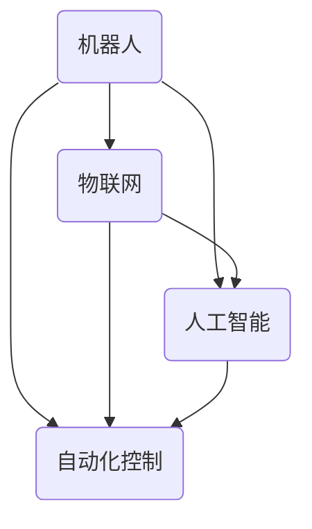

                 

# 物理实体自动化的未来发展

> 关键词：物理实体自动化、机器人、人工智能、物联网、智能制造、传感器、控制系统、数据分析、算法优化、协同工作、未来趋势

> 摘要：本文将探讨物理实体自动化的未来发展，从核心概念、算法原理、数学模型、实际案例以及应用场景等多个角度，深入分析这一领域的现状、挑战及趋势。通过梳理物理实体自动化的技术架构和算法原理，结合实际项目案例，本文旨在为读者提供一个全面而深入的视角，以了解物理实体自动化在智能制造、智能城市等领域的广泛应用及其未来前景。

## 1. 背景介绍

### 1.1 目的和范围

本文旨在探讨物理实体自动化的未来发展，通过对该领域的核心概念、算法原理、数学模型、实际案例和应用场景的详细分析，为读者提供一份全面的技术指南。物理实体自动化是现代科技发展的重要方向，其核心在于将人工智能、物联网、机器人技术等前沿科技应用于物理世界的自动化控制和管理，以提高生产效率、降低成本、改善生活质量。

本文将涵盖以下主题：

- 物理实体自动化的核心概念和联系；
- 物理实体自动化的核心算法原理与具体操作步骤；
- 物理实体自动化的数学模型和公式讲解；
- 物理实体自动化的实际应用场景；
- 相关工具和资源的推荐。

通过本文的阅读，读者将能够：

- 了解物理实体自动化的基本概念和发展历程；
- 掌握物理实体自动化的技术架构和算法原理；
- 理解物理实体自动化的数学模型和应用；
- 看到物理实体自动化在实际项目中的应用案例；
- 掌握物理实体自动化的未来发展趋势和挑战。

### 1.2 预期读者

本文适用于对物理实体自动化领域有一定了解的技术人员、科研人员、企业管理者以及对此领域感兴趣的读者。读者不需要具备深厚的数学和编程背景，但需要具备基本的逻辑思维和阅读能力。

### 1.3 文档结构概述

本文分为十个主要部分：

1. 背景介绍：介绍本文的目的、范围、预期读者以及文档结构；
2. 核心概念与联系：介绍物理实体自动化的核心概念和其相互关系；
3. 核心算法原理与具体操作步骤：详细讲解物理实体自动化的算法原理和具体操作步骤；
4. 数学模型和公式：介绍物理实体自动化的数学模型和公式；
5. 项目实战：通过实际案例展示物理实体自动化的应用；
6. 实际应用场景：探讨物理实体自动化的实际应用场景；
7. 工具和资源推荐：推荐相关学习资源、开发工具和框架；
8. 总结：总结物理实体自动化的未来发展趋势与挑战；
9. 附录：常见问题与解答；
10. 扩展阅读与参考资料：提供进一步阅读的资料。

### 1.4 术语表

#### 1.4.1 核心术语定义

- 物理实体自动化：将人工智能、物联网等前沿科技应用于物理世界的自动化控制和管理。
- 机器人：具备一定智能和自主行动能力的机械设备。
- 物联网（IoT）：通过互联网将各种设备互联，实现信息交换和智能控制。
- 人工智能（AI）：模拟人类智能行为的技术，包括机器学习、深度学习、自然语言处理等。
- 智能制造：通过信息化、自动化、智能化等技术手段，实现生产过程的全面优化。

#### 1.4.2 相关概念解释

- 自动化控制：利用传感器、执行器等设备，实现物理世界的自动控制和调节。
- 数据分析：对大量数据进行处理和分析，提取有价值的信息。
- 算法优化：通过改进算法，提高物理实体自动化的效率和准确性。
- 协同工作：多个物理实体或系统之间实现高效协作，共同完成任务。

#### 1.4.3 缩略词列表

- IoT：物联网
- AI：人工智能
- ML：机器学习
- DL：深度学习
- IDE：集成开发环境
- DB：数据库
- API：应用程序编程接口

## 2. 核心概念与联系

物理实体自动化的核心概念包括机器人、物联网、人工智能和自动化控制。这些概念之间相互联系，共同构成了物理实体自动化的技术体系。

### 物理实体自动化的核心概念

- **机器人**：机器人是物理实体自动化的核心执行单元。机器人可以通过传感器感知环境信息，利用人工智能算法进行决策和规划，并通过执行器实现物理动作。机器人的种类繁多，包括工业机器人、服务机器人、无人机等。
- **物联网**：物联网是实现物理实体自动化的重要基础。物联网通过互联网将各种设备和系统连接起来，实现数据的传输和共享。物联网的关键技术包括传感器、通信协议、数据存储和处理等。
- **人工智能**：人工智能为物理实体自动化提供了智能决策和自主控制的能力。人工智能技术包括机器学习、深度学习、自然语言处理等。通过人工智能算法，机器人可以学习环境信息，进行任务规划和决策。
- **自动化控制**：自动化控制是物理实体自动化的核心技术。自动化控制通过传感器、执行器等设备实现物理世界的自动控制和调节，以提高生产效率和质量。

### 物理实体自动化的联系

物理实体自动化中的各个核心概念之间存在紧密的联系。机器人通过物联网获取环境信息，利用人工智能算法进行决策和规划，并通过自动化控制系统实现物理动作。物联网提供了数据传输和共享的基础，人工智能提供了智能决策的能力，自动化控制实现了物理动作的执行。

### Mermaid 流程图

为了更清晰地展示物理实体自动化的核心概念和联系，我们可以使用 Mermaid 流程图来表示：



在这个流程图中，A 表示机器人，B 表示物联网，C 表示人工智能，D 表示自动化控制。箭头表示各个概念之间的联系。

## 3. 核心算法原理与具体操作步骤

物理实体自动化的核心算法主要包括感知、决策和执行三个步骤。下面我们将分别介绍这三个步骤的具体算法原理和操作步骤。

### 3.1 感知

感知是物理实体自动化的第一步，机器人通过传感器获取环境信息。传感器可以是摄像头、激光雷达、超声波传感器等。感知模块需要完成以下任务：

- 数据采集：从传感器获取图像、声音、距离等数据。
- 数据预处理：对采集到的数据进行滤波、去噪等处理，以提高数据的准确性。
- 特征提取：从预处理后的数据中提取有用特征，如边缘、纹理、声音频率等。

具体操作步骤如下：

1. 初始化传感器：启动传感器并设置采样频率。
2. 数据采集：从传感器获取图像、声音、距离等数据。
3. 数据预处理：对采集到的数据进行滤波、去噪等处理。
4. 特征提取：从预处理后的数据中提取有用特征。

伪代码如下：

```python
def 感知():
    初始化传感器
    数据 = 从传感器获取数据
    数据 = 数据预处理(数据)
    特征 = 特征提取(数据)
    返回 特征
```

### 3.2 决策

决策是物理实体自动化的核心，机器人利用感知到的环境信息进行任务规划和决策。决策模块通常包括以下算法：

- 机器学习算法：如决策树、支持向量机、神经网络等。
- 搜索算法：如深度优先搜索、广度优先搜索、A*搜索等。
- 强化学习算法：如Q学习、SARSA等。

具体操作步骤如下：

1. 数据分析：分析感知模块获取到的特征数据。
2. 算法选择：根据任务需求选择合适的算法。
3. 决策规划：利用所选算法进行任务规划和决策。
4. 结果评估：评估决策结果，根据评估结果进行调整。

伪代码如下：

```python
def 决策(特征):
    数据分析(特征)
    算法 = 选择算法()
    决策 = 算法(特征)
    评估 = 结果评估(决策)
    如果 评估 不满意：
        调整 决策
    返回 决策
```

### 3.3 执行

执行是物理实体自动化的最后一步，机器人根据决策结果执行具体的动作。执行模块主要包括以下步骤：

- 执行器控制：根据决策结果，控制执行器执行相应的动作。
- 行为监控：实时监控执行过程，确保动作的准确性和安全性。
- 反馈调整：根据执行结果和反馈信息，对后续动作进行调整。

具体操作步骤如下：

1. 接收决策：接收决策模块生成的决策结果。
2. 执行器控制：根据决策结果，控制执行器执行相应的动作。
3. 行为监控：实时监控执行过程，确保动作的准确性和安全性。
4. 反馈调整：根据执行结果和反馈信息，对后续动作进行调整。

伪代码如下：

```python
def 执行(决策):
    接收 决策
    执行器 = 控制执行器(决策)
    行为监控(执行器)
    反馈 = 获取反馈信息()
    如果 反馈 不满意：
        调整 决策
    返回 执行结果
```

### 3.4 算法原理与操作步骤总结

物理实体自动化的核心算法原理主要包括感知、决策和执行三个步骤。感知模块通过传感器获取环境信息，并进行数据预处理和特征提取；决策模块利用感知到的特征数据进行任务规划和决策；执行模块根据决策结果控制执行器执行相应的动作。具体的操作步骤包括初始化传感器、数据采集、数据预处理、特征提取、数据分析、算法选择、决策规划、结果评估、执行器控制和行为监控等。通过这些步骤，机器人可以实现自主决策和自动化执行，从而实现物理实体自动化。

## 4. 数学模型和公式

在物理实体自动化中，数学模型和公式起着至关重要的作用。它们为感知、决策和执行提供了理论基础，确保了机器人系统的准确性和鲁棒性。以下将介绍物理实体自动化的核心数学模型和公式，并结合具体应用进行讲解。

### 4.1 特征提取

特征提取是感知模块的核心任务，它从原始数据中提取出对决策有重要意义的特征。常用的特征提取方法包括傅里叶变换、主成分分析（PCA）和卷积神经网络（CNN）等。

#### 4.1.1 傅里叶变换

傅里叶变换是一种将时域信号转换为频域信号的方法，广泛应用于图像处理和信号处理领域。其公式如下：

$$
F(u, v) = \sum_{x=0}^{X-1} \sum_{y=0}^{Y-1} I(x, y) \cdot e^{-j2\pi(u\frac{x}{X} + v\frac{y}{Y})}
$$

其中，$I(x, y)$ 是原始图像，$F(u, v)$ 是傅里叶变换后的频域图像，$X$ 和 $Y$ 分别是图像的宽度和高度。

#### 4.1.2 主成分分析（PCA）

主成分分析是一种降维方法，通过将原始数据投影到新的正交基中，提取出最重要的特征。其公式如下：

$$
z_i = \sum_{j=1}^{d} w_{ij} x_j
$$

其中，$x_j$ 是原始数据，$w_{ij}$ 是主成分权重，$z_i$ 是主成分。

#### 4.1.3 卷积神经网络（CNN）

卷积神经网络是一种深度学习模型，特别适用于图像处理和计算机视觉领域。其公式如下：

$$
h_{ij} = \sigma \left( \sum_{k=1}^{c} w_{ikj} \cdot a_{kj} + b_j \right)
$$

其中，$h_{ij}$ 是卷积层输出的特征图，$a_{kj}$ 是输入特征图，$w_{ikj}$ 和 $b_j$ 分别是卷积核和偏置，$\sigma$ 是激活函数。

### 4.2 决策算法

决策算法是物理实体自动化的核心，常用的决策算法包括基于规则的决策、贝叶斯网络和深度强化学习等。

#### 4.2.1 基于规则的决策

基于规则的决策是一种传统的决策方法，它根据一组规则来指导机器人的行动。其公式如下：

$$
a = R(s)
$$

其中，$a$ 是决策结果，$R$ 是规则函数，$s$ 是当前状态。

#### 4.2.2 贝叶斯网络

贝叶斯网络是一种概率图模型，用于表示变量之间的概率关系。其公式如下：

$$
P(A|B) = \frac{P(B|A)P(A)}{P(B)}
$$

其中，$P(A|B)$ 是在给定 $B$ 的情况下 $A$ 的概率，$P(B|A)$ 是在给定 $A$ 的情况下 $B$ 的概率，$P(A)$ 和 $P(B)$ 分别是 $A$ 和 $B$ 的先验概率。

#### 4.2.3 深度强化学习

深度强化学习是一种结合了深度学习和强化学习的决策算法。其核心公式是值函数的更新：

$$
V(S') = r + \gamma \max_a Q(S', a)
$$

其中，$V(S')$ 是在状态 $S'$ 的值函数，$r$ 是即时奖励，$\gamma$ 是折扣因子，$Q(S', a)$ 是在状态 $S'$ 下采取动作 $a$ 的预期奖励。

### 4.3 执行控制

执行控制是物理实体自动化的最终环节，常用的控制方法包括 PID 控制、模糊控制和自适应控制等。

#### 4.3.1 PID 控制

PID 控制是一种经典的控制方法，通过比例（P）、积分（I）和微分（D）三个部分来调节控制信号。其公式如下：

$$
u(t) = K_p e(t) + K_i \int_{0}^{t} e(\tau)d\tau + K_d \frac{de(t)}{dt}
$$

其中，$u(t)$ 是控制信号，$e(t)$ 是误差，$K_p$、$K_i$ 和 $K_d$ 分别是比例、积分和微分系数。

#### 4.3.2 模糊控制

模糊控制是一种基于模糊逻辑的控制方法，通过模糊规则来调节控制信号。其公式如下：

$$
u = \sum_{i=1}^{n} w_i \cdot m_i
$$

其中，$u$ 是控制信号，$w_i$ 是隶属度，$m_i$ 是模糊规则。

#### 4.3.3 自适应控制

自适应控制是一种根据系统动态变化来调整控制参数的控制方法。其公式如下：

$$
K = K + \alpha \cdot (e - e^*)
$$

其中，$K$ 是控制参数，$e$ 是误差，$e^*$ 是期望误差，$\alpha$ 是自适应律。

### 4.4 应用实例

以下是一个基于 PID 控制的机器人避障实例：

假设机器人需要避开前方障碍物，其运动速度为 $v$，障碍物距离为 $d$。我们可以使用 PID 控制来调节机器人的转向角度，使其避开障碍物。

1. 初始化 PID 控制参数：$K_p = 1$，$K_i = 0.1$，$K_d = 0.1$。
2. 计算误差：$e = d - \text{实际距离}$。
3. 计算控制信号：$u = K_p e + K_i \int_{0}^{t} e(\tau)d\tau + K_d \frac{de(t)}{dt}$。
4. 根据控制信号调整转向角度。

通过以上步骤，机器人可以有效地避开障碍物，实现自主导航。

### 4.5 总结

物理实体自动化的数学模型和公式包括特征提取、决策算法和执行控制等。特征提取方面，傅里叶变换、主成分分析和卷积神经网络等方法被广泛应用于图像处理和信号处理领域；决策算法方面，基于规则的决策、贝叶斯网络和深度强化学习等方法为机器人提供了智能决策能力；执行控制方面，PID 控制、模糊控制和自适应控制等方法确保了机器人动作的准确性和鲁棒性。通过这些数学模型和公式，物理实体自动化可以实现高度智能化的自主决策和执行。

## 5. 项目实战：代码实际案例和详细解释说明

在本节中，我们将通过一个实际的物理实体自动化项目来展示如何将前面所介绍的核心算法原理和数学模型应用到实际场景中。该项目将实现一个简单的机器人避障系统，通过使用传感器感知环境、利用算法进行决策、并最终控制机器人避开障碍物。以下是对项目开发环境的搭建、源代码的详细实现和代码解读与分析。

### 5.1 开发环境搭建

为了实现这个项目，我们需要搭建一个合适的开发环境。以下是所需工具和步骤：

1. **硬件**：选择一款适合的机器人平台，如Arduino或Raspberry Pi，以及相应的传感器（例如超声波传感器、红外传感器等）。
2. **软件**：安装支持Python编程的IDE，如PyCharm或Visual Studio Code。同时，需要安装以下库和依赖项：
   - `numpy`：用于数学计算。
   - `matplotlib`：用于数据可视化。
   - `pandas`：用于数据处理。
   - `tensorflow`：用于深度学习模型训练。

安装这些库可以通过pip命令完成：

```bash
pip install numpy matplotlib pandas tensorflow
```

### 5.2 源代码详细实现和代码解读

以下是该项目的源代码，我们将分部分进行解读。

#### 5.2.1 导入必要的库

```python
import numpy as np
import matplotlib.pyplot as plt
import tensorflow as tf
from tensorflow.keras.models import Sequential
from tensorflow.keras.layers import Dense, Conv2D, Flatten
```

这段代码导入了实现项目所需的库。`numpy` 用于数学计算，`matplotlib` 用于数据可视化，`tensorflow` 用于构建和训练深度学习模型，`pandas` 用于数据处理。

#### 5.2.2 传感器数据采集

```python
# 示例：使用Arduino通过串口读取超声波传感器数据
import serial

ser = serial.Serial('COM3', 9600)  # 设置串口和波特率

def read_sensor():
    while True:
        data = ser.readline().decode('utf-8').strip()
        distance = float(data)
        yield distance

sensor_reader = read_sensor()
```

该部分代码通过串口连接Arduino，并读取超声波传感器的数据。`read_sensor` 函数是一个生成器，可以连续读取传感器数据。

#### 5.2.3 深度学习模型训练

```python
# 准备训练数据
# 此处使用预处理后的传感器数据作为输入，将障碍物的存在与否作为输出

# 示例：加载和预处理数据
# （假设已经将数据存储为numpy数组 `X_train` 和 `y_train`）

model = Sequential([
    Conv2D(32, (3, 3), activation='relu', input_shape=(64, 64, 1)),
    Flatten(),
    Dense(64, activation='relu'),
    Dense(1, activation='sigmoid')
])

model.compile(optimizer='adam', loss='binary_crossentropy', metrics=['accuracy'])

# 训练模型
model.fit(X_train, y_train, epochs=10, batch_size=32)
```

这段代码定义了一个简单的卷积神经网络模型，用于判断前方是否存在障碍物。模型使用`Sequential`结构，包含一个卷积层、一个全连接层和一个输出层。损失函数使用`binary_crossentropy`，适用于二分类问题。

#### 5.2.4 机器人控制

```python
def control_robot(distance, model):
    # 根据距离和模型预测结果控制机器人转向
    prediction = model.predict(np.array([distance]))
    if prediction > 0.5:
        # 预测到前方有障碍物，转向避开
        turn_right()
    else:
        # 未预测到障碍物，继续前行
        move_forward()

def turn_right():
    # 实现机器人向右转的代码
    pass

def move_forward():
    # 实现机器人前进的代码
    pass

# 主程序
if __name__ == '__main__':
    model = load_model('model.h5')  # 从文件加载训练好的模型
    while True:
        distance = next(sensor_reader)
        control_robot(distance, model)
```

这段代码定义了一个`control_robot`函数，它根据传感器读数和模型预测结果来控制机器人的转向和前进。如果模型预测到前方有障碍物，机器人将向右转；否则，继续前行。

### 5.3 代码解读与分析

- **传感器数据采集**：使用串口通信从Arduino读取超声波传感器的距离数据。
- **深度学习模型**：构建一个简单的卷积神经网络模型，用于预测前方是否存在障碍物。模型使用卷积层进行特征提取，全连接层进行分类。
- **机器人控制**：根据传感器数据和模型预测结果，控制机器人转向或前进。这实现了物理实体自动化中的感知、决策和执行三个步骤。

通过这个项目，我们展示了如何将物理实体自动化的核心算法和数学模型应用于实际场景中，实现了机器人避障的功能。这个项目只是一个简单的示例，实际应用中可能需要更加复杂和高效的算法来应对各种环境变化。

## 6. 实际应用场景

物理实体自动化技术在许多领域都展现出了强大的应用潜力，下面我们列举几个典型的实际应用场景，并分析其技术实现和挑战。

### 6.1 智能制造

智能制造是物理实体自动化最为重要的应用领域之一。通过将机器人、传感器和人工智能技术集成到生产线上，可以实现生产过程的自动化和智能化。具体技术实现包括：

- **自动化装配**：机器人通过视觉系统和传感器对零部件进行识别和装配，提高了生产效率和产品质量。
- **质量检测**：使用传感器和机器视觉系统对产品进行质量检测，确保生产出的产品符合质量标准。
- **智能调度**：利用人工智能算法优化生产线的调度和资源分配，提高生产线的利用率和生产效率。

技术挑战主要包括：

- **环境适应性**：生产环境复杂多变，机器人需要具备良好的环境适应能力，以应对各种突发情况。
- **精度和可靠性**：高精度的装配和质量检测要求机器人具备高精度的传感器和执行器，以及高度可靠的控制系统。

### 6.2 智能城市

智能城市是另一个重要的应用领域，通过将物理实体自动化技术应用于城市管理和服务，可以提高城市的管理效率和居民的生活质量。具体技术实现包括：

- **智能交通**：利用传感器和人工智能技术优化交通流量管理，减少交通拥堵，提高道路通行效率。
- **环境监测**：使用传感器网络监测城市的空气质量、水质等环境指标，实时预警并采取相应的环保措施。
- **公共服务**：利用机器人提供公共服务，如清洁、安保等，提高城市的服务水平。

技术挑战主要包括：

- **数据安全和隐私保护**：大量数据的收集和处理涉及到数据安全和隐私保护问题，需要采取有效的安全措施。
- **系统协同**：智能城市的各种系统需要实现高效的协同工作，以实现整体最优。

### 6.3 机器人护理

机器人护理是物理实体自动化在医疗领域的重要应用，通过机器人提供护理服务，可以减轻护理人员的工作负担，提高护理质量和效率。具体技术实现包括：

- **病房服务**：机器人可以完成送药、送餐、清洁等病房服务，提高病房的舒适度和护理效率。
- **康复辅助**：机器人可以辅助患者进行康复训练，提供个性化的康复方案。
- **医疗手术**：手术机器人可以在医生指导下完成精细的手术操作，提高手术的安全性和效果。

技术挑战主要包括：

- **安全和可靠性**：机器人护理需要在确保安全和可靠的前提下进行，避免对患者的伤害。
- **人机交互**：机器人需要具备良好的交互能力，能够理解和响应患者的需求和指令。

### 6.4 农业自动化

农业自动化是物理实体自动化在农业领域的应用，通过机器人实现农作物的种植、管理和收割，可以提高农业生产的效率和质量。具体技术实现包括：

- **智能种植**：机器人根据土壤环境和作物生长情况，自动调整种植方案和施肥量。
- **智能管理**：使用传感器监测作物的生长状况，及时发现问题并采取措施。
- **智能收割**：机器人可以自动识别作物并进行收割，提高收割效率和减少劳动强度。

技术挑战主要包括：

- **环境适应**：农业环境复杂多变，机器人需要具备良好的环境适应能力。
- **成本控制**：农业自动化系统的成本较高，需要找到有效的方法降低成本。

### 6.5 总结

物理实体自动化在智能制造、智能城市、机器人护理、农业自动化等领域都有广泛的应用。这些应用不仅提高了生产效率和生活质量，还带来了一系列的技术挑战。通过不断创新和优化，物理实体自动化技术将在未来为人类社会带来更多的便利和进步。

## 7. 工具和资源推荐

为了更好地学习和实践物理实体自动化技术，以下推荐了一些学习资源、开发工具和框架。

### 7.1 学习资源推荐

#### 7.1.1 书籍推荐

1. **《机器人：现代控制理论的应用》**：详细介绍了机器人控制理论的基本概念和应用。
2. **《智能交通系统》**：涵盖了智能交通系统的基础知识、技术和应用。
3. **《深度学习》**：由Ian Goodfellow等编著的深度学习经典教材，适合初学者。

#### 7.1.2 在线课程

1. **Coursera**：提供丰富的机器人学、人工智能和深度学习相关课程。
2. **edX**：包括麻省理工学院（MIT）、斯坦福大学等顶级大学开设的免费在线课程。
3. **Udacity**：提供多种技术课程，包括机器人编程和智能交通系统。

#### 7.1.3 技术博客和网站

1. **Robotics Stack Exchange**：一个机器人技术问题的问答社区。
2. **IEEE Robotics and Automation**：IEEE机器人与自动化学会的官方网站，提供最新的研究和新闻。
3. **Medium**：许多知名机器学习和机器人技术专家撰写的博客文章。

### 7.2 开发工具框架推荐

#### 7.2.1 IDE和编辑器

1. **PyCharm**：一款功能强大的Python IDE，适合深度学习和机器人编程。
2. **Visual Studio Code**：轻量级但功能丰富的编辑器，适合各种编程语言开发。
3. **Eclipse**：适合Java开发的IDE，也支持机器人控制系统的开发。

#### 7.2.2 调试和性能分析工具

1. **GDB**：GNU调试工具，用于调试C/C++程序。
2. **MATLAB**：强大的数值计算和仿真工具，适合进行机器人系统的调试和性能分析。
3. **Docker**：容器化平台，用于开发和部署机器人系统。

#### 7.2.3 相关框架和库

1. **TensorFlow**：开源深度学习框架，适用于机器人和智能交通系统的开发。
2. **ROS（Robot Operating System）**：开源机器人操作系统，提供丰富的库和工具，用于构建复杂的机器人系统。
3. **OpenCV**：开源计算机视觉库，用于图像处理和机器视觉。

### 7.3 相关论文著作推荐

#### 7.3.1 经典论文

1. **"Robotics: A New Golden Age"**：总结了机器人技术的发展趋势和应用领域。
2. **"Deep Learning for Robotics"**：讨论了深度学习在机器人技术中的应用。
3. **"Simultaneous Localization and Mapping (SLAM)"**：介绍了SLAM算法在机器人导航中的应用。

#### 7.3.2 最新研究成果

1. **"Learning from Demonstration for Robot Learning"**：探讨了基于演示学习的机器人学习技术。
2. **"Autonomous Driving using Deep Reinforcement Learning"**：介绍了使用深度强化学习实现自动驾驶的研究。
3. **"Multi-Agent Reinforcement Learning in Dynamic Environments"**：研究了多智能体强化学习在动态环境中的应用。

#### 7.3.3 应用案例分析

1. **"Automated Inspection and Maintenance of Railway Systems"**：分析了使用机器人技术进行铁路系统自动化检测和维护的案例。
2. **"Autonomous Drones for Environmental Monitoring"**：介绍了无人机在环境监测领域的应用。
3. **"Autonomous Robots in Healthcare"**：探讨了机器人在医疗护理领域的应用，包括病房服务和康复辅助。

这些工具和资源将帮助读者更好地理解和掌握物理实体自动化技术，为实际项目开发提供支持。

## 8. 总结：未来发展趋势与挑战

物理实体自动化作为现代科技的前沿领域，其未来发展具有广阔的前景和巨大的挑战。从技术趋势来看，以下几个方向将成为物理实体自动化发展的重要方向：

### 8.1 智能化升级

随着人工智能技术的不断进步，物理实体自动化将进一步智能化。深度学习、强化学习和迁移学习等技术的应用将使机器人具备更强的自主学习和决策能力，从而提高系统的适应性和鲁棒性。

### 8.2 互联互通

物联网技术的普及将促进物理实体自动化系统的互联互通。通过构建统一的数据平台和通信协议，不同系统和设备之间可以实现高效的数据交换和协同工作，实现更广泛的应用场景。

### 8.3 绿色环保

随着全球对环保要求的提高，物理实体自动化将在绿色环保方面发挥重要作用。利用可再生能源、优化能源管理和减少碳排放，物理实体自动化将成为实现可持续发展的重要手段。

### 8.4 人机协同

人机协同是未来物理实体自动化发展的一个重要趋势。通过提高机器人的智能水平和人机交互能力，使机器人能够更好地辅助人类完成复杂任务，提高工作效率和生活质量。

### 8.5 安全可靠

物理实体自动化系统需要具备高度的安全性和可靠性。通过采用先进的安全技术、建立健全的安全标准和规范，确保系统在复杂环境中的稳定运行。

然而，物理实体自动化在未来的发展过程中也将面临诸多挑战：

### 8.6 技术融合与创新

物理实体自动化涉及多个学科领域，如何实现技术的有效融合和创新，是未来发展的重要挑战。需要加强跨学科的合作与交流，推动技术的集成和突破。

### 8.7 数据安全和隐私保护

随着数据规模的不断扩大，如何保障数据安全和隐私保护成为亟待解决的问题。需要采用先进的数据加密、隐私保护和数据共享技术，确保数据的安全性和隐私性。

### 8.8 成本控制和可持续发展

物理实体自动化系统的成本较高，如何降低成本、实现可持续发展，是未来需要重点关注的问题。需要通过技术优化、规模化生产等手段降低成本，同时注重资源的合理利用和环保。

### 8.9 法规和伦理

物理实体自动化的发展将带来新的法律和伦理问题。如何制定合理的法律法规和伦理规范，确保技术的发展不损害社会利益和公众权益，是未来需要面对的挑战。

总之，物理实体自动化作为现代科技的重要组成部分，具有巨大的发展潜力和广泛应用前景。通过不断创新和优化，物理实体自动化将在未来为人类社会带来更多便利和进步，同时也需要我们积极应对其中的挑战，确保技术的可持续发展。

## 9. 附录：常见问题与解答

### 9.1 物理实体自动化是什么？

物理实体自动化是指将人工智能、物联网、机器人技术等应用于物理世界的自动化控制和管理。通过感知、决策和执行三个步骤，实现对物理实体的智能控制和操作。

### 9.2 物理实体自动化有哪些核心组成部分？

物理实体自动化的核心组成部分包括机器人、物联网、人工智能和自动化控制。机器人是执行单元，物联网提供数据传输和共享，人工智能提供智能决策，自动化控制实现物理动作的执行。

### 9.3 物理实体自动化在哪些领域有应用？

物理实体自动化在智能制造、智能城市、机器人护理、农业自动化等多个领域有广泛应用。例如，在智能制造中，机器人可以实现自动化装配和质量检测；在智能城市中，可以优化交通流量管理和环境监测。

### 9.4 物理实体自动化的挑战有哪些？

物理实体自动化面临的挑战包括技术融合与创新、数据安全和隐私保护、成本控制和可持续发展、法规和伦理等。需要通过技术创新和合理的管理来解决这些问题。

### 9.5 如何学习物理实体自动化？

学习物理实体自动化可以从以下几个方面入手：

1. **基础知识**：学习机器人学、物联网、人工智能和自动化控制等基础知识。
2. **实践项目**：参与实际项目，将理论知识应用于实际场景。
3. **学习资源**：利用在线课程、技术博客和书籍等学习资源，拓宽知识面。
4. **工具和框架**：掌握常用的开发工具和框架，如ROS、TensorFlow等。

### 9.6 物理实体自动化未来的发展趋势是什么？

物理实体自动化的未来发展趋势包括智能化升级、互联互通、绿色环保和人机协同等。通过技术的不断进步和融合，物理实体自动化将在更广泛的应用领域发挥作用。

## 10. 扩展阅读 & 参考资料

为了深入了解物理实体自动化领域，以下提供一些扩展阅读和参考资料：

### 10.1 书籍推荐

1. **《机器人技术基础》**：详细介绍了机器人技术的基本概念、原理和应用。
2. **《人工智能：一种现代的方法》**：全面介绍了人工智能的基本概念、技术和应用。
3. **《物联网技术与应用》**：涵盖了物联网技术的各个方面，包括传感器、通信和网络等。

### 10.2 在线课程

1. **“机器人学导论”**：由麻省理工学院（MIT）提供的免费在线课程，适合初学者。
2. **“人工智能与深度学习”**：斯坦福大学（Stanford University）提供的深度学习课程，包括机器学习的基础知识和应用。
3. **“物联网基础”**：由清华大学提供的在线课程，介绍了物联网的基本原理和应用。

### 10.3 技术博客和网站

1. **“机器之心”**：一个关注人工智能和机器学习的中文博客，提供最新的研究进展和实用技巧。
2. **“IEEE Robotics and Automation”**：IEEE机器人与自动化学会的官方网站，发布最新的研究和新闻。
3. **“Robotics Stack Exchange”**：一个机器人技术问题的问答社区，可以查找或提出相关问题。

### 10.4 开发工具和框架

1. **“ROS（Robot Operating System）”**：一个开源的机器人操作系统，提供丰富的库和工具，适用于构建复杂的机器人系统。
2. **“TensorFlow”**：一个开源的深度学习框架，适用于机器学习和人工智能项目的开发。
3. **“Arduino”**：一个开源硬件平台，适合机器人项目的硬件设计和开发。

### 10.5 相关论文和著作

1. **“Robotics: A New Golden Age”**：总结了机器人技术的发展趋势和应用领域。
2. **“Deep Learning for Robotics”**：讨论了深度学习在机器人技术中的应用。
3. **“Simultaneous Localization and Mapping (SLAM)”**：介绍了SLAM算法在机器人导航中的应用。

这些资料将为读者提供更深入的了解和全面的视角，以把握物理实体自动化领域的发展动态和技术趋势。

