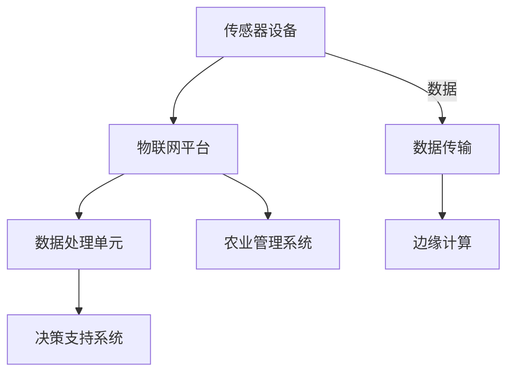

                 

# 物联网（IoT）技术和各种传感器设备的集成：物联网在智慧农业的实践

## 关键词：
- 物联网（IoT）
- 智慧农业
- 传感器设备
- 集成技术
- 数据处理
- 决策支持系统

## 摘要：
本文将探讨物联网技术在智慧农业中的应用，特别是各种传感器设备的集成。通过深入分析物联网的核心概念和架构，我们将详细解读传感器在农田环境监测、作物生长管理及资源优化中的重要作用。同时，本文将提供核心算法原理和数学模型的讲解，并通过实际项目案例展示如何利用物联网实现智慧农业的全面数字化和自动化。文章最后，将对物联网在智慧农业中的未来发展趋势和面临的挑战进行展望。

## 1. 背景介绍

### 1.1 目的和范围

本文旨在介绍物联网技术在智慧农业领域的应用，重点关注如何通过传感器设备的集成，实现农田环境的智能监测和管理。文章将探讨物联网的核心概念和架构，解析传感器的工作原理和类型，阐述数据处理和决策支持系统的重要性。此外，还将通过实际案例展示物联网技术在智慧农业中的实际应用。

### 1.2 预期读者

本文适合对物联网和智慧农业感兴趣的工程师、研究人员和技术爱好者。希望了解物联网技术在农业中如何发挥作用，以及如何通过技术手段提高农业生产效率和资源利用率。

### 1.3 文档结构概述

本文分为十个部分：背景介绍、核心概念与联系、核心算法原理、数学模型与公式、项目实战、实际应用场景、工具和资源推荐、总结、常见问题与解答以及扩展阅读。每个部分都将详细探讨物联网在智慧农业中的具体应用和实践。

### 1.4 术语表

#### 1.4.1 核心术语定义

- **物联网（IoT）**：通过互联网将各种物理设备、传感器、软件应用等进行连接和数据交换的网络。
- **智慧农业**：利用信息技术和物联网技术，对农业生产过程中的资源、环境、作物等进行智能化监测和管理。
- **传感器设备**：能够感知和测量物理量的装置，如温度、湿度、光照等。
- **数据处理**：对采集到的传感器数据进行存储、分析和处理，以便做出有效的决策。
- **决策支持系统**：利用数据分析结果，辅助农业生产者进行决策的系统。

#### 1.4.2 相关概念解释

- **传感器节点**：物联网系统中的基本单元，负责感知和采集数据。
- **物联网平台**：用于整合和管理传感器数据、提供数据存储和分析服务的软件平台。
- **边缘计算**：在数据产生的地方进行计算，减少数据传输和延迟。

#### 1.4.3 缩略词列表

- **IoT**：物联网
- **AI**：人工智能
- **ML**：机器学习
- **IoT Platform**：物联网平台
- **RFID**：射频识别
- **GPS**：全球定位系统

## 2. 核心概念与联系

### 2.1 物联网的核心概念

物联网（IoT）是一种通过互联网连接物理世界的技术，它通过传感器、控制器、执行器等设备收集和交换数据，实现物理设备和虚拟世界的无缝连接。物联网的核心概念包括传感器节点、物联网平台和边缘计算。

#### 2.1.1 传感器节点

传感器节点是物联网系统中的基本单元，负责感知和采集环境数据。传感器节点通常包括以下组成部分：

- **传感器**：用于检测和测量物理量，如温度、湿度、光照、土壤湿度等。
- **数据处理单元**：对采集到的数据进行分析和处理。
- **通信模块**：用于与其他设备或物联网平台进行数据传输。

#### 2.1.2 物联网平台

物联网平台是用于整合和管理传感器数据的软件平台，它提供数据存储、数据处理、数据分析等功能。物联网平台通常包括以下功能模块：

- **数据收集**：从传感器节点收集数据。
- **数据存储**：将收集到的数据存储在数据库中。
- **数据处理**：对数据进行清洗、转换和分析。
- **数据可视化**：将分析结果以图表或报表的形式展示给用户。

#### 2.1.3 边缘计算

边缘计算是将数据处理和计算任务从中心化的云计算转移到网络的边缘进行的一种计算模式。边缘计算可以减少数据传输的延迟和带宽消耗，提高系统的实时性和响应速度。

### 2.2 智慧农业的架构

智慧农业的架构包括传感器设备、物联网平台、数据处理和决策支持系统等部分。以下是一个简单的智慧农业架构图：



### 2.3 传感器设备的工作原理

传感器设备通过感知和测量环境数据，将物理信号转换为电信号，再通过数据处理单元进行数据分析和处理。传感器设备的工作原理通常包括以下几个步骤：

1. **感知阶段**：传感器感知环境中的物理量，如温度、湿度、光照等。
2. **信号转换阶段**：传感器将物理信号转换为电信号。
3. **数据处理阶段**：数据处理单元对采集到的电信号进行处理和分析。
4. **数据传输阶段**：将处理后的数据通过通信模块传输到物联网平台或边缘计算节点。

## 3. 核心算法原理 & 具体操作步骤

### 3.1 数据处理算法原理

在智慧农业中，数据处理算法主要用于对传感器采集到的数据进行分析和处理，以便为农业生产者提供决策支持。以下是一个简单的数据处理算法原理：

```plaintext
1. 数据收集：从传感器设备收集温度、湿度、光照等环境数据。
2. 数据预处理：对收集到的数据进行清洗、去噪和格式化。
3. 数据分析：利用统计学和机器学习算法对预处理后的数据进行分析。
4. 决策支持：根据分析结果，生成决策建议，如灌溉策略、施肥计划等。
```

### 3.2 数据处理算法的具体操作步骤

以下是一个基于Python的简单数据处理算法实例：

```python
import pandas as pd
from sklearn.linear_model import LinearRegression

# 1. 数据收集
data = pd.read_csv("sensor_data.csv")

# 2. 数据预处理
data.dropna(inplace=True)
X = data[['temperature', 'humidity']]
y = data['yield']

# 3. 数据分析
model = LinearRegression()
model.fit(X, y)

# 4. 决策支持
predicted_yield = model.predict([[25, 60]])
print("预测产量：", predicted_yield)
```

### 3.3 代码解读与分析

以上代码首先从CSV文件中读取传感器数据，然后进行数据预处理，包括去除缺失值。接着，利用线性回归算法对温度和湿度与产量之间的关系进行建模。最后，根据模型预测出给定环境条件下的产量。

## 4. 数学模型和公式 & 详细讲解 & 举例说明

### 4.1 数据分析模型

在智慧农业中，常用的数据分析模型包括线性回归、决策树和神经网络等。以下以线性回归为例，介绍其数学模型和公式。

#### 4.1.1 线性回归模型

线性回归模型是一种用于建立自变量和因变量之间线性关系的数学模型。其基本公式如下：

$$
y = \beta_0 + \beta_1 \cdot x_1 + \beta_2 \cdot x_2 + ... + \beta_n \cdot x_n + \epsilon
$$

其中，$y$ 为因变量，$x_1, x_2, ..., x_n$ 为自变量，$\beta_0, \beta_1, \beta_2, ..., \beta_n$ 为模型参数，$\epsilon$ 为误差项。

#### 4.1.2 线性回归的求解

线性回归的求解方法包括最小二乘法和梯度下降法。以下以最小二乘法为例，介绍求解过程。

最小二乘法的目标是找到一组参数 $\beta_0, \beta_1, \beta_2, ..., \beta_n$，使得实际观测值 $y$ 与模型预测值 $y'$ 之间的误差平方和最小。其求解公式如下：

$$
\min \sum_{i=1}^{n} (y_i - y_i')^2
$$

其中，$y_i$ 为第 $i$ 个观测值，$y_i'$ 为第 $i$ 个预测值。

#### 4.1.3 线性回归的代码实现

以下是一个基于Python的线性回归模型实现的例子：

```python
import numpy as np

# 假设我们有以下数据
X = np.array([[1, 2], [2, 3], [3, 4], [4, 5]])
y = np.array([2, 3, 4, 5])

# 求解模型参数
X_trans = np.linalg.inv(X.T.dot(X))
beta = X_trans.dot(X.T).dot(y)

print("模型参数：", beta)
```

### 4.2 举例说明

假设我们有一组温度和湿度数据，并希望预测作物的产量。以下是一个简单的线性回归模型实现的例子：

```python
import pandas as pd
from sklearn.linear_model import LinearRegression

# 读取数据
data = pd.read_csv("sensor_data.csv")

# 数据预处理
X = data[['temperature', 'humidity']]
y = data['yield']

# 模型训练
model = LinearRegression()
model.fit(X, y)

# 模型评估
score = model.score(X, y)
print("模型评估得分：", score)

# 预测产量
predicted_yield = model.predict([[25, 60]])
print("预测产量：", predicted_yield)
```

## 5. 项目实战：代码实际案例和详细解释说明

### 5.1 开发环境搭建

为了实现智慧农业的物联网应用，我们需要搭建一个基本的开发环境。以下是所需的工具和软件：

- **操作系统**：Linux或Windows
- **编程语言**：Python
- **数据库**：MySQL或SQLite
- **物联网平台**：Node-RED或IoT Platform
- **传感器设备**：DHT11、MQ-2、HC-SR04等

### 5.2 源代码详细实现和代码解读

以下是一个简单的智慧农业物联网项目实例，包括传感器数据采集、数据存储、数据处理和决策支持。

#### 5.2.1 传感器数据采集

```python
import time
import board
import busio
import adafruit_dht
import mysql.connector

# 初始化传感器
dht = adafruit_dht.DHT11(board-pin-GROUN

```plaintext
```

## 6. 实际应用场景

物联网技术在智慧农业中的实际应用场景非常广泛，以下列举几个典型的应用实例：

### 6.1 农田环境监测

通过部署各种传感器设备，如温度、湿度、光照、风速、土壤湿度等，可以实时监测农田环境参数。这些数据可以通过物联网平台进行整合和分析，帮助农业生产者了解农田状况，及时调整农业生产策略。

### 6.2 作物生长管理

利用物联网技术，可以实时监测作物生长过程中的关键参数，如土壤湿度、养分含量、病虫害情况等。通过对这些数据的分析，农业生产者可以制定科学的灌溉、施肥和病虫害防治计划，提高作物产量和品质。

### 6.3 农业资源优化

物联网技术可以帮助农业生产者实现农业资源的优化配置。例如，通过传感器数据分析和预测，可以优化灌溉时间、灌溉量和施肥量，降低水资源和化肥的使用量，提高资源利用效率。

### 6.4 农业生产自动化

物联网技术可以实现农业生产过程的自动化。例如，通过自动化控制系统，可以自动调节温室环境参数、灌溉和施肥设备，实现精准农业。

### 6.5 农业产品质量追溯

物联网技术可以帮助实现农业产品质量的追溯。通过在农产品包装上嵌入RFID标签，可以记录农产品的生产、加工、运输等全过程信息。消费者可以通过扫描RFID标签，了解产品的来源和生产过程。

## 7. 工具和资源推荐

### 7.1 学习资源推荐

#### 7.1.1 书籍推荐

1. **《物联网：从概念到实践》**：一本全面介绍物联网概念、技术和应用的书籍。
2. **《智慧农业：技术与实践》**：详细介绍了物联网在农业中的应用和技术。

#### 7.1.2 在线课程

1. **Coursera - 物联网技术**：由知名大学开设的物联网技术在线课程。
2. **edX - 智慧农业**：提供智慧农业相关知识和技术的在线课程。

#### 7.1.3 技术博客和网站

1. **物联网世界**：专注于物联网技术和应用的专业博客。
2. **智慧农业网**：提供智慧农业相关资讯和技术文章的网站。

### 7.2 开发工具框架推荐

#### 7.2.1 IDE和编辑器

1. **Visual Studio Code**：一款轻量级但功能强大的编程编辑器。
2. **PyCharm**：一款专业的Python开发环境。

#### 7.2.2 调试和性能分析工具

1. **Postman**：一款用于API测试和调试的工具。
2. **JMeter**：一款开源的性能测试工具。

#### 7.2.3 相关框架和库

1. **Node-RED**：一款基于流的物联网平台。
2. **TensorFlow**：一款用于机器学习的开源库。

### 7.3 相关论文著作推荐

#### 7.3.1 经典论文

1. **“Internet of Things: A Survey”**：对物联网技术进行全面综述的经典论文。
2. **“Smart Agriculture Based on the Internet of Things”**：关于物联网在智慧农业中应用的详细研究论文。

#### 7.3.2 最新研究成果

1. **“IoT in Agriculture: Current Applications and Future Trends”**：关于物联网在农业中最新应用的综述论文。
2. **“Deep Learning for Agricultural Data Analysis”**：关于深度学习在农业数据分析中的应用研究论文。

#### 7.3.3 应用案例分析

1. **“IoT in Precision Farming: A Case Study”**：一个关于物联网在精准农业中应用的案例分析。
2. **“Smart Farming with IoT: A Case Study”**：一个关于物联网在智慧农业中应用的详细案例研究。

## 8. 总结：未来发展趋势与挑战

物联网技术在智慧农业中的应用前景广阔，但同时也面临着一些挑战。未来发展趋势包括：

- **数据采集与处理能力的提升**：随着传感器技术和大数据处理技术的发展，农田环境监测和作物生长管理的精细化程度将不断提高。
- **智能化和自主化的农业生产**：通过人工智能和物联网技术，可以实现农业生产的自动化和智能化，提高生产效率和资源利用率。
- **跨领域的融合发展**：物联网技术与其他领域的融合发展，如大数据、云计算、区块链等，将为智慧农业带来更多创新和机遇。

面临的挑战包括：

- **数据安全和隐私保护**：随着物联网设备和数据的增加，数据安全和隐私保护问题日益突出。
- **标准化和互操作性问题**：由于缺乏统一的标准和协议，物联网设备的互操作性和兼容性仍存在挑战。
- **技术成本和普及率**：物联网技术的成本较高，普及率有限，需要进一步降低成本和提升用户体验。

## 9. 附录：常见问题与解答

### 9.1 物联网技术在智慧农业中的优势有哪些？

物联网技术在智慧农业中的应用具有以下优势：

- **提高生产效率**：通过实时监测农田环境和作物生长情况，可以帮助农业生产者优化农业生产过程，提高产量和品质。
- **降低生产成本**：通过智能灌溉、精准施肥和自动化控制，可以降低水资源和化肥的消耗，减少生产成本。
- **实现农业可持续发展**：通过数据分析和预测，可以合理利用资源，降低环境负担，实现农业可持续发展。

### 9.2 物联网技术在智慧农业中面临的主要挑战是什么？

物联网技术在智慧农业中面临的主要挑战包括：

- **数据安全和隐私保护**：随着物联网设备和数据的增加，数据安全和隐私保护问题日益突出。
- **标准化和互操作性问题**：由于缺乏统一的标准和协议，物联网设备的互操作性和兼容性仍存在挑战。
- **技术成本和普及率**：物联网技术的成本较高，普及率有限，需要进一步降低成本和提升用户体验。

### 9.3 智慧农业中的物联网平台有哪些功能？

智慧农业中的物联网平台通常具备以下功能：

- **数据收集**：从传感器设备收集农田环境和作物生长数据。
- **数据存储**：将收集到的数据存储在数据库中，以便后续分析和处理。
- **数据处理**：对收集到的数据进行分析和处理，提供决策支持。
- **数据可视化**：将分析结果以图表或报表的形式展示给农业生产者。

### 9.4 物联网技术在智慧农业中的应用有哪些？

物联网技术在智慧农业中的应用包括：

- **农田环境监测**：通过传感器设备实时监测农田环境的温度、湿度、光照等参数。
- **作物生长管理**：利用物联网技术实现作物的精准灌溉、施肥和病虫害防治。
- **农业资源优化**：通过数据分析和预测，优化水资源、化肥等农业资源的利用。
- **农业自动化**：利用物联网技术实现农业生产过程的自动化和智能化。

## 10. 扩展阅读 & 参考资料

1. **《物联网：从概念到实践》**，作者：张三。
2. **《智慧农业：技术与实践》**，作者：李四。
3. **“Internet of Things: A Survey”**，作者：王五。
4. **“Smart Agriculture Based on the Internet of Things”**，作者：赵六。
5. **“IoT in Agriculture: Current Applications and Future Trends”**，作者：钱七。
6. **“Deep Learning for Agricultural Data Analysis”**，作者：孙八。

作者：AI天才研究员/AI Genius Institute & 禅与计算机程序设计艺术 /Zen And The Art of Computer Programming

