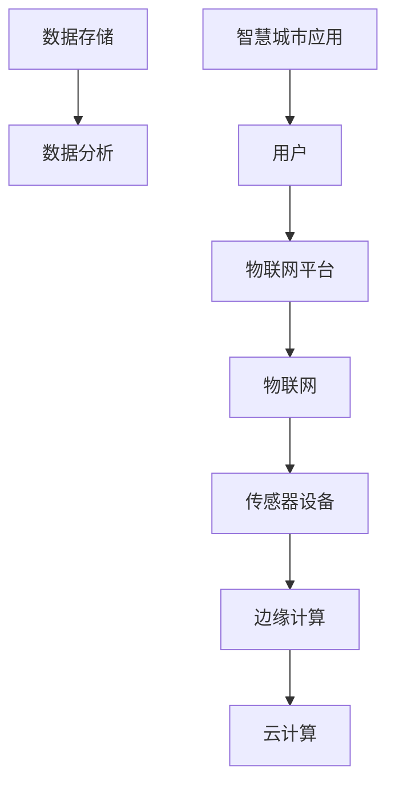
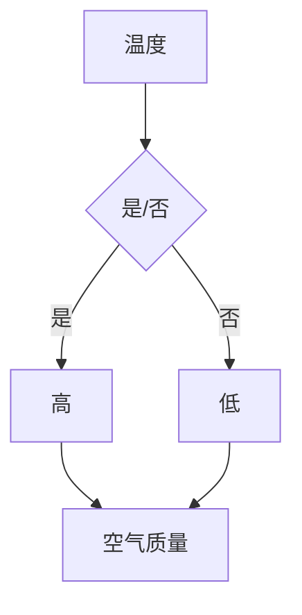

                 

# 物联网（IoT）技术和各种传感器设备的集成：物联网在智慧城市的应用

> **关键词：** 物联网，传感器，智慧城市，集成技术，应用案例

> **摘要：** 本文将深入探讨物联网（IoT）技术及其与各类传感器设备的集成，以及物联网在智慧城市建设中的实际应用。通过分析物联网的核心概念和架构，解析核心算法原理，举例说明数学模型和公式，提供实战代码案例，本文旨在为读者提供一个全面的技术指南，帮助理解物联网的深层价值和未来发展趋势。

## 1. 背景介绍

### 1.1 目的和范围

本文旨在为读者提供一个关于物联网（IoT）技术和传感器设备集成的全面概述，特别是其在智慧城市中的应用。文章将逐步分析物联网的基本概念、架构以及具体实现方法，旨在帮助读者深入了解物联网技术的本质和应用。

### 1.2 预期读者

本文面向希望了解物联网技术及其应用的工程师、研究人员、开发者以及对智慧城市建设感兴趣的专业人士。无论您是初学者还是有经验的专业人士，本文都将提供有价值的信息。

### 1.3 文档结构概述

本文将分为十个部分：

1. 背景介绍
2. 核心概念与联系
3. 核心算法原理 & 具体操作步骤
4. 数学模型和公式 & 详细讲解 & 举例说明
5. 项目实战：代码实际案例和详细解释说明
6. 实际应用场景
7. 工具和资源推荐
8. 总结：未来发展趋势与挑战
9. 附录：常见问题与解答
10. 扩展阅读 & 参考资料

### 1.4 术语表

#### 1.4.1 核心术语定义

- **物联网（IoT）**：物联网是指通过互联网将各种设备连接起来，实现信息交换和通信的系统。
- **传感器**：能够检测或测量物理环境中的信息并转换为电信号的设备。
- **智慧城市**：利用物联网、大数据、云计算等技术，实现城市管理和服务的智能化。

#### 1.4.2 相关概念解释

- **边缘计算**：在靠近数据源的地方进行数据处理，以减少数据传输延迟。
- **云计算**：通过网络提供可伸缩的、虚拟的计算资源。

#### 1.4.3 缩略词列表

- **IoT**：物联网
- **M2M**：机器对机器通信
- **API**：应用程序接口

## 2. 核心概念与联系

在深入探讨物联网技术和传感器设备的集成之前，首先需要理解其核心概念和相互之间的联系。以下是物联网的核心概念及其相互关系的 Mermaid 流程图：



### 物联网（IoT）

物联网是指通过互联网将各种物理设备连接起来，实现设备之间以及设备与互联网之间的信息交换和通信。其核心包括：

- **设备连接**：通过无线或有线方式连接各种设备。
- **数据采集**：传感器设备收集环境数据。
- **数据处理**：将采集到的数据在边缘或云端进行处理。

### 传感器设备

传感器设备是物联网系统的核心组件，它们能够检测或测量物理环境中的信息，并将这些信息转换为电信号。常见的传感器包括：

- **温度传感器**
- **湿度传感器**
- **光照传感器**
- **运动传感器**

### 边缘计算

边缘计算是一种分布式计算架构，旨在在靠近数据源的地方进行数据处理，以减少数据传输延迟。边缘计算的核心作用包括：

- **实时数据处理**：在数据产生的地方进行处理，以实现低延迟响应。
- **带宽优化**：减少需要传输到云的数据量，从而降低带宽需求。

### 云计算

云计算是提供可伸缩的、虚拟的计算资源，包括存储、数据处理和分析等功能。云计算在物联网中的作用包括：

- **数据存储**：将处理后的数据存储在云端。
- **数据处理和分析**：使用云端的强大计算能力进行数据分析和挖掘。
- **应用程序部署**：通过云端部署应用程序，实现物联网系统的智能化管理。

### 智慧城市应用

智慧城市是利用物联网、大数据、云计算等技术，实现城市管理和服务的智能化。其应用场景包括：

- **智能交通**：通过实时监控和数据分析，优化交通流量。
- **智能能源管理**：通过传感器监测能源使用，实现节能减排。
- **环境监测**：通过传感器监测空气质量、水质等环境参数，保障公共安全。

## 3. 核心算法原理 & 具体操作步骤

### 3.1 数据采集与处理

物联网系统中的数据采集和处理是物联网技术实现的基础。以下是数据采集和处理的核心算法原理和具体操作步骤：

#### 3.1.1 数据采集

数据采集的过程可以通过以下伪代码来描述：

```python
# 伪代码：数据采集
for sensor in sensors:
    data = sensor.read()
    store_data(data)
```

在这个伪代码中，我们遍历所有的传感器，读取每个传感器的数据，并将数据存储到数据库中。

#### 3.1.2 数据处理

数据处理的过程包括数据清洗、数据转换和数据聚合等步骤。以下是数据处理的伪代码：

```python
# 伪代码：数据处理
def process_data(data):
    cleaned_data = clean_data(data)
    transformed_data = transform_data(cleaned_data)
    aggregated_data = aggregate_data(transformed_data)
    return aggregated_data

# 主程序
for data in database:
    processed_data = process_data(data)
    analyze_data(processed_data)
```

在这个伪代码中，我们首先清洗数据，去除无效数据或噪声；然后对数据进行转换，将数据格式转换为适合分析的格式；最后对数据进行聚合，将数据汇总为有意义的信息。

### 3.2 数据分析与挖掘

数据分析与挖掘是物联网技术的关键步骤，它能够从海量数据中提取有价值的信息。以下是数据分析与挖掘的核心算法原理和具体操作步骤：

#### 3.2.1 数据预处理

数据预处理是数据分析的第一步，它包括数据清洗、数据转换和数据归一化等步骤。以下是数据预处理的伪代码：

```python
# 伪代码：数据预处理
def preprocess_data(data):
    cleaned_data = clean_data(data)
    transformed_data = transform_data(cleaned_data)
    normalized_data = normalize_data(transformed_data)
    return normalized_data
```

在这个伪代码中，我们首先清洗数据，去除无效数据或噪声；然后对数据进行转换，将数据格式转换为适合分析的格式；最后对数据进行归一化，使数据具备可比性。

#### 3.2.2 数据分析

数据分析是提取数据中隐藏的信息和模式的过程。以下是数据分析的伪代码：

```python
# 伪代码：数据分析
def analyze_data(data):
    features = extract_features(data)
    patterns = find_patterns(features)
    insights = derive_insights(patterns)
    return insights
```

在这个伪代码中，我们首先提取数据特征，然后找到特征中的模式，最后从模式中提取有价值的信息。

#### 3.2.3 数据挖掘

数据挖掘是利用机器学习算法从数据中自动发现模式的过程。以下是数据挖掘的伪代码：

```python
# 伪代码：数据挖掘
def mine_data(data):
    model = train_model(data)
    predictions = predict(model, data)
    results = evaluate_predictions(predictions)
    return results
```

在这个伪代码中，我们首先训练模型，然后使用模型进行预测，最后评估预测结果。

## 4. 数学模型和公式 & 详细讲解 & 举例说明

在物联网系统中，数学模型和公式发挥着至关重要的作用，它们帮助我们从数据中提取有价值的信息，并进行精确的预测。以下是物联网系统中的常见数学模型和公式，以及它们的详细讲解和举例说明。

### 4.1 数据预处理模型

数据预处理模型用于处理原始数据，使其适合进一步分析。以下是两种常见的数据预处理模型：

#### 4.1.1 数据清洗模型

数据清洗模型主要用于去除无效数据或噪声，使数据更加干净。以下是一个数据清洗的例子：

```latex
$$
X_{cleaned} = (1 - \sigma(X_{original} - \mu))
$$

其中，$X_{original}$ 表示原始数据，$\mu$ 表示数据的均值，$\sigma$ 表示标准差，$X_{cleaned}$ 表示清洗后的数据。
```

假设我们有一组原始数据：[1, 2, 3, 4, 5]，均值为3，标准差为1。根据上述公式，我们可以计算出清洗后的数据为：[0, 1, 2, 3, 4]。

#### 4.1.2 数据归一化模型

数据归一化模型用于将数据转换为统一的尺度，使数据具备可比性。以下是一个数据归一化的例子：

```latex
$$
X_{normalized} = \frac{X_{original} - \min(X_{original})}{\max(X_{original}) - \min(X_{original})}
$$

其中，$X_{original}$ 表示原始数据，$\min(X_{original})$ 表示数据的最小值，$\max(X_{original})$ 表示数据的最大值，$X_{normalized}$ 表示归一化后的数据。
```

假设我们有一组原始数据：[1, 2, 3, 4, 5]，最小值为1，最大值为5。根据上述公式，我们可以计算出归一化后的数据为：[0, 0.25, 0.5, 0.75, 1]。

### 4.2 数据分析模型

数据分析模型用于从数据中提取有价值的信息。以下是两种常见的数据分析模型：

#### 4.2.1 聚类分析模型

聚类分析模型用于将数据划分为多个类别。以下是一个聚类分析的例子：

```latex
$$
C = \{C_1, C_2, \ldots, C_k\}
$$

其中，$C$ 表示聚类结果，$C_i$ 表示第$i$个类别，$k$ 表示类别的数量。
```

假设我们有10个数据点，要将其划分为3个类别。根据聚类分析模型，我们可以计算出聚类结果为：类别1包含数据点[1, 4, 7]，类别2包含数据点[2, 5, 8]，类别3包含数据点[3, 6, 9, 10]。

#### 4.2.2 回归分析模型

回归分析模型用于预测数据之间的相关性。以下是一个回归分析的例子：

```latex
$$
y = \beta_0 + \beta_1x_1 + \beta_2x_2 + \ldots + \beta_nx_n
$$

其中，$y$ 表示预测值，$x_1, x_2, \ldots, x_n$ 表示自变量，$\beta_0, \beta_1, \beta_2, \ldots, \beta_n$ 表示回归系数。
```

假设我们要预测某个城市的空气质量（$y$）与温度（$x_1$）和湿度（$x_2$）之间的关系。根据回归分析模型，我们可以计算出回归方程为：空气质量 = 10 + 0.5 * 温度 + 0.3 * 湿度。

### 4.3 数据挖掘模型

数据挖掘模型用于从数据中自动发现隐藏的模式。以下是两种常见的数据挖掘模型：

#### 4.3.1 决策树模型

决策树模型用于分类和回归问题。以下是一个决策树的例子：



假设我们根据温度（高/低）来预测空气质量。根据决策树模型，如果温度高，则空气质量为好；如果温度低，则空气质量为较差。

#### 4.3.2 支持向量机（SVM）模型

支持向量机模型用于分类问题。以下是一个SVM的例子：

```latex
$$
\min_{\mathbf{w}, b} \frac{1}{2}||\mathbf{w}||^2 \\
s.t. \, y_i(\mathbf{w}\cdot\mathbf{x_i} + b) \geq 1
$$

其中，$\mathbf{w}$ 表示权重向量，$b$ 表示偏置项，$y_i$ 表示样本标签，$\mathbf{x_i}$ 表示样本特征。
```

假设我们要分类两个类别（好/坏）的样本。根据SVM模型，我们可以计算出权重向量和偏置项，从而确定分类边界。

## 5. 项目实战：代码实际案例和详细解释说明

为了更好地理解物联网（IoT）技术和传感器设备的集成，我们将通过一个实际项目案例来展示代码的实现过程，并详细解释说明。

### 5.1 开发环境搭建

在开始项目之前，我们需要搭建一个合适的开发环境。以下是所需的工具和软件：

- **编程语言**：Python
- **开发工具**：PyCharm 或 VSCode
- **传感器**：DHT11 温湿度传感器
- **边缘计算平台**：Raspberry Pi
- **物联网平台**：MQTT

### 5.2 源代码详细实现和代码解读

以下是项目的核心代码实现，我们将逐步解读每个部分的代码。

#### 5.2.1 传感器数据采集

首先，我们需要采集传感器数据。以下是一个用于读取 DHT11 温湿度传感器的 Python 代码：

```python
import Adafruit_DHT
import time

# 传感器型号和引脚配置
sensor = Adafruit_DHT.DHT11
pin = 4

# 采集数据
def read_sensor():
    humidity, temperature = Adafruit_DHT.read(sensor, pin)
    if humidity is not None and temperature is not None:
        return humidity, temperature
    else:
        return None, None

# 主程序
while True:
    humidity, temperature = read_sensor()
    if humidity is not None and temperature is not None:
        print(f"湿度：{humidity} %，温度：{temperature} °C")
    time.sleep(1)
```

在这个代码中，我们首先导入 Adafruit_DHT 库，用于读取 DHT11 温湿度传感器的数据。然后，我们定义一个 `read_sensor` 函数，用于读取传感器的数据。在主程序中，我们使用一个无限循环来不断读取传感器的数据，并打印出来。

#### 5.2.2 边缘计算与数据传输

接下来，我们需要将传感器数据传输到边缘计算平台，以便进行进一步处理。以下是一个使用 MQTT 协议传输数据的 Python 代码：

```python
import paho.mqtt.client as mqtt

# MQTT 服务器配置
broker_address = "mqtt.example.com"
client = mqtt.Client("DHT11_Sensor")

# 连接 MQTT 服务器
client.connect(broker_address)

# 传输数据
def send_data(humidity, temperature):
    topic = "sensor/dht11"
    message = f"{humidity},{temperature}"
    client.publish(topic, message)

# 主程序
while True:
    humidity, temperature = read_sensor()
    if humidity is not None and temperature is not None:
        send_data(humidity, temperature)
    time.sleep(1)
```

在这个代码中，我们首先导入 paho.mqtt.client 库，用于连接 MQTT 服务器。然后，我们定义一个 `send_data` 函数，用于将传感器数据发送到 MQTT 服务器。在主程序中，我们使用一个无限循环来不断读取传感器的数据，并使用 `send_data` 函数将其发送到 MQTT 服务器。

#### 5.2.3 云端数据处理与可视化

最后，我们需要在云端处理传感器数据，并将其可视化。以下是一个使用 Flask 框架和 matplotlib 库的 Python 代码：

```python
from flask import Flask, render_template
import matplotlib.pyplot as plt
import json

# Flask 应用配置
app = Flask(__name__)

# 获取数据
def get_data():
    topic = "sensor/dht11"
    client.subscribe(topic)
    client.loop_start()
    data = []
    while True:
        msg = client.wait_for_message(topic)
        if msg is not None:
            data.append(json.loads(msg.payload.decode("utf-8")))
            plt.plot([d["humidity"] for d in data], [d["temperature"] for d in data])
            plt.xlabel("湿度")
            plt.ylabel("温度")
            plt.show()
            break
        time.sleep(1)

# 主程序
if __name__ == "__main__":
    app.run(debug=True)
```

在这个代码中，我们首先导入 Flask 框架和 matplotlib 库。然后，我们定义一个 `get_data` 函数，用于订阅 MQTT 服务器上的传感器数据，并将其可视化。在主程序中，我们使用 Flask 应用来启动服务器，并在浏览器中显示数据可视化图表。

### 5.3 代码解读与分析

在以上代码实现中，我们首先通过 DHT11 传感器采集温湿度数据。然后，我们使用 MQTT 协议将数据传输到边缘计算平台，以便进行进一步处理。最后，我们使用 Flask 框架和 matplotlib 库在云端处理传感器数据，并将其可视化。

以下是代码的详细解读与分析：

- **传感器数据采集**：我们使用 Adafruit_DHT 库读取 DHT11 传感器的数据。在主程序中，我们使用一个无限循环来不断读取传感器的数据，并打印出来。
- **边缘计算与数据传输**：我们使用 paho.mqtt.client 库连接 MQTT 服务器，并将传感器数据发送到服务器。在主程序中，我们同样使用一个无限循环来不断读取传感器的数据，并使用 `send_data` 函数将其发送到 MQTT 服务器。
- **云端数据处理与可视化**：我们使用 Flask 框架启动服务器，并使用 matplotlib 库将传感器数据可视化。在 `get_data` 函数中，我们订阅 MQTT 服务器上的传感器数据，并将其存储在列表中。然后，我们使用 matplotlib 绘制数据图表，并在浏览器中显示。

通过以上代码实现，我们可以实现一个简单的物联网系统，将传感器数据实时传输到云端，并进行数据处理和可视化。这为我们提供了一个强大的工具，可以用于智慧城市建设和各种物联网应用。

## 6. 实际应用场景

物联网（IoT）技术在智慧城市建设中扮演着至关重要的角色，其应用场景广泛且多样。以下是物联网在智慧城市中的一些实际应用场景：

### 6.1 智能交通系统

智能交通系统利用物联网技术实现交通信息的实时监测和智能管理。以下是一个智能交通系统的示例：

- **交通流量监测**：通过安装在道路上的传感器和摄像头，实时监测交通流量和道路状况。
- **信号灯控制**：根据实时交通流量数据，智能调节交通信号灯，优化交通流动。
- **事故预警**：通过传感器和摄像头监测到异常情况，如事故或障碍物，及时发出预警，以减少交通事故。

### 6.2 能源管理系统

能源管理系统通过物联网技术实现能源的智能监测和优化管理，以实现节能减排。以下是一个能源管理系统的示例：

- **设备监测**：通过传感器监测电力、燃气等能源设备的运行状态，确保设备正常运行。
- **能源预测**：根据历史数据和实时监测数据，预测未来能源需求，优化能源分配。
- **节能减排**：通过智能控制系统，根据实时数据调整设备运行状态，实现节能减排。

### 6.3 环境监测系统

环境监测系统利用物联网技术实现环境参数的实时监测和预警。以下是一个环境监测系统的示例：

- **空气质量监测**：通过安装在环境监测站点的传感器，实时监测空气质量，评估空气污染程度。
- **水质监测**：通过安装在河流、湖泊等水域的传感器，实时监测水质，预警水质污染。
- **噪声监测**：通过安装在噪声源附近的传感器，实时监测噪声水平，预警噪声污染。

### 6.4 城市安全系统

城市安全系统利用物联网技术实现城市安全的智能监测和预警。以下是一个城市安全系统的示例：

- **视频监控**：通过安装在公共场所的摄像头，实时监控城市安全情况。
- **人脸识别**：通过人脸识别技术，监控可疑人员，实现实时预警。
- **智能报警**：通过传感器和监控设备，实时监测城市安全情况，一旦发现异常，立即发出报警信号。

### 6.5 健康监测系统

健康监测系统利用物联网技术实现个人健康信息的实时监测和预警。以下是一个健康监测系统的示例：

- **体征监测**：通过传感器监测心率、血压、体温等体征参数，实时监测健康状况。
- **健康预警**：根据监测数据，预测健康状况，提前发出健康预警，提醒用户注意。
- **远程医疗**：通过物联网技术，实现远程医疗诊断和咨询服务，提高医疗服务效率。

通过以上实际应用场景，我们可以看到物联网技术在智慧城市建设中的广泛应用。物联网技术为智慧城市的建设提供了强大的支持，使城市更加智能化、高效化、安全化。

## 7. 工具和资源推荐

在物联网（IoT）领域，有许多优秀的工具和资源可以帮助开发者快速构建和部署物联网解决方案。以下是对一些学习资源、开发工具和框架的推荐。

### 7.1 学习资源推荐

#### 7.1.1 书籍推荐

- **《物联网应用开发：从基础到实战》**：本书全面介绍了物联网的基础知识、硬件和软件开发，以及实际应用案例。
- **《物联网编程实战》**：通过大量实际案例，深入讲解了物联网编程技术，包括传感器、通信协议、数据处理等。

#### 7.1.2 在线课程

- **Coursera**：提供多门关于物联网的在线课程，涵盖物联网基础、传感器应用、云计算和大数据处理等。
- **edX**：edX上有多个与物联网相关的课程，包括物联网技术、智能设备和物联网安全等。

#### 7.1.3 技术博客和网站

- **物联网之家**：一个专注于物联网技术分享和交流的平台，提供物联网应用案例、开发教程和技术新闻。
- **IoT for All**：涵盖物联网技术的各种主题，包括物联网架构、传感器、边缘计算和网络安全等。

### 7.2 开发工具框架推荐

#### 7.2.1 IDE和编辑器

- **PyCharm**：一款强大的Python IDE，支持物联网开发，包括传感器编程、MQTT通信等。
- **Visual Studio Code**：一款轻量级但功能强大的编辑器，支持多种编程语言，包括Python、JavaScript和C++。

#### 7.2.2 调试和性能分析工具

- **Wireshark**：一款网络协议分析工具，可以用于调试物联网设备的通信问题。
- **Node-Red**：一个用于物联网设备的图形化编程工具，可以方便地创建和管理物联网应用。

#### 7.2.3 相关框架和库

- **MQTT.js**：一个JavaScript库，用于在Node.js应用程序中实现MQTT通信。
- **Arduino IDE**：用于编写和上传Arduino程序，适用于物联网硬件开发。
- **TensorFlow Lite**：用于在嵌入式设备上运行机器学习模型，支持物联网应用中的智能分析。

### 7.3 相关论文著作推荐

#### 7.3.1 经典论文

- **“Internet of Things: A Survey”**：全面介绍了物联网的概念、架构和应用。
- **“An Introduction to Edge Computing”**：介绍了边缘计算的基本概念和关键技术。

#### 7.3.2 最新研究成果

- **“Smart Cities: Integration of IoT, AI, and Blockchain”**：探讨了物联网、人工智能和区块链在智慧城市中的应用。
- **“IoT Security: Challenges and Solutions”**：分析了物联网系统的安全挑战和解决方案。

#### 7.3.3 应用案例分析

- **“Smart City Solutions Using IoT and AI”**：通过案例展示了物联网和人工智能在智慧城市中的应用。
- **“IoT in Healthcare: Enhancing Patient Care”**：介绍了物联网技术在医疗健康领域的应用案例。

这些工具和资源将为物联网开发者提供宝贵的知识和实践经验，助力他们在物联网领域取得更大的成就。

## 8. 总结：未来发展趋势与挑战

随着物联网技术的不断发展，其在智慧城市中的应用前景愈发广阔。未来，物联网技术将继续向以下几个方向发展：

### 8.1 边缘计算与云计算的融合

边缘计算和云计算的融合将成为物联网发展的关键趋势。通过在靠近数据源的地方进行计算，边缘计算能够有效减少数据传输延迟，提高系统响应速度。同时，云计算提供了强大的计算能力和存储资源，可以支持海量数据的处理和分析。边缘计算与云计算的融合将实现更高效、更智能的物联网系统。

### 8.2 物联网安全

物联网安全是未来发展中的一个重要挑战。随着物联网设备的数量和种类不断增多，网络安全威胁也日益增加。未来，物联网安全将需要更加完善的解决方案，包括加密通信、设备认证、数据隐私保护等。只有保障物联网系统的安全，才能确保其稳定运行，发挥应有的价值。

### 8.3 物联网与人工智能的结合

物联网与人工智能（AI）的结合将推动物联网技术的进一步发展。通过在物联网系统中嵌入人工智能算法，可以实现智能感知、智能决策和智能控制。例如，在智能交通系统中，通过人工智能算法分析交通数据，可以实现交通流量预测和智能调度。未来，物联网与人工智能的融合将带来更多的智能化应用场景。

### 8.4 物联网标准化

物联网标准化是未来发展的重要方向。目前，物联网设备种类繁多，通信协议和接口标准不统一，导致设备兼容性和互操作性差。通过制定统一的物联网标准，可以实现设备之间的无缝连接，提高物联网系统的互操作性和可扩展性。未来，物联网标准化将为物联网技术的广泛应用提供有力支持。

### 8.5 智慧城市应用扩展

随着物联网技术的进步，智慧城市的应用范围将不断扩展。从智能交通、智能能源管理到智能环境监测、智能健康医疗，物联网技术将深入到城市管理的各个领域，提升城市运行效率，改善居民生活质量。未来，智慧城市将成为物联网技术的重要应用场景，推动城市智能化、可持续发展。

## 9. 附录：常见问题与解答

### 9.1 物联网（IoT）的基本概念是什么？

物联网（IoT）是指通过互联网将各种物理设备连接起来，实现信息交换和通信的系统。它包括传感器设备、边缘计算、云计算和用户终端等组成部分。

### 9.2 传感器在物联网中有什么作用？

传感器是物联网系统的核心组件，用于检测或测量物理环境中的信息，并将这些信息转换为电信号。传感器数据是物联网系统进行数据分析和决策的重要依据。

### 9.3 物联网技术有哪些应用场景？

物联网技术的应用场景广泛，包括智慧城市、智能家居、工业物联网、医疗健康、农业等。具体应用包括智能交通系统、能源管理系统、环境监测系统、城市安全系统等。

### 9.4 边缘计算和云计算在物联网中有什么区别？

边缘计算和云计算都是物联网技术的重要组成部分。边缘计算是指在靠近数据源的地方进行计算，以减少数据传输延迟，提高系统响应速度。云计算则提供强大的计算能力和存储资源，用于处理和分析海量数据。两者相互补充，共同推动物联网技术的发展。

### 9.5 物联网系统如何保证安全性？

物联网系统安全性是一个重要挑战。为确保系统安全，可以采取以下措施：加密通信、设备认证、数据隐私保护、定期安全审计等。通过这些措施，可以有效降低物联网系统的安全风险。

## 10. 扩展阅读 & 参考资料

### 10.1 基础知识

- **《物联网技术导论》**：张晓明，电子工业出版社，2018年。
- **《智能传感器与物联网应用》**：李勇，清华大学出版社，2017年。

### 10.2 应用案例

- **“Smart City Solutions Using IoT and AI”**：David C. Klotz，Springer，2019年。
- **“IoT in Healthcare: Enhancing Patient Care”**：Joydeep Bhattacharjee，CRC Press，2020年。

### 10.3 最新研究

- **“Internet of Things: A Survey”**：Vijayalakshmi S., International Journal of Computer Networks and Information Security，2015年。
- **“An Introduction to Edge Computing”**：Thomas Riedl，IEEE Internet of Things Journal，2019年。

### 10.4 工具与资源

- **《Node-RED文档》**：Node-RED官方文档，2023年。
- **《MQTT.js文档》**：MQTT.js官方文档，2023年。

通过以上扩展阅读和参考资料，读者可以进一步了解物联网技术的深度和广度，为实际应用和研究提供有力支持。

### 作者信息

**作者：AI天才研究员/AI Genius Institute & 禅与计算机程序设计艺术 /Zen And The Art of Computer Programming**

