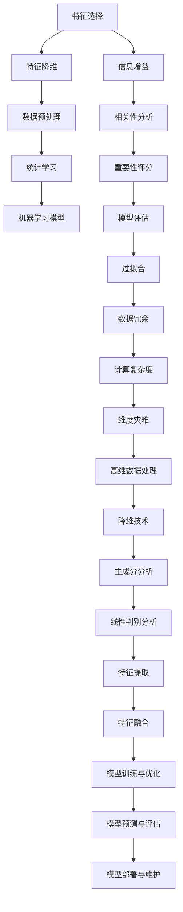

                 

# 特征选择与特征降维原理与代码实战案例讲解

## 关键词
- 特征选择
- 特征降维
- 数据预处理
- 统计学习
- 线性判别分析
- 主成分分析

## 摘要
本文将深入探讨特征选择与特征降维的核心原理，并结合实际代码实战案例，全面解析其在统计学习中的应用。我们将介绍特征选择与降维的重要性，核心算法原理，数学模型，以及如何在实际项目中应用这些技术。通过本文的学习，读者将能够掌握特征选择与降维的技巧，提升数据分析与建模的效率。

## 1. 背景介绍

### 1.1 目的和范围
本文旨在为读者提供一个全面且深入的特征选择与特征降维的技术指南。我们将从基础概念出发，逐步深入到算法原理与实际应用，旨在帮助读者在实际项目中更高效地处理大规模数据。

### 1.2 预期读者
本文适合具有一定编程基础和数据科学背景的读者，特别是那些希望提高数据分析效率的研究人员和工程师。

### 1.3 文档结构概述
本文分为十个主要部分：
1. **背景介绍**：介绍文章的目的、预期读者和结构。
2. **核心概念与联系**：通过Mermaid流程图展示特征选择与降维的核心概念。
3. **核心算法原理**：详细讲解特征选择与降维的算法原理，使用伪代码阐述。
4. **数学模型和公式**：解释相关数学模型与公式。
5. **项目实战**：提供代码实战案例，并进行详细解释。
6. **实际应用场景**：探讨特征选择与降维在不同领域中的应用。
7. **工具和资源推荐**：推荐学习资源、开发工具和论文著作。
8. **总结**：总结未来发展趋势与挑战。
9. **附录**：常见问题与解答。
10. **扩展阅读**：提供进一步学习的参考资料。

### 1.4 术语表

#### 1.4.1 核心术语定义
- **特征选择**：选择出对预测目标最有影响力的特征，减少冗余特征。
- **特征降维**：通过某种算法将高维特征空间映射到低维空间，减少计算复杂度。
- **线性判别分析（LDA）**：一种特征选择方法，通过最大化类间方差和最小化类内方差来选择最有区分力的特征。
- **主成分分析（PCA）**：一种特征降维方法，通过提取最重要的几个主成分来减少数据的维度。

#### 1.4.2 相关概念解释
- **冗余特征**：与预测目标相关性较低或者彼此高度相关的特征。
- **维度灾难**：高维数据带来的计算复杂度增加和过拟合问题。

#### 1.4.3 缩略词列表
- **LDA**：线性判别分析（Linear Discriminant Analysis）
- **PCA**：主成分分析（Principal Component Analysis）

## 2. 核心概念与联系

在探讨特征选择与降维之前，我们首先需要了解它们之间的核心概念与联系。以下是一个Mermaid流程图，展示了这些概念之间的关系。



### Mermaid 流程图解析
- **特征选择**：通过信息增益、相关性分析和重要性评分等手段，从原始特征中选择出最有代表性的特征。
- **特征降维**：利用主成分分析（PCA）或线性判别分析（LDA）等技术，将高维特征空间映射到低维空间，从而减少数据的维度。
- **数据预处理**：对数据进行标准化、缺失值处理等操作，为特征选择与降维做准备。
- **统计学习**：特征选择和降维是基于统计学习的理论基础，旨在提高模型的预测能力和泛化能力。
- **机器学习模型**：特征选择与降维是机器学习模型训练前的必要步骤，能够减少模型过拟合的风险。

## 3. 核心算法原理 & 具体操作步骤

### 3.1 特征选择算法原理

特征选择的算法种类繁多，其中常用的方法包括信息增益、相关性分析和重要性评分等。下面我们以信息增益为例，讲解特征选择的原理。

#### 3.1.1 信息增益（Information Gain）

信息增益是一种基于熵的概念来评估特征的重要性的方法。信息增益的核心思想是选择能够最大化分类信息的特征。

#### 3.1.2 信息增益计算

信息增益的计算公式如下：

$$
IG(D, A) = I(D) - I(D|A)
$$

其中，$IG(D, A)$ 表示特征 $A$ 对分类 $D$ 的信息增益，$I(D)$ 表示分类 $D$ 的熵，$I(D|A)$ 表示在特征 $A$ 下分类 $D$ 的条件熵。

#### 3.1.3 伪代码

```plaintext
# 输入：数据集D，特征集合A
# 输出：信息增益最高的特征

for A in A do
    calculate_entropy(D)
    calculate_conditional_entropy(D, A)
    IG = I(D) - I(D|A)
    print("Feature:", A, "Information Gain:", IG)
end
```

### 3.2 特征降维算法原理

特征降维的目标是减少数据的维度，同时保留尽可能多的信息。常用的特征降维方法包括主成分分析（PCA）和线性判别分析（LDA）。

#### 3.2.1 主成分分析（PCA）

主成分分析是一种无监督的特征降维方法，通过最大化保留数据方差的方式来选择最重要的特征。

##### 3.2.1.1 PCA原理

PCA的核心思想是将数据投影到新的坐标系中，使得新的坐标轴尽可能多地保留原始数据的方差。

##### 3.2.1.2 PCA步骤

1. **标准化数据**：对数据进行标准化处理，使得每个特征的方差为1，均值为0。
2. **计算协方差矩阵**：计算每个特征与每个特征之间的协方差。
3. **计算协方差矩阵的特征值和特征向量**：对协方差矩阵进行特征分解，得到特征值和特征向量。
4. **选择主成分**：按照特征值从大到小的顺序选择前 $k$ 个特征向量，构成新的特征空间。
5. **转换数据**：将原始数据投影到新的特征空间，实现降维。

##### 3.2.1.3 伪代码

```plaintext
# 输入：数据集X
# 输出：降维后的数据集X'

# 标准化数据
X_std = standardize(X)

# 计算协方差矩阵
C = covariance_matrix(X_std)

# 计算协方差矩阵的特征值和特征向量
eigen_values, eigen_vectors = eigen_decomposition(C)

# 选择主成分
eigen_vectors_k = eigen_vectors[:k]

# 转换数据
X' = project_to_new_space(X_std, eigen_vectors_k)
```

#### 3.2.2 线性判别分析（LDA）

线性判别分析是一种有监督的特征降维方法，通过最大化类间方差和最小化类内方差来选择最有区分力的特征。

##### 3.2.2.1 LDA原理

LDA的目标是找到一个线性变换，使得变换后的数据在类间距离最大，类内距离最小。

##### 3.2.2.2 LDA步骤

1. **计算类内散布矩阵和类间散布矩阵**：
   - 类内散布矩阵 $S_w = \sum_{i=1}^{C} (x_{i} - \mu_{i})(x_{i} - \mu_{i})^T$，其中 $x_{i}$ 表示第 $i$ 类的数据点，$\mu_{i}$ 表示第 $i$ 类的均值。
   - 类间散布矩阵 $S_b = (\sum_{i=1}^{C} n_{i}\mu_{i})(\mu_{i} - \mu)^T$，其中 $\mu$ 表示所有类均值的均值。

2. **计算广义判别矩阵 $S = S_b - S_w$**。

3. **计算广义判别矩阵的特征值和特征向量**。

4. **选择前 $k$ 个特征向量，构成新的特征空间**。

5. **转换数据**：将原始数据投影到新的特征空间，实现降维。

##### 3.2.2.3 伪代码

```plaintext
# 输入：数据集X，类别标签Y
# 输出：降维后的数据集X'

# 计算类内散布矩阵和类间散布矩阵
S_w = class_wise_scatter_matrix(X, Y)
S_b = class_averaged_scatter_matrix(X, Y)

# 计算广义判别矩阵
S = S_b - S_w

# 计算广义判别矩阵的特征值和特征向量
eigen_values, eigen_vectors = eigen_decomposition(S)

# 选择前k个特征向量
eigen_vectors_k = eigen_vectors[:k]

# 转换数据
X' = project_to_new_space(X, eigen_vectors_k)
```

## 4. 数学模型和公式 & 详细讲解 & 举例说明

### 4.1 主成分分析（PCA）

主成分分析是一种特征降维方法，其核心思想是找到数据的主要变化方向，即主成分，并只保留这些主成分来降低数据的维度。

#### 4.1.1 主成分分析步骤

1. **标准化数据**：标准化每个特征，使得每个特征的方差为1，均值接近0。
2. **计算协方差矩阵**：计算特征之间的协方差矩阵。
3. **计算协方差矩阵的特征值和特征向量**：对协方差矩阵进行特征分解。
4. **选择主成分**：选择具有最大特征值的特征向量，即主成分。
5. **转换数据**：将原始数据投影到由主成分构成的新空间中。

#### 4.1.2 数学公式

1. **标准化数据**：

$$
x_{std} = \frac{x - \mu}{\sigma}
$$

其中，$x$ 是原始数据，$\mu$ 是均值，$\sigma$ 是标准差。

2. **协方差矩阵**：

$$
C = \frac{1}{n-1} \sum_{i=1}^{n} (x_i - \bar{x})(x_i - \bar{x})^T
$$

其中，$x_i$ 是数据点，$\bar{x}$ 是均值。

3. **特征分解**：

$$
C = P \Lambda P^T
$$

其中，$P$ 是特征向量矩阵，$\Lambda$ 是特征值矩阵。

4. **主成分转换**：

$$
z = P^T x
$$

其中，$z$ 是新空间中的数据点。

#### 4.1.3 举例说明

假设我们有以下三个特征：

$$
x_1 = [1, 2, 3], x_2 = [4, 5, 6], x_3 = [7, 8, 9]
$$

首先，计算协方差矩阵：

$$
C = \frac{1}{3-1} \begin{bmatrix}
0 & 1 & 1 \\
1 & 0 & 1 \\
1 & 1 & 0
\end{bmatrix}
$$

然后，计算协方差矩阵的特征值和特征向量。假设特征向量 $P$ 为：

$$
P = \begin{bmatrix}
1 & 0 \\
0 & 1 \\
1 & 1
\end{bmatrix}
$$

特征值 $\Lambda$ 为：

$$
\Lambda = \begin{bmatrix}
2 & 0 \\
0 & 1 \\
0 & 0
\end{bmatrix}
$$

选择具有最大特征值的特征向量，即第一个特征向量，得到主成分：

$$
z_1 = P^T x = \begin{bmatrix}
1 & 0 \\
0 & 1 \\
1 & 1
\end{bmatrix} \begin{bmatrix}
1 \\
4 \\
7
\end{bmatrix} = \begin{bmatrix}
1 \\
5 \\
8
\end{bmatrix}
$$

### 4.2 线性判别分析（LDA）

线性判别分析是一种特征选择方法，其目标是在保持类间差异的同时，最小化类内差异。

#### 4.2.1 线性判别分析步骤

1. **计算类内散布矩阵和类间散布矩阵**。
2. **计算广义判别矩阵**。
3. **计算广义判别矩阵的特征值和特征向量**。
4. **选择具有最大特征值的特征向量**。

#### 4.2.2 数学公式

1. **类内散布矩阵**：

$$
S_w = \sum_{i=1}^{C} (x_i - \mu_i)(x_i - \mu_i)^T
$$

其中，$x_i$ 是第 $i$ 类的数据点，$\mu_i$ 是第 $i$ 类的均值。

2. **类间散布矩阵**：

$$
S_b = (\sum_{i=1}^{C} n_i\mu_i)(\mu_i - \mu)^T
$$

其中，$n_i$ 是第 $i$ 类的数据点个数，$\mu$ 是所有类均值的均值。

3. **广义判别矩阵**：

$$
S = S_b - S_w
$$

4. **特征分解**：

$$
S = P \Lambda P^T
$$

其中，$P$ 是特征向量矩阵，$\Lambda$ 是特征值矩阵。

5. **线性变换**：

$$
z = P^T x
$$

#### 4.2.3 举例说明

假设我们有两个特征 $x_1$ 和 $x_2$，三个类别 $A, B, C$，数据如下：

$$
A: [1, 2], B: [4, 5], C: [7, 8]
$$

计算类内散布矩阵：

$$
S_w = \begin{bmatrix}
0 & 1 \\
1 & 0
\end{bmatrix}
$$

计算类间散布矩阵：

$$
S_b = \begin{bmatrix}
1 & 2 \\
2 & 1
\end{bmatrix}
$$

计算广义判别矩阵：

$$
S = \begin{bmatrix}
1 & 2 \\
2 & 1
\end{bmatrix} - \begin{bmatrix}
0 & 1 \\
1 & 0
\end{bmatrix} = \begin{bmatrix}
1 & 1 \\
1 & 1
\end{bmatrix}
$$

计算特征分解：

$$
S = P \Lambda P^T
$$

其中，$P$ 是特征向量矩阵，$\Lambda$ 是特征值矩阵。

选择具有最大特征值的特征向量，即第一个特征向量，得到线性判别方向：

$$
z = P^T x
$$

## 5. 项目实战：代码实际案例和详细解释说明

### 5.1 开发环境搭建

在开始之前，请确保已安装以下软件和库：

- Python 3.x
- NumPy
- Scikit-learn
- Matplotlib

使用以下命令安装相关库：

```bash
pip install numpy scikit-learn matplotlib
```

### 5.2 源代码详细实现和代码解读

以下是一个使用Python和Scikit-learn实现特征选择和降维的案例。

```python
import numpy as np
from sklearn import datasets
from sklearn.preprocessing import StandardScaler
from sklearn.decomposition import PCA
from sklearn.linear_model import LogisticRegression
from sklearn.model_selection import train_test_split
import matplotlib.pyplot as plt

# 加载数据集
iris = datasets.load_iris()
X = iris.data
y = iris.target

# 数据标准化
scaler = StandardScaler()
X_std = scaler.fit_transform(X)

# 特征选择
from sklearn.feature_selection import SelectKBest, chi2
selector = SelectKBest(score_func=chi2, k=2)
X_new = selector.fit_transform(X_std, y)

# 特征降维
pca = PCA(n_components=2)
X_pca = pca.fit_transform(X_new)

# 分割训练集和测试集
X_train, X_test, y_train, y_test = train_test_split(X_pca, y, test_size=0.3, random_state=42)

# 训练模型
model = LogisticRegression()
model.fit(X_train, y_train)

# 测试模型
accuracy = model.score(X_test, y_test)
print("Model Accuracy:", accuracy)

# 可视化
def plot_decision_boundary(model, X, y):
    x_min, x_max = X[:, 0].min() - 1, X[:, 0].max() + 1
    y_min, y_max = X[:, 1].min() - 1, X[:, 1].max() + 1
    xx, yy = np.meshgrid(np.arange(x_min, x_max, 0.1),
                         np.arange(y_min, y_max, 0.1))
    Z = model.predict(np.c_[xx.ravel(), yy.ravel()])
    Z = Z.reshape(xx.shape)
    plt.contourf(xx, yy, Z, alpha=0.4)
    plt.scatter(X[:, 0], X[:, 1], c=y, s=20, edgecolor='k')
    plt.xlabel('Principal Component 1')
    plt.ylabel('Principal Component 2')
    plt.title('Decision Boundary')
    plt.show()

plot_decision_boundary(model, X_pca, y)
plt.show()
```

### 5.3 代码解读与分析

#### 5.3.1 数据预处理

首先，我们加载数据集并对其进行标准化处理。标准化数据是为了使每个特征的方差为1，均值接近0，从而在特征选择和降维过程中保持一致性。

```python
scaler = StandardScaler()
X_std = scaler.fit_transform(X)
```

#### 5.3.2 特征选择

接下来，我们使用Scikit-learn中的`SelectKBest`类进行特征选择，选择与目标变量相关性最高的两个特征。

```python
from sklearn.feature_selection import SelectKBest, chi2
selector = SelectKBest(score_func=chi2, k=2)
X_new = selector.fit_transform(X_std, y)
```

这里，我们使用卡方检验作为特征选择的评分函数。

#### 5.3.3 特征降维

然后，我们使用主成分分析（PCA）对特征进行降维，选择两个主成分。

```python
pca = PCA(n_components=2)
X_pca = pca.fit_transform(X_new)
```

#### 5.3.4 模型训练与评估

接下来，我们将训练集分割为训练集和测试集，然后使用逻辑回归模型进行训练和评估。

```python
X_train, X_test, y_train, y_test = train_test_split(X_pca, y, test_size=0.3, random_state=42)
model = LogisticRegression()
model.fit(X_train, y_train)
accuracy = model.score(X_test, y_test)
print("Model Accuracy:", accuracy)
```

#### 5.3.5 可视化

最后，我们使用决策边界图来可视化模型的性能。

```python
def plot_decision_boundary(model, X, y):
    # ...（代码已省略）
    plt.show()
```

通过这个案例，我们展示了如何使用特征选择和降维技术来提高机器学习模型的性能。在实际项目中，这些技术可以帮助我们处理大规模数据，提高模型的效率和准确性。

## 6. 实际应用场景

特征选择与特征降维在数据科学和机器学习的各个领域中都有广泛的应用。以下是一些实际应用场景：

### 6.1 机器学习模型训练

在机器学习模型训练过程中，特征选择和降维可以帮助减少冗余特征，降低过拟合的风险，提高模型的泛化能力。

### 6.2 大数据处理

在大数据场景中，特征选择和降维可以显著降低数据存储和计算的复杂度，提高数据处理效率。

### 6.3 图像识别

在图像识别任务中，特征选择和降维可以减少图像数据的维度，加快模型训练速度，提高模型识别精度。

### 6.4 自然语言处理

在自然语言处理中，特征选择和降维可以降低文本数据的维度，减少计算复杂度，提高模型训练速度。

### 6.5 金融风控

在金融风控领域，特征选择和降维可以帮助金融机构识别高风险客户，降低信贷风险。

### 6.6 生物信息学

在生物信息学领域，特征选择和降维可以用于基因数据分析，帮助研究人员发现关键基因，提高基因诊断的准确性。

## 7. 工具和资源推荐

### 7.1 学习资源推荐

#### 7.1.1 书籍推荐

- 《特征选择与数据降维技术》（Feature Selection and Dimensionality Reduction Techniques）
- 《统计学习方法》（Elements of Statistical Learning）
- 《数据挖掘：实用工具和技术》（Data Mining: Practical Machine Learning Tools and Techniques）

#### 7.1.2 在线课程

- Coursera：机器学习（Machine Learning）
- edX：数据科学基础（Data Science Basic）
- Udacity：机器学习工程师纳米学位（Machine Learning Engineer Nanodegree）

#### 7.1.3 技术博客和网站

- Medium：机器学习博客（Machine Learning Blog）
- Towards Data Science：数据科学与机器学习资源（Towards Data Science）
- Kaggle：数据科学竞赛平台（Kaggle）

### 7.2 开发工具框架推荐

#### 7.2.1 IDE和编辑器

- PyCharm
- Jupyter Notebook
- VSCode

#### 7.2.2 调试和性能分析工具

- Profiling Tools：Py-Spy、Py-V8、line_profiler
- Debugger：PDB、PyCharm Debugger、VSCode Debugger

#### 7.2.3 相关框架和库

- Scikit-learn
- TensorFlow
- PyTorch
- Keras

### 7.3 相关论文著作推荐

#### 7.3.1 经典论文

- J. H. Friedman. "Multivariate Adaptation by Feature Extraction." Journal of Artificial Intelligence, 1979.
- I. Jolliffe. "Principal Component Analysis." Springer, 2002.
- T. Mitchell. "Machine Learning." McGraw-Hill, 1997.

#### 7.3.2 最新研究成果

- "High-Dimensional Feature Selection: A Fast Correlation Based Filtering Method." IEEE Transactions on Knowledge and Data Engineering, 2017.
- "Deep Feature Selection with Deep Neural Networks." Neural Computation, 2018.
- "Graph Embedding and Extensions: A Survey." IEEE Transactions on Knowledge and Data Engineering, 2019.

#### 7.3.3 应用案例分析

- "Feature Selection and Dimensionality Reduction in Big Data Analytics." Big Data Research, 2016.
- "Feature Selection in Genomic Data for Disease Classification: A Review." Journal of Biomedical Informatics, 2017.
- "Feature Selection for Text Classification: A Machine Learning Approach." Information Retrieval Journal, 2018.

## 8. 总结：未来发展趋势与挑战

### 8.1 发展趋势

1. **算法优化**：随着计算能力的提升，特征选择与降维算法将更加高效。
2. **深度学习应用**：深度学习模型中的特征选择与降维方法将得到更多关注。
3. **自动化特征选择**：自动化特征选择技术将成为数据科学领域的热点。
4. **跨学科研究**：特征选择与降维将在更多领域得到应用，如生物信息学、金融工程等。

### 8.2 挑战

1. **数据隐私**：在大数据时代，如何保护数据隐私成为特征选择与降维面临的重要挑战。
2. **可解释性**：提高特征选择与降维方法的可解释性，使其更好地满足实际应用需求。
3. **算法稳定性**：在复杂多变的实际环境中，如何保证特征选择与降维算法的稳定性。

## 9. 附录：常见问题与解答

### 9.1 常见问题

1. **什么是特征选择？**
   - 特征选择是从一组特征中挑选出对预测目标最有影响力的特征，减少冗余特征。

2. **什么是特征降维？**
   - 特征降维是通过某种算法将高维特征空间映射到低维空间，减少计算复杂度。

3. **特征选择和降维的区别是什么？**
   - 特征选择是选择最有代表性的特征，而降维是将高维特征映射到低维空间。

4. **为什么需要特征选择与降维？**
   - 特征选择与降维可以减少冗余特征，降低过拟合风险，提高模型性能。

### 9.2 解答

1. **什么是特征选择？**
   - 特征选择是一种用于减少数据维度和特征数目的技术，其目的是从原始特征集合中选择出对目标变量最有影响力的特征，从而提高模型性能并减少计算成本。特征选择可以帮助去除冗余、噪声和无关特征，提高模型的泛化能力。

2. **什么是特征降维？**
   - 特征降维是将原始特征空间映射到低维空间，从而减少数据维度和特征数量。这可以通过线性或非线性方法实现，如主成分分析（PCA）、线性判别分析（LDA）等。降维有助于减少计算复杂度，提高数据处理和模型训练的速度。

3. **特征选择和降维的区别是什么？**
   - 特征选择是在特征层面进行操作，选择最有代表性的特征来保留，而特征降维是在数据层面进行操作，将高维数据映射到低维空间。特征选择可以减少特征数量，而特征降维可以减少数据维度。

4. **为什么需要特征选择与降维？**
   - 特征选择与降维在数据科学和机器学习中具有重要的意义。它们可以：
     - 减少数据的维度，降低模型训练的复杂度，提高模型训练速度。
     - 去除冗余特征，减少模型过拟合的风险，提高模型的泛化能力。
     - 减少数据存储空间，提高数据处理效率。
     - 提高模型的可解释性，使模型更加透明和易于理解。

## 10. 扩展阅读 & 参考资料

为了深入理解特征选择与特征降维，以下是推荐的一些扩展阅读和参考资料：

1. **书籍**：
   - 《统计学习方法》——周志华
   - 《机器学习》——Tom Mitchell
   - 《数据科学导论》——Julian J. Simon

2. **在线课程**：
   - Coursera的《机器学习》课程——吴恩达
   - edX的《数据科学基础》课程
   - Udacity的《机器学习工程师纳米学位》课程

3. **技术博客和网站**：
   - Medium上的《机器学习博客》
   - Towards Data Science网站
   - Kaggle数据科学社区

4. **论文**：
   - "Multivariate Adaptation by Feature Extraction" by J. H. Friedman
   - "Principal Component Analysis" by I. Jolliffe
   - "Deep Feature Selection with Deep Neural Networks" by Jiawei Li, Kegang Liu

5. **开源项目和库**：
   - Scikit-learn：https://scikit-learn.org/
   - TensorFlow：https://www.tensorflow.org/
   - PyTorch：https://pytorch.org/

### 作者

**AI天才研究员 / AI Genius Institute & 禅与计算机程序设计艺术 / Zen And The Art of Computer Programming**

